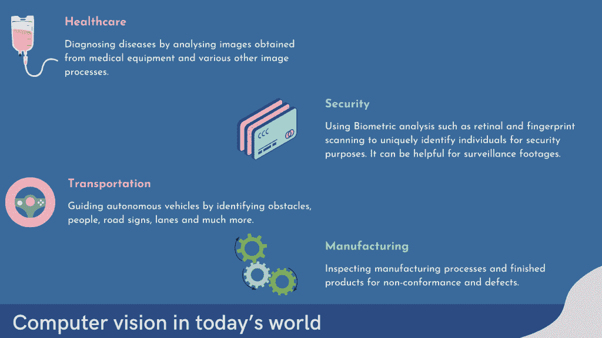
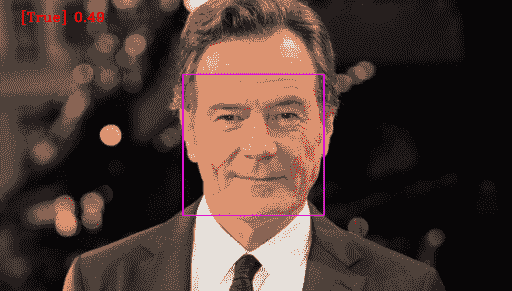
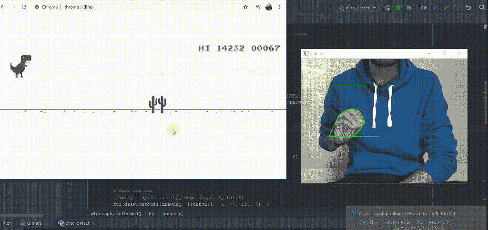
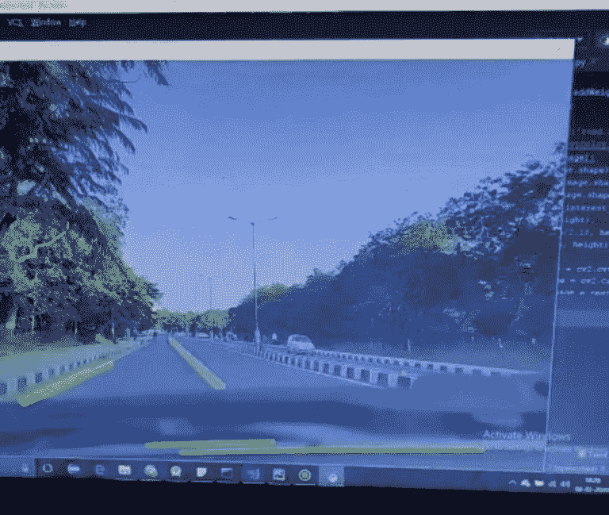

# 你现在可以做的 15 个计算机视觉项目

> 原文：<https://web.archive.org/web/https://neptune.ai/blog/15-computer-visions-projects>

计算机视觉处理计算机如何从图像或视频中提取有意义的信息。它具有广泛的应用，包括逆向工程、安全检查、图像编辑和处理、计算机动画、自主导航和机器人。

**在本文中，我们将探索 15 个伟大的 OpenCV 项目，**从初级到专家级**。**对于每个项目，你都会看到基本指南、源代码和数据集，所以如果你愿意，你可以直接开始工作。

## 什么是计算机视觉？

计算机视觉就是帮助机器解读图像和视频。它是通过数字媒体与对象进行交互，并使用传感器来分析和理解它所看到的东西的科学。这是一个广泛的学科，对机器翻译、模式识别、机器人定位、3D 重建、无人驾驶汽车等等都很有用。

由于不断的技术创新，计算机视觉领域不断发展，变得越来越有影响力。随着时间的推移，它将为研究人员、企业以及最终消费者提供越来越强大的工具。

### 今天的计算机视觉

由于 AI 的进步，计算机视觉近年来已经成为一种相对标准的技术。许多公司将其用于产品开发、销售运营、营销活动、访问控制、安全等。



*Source: Author *

计算机视觉在医疗保健(包括病理学)、工业自动化、军事用途、网络安全、汽车工程、无人机导航等领域有大量的应用——不胜枚举。

## 计算机视觉是如何工作的？

机器学习通过从错误中学习来发现模式。训练数据做一个模型，这个模型对事物进行猜测和预测。现实世界的图像被分解成简单的模式。计算机使用多层神经网络来识别图像中的模式。

第一层获取像素值并尝试识别**边缘**。接下来的几层将尝试**在边缘**的帮助下检测简单的形状。最后，将所有这些放在一起以理解图像。


*Source: Author *

训练一个计算机视觉应用程序可能需要数以千计、有时数百万计的图像。有时甚至这还不够——一些面部识别应用程序无法检测不同肤色的人，因为它们是针对白人进行训练的。有时，应用程序可能无法找出狗和百吉饼之间的区别。最终，算法只会和用于训练它的数据一样好。

好了，介绍够了！让我们进入项目。

## 面向所有经验水平的计算机视觉项目

## 初级计算机视觉项目

如果你是新手或正在学习计算机视觉，这些项目将帮助你学到很多东西。

### 1.边缘和轮廓检测

如果你是计算机视觉的新手，这个项目是一个很好的开始。CV 应用程序首先检测边缘，然后收集其他信息。有许多边缘检测算法，最流行的是 **Canny 边缘检测器**，因为它与其他算法相比非常有效。这也是一种复杂的边缘检测技术。以下是 Canny 边缘检测的步骤:

1.  降低噪声和平滑图像，
2.  计算梯度，
3.  非最大抑制，
4.  门槛翻倍，
5.  链接和边沿检测–滞后。

Canny 边缘检测代码:

```
import cv2
import matplotlib.pyplot as plt

img = cv2.imread('dancing-spider.jpg')

edges = cv2.Canny(img, 100, 200, 3, L2gradient=True)
plt.figure()
plt.title('Spider')
plt.imsave('dancing-spider-canny.png', edges, cmap='gray', format='png')
plt.imshow(edges, cmap='gray')
plt.show()
```

**轮廓**是连接所有连续物体或点(沿边界)的线，具有相同的颜色或强度。例如，它根据叶子的参数或边界来检测叶子的形状。轮廓是形状和物体检测的重要工具。物体的轮廓是构成物体本身形状的边界线。轮廓也被称为轮廓、边缘或结构，有一个很好的理由:它们是标记深度变化的一种方式。

查找轮廓的代码:

```
import cv2
import numpy as np

image = cv2.imread('C://Users//gfg//shapes.jpg')
cv2.waitKey(0)

gray = cv2.cvtColor(image, cv2.COLOR_BGR2GRAY)

edged = cv2.Canny(gray, 30, 200)
cv2.waitKey(0)

contours, hierarchy = cv2.findContours(edged, 
    cv2.RETR_EXTERNAL, cv2.CHAIN_APPROX_NONE)

cv2.imshow('Canny Edges After Contouring', edged)
cv2.waitKey(0)

print("Number of Contours found = " + str(len(contours)))

cv2.drawContours(image, contours, -1, (0, 255, 0), 3)

cv2.imshow('Contours', image)
cv2.waitKey(0)
cv2.destroyAllWindows()
```

**推荐阅读&源代码:**

### 2.颜色检测和隐形斗篷

这个项目是关于检测图像中的颜色。您可以使用它来编辑和识别图像或视频中的颜色。使用颜色检测技术的最流行的项目是隐身衣。在电影中，隐形是通过在绿色屏幕上执行任务来实现的，但在这里我们将通过移除前景层来实现。隐身衣的过程是这样的:

1.  捕获并存储背景帧(仅仅是背景)，
2.  检测颜色，
3.  生成一个掩码，
4.  生成最终输出以创建不可见的效果。

**作用于 HSV(色调饱和度值)。** HSV 是 Lightroom 允许我们更改照片颜色范围的三种方式之一。这对于从图像或场景中引入或移除某些颜色特别有用，例如将夜间拍摄更改为白天拍摄(反之亦然)。就是颜色部分，从 0 到 360 识别。将该分量减少到零会引入更多的灰色并产生褪色效果。

值(亮度)与饱和度结合使用。它描述了颜色的亮度或强度，从 0 到 100%。所以 0 是全黑，100 是最亮的，透露最多的颜色。

****推荐阅读&源代码:****

### 3.使用 OpenCV 和 Tesseract (OCR)进行文本识别

在这里，您在图像上使用 OpenCV 和 OCR(光学字符识别)来识别每个字母并将其转换为文本。它非常适合任何希望从图像或视频中获取信息并将其转化为基于文本的数据的人。许多应用程序使用 OCR，如谷歌镜头、PDF 扫描仪等。

从图像中检测文本的方法:

*   使用 OpenCV–流行，
*   使用深度学习模型——最新的方法，
*   使用您的自定义模型。

**使用 OpenCV 进行文本检测**

处理图像和轮廓检测后的示例代码:

```
def contours_text(orig, img, contours):
for cnt in contours: 
x, y, w, h = cv2.boundingRect(cnt) 

rect = cv2.rectangle(orig, (x, y), (x + w, y + h), (0, 255, 255), 2) 
cv2.imshow('cnt',rect)
cv2.waitKey()

cropped = orig[y:y + h, x:x + w] 

config = ('-l eng --oem 1 --psm 3')
text = pytesseract.image_to_string(cropped, config=config) 
print(text)
```

**使用宇宙魔方进行文本检测**

这是一个开源应用程序，可以识别 100 多种语言的文本，它得到了谷歌的支持。您还可以训练该应用程序识别许多其他语言。

使用 tesseract 检测文本的代码:

```
import cv2
import pytesseract

im = cv2.imread('./testimg.jpg')

config = ('-l eng --oem 1 --psm 3')

text = pytesseract.image_to_string(im, config=config)

text = text.split('\n')
text
```

**推荐阅读&数据集:**

### 4.用 Python 和 OpenCV 实现人脸识别

距离美国电视节目《犯罪现场调查:犯罪现场调查》首播已经过去十多年了。在此期间，面部识别软件变得越来越复杂。如今的软件不受皮肤或头发颜色等表面特征的限制，相反，它根据面部特征识别面部，这些特征通过外观的变化更加稳定，如眼睛形状和两眼之间的距离。这种类型的面部识别被称为“模板匹配”。你可以使用 OpenCV、深度学习或自定义数据库来创建面部识别系统/应用程序。

从图像中检测人脸的过程:

*   查找人脸位置和编码，
*   使用人脸嵌入提取特征，
*   人脸识别，对比那些人脸。



*    Image source: The Times, Face Recognition: Author*

**下面是从图像中识别人脸的完整代码:**

```
import cv2
import face_recognition

imgmain = face_recognition.load_image_file('ImageBasics/Bryan_Cranst.jpg')
imgmain = cv2.cvtColor(imgmain, cv2.COLOR_BGR2RGB)
imgTest = face_recognition.load_image_file('ImageBasics/bryan-cranston-el-camino-aaron-paul-1a.jpg')
imgTest = cv2.cvtColor(imgTest, cv2.COLOR_BGR2RGB)

faceLoc = face_recognition.face_locations(imgmain)[0]
encodeElon = face_recognition.face_encodings(imgmain)[0]
cv2.rectangle(imgmain, (faceLoc[3], faceLoc[0]), (faceLoc[1], faceLoc[2]), (255, 0, 255), 2)

faceLocTest = face_recognition.face_locations(imgTest)[0]
encodeTest = face_recognition.face_encodings(imgTest)[0]
cv2.rectangle(imgTest, (faceLocTest[3], faceLocTest[0]), (faceLocTest[1], faceLocTest[2]), (255, 0, 255), 2)

results = face_recognition.compare_faces([encodeElon], encodeTest)
faceDis = face_recognition.face_distance([encodeElon], encodeTest)
print(results, faceDis)
cv2.putText(imgTest, f'{results} {round(faceDis[0], 2)}', (50, 50), cv2.FONT_HERSHEY_COMPLEX, 1, (0, 0, 255), 2)

cv2.imshow('Main Image', imgmain)
cv2.imshow('Test Image', imgTest)
cv2.waitKey(0)
```

从网络摄像头或直播摄像机中识别人脸的代码:

```
cv2.imshow("Frame", frame)
    if cv2.waitKey(1) &amp; 0xFF == ord('q'):
        break
video_capture.release()
cv2.destroyAllWindows()
```

****推荐阅读&数据集:****

### 5.目标检测

对象检测是对给定图像或视频帧中的对象的自动推断。它用于自动驾驶汽车、跟踪、人脸检测、姿势检测等等。有 3 种主要类型的对象检测-使用 OpenCV，一种基于机器学习的方法和一种基于深度学习的方法。

**下面是检测物体的完整代码:**

```
import cv2

cap = cv2.VideoCapture(0)
cap.set(3, 640)
cap.set(4, 420)

faceCascade = cv2.CascadeClassifier(cv2.data.haarcascades + "haarcascade_frontalface_default.xml")
'''
# if you want to detect any object for example eyes, use one more layer of classifier as below:
eyeCascade = cv2.CascadeClassifier(cv2.data.haarcascades + "haarcascade_eye_tree_eyeglasses.xml")
'''
while True:
success, img = cap.read()
imgGray = cv2.cvtColor(img, cv2.COLOR_BGR2GRAY)

faces = faceCascade.detectMultiScale(imgGray, 1.3, 5)  

for (x, y, w, h) in faces:
img = cv2.rectangle(img, (x, y), (x + w, y + h), (0, 255, 0), 3)
'''
# detecting eyes
eyes = eyeCascade.detectMultiScale(imgGray)
# drawing bounding box for eyes
for (ex, ey, ew, eh) in eyes:
img = cv2.rectangle(img, (ex, ey), (ex+ew, ey+eh), (255, 0, 0), 3)
'''
cv2.imshow('face_detect', img)
if cv2.waitKey(10) & 0xFF == ord('q'):
break
cap.release()
cv2.destroyWindow('face_detect')
```

****推荐阅读&数据集:****

我们正在通过几个中级项目将事情推进到下一个级别。这些项目可能比初学者项目更有趣，但也更具挑战性。

### 6.手势识别

在这个项目中，你需要检测手势。检测到手势后，我们将向它们分配命令。您甚至可以使用手势识别功能通过多个命令玩游戏。

**手势识别的工作原理:**

*   安装 Pyautogui 库——它有助于在没有用户交互的情况下控制鼠标和键盘，
*   将其转换成 HSV，
*   找到轮廓，
*   分配任意值的命令–下面我们使用 5(从手)来跳转。



*Source: Author *

**用手势玩恐龙游戏的完整代码:**

```

contours, hierarchy = cv2.findContours(thresh, cv2.RETR_TREE, cv2.CHAIN_APPROX_SIMPLE)
try:

contour = max(contours, key=lambda x: cv2.contourArea(x))

x, y, w, h = cv2.boundingRect(contour)
cv2.rectangle(crop_image, (x, y), (x + w, y + h), (0, 0, 255), 0)

hull = cv2.convexHull(contour)

drawing = np.zeros(crop_image.shape, np.uint8)
cv2.drawContours(drawing, [contour], -1, (0, 255, 0), 0)
cv2.drawContours(drawing, [hull], -1, (0, 0, 255), 0)

hull = cv2.convexHull(contour, returnPoints=False)
defects = cv2.convexityDefects(contour, hull)

count_defects = 0
for i in range(defects.shape[0]):
s, e, f, d = defects[i, 0]
start = tuple(contour[s][0])
end = tuple(contour[e][0])
far = tuple(contour[f][0])
a = math.sqrt((end[0] - start[0]) ** 2 + (end[1] - start[1]) ** 2)
b = math.sqrt((far[0] - start[0]) ** 2 + (far[1] - start[1]) ** 2)
c = math.sqrt((end[0] - far[0]) ** 2 + (end[1] - far[1]) ** 2)
angle = (math.acos((b ** 2 + c ** 2 - a ** 2) / (2 * b * c)) * 180) / 3.14

if angle <= 90:
count_defects += 1
cv2.circle(crop_image, far, 1, [0, 0, 255], -1)
cv2.line(crop_image, start, end, [0, 255, 0], 2)

if count_defects >= 4:
pyautogui.press('space')
cv2.putText(frame, "JUMP", (115, 80), cv2.FONT_HERSHEY_SIMPLEX, 2, 2, 2)
```

****推荐阅读&源代码:****

### 7.人体姿态检测

许多应用程序使用人体姿势检测来查看玩家在特定游戏(例如棒球)中的表现。**最终目标是定位体内的标志点**。人体姿态检测用于许多现实生活视频和基于图像的应用，包括体育锻炼、手语检测、舞蹈、瑜伽等等。

****推荐阅读&数据集:****

### 8.自主车辆中的道路车道检测

如果你想进入自动驾驶汽车，这个项目将是一个很好的开始。你会发现车道，道路的边缘，等等。车道检测是这样工作的:

*   敷面膜，
*   进行图像阈值处理(阈值处理通过用相应的灰度级替换每个像素> =指定的灰度级来将图像转换为灰度级)，
*   做霍夫线变换(检测车道线)。



*Source: Author *

****推荐阅读&数据集:****

### 9.病理学分类

计算机视觉正在医疗保健领域崭露头角。病理学家一天要分析的数据量可能太多，难以处理。幸运的是，深度学习算法可以识别大量数据中的模式，否则人类不会注意到这些模式。随着更多的图像被输入并分类成组，这些算法的准确性随着时间的推移变得越来越好。

它可以检测植物、动物和人类的各种疾病。对于这个应用程序，目标是从 Kaggle OCT 获取数据集，并将数据分类到不同的部分。该数据集大约有 85000 张图片。光学相干断层扫描(OCT)是一种用于执行高分辨率横截面成像的新兴医疗技术。光学相干断层扫描术利用光波来观察活体内部。它可以用于评估变薄的皮肤、破裂的血管、心脏病和许多其他医学问题。

随着时间的推移，它已经获得了全球医生的信任，成为一种比传统方法更快速有效的诊断优质患者的方法。它还可以用来检查纹身色素或评估烧伤病人身上不同层次的皮肤移植。

用于分类的 Gradcam 库代码:

```
from tf_explain.callbacks.occlusion_sensitivity import OcclusionSensitivityCallback
import datetime
%load_ext tensorboard
log_dir = "logs/fit/" + datetime.datetime.now().strftime("%Y%m%d-%H%M%S")
tensorboard_callback = tf.keras.callbacks.TensorBoard(log_dir=log_dir, histogram_freq=1)
o_callbacks = [OcclusionSensitivityCallback(validation_data=(vis_test, vis_lab),class_index=2,patch_size=4),]
model_TF.compile(optimizer=keras.optimizers.Adam(lr=0.001), loss='binary_crossentropy', metrics=[fbeta])
model_TF.fit(vis_test, vis_lab, epochs=10, verbose=1, callbacks=[tensorboard_callback, o_callbacks])
```

****推荐阅读&数据集:****

### 10.用于图像分类的时尚 MNIST

最常用的 MNIST 数据集之一是手写图像数据库，它包含大约 60，000 个训练图像和 10，000 个从 0 到 9 的手写数字的测试图像。受此启发，他们创建了时装 MNIST，将衣服分类。由于 MNIST 提供的大型数据库和所有资源，您可以获得 96-99%的高准确率。

这是一个复杂的数据集，包含来自 ASOS 或 H&M 等在线商店的 60，000 幅服装(35 个类别)的训练图像。这些图像分为两个子集，一个子集包含与时尚行业类似的服装，另一个子集包含属于普通大众的服装。该数据集包含每个类别的 120 万个样本(衣服和价格)。

****推荐阅读&数据集:****

## 高级计算机视觉项目

一旦你成为计算机视觉专家，你就可以根据自己的想法开发项目。如果你有足够的技能和知识，下面是一些高级的有趣项目。

### 11.使用生成对抗网络的图像去模糊

图像去模糊是一项有趣的技术，有着广泛的应用。在这里，一个生成式对抗网络(GAN)会自动训练一个生成式模型，就像 Image DeBlur 的 AI 算法一样。在研究这个项目之前，让我们先了解什么是 gan 以及它们是如何工作的。

生成对抗网络是一种新的深度学习方法，在各种计算机视觉任务中显示出前所未有的成功，如图像超分辨率。然而，如何最好地训练这些网络仍然是一个公开的问题。一个生成性的对抗网络可以被认为是两个相互竞争的网络；就像人类在像《危险边缘》或《幸存者》这样的游戏节目中相互竞争一样。双方都有任务，需要在整个游戏中根据对手的外貌或招式想出策略，同时也要尽量不被先淘汰。去模糊训练包括 3 个主要步骤:

*   使用发生器创建基于噪声的假输入，
*   用真实和虚假的场景训练它，
*   训练整个模型。

****推荐阅读&数据集:****

### 12.图像变换

有了这个项目，你可以将任何图像转换成不同的形式。例如，您可以将真实图像转换为图形图像。这是一个有创意和有趣的项目。当我们使用标准 GAN 方法时，很难转换图像，但对于这个项目，大多数人使用循环 GAN。

这个想法是你训练两个相互竞争的神经网络。一个网络创建新的数据样本，称为“生成器”，而另一个网络判断它是真是假。生成器改变其参数，试图通过产生更真实的样本来愚弄法官。通过这种方式，两个网络都随着时间的推移而改进，并不断改进——这使得 GANs 成为一个持续的项目，而不是一次性的任务。这是一种不同类型的 GAN，是 GAN 架构的扩展。Gan 所做的循环是创建一个产生输入的循环。假设你正在使用谷歌翻译，你将英语翻译成德语，你打开一个新的标签，复制德语输出，并将德语翻译成英语——这里的目标是获得你的原始输入。下面是一个将图像转换成艺术品的例子。

**推荐阅读&源代码:**

### 13.使用深度神经网络的照片自动着色

当涉及到给黑白图像着色时，机器从来都不能胜任。他们不能理解灰色和白色之间的界限，导致一系列看起来不现实的单色色调。为了克服这个问题，加州大学伯克利分校的科学家和微软研究院的同事一起开发了一种新的算法，通过使用深度神经网络自动给照片着色。

深度神经网络是一种非常有前途的图像分类技术，因为它们可以通过查看许多图片来学习图像的组成。密集连接的卷积神经网络(CNN)已被用于分类图像在这项研究中。CNN 使用大量标记数据进行训练，并输出对应于任何输入图像的相关类别标签的分数。它们可以被认为是应用于原始输入图像的特征检测器。

着色是给黑白照片添加颜色的过程。它可以手工完成，但这是一个繁琐的过程，需要几个小时或几天，这取决于照片的细节水平。最近，用于图像识别任务(如面部识别和文本检测)的深度神经网络出现了爆炸式增长。简单来说，就是给灰度图像或视频添加颜色的过程。然而，随着近年来深度学习的快速发展，卷积神经网络(CNN)可以通过在每像素的基础上预测颜色应该是什么来为黑白图像着色。这个项目有助于给旧照片上色。正如你在下图中看到的，它甚至可以正确地预测可口可乐的颜色，因为有大量的数据集。

**推荐阅读&导读:**

### 14.车辆计数和分类

现在，许多地方都配备了将 AI 与摄像头结合的监控系统，从政府组织到私人设施。这些基于人工智能的摄像头在许多方面都有帮助，其中一个主要功能是统计车辆数量。它可以用来计算经过或进入任何特定地方的车辆数量。这个项目可以用于许多领域，如人群计数，交通管理，车辆牌照，体育，等等。过程很简单:

*   帧差分，
*   图像阈值处理，
*   轮廓寻找，
*   图像膨胀。

最后，车辆计数:

****推荐阅读&数据集:****

### 15.汽车牌照扫描仪

计算机视觉中的车辆牌照扫描仪是一种计算机视觉应用，可用于识别牌照并读取其号码。这项技术用于各种目的，包括执法、识别被盗车辆和追踪逃犯。

计算机视觉中更复杂的车辆牌照扫描仪可以在高速公路和城市街道的繁忙交通条件下，以 99%的准确率每分钟扫描、读取和识别数百甚至数千辆汽车，距离最远可达半英里。这个项目在很多情况下非常有用。

目标是首先检测车牌，然后扫描上面写的数字和文字。它也被称为自动车牌检测系统。过程很简单:

*   捕捉图像，
*   搜索车牌，
*   过滤图像，
*   使用行分段进行行分隔，
*   数字和字符的 OCR。

****推荐阅读&数据集:****

## 结论

就是这样！希望你喜欢计算机视觉项目。最重要的是，我会留给你几个你可能会感兴趣的额外项目。

### 额外项目

*   照片素描
*   拼贴马赛克生成器
*   模糊脸部
*   图象分割法
*   数独求解器
*   目标跟踪
*   水印图像
*   图像反向搜索引擎

### 额外研究和推荐阅读

### 哈希尔·帕特尔

Android 开发者和机器学习爱好者。我热衷于开发移动应用程序、制造创新产品和帮助用户。

**阅读下一篇**

* * *

ML 实验跟踪:它是什么，为什么重要，以及如何实施

## 10 分钟阅读|作者 Jakub Czakon |年 7 月 14 日更新

10 mins read | Author Jakub Czakon | Updated July 14th, 2021

我来分享一个听了太多次的故事。

*“…我们和我的团队正在开发一个 ML 模型，我们进行了大量的实验，并获得了有希望的结果…*

> *…不幸的是，我们无法确切地说出哪种性能最好，因为我们忘记了保存一些模型参数和数据集版本…*
> 
> *…几周后，我们甚至不确定我们实际尝试了什么，我们需要重新运行几乎所有的东西"*
> 
> 不幸的 ML 研究员。
> 
> 事实是，当你开发 ML 模型时，你会进行大量的实验。

这些实验可能:

使用不同的模型和模型超参数

*   使用不同的培训或评估数据，
*   运行不同的代码(包括您想要快速测试的这个小变化)
*   在不同的环境中运行相同的代码(不知道安装的是 PyTorch 还是 Tensorflow 版本)
*   因此，它们可以产生完全不同的评估指标。

跟踪所有这些信息会很快变得非常困难。特别是如果你想组织和比较这些实验，并且确信你知道哪个设置产生了最好的结果。

这就是 ML 实验跟踪的用武之地。

This is where ML experiment tracking comes in. 

[Continue reading ->](/web/20220928184033/https://neptune.ai/blog/ml-experiment-tracking)

* * *