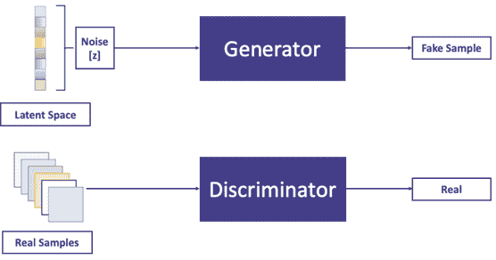
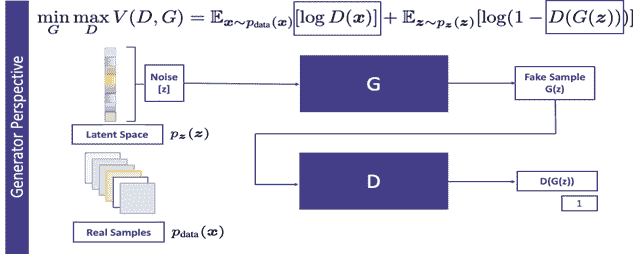
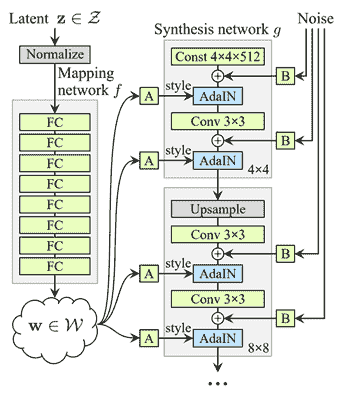
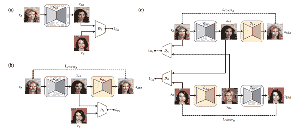

# 你真的应该知道的 6 种 GAN 架构

> 原文：<https://web.archive.org/web/https://neptune.ai/blog/6-gan-architectures>

生成对抗网络(GANs)是由 Ian Goodfellow 等人在 2014 年首次提出的。艾尔。从那时起，这个话题本身就开辟了一个新的研究领域。

几年之内，研究团体提出了大量关于这个主题的论文，其中一些有着非常有趣的名字:)。首先是 CycleGAN，然后是 BiCycleGAN，然后是 ReCycleGAN，依此类推。

随着 GANs 的发明，生成模型开始在生成真实图像方面显示出有希望的结果。甘斯在计算机视觉领域取得了巨大的成功。最近，它开始在音频和文本方面显示出有希望的结果。

一些最受欢迎的 GAN 配方有:

*   将图像从一个域变换到另一个域(CycleGAN)，
*   从文本描述生成图像(文本到图像)，
*   生成非常高分辨率的图像(ProgressiveGAN)等等。

在本文中，我们将讨论一些最流行的 GAN 架构，特别是您应该了解的 ***6 架构*** ，以便对生成性对抗网络(GAN)进行多样化的报道。

即:

*   CycleGAN
*   StyleGAN
*   像素网络
*   文本-2-图像
*   迪斯科根
*   伊斯甘

## 香草甘

在监督学习的背景下有两种模型，生成模型和判别模型。判别模型主要用于解决分类任务，其中模型通常学习决策边界来预测数据点属于哪个类。另一方面，生成模型主要用于生成遵循与训练数据分布相同的概率分布的合成数据点。我们讨论的话题， ***生成性对抗网络(GANs)就是生成性模型*** 的一个例子。

> *生成模型的主要目标是学习对训练观测值进行采样的群体的未知概率分布。一旦模型训练成功，您就可以对遵循训练分布的新的“生成的”观察值进行采样。*

我们来讨论一下 GAN 公式的核心概念。

GAN 由两个独立的网络、一个发生器和一个鉴别器组成。

### GAN 发生器架构

***发生器在给定随机噪声[从潜在空间采样]的情况下生成合成样本，鉴别器是一个二元分类器，用于区分输入样本是真实的[输出标量值 1]还是虚假的[输出标量值 0]。***

由生成器生成的样本被称为假样本。正如您在图 1 和图 2 中看到的，当训练数据集中的一个数据点作为输入提供给鉴别器时，它会将其作为真实样本调用，而当它由生成器生成时，它会将另一个数据点作为假样本调用。



*Fig1: Generator and Discriminator as GAN building blocks*

这个公式的美妙之处在于生成器和鉴别器之间的对立性质。

### GAN 鉴频器架构

鉴别者希望以最好的方式完成自己的工作。 ***当一个[由发生器生成的]假样本被提供给鉴别器时，它想称其为假样本，但发生器想以某种方式生成样本，使鉴别器错误地称其为真样本。在某种意义上，生成器试图欺骗鉴别器。***


*Fig2: Generator and Discriminator as GAN building blocks*

让我们快速看一下目标函数以及优化是如何完成的。 ***这是一个最小-最大优化公式，其中生成器想要最小化目标函数，而鉴别器想要最大化相同的目标函数。***

图 3 描述了被优化的目标函数。鉴别函数称为 D，发生函数称为 g。Pz 是潜在空间的概率分布，通常为随机高斯分布。Pdata 是训练数据集的概率分布。当 x 从 Pdata 中采样时，鉴别器希望将其归类为真实样本。G(z)是一个生成的样本，当 G(z)作为输入被提供给鉴别器时，它想把它归类为一个伪样本。


*Fig3: Objective function in GAN formulation*

***鉴别器想把 D(G(z))的可能性驱动到 0。因此，它希望最大化(1-D(G(z)))，而生成器希望将 D(G(z))的似然性强制为 1，以便鉴别器在调用生成的样本作为真实样本时出错。因此，生成器希望最小化(1-D(G(z))。***



Fig4: Objective function in GAN formulation

CycleGAN

## CycleGAN 是一种非常流行的 GAN 架构，主要用于学习不同风格的图像之间的转换。

作为一个例子，这种提法可以学到:

艺术图像和现实图像之间的映射，

*   马和斑马图像之间的转换，
*   冬季意象与夏季意象的转换
*   等等
*   FaceApp 是 CycleGAN 最受欢迎的例子之一，其中人脸被转换为不同的年龄组。

举个例子，假设 X 是一组马的图像，Y 是一组斑马的图像。

目标是学习一个映射函数 G: X-> Y，使得 G(X)生成的图像与 Y 的图像不可区分。这个公式不仅学习 G，而且还学习逆映射函数 F: Y->X，并使用循环一致性损失来强制 F(G(X)) = X，反之亦然。

> 训练时，给出两种训练观察值作为输入。

一组观察值有成对的图像{Xi，易}用于 I，其中每个 Xi 都有其对应的易。

*   另一组观察具有来自 X 的一组图像和来自 Y 的另一组图像，而在和易之间没有任何匹配。
*   正如我之前提到的，有两种函数正在学习，其中一种是 G，将 X 转换为 Y，另一种是 F，将 Y 转换为 X，它包括两个独立的 GAN 模型。所以，你会发现 2 个鉴别函数 Dx，Dy。


*Fig5: The training procedure for CycleGAN.*

作为对抗性公式的一部分，有一个鉴别器 Dx，用于对转换后的 Y 是否与 Y 不可区分进行分类。类似地，还有一个鉴别器 d Y，用于对是否与 x 不可区分进行分类。

除了对抗损失，CycleGAN 还使用循环一致性损失来实现没有成对图像的训练，并且这种额外的损失帮助模型最小化重建损失 F(G(x)) ≈ X 和 G(F(Y)) ≈ Y

因此，All-in-all CycleGAN 配方包含如下 3 种损失:

作为优化的一部分，下面的损失函数被优化。

让我们来看看来自 CycleGAN 的一些结果。如您所见，该模型已经学会了将斑马图像转换为马图像，将夏季图像转换为冬季图像，反之亦然。

下面是不同损失函数的代码片段。完整的代码流程请参考以下参考。

CycleGAN

下面是一个例子，一个马的图像被转换成一个看起来像斑马的图像。

```

fake_y = generator_g(real_x, training=True)
cycled_x = generator_f(fake_y, training=True)

fake_x = generator_f(real_y, training=True)
cycled_y = generator_g(fake_x, training=True)

same_x = generator_f(real_x, training=True)
same_y = generator_g(real_y, training=True)

disc_real_x = discriminator_x(real_x, training=True)
disc_real_y = discriminator_y(real_y, training=True)

disc_fake_x = discriminator_x(fake_x, training=True)
disc_fake_y = discriminator_y(fake_y, training=True)

gen_g_loss = generator_loss(disc_fake_y)
gen_f_loss = generator_loss(disc_fake_x)

total_cycle_loss = calc_cycle_loss(real_x, cycled_x) + \
                   calc_cycle_loss(real_y,cycled_y)

total_gen_g_loss = gen_g_loss + total_cycle_loss + identity_loss(real_y, same_y)
total_gen_f_loss = gen_f_loss + total_cycle_loss + identity_loss(real_x, same_x)

disc_x_loss = discriminator_loss(disc_real_x, disc_fake_x)
disc_y_loss = discriminator_loss(disc_real_y, disc_fake_y)

```

**参考文献:**

**研究论文:**【https://arxiv.org/pdf/1703.10593.pdf】T2

Tensorflow 有一个关于 CycleGAN 的有据可查的教程。请参考以下网址作为参考:

[https://www.tensorflow.org/tutorials/generative/cyclegan](https://web.archive.org/web/20220928195313/https://www.tensorflow.org/tutorials/generative/cyclegan)

stylenan

## 你能猜出哪个图像(从下面的 2 个图像中)是真实的，哪个是 GAN 生成的吗？

事实是，这两个图像都是由一种叫做 StyleGAN 的 GAN 公式想象出来的。

StyleGAN 是一种 GAN 配方，能够生成非常高分辨率的图像，甚至是 1024*1024 的分辨率。 ***这个想法是建立一个层的堆栈，其中初始层能够生成低分辨率图像(从 2*2 开始),并且进一步的层逐渐增加分辨率。***

GAN 生成高分辨率图像的最简单方法是记住来自训练数据集的图像，并且在生成新图像时，它可以向现有图像添加随机噪声。实际上，StyleGAN 并不这样做，而是学习关于人脸的特征，并生成现实中不存在的人脸的新图像。如果这听起来很有趣，请访问[https://thispersondoesnotexist.com/](https://web.archive.org/web/20220928195313/https://thispersondoesnotexist.com/)每次访问这个网址都会生成一张宇宙中不存在的人脸的新图像。

该图描述了 StyleGAN 的典型架构。潜在空间向量 z 通过由 8 个完全连接的层组成的映射变换，而合成网络由 18 层组成，其中每层产生从 4×4 到 1024×1024 的图像。输出层通过单独的卷积层输出 RGB 图像。这种架构有 2620 万个参数，由于可训练参数的数量非常大，因此该模型需要大量的训练图像来构建成功的模型。



This figure depicts the typical architecture of StyleGAN. The latent space vector z is passed through a mapping transformation comprises of 8 fully connected layers whereas the synthesis network comprises of 18 layers, where each layer produces image from 4 x 4 to 1024 x 1024\. The output layer output RGB image through a separate convolution layer. This architecture has 26.2 million parameters and because of this very high number of trainable parameters, this model requires a huge number of training images to build a successful model.

使用自适应实例规范化(AdaIN)函数对每个层进行规范化，如下所示:

其中每个特征图 xi 被单独归一化，然后使用来自样式 y 的相应标量分量进行缩放和偏置。因此，y 的维数是该层上特征图数量的两倍。

**参考文献:**

论文:[https://arxiv.org/pdf/1812.04948.pdf](https://web.archive.org/web/20220928195313/https://arxiv.org/pdf/1812.04948.pdf)

github:[https://github.com/NVlabs/stylegan](https://web.archive.org/web/20220928195313/https://github.com/NVlabs/stylegan)

像素网络

## PixelRNN 是自回归生成模型的一个例子。

在社交媒体时代，有大量的图片。但是在无人监管的环境下学习自然图像的分布是非常困难的。PixelRNN 能够模拟图像的离散概率分布，并在两个空间维度上预测图像的像素。

我们都知道，rnn 在学习条件分布方面很强大，尤其是 LSTM 擅长学习一系列像素中的长期依赖性。这个公式以渐进的方式工作，其中当提供了所有像素 X [0] 到 X [i] 时，模型预测下一个像素 X [i+1] 。

We all know that RNNs are powerful in learning conditional distribution, especially  LSTM is good at learning the long-term dependency in a series of pixels. This formulation works in a progressive fashion where the model predicts the next pixel X[i+1] when all pixels X[0] to X[i] are provided.

与 gan 相比，PixelRNN 等自回归模型学习显式数据分布，而 gan 学习隐式概率分布。正因为如此，GAN 并没有明确地揭示概率分布，而是允许我们从已知的概率分布中抽样观察。

该图描述了 pixelRNN 的各个剩余块。它被训练到几层深度。PixelRNN LSTM 图层的输入地图具有 2h 要素。输入至状态组件通过在每个门产生 h 个特性来减少特性数量。应用递归图层后，通过 1 × 1 卷积将输出地图向上采样回每个位置 2h 个要素，并将输入地图添加到输出地图。

【来源:[https://arxiv.org/pdf/1601.06759.pdf#page=9&zoom = 100，0，0](https://web.archive.org/web/20220928195313/https://arxiv.org/pdf/1601.06759.pdf#page=9&zoom=100,0,0)

**参考文献:**

论文:[https://arxiv.org/pdf/1601.06759.pdf](https://web.archive.org/web/20220928195313/https://arxiv.org/pdf/1601.06759.pdf)

github:[https://github.com/carpedm20/pixel-rnn-tensorflow](https://web.archive.org/web/20220928195313/https://github.com/carpedm20/pixel-rnn-tensorflow)

文本-2-图像

## 生成性对抗网络擅长生成随机图像。作为一个例子，在猫的图像上被训练的 GAN 可以生成具有两只眼睛、两只耳朵、胡须的猫的随机图像。但是猫身上的颜色图案可能是随机的。因此，随机图像通常对解决业务用例没有用处。现在，要求甘根据我们的期望生成一个图像，是一个极其困难的任务。

在本节中，我们将讨论一种 GAN 架构，它在基于明确的文本描述生成有意义的图像方面取得了重大进展。该 GAN 公式采用文本描述作为输入，并生成文本描述中描述的 RGB 图像。

作为一个例子，给定*“这朵花有许多小的圆形粉红色花瓣”*作为输入，它将生成一朵有圆形粉红色花瓣的花的图像。

在这个公式中，不是只给噪声作为生成器的输入，而是首先将文本描述转换成文本嵌入，与噪声向量连接，然后给生成器作为输入。

> 作为一个例子，文本描述已经被转换成 256 维的嵌入，并与 100 维的噪声向量(从通常为随机正态分布的潜在空间中采样)连接。

这个公式将帮助生成器生成与输入描述一致的图像，而不是生成随机图像。

对于鉴别器，不是将唯一的图像作为输入，而是将一对图像和文本嵌入作为输入发送。输出信号为 0 或 1。早先，鉴别者的职责只是预测一张给定的图像是真是假。

***现在，鉴别者又多了一个额外的责任。除了识别给定图像是可读的还是伪造的，它还预测给定图像和文本是否相互对齐的可能性。***

这个公式迫使生成器不仅生成看起来真实的图像，而且生成与输入文本描述一致的图像。

为了实现鉴别器的双重责任的目的，在训练期间，一系列不同的(图像、文本)对被作为模型的输入给出，如下:

作为输入和目标变量的(真实图像、真实字幕)对被设置为 1

1.  (错误图像，真实字幕)对作为输入，目标变量设置为 0
2.  作为输入和目标变量的(伪图像、真实字幕)对被设置为 0
3.  给定真实图像和真实字幕对，使得模型学习给定图像和文本对是否彼此对齐。错误的图像，阅读说明意味着图像不像说明中描述的那样。在这种情况下，目标变量被设置为 0，以便模型知道给定的图像和标题没有对齐。这里假图像是指由生成器生成的图像，在这种情况下，目标变量被设置为 0，以便鉴别器模型可以区分真实图像和假图像。

用于训练的训练数据集具有图像以及描述图像属性的 10 种不同的文本描述。

以下是来自训练的文本-2-图像模型的一些结果。

**参考文献:**

**研究论文:**【https://arxiv.org/pdf/1605.05396.pdf】T2

**Github:**https://github.com/paarthneekhara/text-to-image[](https://web.archive.org/web/20220928195313/https://github.com/paarthneekhara/text-to-image)

迪科曼

## 最近，DiscoGAN 变得非常受欢迎，因为它能够在无监督数据的情况下学习跨域关系。

对于人类来说，跨域关系是非常自然的。给定两个不同领域的图像，人类可以找出它们之间的关系。例如，在下图中，我们有来自两个不同领域的图像，只需看一眼这些图像，我们就可以很容易地发现它们因其外观颜色的性质而相关联。

现在，在给定来自 2 个不同领域的不成对图像的情况下，建立一个机器学习模型来找出这种关系是一项极其困难的任务。

最近，DiscoGAN 在跨两个不同领域学习这种关系方面显示出有希望的结果。

DiscoGAN 的核心理念与 CycleGAN 非常相似:

两者都学习两个单独的变换函数，一个学习从域 X 到域 Y 的变换，而另一个学习反向映射，并且两者都使用重建损失作为在跨域的两次变换之后原始图像重建得有多好的度量。

*   两者都遵循这样的原则:如果我们将一个图像从一个域 1 转换到域 2，然后再转换回域 1，那么它应该与原始图像匹配。
*   DiscoGAN 和 CycleGAN 之间的主要区别在于，DiscoGAN 使用两个重建损失，一个用于两个域，而 CycleGAN 使用单个循环一致性损失。
*   和 CycleGAN 一样，DiscoGAN 也是建立在重建损失的基础上。其思想是，当图像从一个域变换到另一个域，然后再变换回原始域时，生成的图像应该与原始图像一样接近。在这种情况下，定量差异被认为是重建损失，并且在训练期间，模型试图最小化这种损失。



*Figure: (a) Vanilla GAN (b) GAN with reconstruction loss (c) DiscoGAN architecture*

因此，该模型由两个 GAN 网络组成，分别称为 GAB 和 GBA。在上图中，模型正试图根据它们的方向来学习跨域关系。重建图像后，方向应该与原始方向相同。

**参考文献**:

**研究** **论文**:【https://arxiv.org/pdf/1703.05192.pdf】T4

**Github**:【https://github.com/SKTBrain/DiscoGAN 

伊斯甘

## 最近，生成对抗网络在无监督任务中表现出了令人印象深刻的性能。

在常规 GAN 中，鉴别器使用交叉熵损失函数，这有时会导致消失梯度问题。 ***取而代之，lsGAN 提出对鉴别器使用最小二乘损失函数。*** 这种配方提供了更高质量的图像生成 GAN。

早些时候，在 vanilla GAN 中，我们已经看到了以下最小-最大优化公式，其中鉴别器是二元分类器，并且在优化期间使用 sigmoid 交叉熵损失。

如前所述，对于位于决策边界正确一侧但远离密集区域的数据点，这种公式通常会导致消失梯度问题。最小平方公式解决了这个问题，并提供了模型的更稳定的学习和生成更好的图像。

以下是 lsGAN 的重新制定的优化公式，其中:

a 是假样品的标签，

*   b 是真实样品的标签
*   c 表示发生器希望鉴别器相信的假样本值。
*   现在，我们有两个单独的损失函数正在优化。一个相对于鉴别器最小化，另一个相对于发生器最小化。

与香草 GAN 相比，lsGAN 具有巨大的优势。在普通 GAN 中，由于鉴别器使用二进制交叉熵损失，只要观察值位于决策边界的正确一侧，其损失就是 0。

***但是在 lsGAN 的情况下，如果观察值远离决策边界，即使它在决策边界的正确一侧，该模型也会惩罚该观察值。***

这种惩罚迫使生成器向判定边界生成样本。除此之外，它还消除了渐变消失的问题，因为在更新生成器时，远点会生成更多的渐变。

**参考文献**:

**研究** **论文**:【https://arxiv.org/pdf/1611.04076.pdf】T4

**Github**:【https://github.com/xudonmao/LSGAN 

DiscoGAN 与 cycle gan–检查差异

## DiscoGAN 和 CycleGAN 用于在给定不成对数据的情况下学习跨域关系。DiscoGAN 的目标与 CycleGAN 非常相似。两者都在重建损失的基础上接受训练，并使用前向、后向循环一致性损失来实现双射映射。

这两种模型几乎无法区分，除非损失函数有如下微小差异:

***对于 CycleGAN，L1 距离*** 用于测量输入图像和重建图像之间的循环一致性损失，而 ***L2 距离*** 用作 ***DiscoGAN*** 的距离测量。

CycleGAN 使用一个额外的超参数来控制再生损失和循环一致性损失之间的相对重要性。

最后的想法

## 我们讨论过的所有 GAN 架构都有一个共同点。它们都是建立在对抗性损失原则上的，它们都有生成器和鉴别器，它们遵循对抗性来愚弄对方。GANs 在过去几年中取得了巨大的成功，成为机器学习研究领域最热门的研究课题之一。在未来，我们将看到这个领域的许多进展。

***以下 Git 知识库整理了一份独家的 GAN 论文列表。***

[https://github.com/hindupuravinash/the-gan-zoo](https://web.archive.org/web/20220928195313/https://github.com/hindupuravinash/the-gan-zoo)

参考

### 希布桑卡尔达斯

### 一位高级数据科学家@ WalmartLabs，在此之前，他曾在 Envestnet | Yodlee、微软研究院和凯捷工作。他曾被《印度分析》杂志授予“40 名 40 岁以下数据科学家”，因为他在基础机器学习和分析方面展示了专业知识，特别是在深度学习、生成模型和深度强化学习方面。

**阅读下一篇**

* * *

Python 中的图像处理:你应该知道的算法、工具和方法

## 9 分钟阅读|作者 Neetika Khandelwal |更新于 2021 年 5 月 27 日

9 mins read | Author Neetika Khandelwal | Updated May 27th, 2021

图像定义了世界，每张图像都有自己的故事，它包含了许多在许多方面都有用的重要信息。这些信息可以借助于被称为**图像处理**的技术来获得。

它是计算机视觉的核心部分，在机器人、自动驾驶汽车和物体检测等许多现实世界的例子中起着至关重要的作用。图像处理允许我们一次转换和操作数千幅图像，并从中提取有用的见解。它在几乎每个领域都有广泛的应用。

Python 是为此目的广泛使用的编程语言之一。它惊人的库和工具有助于非常有效地完成图像处理任务。

通过本文，您将了解处理图像并获得所需输出的经典算法、技术和工具。

让我们开始吧！

Let’s get into it!

[Continue reading ->](/web/20220928195313/https://neptune.ai/blog/image-processing-in-python-algorithms-tools-and-methods-you-should-know)

* * *