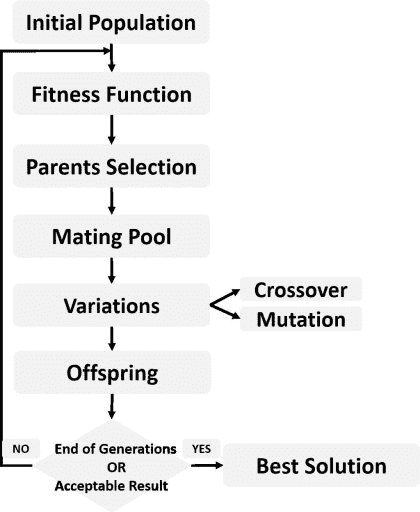
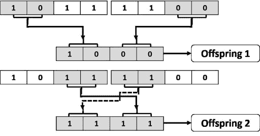
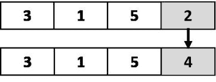

# 遗传算法中的自适应变异与 Python 实例

> 原文：<https://web.archive.org/web/https://neptune.ai/blog/adaptive-mutation-in-genetic-algorithm-with-python-examples>

遗传算法是一种流行的进化算法。它使用达尔文的自然进化理论来解决计算机科学中的复杂问题。但是，要做到这一点，算法的参数需要一点调整。

其中一个关键参数是突变。它使**染色体(即解)发生随机**变化，以提高质量(即适应性)。突变应用于固定数量的基因。传统上，相同数量的基因在所有染色体上发生突变，不管它们的适合度如何。

在本教程中，我们将了解为什么基因数量固定的突变是不好的，以及如何用适应性突变来取代它。使用 [PyGAD Python 3 库](https://web.archive.org/web/20221203083445/https://pygad.readthedocs.io/)，我们将讨论几个使用随机和自适应变异的例子。

## 遗传算法快速概述

遗传算法是一种基于群体的进化算法，其中一组解决方案一起工作来寻找问题的最佳参数。下图来自本书，总结了遗传算法的所有步骤。

解的群体是随机初始化的，其中每个解由许多基因组成。使用适应度函数来评估解决方案的质量，该函数返回表示解决方案的适合程度的数值。



*This figure is copyrighted material in* [*this book*](https://web.archive.org/web/20221203083445/https://www.apress.com/gp/book/9781484241660) *and should not be used without permission.*

高质量(高适应性)的解决方案比低适应性的解决方案存在的时间更长。适应度越高，选择解作为父代产生新后代的概率就越高。为了产生后代，成对的父母使用交叉操作进行交配，在交叉操作中产生携带其父母基因的新解。

在交叉之后，变异被应用于在解决方案上添加一些随机变化。这种进化会持续几代，以达到最高质量的解决方案。

有关遗传算法的更多信息，请阅读本文:遗传算法优化介绍。

即使相同的步骤适用于所有类型的问题，您仍然需要选择合适的参数来适应不同的问题。这些参数包括:

*   群体中解的数量，
*   父选择类型，
*   交叉运算符类型，
*   变异运算符类型，
*   交叉概率，
*   突变概率，
*   健身功能。

例如，有不同类型的父母选择，像排名和轮盘赌，你应该知道在设计特定问题的算法时使用哪一种。

我们要关注的参数是突变概率。那么，我们来回顾一下变异操作，变异概率是高还是低比较好。

## 突变是如何工作的

给定两个亲本进行交配，交配过程中的第一个操作就是杂交。产生的孩子只是从它的两个父母那里转移了一些基因。孩子身上没有什么新东西，因为它的所有基因都已经存在于它的父母身上。下图显示了交叉是如何工作的。



*This figure is copyrighted material in* [*this book*](https://web.archive.org/web/20221203083445/https://www.apress.com/gp/book/9781484241660) *and should not be used without permission.*

如果父母内部有一些不好的基因，杂交后肯定会遗传给孩子。变异操作在解决这个问题中起着至关重要的作用。

在突变过程中，从每个孩子中随机选择一些基因，在这些基因中应用一些随机变化。基于每个基因的随机概率来选择基因。如果基因突变的概率小于或等于预定的阈值，那么该基因将被选择用于突变。否则，它将被跳过。我们稍后会讨论突变概率。

让我们假设解决方案中有 4 个基因，如下图所示，其中只有最后一个基因被选择进行突变。应用随机变化来改变其旧值 **2** ，新值为 **4** 。



*This figure is copyrighted material in* [*this book*](https://web.archive.org/web/20221203083445/https://www.apress.com/gp/book/9781484241660) *and should not be used without permission.*

在简要回顾了随机变异的工作原理后，接下来我们将使用带有随机变异的遗传算法来解决一个问题。

## 随机突变示例

在本教程中，我们将使用一个名为 [PyGAD](https://web.archive.org/web/20221203083445/https://pygad.readthedocs.io/) 的开源 Python 3 库，它提供了一个简单的接口来使用遗传算法解决问题。更多信息，请查看[文档](https://web.archive.org/web/20221203083445/https://pygad.readthedocs.io/)。源代码可在 github.com/ahmedfgad 的[获得。](https://web.archive.org/web/20221203083445/https://github.com/ahmedfgad/GeneticAlgorithmPython)

通过 pip 安装 PyGAD，如下所示:

```py
pip install pygad

```

因为 PyGAD 用的是 Python 3，所以 Linux 和 Mac 用 pip3 代替 pip。

安装后，我们用它来优化一个简单的 4 输入 1 输出的线性方程。

*Y = w1X1 + w2X2 + w3X3 + w4X4*

我们希望获得 w1 至 w4 的值，以使以下等式成立:

*Y = w1(4)+w2(-2)+w3(3.5)+w4(5)*

下面是解决这个问题的 Python 代码:

```py
import pygad
import numpy

function_inputs = [4,-2,3.5,5]
desired_output = 44

def fitness_func(solution, solution_idx):
    output = numpy.sum(solution*function_inputs)
    fitness = 1.0 / (numpy.abs(output - desired_output) + 0.000001)

    return fitness

ga_instance = pygad.GA(num_generations=100,
                       sol_per_pop=5,
                       num_genes=4,
                       num_parents_mating=2,
                       fitness_func=fitness_func,
                       mutation_type="random")

ga_instance.run()

ga_instance.plot_result()
```

需要遵循 3 个步骤:

1.  构建适应度函数，这是一个常规的 Python 函数(最大化函数)。
2.  创建 pygad 的一个实例。GA 级。
3.  调用 run()方法。

适应度函数被命名为 fitness_func()，它必须接受两个参数。这个函数应该返回一个代表解的适合度的数字。该值越高，解决方案越好。

在 pygad 的例子中。GA 类，使用以下参数:

*   `num_generations=100`:世代数。
*   `sol_per_pop=5`:人口规模。
*   `num_genes=4`:基因数量。
*   `num_parents_mating=2`:要交配的父母数量。
*   `fitness_func=fitness_func`:健身功能。
*   `mutation_type="random"`:已经默认为随机的变异操作类型。

要运行遗传算法，只需调用 run()方法。完成后，可以调用 plot_result()方法来显示一个图，该图总结了所有代中最佳解决方案的适应值。

100 代完成后，可以使用 best_solution()返回遗传算法找到的最佳解决方案的一些信息。

最佳解的适应值为 761.4506452116121，w1 到 w4 的值如下:

w1 = 2.26799886
w2 =-0.86295921
w3 = 4.85859239
w4 = 3.2391401

接下来，我们来讨论突变概率的重要性。

## 恒定突变概率

变异操作在遗传算法中至关重要。它通过改变某些基因的值来提高新生孩子的质量。为了决定一个基因是否突变，使用突变概率。

在传统的遗传算法中，变异概率只有一个恒定值。所以，不管解的适应值是多少，都有相同数量的基因变异。

由于是常数，对于每个问题必须使用一个合理的突变概率值。如果概率大，那么很多基因都会发生变异。如果在一个高质量的解决方案中有太多的基因发生突变，那么随机变化可能会破坏太多的基因，从而使这个解决方案变得更糟。对于低质量的解决方案，突变大量的基因有利于提高其质量，因为它改变了许多不好的基因。

另一方面，一个小的突变概率只会导致少数基因发生突变。对于一个高质量的解决方案，只随机改变它的部分基因就能保持它的高质量，并有可能提高它的质量。对于一个低质量的解决方案，它的一小部分基因被改变，所以质量可能仍然很低。

下图总结了之前关于使用恒定突变概率的讨论:

*   小的变异概率对高质量的解是有利的，但对低质量的解是不利的。
*   高变异概率对低质量的解决方案有利，但对高质量的解决方案不利。

接下来，我们将编辑前面的 Python 示例，使用 mutation_probability 参数提供一个恒定的突变概率。

### 恒定变异概率 Python 示例

pygad 在 PyGAD 的构造函数中提供了一个名为 mutation_probability 的参数。GA 类提供一个恒定的变异概率，用于所有解决方案，而不考虑它们的适应性(即质量)。恒定概率是 0.6，这意味着如果基因的随机概率< =0.6，它就是突变的。

```py
import pygad
import numpy

function_inputs = [4,-2,3.5,5]
desired_output = 44

def fitness_func(solution, solution_idx):
    output = numpy.sum(solution*function_inputs)
    fitness = 1.0 / (numpy.abs(output - desired_output) + 0.000001)

    return fitness

ga_instance = pygad.GA(num_generations=100,
                       sol_per_pop=5,
                       num_genes=4,
                       num_parents_mating=2,
                       fitness_func=fitness_func,
                       mutation_type="random",
                       mutation_probability=0.6)

ga_instance.run()

ga_instance.plot_result()
```

如果突变概率是一个非常小的值，比如 0.001，那么解决方案的改进很小。在 100 代之后，最佳解的适应值是 0.077，而在前面的例子中，当概率是 0.6 时，适应值是 328.35。

现在我们将继续讨论适应性变异，它根据解决方案的适应性/质量来调整变异概率。

## 适应性突变

适应性变异最初是在一篇名为[遗传算法中的适应性变异](https://web.archive.org/web/20221203083445/https://link.springer.com/article/10.1007%2Fs005000000042)的论文中提出的。该论文总结了使用恒定突变概率的缺陷:

“经典”GAs 的弱点是突变的完全随机性，这同样适用于所有染色体，而不管它们的适合度如何。因此，一条非常好的染色体和一条不好的染色体一样有可能被突变破坏。

另一方面，坏染色体不太可能通过交叉产生好染色体，因为它们缺乏构建模块，直到它们保持不变。它们将从变异中受益最大，并且可以用于在整个参数空间中传播，以增加搜索的彻底性。因此，在确定最佳突变概率时，有两种相互冲突的需求。"

该论文建议，处理恒定突变概率的最佳方式是选择低概率。请记住，所有解决方案的低变异概率对高质量的解决方案有利，但对低质量的解决方案不利。

“通常，在恒定突变的情况下，合理的妥协是保持低概率以避免好染色体的破坏，但这将防止低适应度染色体的高突变率。因此，恒定的突变概率可能会错过这两个目标，并导致群体的缓慢改善。”

该论文建议使用适应性变异来解决恒定变异的问题。适应性变异是如何工作的:

1.  计算群体的平均适应值(f _ avg)；
2.  对于每个染色体，计算其适应值(f)；
3.  如果 f <f_avg then="" this="" solution="" is="" regarded="" as="" a="">低质量的解，则突变率应该保持较高，因为这将提高该解的质量；</f_avg>
4.  如果 f>f_avg，那么这个解被认为是一个**高质量的**解，因此变异率应该保持较低，以避免破坏这个高质量的解。

在 PyGAD 中，如果 f=f_avg，那么这个解是高质量的。

下图总结了前面的步骤。

接下来，我们将构建一个使用自适应变异的 Python 示例。

## 自适应变异 Python 示例

从 [2.10.0 版本](https://web.archive.org/web/20221203083445/https://github.com/ahmedfgad/GeneticAlgorithmPython/releases/tag/2.10.0)开始，PyGAD 支持自适应变异。确保您至少安装了 PyGAD 2.10.0:

```py
pip install pygad==2.10.*

```

您还可以通过打印 __version__ 属性来检查是否安装了 PyGAD 2.10.0，如下所示:

```py
import pygad

print(pygad.__version__)

```

要在 PyGAD 中使用适应性变异，您需要做以下更改:

1.  将 mutation_type 参数设置为“adaptive”:mutation _ type = " adaptive "；
2.  将恰好具有 2 个值的 list/tuple/numpy.ndarray 赋给 mutation_probability 参数。这是一个例子:突变 _ 概率=[0.57，0.32]。第一个值 0.57 是低质量解决方案的变异概率。第二个值 0.32 是低质量解决方案的突变率。PyGAD 期望第一个值大于第二个值。

下一段代码使用自适应变异来解决线性问题。

```py
import pygad
import numpy

function_inputs = [4,-2,3.5,5]
desired_output = 44

def fitness_func(solution, solution_idx):
    output = numpy.sum(solution*function_inputs)
    fitness = 1.0 / (numpy.abs(output - desired_output) + 0.000001)

    return fitness

ga_instance = pygad.GA(num_generations=100,
                       sol_per_pop=5,
                       num_genes=4,
                       num_parents_mating=2,
                       fitness_func=fitness_func,
                       mutation_type="adaptive",
                       mutation_probability=[0.6, 0.2])

ga_instance.run()

ga_instance.plot_result()
```

在一次运行中，在 100 代之后找到的适应值是 974，并且 4 个参数 w1 到 w4 如下:

w1 = 2.73998896
w2 =-2.7606857
23 =-1.67836889，
w4=6.67838764

下图显示了最佳解决方案的适应值如何随着每一代而变化。

PyGAD 不使用 mutation_probability 参数，而是支持使用具有自适应变异的其他参数:

1.  `mutation_percent_genes`:要突变的基因的百分比。例如，如果解有 100 个基因和`mutation_percent_genes=20`，那么有 20 个基因发生突变。
2.  `mutation_num_genes`:明确指定要变异的基因数量。

像 mutation_probability 参数一样，`mutation_percent_genes`和`mutation_num_genes`都接受一个 list/tuple/numpy.ndarray，当`mutation_type=adaptive`时正好有两个元素。

## 结论

就是这样！我们已经讨论了遗传算法和自适应变异，自适应变异基于解的适合度来选择变异概率。

我们从遗传算法的概述开始，重点放在变异操作上。您看到了使用恒定变异概率的缺点，以及如何用适应性变异来解决它们。我希望你喜欢这个教程。查看 [PyGAD](https://web.archive.org/web/20221203083445/https://pygad.readthedocs.io/) 库，实现常量和自适应变异。感谢阅读！

### 了解更多信息

1.  [Ahmed Fawzy Gad，*使用深度学习的实际计算机视觉应用与 CNN*，Apress，978-1484241660，2018](https://web.archive.org/web/20221203083445/https://www.amazon.ca/Practical-Computer-Vision-Applications-Learning/dp/1484241665)
2.  利贝利、马尔西利和阿尔瓦。"遗传算法中的适应性变异."软计算 4.2 (2000): 76-80
3.  [丹·西蒙，进化优化算法，威利，978-0470937419，2013 年](https://web.archive.org/web/20221203083445/https://www.amazon.ca/Evolutionary-Optimization-Algorithms-Dan-Simon/dp/0470937416)
4.  [Ahmed Gad，遗传算法优化导论，数据科学](https://web.archive.org/web/20221203083445/https://towardsdatascience.com/introduction-to-optimization-with-genetic-algorithm-2f5001d9964b)