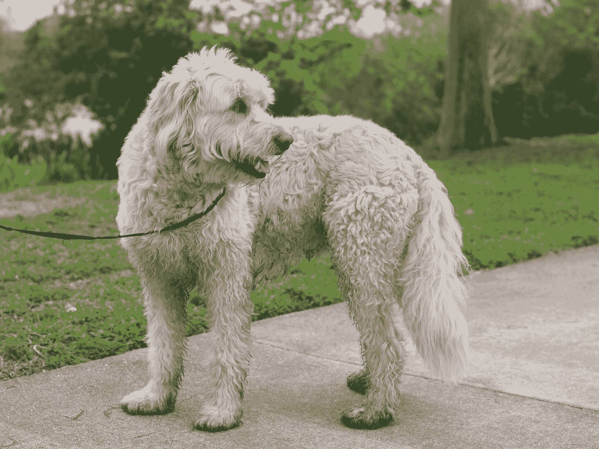
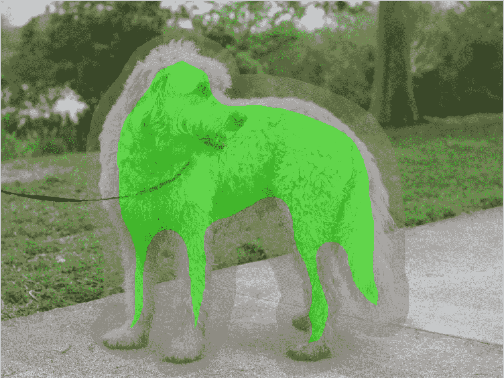

# 深度学习指南:选择您的数据注释工具

> 原文：<https://web.archive.org/web/https://neptune.ai/blog/annotation-tool-comparison-deep-learning-data-annotation>

我们都知道[数据标注](https://web.archive.org/web/20221206103552/https://appen.com/blog/data-annotation/)是什么。这是任何有监督的深度学习项目的一部分，包括计算机视觉。常见的计算机视觉任务，如图像分类、对象检测和分割，需要将每幅图像的注释输入到模型训练算法中。

你必须得到一个好的图像注释工具。在这篇文章中，我们将检查我作为深度学习工程师的职业生涯中工作过的几个最佳选择。尽管它们有相同的最终目标，但每个注释工具都非常独特，各有利弊。

为了比较它们，让我们定义一个标准列表，帮助您选择最适合您、您的团队和您的项目的工具。

选择正确的数据注记工具的标准如下:

*   效率，
*   功能性，
*   格式化，
*   应用程序，
*   价格。

### 效率

现在有很多图片可供深度学习工程师使用。注释本质上是手动的，所以图像标记可能会消耗大量的时间和资源。寻找尽可能节省手工注释时间的工具。诸如方便的用户界面(UI)、热键支持以及其他节省我们时间和提高注释质量的特性。这就是效率的意义所在。

### 功能

计算机视觉中的标签会根据您正在处理的任务而有所不同。例如，在分类中，我们需要一个标签(通常是一个整数)来明确定义给定图像的类别。

目标检测是计算机视觉中更高级的任务。就注释而言，对于每一个对象，您都需要一个类标签，以及一个边界框的一组坐标，该边界框明确说明给定对象在图像中的位置。

语义分割需要类别标签和具有对象轮廓的像素级遮罩。

因此，根据您正在处理的问题，您应该有一个注释工具来提供您需要的所有功能。根据经验，拥有一个可以为您可能遇到的各种计算机视觉任务注释图像的工具是非常好的。

### 格式化

注释有不同的格式:COCO JSONs、Pascal VOC XMLs、TFRecords、文本文件(csv、txt)、图像遮罩等等。我们总是可以将注释从一种格式转换为另一种格式，但是拥有一个可以直接以目标格式输出注释的工具是简化数据准备工作流的一个很好的方法，并且可以节省大量时间。

### 应用

你正在寻找一个基于网络的注释应用程序吗？也许你有时会离线工作，但仍然需要做注释，并且想要一个可以在线和离线使用的窗口应用程序？在你的项目中，这些可能是重要的问题。

一些工具同时支持窗口应用程序和基于网络的应用程序。其他的可能只基于网络，所以你不能在网络浏览器窗口之外使用它们。在寻找注释工具时，请记住这一点。

如果您使用敏感数据，请考虑隐私问题:将您的数据上传到第三方 web 应用程序会增加数据泄露的风险。您愿意冒这个风险，还是选择更安全的本地注释者？

### 价格

价格总是很重要。从我个人的经验来看，大多数中小型团队的工程师倾向于寻找免费工具，这也是我们在本文中要关注的。

为了公平的比较，我们也来看看付费解决方案，看看它们是否值得。我们将看看付费解决方案有意义并实际产生附加价值的情况。

在我对每个注释工具的评论中，你不会看到“最好”或“最差”。对我们每个人来说，“最好的”工具是满足我们个人需求和环境的工具。

我将描述**五大注释工具**，希望你能为自己选择一个。这些工具已经被证明具有良好的性能，并且在深度学习工程师中非常有名。我有机会使用这些工具，我很高兴与您分享我的经验。让我们跳进来吧！

LabelImg 是一个免费的开源注释器。它有一个 [Qt](https://web.archive.org/web/20221206103552/https://en.wikipedia.org/wiki/Qt_(software)) 图形界面，所以你可以安装它并且**在任何操作系统**上本地使用它。界面非常简单直观，所以学习曲线不会特别陡。

LabelImg 可以输出多种格式的注释，包括 Pascal VOC XMLs 和 YOLO 的 txts。它还可以通过一些额外的步骤输出[CSV](https://web.archive.org/web/20221206103552/https://github.com/tzutalin/labelImg/tree/master/tools)和 [TFRecords](https://web.archive.org/web/20221206103552/https://github.com/tensorflow/models/blob/4f32535fe7040bb1e429ad0e3c948a492a89482d/research/object_detection/g3doc/preparing_inputs.md#generating-the-pascal-voc-tfrecord-files) 。

LabelImg **支持** [**热键**](https://web.archive.org/web/20221206103552/https://github.com/tzutalin/labelImg/tree/master/tools) 改进标注过程，使之更加方便。用户还可以享受标签图像验证功能。

LabelImg 有一个，但是非常重要的缺点——它**只支持** [**包围盒**](https://web.archive.org/web/20221206103552/https://computersciencewiki.org/index.php/Bounding_boxes#:~:text=Bounding%20boxes%20are%20imaginary%20boxes,Bounding%20box%20on%20a%20road.) **用于注释**。还值得一提的是，LabelImg 严格来说是一个基于窗口的应用程序，没有浏览器支持。如果这些限制对您来说是可以接受的，那么 LabelImg 确实是项目注释器的一个很好的候选对象。

对于更详细的审查，指导安装和注释过程演示，我推荐观看由[人工智能家伙](https://web.archive.org/web/20221206103552/https://www.youtube.com/channel/UCrydcKaojc44XnuXrfhlV8Q)创建的[本教程](https://web.archive.org/web/20221206103552/https://www.youtube.com/watch?v=EGQyDla8JNU)。

VIA 是另一个应该在您的观察列表中的图像注释工具。这是一个免费的开源解决方案，由牛津大学的一个团队开发。

与 LabelImg 不同，VGG 图像注释器完全在浏览器窗口中运行**。尽管这是一款基于网络的应用，但用户可以在大多数网络浏览器中离线工作。这款应用适合轻量级的 HTML 页面。**

VIA 具有广泛的功能。您可以在对象周围绘制不同的区域形状。不仅仅是边界框，VGG 图像注释器还支持圆形，椭圆形，多边形，点和折线。

VIA 还可以**注释视频帧、音频片段和视频字幕**。如果您想要一个通用但简单的工具，VIA 可能是一个不错的选择。

它有加速注释过程的基本键盘快捷键。我个人喜欢热键在 VIA 中的工作方式。极其方便，井井有条。

最终注释文件只能以**有限的格式**导出:COCO JSONs、Pascal VOC XMLs 和 CSV 是支持的格式。要将注释转换成其他类型的格式，将需要额外的外部转换，所以在做出决定时要考虑到这一点。

要试用 VGG 图像注释器，请查看带有预加载数据的演示。以下是一些您可以浏览的使用案例:

如果你想知道注释过程是如何在 VIA 中执行的，这是 [BigParticle 的](https://web.archive.org/web/20221206103552/https://www.youtube.com/channel/UC19Fw_cAwfPc4LgdpZgXIUQ)[指导教程](https://web.archive.org/web/20221206103552/https://www.youtube.com/watch?v=-3WVSxNLk_k)。云会给你一个很好的概述。

CVAT 的用户界面(UI)根据许多专业注释团队的反馈进行了优化。正因为如此，CVAT 为图像和视频注释做了非常好的设计。

你可以从 [CVAT 的](https://web.archive.org/web/20221206103552/https://cvat.org/)网站开始注释工作，并在**基于网络的应用**中完全在线工作。不过，CVAT 的网站有一些局限性:

*   你只能上传 500 mb 的数据，

幸运的是，你可以在本地安装它，甚至离线工作。安装是[很好的记录](https://web.archive.org/web/20221206103552/https://github.com/openvinotoolkit/cvat/blob/develop/cvat/apps/documentation/installation.md)，所有的操作系统都被支持。

支持的形状形式包括矩形，多边形，折线，点，甚至长方体，标签和轨道。与以前的注释器相比，CVAT **支持语义分割的注释**。

用于导出的**支持的注释格式**的数量令人印象深刻。以下是截至 2021 年 3 月的完整列表:

*   CVAT(消歧义)
*   我是大地之神
*   Pascal VOC(XML)
*   Pascal VOC 的分段掩码
*   YOLO
*   COCO 对象检测(jsons)
*   tfrecords . tfrecords . tfrecords . tfrecords . tfrecords
*   一个字
*   标签 3.0
*   ImageNet
*   坎维德
*   宽脸
*   VGGFace2
*   市场-1501

团队会发现 CVAT 特别有用，因为它是如此的**协作**。CVAT 允许用户创建注释任务，并将工作分配给其他用户。此外，可以使用[elastic search logstash kibana](https://web.archive.org/web/20221206103552/https://www.elastic.co/)对注释作业进行监控、可视化和分析。有机会控制贴标过程、可视化进度并根据监控结果进行管理总是很棒的。

**快捷键涵盖了最常见的动作**，在实际标注工作中帮助很大。

**使用预训练模型的自动注释**可用。用户可以从[模型动物园](https://web.archive.org/web/20221206103552/https://github.com/openvinotoolkit/cvat#deep-learning-serverless-functions-for-automatic-labeling)中选择一个模型，或者连接一个定制模型。

它有一些缺陷。像**有限的浏览器支持**给 CVAT 的客户端。它只在谷歌 Chrome 中运行良好。CVAT 没有针对其他浏览器进行测试和优化。这就是为什么你可以在其他浏览器中得到不稳定的操作，虽然并不总是如此。我不使用谷歌 Chrome，也没有看到性能的明显下降，只是一些小问题没有困扰我。

为了了解什么是 CVAT 及其用户界面，你可以尝试在 CVAT 的网站上进行在线演示，或者观看由 T4 尼基塔·马诺维奇制作的关于 T2 对象注释过程的视频。

*VoTT was designed to fit into the end to end machine learning workflow.
Image from the official [Microsoft’s github page](https://web.archive.org/web/20221206103552/https://github.com/microsoft/VoTT)*

微软提出了自己的数据标注解决方案——可视对象标记工具(VoTT)。免费的开源工具，在数据科学家和机器学习工程师中享有很好的声誉。

微软表示，“VoTT 有助于促进端到端的机器学习管道”。它有三个主要特点:

*   它标记图像或视频帧的能力；
*   用于从本地或云存储提供商导入数据的可扩展模型；
*   用于将标记数据导出到本地或云存储的可扩展模型。

有一个网络应用程序和一个本地应用程序。与竞争对手相比，**任何现代网络浏览器**都可以运行注释者网络应用。对于那些习惯了某个特定浏览器，不想改变它的团队来说，这绝对是一个竞争优势。

另一方面，VoTT 的网络应用不像 VIA 的那么轻量级。在浏览器窗口中加载需要一些时间和资源。

VoTT 的 web 应用程序的另一个缺点是——它不能访问本地文件系统。数据集需要上传到云中，这可能不太方便。

可视对象标记工具将要求您**指定两个连接**:导入(源连接)和导出(目标连接)。VoTT 中的项目被设计为一个**标签工作流程设置**，需要定义源和目标连接。你可以在[官方文件](https://web.archive.org/web/20221206103552/https://github.com/microsoft/VoTT/blob/master/docs/images/new-connection.jpg)中分析 VoTT 对待和组织贴标工作的方式。整体结构设计和组织得非常好。

VoTT 中的批注形状仅限于两种类型:多边形和矩形。不过，用于导出的支持格式的**库相当丰富。它包括:**

*   CSVs
*   通用 JSONs
*   帕斯卡 VOC
*   TFRecords
*   微软认知工具包(CNTK)；
*   Azure 自定义视觉服务。

有几个键盘快捷键,让用户在批注时总是一只手放在鼠标上，一只手放在键盘上。最常见的通用快捷方式(复制、粘贴、重做)在 VoTT 中也有完全的支持。

要尝试视觉对象标记工具，请访问 VoTT 的网络应用并尝试一下。关于 VoTT 的另一个很好的信息来源是指导教程。[这个由](https://web.archive.org/web/20221206103552/https://www.youtube.com/watch?v=uDWgWJ5Gpwc) [Intelec AI](https://web.archive.org/web/20221206103552/https://www.youtube.com/channel/UC5gZG0lJE7bKxcohyMsYsVA) 编写的教程是我最喜欢的教程之一。如果你想了解更多关于 VoTT，它的 UI 和特性，可以考虑观看它。

我答应放一些**付费的**替代品，这就是。超级——端到端的计算机视觉生命周期平台。

Supervisely 不仅仅是一个注释工具，它还是一个用于计算机视觉产品开发的平台。从功能上讲，它不局限于单个数据注释过程。相反，团队和独立研究人员，不管有没有机器学习专业知识，都可以根据他们的需求建立深度学习解决方案。所有这些都在一个环境中完成。

在标记方面，Supervisely 让你不仅可以注释**图像和视频**，还可以注释 3D 点云(由复杂的传感器，如激光雷达和雷达传感器构建的 3D 场景)，以及体积切片。

注释工具包括传统的点、线、矩形和多边形。此外，一些像素级仪器:

*   画笔使用鼠标按住在场景上绘制任何形状；
*   删除不需要的像素的橡皮擦。

Supervisely 的一个最显著的特性可以增强实例和语义分割。叫做 [AI 辅助标注](https://web.archive.org/web/20221206103552/https://supervise.ly/ai-assisted-labeling/)。你只需要定义一个实例的形状，内置的神经网络会完成剩下的工作，填充目标像素。

*An input image that needs manual instance segmentation labeling;*

*Instance outline defined manually by a user;*

Instance segmentation output by AI Assisted Labeling.

*图片取自[人工智能辅助标注网页](https://web.archive.org/web/20221206103552/https://supervise.ly/ai-assisted-labeling/)*

注释作业可以在**不同的比例**进行管理。根据团队的不同，可以为用户分配不同的角色。标签工作进度是透明和可跟踪的。

带注释的数据可以立即用于训练神经网络。您可以从带有预训练模型的[模型动物园](https://web.archive.org/web/20221206103552/https://docs.supervise.ly/neural-networks/overview/supported_nns)中选择一个模型，或者选择一个定制模型。两种方式都可以。

[模型动物园](https://web.archive.org/web/20221206103552/https://docs.supervise.ly/neural-networks/overview/supported_nns)有非常丰富的预训练模型。动物园中的所有模型都可以添加到一个帐户中，并用于重新训练一个新的自定义模型，因此您不必担心特定神经网络所需的数据格式。超级为你做所有的数据准备和转换步骤。你只要把数据放进去就行了。

经过训练的模型可以作为 API 部署。或者，可以下载模型权重和源代码，用于任何其他场景。

Supervisely 还有许多其他很酷的特性，我无法在本文中一一介绍，因为我们将重点放在注释工具上。如果你想更多地了解这个平台，有一个官方的 youtube 频道。我鼓励你浏览他们的播放列表，观看关于你感兴趣的主题、功能和特性的视频。如果你愿意，你也可以看看一些[用例](https://web.archive.org/web/20221206103552/https://supervise.ly/use-cases/)。

在[定价](https://web.archive.org/web/20221206103552/https://supervise.ly/pricing)方面，学生和其他数据科学家可以免费使用 Supervisely。公司和企业[应取得联系，以要求定价细节](https://web.archive.org/web/20221206103552/https://supervise.ly/contact/?source=enterprise)。Supervisely 表示，他们的服务被全球超过 25，000 家公司和研究人员使用，包括像马自达、阿里巴巴集团或巴斯夫这样的大公司。

## 结论

要为深度学习项目选择一个数据注释器，您需要考虑周全:有非常多的解决方案可供选择。毫不奇怪，每种工具都有不同的优缺点。到目前为止，您应该对它们之间的区别有了很好的认识，并且知道根据您的需求应该寻找什么。

我们已经从五个不同的角度考虑了五个候选人:效率、功能、注释格式、应用程序类型，当然还有价格。

我们的第一个候选对象 LabelImg 是一个简单的轻量级注释器。非常直观。如果你不需要不必要的复杂性，并且用标签解决对象检测任务，可能会对使用 LabelImg 感兴趣。它会完全满足你的需求。

VIA 涵盖了 LabelImg 的一些缺点。你可以使用网络应用程序，有更广泛的形状来标注；不仅仅是矩形，还有圆形、椭圆形、多边形、点和折线。

相反，CVAT 支持语义分割。它的协作功能将成为有效团队工作的良好基础。

VoTT 是唯一一个基于 web 的注释器，经过优化可以与所有现代 web 浏览器一起工作。它有微软做后盾，根本不可能是一个坏产品。

Supervisely 是我们唯一考虑的受薪候选人。有经验的深度学习工程师一定会受益于 Supervisely 的自动化和丰富的功能。经验较少的人会喜欢它如何简化机器学习工作流程。

找到并选择符合您要求的工具。希望这篇文章能帮助你做出好的选择。