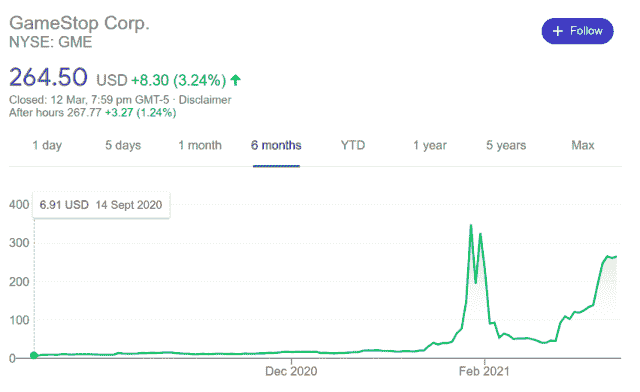
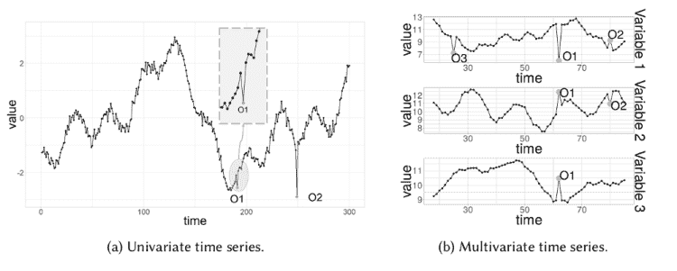
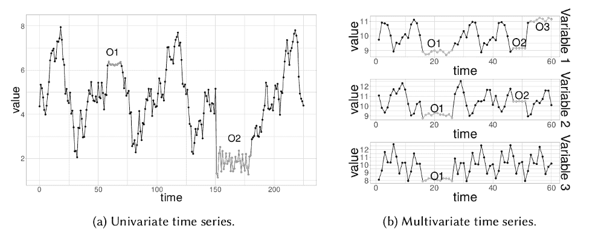
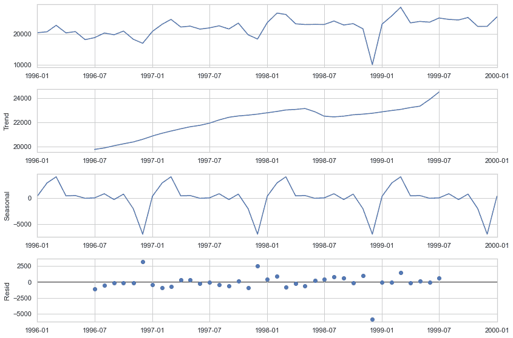
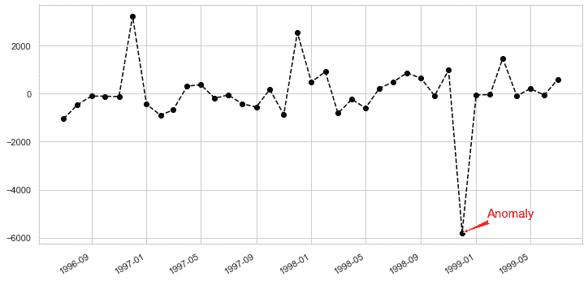
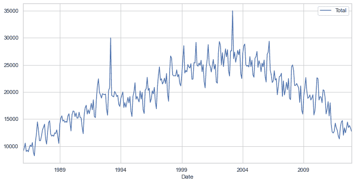
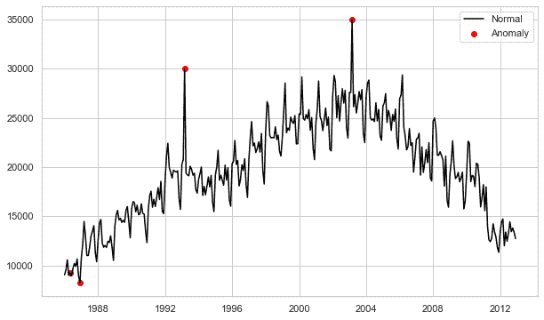
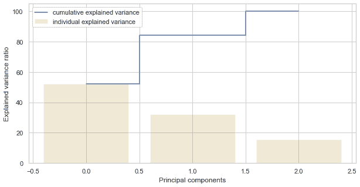

# 时间序列中的异常检测

> 原文：<https://web.archive.org/web/https://neptune.ai/blog/anomaly-detection-in-time-series>

时间序列无处不在！网站上的用户行为，或财富 500 强公司的股票价格，或任何其他与时间相关的例子。时间序列数据在每个行业中都以某种形式存在。

自然，它也是研究最多的数据类型之一。根据经验，您可以说时间序列是一种基于某种时间相关维度(如年、月或秒)进行采样的数据。

> 时间序列是以有序的方式记录的并且在时间上相关的观察结果。

在分析时间序列数据时，我们必须确定异常值，就像我们在静态数据中所做的一样。如果您曾经以任何身份处理过数据，您就会知道异常值会给分析师带来多大的痛苦。这些异常值在时间序列行话中被称为“异常”。

## 时序数据中的异常/异常值和异常类型是什么？

从传统的观点来看，离群值/异常值是:

> "一个与其他观测结果相差很大的观测结果，以至于让人怀疑它是由不同的机制产生的。"

因此，您可以将异常值视为不符合预期行为的观察值。

如上图所示，时间序列中的异常值可能有两种不同的含义。它们之间的语义区别主要基于你作为分析师的兴趣，或者特定的场景。

这些观察结果与噪声、错误或不需要的数据有关，这些数据本身对分析师来说并不有趣。在这些情况下，应删除或纠正异常值以提高数据质量，并生成可由其他数据挖掘算法使用的更清晰的数据集。例如，消除传感器传输误差以获得更准确的预测，因为主要目标是进行预测。

然而，近年来——特别是在时间序列数据领域——许多研究人员致力于检测和分析不寻常但有趣的现象。*欺诈检测*就是一个很好的例子——主要目标是检测和分析异常值本身。这些观察结果通常被称为异常。

时间序列的异常检测问题通常被公式化为*识别相对于某种规范或通常信号*的异常数据点。看看一些异常类型:

让我们逐一分析一下:

### 点异常值

点异常值是在特定时间实例中与时间序列中的其他值(全局异常值)或与其相邻点(局部异常值)相比表现异常的数据。

例子:你知道 Gamestop 狂潮吗？许多年轻的散户投资者购买 GME 股票，以报复大型对冲基金，推动股价大幅上涨。由于不太可能的事件而出现的突然、短暂的峰值是一个**附加(点)异常值。**基于时间的值在短时间内的意外增长(看起来像突然的峰值)属于加性异常值。



*Source: Google*

点异常值可以是*单变量*或*多变量*，这取决于它们是否分别影响一个或多个时间相关变量。

图 1a 包含两个单变量点异常值 O1 和 O2，而多变量时间序列由图 3b 中的三个变量组成，并且具有单变量(O3)和多变量(O1 和 O2)点异常值。



*Fig: 1 — Point outliers in time series data. | [Source](https://web.archive.org/web/20220928190227/https://arxiv.org/pdf/2002.04236.pdf)*

我们将在异常检测部分更深入地研究单变量点异常值。

### 后续异常值

这意味着连续的时间点，其联合行为是不寻常的，尽管每个单独的观察不一定是点异常值。子序列异常值也可以是全局的或局部的，并且可以影响一个(单变量子序列异常值)或多个(多变量子序列异常值)时间相关变量。

图 2 提供了单变量(图 2a 中的 O1 和 O2，以及图 2b 中的 O3)和多变量(图 2b 中的 O1 和 O2)子序列异常值的示例。注意，后者不一定影响所有变量(例如，图 2b 中的 O2)。



*Fig: 2 — Subsequence outliers in time series data. | [Source](https://web.archive.org/web/20220928190227/https://arxiv.org/pdf/2002.04236.pdf)*

## 时间序列数据中的异常检测技术

分析师可以用来识别数据中不同异常的技术很少。它从一个基本的统计分解开始，一直到自动编码器。让我们从最基本的开始，理解它如何以及为什么有用。

### 注意

📄在这里你可以找到 [笔记本](https://web.archive.org/web/20220928190227/https://app.neptune.ai/theaayushbajaj/Anomaly-Detection/n/49ba1752-fc3a-4abb-b35f-0e2ea4fd4afa/48dc19d8-3c75-4989-a2c0-67839393a093) 以及文章中用到的 [数据](https://web.archive.org/web/20220928190227/https://drive.google.com/drive/folders/1vsLzhpgNbVPsYvBIFNI_20S3LRZuNYhz?usp=sharing)

### STL 分解

[STL](https://web.archive.org/web/20220928190227/http://www.wessa.net/download/stl.pdf) 代表基于黄土的季节趋势分解程序。这种技术让你能够将你的时间序列信号分成三个部分:**、季节、趋势和残差**。

它适用于季节性时间序列，这也是最流行的时间序列数据类型。要生成 STL 分解图，我们只需使用令人惊叹的 *statsmodels* 来完成繁重的工作。

```
plt.rc('figure',figsize=(12,8))
plt.rc('font',size=15)
result = seasonal_decompose(lim_catfish_sales,model='additive')
fig = result.plot()
```



*This is Catfish sales data from 1996–2000 with an anomaly introduced in Dec-1998*

如果我们分析**残差**的偏差并为其引入一些阈值，我们将得到一个异常检测算法。为了实现这一点，我们只需要来自分解的剩余数据。

```
plt.rc('figure',figsize=(12,6))
plt.rc('font',size=15)
fig, ax = plt.subplots()
x = result.resid.index
y = result.resid.values
ax.plot_date(x, y, color='black',linestyle='--')
ax.annotate('Anomaly', (mdates.date2num(x[35]), y[35]), xytext=(30, 20),
          textcoords='offset points', color='red',arrowprops=dict(facecolor='red',arrowstyle='fancy'))
fig.autofmt_xdate()
plt.show()
```



*Residue from the above STL decomposition*

***利弊***

它简单，健壮，可以处理很多不同的情况，所有的异常仍然可以被直观的解释。

***缺点***

这种技术最大的缺点是僵硬的调整选项。除了阈值和可能的置信区间之外，你对此无能为力。例如，您正在跟踪网站上的用户，该网站对公众关闭，然后突然开放。在这种情况下，您应该分别跟踪启动期前后发生的异常情况。

### 分类和回归树

我们可以利用决策树的能力和健壮性来识别时间序列数据中的异常值/异常。

*   首先，您可以使用监督学习来教会树对异常和非异常数据点进行分类。为了做到这一点，我们需要标记异常数据点，这在玩具数据集之外是不常见的。
*   无人监管才是你需要的！我们可以使用隔离森林算法来预测某个点是否是离群点，而不需要任何标记数据集的帮助。让我们看看怎么做。

与其他流行的离群点检测方法不同，隔离林的主要思想是显式识别异常，而不是分析正常数据点。像任何树集合方法一样，隔离森林是基于决策树的。

换句话说，[隔离林](https://web.archive.org/web/20220928190227/https://scikit-learn.org/stable/modules/generated/sklearn.ensemble.IsolationForest.html)纯粹基于异常是很少且不同的数据点这一事实来检测异常。异常隔离是在不采用任何距离或密度测量的情况下实现的。

*   当应用一个 [IsolationForest](https://web.archive.org/web/20220928190227/https://scikit-learn.org/stable/modules/generated/sklearn.ensemble.IsolationForest.html) 模型时，我们设置污染=离群值 _ 分数，也就是告诉模型数据中离群值的比例。这是一个试错指标。
*   拟合和预测(数据)对数据执行异常值检测，返回 1 表示正常，-1 表示异常。
*   最后，我们用时间序列视图可视化异常。

让我们一步一步来。首先，可视化时间序列数据:

```
plt.rc('figure',figsize=(12,6))
plt.rc('font',size=15)
catfish_sales.plot()
```



*The same Catfish Sales data but with different (multiple) anomalies introduced*

接下来，我们需要设置一些参数，如离群分数，并训练我们的 IsolationForest 模型。我们可以利用超级有用的 scikit-learn 来实现隔离森林算法。你可以在这里找到包含代码和其他东西[的完整笔记本。](https://web.archive.org/web/20220928190227/https://ui.neptune.ai/theaayushbajaj/Anomaly-Detection/n/Anomaly-Detection-49ba1752-fc3a-4abb-b35f-0e2ea4fd4afa)

### 稍后阅读

如何使用 [Neptune-sklearn 集成](https://web.archive.org/web/20220928190227/https://docs.neptune.ai/integrations-and-supported-tools/model-training/sklearn)跟踪您的分类器、回归器和 k 均值聚类结果

```
outliers_fraction = float(.01)
scaler = StandardScaler()
np_scaled = scaler.fit_transform(catfish_sales.values.reshape(-1, 1))
data = pd.DataFrame(np_scaled)

model =  IsolationForest(contamination=outliers_fraction)
model.fit(data)
```

最后，我们需要想象预测是怎样的。

```
catfish_sales['anomaly'] = model.predict(data)

fig, ax = plt.subplots(figsize=(10,6))
a = catfish_sales.loc[catfish_sales['anomaly'] == -1, ['Total']] 
ax.plot(catfish_sales.index, catfish_sales['Total'], color='black', label = 'Normal')
ax.scatter(a.index,a['Total'], color='red', label = 'Anomaly')
plt.legend()
plt.show();
```



*Anomaly Detection using Isolation Forest algo*rithm

如您所见，该算法在识别我们植入的异常方面做得非常好，但它也在开始时将一些点标记为“异常值”。这是由于两个原因:

*   一开始，该算法很天真，无法理解什么是异常。它得到的数据越多，它能看到的差异就越多，它会自我调整。
*   如果你看到许多真阴性，这意味着你的**污染**参数太高。相反，如果你没有看到红点在它们应该在的地方，那么**污染**参数设置得太低。

***利弊***

这种技术的最大优点是，您可以引入任意多的随机变量或特性来创建更复杂的模型。

***缺点***

缺点是越来越多的特性会很快影响你的计算性能。在这种情况下，您应该仔细选择功能。

### 使用预测的检测

使用预测的异常检测基于这样一种方法，即过去的几个点通过添加一些随机变量(通常是白噪声)来生成下一个点的预测。

可以想象，未来预测的积分会产生新的积分等等。它对预测范围的明显影响——信号变得更加平滑。

使用这种方法的难点在于，您应该选择差异数、自回归数和预测误差系数。

每处理一个新信号，你都应该建立一个新的预测模型。

另一个障碍是差分后你的信号应该是平稳的。简单地说，这意味着你的信号不应该依赖于时间，这是一个重要的限制。

我们可以利用不同的预测方法，如移动平均线，自回归方法，ARIMA 及其不同的变种。用 ARIMA 检测异常的程序是:

*   根据过去的数据预测新点，并找出与训练数据中的差值。
*   选择一个阈值并基于该差异阈值识别异常。就是这样！

为了测试这项技术，我们将使用时间序列中一个流行的模块，名为 ***fbprophet*** *。*该模块专门针对平稳性和季节性，可以使用一些超参数进行调整。


*The same Catfish Sales data but with different (multiple) anomalies introduced*

我们将利用与上述相同的异常数据。首先，让我们导入它并为环境做好准备:

```
from fbprophet import Prophet
```

现在让我们定义预测函数。这里需要注意的一点是 *fbprophet* 将添加一些额外的指标作为特性，以便更好地识别异常。例如，预测的时间序列变量(通过模型)、目标时间序列变量的上限和下限以及趋势度量。

```
def fit_predict_model(dataframe, interval_width = 0.99, changepoint_range = 0.8):
   m = Prophet(daily_seasonality = False, yearly_seasonality = False, weekly_seasonality = False,
               seasonality_mode = 'additive',
               interval_width = interval_width,
               changepoint_range = changepoint_range)
   m = m.fit(dataframe)
   forecast = m.predict(dataframe)
   forecast['fact'] = dataframe['y'].reset_index(drop = True)
   return forecast

pred = fit_predict_model(t)
```

**我们现在必须将*预测*变量**推送到另一个函数，该函数将基于时间序列变量中的下限和上限阈值来检测异常。

```
def detect_anomalies(forecast):
   forecasted = forecast[['ds','trend', 'yhat', 'yhat_lower', 'yhat_upper', 'fact']].copy()
forecasted['anomaly'] = 0
   forecasted.loc[forecasted['fact'] > forecasted['yhat_upper'], 'anomaly'] = 1
   forecasted.loc[forecasted['fact'] < forecasted['yhat_lower'], 'anomaly'] = -1

   forecasted['importance'] = 0
   forecasted.loc[forecasted['anomaly'] ==1, 'importance'] = \
       (forecasted['fact'] - forecasted['yhat_upper'])/forecast['fact']
   forecasted.loc[forecasted['anomaly'] ==-1, 'importance'] = \
       (forecasted['yhat_lower'] - forecasted['fact'])/forecast['fact']

   return forecasted
pred = detect_anomalies(pred)
```

最后，我们只需要绘制上述预测并可视化异常。

***利弊***

该算法很好地处理了不同的季节性参数，如每月或每年，并且它对所有时间序列指标都有本地支持。

如果仔细观察，与隔离林算法相比，该算法可以很好地处理边缘情况。

***缺点***

由于这种技术是基于预测的，它将在有限的数据场景中挣扎。在有限的数据中预测的质量会降低，异常检测的准确性也会降低。

### 基于聚类的异常检测

到目前为止，我们已经将 IsolationForest 算法视为我们的无监督异常检测方法。现在，我们将研究另一种无人监管的技术:聚类！

这种方法非常简单。落在定义的聚类之外的数据实例可能会被标记为异常。我们将使用 k-means 聚类，因为为什么不呢！

为了直观起见，我们将使用一个不同的数据集，该数据集对应于具有一个或多个基于时间的变量的多变量时间序列。数据集将是在这里找到的数据集的子集(列/特征是相同的)。

*数据集描述:数据包含购物和购买信息以及价格竞争力信息。*

现在为了处理 k-means，首先我们需要知道我们将要处理的聚类的数量。*肘法*在这方面非常有效。

*Elbow 方法是聚类数与解释的方差/目标/得分的关系图*

为了实现这一点，我们将使用 scikit-learn 的 K-means 实现。

```
data = df[['price_usd', 'srch_booking_window', 'srch_saturday_night_bool']]
n_cluster = range(1, 20)
kmeans = [KMeans(n_clusters=i).fit(data) for i in n_cluster]
scores = [kmeans[i].score(data) for i in range(len(kmeans))]
fig, ax = plt.subplots(figsize=(10,6))
ax.plot(n_cluster, scores)
plt.xlabel('Number of Clusters')
plt.ylabel('Score')
plt.title('Elbow Curve')
plt.show();
```

从上面的肘形曲线中，我们看到该图在 10 个聚类之后变得平稳，这意味着更多聚类的增加并不能解释我们的相关变量中更多的变化；在这种情况下，价格为美元。

我们设置 n_clusters=10，在生成 k-means 输出时，使用该数据来绘制 3D 聚类。

**现在我们需要找出**要保留的组件(特性)的数量。

```
data = df[['price_usd', 'srch_booking_window', 'srch_saturday_night_bool']]
X = data.values
X_std = StandardScaler().fit_transform(X)

mean_vec = np.mean(X_std, axis=0)
cov_mat = np.cov(X_std.T)
eig_vals, eig_vecs = np.linalg.eig(cov_mat)

eig_pairs = [ (np.abs(eig_vals[i]),eig_vecs[:,i]) for i in range(len(eig_vals))]
eig_pairs.sort(key = lambda x: x[0], reverse= True)

tot = sum(eig_vals)
var_exp = [(i/tot)*100 for i in sorted(eig_vals, reverse=True)] 
cum_var_exp = np.cumsum(var_exp) 
plt.figure(figsize=(10, 5))
plt.bar(range(len(var_exp)), var_exp, alpha=0.3, align='center', label='individual explained variance', color = 'y')
plt.step(range(len(cum_var_exp)), cum_var_exp, where='mid',label='cumulative explained variance')
plt.ylabel('Explained variance ratio')
plt.xlabel('Principal components')
plt.legend(loc='best')
plt.show();
```



我们看到第一个因素解释了将近 50%的差异。第二个成分解释了 30%以上。但是，请注意，几乎没有一个组件是真正可以忽略的。前两个组件包含 80%以上的信息。因此，我们将设置 n_components=2。

基于聚类的异常检测的基本假设是，如果我们对数据进行聚类，正常数据将属于聚类，而异常将不属于任何聚类，或者属于小聚类。

**我们使用以下步骤来发现并可视化异常:**

*   计算每个点与其最近质心之间的距离。最大的距离被认为是异常。
*   类似于 IsolationForest 算法，我们使用 outliers_fraction 向算法提供关于数据集中出现的离群值的比例的信息。这在很大程度上是一个超参数，需要点击/尝试或网格搜索来设置正确-作为一个开始数字，让我们估计，离群值分数=0.1
*   使用离群值分数计算离群值的数量。
*   将阈值设置为这些异常值的最小距离。
*   anomaly1 的异常结果包含上述方法簇(0:正常，1:异常)。
*   使用集群视图可视化异常。
*   用时序视图可视化异常。

```
def getDistanceByPoint(data, model):
   distance = pd.Series()
   for i in range(0,len(data)):
       Xa = np.array(data.loc[i])
       Xb = model.cluster_centers_[model.labels_[i]-1]
       distance.at[i]=np.linalg.norm(Xa-Xb)
   return distance
outliers_fraction = 0.1

distance = getDistanceByPoint(data, kmeans[9])
number_of_outliers = int(outliers_fraction*len(distance))
threshold = distance.nlargest(number_of_outliers).min()

df['anomaly1'] = (distance >= threshold).astype(int)
fig, ax = plt.subplots(figsize=(10,6))
colors = {0:'blue', 1:'red'}
ax.scatter(df['principal_feature1'], df['principal_feature2'], c=df["anomaly1"].apply(lambda x: colors[x]))
plt.xlabel('principal feature1')
plt.ylabel('principal feature2')
plt.show();
```

**现在，为了查看现实世界特征的异常**，我们处理上一步创建的数据帧。

```
df = df.sort_values('date_time')
fig, ax = plt.subplots(figsize=(10,6))
a = df.loc[df['anomaly1'] == 1, ['date_time', 'price_usd']] 
ax.plot(pd.to_datetime(df['date_time']), df['price_usd'], color='k',label='Normal')
ax.scatter(pd.to_datetime(a['date_time']),a['price_usd'], color='red', label='Anomaly')
ax.xaxis_date()
plt.xlabel('Date Time')
plt.ylabel('price in USD')
plt.legend()
fig.autofmt_xdate()
plt.show()
```

这种方法能够很好地封装峰，当然也有一些遗漏。这个问题的一部分可能是 outlier_fraction 没有处理很多值。

***利弊***

这种技术的最大优势类似于其他无监督技术，即您可以引入任意多的随机变量或特征来制作更复杂的模型。

***缺点***

缺点是越来越多的特性会很快影响你的计算性能。除此之外，还有更多的超参数需要调整和获得正确的结果，因此在性能方面总是有很大的模型差异。

### 自动编码器

没有深度学习就谈不上数据技术！因此，让我们讨论使用**自动编码器的异常检测。**

自动编码器是一种无监督的技术，它在通过不同的维度提取其特征的同时重新创建输入数据。因此，换句话说，如果我们使用来自自动编码器的数据的潜在表示，它对应于*维度缩减*。

#### 为什么我们要应用降维来发现异常值？

如果我们降低维度，会不会丢失一些信息，包括离群值？答案是，一旦确定了主要模式，离群值就显现出来了。许多基于距离的技术(例如 KNNs)在计算整个特征空间中每个数据点的距离时会遭遇维数灾难。必须减少高维度。

有趣的是，在降维的过程中，离群值被识别出来。我们可以说离群点检测是降维的副产品。

自动编码器是一种无监督的发现异常的方法。

#### 为什么选择自动编码器？

有许多有用的工具，如主成分分析(PCA)，用于检测异常值。为什么我们需要自动编码器？原因是 PCA 用线性代数来变换。相反，自动编码器技术可以利用其非线性激活功能和多层来执行非线性变换。用自动编码器训练几个层比用 PCA 训练一个巨大的变换更有效。因此，当数据问题本质上是复杂的和非线性的时，自动编码器技术显示了它们的优点。

#### 建立模型

我们可以使用 Tensorflow 或 Pytorch 等流行的框架来实现自动编码器，但为了简单起见，我们将使用一个名为 PyOD 的 python 模块，它使用用户的少量输入在内部构建自动编码器。

对于数据部分，让我们使用 PyOD 的实用函数 generate_data()来生成 25 个变量、500 个观察值和 10%的异常值。

```
import numpy as np
import pandas as pd
from pyod.models.auto_encoder import AutoEncoder
from pyod.utils.data import generate_data
contamination = 0.1  
n_train = 500  
n_test = 500  
n_features = 25 
X_train, y_train, X_test, y_test = generate_data(
   n_train=n_train, n_test=n_test,
   n_features= n_features,
   contamination=contamination,random_state=1234)
X_train = pd.DataFrame(X_train)
X_test = pd.DataFrame(X_test)
```

当您进行无监督学习时，标准化预测值总是一个安全的步骤，如下所示:

```
from sklearn.preprocessing import StandardScaler
X_train = StandardScaler().fit_transform(X_train)
X_train = pd.DataFrame(X_train)
X_test = StandardScaler().fit_transform(X_test)
X_test = pd.DataFrame(X_test)
```

为了更好地理解数据的样子，让我们使用主成分分析法将数据降维，并相应地绘图。

```
from sklearn.decomposition import PCA
pca = PCA(2)
x_pca = pca.fit_transform(X_train)
x_pca = pd.DataFrame(x_pca)
x_pca.columns=['PC1','PC2']
cdict = {0: 'red', 1: 'blue'}

import matplotlib.pyplot as plt
plt.scatter(X_train[0], X_train[1], c=y_train, alpha=1)
plt.title('Scatter plot')
plt.xlabel('x')
plt.ylabel('y')
plt.show()
```

聚集在一起的黑点是典型的观察值，而黄点是异常值。

#### 模型设定

*   [25, 2, 2, 25].输入层和输出层各有 25 个神经元。有两个隐藏层，每个都有两个神经元。

**步骤 1——构建您的模型**

```
clf = AutoEncoder(hidden_neurons =[25, 2, 2, 25])
clf.fit(X_train)
```

**步骤 2——确定切割点**

让我们应用训练好的模型 *Clf* 来预测测试数据中每个观察值的异常分数。我们如何定义离群值？异常值是指远离其他点的点，因此异常值分数由距离定义。PyOD 函数。decision_function()计算每个数据点的距离或异常值。

```
y_train_scores = clf.decision_scores_

y_test_scores = clf.decision_function(X_test)  
y_test_scores = pd.Series(y_test_scores)

import matplotlib.pyplot as plt
plt.hist(y_test_scores, bins='auto') 
plt.title("Histogram for Model Clf1 Anomaly Scores")
plt.show()
```

如果我们使用直方图通过异常分数来计算频率，我们会看到高分数对应于低频率——异常值的证据。我们选择 4.0 作为分界点，那些> =4.0 的为异常值。

**步骤 3 —按集群获取汇总统计数据**

让我们将那些异常分数低于 4.0 的观察值分配到聚类 0，将那些高于 4.0 的观察值分配到聚类 1。同样，让我们使用。groupby()。该模型已经识别了 50 个异常值(未示出)。

```
df_test = X_test.copy()
df_test['score'] = y_test_scores
df_test['cluster'] = np.where(df_test['score']<4, 0, 1)
df_test['cluster'].value_counts()
df_test.groupby('cluster').mean()
```

以下输出显示了每个聚类中的平均变量值。分类“1”(异常分类)的值与分类“0”(正常分类)的值大不相同。“得分”值显示了这些观察到的其他人的平均距离。高“分”意味着观察远离常态。


这样，我们可以很好地区分和标记典型基准面和异常。

***利弊***

*   自动编码器可以轻松处理高维数据。
*   由于其非线性行为，它可以在高维数据集中发现复杂的模式。

***缺点***

*   由于这是一种基于深度学习的策略，如果数据较少，它将特别困难。
*   如果网络深度增加，在处理大数据时，计算成本将会飙升。

到目前为止，我们已经看到了如何检测和识别异常。但是真正的问题出现在找到他们之后。现在怎么办？我们该怎么办？

让我们讨论一些您可以在您的场景中应用的要点。

## 如何处理异常情况？

检测之后，一个大问题是如何处理我们识别出的东西。有许多方法来处理新发现的信息。我将根据我的经验列出其中的一些来帮助你解决这个问题。

### 理解业务案例

异常几乎总是为你的问题提供新的信息和视角。股票价格突然上涨？这肯定是有原因的，就像我们在 Gamestop 看到的那样，疫情可能是另一个原因。因此，了解峰值背后的原因可以帮助你以有效的方式解决问题。

理解业务用例还可以帮助您更好地识别问题。例如，您可能正在进行某种欺诈检测，这意味着您的主要目标确实是了解数据中的异常值。

如果这些都不是你所关心的，你可以移除或平滑离群值。

### 调整异常值的统计方法

统计方法允许您调整异常值以匹配原始分布。让我们来看一个使用均值平滑异常的方法。

#### 使用均值平滑异常值

这个想法是通过使用前一个日期时间的数据来平滑异常。例如，为了平衡由于您家中发生的事件而导致的突然用电量，您可以取前几年同一个月的平均用电量。

让我们实现同样的方法来获得一个清晰的图像。我们将使用与之前相同的鲶鱼销售数据。我们可以使用下面的脚本来调整**平均值**。

```
adjusted_data = lim_catfish_sales.copy()
adjusted_data.loc[curr_anomaly] = december_data[(december_data.index != curr_anomaly) & (december_data.index < test_data.index[0])].mean()
```

**绘制调整后的数据**和旧数据将如下所示:

```
plt.figure(figsize=(10,4))
plt.plot(lim_catfish_sales, color='firebrick', alpha=0.4)
plt.plot(adjusted_data)
plt.title('Catfish Sales in 1000s of Pounds', fontsize=20)
plt.ylabel('Sales', fontsize=16)
for year in range(start_date.year,end_date.year):
   plt.axvline(pd.to_datetime(str(year)+'-01-01'), color='k', linestyle='--', alpha=0.2)
plt.axvline(curr_anomaly, color='k', alpha=0.7)
```

这样，您可以继续应用预测或分析，而不必太担心结果的偏斜。

有许多方法可以处理非时间序列数据，但不幸的是，由于底层结构的差异，这些方法不能直接用于时间序列。非时间序列处理方法涉及许多基于分布的方法，这些方法不能简单地转化为时间序列数据。如果你想看其中的一些，你可以点击这里的。

### 去除异常值

如果以上两个选项都没有在您的解决方案中引发任何争论，那么最后一个选项是消除异常。不建议这样做(因为您基本上是在去除一些潜在的有价值的信息)，除非这是绝对必要的，并且不会损害未来的分析。

您可以使用。熊猫识别后掉落()特征。它会为你做繁重的工作。

## 你已经到达终点了！

恭喜你！现在，您已经了解了异常情况、如何检测异常情况以及如何应对异常情况。少数尾注:

*   时间序列数据因商业案例的不同而有很大差异，因此最好进行试验并找出可行的方法，而不是仅仅应用您的发现。经验可以创造奇迹！
*   除了我们在这个博客上讨论的以外，还有大量的异常检测技术。我鼓励你多阅读研究论文。

你可以在这里找到完整的笔记本代码和一些额外的东西！

目前就这些，敬请关注更多！再见！

*注:除非另有说明，图片均由作者创作。*

### Aayush Bajaj

**NatWest Group 的数据科学家**
一位热爱解决工程或科学数据问题的数据主管。在这里，你会发现很多概念博客以最具说明性的方式和框架相关教程进行了解释。如果你想知道机器将如何接管世界，请继续关注:)！

* * *

**阅读下一篇**

## ML 实验跟踪:它是什么，为什么重要，以及如何实施

10 分钟阅读|作者 Jakub Czakon |年 7 月 14 日更新

我来分享一个听了太多次的故事。

> *“…我们和我的团队正在开发一个 ML 模型，我们进行了大量的实验，并获得了有希望的结果…*
> 
> *…不幸的是，我们无法确切地说出哪种性能最好，因为我们忘记了保存一些模型参数和数据集版本…*
> 
> *…几周后，我们甚至不确定我们实际尝试了什么，我们需要重新运行几乎所有的东西"*
> 
> 不幸的 ML 研究员。

事实是，当你开发 ML 模型时，你会进行大量的实验。

这些实验可能:

*   使用不同的模型和模型超参数
*   使用不同的培训或评估数据，
*   运行不同的代码(包括您想要快速测试的这个小变化)
*   在不同的环境中运行相同的代码(不知道安装的是 PyTorch 还是 Tensorflow 版本)

因此，它们可以产生完全不同的评估指标。

跟踪所有这些信息会很快变得非常困难。特别是如果你想组织和比较这些实验，并且确信你知道哪个设置产生了最好的结果。

这就是 ML 实验跟踪的用武之地。

[Continue reading ->](/web/20220928190227/https://neptune.ai/blog/ml-experiment-tracking)

* * *