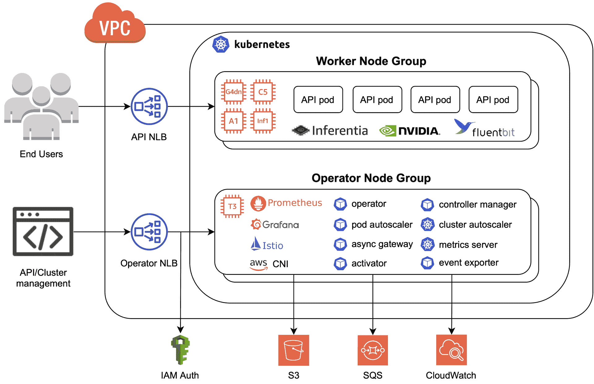

# 最佳 MLOps 工具以及如何评估它们

> 原文：<https://web.archive.org/web/https://neptune.ai/blog/best-mlops-tools>

在我们的一篇文章中——[机器学习团队实际使用的最好的工具、库、框架和方法——我们从 41 家 ML 初创公司学到的东西](/web/20230304071956/https://neptune.ai/blog/tools-libraries-frameworks-methodologies-ml-startups-roundup)——Acerta 的 CTO Jean-Christophe Petkovich 解释了他们的 ML 团队如何接近 MLOps。

据他所说，一个完整的 T2 系统有几个组成部分:T3

*   您需要能够构建包含预处理数据和生成结果所需的所有信息的模型工件。
*   一旦您能够构建模型工件，您必须能够跟踪构建它们的代码，以及它们被训练和测试的数据。
*   您需要跟踪所有这三样东西，模型、它们的代码和它们的数据，是如何关联的。
*   一旦您可以跟踪所有这些内容，您还可以将它们标记为准备就绪，进行生产，并通过 CI/CD 流程运行它们。
*   最后，为了在该过程的最后实际部署它们，您需要某种方法来基于该模型工件旋转服务。

这是对如何在公司中成功实施 MLOps 的高度概括。但是了解高层需要什么只是拼图的一部分。另一个是采用或创建适当的工具来完成工作。

这就是为什么我们编制了一份**最佳 MLOps 工具**的清单。我们将它们分为六类，以便您根据自己的需求选择合适的工具。让我们开始吧！

几乎在所有的 ML 工作流程中，您都想知道您的模型是如何构建的，尝试了哪些想法，或者在哪里可以找到所有打包的模型。

为此，您需要跟踪所有的模型构建元数据和训练模型，如超参数、指标、代码和数据集版本、评估预测、打包模型等。

根据您的模型元数据问题是在研究方面还是在产品化方面，您可以选择更具体的解决方案:[实验跟踪工具](/web/20230304071956/https://neptune.ai/blog/best-ml-experiment-tracking-tools)、[模型注册中心](/web/20230304071956/https://neptune.ai/blog/model-registry-makes-mlops-work)，或者一个 ML 元数据存储。

无论如何，在考虑元数据存储和管理工具时，您应该考虑:

*   **一般业务相关的东西**:定价模式、安全性和支持
*   **设置**:需要多少基础设施，插入您的工作流程有多容易
*   灵活性、速度和可访问性:你能定制元数据结构吗？它能从你的语言/框架/基础设施中访问吗？它对你的工作流来说足够快和可靠吗？
*   **模型版本化、沿袭和打包:**你能版本化和复制模型和实验吗？你能看到下游使用的数据/模型/实验的完整模型谱系吗？
*   **元数据的记录和显示**:API 和 UI 支持哪些元数据类型？你能渲染音频/视频吗？你从你的框架中获得了什么？
*   **对比和可视化实验和模型:**支持哪些可视化，是否有平行坐标图？可以对比图像吗？你能调试系统信息吗？
*   **组织和搜索实验、模型和相关元数据**:你能在工具中以一种干净的方式管理你的工作流程吗？你能根据自己的需要定制用户界面吗？能轻松找到实验和模型吗？
*   **模型评审、协作和共享**:在转移到生产之前，您能自动和手动地批准模型吗？你能和你的团队一起评论和讨论实验吗？
*   **CI/CD/CT 兼容性**:它与 CI/CD 工具的兼容性如何？它支持持续培训/测试(CT)吗？
*   **集成和支持:**它是否与您的模型培训框架相集成？你能在编排和管道工具中使用它吗？

根据您的模型元数据问题是在研究方面还是在产品化方面，您可能希望进行比较并选择更具体的解决方案:

记住这一点，让我们来看看其中的一些工具。

Neptune 是一个 **ML 元数据存储库，为运行许多实验的研究和生产团队而构建。**

您可以[记录和显示几乎任何 ML 元数据](https://web.archive.org/web/20230304071956/https://docs.neptune.ai/you-should-know/what-can-you-log-and-display),从超参数和度量到视频、交互式可视化和渲染的 jupyter 笔记本。

它有一个[灵活的元数据结构](https://web.archive.org/web/20230304071956/https://docs.neptune.ai/you-should-know/logging-metadata#run-structure-namespaces)，允许你以你想要的方式组织培训和生产元数据。您可以将它想象成一个字典或文件夹结构，您用代码创建并显示在 UI 中。

web UI 是为管理 ML 模型元数据而构建的，它允许您:

你可以通过[易于使用的 API](https://web.archive.org/web/20230304071956/https://docs.neptune.ai/you-should-know/logging-metadata) 和 25+ [与来自 ML 生态系统的工具](https://web.archive.org/web/20230304071956/https://docs.neptune.ai/integrations-and-supported-tools/intro#list-of-all-integrations)集成，从 ML 元数据存储中记录和[查询元数据](https://web.archive.org/web/20230304071956/https://docs.neptune.ai/you-should-know/querying-and-downloading-metadata)。

如果您想知道它是否适合您的工作流程:

但是如果你和我一样，你会想先把它和这个领域的其他工具比如 MLflow，TensorBoard，wandb 或者 comet 进行比较。[这里有许多更深入的逐个特性的比较](/web/20230304071956/https://neptune.ai/vs)以使评估更容易。

**海王**——**概要**:

*   灵活的类似文件夹的元数据结构
*   高度可定制的 UI，用于搜索、显示、比较和组织 ML 元数据
*   易于使用的 API，用于记录和查询模型元数据，以及与 MLOps 工具的 25 种集成
*   提供托管和本地版本
*   协作功能和组织/项目/用户管理

MLflow 是一个开源平台，帮助**管理整个机器学习生命周期**，包括实验、再现性、部署和中央模型注册。

MLflow 适合个人和任何规模的团队。

该工具与库无关。你可以用任何机器学习库和任何编程语言来使用它。

MLflow 包括**四个帮助跟踪和组织实验的主要功能:**

1.  ml flow Tracking——一个 API 和 UI，用于在运行机器学习代码时记录参数、代码版本、指标和工件，并在以后可视化和比较结果
2.  MLflow 项目——将 ML 代码打包成可重用、可复制的形式，以便与其他数据科学家共享或转移到生产中
3.  MLflow 模型——从不同的 ML 库中管理和部署模型到各种模型服务和推理平台
4.  MLflow Model Registry–一个中央模型存储库，用于协作管理 ml flow 模型的整个生命周期，包括模型版本控制、阶段转换和注释

检查[ml flow&海王星](/web/20230304071956/https://neptune.ai/vs/mlflow)之间的对比

Comet 是一个**元机器学习平台，用于跟踪、比较、解释和优化实验和模型**。它允许你在一个地方查看和比较你所有的实验。无论你在哪里用任何机器学习库运行你的代码，对于任何机器学习任务，它都能工作。

comet**适合团队、个人、学者、组织**以及任何想要轻松可视化实验、方便工作和运行实验的人。

**这颗彗星最显著的一些特征包括:**

*   团队共享工作:团队共享的多种特性
*   与现有的 ML 库配合良好
*   处理用户管理
*   让您比较实验——代码、超参数、度量、预测、依赖性、系统度量等等
*   允许您通过视觉、音频、文本和表格数据的专用模块可视化样品
*   有许多集成，可以轻松地将其连接到其他工具

查看彗星&海王星之间的[对比](/web/20230304071956/https://neptune.ai/vs/comet)

## 数据和管道版本控制

如果您关心再现性，数据和管道版本控制工具将对您的工作流程至关重要。

在数据方面，它们帮助您获得工件的版本，数据集或模型的散列，您可以在以后使用它来识别和比较。通常，您会将此数据版本记录到您的元数据管理解决方案中，以确保您的模型训练是版本化的和可重复的。

通过记录管道每个节点的输入/输出，您可以在管道中使用工件版本。通过这样做，您也可以对管道执行进行版本控制。

要为您的工作流选择一个好的数据/管道版本工具，您应该检查:

*   **对您的数据形态的支持:**它如何支持视频/音频？它是否为表格数据提供了一些预览？
*   易用性:在你的工作流程中使用起来有多容易？它给你的执行增加了多少开销？
*   **Diff and compare:** 可以比较数据集吗？你能看到你的图像目录的不同吗？

这里有几个值得检查的工具。

DVC，或数据版本控制，是一个机器学习项目的开源版本控制系统。这是一个**实验工具，帮助你定义你的管道**,不管你使用什么语言。

当您在 ML 模型的前一版本中发现问题时，DVC 通过利用代码、数据版本化和可再现性来帮助节省时间。您还可以训练您的模型，并通过 DVC 管道与您的队友分享。

DVC 可以处理大量数据的版本和组织，并以一种组织良好、易于访问的方式存储它们。它**专注于数据和管道版本化和管理，但也有一些(有限的)实验跟踪功能**。

**DVC**——**概要**:

*   可以使用不同类型的存储—不受存储限制
*   完整的代码和数据来源有助于跟踪每个 ML 模型的完整发展
*   通过始终如一地维护输入数据、配置和最初用于运行实验的代码的组合来实现可重复性
*   跟踪指标
*   一种将 ML 步骤连接到 DAG 并端到端运行整个管道的内置方式

检查 [DVC &海王星比较](/web/20230304071956/https://neptune.ai/vs/dvc)

Pachyderm 是一个将数据谱系与 Kubernetes 上的端到端管道相结合的平台。

它有三个版本，社区版(开源，可以在任何地方使用)、企业版(完整的版本控制平台)和中心版(仍是测试版，它结合了前两个版本的特点)。

您需要将 Pachyderm 与您的基础架构/私有云相集成。

由于在本节中我们讨论的是数据和管道版本，所以我们将讨论这两者，但除此之外还有更多内容(查看网站了解更多信息)。

谈到**数据版本化，Pachyderm 数据版本化系统有以下几个主要概念**:

*   存储库–厚皮动物存储库是最高级别的数据对象。通常，Pachyderm 中的每个数据集都有自己的存储库
*   提交–回购在特定时间点的不可变快照
*   分支–特定提交的别名或指针，在提交新数据时自动移动
*   文件–文件和目录是存储库中的实际数据。Pachyderm 支持任何类型、大小和数量的文件
*   出处——表达各种提交、分支和存储库之间的关系。它帮助您跟踪每个提交的来源

查看[厚皮动物&海王星比较](/web/20230304071956/https://neptune.ai/vs/pachyderm)

如果 MLOps 工作流的数据和管道版本控制部分对您很重要，请查看数据版本控制工具的[更深入的比较。](https://web.archive.org/web/20230304071956/https://neptune.ai/blog/best-7-data-version-control-tools-that-improve-your-workflow-with-machine-learning-projects)

## 超参数调谐

如果你想从你的模型中获得好的性能，而你不能仅仅给它更多的训练数据，你必须调整超参数。您可以使用随机搜索或贝叶斯优化方法手动完成。

许多工具都可以帮助您，但是要选择一个适合您的工具，请考虑:

*   **易用性和 API** :将其连接到您的代码库有多容易？您能在您的分布式基础设施中运行它吗？
*   **支持的优化方法**:可以动态构建搜索空间吗？它支持 TPE 吗？它有像 BOHB 那样的基于树的代理模型吗？
*   **支持修剪、重启和异常处理**:你能在没有希望的试验上提前停止吗？你能从检查站开始吗？当参数配置试验失败时会发生什么？
*   **速度和并行化:**在一台或多台机器上分配培训有多容易？
*   可视化和调试功能:你能可视化扫描吗？可以对比参数配置吗？它是否容易连接到监控/跟踪工具？

我们来看几个选项。

Optuna 是一个**自动超参数优化框架**，既可以用于机器学习/深度学习，也可以用于其他领域。它有一套最先进的算法，你可以选择(或连接)，它是非常容易的分布训练到多台机器，并让你很好地可视化你的结果。

它集成了流行的机器学习库，如 PyTorch、TensorFlow、Keras、FastAI、scikit-learn、LightGBM 和 XGBoost。

******——****概要:**

*   支持在一台机器(多进程)和一个集群(多节点)上进行分布式培训
*   支持各种修剪策略，以更快地收敛(并使用更少的计算)
*   拥有一套强大的可视化工具，如平行坐标、等高线图或切片图

检查 [Neptune-Optuna 集成](https://web.archive.org/web/20230304071956/https://docs.neptune.ai/integrations-and-supported-tools/hyperparameter-optimization/optuna)，让您记录并实时监控 Optuna 超参数扫描。

SigOpt 旨在加速和放大机器学习、深度学习和模拟模型的影响。它有助于通过自动化过程节省时间，使其成为超参数调整的合适工具。

您可以将 SigOpt 无缝集成到任何模型、框架或平台中，而无需担心您的数据、模型和基础架构——一切都是安全的。

该工具还可以让你**监控、跟踪和分析你的优化实验** **以及可视化它们**。

**SigOpt****——****概要:**

*   多指标优化便于同时探索两个不同的指标
*   条件参数允许定义和调整架构参数，并自动选择模型
*   高并行性使您能够充分利用大规模计算机基础设施，并在多达 100 名工作人员中运行优化实验

## 运行流程编排和工作流管道

当您的工作流有多个可以单独执行的步骤(预处理、培训、评估)时，您将受益于工作流管道和编排工具。

这些工具将帮助您:

*   按照正确的顺序执行步骤
*   将执行抽象到任何基础设施
*   确保每个步骤在开始运行之前都有来自其他步骤的所有输入
*   通过保存/缓存中间步骤的输出并只运行那些必须运行的输出，加速管道执行
*   重试/重新运行失败的步骤，而不使整个管道崩溃
*   基于时间(每周)或事件(每次合并到主分支)调度/触发管道执行
*   可视化管道结构和执行

让我们回顾一下其中的一些工具。

Kubeflow 是 Kubernetes 的 **ML 工具包。它通过**打包和管理 docker 容器**来帮助维护机器学习系统。它通过使机器学习工作流的运行编排和部署更容易来促进机器学习模型的扩展。**

这是一个**开源项目**,包含一组特定于各种 ML 任务的兼容工具和框架。

您可以使用 Kubeflow 管道来克服长时间的 ML 培训工作、手动实验、再现性和 DevOps 障碍。

**kube flow****——****概要:**

*   用于管理和跟踪实验、作业和运行的用户界面(UI)
*   使用 SDK 与系统交互的笔记本电脑
*   重用组件和管道来快速创建端到端解决方案，而不必每次都重新构建
*   Kubeflow Pipelines 可作为 Kubeflow 的核心组件或独立安装使用

检查[库伯弗洛&海王星比较](/web/20230304071956/https://neptune.ai/vs/kubeflow)

Polyaxon 是一个平台，用于复制和管理机器学习项目的整个生命周期，以及深度学习应用的整个生命周期。

该工具可以部署到任何数据中心、云提供商，并且可以由 Polyaxon 托管和管理。它支持所有主要的深度学习框架，如 Torch、Tensorflow、MXNet。

说到流程编排，Polyaxon 允许您通过 CLI、dashboard、SDK 或 REST API 调度作业和实验，从而最大限度地利用集群。

**多轴 ****—**** 概要**:

*   支持整个生命周期，包括运行流程编排，但可以做的远不止这些
*   有一个开源版本，您可以立即使用，但也为企业提供了选项
*   文档非常完整的平台，包括技术参考文档、入门指南、学习资源、指南、教程、变更日志等等
*   允许使用 experiment insights 仪表板监控、跟踪和分析每个优化实验

检查多轴&海王星之间的[比较](/web/20230304071956/https://neptune.ai/vs/polyaxon)

Airflow 是一个开源平台，允许您使用 web 应用程序来监控、调度和管理您的工作流。它提供了对已完成和正在进行的任务状态的了解，以及对日志的了解。

Airflow **使用有向无环图**(Dag)来管理工作流编排。该工具是用 Python 编写的，但是您可以将其用于任何其他语言

**气流****——****概要:**

*   易于与您当前的基础架构一起使用—与 Google 云平台、Amazon Web Services、Microsoft Azure 和许多其他服务集成
*   您可以可视化生产中运行的管道
*   它可以帮助您管理任务之间不同的相关性

这个工作流编排工具基于 Python。您可以**创建可重复、可维护和模块化的工作流程，使您的 ML 流程**更简单、更准确。Kedro 将软件工程集成到机器学习环境中，其中包含模块化、关注点分离和版本控制等概念。

它**基于 [Cookiecutter 数据科学](https://web.archive.org/web/20230304071956/https://drivendata.github.io/cookiecutter-data-science/)** 提供了一个标准的、可修改的项目模板。数据目录处理一系列轻量级数据连接器，用于跨许多不同的文件格式和文件系统保存和加载数据。

**凯德罗****——****概要:**

*   通过管道抽象，您可以自动化 Python 代码和工作流可视化之间的依赖关系。
*   Kedro 支持单机或分布式机器部署。
*   主要焦点是创建可维护的数据科学代码，以解决 Jupyter 笔记本、一次性脚本和胶水代码的缺点。
*   这个工具使得不同层次的团队协作更加容易，并且通过模块化、可重用的代码在编码环境中提供效率。

检查 [Kedro-Neptune integration](https://web.archive.org/web/20230304071956/https://docs.neptune.ai/integrations-and-supported-tools/automation-pipelines/kedro) ，它允许您过滤、比较、显示和组织管道和节点中生成的 ML 元数据。

如果你想回顾更多的框架，请阅读我们的[管道编排工具](https://web.archive.org/web/20230304071956/https://neptune.ai/blog/best-workflow-and-pipeline-orchestration-tools)的深度比较。

## 模型部署和服务

希望您的团队已经有了生产中的模型，或者您即将部署它们。太棒了！但是，正如你现在可能知道的，生产围绕 ML 模型的可操作性提出了它的挑战。

您遇到的第一批问题是如何打包、部署、服务和扩展基础架构以支持生产中的模型。模型部署和服务工具对此有所帮助。

选择工具时，您应该考虑:

*   与您的模型打包框架和模型打包实用程序的兼容性
*   基础设施扩展能力
*   支持各种部署场景:金丝雀、A/B 测试、挑战者与冠军
*   集成和支持生产模型监控框架或内置监控功能

这里有一些模型部署和服务工具。

BentoML 简化了构建机器学习 API 端点的过程。它提供了一个**标准，但是简化的架构来将训练好的 ML 模型移植到生产中**。

它让你**打包训练好的模型，使用任何 ML 框架来解释它们**，以服务于生产环境。它支持在线 API 服务和离线批处理服务。

BentoML 有一个灵活的工作流和一个高性能的模型服务器。该服务器还支持自适应微批处理。UI 仪表板提供了一个集中的系统来组织模型和监控部署过程。

工作机制是模块化的，使配置可重用，服务器不停机。这是一个多用途的框架，解决了 ML 模型服务、组织和部署的问题。主要重点是连接数据科学和 DevOps 部门，以实现更高效的工作环境，并产生高性能的可扩展 API 端点。

**BentoML ****—**** 概要**:

*   支持高性能的模型服务、模型管理、模型打包和统一的模型格式。
*   支持部署到多个平台。
*   灵活的模块化设计。
*   不处理现成的水平缩放。

Cortex architecture diagram | [Source](https://web.archive.org/web/20230304071956/https://docs.cortex.dev/overview)

cortex**是一个开源的替代方案，可以通过 SageMaker** 或**在 AWS 服务**如 Elastic Kubernetes Service (EKS)、Lambda 或 Fargate 和开源项目如 Docker、Kubernetes、TensorFlow Serving 和 TorchServe 之上构建自己的模型部署平台。

这是一个多框架工具，允许您部署所有类型的模型。

**皮层 ****—**** 小结**:

*   自动扩展 API 以处理生产工作负载
*   对任何 AWS 实例类型运行推理
*   在单个 API 中部署多个模型，并在不停机的情况下更新已部署的 API
*   监控 API 性能和预测结果

Seldon 是一个开源平台，允许你**在 Kubernetes** 上部署机器学习模型。它在云中和内部都可用。

**谢顿****——****概要:**

*   利用 canary deployment 等各种选项简化模型部署
*   出现问题时，使用警报系统监控生产中的模型
*   使用模型解释器来理解为什么会做出某些预测。谢顿还开源了一个模型解释器包 alibi

## 生产模型监控

如果您曾经“成功地”将模型部署到生产环境中，却发现它们产生了疯狂的结果，那么您知道监视生产模型是非常重要的，并且可以为您节省很多麻烦(和金钱)。如果没有，相信我的话。

模型监控工具可以通过以下方式让您了解生产中正在发生的事情:

*   **监控输入数据漂移:**你的模型得到的真实数据和训练数据有区别吗？
*   **监控概念漂移**:问题是否随着时间的推移而改变，你的模型性能在衰减？
*   **监控硬件指标**:该型号的功耗是否明显高于之前的型号？

选择模型监控工具时，您应该考虑:

*   **易于集成:**将其连接到您的模型服务工具有多容易
*   **服务开销:**日志记录给模型部署基础设施带来了多少开销
*   **监控功能:**是否监控数据/特征/概念/模型漂移？你能比较同时运行的多个模型吗(A/B 测试)？
*   **警报:**出现问题时，它会自动发出警报吗？

这里有你可以选择的。

亚马逊 SageMaker 模型监视器是亚马逊 SageMaker 平台的一部分，它使数据科学家能够**构建、训练和部署机器学习模型**。

谈到亚马逊 SageMaker 模型监视器，它可以让你自动监控生产中的机器学习模型，并在数据质量问题出现时提醒你。

该工具有助于节省时间和资源，因此您和您的团队可以专注于结果。

**亚马逊 SageMaker 模型监视器—摘要**:

*   在任何端点上使用该工具—当使用内置算法、内置框架或您自己的容器训练模型时
*   使用 SageMaker SDK，您可以捕获预测或发送到端点的数据的可配置部分，并将其存储在您的亚马逊简单存储服务(S3)桶中。元数据丰富了捕获的数据，您可以像保护任何 S3 对象一样保护和访问这些数据。
*   启动监视计划并接收报告，这些报告包含最新时间段内收到的数据的统计信息和模式信息，以及检测到的任何违规

Fiddler 是一个模型监控工具，它有一个用户友好的、清晰的、简单的界面。它允许您监控模型性能，解释和调试模型预测，分析整个数据和切片的模型行为，大规模部署机器学习模型，以及管理您的机器学习模型和数据集

**Fiddler ML–摘要:**

*   **性能监控**—一种直观的方式来探索数据漂移，并确定哪些数据正在漂移、何时漂移以及如何漂移
*   **数据完整性**—确保没有不正确的数据进入您的模型，并且不会对最终用户体验产生负面影响
*   **跟踪异常值** —Fiddler 在异常值检测选项卡中显示单变量和多变量异常值
*   **服务指标**—让您基本了解生产中 ML 服务的运行状况
*   **Alerts** —Fiddler 允许您为项目中的一个模型或一组模型设置警报，以警告生产中的问题

总的来说，它是一个监控机器学习模型的伟大工具，具有所有必要的功能。

Hydrosphere 是一个用于管理 ML 模型的开源平台。Hydrosphere Monitoring 是其模块，允许您实时监控您的生产机器学习。

它使用不同的统计和机器学习方法**来检查你的生产分布是否与训练分布相匹配。**它支持外部基础设施，允许您将 Hydrosphere 外部托管的模型连接到 Hydrosphere Monitoring，以监控其质量。

**水圈监测—总结:**

*   通过统计漂移检测，监控数据中的各种统计数据如何随时间变化
*   复杂的数据漂移可以通过水圈多元数据监控来检测
*   使用自定义 KNN 度量或自定义隔离林度量监控异常
*   它支持表格、图像和文本数据
*   当您的指标发生变化时，您会收到通知，以便能够快速响应

显然是一个开源的 ML 模型监控系统。它有助于在开发、验证或生产监控期间分析机器学习模型。工具**从熊猫数据帧**生成交互式报告。

目前，有 6 种报告可供使用:

1.  **数据漂移:**检测特征分布的变化
2.  **数字目标漂移**:检测数字目标和特征行为的变化
3.  **分类目标漂移**:检测分类目标和特征行为的变化
4.  **回归模型性能**:分析回归模型的性能和模型误差
5.  **分类模型性能**:分析分类模型的性能和错误。适用于二进制和多类模型
6.  **概率分类模型性能**:分析概率分类模型的性能、模型校准质量和模型误差。适用于二进制和多类模型

## 把它包起来

现在您已经有了最佳工具的列表，您“只”需要弄清楚如何让它在您的设置中工作。

一些资源可以帮助你做到这一点:

如果您想讨论如何设置 MLOps 堆栈，我很乐意提供帮助。

联系我 jakub.czakon@neptune.ai，看看我能做些什么！