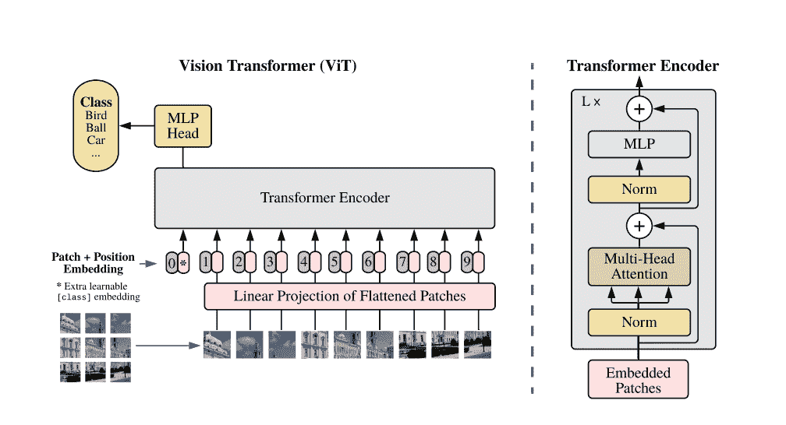
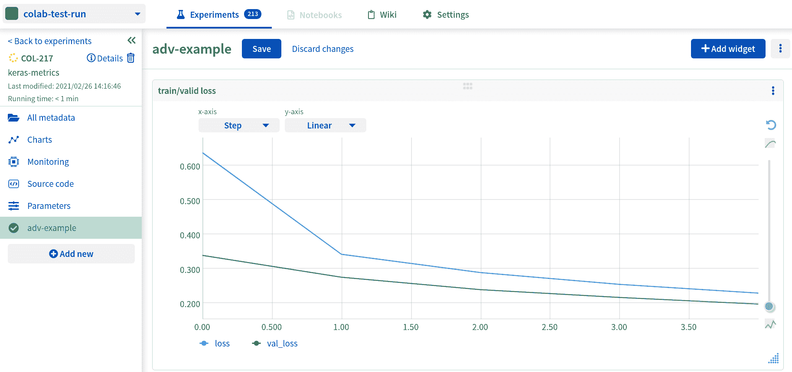

# 构建基于深度学习的 OCR 模型:经验教训

> 原文：<https://web.archive.org/web/https://neptune.ai/blog/building-deep-learning-based-ocr-model>

深度学习解决方案席卷了整个世界，各种组织，如科技巨头、成熟的公司和初创公司，现在都在试图以某种方式将深度学习(DL)和机器学习(ML)融入他们当前的工作流程。在过去的几年中，OCR 引擎是非常受欢迎的重要解决方案之一。

**OCR(光学字符识别)**是一种直接从数字文档和扫描文档中读取文本信息的技术，无需任何人工干预。这些文档可以是任何格式，如 PDF、PNG、JPEG、TIFF 等。使用 OCR 系统有很多优点，它们是:

## 

*   由于处理(提取信息)文档所需的时间更少，因此提高了工作效率。
*   它节省了资源，因为你只需要一个 OCR 程序来完成这项工作，不需要任何手工操作。
*   3 它消除了手动数据输入的需要。
*   出错的机会变少了。

从数字文档中提取信息仍然很容易，因为它们有元数据，可以给你文本信息。但是对于扫描副本，您需要一个不同的解决方案，因为元数据在这方面没有帮助。深度学习的需求来了，它为从图像中提取文本信息提供了解决方案。

在本文中，您将了解构建基于深度学习的 OCR 模型的不同课程，以便当您处理任何此类用例时，您可能不会遇到我在开发和部署期间遇到的问题。

## 什么是基于深度学习的 OCR？

OCR 现在已经变得非常流行，并且已经被几个行业采用，用于从图像中更快地读取文本数据。而像[轮廓检测](https://web.archive.org/web/20230311220621/https://learnopencv.com/contour-detection-using-opencv-python-c/)、[图像分类](https://web.archive.org/web/20230311220621/https://desktop.arcgis.com/en/arcmap/latest/extensions/spatial-analyst/image-classification/what-is-image-classification-.htm)、[连通分量分析](https://web.archive.org/web/20230311220621/https://pyimagesearch.com/2021/02/22/opencv-connected-component-labeling-and-analysis/)等解决方案。用于具有可比文本大小和字体、理想照明条件、良好图像质量等的文档。这种方法对于不规则的、不同种类的文本是无效的，这些文本通常被称为野生文本或场景文本。该文本可能来自汽车牌照、门牌号、扫描不良的文档(没有预定义的条件)等。为此，使用深度学习解决方案。使用 DL 进行 OCR 需要三个步骤，这些步骤是:

1.  **预处理:** OCR 不是一个容易的问题，至少没有我们想象的那么容易。从数字图像/文档中提取文本数据还是可以的。但是当涉及到扫描或手机点击图像时，事情就变了。现实世界的图像并不总是在理想的条件下被点击/扫描，它们可能有噪声、模糊、倾斜等。这需要在将 DL 模型应用于它们之前进行处理。为此，需要[图像预处理](https://web.archive.org/web/20230311220621/https://tesseract-ocr.github.io/tessdoc/ImproveQuality.html)来解决这些问题。

2.  **文字检测/定位:**现阶段的型号有 [Mask-RCNN](https://web.archive.org/web/20230311220621/https://github.com/matterport/Mask_RCNN) 、[东方文字检测器](https://web.archive.org/web/20230311220621/https://github.com/argman/EAST)、 [YoloV5](https://web.archive.org/web/20230311220621/https://github.com/ultralytics/yolov5) 、 [SSD](https://web.archive.org/web/20230311220621/https://github.com/amdegroot/ssd.pytorch) 等。用于定位图像中的文本。这些模型通常在图像或文档中识别的每个文本上创建边界框(正方形/矩形框)。

3.  **文本识别:**一旦文本位置被识别，每个边界框被发送到文本识别模型，该模型通常是 [RNNs](https://web.archive.org/web/20230311220621/https://en.wikipedia.org/wiki/Recurrent_neural_network) 、[CNN](https://web.archive.org/web/20230311220621/https://en.wikipedia.org/wiki/Convolutional_neural_network)和[注意力网络](https://web.archive.org/web/20230311220621/https://en.wikipedia.org/wiki/Attention_(machine_learning))的组合。这些模型的最终输出是从文档中提取的文本。一些开源的文本识别模型，如 [Tesseract](https://web.archive.org/web/20230311220621/https://github.com/tesseract-ocr/tesseract) 、 [MMOCR](https://web.archive.org/web/20230311220621/https://github.com/open-mmlab/mmocr) 等。可以帮助你获得良好的准确性。

*Deep learning based OCR model | Source: Author*

为了解释 OCR 模型的有效性，让我们看一下现在应用 OCR 来提高系统的生产率和效率的几个部分:

*   **银行业的 OCR:**自动化客户验证、支票存款等。使用基于 OCR 的文本提取和验证的过程。

*   **保险领域的 OCR:**从保险领域的各种文档中提取文本信息。

*   **医疗保健中的 OCR:**处理诸如病历、x 光报告、诊断报告等文档。可能是一项艰巨的任务，但 OCR 可以让您轻松完成。

这些只是应用 OCR 的几个例子，要了解更多关于它的用例，你可以参考下面的[链接](https://web.archive.org/web/20230311220621/https://softengi.com/blog/object-character-recognition-use-cases/)。

## 构建基于深度学习的 OCR 模型的经验教训

既然您已经了解了什么是 OCR，以及是什么使它成为当前时代的一个重要概念，那么是时候讨论一下您在使用它时可能会面临的一些挑战了。我参与了几个与金融(保险)部门相关的基于 OCR 的项目。仅举几个例子:

*   我曾参与过一个**[【KYC】](https://web.archive.org/web/20230311220621/https://www.thalesgroup.com/en/markets/digital-identity-and-security/banking-payment/issuance/id-verification/know-your-customer)验证 OCR** 项目，需要从不同的身份证明文件中提取信息并相互验证，以验证客户档案。
*   我还做过保险文档 OCR，需要从不同的文档中提取信息并用于其他目的，如创建用户档案、用户验证等。

我在研究这些 OCR 用例时学到的一件事是，你不必每次都失败来学习不同的东西。你也可以从别人的错误中学习。当我在团队中为这些基于 DL 的财务 OCR 项目工作时，有几个阶段面临挑战。让我们以 ML 管道开发不同阶段的形式来讨论这些挑战。

### 数据收集

#### 问题

这是处理任何 ML 或 DL 用例的第一个也是最重要的阶段。大多数 OCR 解决方案被金融机构采用，如银行、保险公司、经纪公司等。因为这些组织有大量难以手动处理的文档。因为它们是金融机构，所以这些金融机构必须遵守政府的规章制度。

因此，如果您正在为这些金融公司进行任何 [POC(概念验证)](https://web.archive.org/web/20230311220621/https://en.wikipedia.org/wiki/Proof_of_concept)工作，他们可能不会为您共享大量数据来训练您的文本检测和识别模型。由于深度学习解决方案都是关于数据的，所以你可能会得到性能很差的模型。这当然与法规遵从性有关，如果他们共享数据，他们可能会侵犯用户的隐私，从而导致客户的财务和其他类型的损失。

#### 解决办法

这个问题有什么解决办法吗？是的，它已经。假设您想要处理某种表单或 ID 卡来提取文本。对于表单，您可以向客户索要空模板，并用您的随机数据填充它们(耗时但有效);对于 id 卡，您可以在互联网上找到许多样本，您可以使用它们开始制作。此外，您可以只需要这些表格和身份证的一些样本，并使用[图像增强](https://web.archive.org/web/20230311220621/https://medium.com/analytics-vidhya/image-augmentation-9b7be3972e27)技术为您的模型训练创建新的类似图像。

*Image augmentation for OCR | [Source](https://web.archive.org/web/20230311220621/https://nanonets.com/blog/data-augmentation-how-to-use-deep-learning-when-you-have-limited-data-part-2/) *

有时，当您想要开始处理 OCR 用例并且没有任何组织数据时，您可以使用在线(开源)的 OCR 数据集之一。你可以在这里查看 OCR 的最佳数据集列表。

### 标注数据(数据注释)

#### 问题

现在，您已经有了数据，并且使用图像增强技术创建了新的样本，列表上的下一件事是数据标注。数据标注是在您希望对象检测模型在图像中找到的对象上创建边界框的过程。在这种情况下，我们的对象是文本，所以您需要在您希望模型识别的文本区域上创建边界框。创建这些标签是一项非常繁琐但重要的任务。这是你无法摆脱的。

此外，当我们谈论注释时，边界框过于笼统，对于不同类型的用例，使用不同类型的注释。例如，在你想要一个对象的最精确的坐标的情况下，你不能使用正方形或矩形的边界框，你需要使用多项式(多线)的边界框。对于想要将图像分成不同部分的语义分割用例，您需要为图像中的每个像素分配一个标签。要了解更多不同类型的注释，您可以参考此[链接](https://web.archive.org/web/20230311220621/https://hackernoon.com/illuminating-the-intriguing-computer-vision-uses-cases-of-image-annotation-w21m3zfg)。

#### 解决办法

有什么方法可以加快你作品的标签制作过程？是的，有。通常，如果你使用图像增强技术，如添加噪声，模糊，亮度，对比度等。图像几何形状没有变化，因此您可以将原始图像的坐标用于这些增强图像。此外，如果您要旋转图像，请确保将它们旋转多个 90 度，这样您也可以将注释(标签)旋转到相同的角度，这将节省您大量的返工。对于这项任务，您可以使用 [VGG](https://web.archive.org/web/20230311220621/https://www.robots.ox.ac.uk/~vgg/software/via/) 或 [VoTT](https://web.archive.org/web/20230311220621/https://github.com/microsoft/VoTT) 图像注释工具。

有时，当你有很多数据要注释时，你甚至可以外包，有很多公司提供注释解决方案。您只需要简单地解释您想要的注释类型，注释团队就会为您完成。

### 模型架构和培训基础设施

#### 问题

您必须确保的一件事是用于训练模型的硬件组件。训练对象检测模型需要相当大的 RAM 容量和 GPU 单元(其中一些也可以与 CPU 一起工作，但训练会非常慢)。

另一部分是这些年来在计算机视觉领域已经引入了不同的对象检测模型。选择一个最适合您的用例(文本检测和识别)并且在您的 GPU/CPU 机器上运行良好的方法可能很困难。

#### 解决办法

对于第一部分，如果你有一个基于 GPU 的系统，那么没有必要担心，因为你可以很容易地训练你的模型。但是，如果您使用的是 CPU，一次性训练整个模型会花费很多时间。在这种情况下，[迁移学习](https://web.archive.org/web/20230311220621/https://machinelearningmastery.com/transfer-learning-for-deep-learning/)可能是一条可行之路，因为它不涉及从零开始训练模型。

每个新引入的计算机视觉模型要么具有全新的架构，要么提高现有模型的性能。对于较小且密集的对象，如文本， [YoloV5](https://web.archive.org/web/20230311220621/https://github.com/ultralytics/yolov5) 因其架构优势而优先用于文本检测。

如果您想将一幅图像分割成多个部分(按像素)，最好考虑使用 [Masked-RCNN](https://web.archive.org/web/20230311220621/https://github.com/matterport/Mask_RCNN) 。对于文本识别，一些广泛使用的模型有 [MMOCR](https://web.archive.org/web/20230311220621/https://github.com/open-mmlab/mmocr) 、 [PaddleOCR](https://web.archive.org/web/20230311220621/https://github.com/PaddlePaddle/PaddleOCR) 和 [CRNN](https://web.archive.org/web/20230311220621/https://github.com/bgshih/crnn) 。

### 培养

#### 问题

这是一个非常关键的阶段，在这里你将训练你的基于 DL 的文本检测和识别模型。我们都知道的一件事是，训练深度学习模型是一个黑盒事情，你可以尝试不同的参数，以获得针对你的用例的最佳结果，而不知道下面发生了什么。你可能需要尝试不同的深度学习模型来进行文本检测和识别，这对于所有那些你需要在训练中注意的超参数来说是相当困难的。

#### 解决办法

我在这里学到的一件事是，你必须专注于一个单一的模型，直到你尝试了所有的东西，比如[超参数调整](/web/20230311220621/https://neptune.ai/blog/hyperparameter-tuning-in-python-complete-guide)，模型架构调整等等。你不需要仅仅通过尝试一些东西来判断一个模型的性能。

此外，我会建议您分部分训练您的模型，例如，如果您想将您的模型训练到 50 个时期，请将其分为三个不同的步骤 15 个时期、15 个时期和 20 个时期，并在中间对其进行评估。通过这种方式，您将在不同的阶段获得结果，并了解模型的表现是好是坏。这比几天内一次尝试所有 50 个时期，最后发现模型对您的数据根本不起作用要好。

同样，正如上面已经讨论过的，[迁移学习](/web/20230311220621/https://neptune.ai/blog/transfer-learning-guide-examples-for-images-and-text-in-keras)可能是关键。您可以从头开始训练您的模型，但使用已经训练好的模型并根据您的数据对其进行微调肯定会给您带来良好的准确性。

### 测试

#### 问题

一旦你的模型准备好了，下一件事就是测试模型的性能。测试深度学习模型非常容易，因为你可以看到结果(在对象上创建的边界框)或将提取的文本与地面真实数据进行比较，不像传统的机器学习用例那样需要从数字中解释结果。

如今，你可以使用手工 DL 模型测试，或者尝试一种可用的[自动化测试](/web/20230311220621/https://neptune.ai/blog/automated-testing-machine-learning)服务。手动过程需要一些时间，因为您必须自己检查每一张图像来判断模型的性能。如果您正在处理财务用例，那么您可能只能进行手工测试，因为您不能与在线自动化测试服务共享数据。

#### 解决办法

我在这里给出的一个主要建议是，永远不要在训练数据集上测试你的模型，因为这不会显示你的模型的真实性能。您需要创建三个不同的数据集训练、验证和测试。首先，两个将用于训练和运行时模型评估，而测试数据集将向您展示模型的真实性能。

下一件事是决定评估检测和识别模型性能的最佳指标。因为文本检测是一种对象检测，所以使用 mAP(平均精度)来评估模型的性能。它将模型预测边界框与地面真实边界框进行比较，并返回分数，分数越高，性能越好。

对于文本识别模型，广泛使用的度量是 CER(字符错误率)。对于该测量，将每个预测特征与地面真实值进行比较，以告知模型性能，CER 越低，模型性能越好。您需要您的模型有少于 10%的 CER，以便用手动过程替换它。想了解更多 CER 以及如何计算，可以查看下面的[链接](https://web.archive.org/web/20230311220621/https://towardsdatascience.com/evaluating-ocr-output-quality-with-character-error-rate-cer-and-word-error-rate-wer-853175297510)。

### 部署和监控

#### 问题

一旦你有了足够精确的最终模型，你就必须把它们部署到某个地方，让目标受众能够接触到它们。无论在哪里部署，这都是您可能会面临一些问题的主要步骤之一。我在部署这些模型时面临的三个重要挑战是:

1.  我使用了 [PyTorch](https://web.archive.org/web/20230311220621/https://pytorch.org/) 库来实现对象检测模型，如果你在训练的时候没有把它训练成多线程，这个库不允许你在推断的时候使用多线程。
2.  模型大小可能太大，因为它是基于 DL 的模型，并且在推断时可能需要更长的时间来加载。
3.  部署模型是不够的，您需要对它进行几个月的监控，以了解它是否如预期的那样执行，或者它是否有进一步改进的空间。

#### 解决办法

因此，为了解决第一个问题，我建议您必须意识到，您必须使用 Pytorch 和多线程来训练模型，以便您可以在推理时使用它，或者另一个解决方案是切换到另一个框架，即寻找您想要的 torch 模型的 [TensorFlow](https://web.archive.org/web/20230311220621/https://www.tensorflow.org/) 替代方案，因为它已经支持多线程，并且非常容易使用。

对于第二点，如果您有一个非常大的模型，需要花费大量时间来加载进行推理，您可以将您的模型转换为 [ONNX](https://web.archive.org/web/20230311220621/https://onnx.ai/) 模型，它可以通过⅓减少模型的大小，但对您的准确性有轻微的影响。

模型监控可以手动完成，但需要一些工程资源来查找 OCR 模型失败的情况。相反，你可以使用不同的自动监控解决方案，如 [Neptune](/web/20230311220621/https://neptune.ai/) 、 [Arize](https://web.archive.org/web/20230311220621/https://arize.com/) 、 [WhyLabs](https://web.archive.org/web/20230311220621/https://whylabs.ai/) 等。

*Tracking KPIs with Neptune | [Source](https://web.archive.org/web/20230311220621/https://docs.neptune.ai/you-should-know/what-can-you-log-and-display)*

你可以在这篇文章中了解更多:[做 ML 模型监控的最佳工具](/web/20230311220621/https://neptune.ai/blog/ml-model-monitoring-best-tools)。

## 结论

读完这篇文章后，您现在知道什么是基于深度学习的 OCR，它的各种用例，并最终看到了一些基于我在处理 OCR 用例时看到的场景的经验教训。OCR 技术现在正在取代手工数据输入和文档处理工作，这可能是一个实践它的好时机，这样你就不会感到被排除在数字图书馆的世界之外。当处理这些类型的用例时，你必须记住你不可能一次就有一个好的模型。你需要尝试不同的事情，从你要做的每一步中学习。

从头开始创建解决方案可能不是一个好的解决方案，因为在处理不同的用例时，您不会有大量的数据，所以尝试迁移学习和微调不同的数据模型可以帮助您实现良好的准确性。这篇文章的目的是告诉您我在处理 OCR 用例时遇到的不同问题，这样您就不必在工作中面对它们。尽管如此，随着技术和库的变化，可能会出现一些新的问题，但是您必须寻找不同的解决方案来完成工作。