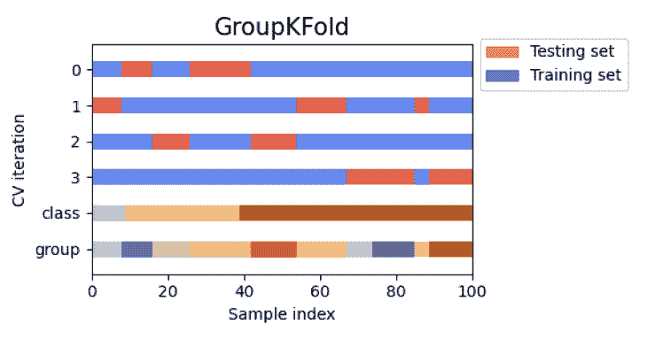
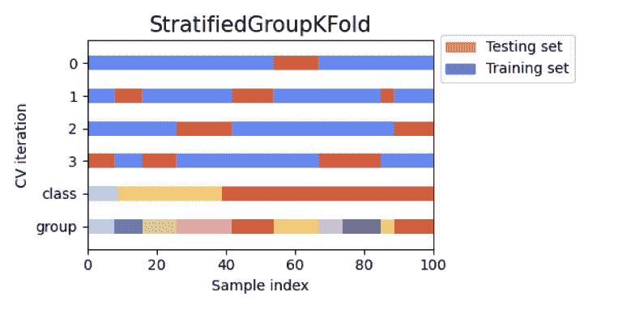
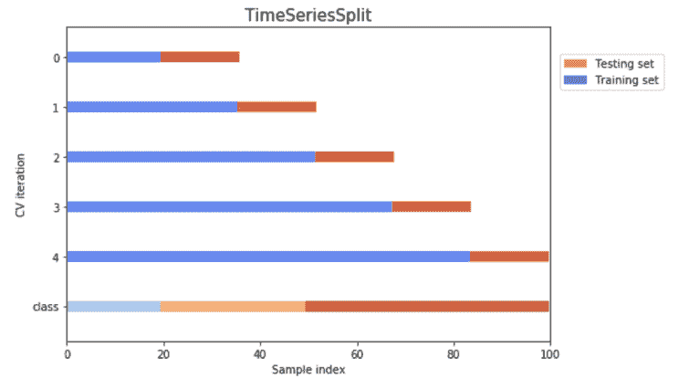
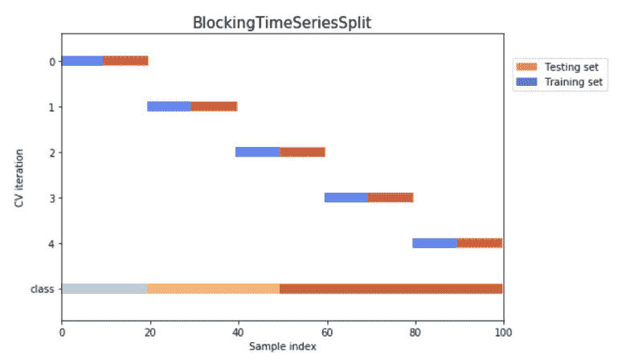

# 7 个交叉验证错误会让你损失惨重[ML 中的最佳实践]

> 原文：<https://web.archive.org/web/https://neptune.ai/blog/cross-validation-mistakes>

我们都希望我们的模型能够很好地泛化，以便它们在任何类型的数据集上都保持最佳性能。为了确保这样的需求，我们经常在机器学习项目中依赖交叉验证，这是一种用于评估有限数据样本上的机器学习模型的重采样程序。当你花了这么多时间来调整你的模型，却发现你的交叉验证策略有问题，这可能是一场噩梦。

在本文中，我们将讨论人们在使用交叉验证时最常犯的七个错误，以及如何避免它们。让我们从交叉验证的简单介绍开始。

## 什么是交叉验证？

它是一种统计方法，用于在机器学习模型投入使用之前评估其性能。它包括以下步骤:

1.  首先，我们将数据集分成 k 个折叠。
2.  k 个折叠中的一个用于测试，而 k-1 个折叠用于模型训练。
3.  这个过程重复 k 次，以估计模型的平均性能。


*K-fold cross-validation | [Source](/web/20220928202143/https://neptune.ai/blog/cross-validation-in-machine-learning-how-to-do-it-right)*

这种方法产生的性能评估偏差较小。

### 了解更多信息

要了解更多关于交叉验证的信息，你可以参考这篇文章👉[机器学习中的交叉验证:如何正确操作](/web/20220928202143/https://neptune.ai/blog/cross-validation-in-machine-learning-how-to-do-it-right)

## 进行交叉验证时的常见错误

### 1.随机选择分裂的数量

k-fold 交叉验证的关键配置参数是 k，它定义了数据集将被分割的折叠数。这是使用 k 折叠交叉验证时的第一个困境。我们通常坚持最常用的 k 值，即 5，这在计算上不太昂贵。

没有硬性的规则来决定 k 的值。如果 k 的值太小(如 2 或 3)，性能估计器的悲观偏差会很高。如果您增加 k 的值，则所得估计值的偏差和方差将会减少，从而在 k=10 附近给出一个合适的折衷。

但是，在确定 k 的值时，必须确保所选的值对数据集有意义。解决这一问题的一种经过试验和测试的方法是对不同的 k 值进行敏感性分析，即评估具有不同 k 值的模型的性能，并观察它们的表现。

## 2.总是选择目标分层交叉验证进行分类

在处理分类问题时，我们的自然倾向是总是选择在目标标签上分层的流行的**分层 k 折叠**。这里假设底层数据包含**独立样本，并且是同分布的。**然而，这并不一定适用于所有情况。让我们借助一个例子来理解这一点:

考虑从多个患者收集的医疗数据，该数据可能包含来自每个患者的多个样本。并且这种数据可能依赖于个体患者组。在这种情况下，我们想知道我们在特定群体上训练的模型是否能在看不见的患者群体上很好地推广。为了实现这一点，我们希望保持训练组和验证组相互排斥，即不在验证数据集中保留任何训练患者组。

**组 k 倍**是帮助我们处理上述情况的 k 倍的变异。它确保同一组不会出现在训练集、验证集和测试集中。你可以在这里找到 scikit-learn 实现。



*GroupKfold cross validation | [Source](https://web.archive.org/web/20220928202143/https://scikit-learn.org/stable/auto_examples/model_selection/plot_cv_indices.html)*

大部分分类问题都有类别[不平衡数据](/web/20220928202143/https://neptune.ai/blog/how-to-deal-with-imbalanced-classification-and-regression-data)。在这种情况下，您可能希望将 k 组折叠与分层相结合，这里有一个 scikit-learn dev 实现**分层 k 组折叠**，您可以在这里找到。



*Stratified GroupKfold cross validation | [Source](https://web.archive.org/web/20220928202143/https://scikit-learn.org/stable/auto_examples/model_selection/plot_cv_indices.html)*

在上图中，您可以看到 GroupKfold 和 StatifiedGroupKfold 之间的区别。分层组 k-fold 在尝试返回分层样本时试图保持对组 k-fold 的约束。

### 3.回归问题中交叉验证技术的选择

为回归问题选择交叉验证方案时，大多数人会选择正态 K 倍，因为目标值是连续的。这将导致训练和验证集随机分裂，且不能确保训练和验证中目标值的相同分布。

为了解决这个常见的错误，我们可以将目标值分成 n 个箱，然后使用这些箱值进行分层 k 折叠。让我们来看看这是如何做到的:

```
From sklearn.model_selection import StratifiedKFold
def create_folds(df, n_grp, n_s=5):

    df['Fold'] = -1
    skf = StratifiedKFold(n_splits=n_s)
    df['grp'] = pd.cut(df.target, n_grp, labels=False)
    target = df.grp
    for fold_no, (t, v) in enumerate(skf.split(target, target)):
        df.loc[v, 'Fold'] = fold_no
    return df
```

现在，这将确保在您训练和验证中有一个相同的目标分布。这种方法也称为连续目标分层。

### 4.交叉验证前的过采样

这是我在处理分类问题时进行交叉验证时观察到的一个非常常见的错误。分类任务中的大多数数据集都存在类不平衡问题。解决**类不平衡**的一种方法是进行过采样，即通过随机将少数类的样本添加到数据集中，以使每个标签的样本数量平衡。

假设您正在处理一个欺诈检测数据集。你发现在这个问题上存在极端的阶级不平衡，你决定首先解决这个问题。为了解决这个问题，你决定进行过采样。在这之后，你选择做交叉验证。现在，通过 k-fold 交叉验证形成的训练和验证数据集将具有许多公共样本，这将导致**高估模型性能**。因此，**避免在交叉验证之前进行过采样。**

如果过采样对您的任务至关重要，您应该首先将数据拆分到相应的折叠中，然后在训练和验证循环中继续进行上采样。下面是实现这一点的伪代码:

```
kfold = KFold(n_splits=n_splits)
scores = []
for train,valid in kfold.split(data):

        train_oversampled = oversample_function(train) 
        score = train_and_validate(train_oversampled,valid) 
        scores.append(score)
```

### 5.知识泄露

这是机器学习中的一个主要问题，在进行交叉验证时也很常见。知识泄漏或数据泄漏是指使用训练集之外的**信息来创建模型。这些额外的信息允许模型知道一些它原本不知道的关于数据的额外信息。这导致**过于乐观的预测**和**高估车型性能**。让我们通过一个流行的错误来理解这一点，**

假设您正在处理包含数百个特征的药物分类表格数据。你决定通过主成分分析进行一些特征工程。完成 PCA 后，将前 5 个主成分作为特征添加到数据中。之后，您决定进行交叉验证，并将数据输入 CV 循环。现在你会发现你的简历成绩比预期提高了很多。您对您的模型感到满意，并继续在维持测试集上测试性能。但是出乎你的意料，你的模型表现很差！

这里，您犯了数据泄漏的错误，因为您对整个数据进行了 PCA，而不是分别对训练和验证进行 PCA。一般来说，任何应用于数据的**特征工程都应该在 CV 循环**内单独进行训练和验证，以避免数据泄漏。

### 6.时间序列数据的交叉验证

我们知道时间序列数据是不同的。在进行时间序列预测时，我们的目标是建立一个能够根据过去的一些观察结果预测未来的模型。在验证时间序列模型时，应该始终只保留验证/测试集中过期的样本。这是为了确保模型能够很好地概括历史数据。

在对时间序列数据建模时，使用 scikit-learn 中可用的普通 k-fold 方法进行交叉验证是一个常见的错误。这将导致训练和验证数据集的随机分割，无法确保**超时条件**。因此，在进行时间序列预测时，应该始终使用 scikit-learn 中可用的 [**时间序列分割**](https://web.archive.org/web/20220928202143/https://scikit-learn.org/stable/modules/generated/sklearn.model_selection.TimeSeriesSplit.html) **方法**来进行交叉验证。



*Time series split cross validation | [Source](https://web.archive.org/web/20220928202143/https://goldinlocks.github.io/Time-Series-Cross-Validation/#:~:text=Blocked%20cross%2Dvalidation%20works%20by,and%20another%20as%20a%20response.)*

滞后特征被广泛用于时间序列预测时的响应建模，这也可能导致数据泄漏。使用滞后功能时，您可以使用[阻塞时间序列分割](https://web.archive.org/web/20220928202143/https://goldinlocks.github.io/Time-Series-Cross-Validation/#:~:text=Blocked%20cross%2Dvalidation%20works%20by,and%20another%20as%20a%20response.)。下图描述了时间序列分割和分块时间序列分割方法之间的区别。



*Blocking time series split cross validation |* [*Source*](https://web.archive.org/web/20220928202143/https://goldinlocks.github.io/Time-Series-Cross-Validation/#:~:text=Blocked%20cross%2Dvalidation%20works%20by,and%20another%20as%20a%20response.)

它的工作原理是在两个位置增加边距。第一个是在训练和验证折叠之间，以防止模型观察到两次使用的滞后值，一次作为回归变量，另一次作为响应。第二个是在每次迭代中使用的折叠之间，以防止模型从一次迭代到下一次迭代记住模式。

### 7.交叉验证估计中的随机性

几乎所有用于机器学习的算法都受到随机种子值的影响。然而，在像变压器这样的复杂深度神经网络的情况下，随机种子的效果特别高。当用小数据集训练像 BERT 这样的大模型时，这种效果会非常明显。对于这样的模型，您不太可能使用正常的交叉验证来获得模型性能的准确估计。

为了避免在用你坚持的测试数据集测试你的模型时出现任何意外，你应该在多个种子上做**交叉验证，并平均模型性能**。这将使您能够更好地理解您的模型性能。这是它的伪代码，

```
SEEDS = [1, 2, 3, 4, 5]
ScoreMetric = []

for seed in SEEDS:

    seed_all(seed) 
    kfold = KFold(n_splits=5, random_state=seed)
    scores = []

    for train,valid in kfold.split(data):

            score = train_and_validate(train,valid) 
            scores.append(score)

    ScoreMetric.append(scores)

Print(f"Average Model Performance {np.mean(ScoreMetric)}")
```

## 结论

在本文中，我们讨论了人们在进行交叉验证时会犯的一些常见错误。我们还研究了这些错误的不同解决方案。我希望通过这篇文章，你能够更好地了解交叉验证。

同时，我会敦促你参考更多关于使用不同模型选择和验证技术的实验的研究论文。我附上了一些很好的参考资料，以帮助您开始学习。

### 参考

### 沙胡尔 ES

数据科学家，非常熟悉机器学习、NLP 和音频处理领域。他是 Kaggle 大师，也喜欢做开源。

* * *

**阅读下一篇**

## 如何比较机器学习模型和算法

9 分钟阅读|作者 Samadrita Ghosh |年 9 月 16 日更新

机器学习在过去几年里迅速发展。今天，数据科学家和开发人员不再使用简单的、单向的或线性的 ML 管道，而是运行多个并行实验，即使对于大型团队来说，这些实验也可能变得不堪重负。每个实验都应该以一种不变的、可重复的格式记录下来，这就产生了无穷无尽的日志，其中包含了无价的细节。

我们需要通过将机器学习模型与平行实验进行彻底比较来缩小技术范围。使用计划周密的方法对于理解如何选择算法和手头数据的正确组合是必要的。

因此，在本文中，我们将探讨如何比较 ML 模型和算法。

## 模型选择的挑战

每个模型或任何机器学习算法都有几个以不同方式处理数据的特征。通常，根据之前的实验阶段，输入这些算法的数据也是不同的。但是，由于机器学习团队和开发人员通常会记录他们的实验，因此有足够的数据可供比较。

挑战在于理解哪些参数、数据和元数据必须被考虑以达到最终的选择。这是一个经典的悖论，有大量的细节却不清晰。

更具挑战性的是，我们需要了解一个具有高值的参数，比如说一个较高的度量分数，是否实际上意味着该模型比一个具有较低分数的模型更好，或者它是否只是由统计偏差或错误的度量设计引起的。

[Continue reading ->](/web/20220928202143/https://neptune.ai/blog/how-to-compare-machine-learning-models-and-algorithms)

* * *