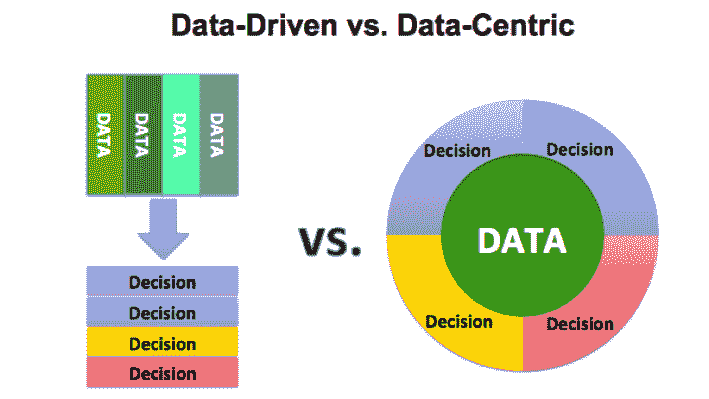
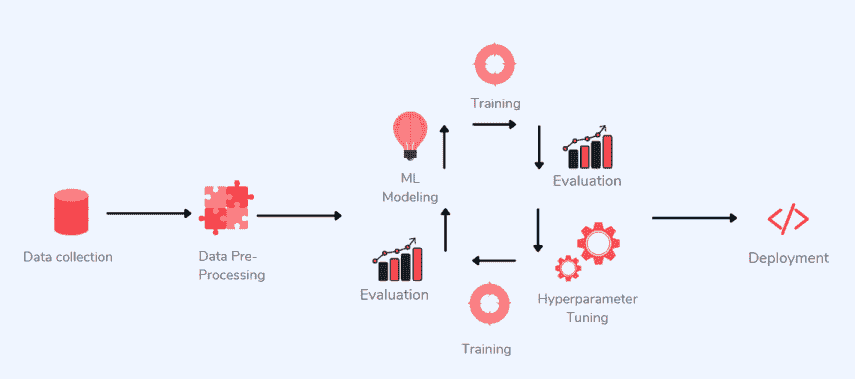
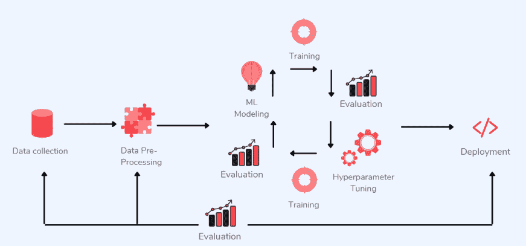
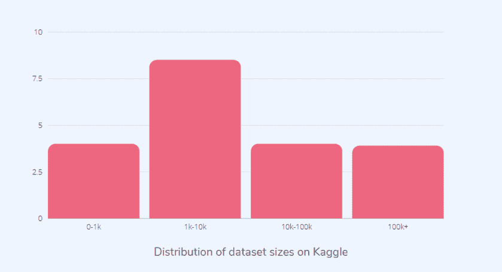
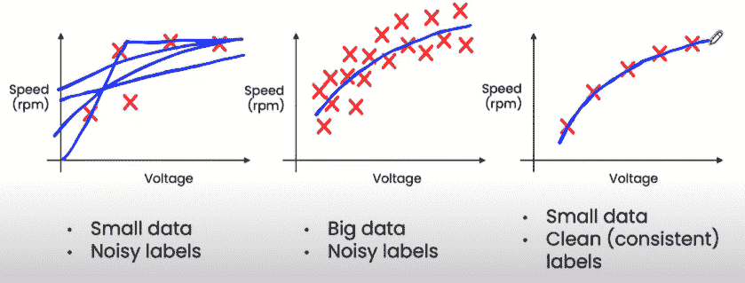

# 机器学习中的数据中心方法与模型中心方法

> 原文：<https://web.archive.org/web/https://neptune.ai/blog/data-centric-vs-model-centric-machine-learning>

**代码和数据**是 AI 系统的基础。这两个组件在健壮模型的开发中都起着重要的作用，但是您应该更关注哪一个呢？在本文中，我们将介绍[**以数据为中心的**与**以模型为中心的**](https://web.archive.org/web/20221211152138/https://www.linkedin.com/pulse/data-centric-approach-vs-model-centric-steve-nouri/?trk=public_post) **方法**，看看哪种方法更好，我们还将讨论如何采用以数据为中心的基础设施。

## 以模型为中心的方法

**以模型为中心的方法**意味着开发实验研究以提高 ml 模型的性能。这包括从广泛的可能性中选择最佳的模型架构和训练过程。****

*   在这种方法中，您保持数据不变，并改进代码或模型架构。
*   处理代码是这种方法的中心目标。

### 人工智能世界中以模型为中心的趋势

目前，[大多数人工智能应用都是以模型为中心的](https://web.archive.org/web/20221211152138/https://hbr.org/2021/07/ai-doesnt-have-to-be-too-complicated-or-expensive-for-your-business)，这背后的一个可能原因是人工智能领域非常关注对模型的学术研究。据[吴恩达](https://web.archive.org/web/20221211152138/https://www.youtube.com/watch?v=06-AZXmwHjo&t=69s)称，该领域超过 90%的研究论文都是以模型为中心的。这是因为很难创建能够成为公认标准的大型数据集。因此，人工智能社区认为，以模型为中心的机器学习更有前途。**在关注代码的同时，数据经常被忽略，数据收集被视为一次性事件。**

## 以数据为中心的方法

在这个时代，数据是每个决策过程的核心，以数据为中心的公司可以通过使用运营中产生的信息，更好地使其战略与其利益相关者的利益保持一致。这样，结果可以更准确、更有条理、更透明，有助于组织更顺利地运行。

*   这种方法包括系统地改变/改进数据集，以提高您的 ML 应用程序的准确性。
*   处理数据是这种方法的核心目标。

### 数据驱动/以数据为中心的难题

*Data-driven vs data-centric |*[*Source*](https://web.archive.org/web/20221211152138/https://www.asti.com/the-difference-between-data-centric-and-data-driven/)

许多人经常对以数据为中心的方法和数据驱动的方法感到困惑。数据驱动方法是一种从数据中收集、分析和提取见解的方法。它有时被称为“分析”另一方面，以数据为中心的方法专注于使用数据来定义您首先应该创建什么。

*   **以数据为中心的架构**指的是一种系统，其中数据是主要的永久资产，而应用程序会发生变化。
*   **数据驱动架构**意味着通过吸收大量数据来创造技术、技能和环境。

现在让我们谈谈以数据为中心的方法与以模型为中心的方法有什么不同，以及首先需要它。

## 以数据为中心的方法与以模型为中心的方法

对于数据科学家和机器学习工程师来说，以模型为中心的方法似乎更令人愉快。这是可以理解的，因为从业者可能会使用他们的知识来解决特定的问题。另一方面，没有人愿意花一整天的时间来标记数据，因为这被认为是一次性的工作。

然而，在今天的机器学习中，数据是至关重要的，但它在人工智能计划中经常被忽视和错误处理。结果，数百个小时被浪费在基于错误数据的模型微调上。这很可能是您的模型准确性较低的根本原因，与模型优化无关。

| 以模型为中心的 ML | 以数据为中心的 ML |
| --- | --- |
| 

编写代码是中心目标

 | 

处理数据是中心目标

 |
| 

优化模型，使其能够处理数据中的噪声

 | 

与其收集更多的数据，不如投资更多的数据质量工具来处理嘈杂的数据

 |
|  |  |
| 

数据经过标准预处理后被固定

 | 

代码/算法固定

 |
| 

模型被迭代改进

 | 

迭代了数据质量

 |

*来源:[与 Andrew 关于 MLOps 的对话:从以模型为中心到以数据为中心的人工智能](https://web.archive.org/web/20221211152138/https://www.youtube.com/watch?v=06-AZXmwHjo)*

你不必完全以数据为中心；有时候关注模型和代码是很重要的。做研究和改进模型很好，但数据也很重要。我们倾向于在关注模型的同时忽略数据的重要性。最好的方法是采用一种同时关注数据和模型的混合方法。根据您的应用程序，您可以更多地关注数据，而不是模型，但是两者都应该考虑。

对以数据为中心的基础架构的需求

## 以模型为中心的 ML 指的是主要关注优化模型架构及其参数的机器学习系统。

*Model-centric ML application | Source: Author*

上图中描述的以模型为中心的工作流适用于少数行业，如媒体和广告，但也可以考虑医疗保健或制造业。他们可能面临以下挑战:

**1。需要高级定制**

与媒体和广告行业不同，拥有多种商品的制造企业无法使用单一的机器学习系统来检测其所有产品的生产故障。相反，每一个制造出来的产品都需要一个训练有素的 ML 模型。

虽然媒体公司有能力让整个 ML 部门处理每一个小的优化问题，但需要几个 ML 解决方案的制造企业在规模上无法遵循这样的模板。

**2。大型数据集的重要性**

在大多数情况下，公司没有大量的数据点来处理。相反，他们经常被迫处理微小的数据集，如果他们的方法是以模型为中心的，则容易产生令人失望的结果。

*Andrew NG* [*解释了*](https://web.archive.org/web/20221211152138/https://www.youtube.com/watch?v=06-AZXmwHjo&t=69s) *他如何认为以数据为中心的人工智能更有价值，并在他的人工智能演讲中倡导社区向以数据为中心的革命。* ***他给出了一个钢铁缺陷检测问题陈述的例子，其中以模型为中心的方法未能提高模型的准确性，而以数据为中心的方法将准确性提高了 16%。***

数据在人工智能研究中极其重要，采取优先获得高质量数据的策略至关重要——毕竟，相关数据不仅稀有和嘈杂，而且获得起来极其昂贵。这个想法是，人工智能应该以同样的方式被对待，就像我们在建造房子时会关心最好的材料一样。应该在每一个层次上对它们进行评估，而不是一次性事件。

采用以数据为中心的基础架构

*Data-centric ML application | Source: Author*

### 在实施以数据为中心的架构时，将数据视为比应用程序和基础架构更持久的基本资产。这种方法不需要单一的数据库或数据存储库，而是需要对数据有统一的理解和描述。以数据为中心的 ML 使数据共享和移动变得简单。

那么，以数据为中心的机器学习到底涉及到什么？在实施以数据为中心的方法时，您应该考虑哪些基本因素？

1.数据标签质量

#### 数据标注是将一个或多个标签分配给数据的过程。标签与应用于数据的特定值相关联。当大量图像被错误标记时，结果比使用较少但准确的图像时低。

标签提供了有关数据集内容和结构的详细信息，其中可能包括数据集中表示的数据类型、度量单位和时间段等组件。提高标签质量的最佳方法是找出标签中的不一致之处，并按照标签说明进行操作。在本文的后面，我们将了解更多关于数据质量的重要性。

2.数据扩充

#### 数据扩充是一项数据分析任务，涉及通过内插法、外推法或其他方法创建数据点。它可以用于为机器学习引入更多的训练数据，也可以用于制作具有不同程度真实感的合成图像或视频帧。它有助于增加相关数据点的数量，例如通过创建您的模型在整个训练期间尚未看到的数据来增加有缺陷的生产组件的数量。

然而，添加数据并不总是最好的选择。去除导致高方差的噪声观测值可以提高模型归纳新数据的能力。

3.特征工程

#### 特征工程是通过改变输入数据、先验知识或算法向模型添加特征的过程。它用于机器学习，以帮助提高预测模型的准确性。

提高数据质量包括改善输入数据和目标/标签。特征工程对于添加原始形式中可能不存在但可以产生显著差异的特征是至关重要的。

4.数据版本化

#### 在任何软件应用程序中，数据版本控制都扮演着重要的角色。作为开发人员，您希望通过比较两个版本来追踪 bug，并发现一些不再有意义的东西。或者您可以通过再次部署该特定版本来防止该错误。管理数据集访问以及每个数据集在整个时间内的多个版本是困难且容易出错的。数据版本化是维护数据最重要的步骤之一——它有助于跟踪数据集的变化(添加和删除)。版本控制使得代码协作和数据集管理变得更加容易。

版本化也使得从概念验证到生产的 ML 管道管理变得容易，这就是 MLOps 工具的作用。您可能想知道为什么在“数据版本化”的上下文中讨论 MLOps 工具。这是因为在机器学习应用程序的开发中，管理数据管道是一项非常困难的任务。版本控制确保了再现性和可靠性。以下是几个最好的数据版本化平台:

Neptune 是为研究和生产团队开发的 MLOps 的[元数据存储。它为您提供了一个记录、存储、显示、组织、比较和查询机器学习生命周期中生成的所有元数据的中心。在](/web/20221211152138/https://neptune.ai/)[数据版本化的背景下，使用 Neptune](https://web.archive.org/web/20221211152138/https://docs.neptune.ai/how-to-guides/data-versioning) 您可以:

使用[工件](https://web.archive.org/web/20221211152138/https://docs.neptune.ai/you-should-know/comparing-runs#artifact)跟踪模型训练运行中的数据集版本。

*   查询以前运行的数据集版本，以确保您在相同的数据集版本上进行训练。
*   在 Neptune UI 中组织数据集版本元数据。
*   [参见代码示例，了解关于 Neptune 数据版本控制的更多信息](https://web.archive.org/web/20221211152138/https://docs.neptune.ai/how-to-guides/data-versioning/version-datasets)。

weights & bias(WandB)是一个为研究人员和深度学习团队提供机器学习工具的平台。WandB 帮助您进行实验跟踪、数据集版本控制和模型管理。使用 WandB，您可以:

使用工件进行数据集版本化、模型版本化，并跨机器学习管道跟踪依赖性和结果。

*   您可以将完整的数据集直接存储在工件中，或者使用工件引用指向其他系统中的数据，如 S3、GCP 或您的本地机器。
*   [参见代码示例，了解更多关于 WandB 数据版本控制的信息](https://web.archive.org/web/20221211152138/https://docs.wandb.ai/guides/artifacts)。

DVC 是一个机器学习项目的开源平台。DVC 帮助数据科学家和开发人员进行数据版本管理、工作流管理和实验管理。DVC 让你:

在 [Git commits](https://web.archive.org/web/20221211152138/https://git-scm.com/book/en/v2/Git-Basics-Recording-Changes-to-the-Repository) 中捕获数据和模型的版本，同时将它们存储在本地或云存储中。

*   在不同的数据内容之间切换。
*   生成元文件，描述要跟踪的数据集、ML 工件。
*   [参见代码示例，了解更多关于 DVC 数据和模型版本的信息](https://web.archive.org/web/20221211152138/https://dvc.org/doc/use-cases/versioning-data-and-model-files/tutorial)。

5.领域知识

#### 领域知识在以数据为中心的方法中非常有价值。主题专家经常能发现 ML 工程师、数据科学家和标签员不能发现的小差异。在 ML 系统中仍然缺少领域专家的参与。如果有额外的领域知识，ML 系统可能会表现得更好。

以数据为中心的方法的优势

### 变得更加以数据为中心的优势有很多，从提高报告速度和准确性到做出更明智的决策。以数据为中心的基础架构具有诸多优势:

提高准确性，将数据作为战略资产有效地确保更精确的估计、观察和决策。

*   消除复杂的数据转换。
*   减少数据错误和不一致。
*   对内部和外部趋势提供有价值的见解，帮助您做出更好的决策。
*   减少开支。
*   使关键利益相关者更容易获得数据。
*   减少数据冗余。
*   提高数据质量和可靠性。
*   数据量和数据质量哪个优先？

## 在进一步讨论之前，我想强调的是，更多的数据并不等于更好的数据。当然，一个神经网络不能用一些图像来训练，但现在的重点是质量而不是数量。

数据质量

### 它指的是可访问的数据量。主要目标是收集尽可能多的数据，然后训练神经网络来学习映射。

如上图所示，大多数 [Kaggle](https://web.archive.org/web/20221211152138/https://www.kaggle.com/) 数据集并没有那么大。在以数据为中心的方法中，数据集的大小并不那么重要，一个小质量的数据集可以做很多事情。

*Data |* [*Source*](https://web.archive.org/web/20221211152138/https://www.youtube.com/watch?v=06-AZXmwHjo&t=69s) *(image by author*)

数据质量

### 顾名思义，数据质量就是质量。如果你没有数百万的数据集，这没有什么区别；重要的是它们质量高，标签贴得好。

在上图中，您可以看到标注数据的不同方式；单独标注或者组合标注都没有问题。例如，如果数据科学家 1 单独标记菠萝，但数据科学家 2 标记它合并，数据将不兼容，导致学习算法变得混乱。主要目标是保持标签的一致性；如果你是独立标注的，确保所有的标注都是一样的。

*Different approaches to drawing bounding boxes | Source: inspired by* [*Andrew Ng*](https://web.archive.org/web/20221211152138/https://www.youtube.com/watch?v=06-AZXmwHjo&t=69s)*, image by author *

数据注释的一致性至关重要，因为任何差异都可能使模型偏离轨道，并使您的评估不准确。**因此，您需要仔细定义注释指南，以确保 ML 工程师和数据科学家一致地标记数据。** *根据*[*re*](https://web.archive.org/web/20221211152138/https://arxiv.org/abs/2103.14749)*[s](https://web.archive.org/web/20221211152138/https://arxiv.org/abs/2103.14749)*[*earch*](https://web.archive.org/web/20221211152138/https://arxiv.org/abs/2103.14749)*统计，常用数据集中大约有 3.4%的样本被错误标注，其中大型模型受到的影响最大。*

在上图中，[吴恩达](https://web.archive.org/web/20221211152138/https://www.youtube.com/watch?v=06-AZXmwHjo)解释了小型数据集中一致性的重要性。上图说明了无人机的电压和速度之间的关系。如果数据集很小但标注一致，您可以自信地拟合曲线并获得更高的精度。

*Importance of consistency in small datasets | [Source](https://web.archive.org/web/20221211152138/https://www.youtube.com/watch?v=06-AZXmwHjo&t=69s)*

低质量的数据意味着缺陷和不准确可能会被无限期地检测出来，而不会产生任何后果。**模型的准确性取决于您的数据质量；**如果你想做出正确的决定，你需要准确的信息。属性差的数据存在包含错误和异常的风险，这在使用预测分析和建模技术时会非常昂贵。

说到数据，多少才算多？

### 您拥有的数据量至关重要；你必须有足够的数据来解决你的问题。深度网络是低偏差、高方差的计算机，我们认为方差问题的解决方案是更多的数据。但是多少数据才够呢？这是一个比你想象的更难回答的问题。 [Yolov5](https://web.archive.org/web/20221211152138/https://docs.ultralytics.com/tutorials/training-tips-best-results/) 建议道:

每节课至少 1.5k 张图片

*   每个类至少 10k 个实例(标记为对象)总计
*   拥有大量的数据是一个好处，而不是必须的。

以数据为中心的方法的最佳实践

## 如果您采用以数据为中心的方法，请记住以下几点:

确保 ML 项目生命周期中高质量数据的一致性。

*   使标签一致。
*   利用生产数据获得及时反馈。
*   使用误差分析来关注数据的子集。
*   消除噪声样本；如上所述，数据越多并不总是越好。
*   哪里可以找到好的数据集？

## 获得高质量的数据集是一项重要的任务。所以，这里有几个网站，你可以免费获得这样的数据集。

第一个是数据科学界众所周知的。在 Kaggle 中，您可以找到进行数据科学工作所需的所有代码和数据。它拥有超过 50，000 个公共数据集和 400，000 个公共笔记本，允许它快速完成任何分析。

Datahub 是一个数据集平台，主要关注商业和金融。许多数据集，如国家、人口和地理边界列表，目前都可以在 DataHub 上获得，还有更多正在开发中。

Graviti 是一个新的数据平台，主要为计算机视觉提供高质量的数据集。个人开发人员或组织可以轻松地访问、共享和更好地管理大量开放数据。

结论

## 在本文中，我们了解了以数据为中心的方法与以模型为中心的方法有何不同，以及如何让您的机器学习应用程序更加以数据为中心。我们不必把自己局限在一个单一的方向，代码和数据在人工智能的旅程中都扮演着重要的角色。在以模型为中心和以数据为中心的方法之间进行选择没有硬性规定，但是数据集的健壮性不应该被忽视。

数据质量必须在人工智能开发的每一个阶段得到维护和提高，根据定义，每一个阶段都需要不同的框架和工具。如果你想更深入地了解这一点，我在下面分享了一些参考资料来帮助你开始。

希望你喜欢这篇文章，继续尝试！

参考资料和推荐读物

### References and recommended reading