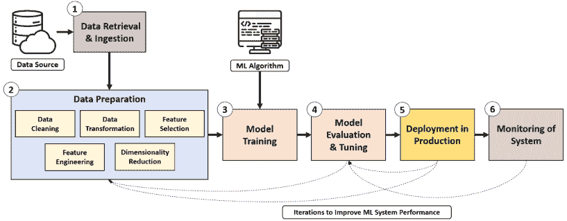
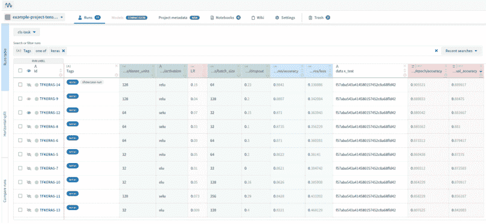
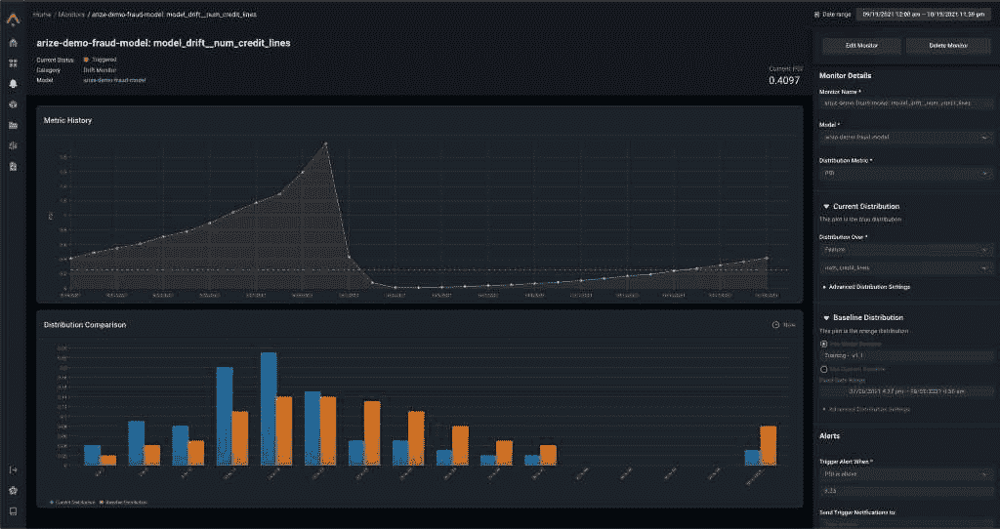
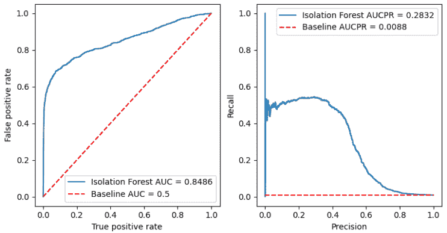

# 使用 Kedro 构建和管理数据科学管道

> 原文：<https://web.archive.org/web/https://neptune.ai/blog/data-science-pipelines-with-kedro>

通过机器学习的强大功能，数据科学有望在所有行业产生巨大的商业价值。然而， [Gartner](https://web.archive.org/web/20220926103904/https://www.gartner.com/en/newsroom/press-releases/2021-11-22-gartner-forecasts-worldwide-artificial-intelligence-software-market-to-reach-62-billion-in-2022) 最近的一份报告显示，尽管有足够的数据和意图，但大多数数据科学项目都无法超越实验。

为了释放数据科学的全部潜力，机器学习模型需要作为可扩展的端到端系统部署在现实世界中，并自动管理。最大化数据科学影响的愿望导致了机器学习操作( [MLOps](/web/20220926103904/https://neptune.ai/blog/mlops) )的兴起，这是一套用于构建、维护和监控机器学习生产系统的最佳实践。

作为 MLOps 的一部分，数据科学管道形成了有效部署和使用机器学习模型的基础。本文探讨了数据科学管道(专注于机器学习)背后的**概念，以及**如何利用开源框架 Kedro 来创建一个**。**

## 什么是数据科学管道？

顾名思义，数据科学管道包括各种组件的无缝链接，以促进数据按预期顺利移动。

如果我们在网上搜索数据科学管道，我们会看到令人眼花缭乱的管道设计。好消息是，我们可以将这些管道归结为六个核心要素:

## 

*   1 数据检索和摄取
*   2 数据准备
*   3 模特培训
*   4 模型评估和调整
*   5 模型部署
*   6 监控

上图说明了这六个组件是如何连接起来形成一个管道的，在这个管道中，机器学习模型可以在生产环境中提供最佳结果。



*Data science pipeline | Source: Author*

让我们仔细看看这些组件:

(1)数据检索和摄取

### 数据是所有数据科学项目的生命线，因此第一步是从各种数据源中识别相关的原始数据。

*   这一步比听起来更具挑战性，因为数据通常以不同的格式存储在不同的孤岛中(例如，第三方来源、内部数据库)。
*   一旦所需的数据集被正确识别，它们就被提取并整合到一个中心位置，以供下游处理。
*   (2)数据准备

### 来自数据的洞察力的质量取决于数据质量本身。因此，数据准备花费最多的时间和精力也就不足为奇了。

*   用于数据准备的技术基于手边的任务(例如，分类、回归等)。)并包括[数据清理](/web/20220926103904/https://neptune.ai/blog/data-cleaning-process)、数据转换、特征选择和[特征工程](/web/20220926103904/https://neptune.ai/blog/feature-engineering-in-machine-learning)等步骤。
*   (3)模型训练

### 现在，我们已经准备好使用准备好的数据在训练数据集上运行机器学习。

[模型训练](/web/20220926103904/https://neptune.ai/blog/top-10-best-machine-learning-tools-for-model-training)是模型在数据中潜行，学习潜在的模式。经过训练的模型将被表示为从数据中捕获模式信息的统计函数。

*   要实现的机器学习模型的选择取决于实际任务、数据的性质和业务需求。
*   (4)模型评估和调整

### 一旦模型训练完成，评估其表现是至关重要的。评估是通过让模型对它以前从未见过的数据集运行预测来完成的。它代表了它在现实世界中的表现。

*   评估指标有助于指导优化模型性能所需的更改(例如，选择不同的模型、调整超参数配置等)。).
*   机器学习开发周期是高度迭代的，因为有许多方法可以基于度量和错误分析来调整模型。
*   (5)部署

一旦我们确信我们的模型可以提供出色的预测，我们就通过将它部署到生产环境中来将模型暴露给实际的操作。

[](https://web.archive.org/web/20220926103904/https://neptune.ai/building-and-managing-data-science-pipelines-with-kedro3)

*Example of a model management system using Neptune.ai |* [*Source*](https://web.archive.org/web/20220926103904/https://app.neptune.ai/common/example-project-tensorflow-keras/experiments?compare=JwGgzEA&split=tbl&dash=artifacts&viewId=44675986-88f9-4182-843f-49b9cfa48599&base=TFKERAS-9&to=TFKERAS-12)

### 模型部署(又名服务)是将模型集成到生产环境中的关键步骤，在生产环境中，模型接收实际数据并为数据驱动的业务决策生成输出。

*   (6)监测
*   虽然看起来我们已经成功地完成了模型部署，但是我们离完成还有一段距离。

### 为了保持一个强大且持续运行的数据科学管道，最重要的是我们要监控它在部署后的表现。

除了模型性能和数据质量，监控指标还可以包括操作方面，如[资源利用率和模型延迟](https://web.archive.org/web/20220926103904/https://docs.neptune.ai/you-should-know/what-can-you-log-and-display#hardware-consumption)。

*   在成熟的 MLOps 设置中，我们可以根据预测性能或新数据的可用性触发新的模型训练迭代。
*   Beyond model performance and data quality, the monitoring metrics can also include operational aspects such as [resource utilization and model latency](https://web.archive.org/web/20220926103904/https://docs.neptune.ai/you-should-know/what-can-you-log-and-display#hardware-consumption).
*   需要强调的重要一点是，数据科学管道是动态的，需要迭代改进，以确保持续的稳健性和准确性。

在前面的六个核心管道组件的图表中，我们看到了几个虚线箭头连接到管道的前面的元素。这些箭头反映了我们更新组件以响应监控指标变化时所需的各种迭代。

[](https://web.archive.org/web/20220926103904/https://neptune.ai/blog/ml-model-monitoring-best-tools/arize-drift-monitor)

**Example drift monitor in Arize | [Source](https://web.archive.org/web/20220926103904/https://arize.com/)**

例如，假设输入客户数据的年龄分布在最近几周越来越不均匀。在这种情况下，团队应该考虑检查数据准备步骤，或者根据新数据重新训练模型。

数据科学管道的重要性

首先理解数据科学管道的重要性和好处至关重要，因为它们需要努力构建。

## 这些管道的目标是创建一个系统化的工作流程，将原始数据以自动化和可重复的方式转化为可操作的业务洞察。

它的重要性来自于自动化数据科学开发周期中的手动步骤，这些步骤是重复的、劳动密集型的、容易出错的和耗时的。

这种简化的数据移动允许数据科学家专注于他们最擅长的事情，即改进数据和模型，而不用担心数据流、算法更新和模型部署的工程方面。

以下是数据科学管道可以带来的商业优势:

加快数据驱动的决策制定，以响应不断变化的业务需求和客户偏好。

通过将数据从孤岛整合到单个目的地，释放新的机会和全面的洞察力。

*   确保数据洞察力的一致性、可再现性和质量。
*   简化了向机器学习系统中引入新的商业想法和需求。
*   数据科学管道用例
*   数据科学管道是行业不可知的，因此我们可以预计它们可能会在不同的领域带来巨大的好处。

## 以下是行业中实施的数据科学管道的一些真实示例:

**软件行业** — [Dropbox](https://web.archive.org/web/20220926103904/https://dropbox.tech/machine-learning/creating-a-modern-ocr-pipeline-using-computer-vision-and-deep-learning) 建立了一个现代光学字符识别管道，以创建移动文档扫描功能。

**运输行业** — [Lyft](https://web.archive.org/web/20220926103904/https://eng.lyft.com/introducing-flyte-cloud-native-machine-learning-and-data-processing-platform-fb2bb3046a59) 利用内部管道框架来加速机器学习和数据协调，以实现定价、位置和到达时间估计等核心乘车功能。

*   **保险行业** — [USAA](https://web.archive.org/web/20220926103904/https://cloud.google.com/blog/products/ai-machine-learning/usaa-and-google-cloud-transform-insurance-operations) 利用机器学习管道，通过创建一项服务来绘制应该修理或更换的受损车辆零件的照片，从而改善汽车索赔处理。


*Creating a modern OCR pipeline using computer vision and deep learning | [Source](https://web.archive.org/web/20220926103904/https://dropbox.tech/machine-learning/creating-a-modern-ocr-pipeline-using-computer-vision-and-deep-learning)*

*   **医疗保健行业** —英国[国家卫生系统(NHS)](https://web.archive.org/web/20220926103904/https://link.springer.com/article/10.1007/s10994-020-05921-4#Ack1) 开发并部署了一套机器学习管道，作为新冠肺炎国家医院容量规划系统的一部分。
*   凯卓是什么？
*   看到数据科学管道可以带来的巨大价值后，让我们探索如何实现它们，并将这些理论优势转化为系统现实。

## 对管道重要性的认识促进了一些有效建设和管理管道的框架的发展。Kedro 就是这样一个框架，这是本文的重点。

[Kedro](https://web.archive.org/web/20220926103904/https://kedro.readthedocs.io/en/stable/01_introduction/01_introduction.html) 是一个开源的 Python 框架，用于创建可复制、可维护和模块化的数据科学代码。该框架有助于加速数据流水线，增强数据科学原型，并促进流水线的可再现性。

Kedro 将软件工程概念应用于开发生产就绪的机器学习代码，以减少成功部署模型所需的时间和精力。

它的影响是通过消除低质量代码的重新设计工作和无缝协作的项目模板的标准化来实现的。

让我们看看 Kedro 中的应用概念:

**再现性**:准确一致地跨不同管道运行和环境重新创建工作流程步骤的能力。

模块化:将大的代码块分解成更小的、独立的、易于理解的单元，这些单元易于测试和修改。

*   **可维护性**:使用标准代码模板，允许团队成员容易理解和维护任何项目的设置，从而促进协作开发的标准化方法

*   **版本控制**:精确跟踪每个项目的每个管道运行中使用的数据、配置和机器学习模型。

*   **文档**:清晰结构化的代码信息，便于阅读和理解。

*   **无缝打包**:允许数据科学项目被记录并有效地运送到生产中(使用诸如 Airflow 或 Docker 之类的工具)。
*   为什么是凯卓？
*   将数据科学项目从试点开发带入生产的过程充满了挑战。

## 一些重大困难包括:

需要为生产环境重写代码，导致项目严重延迟。

项目结构可能是杂乱无章和不连贯的，这给协作带来了挑战。

*   难以追踪的数据流。
*   过于冗长且难以测试或重用的功能。
*   难以理解的函数之间的关系。
*   QuantumBlack 团队开发了 Kedro 来应对上述挑战。它诞生于一个共同的信念，即数据科学代码应该从一开始就为生产做好准备，因为它是成功管道部署的严格起点。
*   真实世界中的凯卓

和所有项目一样，证据就在布丁里。以下是 Kedro 在现实应用中成功使用的一些例子:

## [美国宇航局](https://web.archive.org/web/20220926103904/https://github.com/nasa/ML-airport-taxi-out)利用 Kedro 作为其基于云的预测引擎的一部分，预测空域内受阻和无障碍滑行的持续时间。

在 Kedro 的帮助下，JungleScout 加快了 18 次销售估算模型的培训和评审。

*   [Telkomsel](https://web.archive.org/web/20220926103904/https://medium.com/life-at-telkomsel/how-we-build-a-production-grade-data-pipeline-7004e56c8c98) 使用 Kedro 运行数百个功能工程任务，并在其生产环境中服务数十个机器学习模型。

*   [elemental](https://web.archive.org/web/20220926103904/https://medium.com/quantumblack/element-ai-uses-kedro-to-apply-research-and-develop-enterprise-ai-models-bbbf2e3ff722)通过在他们的调度软件中利用 Kedro 来测量历史性能和创建回放场景，提高了他们的工作效率。
*   为异常检测构建数据科学管道
*   现在我们已经了解了 Kedro，让我们进入激动人心的部分，通过一个实际动手的例子来工作。

## 该项目用例围绕财务欺诈检测展开。我们将使用**隔离森林**作为我们的机器学习模型，构建一个**异常检测管道**，来识别信用卡交易中的异常。

[信用卡交易数据](https://web.archive.org/web/20220926103904/https://github.com/Fraud-Detection-Handbook)从 Worldline 和[机器学习小组](https://web.archive.org/web/20220926103904/http://mlg.ulb.ac.be/)的合作中获得。这是对真实世界信用卡交易的真实模拟，旨在包括复杂的欺诈检测问题。

下面的可视化展示了我们最终的异常检测管道将会是什么样子，并作为我们将在以下部分构建的**蓝图**。

The [credit card transaction data](https://web.archive.org/web/20220926103904/https://github.com/Fraud-Detection-Handbook) is obtained from the collaboration between Worldline and [Machine Learning Group](https://web.archive.org/web/20220926103904/http://mlg.ulb.ac.be/). It is a realistic simulation of real-world credit card transactions and has been designed to include complicated fraud detection issues.

随意查看这个项目的 [**GitHub repo**](https://web.archive.org/web/20220926103904/https://github.com/kennethleungty/Anomaly-Detection-Pipeline-Kedro) 来跟随这个演练。

Kedro 管道


*Anomaly detection pipeline | Source: Author*

步骤 1:安装 Kedro 和 Kedro-Viz

### 建议创建一个虚拟环境，以便每个项目都有其独立的环境和相关的依赖项。

#### 要使用 Kedro，Kedro 官方文档建议用户[下载并安装 Anaconda](https://web.archive.org/web/20220926103904/https://www.anaconda.com/products/individual#Downloads) 。

因为我的 Python 版本是 3.10 以上，Anaconda 使得在兼容 Kedro 需求的版本(即，在撰写本文时 Python 3.6-3.8)上创建环境(使用 **conda** 而不是 **venv** )变得很容易。

特别是，这是生成我们的 Kedro 环境的命令(在 Anaconda Powershell 提示符中):

一旦建立了虚拟环境并用 conda activate kedro-env 激活，我们就可以使用 *pip* 来安装 kedro 和 Kedro-Viz 插件:

我们可以通过将目录更改到我们的项目文件夹，然后输入 kedro info 来检查 Kedro 是否正确安装。如果安装正确，我们应该会看到以下输出:

```
conda create --name kedro-env python=3.7 -y
```

此时，我们可以安装项目所需的其他包:

```
pip install kedro kedro-viz
```

如果我们希望将这个项目初始化为 Git 存储库，我们可以使用:

步骤 2:项目设置

```
pip install scikit-learn matplotlib
```

Kedro 的一个关键特性是创建标准的、可修改的和易于使用的项目模板。我们可以很容易地初始化一个新的 Kedro 项目:

```
git init
```

#### 在为一系列提示提供相关名称之后，我们将得到一个高度组织化的项目目录，我们可以在这个目录上进行构建:

项目结构可以分为六个主文件夹:

```
kedro new
```

/ **conf** **:** 包含指定重要细节的配置文件，如数据源(即数据目录)、模型参数、凭证和日志信息。

/ **数据** **:** 包含输入、中间和输出数据。它被组织成一个八层的数据工程约定，以清楚地分类和组织数据的处理方式。

*   /****:**包含与项目文档相关的文件。** 
*   **/ **logs** **:** 包含管道运行时生成的日志文件。** 
*   **/ **笔记本** **:** 包含项目中使用的 Jupyter 笔记本，例如用于实验或初步探索性数据分析。** 
*   **/ **src** **:** 包含项目的源代码，例如用于流水线步骤、数据处理和模型训练的 Python 脚本。**
*   **步骤 3:数据设置**
*   **数据先于科学，所以让我们从数据设置开始。在这个项目中，原始数据(每日信用卡交易的 70 个 CSV 文件)首先放在 ***data/01_raw*** 文件夹中。**

 **#### 根据前面描述的项目蓝图，我们已经知道在整个过程中将会生成和利用哪些数据。因此，我们可以将这些信息翻译成 [**数据目录**](https://web.archive.org/web/20220926103904/https://kedro.readthedocs.io/en/stable/05_data/01_data_catalog.html) ，这是一个项目可用的数据源注册表。

数据目录提供了一种定义如何存储和解析数据的一致方式，使得从管道中的任何位置加载和保存数据集变得容易。

我们可以在*中找到数据目录。yml* 文件—***conf/base/catalog . yml****。*

上图是数据目录中定义的数据源的一个片段。例如，我们首先期望我们的原始 CSV 文件被读取并合并到一个名为 merged_data.csv 的中间 CSV 数据集。

Kedro 自带众多[内置数据连接器](https://web.archive.org/web/20220926103904/https://kedro.readthedocs.io/en/stable/kedro.extras.datasets.html)(比如熊猫。CSVDataSet，matplotlib。MatplotlibWriter)来适应不同的数据类型。

步骤 4:创建管道

一旦我们的数据目录被适当地定义，我们就可以构建我们的管道。首先要理解两个关键概念: [**节点**](https://web.archive.org/web/20220926103904/https://kedro.readthedocs.io/en/stable/06_nodes_and_pipelines/01_nodes.html) 和 [**管道**](https://web.archive.org/web/20220926103904/https://kedro.readthedocs.io/en/stable/06_nodes_and_pipelines/02_pipeline_introduction.html) 。

#### **节点**是管道的构建块。它们本质上是 Python 函数，表示要执行的数据转换，例如数据预处理、建模。

**管道**是被连接以交付工作流的节点序列。它组织节点的依赖关系和执行顺序，连接输入和输出，同时保持代码模块化。

*   用于异常检测的完整管线可分为**三个较小的模块化管线，**我们将最终连接它们:
*   **Pipelines** are sequences of nodes that are connected to deliver a workflow. It organizes the nodes’ dependencies and execution order and connects inputs and outputs while keeping the code modular.

1 数据工程管道

## 2 数据科学管道

*   3 模型评估管道
*   我们可以根据指定的名称，使用以下命令实例化这些模块化管道:
*   虽然管道在这个阶段是空的，但是它们的结构已经在 ***/src*** 文件夹中很好地生成了:

每个管道文件夹都有相同的文件，包括 **nodes.py** (节点代码)和 **pipeline.py** (管道代码)。

```
kedro pipeline create data_engineering
kedro pipeline create data_science
kedro pipeline create model_evaluation
```

步骤 5:构建数据工程管道

我们先来看看数据工程管道，在这里我们对数据进行处理，使其适合下游的机器学习。更具体地说，有三个预处理任务要执行:

#### Step 5:  Build a data engineering pipeline

1 将原始数据集合并成一个中间合并数据集。

## 2 通过仅保留预测值列并为后续训练测试分割创建新的日期列来处理合并的数据集。

*   3 按时间顺序执行 80:20 列车测试，拆分并删除不必要的列。
*   我们首先将任务脚本化为**三个独立的** **节点函数**在**节点. py、**中，如下所示:
*   然后，我们将这些节点函数导入到 **pipeline.py** 中，以正确的顺序将它们链接起来。

注意，在每个节点包装器的 ***节点(..)*** 上面，我们指定了一个节点名，函数(从 node.py 导入)，以及在数据目录中定义的输入输出数据集。

```

from typing import Any, Callable, Dict
import pandas as pd
from datetime import timedelta, datetime as dt

def merge_data(partitioned_input: Dict[str, Callable[[], Any]]) -> pd.DataFrame:
    merged_df = pd.DataFrame()
    for partition_id, partition_load_func in sorted(partitioned_input.items()):
        partition_data = partition_load_func()  
        merged_df = pd.concat([merged_df, partition_data], ignore_index=True, sort=True) 
    return merged_df

def process_data(merged_df: pd.DataFrame, predictor_cols: list) -> pd.DataFrame:
    merged_df['TX_DATETIME'] =  pd.to_datetime(merged_df['TX_DATETIME'], infer_datetime_format=True)
    merged_df['TX_DATE'] = merged_df['TX_DATETIME'].dt.date
    processed_df = merged_df[predictor_cols]
    return processed_df

def train_test_split(processed_df: pd.DataFrame) -> pd.DataFrame:
    processed_df['TX_DATE'] =  pd.to_datetime(processed_df['TX_DATE'], infer_datetime_format=True)
    split_date = processed_df['TX_DATE'].min() + timedelta(days=(8*7))
    train_df = processed_df.loc[processed_df['TX_DATE'] <= split_date]
    test_df = processed_df.loc[processed_df['TX_DATE'] > split_date]
    train_df.drop(columns=['TX_DATE'], inplace=True)
    test_df.drop(columns=['TX_DATE'], inplace=True)

    if 'TX_FRAUD' in train_df.columns:
        train_df = train_df.drop(columns=['TX_FRAUD'])
    if 'TX_FRAUD' in test_df.columns:
        test_labels = test_df[['TX_FRAUD']] 
        test_df = test_df.drop(columns=['TX_FRAUD'])
    else:
        test_labels = pd.DataFrame() 
    return train_df, test_df, test_labels
```

节点包装器中的参数应该与数据目录中的数据集名称和节点函数的参数相匹配。

```

from kedro.pipeline import Pipeline, node, pipeline
from .nodes import merge_data, process_data, train_test_split

def create_pipeline(**kwargs) -> Pipeline:
    return pipeline([
        node(
            func=merge_data,
            inputs="raw_daily_data",
            outputs="merged_data",
            name="node_merge_raw_daily_data"
            ),
        node(
            func=process_data,
            inputs=["merged_data", "params:predictor_cols"],
            outputs="processed_data",
            name="node_process_data"
            ),
        node(
            func=train_test_split,
            inputs="processed_data",
            outputs=["train_data", "test_data", "test_labels"],
            name="node_train_test_split"
            ),
    ])
```

对于节点 node_process_data，预测器列的列表存储在位于***conf/base/parameters . yml***中的参数文件中。

我们的数据工程管道设置已经完成，但是它还没有准备好，因为它还没有在 T2 注册。我们将在稍后的**步骤 8** 中探讨这个问题，所以让我们继续构建剩下的两条管道。

步骤 6:构建数据科学管道

我们的数据科学管道的异常检测模型是一个[隔离林](https://web.archive.org/web/20220926103904/https://en.wikipedia.org/wiki/Isolation_forest)。**隔离森林**是一种使用决策树构建的无监督算法。

#### 它通过随机选择一个特征，然后在其最大值和最小值之间选择一个分割值来“隔离”观察值。由于异常现象很少且不同，因此预计它们比正常观察更容易分离。

我们将使用 scikit-learn [隔离林实现](https://web.archive.org/web/20220926103904/https://scikit-learn.org/stable/modules/generated/sklearn.ensemble.IsolationForest.html)进行建模。有两个任务(和节点)要被创建——**(I)**模型训练和 **(ii)** 模型预测(又名推理)。

隔离森林模型的**污染值**被设置为 **0.009** ，反映了在原始数据集中观察到的欺诈案例的比例(即 0.9%)。

像以前一样，我们在 **pipeline.py** 中的管道函数内将节点链接在一起。

正如前面在数据目录中看到的，我们将把我们训练的隔离森林模型作为 **pickle** 文件保存在 ***data/06_models*** 中。

```

import numpy as np
import pandas as pd
from sklearn.ensemble import IsolationForest

def train_model(train_df: pd.DataFrame, contamination_value: float):
    clf = IsolationForest(random_state=42, bootstrap=True, contamination=contamination_value)
    clf.fit(train_df.values) 
    return clf

def predict(ml_model, test_df: pd.DataFrame):
    preds = ml_model.predict(test_df.values) 
    preds_mod = np.array(list(map(lambda x: 1*(x==-1), preds)))

    anomaly_scores = ml_model.score_samples(test_df) 
    anomaly_scores_mod = np.array([-x for x in anomaly_scores])

    test_df['ANOMALY_SCORE'] = anomaly_scores_mod
    test_df['ANOMALY'] = preds_mod
    return test_df
```

步骤 7:构建模型评估管道

```

from kedro.pipeline import Pipeline, node, pipeline
from .nodes import train_model, predict

def create_pipeline(**kwargs) -> Pipeline:
    return pipeline([
        node(
            func=train_model,
            inputs=["train_data", "params:contamination_value"],
            outputs="ml_model",
            name="node_train_model"
            ),
        node(
            func=predict,
            inputs=["ml_model", "test_data"],
            outputs="predictions",
            name="node_predict"
            ),
    ])
```

虽然隔离森林是一个无监督的模型，但如果我们有地面真实标签，我们仍然可以评估它的性能。

### 在原始数据集中，有一个用作欺诈交易指示器的 **TX_FRAUD** 变量。

利用模型预测的基本事实标签和异常分数，我们可以很容易地获得评估指标，这些指标将表示为 [AUC 和 AUCPR](https://web.archive.org/web/20220926103904/https://en.wikipedia.org/wiki/Receiver_operating_characteristic) 图。

下面是运行模型评估节点的 **pipeline.py** 脚本。

这个模型评估步骤与步骤 6 中的数据科学管道是分开的。这种分离是因为我们正在使用一种**无监督的**异常检测算法，并且我们并不期望总是得到真实的数据。

```

import numpy as np
import pandas as pd
import matplotlib.pyplot as plt
from sklearn.metrics import roc_curve, precision_recall_curve, auc

def evaluate_model(predictions: pd.DataFrame, test_labels: pd.DataFrame):
    def get_auc(labels, scores):
        fpr, tpr, thr = roc_curve(labels, scores)
        auc_score = auc(fpr, tpr)
        return fpr, tpr, auc_score

    def get_aucpr(labels, scores):
        precision, recall, th = precision_recall_curve(labels, scores)
        aucpr_score = np.trapz(recall, precision)
        return precision, recall, aucpr_score

    def plot_metric(ax, x, y, x_label, y_label, plot_label, style="-"):
        ax.plot(x, y, style, label=plot_label)
        ax.legend()
        ax.set_ylabel(x_label)
        ax.set_xlabel(y_label)

    def prediction_summary(labels, predicted_score, info, plot_baseline=True, axes=None):
        if axes is None: axes = [plt.subplot(1, 2, 1), plt.subplot(1, 2, 2)]
        fpr, tpr, auc_score = get_auc(labels, predicted_score)
        plot_metric(axes[0], fpr, tpr, "False positive rate", "True positive rate", "{} AUC={:.4f}".format(info, auc_score))
        if plot_baseline:
            plot_metric(axes[0], [0, 1], [0, 1], "False positive rate", "True positive rate", "Baseline AUC=0.5", "r--")
        precision, recall, aucpr_score = get_aucpr(labels, predicted_score)
        plot_metric(axes[1], recall, precision, "Recall", "Precision", "{} AUCPR={:.4f}".format(info, aucpr_score))
        if plot_baseline:
            thr = sum(labels)/len(labels)
            plot_metric(axes[1], [0, 1], [thr, thr], "Recall", "Precision", "Baseline AUCPR={:.4f}".format(thr), "r--")
        plt.show()
        return axes

    fig = plt.figure()
    fig.set_figheight(4.5)
    fig.set_figwidth(4.5*2)
    axes = prediction_summary(test_labels['TX_FRAUD'].values, predictions['ANOMALY_SCORE'].values, "Isolation Forest")
    return fig
```

步骤 8:在管道注册表中注册所有管道

```
from kedro.pipeline import Pipeline, node, pipeline
from .nodes import evaluate_model

def create_pipeline(**kwargs) -> Pipeline:
    return pipeline([
        node(
            func=evaluate_model,
            inputs=["predictions", "test_labels"],
            outputs="evaluation_plot",
            name="node_model_evaluation"
            )
    ])
```

至此，创建管道的所有艰苦工作都已完成。我们现在需要通过在**管道注册表**中导入和注册所有三个模块化管道来结束。

### return 语句中的 __default__ 行指示模块化管道的默认运行顺序，在我们的示例中，这是所有三个模块化管道——data _ engineering、data_science 和 model_evaluation。

Kedro 的美妙之处在于，它的模块化结构让我们能够灵活地构建我们的管道。例如，如果我们没有基础事实标签，我们可以从缺省管线运行中排除 model_evaluation。

```
from typing import Dict
from kedro.pipeline import Pipeline, pipeline

from anomaly_detection_pipeline_kedro.pipelines import (
    data_engineering as de,
    data_science as ds,
    model_evaluation as me
)

def register_pipelines() -> Dict[str, Pipeline]:
    data_engineering_pipeline = de.create_pipeline()
    data_science_pipeline = ds.create_pipeline()
    model_evaluation_pipeline = me.create_pipeline()

    return {
        "de": data_engineering_pipeline,
        "ds": data_science_pipeline,
        "me": model_evaluation_pipeline,
        "__default__": data_engineering_pipeline + data_science_pipeline + model_evaluation_pipeline
    }
```

步骤 9:可视化管道

在运行管道之前，检查一下我们到目前为止已经构建了什么是一个好主意。奇妙的 **Kedro-Viz** 插件让我们可以很容易地可视化整个管道结构和依赖关系。

### 鉴于其易用性、清晰度和美观的显示，许多 QuantumBlack 客户[对这一功能表达了他们的喜悦](https://web.archive.org/web/20220926103904/https://www.mckinsey.com/about-us/new-at-mckinsey-blog/meet-kedro-mckinseys-first-open-source-software-tool)也就不足为奇了。

我们可以使用以下命令轻松生成可视化效果:

我们的浏览器中将会打开一个新的选项卡，我们将会看到一个漂亮的可视化工具来探索我们的管道结构。这种可视化也可以很容易地导出为一个. **png** 图像文件。

步骤 10:运行管道

```
kedro viz
```

我们终于准备好运行我们的管道。下面的命令将执行我们之前注册的默认管道。

### 运行时，管道将使用生成的数据填充各自的目录，包括异常预测和模型评估图。

我们还可以运行已经在管道注册表中注册的特定管道。例如，如果我们只想运行数据工程模块化管道(de)，我们可以在命令中添加*–管道<名称>* :

```
kedro run
```

步骤 11:评估管道输出

最后，是时候评估我们异常检测管道的输出了。特别是，让我们回顾一下 matplotlib 评估图(保存在 ***数据/08 _ 报告*** )来看看该模型的性能如何。

```
kedro run --pipeline de
```

### 从图中，我们可以看到隔离森林模型 AUC 是 **0.8486** ，这是一个相当好的基线机器学习模型性能。

附加功能



*Evaluating pipeline output | Source: Author*

恭喜你走到这一步，并成功地用 Kedro 创建了一个异常检测管道！

## 除了前面详细介绍的基本功能之外，Kedro 还提供了其他用于管理数据科学项目的有用特性。这里有几个值得一提的功能:

(1)实验跟踪

Kedro 使得设置[实验跟踪](/web/20220926103904/https://neptune.ai/experiment-tracking)和访问每个管道运行的记录指标变得容易。除了它的[内部实验跟踪能力](https://web.archive.org/web/20220926103904/https://kedro.readthedocs.io/en/stable/03_tutorial/07_set_up_experiment_tracking.html)，Kedro 与其他 MLOps 服务整合得很好。

### 例如， [**Kedro-Neptune 插件**](https://web.archive.org/web/20220926103904/https://docs.neptune.ai/integrations-and-supported-tools/automation-pipelines/kedro) 让用户享受到组织良好的管道以及为元数据管理而构建的强大 Neptune 用户界面的好处。

(2)管道切片

Kedro 的[管道切片功能](https://web.archive.org/web/20220926103904/https://kedro.readthedocs.io/en/stable/06_nodes_and_pipelines/06_slice_a_pipeline.html)允许我们根据需要执行管道的特定部分。例如，我们可以在希望运行的管道切片中定义开始和结束节点:

[](https://web.archive.org/web/20220926103904/https://neptune.ai/building-and-managing-data-science-pipelines-with-kedro10)

**Kedro pipeline metadata in a custom dashboard in the Neptune UI |* [*Source*](https://web.archive.org/web/20220926103904/https://app.neptune.ai/kennethleung.ty/Anomaly-Detection-Pipeline-Kedro/e/AN-7/dashboard/Baseline-Metadata-95f30634-5136-43aa-8d6f-a27d65609396)*

### (3)项目文档、打包和部署

我们可以通过在项目的根目录下运行这个命令来生成特定于项目的文档(构建在 Sphinx 框架上)。

```
kedro run --from-nodes train-test-split --to-nodes train_model
```

### 接下来，为了将项目的[打包](https://web.archive.org/web/20220926103904/https://kedro.readthedocs.io/en/stable/03_tutorial/08_package_a_project.html)为 Python 库，我们运行以下命令:

最后，我们可以通过第三方插件 [Docker](https://web.archive.org/web/20220926103904/https://github.com/kedro-org/kedro-plugins/tree/main/kedro-docker) 和 [Airflow](https://web.archive.org/web/20220926103904/https://github.com/kedro-org/kedro-plugins/tree/main/kedro-airflow) 来[部署](https://web.archive.org/web/20220926103904/https://kedro.readthedocs.io/en/latest/10_deployment/01_deployment_guide.html)这些打包的数据科学管道。

```
kedro build-docs
```

(4)通过 Jupyter 笔记本访问 Kedro

```
kedro package
```

我们还可以使用 Jupyter 笔记本来探索项目数据或试验代码，为管道创建新节点。这些任务可以通过使用以下命令启动 [Kedro Jupyter 会话](https://web.archive.org/web/20220926103904/https://kedro.readthedocs.io/en/latest/11_tools_integration/02_ipython.html)来完成:

### 结论

下面是我们在本文中经历的内容:

```
kedro jupyter notebook
```

## 数据科学管道的概念、优势和用例是什么。

什么是 Kedro，以及如何使用它来构建和管理数据科学管道。

*   如何使用隔离林模型和 Kedro 框架为信用卡交易数据创建异常检测管道。
*   还有许多其他有趣的特性和教程可用，所以请查看官方 Kedro 文档做进一步的探索。另外，可以随意探索包含这个项目所有代码的 [GitHub repo](https://web.archive.org/web/20220926103904/https://github.com/kennethleungty/Anomaly-Detection-Pipeline-Kedro) 。
*   参考

梁振英

### 数据科学家、技术作家、开发人员、药剂师。热衷于学习和推动实干家，喜欢用技术和数据寻找和解决有意义的问题。

### **阅读下一篇**

最佳 MLOps 工具以及如何评估它们

* * *

12 分钟阅读| Jakub Czakon |年 8 月 25 日更新

## The Best MLOps Tools and How to Evaluate Them

在我们的一篇文章中——[机器学习团队实际使用的最好的工具、库、框架和方法——我们从 41 家 ML 初创公司学到的东西](https://web.archive.org/web/20220926103904/https://neptune.ai/blog/tools-libraries-frameworks-methodologies-ml-startups-roundup)——Acerta 的 CTO Jean-Christophe Petkovich 解释了他们的 ML 团队如何接近 MLOps。

**据他所说，一个完整的 MLOps 系统有几个要素:**

您需要能够构建包含预处理数据和生成结果所需的所有信息的模型工件。

一旦您能够构建模型工件，您必须能够跟踪构建它们的代码，以及它们被训练和测试的数据。

*   您需要跟踪所有这三样东西，模型、它们的代码和它们的数据，是如何关联的。
*   一旦您可以跟踪所有这些内容，您还可以将它们标记为准备就绪，进行生产，并通过 CI/CD 流程运行它们。
*   最后，为了在该过程的最后实际部署它们，您需要某种方法来基于该模型工件旋转服务。
*   这是对如何在公司中成功实施 MLOps 的高度概括。但是理解高层需要什么只是拼图的一部分。另一个是采用或创建适当的工具来完成工作。
*   这就是为什么我们编制了一份**最佳 MLOps 工具**的清单。我们将它们分为六类，以便您可以为您的团队和业务选择合适的工具。让我们开始吧！

It’s a great high-level summary of how to successfully implement MLOps in a company. But understanding what is needed in high-level is just a part of the puzzle. The other one is adopting or creating proper tooling that gets things done. 

That’s why we’ve compiled a list of the **best MLOps tools**. We’ve divided them into six categories so you can choose the right tools for your team and for your business. Let’s dig in!

[Continue reading ->](/web/20220926103904/https://neptune.ai/blog/best-mlops-tools)

* * ***