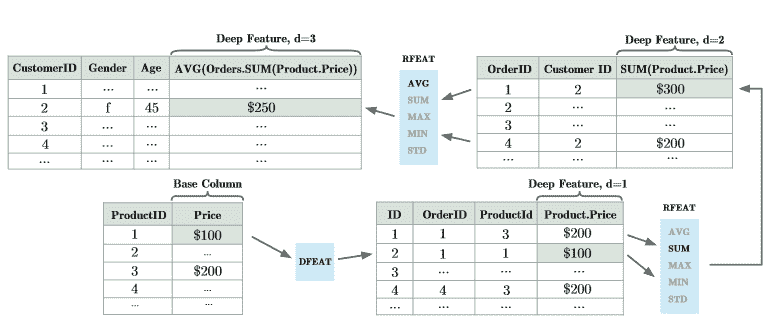

# 最佳功能工程工具

> 原文：<https://web.archive.org/web/https://neptune.ai/blog/feature-engineering-tools>

说到预测模型，数据集总是需要一个好的描述。在现实世界中，数据集是原始的，需要大量的工作。如果模型要理解监督或无监督学习的数据集，您需要执行几项操作，这就是特征工程的用武之地。

在本文中，我们将讨论:

*   什么是特征工程
*   特征工程中的问题类型
*   用于特征工程的开源工具
*   特征工程工具的比较

## 特征工程示例

让我们从几个例子开始。在这里，我们有一个带有某些水果的分类特征列:“香蕉”、“菠萝”和“未知”。我们可以对它进行标签编码:

但是，如果我们将线性预测模型(如决策树)分解为三个不同的特征，并对它们进行一次性编码，那么它们会更好地理解这一特征:

| 水果 | 香蕉 | 菠萝 | f _ 未知 |
| --- | --- | --- | --- |
|  |  | 0 | 0 |
|  | 0 |  | 0 |
|  |  | 0 | 0 |
|  | 0 | 0 |  |

在最后一个例子中，我们使用了一个对机器学习算法没有意义的特征，并将其转换为数字。现在，在第二个例子中，我们将执行一个更复杂的操作。就拿著名的泰坦尼克号数据集来说吧。在泰坦尼克号数据集中，基于某些属性，我们定义泰坦尼克号乘客是否幸存。

我们有一个名为“姓名”的专栏。名字有像“先生”、“夫人”、“老爷”或“主人”这样的头衔，这可能会影响一个人的生存。我们可以利用这些信息，根据乘客姓名中的头衔设计一个新功能。

让我们看看如何用一小段代码实现这一点:

```
import pandas as pd
import re

df = pd.read_csv('./train.csv')

names = list()
_ = [names.extend(i.split()) for i in df['Name']]

names = [' '.join(re.findall(r"[a-zA-Z]+", name)).lower() for name in names]

seen_titles = set()
titles = [x for x in names if x not in seen_titles and not seen_titles.add(x)]

counts = dict()
for title in titles:
    counts[title] = names.count(title)

print({i: counts[i] for i in counts if counts[i]>50})

```

**输出:**

```
{'miss': 182, 'mr': 521, 'mrs': 129, 'william': 64}
```

我们可以看到“小姐”、“先生”和“夫人”的出现频率很高，我们可以利用这一信息，使用这三个头衔和未知(或者如果你想做更多的工作，找到像主人、勋爵等头衔。)并从中得出一个分类特征。这些标题出现的次数越多，意味着越多的数据点具有这些值，这意味着这些标题和目标列之间可能存在某种关系。我们还可以推断，女性有更高的存活率，或者有“领主”头衔的人更有可能存活。因此，这个原本只是一堆名字的属性，现在变成了一个重要的特性。

既然您已经在实践中看到了它，让我们继续了解特性工程背后的一些理论。

## 什么是特征工程？

特征工程是从原始数据创建特征的艺术，因此预测模型可以深入理解数据集，并在看不见的数据上表现良好。要素工程不是一种可以以相同方式应用于所有数据集的通用方法。不同的数据集需要不同的方法。

机器学习算法的数据集表示在每种情况下都是不同的。在图像的情况下，重要的特征可以是形状、线条和边缘。对于音频来说，某些单词可能会产生影响。

图像中工程特征的一个很好的例子可以是自动编码器，其中它们实际上自动学习模型最能理解哪种特征。自动编码器输入图像，输出的是相同的图像，因此中间的层学习这些图像的潜在表示。神经网络可以更好地理解这些潜在的表示，并可以用来训练更好的模型。

## 特征工程中的问题类型

在讨论特征工程工具之前，我们先来看看我们可以执行的一些操作。请记住，最佳方法取决于问题陈述。

### 特征提取:

特征提取是制造新特征的过程，这些新特征是现有特征的组合。特征提取的一个很好的例子是降维。

一个数据集中可能有数百万个包含音频、图像甚至表格的要素。虽然它们中的许多可能是多余的，但也存在模型复杂性的问题。

对于一些机器学习算法，随着特征数量的增长，训练时间复杂度呈指数增长。在这种情况下，我们使用特征提取或降维。

有像主成分分析、TSNE 和其他算法可以用来降低特征维数。他们通过数学运算聚集不同的特征，同时试图保持信息的完整性。

让我们来看一个在 Scikit-learn 中使用 PCA 时的特征提取示例:

```
import pandas as pd
from sklearn.decomposition import PCA

df = pd.DataFrame([[2,4,6,8], [4,8,12,16]])
print(df)

```

```
 dr = PCA(n_components=2)
reduced_df = dr.fit_transform(df)
print(reduced_df)

```

```
array([[ 5.47722558e+00,  6.66133815e-16],
       [-5.47722558e+00,  6.66133815e-16]])
```

在上面的代码中，我们使用 PCA 将上述数据帧的维数从 4 减少到 2。

### 功能选择:

有些特性更重要，有些则是多余的，根本不影响模型。我们可以根据选定的标准对它们进行评分，并按照重要性进行排序。然后，剔除不重要的。

这也可以是一个递归过程，在特征选择之后，我们训练模型，计算准确度分数，然后再次进行特征选择。我们可以迭代，直到找到要保留在数据集中的要素的最终数量。这个过程称为递归特征选择。

一些常用的特征评分函数有:

*   f 分，
*   互信息得分，
*   卡方评分。

F-score 可以找到特征和目标列之间的线性关系，并相应地创建分数。使用每个特征的分数，我们可以排除 F 值较低的特征。类似地，互信息分数可以捕获特征和目标列之间的线性和非线性关系，但是需要更多的样本。

卡方检验是统计学中用来检验两个事件独立性的检验。较低的卡方值表明两个变量(特征和目标)是独立的。两个变量的较高值意味着相关的重要特征。

以上是单变量特征选择算法。还有基于树或 lasso 回归的算法，可用于计算基于杂质的特征重要性。

还可以基于特征之间的相关性来删除特征。如果两个特征高度相关，则丢弃其中一个是有意义的，因为我们将降低数据集的维度。

现在，让我们来看一个非常简单的 F 分数示例:

```
import pandas as pd
df = pd.DataFrame([[1,12,2], [2, 34, 4], [3,87,6] ])
print(df)
```

```
from sklearn.feature_selection import f_regression
scores, _ = f_regression(df.iloc[:,0:2], df.iloc[:,-1])
print(scores)
```

```
[4.50359963e+15 1.75598335e+01]

```

我们可以看到列“0”和“1”相对于目标列“2”的 F 值之间的巨大差异。您可以看到我是如何创建数据帧的，列“0”中的每个值都是列“2”中每个值的一半。然而，列“1”包含一些随机值。f 值在列“0”和目标列“2”之间较高，但在列“1”和列“2”之间较低。我们可以说列“0”更好地定义了目标列“2 ”,因此得分更高。

### 特征构造:

一些特征在一些工作之后对预测模型有意义，就像我们在第一个和第二个例子中看到的。这叫做特征构造。它包括从数据集中的现有要素构建更强大的要素。

例如，我们可能知道某个特性的领域知识，如果值足够高，那么它就属于一个不同的类别，而如果值较低。

假设我们有一个地区的树木数量，最多有 300 棵树。我们可以分类为:

*   0-100 棵树为 1，
*   101-200 棵树作为 2，
*   201-300 棵树作为 3。

这样分类可以消除噪音。

我们可以聚集特性或者分解它们(就像我们对一键编码所做的那样)。不管怎样，我们正在现有的基础上创造新的、更好的功能。

如果你正在处理一个非常特殊的问题集，一个专门项目的数据集，那么我建议你手动处理数据。但是对于一般的问题，不是每个人都有时间坐下来设计特性。因此，在这一节中，我们将看看一些自动化特征工程的工具。

### 功能工具

自动化特征工程最流行的库之一。它支持许多功能，包括:

*   特征选择，
*   特征构造，
*   使用关系数据库创建新功能，
*   等等。

除此之外，它还提供了大量的原语，这些原语是使用 max、sum、mode 等的基本转换。这些是有用的操作。假设您必须从日志文件中找到事件之间的平均时间，您可以使用原语来完成此任务。

但 featuretools 最重要的一个方面是，它使用深度特征合成(DFS)来构造特征。

我们先来了解一下什么是 DFS。这个算法需要实体。将实体想象成多个相互连接的数据表。然后它堆叠原语，并对列执行转换。

这些操作可以模仿人类所做的转换。图元堆栈的长度被认为是深度，因此命名为深度特征合成。让我们用一个例子来理解:



*Fig. 1 – An example of DFS in action | [Source](https://web.archive.org/web/20221206022017/http://groups.csail.mit.edu/EVO-DesignOpt/groupWebSite/uploads/Site/DSAA_DSM_2015.pdf)*

在此图中，您可以看到我们从为“ProductID”定义价格的列开始。第一个操作将现有表连接到带有“OrderID”的表。现在，所有“OrderID”在下一个转换中都是唯一的，同时使用“sum”原语，并从另一个表中为每个“OrderID”选取“CustomerID”。在第三个转换中，“OrderID”被删除,“CustomerID”变得唯一，使用 average 运算给出每个客户的平均价格。这里，DFEAT 是直接特征，RFEAT 是关系特征。

这是一个很棒的创建基线模型的库，它可以模仿人类手工做的事情。一旦达到基线，你就会知道你想要前进的方向。

让我们解决一个使用 DFS 来理解 Featuretools API 的例子:

```
import featuretools as ft
es = ft.demo.load_retail()
print(es)

Entityset: demo_retail_data
  Entities:
    order_products [Rows: 1000, Columns: 7]
    products [Rows: 606, Columns: 3]
    orders [Rows: 67, Columns: 5]
    customers [Rows: 50, Columns: 2]
  Relationships:
    order_products.product_id -> products.product_id
    order_products.order_id -> orders.order_id
    orders.customer_name -> customers.customer_name
```

我从 Featuretools 加载了 load_retail 数据。现在我们有了实体集，让我们应用 DFS 并获得一些新特性:

```
feature_matrix, feature_defs = ft.dfs(entityset=es,
                                      target_entity="orders",
                                      agg_primitives=["sum", "mean"],
                                      max_depth=3)
print(feature_matrix)
```

target_entity 参数定义了我们将为哪个实体创建新特征。和 agg_primitives 是将要应用的转换。更多的深度意味着更多的功能。在此之后，您可以使用特征选择来查找最佳特征。

Featuretools 是迄今为止我遇到的最好的特征工程工具。有许多关于各种不同方法的论文，但是其中大多数还没有实现开放源代码。

### 自动调整

Autofeat 是另一个很好的特性工程开源库。它自动进行特征合成、特征选择和拟合线性机器学习模型。

Autofeat 背后的算法非常简单。它生成非线性特征，例如 log(x)，x ² ，或 x ³ 。在创建特征空间时，使用不同的操作数，如负数、正数和小数。这导致了特征空间的指数增长。分类特征被转换成独热编码特征。

既然我们有这么多的特性，就有必要选择重要的特性。首先 Autofeat 移除高度相关的特征，因此现在它依赖于 L1 正则化，并移除低系数的特征(在用 L1 正则化训练线性/逻辑回归之后具有低权重的特征)。这个选择相关特征和用 L1 正则化移除特征的过程重复几次，直到只留下几个特征。这些特征是通过这个实际描述数据集的迭代过程来选择的。

请参考此链接中的[笔记本，获取自动吃饭的示例。](https://web.archive.org/web/20221206022017/https://github.com/cod3licious/autofeat/blob/master/autofeat_examples.ipynb)

### TSFresh

我们名单上的下一个是 TSFresh，一个专注于时间序列数据的库。它包括特征合成和特征选择。该库包含 60 多个特征提取器。这些操作包括全局最大值、标准差、快速傅立叶变换等。这些转换可以将 6 个原始特征变成 1200 个特征。这就是为什么在库中也给出了一个特性选择器，它删除了多余的特性。该库对于时间序列数据非常有用。

您可以在[文档中找到一个很好的快速入门。](https://web.archive.org/web/20221206022017/https://tsfresh.readthedocs.io/en/latest/text/quick_start.html)

### 特征选择器

要素选择器是一个用于要素选择的 Python 库。这是一个小图书馆，有非常基本的选项。它根据缺失值、单个唯一值、共线要素、零重要性和低重要性要素来确定要素的重要性。它使用来自“lightgbm”的基于树的学习算法来计算特征重要性。该库还包括许多可视化方法，可以帮助您获得关于数据集的更多见解。

这里有一个到库的示例代码的[链接。](https://web.archive.org/web/20221206022017/https://github.com/WillKoehrsen/feature-selector/blob/master/Feature%20Selector%20Usage.ipynb)

### OneBM

OneBM，或一键机器，处理关系数据。它从递增地连接不同的表开始，并识别特征的类型，例如时间序列、分类或数字。然后，它应用一组预定义的特征工程操作。

缺点是 OneBM 没有开源实现。

### 和你在一起

理论上很有希望，但不幸的是没有可用的开源代码。这里的概念与 TSFresh 非常相似，它在特性上递归地应用一系列转换。当这以指数方式增加数据的维度时，使用特征选择。

## 比较

最后，让我们比较一下这些库，这样您就可以知道哪个库适合您的工作:

| 工具/措施 | 对数据库类型的支持 | 特征工程 | 特征选择 | 开源实现 | 支持时间序列 |
| --- | --- | --- | --- | --- | --- |
|  |  |  |  |  |  |
|  |  |  |  |  |  |
|  |  |  |  |  |  |
|  |  |  |  |  |  |
|  |  |  |  |  |  |
|  |  |  |  |  |  |

Featuretools 可以满足您的大部分需求。TSFresh 专门处理时间序列数据，所以我更喜欢在处理这类数据集时使用它。

## 结论

我希望现在您已经理解了特性工程，并且知道接下来您想尝试哪些工具。

特征工程仍然是难以自动化的问题之一。即使有库，手动设计功能也能获得最佳效果。特征工程通常是讨论最少的问题，但它是一个非常重要的问题。

很难理解预测模型所理解的功能的底层描述。自动编码器和受限玻尔兹曼机器是理解模型所理解的特征的一步。未来肯定会给这个领域带来有趣的发展。

这里有一些额外的资源供您参考:

### 报纸

### 密码