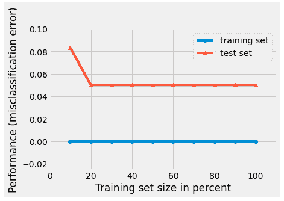
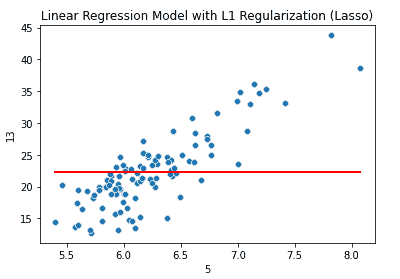
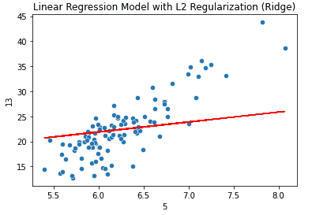

# 与 L1 或 L2 正则化的过度拟合作斗争:哪一个更好？

> 原文：<https://web.archive.org/web/https://neptune.ai/blog/fighting-overfitting-with-l1-or-l2-regularization>

机器学习模型中的糟糕性能来自于[过拟合或欠拟合](https://web.archive.org/web/20221206043505/https://towardsdatascience.com/overfitting-vs-underfitting-a-complete-example-d05dd7e19765)，我们将仔细研究第一种情况。当学习的假设与训练数据拟合得如此之好，以至于损害了模型在看不见的数据上的性能时，就会发生过度拟合。该模型对不属于训练数据的新实例的概括能力很差。

复杂的模型，如随机森林、神经网络和 XGBoost 更容易过度拟合。更简单的模型，如线性回归，也可能过度拟合-这通常发生在特征多于训练数据中的实例数量时。

因此，考虑过度拟合的最佳方式是想象一个具有简单解决方案的数据问题，但我们决定将一个非常复杂的模型拟合到我们的数据，为模型提供足够的自由度来跟踪训练数据和随机噪声。

## 我们如何检测过度拟合？

为了检测我们的 ML 模型中的过度拟合，我们需要一种在看不见的数据上测试它的方法。每当我们想要在看不见的实例上评估模型的性能时，我们经常利用一种叫做“交叉验证”的技术。交叉验证是各种模型验证技术，用于评估预测模型对模型未见过的独立数据集的泛化能力的质量。

交叉验证实现的最基本类型是基于保留的交叉验证。这种实现将可用数据分成训练集和测试集。为了使用基于排除的交叉验证来评估我们的模型，我们将首先在排除集的训练分割上构建和训练模型，然后使用该模型通过测试集进行预测，这样我们就可以评估它的表现如何。

我们知道什么是过度拟合，以及如何使用基于保留的交叉验证技术来检测模型中的过度拟合。让我们获取一些数据，并在我们的数据上实现这些技术，以检测我们的模型是否过度拟合。

**注意** : *在本例中，我们将使用 Scikit-learn datasets 模块中的 Iris 数据集。*

```py
import pandas as pd
import matplotlib.pyplot as plt
from sklearn.metrics import accuracy_score
from sklearn.datasets import load_iris
from sklearn.ensemble import RandomForestClassifier
from mlxtend.plotting import plot_learning_curves
from sklearn.model_selection import train_test_split

dataset = load_iris()
df = pd.DataFrame(data= dataset.data)

df["target"] = dataset.target

X = df.iloc[:, :-1]
y = df["target"].values

X_train, X_test, y_train, y_test = train_test_split(X, y,
                                                    train_size=0.60,
                                                    shuffle=True,
                                                    random_state=24)

clf = RandomForestClassifier(random_state=24)

plot_learning_curves(X_train=X_train,
                     y_train=y_train,
                     X_test=X_test,
                     y_test=y_test,
                     clf=clf,
                     scoring="misclassification error",
                     print_model=False)
plt.ylim(top=0.1, bottom=-0.025)
plt.show()
```



在上面的图像中，我们可以清楚地看到，我们的随机森林模型过度适应训练数据。我们的随机森林模型在训练集上有完美的误分类误差，但是在测试集上有 0.05 的误分类误差。散点图上两条线之间的间隙说明了这一点。

有各种方法来对抗过度拟合。一些技术包括改进数据，例如通过特征选择减少输入到模型中的特征数量，或者通过收集更多数据使实例多于特征。

或者，我们可以通过改进我们的模型来对抗过度拟合。我们可以通过减少估计器的数量(在随机森林或 XGBoost 中)或减少神经网络中的参数数量来简化我们的模型。我们还可以引入一种被称为*提前停止*的技术，其中训练过程被提前停止，而不是运行设定数量的时期。

另一种简化模型的方法是通过正则化将偏差添加到模型中。这非常有趣，所以在本文的剩余部分，我们将重点关注这种方法。

## 什么是正规化，我们为什么需要正规化？

正则化技术在机器学习模型的开发中起着至关重要的作用。特别是复杂的模型，如神经网络，容易过度拟合训练数据。分解来看,“规则化”这个词表示我们正在使一些事情变得有规律。在数学或 ML 上下文中，我们通过添加信息来创建防止过度拟合的解决方案，从而使事情变得有规律。我们在 ML 上下文中使之规则的“东西”是“目标函数”，在优化问题中我们试图最小化它。

简单来说，在正则化中，信息被添加到一个目标函数中。我们使用正则化，因为我们希望在模型中添加一些偏差，以防止它过度适应我们的训练数据。在添加正则化之后，我们最终得到了一个在训练数据上表现良好的机器学习模型，并且具有很好的能力来概括训练期间没有见过的新示例。

## 最优化问题

为了获得我们模型的“最佳”实现，我们可以使用优化算法来确定最大化或最小化目标函数的输入集。通常，在机器学习中，我们希望最小化目标函数，以降低模型的误差。这就是为什么目标函数在从业者中被称为损失函数，但它也可以被称为成本函数。

有大量流行的优化算法:

*   斐波那契搜索，
*   二分法，
*   线搜索，
*   梯度下降，
*   …还有更多。

大多数人在他们的机器学习之旅的早期都会接触到梯度下降优化算法，因此我们将使用这种优化算法来演示当我们有正则化时我们的模型中会发生什么，以及当我们没有正则化时会发生什么。

### 无正则化的梯度下降

梯度下降是一种一阶优化算法。它包括在梯度的相反方向上采取步骤，以便找到目标函数的全局最小值(或非凸函数中的局部最小值)。下图很好地展示了梯度下降是如何逐步达到凸函数的全局最小值的。

为了表达梯度下降在数学上是如何工作的，将 **N** 视为观察值的数量， **Y_hat** 为实例的预测值， **Y** 为实例的实际值。


对于我们的优化算法来确定采取多大的步长(幅度)以及在什么方向上，我们计算:


其中 **η** 是学习率—**学习率**是优化算法中的一个调整参数，该算法确定每次迭代的步长，同时向损失函数的最小值移动[ **来源** : [维基百科](https://web.archive.org/web/20221206043505/https://en.wikipedia.org/wiki/Learning_rate) ]。然后，在每次迭代之后，通过以下更新规则更新模型的权重:


其中**δ**w 是包含每个权重系数的权重更新的向量 *w.* 下面的函数演示了如何在没有任何正则化的情况下在 Python 中实现梯度下降优化算法。

```py
def param_init(X):
    """
    Initialize parameters for linear regression model
    __________________
    Input(s)
    X: Training data
    __________________
    Output(s)
    params: Dictionary containing coefficients
    """
    params = {} 
    _, n_features = X.shape 

    params["W"] = np.zeros(n_features)
    params["b"] = 0
    return params

def gradient_descent(X, y, params, alpha, n_iter):
    """
    Gradient descent to minimize cost function
    __________________
    Input(s)
    X: Training data
    y: Labels
    params: Dictionary containing random coefficients
    alpha: Model learning rate
    n_iter: The number of iterations of Gradient descent
    __________________
    Output(s)
    params: Dictionary containing optimized coefficients
    """
    W = params["W"]
    b = params["b"]
    m = X.shape[0] 

    for _ in range(n_iter):

        y_pred = np.dot(X, W) + b

        dW = (2/m) * np.dot(X.T, (y_pred - y))
        db = (2/m) * np.sum(y_pred -  y)

        W -= alpha * dW
        b -= alpha * db

    params["W"] = W
    params["b"] = b
    return params
```

**注意** : *只要迭代次数(n_iters)足以使梯度下降达到全局最小值，算法将继续向凸函数的全局最小值和局部最小值前进。*

*此外，请注意梯度下降有各种不同的实现方式，如随机梯度下降和小批量梯度下降，但梯度下降(也称为批量梯度下降)示例背后的逻辑超出了本文的范围。*

梯度下降的这种实现没有正则化。因此，我们的模型可能会过度拟合训练数据。这个任务很简单，但是我们使用的是一个复杂的模型。L1 正则化和 L2 正则化是两种流行的正则化技术，我们可以用它们来对抗模型中的过拟合。

可能由于相似的名字，很容易认为 L1 和 L2 正则化是相同的，特别是因为它们都防止过拟合。然而，尽管目标(和名称)相似，但是这些正则化技术在防止过度拟合方面有很大的不同。

为了更好地理解这一点，让我们建立一个人工数据集，以及一个没有正则化的线性回归模型来预测训练数据。Scikit-learn 有现成的线性回归实现，内置了梯度下降优化的优化实现。让我们来看看它的实际应用:

```py
import warnings
warnings.filterwarnings("ignore")

import numpy as np
import pandas as pd
import seaborn as sns
import matplotlib.pyplot as plt
from sklearn.linear_model import LinearRegression
from sklearn.metrics import mean_squared_error

URL = "https://raw.githubusercontent.com/jbrownlee/Datasets/master/housing.csv"

df = pd.read_csv(URL, header=None)

X = df.loc[:100, 5]
y = df.loc[:100, 13] 

X_reshaped = X[:, np.newaxis]
y_reshaped = y[:, np.newaxis]

linear_regression = LinearRegression()

linear_regression.fit(X_reshaped, y_reshaped)

y_pred = linear_regression.predict(X_reshaped)

mse = mean_squared_error(y_reshaped, y_pred)
print(f"Mean Squared Error: {mse}n")

sns.scatterplot(X,y)
plt.plot(X_reshaped, y_pred, color="red")
plt.title("Linear Regression Model without Regularization")
plt.show()

>>>> Mean Squared Error: 9.762853674412973

```

在下一节中，我们将深入 L1 和 L2 正则化背后的直觉。

## L1 正则化

L1 正则化，也称为 L1 范数或套索(在回归问题中)，通过将参数收缩到 0 来防止过度拟合。这使得一些功能过时。

这是一种特征选择的形式，因为当我们为一个特征赋予 0 权重时，我们将特征值乘以 0，得到 0，从而消除了该特征的重要性。如果我们模型的输入特征的权重接近于 0，我们的 L1 范数将是稀疏的。输入要素的选择将具有等于零的权重，其余的将是非零的。

例如，想象我们想要使用机器学习来预测房价。考虑以下特性:

*   **街道**–道路入口，
*   **小区**–物业位置，
*   **可达性**–交通通道，
*   **建造年份**–房屋建造的年份，
*   **房间**–房间数量，
*   **厨房**–厨房数量，
*   **壁炉**–房子里壁炉的数量。

在预测房子的价值时，直觉告诉我们，不同的输入特征不会对价格产生相同的影响。例如，与壁炉数量相比，邻居或房间数量对房产价格的影响更大。

因此，我们的 L1 正则化技术将赋予壁炉功能零权重，因为它对价格没有显著影响。我们可以预期邻域和房间号被赋予非零权重，因为这些特征会显著影响房产的价格。

数学上，我们通过如下扩展损失函数来表达 L1 正则化:


本质上，当我们使用 L1 正则化时，我们是在惩罚权重的绝对值。

在现实世界环境中，我们经常有高度相关的特征。比如我们家建造的年份和家里的房间数可能有很高的相关性。使用 L1 正则化时要考虑的一点是，当我们具有高度相关的特征时，L1 范数将从任意性质的相关特征组中仅选择 1 个特征，这可能是我们不想要的。

尽管如此，对于我们的示例回归问题，Lasso 回归(带 L1 正则化的线性回归)将生成一个高度可解释的模型，并且仅使用输入要素的子集，从而降低了模型的复杂性。

Python 中的套索回归示例:

```py
import warnings
warnings.filterwarnings("ignore")

import numpy as np
import pandas as pd
import seaborn as sns
import matplotlib.pyplot as plt
from sklearn.preprocessing import PolynomialFeatures
from sklearn.linear_model import LinearRegression, Lasso, Ridge
from sklearn.metrics import mean_squared_error

URL = "https://raw.githubusercontent.com/jbrownlee/Datasets/master/housing.csv"
df = pd.read_csv(URL, header=None)

X = df.loc[:100, 5]
y = df.loc[:100, 13] 

X_reshaped = X[:, np.newaxis]
y_reshaped = y[:, np.newaxis]

lasso = Lasso(alpha=10)

lasso.fit(X_reshaped, y_reshaped)

y_pred = lasso.predict(X_reshaped)

mse = mean_squared_error(y_reshaped, y_pred)
print(f"Mean Squared Error: {mse}")
print(f"Model Coefficients: {lasso.coef_}n")

sns.scatterplot(X,y)
plt.plot(X_reshaped, y_pred, color="red")
plt.title("Linear Regression Model with L1 Regularization (Lasso)")
plt.show()

>>>> Mean Squared Error: 34.709124595627884
Model Coefficients: [0.]

```



**注意** : *由于我们之前的 Python 例子只使用了一个特性，所以我夸大了 lasso 回归模型中的 alpha 项，使得模型系数等于 0 只是为了演示的目的。*

## L2 正则化

L2 正则化，或 L2 范数，或岭(在回归问题中)，通过迫使权重较小，但不使它们正好为 0 来对抗过度拟合。

因此，如果我们再次预测房价，这意味着预测房价的不太重要的特征仍会对最终预测产生一些影响，但这种影响很小。

当执行 L2 正则化时，我们添加到损失函数中的正则化项是所有特征权重的平方和:


因此，L2 正则化返回非稀疏解，因为权重将非零(尽管一些可能接近 0)。

使用 L2 正则化时要考虑的一个主要问题是，它对异常值不够稳健。平方项将放大异常值的误差差异。正则化将试图通过惩罚权重来解决这个问题。

### L1 正则化和 L2 正则化的区别:

*   L1 正则化惩罚权重的绝对值之和，而 L2 正则化惩罚权重的平方和。
*   L1 正则化解是稀疏的。L2 正则化解是非稀疏的。
*   L2 正则化不执行要素选择，因为权重仅减少到接近 0 而不是 0 的值。L1 正则化具有内置的特征选择。
*   L1 正则化对异常值是鲁棒的，L2 正则化不是。

Python 中的岭回归示例:

```py
import warnings
warnings.filterwarnings("ignore")

import numpy as np
import pandas as pd
import seaborn as sns
import matplotlib.pyplot as plt
from sklearn.preprocessing import PolynomialFeatures
from sklearn.linear_model import LinearRegression, Lasso, Ridge
from sklearn.metrics import mean_squared_error

URL = "https://raw.githubusercontent.com/jbrownlee/Datasets/master/housing.csv"
df = pd.read_csv(URL, header=None)

X = df.loc[:100, 5]
y = df.loc[:100, 13] 

X_reshaped = X[:, np.newaxis]
y_reshaped = y[:, np.newaxis]

ridge = Ridge(alpha=100)
ridge.fit(X_reshaped, y_reshaped)
y_pred = ridge.predict(X_reshaped)

mse = mean_squared_error(y_reshaped, y_pred)
print(f"Mean Squared Error: {mse}")
print(f"Model Coefficients: {ridge.coef_}n")

sns.scatterplot(X,y)
plt.plot(X_reshaped, y_pred, color="red")
plt.title("Linear Regression Model with L2 Regularization (Ridge)")
plt.show()

>>>> Mean Squared Error: 25.96309109305436
Model Coefficients: [[1.98542524]]

```



看看岭回归模型的 alpha 值——是 100。超参数值α越大，这些值就越接近 0，而不会变成 0。

## L1 和 L2 正规化哪个更好？

一种正则化方法是否比另一种更好，这是学术界争论的问题。然而，作为一名从业者，当你需要在 L1 和 L2 正规化之间做出选择时，有一些重要的因素需要考虑。我将它们分为 6 类，并将向您展示哪种解决方案更适合每一类。

哪种解决方案更可靠？L1

根据 Investopedia 提供的定义，如果一个模型的输出和预测始终准确，即使一个或多个输入变量或假设由于不可预见的情况而发生巨大变化，该模型也被认为是稳健的。[ **来源** : [投资媒体](https://web.archive.org/web/20221206043505/https://www.investopedia.com/terms/r/robust.asp#:~:text=A%20model%20is%20considered%20to,changed%20due%20to%20unforeseen%20circumstances.)

由于一个相当明显的原因，L1 正则化比 L2 正则化更健壮。L2 正则化取权重的平方，因此数据中异常值的成本呈指数增长。L1 正则化采用权重的绝对值，因此成本仅线性增加。

**什么方案可能性更大？L1**

我指的是在某一点上达到的解的数量。L1 正则化使用曼哈顿距离来到达单个点，因此到达一个点可以采用多条路线。L2 正则化使用欧几里得距离，这将告诉你到达一个点的最快方法。这意味着 L2 范数只有一个可能的解。

哪种解决方案的计算成本更低？L2

因为 L2 正则化取权重的平方，所以它被归类为封闭解。L1 涉及采用权重的绝对值，这意味着解决方案是一个不可微的分段函数，或者简单地说，它没有封闭形式的解决方案。L1 正则化在计算上更昂贵，因为它不能用矩阵数学来求解。

**哪种解决方案可以产生稀疏输出？L1**

稀疏性是指正则化产生的解有许多值为零。然而，我们知道它们是 0，不像丢失数据，我们不知道一些或许多值实际上是什么。

如前所述，L2 正则化只是将权重缩小到接近 0 的值，而不是实际上为 0。另一方面，L1 正则化将值缩小到 0。这实际上是特征选择的一种形式，因为某些特征是完全从模型中提取的。也就是说，在您决定继续使用的模型拟合之前，特征选择可能是一个额外的步骤，但是对于 L1 正则化，您可以跳过这一步，因为它内置于技术中。

## 包裹

在本文中，我们探讨了什么是过拟合，如何检测过拟合，什么是损失函数，什么是正则化，为什么我们需要正则化，L1 和 L2 正则化如何工作，以及它们之间的差异。

决定使用哪个正则化器完全取决于你试图解决的问题，以及哪个解决方案最符合你的项目的结果。