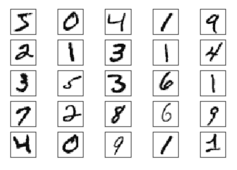

# 生成对抗网络和一些 GAN 应用:你需要知道的一切

> 原文：<https://web.archive.org/web/https://neptune.ai/blog/generative-adversarial-networks-gan-applications>

生成模型方法是一种无监督学习。

在监督学习中，深度学习模型学习将输入映射到输出。在每次迭代中，都要计算损耗，并使用反向传播优化模型。

在无监督学习中，我们不会像在监督学习中那样将目标变量输入到深度学习模型中。为什么？

嗯，监督学习算法是为了在图像分类的情况下识别对象而构建的，或者在回归的情况下用于预测下一个值。

无监督学习算法用于学习数据的**潜在模式**，或者数据的表示。

无监督学习用于以下任务:

*   主成分分析
*   使聚集
*   异常检测

本质上，生成模型，或**深度生成模型**，是一类从样本中学习底层数据分布的深度学习模型。这些模型可用于将数据简化为其基本属性，或生成具有新的不同属性的新数据样本。

生成模型有两种类型:

1.  显式似然模型
2.  隐式似然模型

**显式似然模型:**显式模型从样本分布中学习数据分布，生成新类型的数据。这些类型的模型可以访问概率分布，并使用最大似然法对它们进行训练。在最大似然法中，假设的模型被训练以最大化该模型下数据的概率分布。

显式似然模型:

*   最大概似法
    *   PPCA，因子分析，混合模型
    *   像素 CNN/像素 RNN
    *   Wavenet
    *   自回归语言模型
*   近似最大似然
    *   玻尔兹曼机器
    *   可变自动编码器

**隐式似然模型:**隐式模型不学习数据的分布，而是学习数据的统计性质，因此它可以概括并生成新的数据样本，而不依赖于概率分布。

## 什么是生成性对抗网络？

生成式对抗网络是隐式似然模型，它从数据的统计分布中生成数据样本。它们用于复制数据集中的变化。他们使用两个网络的组合:生成器和鉴别器。

发电机

### 生成器网络采用随机正态分布(z ),并输出接近原始分布的生成样本。

鉴别器

鉴别器尝试用原始样本评估生成器生成的输出，并输出 0 到 1 之间的值。如果值接近 0，则生成的样本是假的，如果值接近 1，则生成的样本是真的。

### Discriminator

简而言之，鉴别器的工作就是通过与原始样本的比较来鉴别生成的样本是真是假。生成器的工作是通过生成接近原始样本的样本来欺骗鉴别器。

生成性对抗网络是如何工作的？

所以，甘有两个网络。这两个网络都应该独立训练。当两个模型都是多层感知器时，GAN 框架非常简单。让我们看看甘是如何工作的。

## 随机正态分布被输入到发生器中。然后，发生器输出随机分布，因为它没有参考点。

与此同时，一个实际的样本，或地面真相，被送入鉴别器。鉴别器学习实际样本的分布。当发生器产生的样本输入鉴别器时，它会评估分布。如果生成样本的分布接近原始样本，则鉴别器输出接近“1”=实数的值。如果两个分布不匹配，或者它们甚至彼此都不接近，那么鉴别器输出一个接近“0”的值=假。

那么生成器如何进化以生成类似实际数据的样本呢？

为了理解生成器的进化，我们需要了解鉴别器是如何评估生成的样本是真的还是假的。

答案在于损失函数或者价值函数；它测量生成数据的分布和真实数据的分布之间的距离。发生器和鉴别器都有自己的损失函数。发生器试图最小化损失函数，而鉴别器试图最大化。

发电机不直接连接到损耗，而是通过鉴别器。鉴别器产生假的或真的输出。如果输出为 0 =假，那么发生器损耗惩罚发生器产生被鉴别器分类为假的样本。

一旦计算出损耗，通过鉴别器网络到发电机的反向传播来更新发电机权重。这一点很重要，因为发生器参数的影响在很大程度上取决于鉴别器的影响，因此发生器接收反馈并使用反馈产生更“真实”的图像。


培养

对于每个训练步骤，我们从**鉴别器循环**开始。在进入发电机回路之前，我们要重复这一步。

### **鉴别器回路**:

设置一个循环 k，其中 k>1。我们这样做是因为我们想确保鉴别器收敛到原始数据 pd 的良好估计量。

从正态分布{z1，z2，z3，…zn}中采样 m 个噪声数据，并通过发生器对其进行变换。

1.  从正态分布{x1，x2，x3，…xn}中抽取 m 个实际数据样本。
2.  重要的是要记住，假样本标记为 0，真样本标记为 1。
3.  然后我们使用损失函数来计算使用标签的损失。
4.  我们采用损失函数相对于鉴别器参数的梯度，并更新鉴别器中的权重。为了更新鉴别器中的梯度，我们使用梯度上升，因为我们想最大化它。
5.  这就完成了鉴别器环路。
6.  **发电机回路**:


发电机回路类似。我们从以下几点开始:

从正态分布{z1，z2，z3，…zn}中采样 m 个噪声数据，并通过生成器对其进行变换，以获得我们的伪样本。

因为我们只对更新发电机的环路感兴趣，所以我们考虑损失函数相对于发电机的梯度，最终使导数为零。

1.  此外，在发生器循环中，我们不会使用真实样本，因此成本函数简化为:
2.  使用相同的等式，我们现在可以使用梯度下降来更新生成器的权重。
3.  非常有趣的是，生成器通过保持鉴别器为常数来进化。鉴别器作为向导，帮助生成器学习和进化！


损失函数

gans 中有两个主要损失函数:

### 最小-最大损失

瓦瑟斯坦损失

1.  最小最大损失
2.  Minimax 就是最大化误差和最小化误差。最小-最大损失最初是由 Ian Goodfellow 等人在 2014 年发表的一篇题为“[生成性对抗网络](https://web.archive.org/web/20221022004913/https://arxiv.org/abs/1406.2661)”的论文中描述的。

#### 极大极小损失来自博弈论。它基本上围绕着玩家之间的竞争。这个想法是，为了获胜，玩家必须最大化自己获胜的概率，并通过找到对手可以做出的最佳移动来最小化对手获胜的概率。

在这里，我们需要明白，鉴别者是希望通过正确分类生成器生成的假图像来最大化获胜概率的玩家。它先让自己熟悉真实图像，即 **D(x) = 1** ，再熟悉虚假图像，即 **D(G(x)) = 0** 。


(1–D(G(x)))之间的差应该增加。较大的差异表明鉴别器运行良好；它能够区分真假图像。

另一方面，当涉及到生成器时，它会试图通过最小化(1–D(G(x))来最小化鉴别器的获胜概率。

生成器想要做的只是产生样本，当通过鉴别器(D(G(x))时，该样本更接近于 1。然后，当计算损耗(1–D(G(x)))时，输出将更接近于零。

这个过程持续下去，直到一个玩家帮助另一个玩家进化，或者训练迭代终止。


瓦瑟斯坦损失

Wasserstein 损失函数是为一种称为 WGAN 的新型 GAN 开发的，其中鉴别器不会将输出分类为假或真，但对于每个生成的样本，它会输出一个介于 0 和 1 之间的数字。尽管想法是相同的，其中真实样本由较大的数字表示，而假样本由较小的数字表示。

#### 所以，它不能真正区分真假样本。WGAN 鉴别器实际上被称为“批评家”。

**评论家损失**:C(x)–C(G(z))

鉴别器试图最大化这个函数，它和我们之前看到的 minimax 函数是一样的。它试图最大化真实实例和虚假实例之间的差异。

**发电机损耗** : C(G(z))

生成器试图最大化该功能。换句话说，它试图最大化伪实例的鉴别器输出。

甘的问题

消失梯度下降

## 当在训练的每次迭代中损失函数相对于当前权重的导数非常小，以至于对原始权重的更新几乎可以忽略时，出现消失梯度下降。

### 为了克服这个问题，建议使用 WGANs。

模式崩溃

当发生器能够用较少种类的数据样本欺骗鉴别器时，发生模式崩溃。

### 例如，如果输入数据有 10 个不同的手动数字，而发生器能够通过仅产生 10 个手动数字中的 4 个来欺骗鉴别器，则 GAN 遭受模式崩溃。

GAN 变体

深度卷积 GAN

## DCGANs 是对使用卷积神经网络的 gan 的改进。CNN 有利于从数据中提取重要的特征和表示，使它们更加稳定，并使它们能够生成更高质量的图像。

### 条件 gan

GANs 可以通过添加一些额外的信息变得更好，比如标签 y。

### 从上图中可以看出，生成器和鉴别器都受标签 y 的约束。这可能是任何类型的附加信息，比如类标签或数据。

在发生器中，先前的输入噪声 p(z)和 label (y)被合并。在鉴别器中，输入(x)和标签(y)作为鉴别函数的输入。

cGANs 通过利用输入模型的额外信息来学习生成更好的图像。

**为什么是 cGAN？**

通过提供附加信息，GANs:

倾向于收敛得更快；事实证明，即使是随机分布也会有一些模式。

您可以在推断时控制生成器的输出，方法是给出您希望它生成的图像的标签。

1.  **应用:**
2.  图像到图像的翻译

文本到图像的合成

1.  视频生成
2.  图像到图像的翻译
3.  图像到图像的转换是一种应用，其中用 a 的属性来转换某个图像 B。

### 像素 2 像素 GAN

前面我们看到了正态分布中的随机样本是如何被输入到生成器中的，并且是未知的，或者是一个新的样本是如何生成的。Pix2Pix GAN 使用**条件 GAN** 将一种类型的图像转换为另一种类型的图像。

#### Pix2Pix GAN 使用一对图像 x 和 y。这些图像对必须是相关的。输入 x 被馈送到发生器，它是一个 U 形网。发生器的输出然后被馈送到鉴别器，鉴别器也被馈送以标签 y。直觉是一个图像可以被完全转换成另一个图像。

之前我们看到生成器学习将随机分布转换为图像。在 pix2pix 中，我们看到一个图像被转换或翻译成不同类型的图像。

Pix2Pix 可用于:

白天到晚上或晚上到白天的翻译

低分辨率到高分辨率

1.  草图到图纸
2.  CycleGAN
3.  CycleGAN 是 Pix2Pix GAN 的更新版本。CycleGAN 使用不成对的图像转换，而不是成对的图像转换。这种技术基本上给了你很多机会去拍摄任意两个图像对，然后将两个图像的属性互相传递。

### 从上图中可以看出，这些技术非常有用。艺术家可以用它将照片转化为绘画。

CycleGAN 通常使用两个生成器和鉴别器。其背后的思想是，图像 A 被馈入生成器，它生成某个图像 G(A)。相同的图像 G(A)被馈送到另一个生成器中以重建原始图像 F(A)。cycleGAN 这个名字的灵感来源于这样一个事实，即 cycleGAN 不是以传统的方式计算损失，而是计算原始图像和重建图像的损失。

文本到图像的合成

斯塔克根

### 堆叠生成对抗网络(StackGAN)可以根据文本描述生成图像。

#### 该架构包括一系列堆叠的文本和图像 GAN 模型。这又是一类条件句。它有两种 GAN，也称为第一阶段 GAN 和第二阶段 GAN。StackGAN 使用草图细化过程，其中第一级生成器 Stage-I GAN 以文本为条件，生成低分辨率图像，即描述性文本的原始形状和颜色。

第二级发生器，第二阶段 GAN，以文本和低分辨率图像为条件，采用第一阶段的结果并添加引人注目的细节。

低分辨率图像首先由我们的第一阶段 GAN 生成。在第一阶段 GAN 的顶部，我们堆叠了第二阶段 GAN，以根据第一阶段结果和文本描述生成逼真的高分辨率(例如 256×256)图像。通过再次调节第一阶段的结果和文本，第二阶段的甘学会捕捉第一阶段甘遗漏的文本信息，并为对象绘制更多细节……“摘自[斯塔克甘:利用堆叠式生成对抗网络将文本转换为照片般逼真的图像合成](https://web.archive.org/web/20221022004913/https://arxiv.org/pdf/1612.03242.pdf)(张寒等人)

达尔-埃

最近 [openai](https://web.archive.org/web/20221022004913/https://openai.com/) 创建了一个名为 [DALL-E](https://web.archive.org/web/20221022004913/https://openai.com/blog/dall-e/) 的深度学习网络，它也可以进行文本到图像的合成。

#### 虽然架构没有用 GANs，而是 GPT-3 的一个版本。

人脸修复

面部修复，也称为面部修复，是为面部图像中缺失的像素生成可信的面部特征的任务。

### 这种技术的目的是从具有遮蔽区域的图像或具有缺失内容的图像中产生更合适和更真实的人脸图像。

GAN 的实现

香草甘

## 出局:

### 氮化镓的应用

```
from tensorflow.keras.layers import Input
from tensorflow.keras.models import Model, Sequential
from tensorflow.keras.layers.core import Dense, Dropout
from tensorflow.keras.layers.advanced_activations import LeakyReLU
from tensorflow.keras.datasets import mnist
from tensorflow.keras.optimizers import Adam
from tensorflow.keras import initializers
from tensorflow.keras.layers import Activation, Dense
```

```
(X_train, y_train), (X_test, y_test) = mnist.load_data()

X_train = (X_train.astype(np.float32) - 127.5)/127.5

X_train = X_train.reshape(60000, 784)

for i in range(25):
    plt.subplot(5,5,i+1)
    plt.xticks([])
    plt.yticks([])
    plt.grid(False)
    plt.imshow(X_train.reshape(X_train.shape[0], 28, 28)[i], interpolation='nearest', cmap='gray_r')
```

gan 有许多实际应用，其中一些是:



```
def get_optimizer():
    return Adam(lr=0.0002, beta_1=0.5)

def get_generator(optimizer, random_dim):
    generator = Sequential()
    generator.add(Dense(256, input_dim=random_dim, kernel_initializer = 'uniform', bias_initializer = 'zeros'))
    generator.add(LeakyReLU(alpha=0.2))

    generator.add(Dense(512))
    generator.add(LeakyReLU(alpha=0.2))

    generator.add(Dense(1024))
    generator.add(LeakyReLU(alpha=0.2))

    generator.add(Dense(784, activation='tanh'))
    generator.compile(loss='binary_crossentropy', optimizer=optimizer)
    generator.summary()
    return generator

def get_discriminator(optimizer):
    discriminator = Sequential()
    discriminator.add(Dense(1024, input_dim=784, kernel_initializer = 'uniform', bias_initializer = 'zeros'))
    discriminator.add(LeakyReLU(alpha=0.3))
    discriminator.add(Dropout(0.2))

    discriminator.add(Dense(512))
    discriminator.add(LeakyReLU(alpha=0.3))
    discriminator.add(Dropout(0.2))

    discriminator.add(Dense(256))
    discriminator.add(LeakyReLU(alpha=0.3))
    discriminator.add(Dropout(0.2))

    discriminator.add(Dense(1, activation='sigmoid'))
    discriminator.compile(loss='binary_crossentropy', optimizer=optimizer)

    discriminator.summary()
    return discriminator

def get_gan_network(discriminator, random_dim, generator, optimizer):

    discriminator.trainable = False

    gan_input = Input(shape=(random_dim,))

    x = generator(gan_input)

    gan_output = discriminator(x)

    gan = Model(inputs=gan_input, outputs=gan_output) 
    gan.compile(loss='binary_crossentropy', optimizer=optimizer)

    gan.summary()
    return gan

def plot_generated_images(epoch, generator, random_dim, examples=100, dim=(10, 10), figsize=(10, 10)):
    noise = np.random.normal(0, 1, size=[examples, random_dim])
    generated_images = generator.predict(noise)
    generated_images = generated_images.reshape(examples, 28, 28)

    plt.figure(figsize=figsize)
    for i in range(generated_images.shape[0]):
        plt.subplot(dim[0], dim[1], i+1)
        plt.imshow(generated_images[i], interpolation='nearest', cmap='gray_r')
        plt.axis('off')
    plt.tight_layout()
    plt.savefig('gan_generated_image_epoch_%d.png' % epoch)

def train(X_train, y_train, x_test, y_test, epochs=100, minibatch_size=128, random_dim = 100):

    adam = get_optimizer()
    G = get_generator(adam, random_dim)
    D = get_discriminator(adam)
    gan = get_gan_network(D, random_dim, G, adam)

    D_loss = []
    G_loss = []

    for e in range(1, epochs+1):
        print('-'*15, 'Epoch %d' % e, '-'*15)

        epoch_cost = 0.                       

        num_minibatches = int(X_train.shape[0] / minibatch_size) 

        X_train, y_train = shuffle(X_train, y_train)

        for i in range(0, X_train.shape[0], minibatch_size):

            X_train_mini = X_train[i:i + minibatch_size]
            y_train_mini = y_train[i:i + minibatch_size]

            legit_images = X_train_mini[np.random.randint(0, X_train_mini.shape[0], size=int(minibatch_size/2))]

            noise = np.random.normal(0, 1, size=[int(minibatch_size/2), random_dim]) 
            syntetic_images = G.predict(noise)

            x_combined_batch = np.concatenate((legit_images, syntetic_images))
            y_combined_batch = np.concatenate((np.ones((int(minibatch_size/2), 1)), np.zeros((int(minibatch_size/2), 1))))
            y_combined_batch[:int(minibatch_size/2)] = 0.9 

            D.trainable = True
            d_loss = D.train_on_batch(x_combined_batch, y_combined_batch)
            D_loss.append(d_loss)

            noise = np.random.normal(0, 1, size=[minibatch_size, random_dim])
            y_gen = np.ones(minibatch_size)
            D.trainable = False
            g_loss = gan.train_on_batch(noise, y_gen)
            G_loss.append(g_loss)

        print ("Cost of D after epoch %i: %f" % (e, d_loss))
        print ("Cost of G after epoch %i: %f" % (e, g_loss))

        if e == 1 or e % 20 == 0:
             plot_generated_images(e, G, random_dim)

    G.save_weights('Generator.h5') 
    D.save_weights('Discriminator.h5')

    return [D_loss, G_loss]

if __name__ == '__main__':
    [D_loss, G_loss] = train(X_train, y_train, X_test, y_test, epochs = 100, minibatch_size=128, random_dim = 100)
```

## 生成图像数据集的示例

在医学或材料科学中，生成示例非常方便，因为这些领域中很少有数据可处理。

*   生成人脸照片
    *   视频游戏设计者可以用它来生成逼真的人脸。
*   生成逼真的照片
    *   对摄影师和摄像师非常有用。
*   生成卡通人物
    *   艺术家可以用它来创造一个新的角色设计，或者卡通中的场景，甚至是视频游戏。
*   图像到图像的翻译
    *   摄影师可以使用这些算法将白天转换成夜晚，将夏天转换成冬天，等等。
*   GANs 可用于模拟最坏的情况，以优化企业的风险管理。
    *   GAN 的其他使用案例包括:
*   文本到图像的翻译

人脸正面视图生成

*   生成新的人体姿态
*   照片到表情符号
*   面部老化
*   超分辨率
*   照片修复
*   服装翻译
*   视频预测
*   3D 对象生成
*   结论
*   在本文中，我们了解了:

## 生成建模和生成模型

显式似然模型

1.  隐式似然模型
    1.  生成对抗网络
    2.  它属于隐含似然模型。
2.  当我们设计 GANs 时，我们不关心真实数据的概率分布，而是试图模拟或生成具有相同分布和变化特征的真实数据。
    1.  它有两个网络:生成器和鉴别器，它们试图相互竞争，同时帮助彼此学习更好的表示和分布。
    2.  损失函数及其工作原理。
    3.  甘斯的问题。
3.  GANs 的不同变体
4.  最后，我们使用 keras 实现了 vanilla GANs。
5.  这是一个迷人的话题，如果你坚持到了最后——感谢你的阅读！
6.  尼尔什·巴拉

我是最近一家初创公司 perceptronai.net 的创始人，该公司旨在通过我们的深度学习算法提供医疗和材料科学方面的解决方案。我也阅读和思考了很多。有时我把它们以绘画或音乐的形式表现出来。当我需要喘口气时，我会去跑步。

### **阅读下一篇**

如何组织深度学习项目——最佳实践范例

* * *

13 分钟阅读|作者 Nilesh Barla |年 5 月 31 日更新

## How to Organize Deep Learning Projects – Examples of Best Practices

一个成功的深度学习项目，你需要很多迭代，很多时间，很多努力。为了让这个过程不那么痛苦，你应该尽量利用你的资源。

一个好的循序渐进的工作流程将帮助你做到这一点。有了它，你的项目变得**高效、可复制、**和**可理解**。

在本文中，您将看到如何构建深度学习项目的工作——从开始到部署，监控部署的模型，以及中间的一切。

在这个过程中，我们将使用 Neptune 来运行、监控和分析您的实验。Neptune 是提高 ML 项目生产率的一个很酷的工具。

在本文中，您将了解到:

关于项目的生命周期。

定义项目目标的重要性。

1.  根据项目需求收集数据。
2.  模型训练和结果探索，包括:
3.  为更好的结果建立基线。
4.  采用现有的开源最新模型研究论文和代码库中的技术和方法。
    1.  实验跟踪和管理
    2.  避免欠拟合和过拟合的模型优化技术，例如:
    3.  控制超参数
5.  规范化
    1.  修剪
    2.  在部署之前测试和评估您的项目。
    3.  模型部署
6.  项目维护
7.  Model deployment
8.  Project maintenance

[Continue reading ->](/web/20221022004913/https://neptune.ai/blog/how-to-organize-deep-learning-projects-best-practices)

* * *