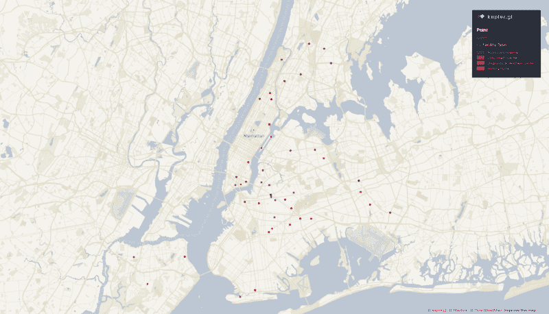
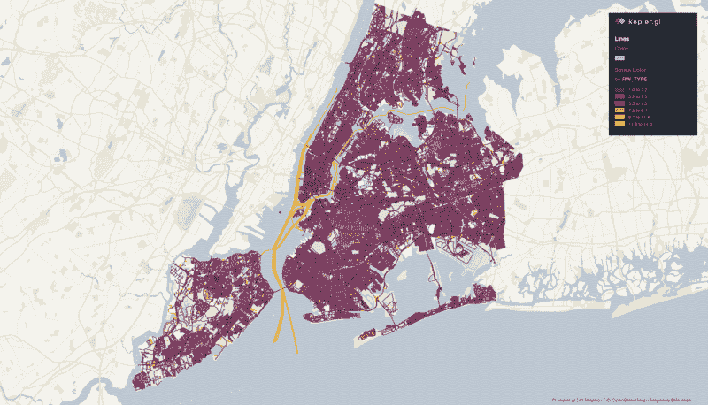
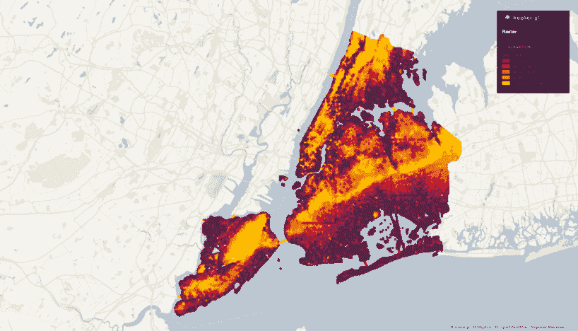

# 地理空间数据科学:使用 Plotly 在 Neptune 中记录交互式图表[指南]

> 原文：<https://web.archive.org/web/https://neptune.ai/blog/geospatial-data-science-logging-interactive-charts-in-neptune-with-plotly>

地理空间数据科学正在成为数据科学领域的重要组成部分。几乎每个事件都可以映射到地球表面。因此，外业人员倾向于回答详细的位置问题，并了解其位置的特征和基本原理。像一般数据科学一样，地理空间提供了计算技能、统计概念以及数据争论和可视化的类似基线。本文是地理空间数据科学分析和可视化的简要指南。我们将揭开术语的神秘面纱，突出这一领域最好的部分，解释使用了什么技能和技术，并检查一个 Python 用例。

## 什么是地理空间数据科学？

数据科学中有大量的术语，过多的术语会导致误解。因此，让我们澄清一些地理空间数据科学术语:

*   **空间**来源于拉丁语“spatium”，意为空间。“空间”是指空间，因为它涵盖了分布在一个空间连续体中的特征和现象。
*   **地理学**是研究地球的物理特征、现象、大气以及人类活动对地球的影响。
*   地理空间是一个混合起源的词，希腊语“gaya”和拉丁语“Spatium”，意思是地球空间。地理空间意味着地理实体的位置是以坐标系统为参考的。
*   **地理信息系统(GIS)** 是用于收集、管理、操作、分析、存储和可视化地理空间数据(具有地理成分的数据)的系统。

地理空间数据科学是关于使用位置来寻找模式和解决复杂问题。范围超越了局部性，包括发现隐藏的模式、理解现象、发现复杂的关系和推动决策。该领域研究跨时间和空间的数据，以了解关于位置、距离和空间交互的地理事件。

## 为什么地理空间数据科学很重要？

地理空间数据科学使空间决策更容易。您可以使用一套分析方法和算法，包括机器学习和深度学习技术，从地理空间数据中提取深刻的见解。地理空间数据科学的前景包括:

*   **数据工程**:帮助读取、转换、格式化、清理和丰富地理空间数据。
*   **可视化探索**:用地图和动态图表直观地引导调查。
*   **地理空间分析**:使用各种方法和技术帮助学习和研究地理空间实体。
*   **机器学习和深度学习**:利用多种机器学习和深度学习算法建立预测模型，解决复杂的地理空间问题。
*   **大数据分析**:将大量地理空间数据转换成可管理的大小，以便进行更容易访问和更好的分析。
*   **建模和脚本**:地理空间系统的自动化过程和扩展功能。

在业务方面，根据“[**2020 年企业地理空间数据科学状况**](https://web.archive.org/web/20221207110054/https://go.carto.com/ebooks/state-spatial-data-science-2020) **”，**许多行业的地理空间分析投资增长了 68%。这是一个非常有前景的领域，因为仍然很少有地理空间数据科学家— **只有三分之一的数据科学家声称自己是地理空间分析专家**。

## 地理空间数据科学可以用在哪里？

地理空间数据科学是革命性的，因为几乎所有东西都可以进行地理参考。这意味着地理空间数据科学可以用于几乎任何行业，包括:

*   卫生保健
*   电信
*   城市规划/发展
*   营销
*   社会服务
*   军队
*   自然资源勘探和开发
*   运输
*   教育
*   天气
*   农业

让我们讨论一下对地理空间数据科学有用的编程语言、数据库和工具。

r 和 Python 是流行的编程语言，因为它们为数据科学操作提供了大量的库:

*   Python 的主要地理空间数据科学库以更好的集中和组织而闻名。这些强大的库和工具包括 [Geopandas](https://web.archive.org/web/20221207110054/https://geopandas.org/) 、 [ArcPy](https://web.archive.org/web/20221207110054/https://pro.arcgis.com/en/pro-app/arcpy/get-started/what-is-arcpy-.htm) 、 [Geoplot](https://web.archive.org/web/20221207110054/https://residentmario.github.io/geoplot/index.html) 、[leave](https://web.archive.org/web/20221207110054/https://python-visualization.github.io/folium/)、 [Rasterio](https://web.archive.org/web/20221207110054/https://rasterio.readthedocs.io/en/latest/) 、 [PySAL](https://web.archive.org/web/20221207110054/https://pysal.org/) 、[plottly](https://web.archive.org/web/20221207110054/https://plotly.com/)、 [CARTOframes](https://web.archive.org/web/20221207110054/https://carto.com/developers/cartoframes/) 、 [Pandana](https://web.archive.org/web/20221207110054/https://pypi.org/project/pandana/) 、 [Scikit-Learn](https://web.archive.org/web/20221207110054/https://scikit-learn.org/) 、 [Tensorflow](https://web.archive.org/web/20221207110054/https://www.tensorflow.org/)
*   为特定的地理空间库提供了完整的产品；这些库和工具包括 [rworldmap、](https://web.archive.org/web/20221207110054/https://www.rpackages.io/package/rworldmap) [rworldxtra](https://web.archive.org/web/20221207110054/https://www.rpackages.io/package/rworldxtra) 、 [Ggplot、](https://web.archive.org/web/20221207110054/https://ggplot2.tidyverse.org/reference/ggplot.html) [Spdep、](https://web.archive.org/web/20221207110054/https://cran.r-project.org/web/packages/spdep/index.html) [Rgdal、](https://web.archive.org/web/20221207110054/https://cran.r-project.org/web/packages/rgdal/index.html) [Rgeos、](https://web.archive.org/web/20221207110054/https://cran.r-project.org/web/packages/rgeos/index.html) [Gstat、](https://web.archive.org/web/20221207110054/https://cran.r-project.org/web/packages/gstat/index.html)[【RStan、](https://web.archive.org/web/20221207110054/https://mc-stan.org/users/interfaces/rstan) [Mgcv、](https://web.archive.org/web/20221207110054/https://cran.r-project.org/web/packages/mgcv/index.html) [Shiny、](https://web.archive.org/web/20221207110054/https://shiny.rstudio.com/) [INLA、](https://web.archive.org/web/20221207110054/http://www.r-inla.org/download) [sf、](https://web.archive.org/web/20221207110054/https://cran.r-project.org/web/packages/sf/index.html)

地理空间数据通过数据库存储和管理；这里的一些例子有 [PostGIS](https://web.archive.org/web/20221207110054/https://postgis.net/) 、 [GrassGIS](https://web.archive.org/web/20221207110054/https://grass.osgeo.org/) 、 [Postgres](https://web.archive.org/web/20221207110054/https://www.postgresql.org/) 、 [SQL](https://web.archive.org/web/20221207110054/http://www.mysql.com/) 和 [PgAdmin](https://web.archive.org/web/20221207110054/https://www.pgadmin.org/) 。

一些工具被设计用于捕获、存储、操作、分析、管理和呈现地理空间数据，例如， [Esri、](https://web.archive.org/web/20221207110054/https://www.esri.com/en-us/home)[【QGIS、](https://web.archive.org/web/20221207110054/https://www.qgis.org/en/site/) [Mapbox](https://web.archive.org/web/20221207110054/https://www.mapbox.com/) 、 [CARTO、](https://web.archive.org/web/20221207110054/https://carto.com/) [Google Earth](https://web.archive.org/web/20221207110054/https://www.google.com/earth/) 、 [SpatialKey、](https://web.archive.org/web/20221207110054/https://www.spatialkey.com/) [、Geospark、](https://web.archive.org/web/20221207110054/https://geospark.io/) [Alteryx、](https://web.archive.org/web/20221207110054/https://www.alteryx.com/) [FME](https://web.archive.org/web/20221207110054/https://www.safe.com/) 、[弹性搜索、](https://web.archive.org/web/20221207110054/https://www.elastic.co/start?ultron=%5BEL%5D-%5BB%5D-%5BStack%5D-%5BTrials%5D-%5BEMEA%5D-%5BUK%5D-Exact&blade=adwords-s&Device=c&thor=elasticsearch&gclid=Cj0KCQjw0Mb3BRCaARIsAPSNGpX-pJxldC7M7NUPbGd9gTsR-pKCuJq0N5u8-ZVsO18crdZ83qzHMc8aAtPPEALw_wcB) [Oracle](https://web.archive.org/web/20221207110054/https://www.oracle.com/database/technologies/spatialandgraph.html)

## 地理空间数据的类型

正如卡莉·弗洛里纳所说，“*目标是将数据转化为信息，将信息转化为见解*”，因此了解和理解不同的数据类型非常重要。

地理空间数据可以分为两种类型:

1.  **地理空间参考数据**:用矢量和栅格格式表示。
2.  **属性数据**:由表格格式定义。

**矢量数据:**在经纬度对(坐标)上成对存储的数据集。这种数据形式的基本单位是点(0 维)、线(1 维)和多边形(2 维)。其中每一个都是一系列一个或多个坐标点-点的集合形成线单元，连接的闭合线环形成面。

*   点:用于描述不同的数据和不相邻的特征。0 维，所以它们没有长度或面积的属性。点数据的示例有兴趣点(POI)，即学校、购物中心、火山或医院等要素。



*New York Hospital point data map **made by Aboze Brain |** [**Kepler.gl**](https://web.archive.org/web/20221207110054/https://kepler.gl/demo)*

*   线/弧:用于描述一组表示线性特征的有序坐标。一维，可以测长度(有起点和终点)，但不能测面积。线数据的例子有河流、道路、等高线、边界线。



*New York Centerline map **made by Aboze Brain |** [**Kepler.gl**](https://web.archive.org/web/20221207110054/https://kepler.gl/demo)*

*   多边形:用于描述区域，本质上是二维的。多边形由构成边界的线和内部用于识别和概览的点来定义。多边形的例子有行政区、城市或森林的边界。


*New York Airport Polygons map **made by Aboze Brain |** [**Kepler.gl**](https://web.archive.org/web/20221207110054/https://kepler.gl/demo)*

**栅格数据:**该数据类型代表表面；它也被称为网格数据。“网格”由按行和列组织的代表信息的单元(像素)矩阵组成。基于数据，栅格数据以两种形式存在:离散栅格数据(如人口密度分布)和连续栅格数据(如温度或高程)。还有三种类型的栅格数据集:专题数据、光谱数据和影像。

1.  专题地图显示了人类或自然特征的分布，主要以离散数据为主。
2.  光谱图显示电磁波谱的特定波长，大多基于连续数据。
3.  图像仅仅是卫星或航空照片。



*New York Elevation data analysis **made by Aboze Brain |** [**Kepler.gl**](https://web.archive.org/web/20221207110054/https://kepler.gl/demo)*

*以上示例中使用的所有数据集均来自纽约市开放数据门户*[](https://web.archive.org/web/20221207110054/https://opendata.cityofnewyork.us/)*。*

 ***属性数据:**这些是用于描述地理空间特征的表格数据。表字段可以包含以下字段数据类型:

*   整数值
*   浮点值(十进制数)
*   字符值(字符串/文本)
*   日期值
*   二进制大对象(BLOB ),用于存储图像、多媒体或代码位等信息

## 地理空间数据的格式

矢量数据和栅格数据都有各种文件格式，可通过文件扩展名进行区分。要跨多个平台处理地理空间分析和数据分析，您需要知道这些平台接受哪种文件格式。

以下是矢量和栅格数据文件格式的概述:

**矢量数据格式:**

**栅格数据格式:**

## 地理空间数据源

我们知道地理空间数据的类型，但是我们可以从哪里获得它呢？有很多网站，维基百科公布了获取地理空间数据的可靠来源 [*这里*](https://web.archive.org/web/20221207110054/https://en.wikipedia.org/wiki/List_of_GIS_data_sources) 。

## 用例:Python 作为地理空间数据科学的工具

让我们使用一些 Python 库进行地理空间分析。我们将使用 [Geopandas](https://web.archive.org/web/20221207110054/https://geopandas.org/) 和 [Plotly](https://web.archive.org/web/20221207110054/https://plotly.com/) 进行数据争论和可视化，并使用 [Neptune AI](/web/20221207110054/https://neptune.ai/) 记录交互式地图，以实现以下目标:

1.  地图上的散点图
2.  等值区域图
3.  密度热图
4.  地图上的线条
5.  地图上的研究区域

先决条件:

*   Python 3.7
*   Python 库——使用 [PyPI](https://web.archive.org/web/20221207110054/https://pypi.org/) 包管理器:

**–地质公园**

```
pip install geopandas
```

**–Plotly express**

```
pip install plotly-express

```

**–海王星客户端**

```
pip install --upgrade --quiet neptune-client
```

*   此外，这些库可以安装有 [Conda](https://web.archive.org/web/20221207110054/https://docs.conda.io/en/latest/) :

**–地质公园**

```
conda install geopandas
```

**–Plotly express**

```
conda install -c plotly plotly_express 
```

**–海王星客户端**

```
 conda install -c conda-forge neptune-client
```

**数据来源:**我从 [Grid3](https://web.archive.org/web/20221207110054/https://grid3.gov.ng/) 获取数据(地理参考基础设施和人口发展数据)。该计划提供高分辨率的人口、基础设施和其他参考数据，支持尼日利亚的国家部门发展重点、人道主义工作和联合国可持续发展目标。

本出版物的分析范围集中在尼日利亚的拉各斯。拉各斯是全球发展最快的城市之一，也是整个非洲的主要金融中心。

*本文使用的代码、数据集等资源的链接可以在* [*这里*](https://web.archive.org/web/20221207110054/https://github.com/codebrain001/Getting-started-with-Spatial-Data-Science-) 找到。

要在 Neptune AI 中记录交互式情节，您需要[注册](/web/20221207110054/https://neptune.ai/register)并创建一个新项目。创建一个帐户将为你提供自定义 API 证书，以正确集成 Neptune AI 的各种[功能](/web/20221207110054/https://neptune.ai/product)。

随着您的 Neptune AI 帐户完全设置好并访问您的自定义 API，我们导入并初始化 Neptune。

在代码编辑器中，打开一个名为。env(注意前导点)并添加以下凭证:

```
API_KEY=<Your API key>

```

出于安全目的，这一点很重要，因为你不应该将你的秘密硬编码到你的应用程序中。创建一个 gitignore 文件并添加一个. env 文件。

```
import neptune.new as neptune
import os
from dotenv import load_dotenv
load_dotenv()

API_token = os.getenv("API_token")

run = neptune.init(project='codebrain/Geospatial-article',
                   api_token=API_token) 

```

***注意:*** *Dotenv 是一个将环境变量从. env 文件加载到进程中的模块。*

执行这个代码块将为您提供一个将您的项目连接到 Neptune 的自定义链接，如下所示:[https://app . Neptune . ai/code brain/Geospatial-analysis/e/GEOS-2](https://web.archive.org/web/20221207110054/https://app.neptune.ai/codebrain/Geospatial-article/e/GEOS-1/all)

接下来，我们导入基本库并读取文件。要读入的文件格式都是 JSON 格式。数据框对应于卫生设施、行政边界和人口数据集。

接下来，我们导入基本库并读取文件。要读入的文件格式都是 JSON。读取的数据框对应于卫生设施、行政边界和人口数据集。

```
import pandas as pd
pd.set_option('display.max_columns', None)
import geopandas as gpd
import plotly.express as px

health_df = gpd.read_file('../Datasets/health-care.geojson')
adminstrative_df = gpd.read_file('../Datasets/lga.geojson')
pop_df = gpd.read_file('../Datasets/NGA_population.json')

```

了解每个数据集功能的概况是非常重要的。通过这种方式，您可以了解各种变量及其上下文含义和数据类型。

```
health_df.columns
```


```
Adminstrative_df.columns
```


```
pop_df.columns
```


让我们用与我们的分析相关的特征来清理各种数据框:

```
health_df = health_df[['latitude', 'longitude','functional_status','type', 'lga_name','state_name', 'geometry']]
adminstrative_df = adminstrative_df[['lga_name','state_name','geometry']]
pop_df = pop_df[['lganame','mean', 'statename','geometry']]
pop_df = pop_df.replace(to_replace=['Ajeromi Ifelodun', 'Ifako Ijaye','Oshodi Isolo' ], value=['Ajeromi/Ifelodun','Ifako/Ijaye', 'Oshodi/Isolo']).reset_index()
pop_df = pop_df.rename(columns={'lganame':'lga_name'})
pop_df.drop('index', axis=1, inplace=True)
```

就本指南而言，我们希望根据功能状态、每 100000 人口的医疗机构数量和医疗机构类型分布(一级、二级和三级)对医疗机构分布进行分析。因此，让我们从基础数据中创建这些特征:

```
health_pop = health_df.merge(pop_df, how='left', on='lga_name')
health_pop.drop(columns=['statename','geometry_x'],axis=1, inplace=True)
health_pop.rename(columns={'geometry_y':'geometry'}, inplace=True)
total_hospital_count=health_pop.groupby('lga_name')['geometry'].count().reset_index()
hosp_per_x = total_hospital_count.merge(pop_df, how='left', on='lga_name')
hosp_per_x.rename(columns={'geometry_x':'count', 'mean':'mean_pop', 'geometry_y':'geometry'}, inplace=True)
hosp_per_x['Health_facilities_per_100000'] = (hosp_per_x['count']/hosp_per_x['mean_pop'])*100000
hosp_per_x.drop(columns=['count','mean_pop', 'statename'], axis=1, inplace=True)
hosp_per_100000 = hosp_per_x[['lga_name','Health_facilities_per_100000']]

hosp_type_df = health_df.replace(to_replace=['Primary', 'Secondary','Tertiary' ],
                      value=[1,2,3]).reset_index()
hosp_type_df.drop('index', axis=1, inplace=True)
```

我们将使用 Mapbox maps 和 Plotly 进行分析。Mapbox 是一个面向开发者的地图和位置云平台，它为不同的应用提供端点。地图框自定义地图基础层将被用来提高我们的地图和访问定制功能的美感。来自[地图框图库](https://web.archive.org/web/20221207110054/https://www.mapbox.com/gallery/)的弗兰克风格被用于各种地图

要连接这两个平台以获得 epic 结果，您需要一个 Mapbox 帐户和一个公共的 [Mapbox 访问令牌](https://web.archive.org/web/20221207110054/https://www.mapbox.com/studio)。您可以在此 注册 [*，获得您的公共访问令牌，如下所示:*](https://web.archive.org/web/20221207110054/https://account.mapbox.com/auth/signup/)

## 构建交互式地图

### 散点图

该图显示了基于坐标的点数据分布。这里的主要目标是根据卫生保健设施的功能状况绘制其分布图。

```
fig1 = px.scatter_mapbox(health_df, lat="latitude", lon="longitude", color="functional_status", hover_data=["type", "lga_name"],
                       zoom=8, height=300,
                      labels={'functional_status':'Functional status of Health Facilities'},
                      center={'lat': 6.5355, 'lon': 3.3087}
)
fig1.update_layout(mapbox_style=style_url, mapbox_accesstoken=access_token)
fig1.update_layout(margin={"r":0,"t":0,"l":0,"b":0})
run['interactive__scatter_plot_img'] = neptune.types.File.as_html(fig1)
```

注意:不同的运行时间和剧情将会保存在你的 Neptune AI 档案中。

每个运行时跟踪结果并模拟计算资源，如 CPU 和内存使用。

**交互式散点图:**

### 等值区域图

这是一张由彩色多边形组成的地图。它用来表示一个量的空间变化。此处，目标是显示案例研究区域(在拉各斯被称为地方政府区域(LGAs ))的各个分区中每 100000 人口的医疗保健机构数量的分布。

```
import json

f = open('/content/drive/MyDrive/Geospatial-article/Datasets/lga.geojson',)

geo_json_file = json.load(f)
fig2 = px.choropleth_mapbox(hosp_per_100000,
                    geojson=geo_json_file,
                    locations='lga_name',
                    color='Health_facilities_per_100000',
                    featureidkey="properties.lga_name",
                    range_color=(0, 100),
                    labels={'Health_facilities_per_100000':'Health Facilities_per_100000'},
                    zoom=8.5,
                    center={'lat': 6.5355, 'lon': 3.3087}
                         )
fig2.update_layout(mapbox_style=style_url, mapbox_accesstoken=access_token)

fig2.update_layout(margin={"r":0,"t":0,"l":0,"b":0})
run['interactive__chloropleth_map_img'] = neptune.types.File.as_html(fig2)
```

**氯普图的交互图**:

### 密度热图

这张地图用颜色显示了一种现象的数量级，并带有明显的视觉线索，说明这种现象是如何聚集或随空间变化的。在这里，我们可以尝试在案例研究中可视化医疗保健设施类型的集群。

按键:

*   1:初级保健设施
*   2:二级保健设施
*   3:三级保健设施

```
fig3 = px.density_mapbox(hosp_type_df, lat='latitude', lon='longitude', z='type', radius=10,
                       center={'lat': 6.5355, 'lon': 3.3087}, zoom=8.5,
                       labels={'type':'Health Facilities type'},
                       )
fig3.update_layout(mapbox_style=style_url, mapbox_accesstoken=access_token)
fig3.update_layout(margin={"r":0,"t":0,"l":0,"b":0})
run['interactive__heatmap_map_img'] = neptune.types.File.as_html(fig3)
```

**密度热图交互图:**

### 地图上的线

有时为了在地图上进行分析，你可能需要在地图上画线，例如，解释距离或路线。这很容易做到，如下所示:

```
import plotly.graph_objects as go
fig4 = go.Figure(go.Scattermapbox(
   mode = "markers+lines",
   lat = [6.5095,6.6018, 6.4698],
   lon = [3.3711,3.3515, 3.5852],
   marker = {'size': 10}))
fig4.update_layout(mapbox_style=style_url, mapbox_accesstoken=access_token)
fig4.update_layout(margin={"r":0,"t":0,"l":0,"b":0})
fig4.update_layout(mapbox= dict(
   center={'lat': 6.5355, 'lon': 3.3087},zoom=8.5 ))
run['interactive__line_on_map_img'] = neptune.types.File.as_html(fig4)

```

**地图上线的交互绘制:**

### 地图上的研究区域

就像地图上的线条一样，有时我们希望隔离某些区域来进一步研究它们。根据所需隔离区域的坐标，这些隔离在形状(多边形)上可以有所不同。这种隔离可以按如下方式进行:

```
fig5 = go.Figure(go.Scattermapbox(
   fill = "toself",
   lon = [3.297806, 3.295470, 3.349685, 3.346413], lat = [6.539536,6.488922, 6.488922, 6.542322],
   marker = { 'size': 10, 'color': "red" }))
fig5.update_layout(mapbox_style=style_url, mapbox_accesstoken=access_token)
fig5.update_layout(margin={"r":0,"t":0,"l":0,"b":0})
fig5.update_layout(mapbox= dict(
   center={'lat': 6.5355, 'lon': 3.3087},zoom=10))
run['interactive__line_on_map_img'] = neptune.types.File.as_html(fig5)
```

**研究区域交互图:**

## 结论

就是这样！如果你做到了这一步，感谢你的阅读。我希望这篇文章对如何开始地理空间数据科学的新兴领域有一个全面的概述。感谢阅读！*