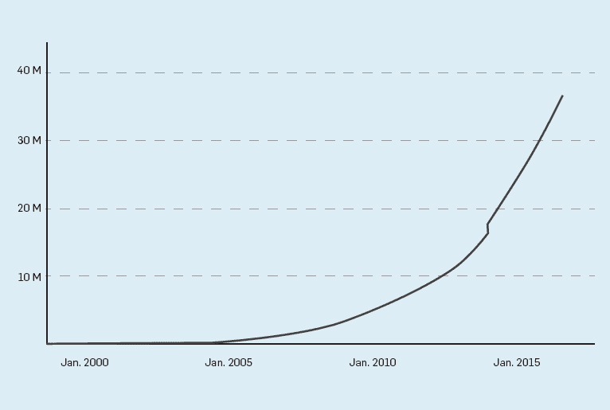
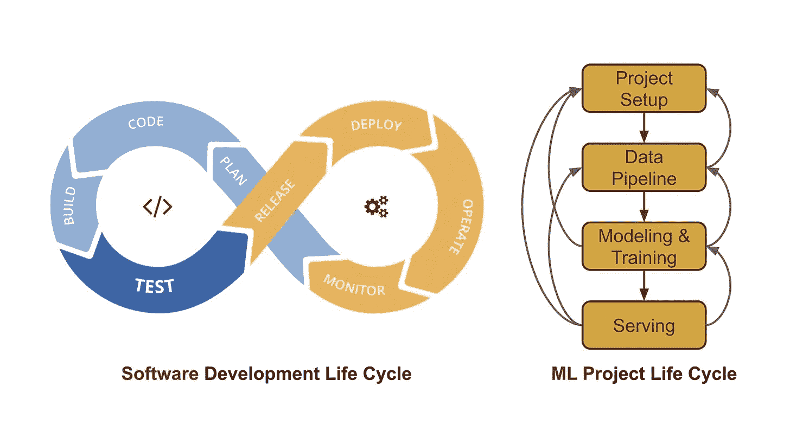
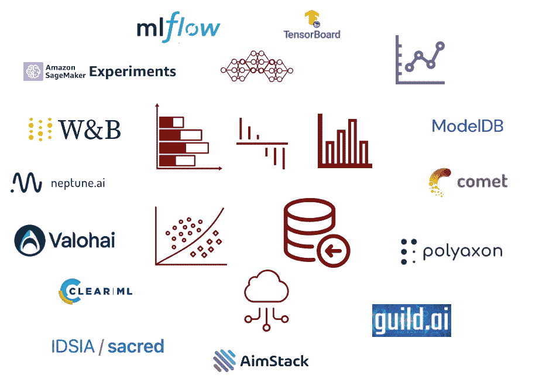
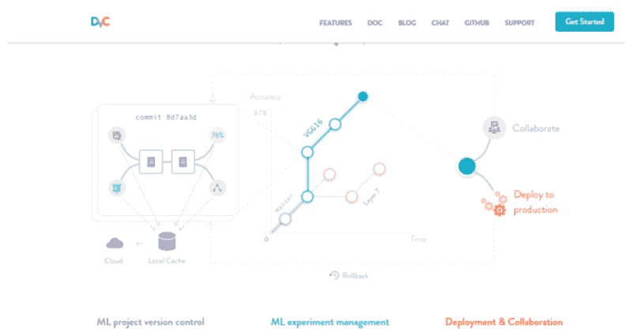
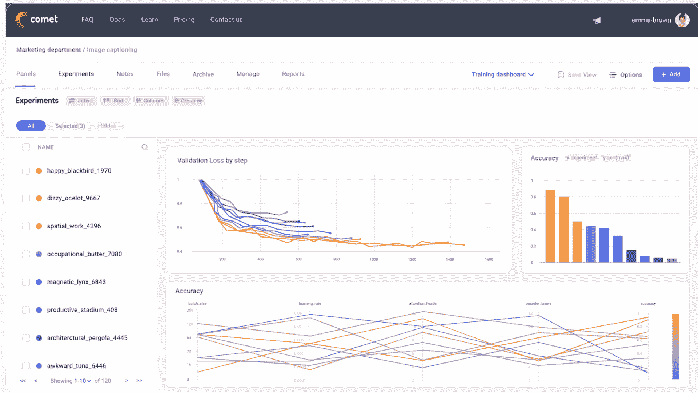

# 为什么 Git 不是 ML 模型版本控制的最佳选择

> 原文：<https://web.archive.org/web/https://neptune.ai/blog/git-for-ml-model-version-control>

如今，企业坐在一个数据池上，越来越多地使用机器学习和深度学习算法来预测销售、预测客户流失和欺诈检测等。，跨行业、跨领域。

数据科学从业者用算法、数据和超参数进行实验，以开发一个产生业务洞察力的模型。然而，实验和项目规模的增加，尤其是在大中型企业中，需要有效的模型管理。数据科学团队目前难以管理多个实验和模型，需要一种高效的方法来存储、检索和利用模型版本、超参数和性能指标等细节。

在本文中，您将了解到:

*   困扰 ML 领域的挑战
*   以及为什么传统工具不是解决这些问题的正确答案。

它将进一步建立在需要比较实验的基础上，这些实验要求数据科学团队的可重复性、可见性和全面协作。您将了解 Git 在维护不同模型版本方面的不足之处，并将看到提供所需功能的工具。

## ML 模型版本化:我们在哪里？

简而言之，我们正处于一场数据革命之中。所有关键数据产品，如文本文档或图像的模型训练，都利用了高级语言和基于视觉的算法。有趣的是，神经网络的数学概念存在了很长时间，但直到现在，训练一个具有数十亿参数的模型才成为可能。让我们通过几个例子来理解这些突破性的发展。

### 最新的算法进步要求增加参数搜索空间

[ImageNet](https://web.archive.org/web/20221208210727/https://www.image-net.org/) ，流行的图像数据集，在深度神经网络的发展中起到了举足轻重的作用。从 2012 年 8 层的 AlexNet 开始，到 2015 年 152 层的 ResNet 深度神经网络随着时间的推移越来越深。更深的网络意味着更多的超参数、更多的实验，反过来也意味着更多的模型信息要以一种需要时可以很容易检索的形式保存。

*Winners of the ILSVRC | [Source](https://web.archive.org/web/20221208210727/https://kjhov195.github.io/post_img/200210/image3.png)*

与 MT-NLG(5300 亿个参数)和开关变压器(超过一万亿个参数)相比，GPT 3(1750 亿个参数)和 DALL-E(120 亿个参数)相形见绌。这些大型模型需要广泛的超参数搜索，包括隐藏层、神经元、退出、激活、优化器、退出、时期等的数量。

### 大型组织中的代码库扩展

让我们从谷歌提供的广泛产品和服务中了解人工智能倡议的规模。它的大多数产品都使用机器学习或深度学习模型来实现部分或全部功能。下面的图表展示了 2000-2015 年间提交到 Google 中央存储库的数量。

*The number of commits to Google’s central repository during 2000-15 | [Source](https://web.archive.org/web/20221208210727/https://cacm.acm.org/magazines/2016/7/204032-why-google-stores-billions-of-lines-of-code-in-a-single-repository/fulltext#F1)*

鉴于像谷歌这样的组织正在致力于人工智能的前沿创新，他们的知识库正在呈指数级增长。这意味着在给定实验规模的情况下，很难找到项目 Z 中模型 A 的性能指标。不仅性能指标，而且导致这些指标的超参数都很难找到，更不用说重现结果了。

### 管理不断膨胀的模型实验世界

*   构建任何算法的前提都是产生商业价值，即企业努力将实验投入生产。从数据收集到生产环境中的模型输出的完整管道是这项工作成功的关键。
*   在这个管道的不同阶段，可能会出现多种情况，从而减少这项工作的潜在收益。即使在模型训练阶段，超参数和性能指标的存储、检索和解释也会对最佳模型的选择产生不利影响。
*   不仅为开发中的模型选择最佳的性能指标很重要，而且存储这些值也很重要。评估指标的简单修改，例如从“F1 分数”到“ROC”，要求重新运行管道并存储结果。
*   现成算法的可用性并不意味着它们可以按原样使用。它需要在数据准备、探索、处理和实验方面付出巨大努力，包括尝试算法和超参数。这是因为这些算法已经在基准数据集上证明了很好的结果，而您的业务问题以及您的数据是不同的。其中一种算法可能比其他算法更好，但是您需要找到最佳配置。从寻找合适的架构和超参数的角度来看，最佳配置来自大量的实验。

### 需要正确的工具和流程来实现业务价值

正确的工具和流程对于促进团队中的知识传播至关重要。此外，维护模型版本将避免丢失模型细节的风险，以防最初的模型开发人员不再为项目工作。您还需要存储模型元数据和文档细节，如配置、流程和执行实验的意图。

这种工具的三个最重要的特征是可见性、可再现性和协作性。

#### 能见度

理解可见性含义的一个简单方法是问以下问题。这些问题还将帮助您评估适合您项目的工具。

## 

*   1 项目经理可以查看正在培训的模型吗？
*   2 哪个型号版本正在生产中运行？
*   3 该车型在开发和生产中的表现如何？
*   4 哪个指标用于优化模型参数？
*   5 用了哪个数据版本来训练模型？
*   哪些超参数产生了最佳指标？

既然我们了解了可视性共享模型的重要细节，那么让我们了解一下可视性的障碍是什么:

*   **分离的部分:**数据、代码、配置和结果在项目的不同阶段生成。
*   **不同的工具:**你的存储库由多个工具、库和基础设施提供商组成，比如 Azure、AWS 和 GCP。
*   **过时和稀疏的文档:**通常，文档与模型工件分离，并存储在不同的地方。团队必须努力维护它，因此它很快就会过时。
*   **生产中的模型中断:**通常，当模型从开发环境过渡到生产环境时，它们的表现不如在模型培训期间。在其他时候，他们只是打破。可能有多种原因，但主要是因为两个环境之间缺少模型和数据踪迹。

#### 再现性

你需要能够重复实验的步骤并产生相同的结果。

以下因素会影响实验的再现性商数:

*   **传入数据的变化:**培训、验证或测试数据的任何变化都可能导致不熟悉的结果，从而延迟组织的部署和价值实现。可能发生变化的一些情况是:
    *   根路径中缺少附加训练数据
    *   数据集改组会影响小批量或随机梯度下降优化结果的结果。
    *   训练和测试时随机选择不同的种子
*   **不一致的超参数:**超参数值可以改变模型架构(树和网络)，需要存储才能重现结果。
*   ML 框架的变化:ML 框架的不同版本或版本更新的使用会产生不一致的结果。像 Keras 这样的包在与不同的后端(PyTorch 或 Tensorflow)一起使用时会产生不同的结果。

#### 合作

随着团队规模的不断扩大，协作也超越了电子邮件、信使和共享驱动器。通常，组织通过松散的渠道或团队来管理沟通。但是很有可能开发人员要么没有记住他们头脑中的所有信息，要么错过了一般的交流。这种通过聊天来共享最新代码版本的依赖会带来错误信息的风险，这会在质量或时间延迟方面对项目造成损失。

合作可能会面临多重障碍，如下文所述。

*   当团队成员处理不同版本的代码时——最新版本的代码要么没有提交，要么共同开发人员忘记从服务器获取最新的代码。
*   模型开发和部署团队可能没有使用最新的模型
*   一个经常被忽视的因素是数据。数据在整个模型开发过程中不断生成。模型开发团队发现很难记录哪个数据集用于哪个模型版本

## Git 是 ML 模型版本化的解决方案吗？

Git 是一个很棒的工具，它支持跨传统软件开发的代码版本控制和协作。但它不是在头脑中建立机器学习模型的。它是支持软件开发的极好工具，但不是为涉及数据、模型、工件等的机器学习工作流而设计的。

Git 的局限性列举如下:

*   Git 不保存模型细节，如模型版本、超参数、性能指标、数据版本等。您可能会在每次实验运行后推送模型结果和元数据，但是随着实验数量的增加，检索、比较和分析这些数据和元数据将很快成为一件痛苦的事情。
*   Git 也不能自动记录每个实验。你的每一个实验都自动将所有相关信息记录到一个存储库中，这难道不理想吗？
*   选择 Git 来记录必要的细节会带来手工开销，需要为实验的意图和目的、算法的选择、超参数以及结果维护单独的文档。理想情况下，实验应该构成文档，即解释实验的内容、原因和方式。

## 我们为什么要超越 Git？

重要的是要注意软件开发和机器学习解决方案开发和部署之间的差异，因为它们构成了 Git for ML 局限性的症结。

Differentiation between software development life cycle and ML project life cycle | [Source](https://web.archive.org/web/20221208210727/https://www.linkedin.com/pulse/machine-learning-vs-traditional-software-development-ml4devs-gupta/)

1.  传统的软件开发遵循一种更简单的方法，在这种方法中，开发人员构建一种算法来解决一个业务问题，在这种方法中，它处理输入以产生期望的输出。另一方面，机器学习开发者利用数据来训练模型，然后部署所学习的模型来进行推断。

2.  软件开发和机器学习开发之间的一个明显区别是，前者的输出是确定性的，而后者产生的是概率性的输出。因此，当发现与先前学习的偏差时，机器/模型必须通过结合新信息来不断学习。

3.  回到机器学习模型的学习和再学习要求，任何涉及训练和推理的解决方案也需要严格的实验，主要是因为规则不是手工制作的。

4.  Git 旨在处理任何软件开发项目中通常使用的瀑布开发模型。代码中的任何迭代都会被系统很好地捕获。但是，当迭代不限于代码，并且您需要在一个包中一次对代码、数据、模型、性能指标以及超参数进行版本控制时，会发生什么呢？这是 Git 看起来令人乏味的时候，你需要超越它。

所有这些因素都有助于为机器学习工作流定制工具的需求。

*   跟踪:每个数据从业者最起码的要求是记录每个实验的结果。但是你为什么要就此打住呢？当您更进一步，可视化不同实验的性能时，跟踪不同模型的性能会变得容易得多。这些有助于为所有利益相关者生成报告和仪表板，以进行监控、提供反馈并将结果呈现给企业。

*   **版本化**:考虑一个案例，一个开发人员成功地构建了模型，并记录了指标来证明它的价值。现在，这个性能最佳的模型被部署到生产环境中。但是和其他任何代码一样，它肯定会崩溃。即使代码按预期运行，输出也可能不是这样。由于机器学习算法的黑盒性质，无声故障是常见的现象。

降级的模型性能要求原始作者查看潜在的原因，并将其重新提出来。开发人员在开发环境中运行模型以重现结果，但未能找到相应的代码库。这突出了记录整个元数据集的需要，这可以帮助开发人员在开发环境中追溯生产复制模型。理想的工具是跟踪和维护不同的模型版本以及整个元数据。

*   **文档**:代码的原作者可能并不总是能够分享部署模型(或者任何其他存档模型，如果需要的话)的血淋淋的细节。因此，一个理想的工具提供了一个维护每次模型运行的所有相关细节的日志的平台。它节省了手动文档，并促进了 ML 项目的迭代性质，即从数据中学习并比较结果。

*   **平台无关**:它应该无缝集成并与任何基础设施、工具或库一起工作。

## ML 模型版本控制的 Git 替代方案

Alternative tools for Git | [Source](https://web.archive.org/web/20221208210727/https://gradientflow.com/experiment-tracking-and-experiment-management-tools/)

虽然 Git 不是机器学习管道和解决方案的完美工具，但有一些工具可以解决机器学习团队面临的一些或所有挑战。下面将对它们进行讨论。

Neptune 支持研究和生产环境，是支持所有机器学习工作流的首选元数据存储。它建立在所有机器学习实验本质上都是迭代的特权之上。实验的规模要求数据科学家比较无数的模型，这有助于海王星通过促进监测和可视化它们的性能。

*   提供跟踪这些实验的平台，以防止重复实施并促进再现性。
*   促进交叉协作，并允许不同的团队成员通过共享 UI 链接在不同的项目上一起工作。
*   支持内部版本和云版本。
*   提供多种优势，如记录和显示所有元数据，如模型权重、超参数等。–最棒的是其用户友好的用户界面，提供无缝体验来比较和分析多个实验。

MLflow 是一个开源框架，它简化了端到端的机器学习流程，包括但不限于模型训练运行、在生产中存储和加载模型、复制结果等。它带有轻量级 API，支持任何机器学习库和编程语言，可以轻松地与任何代码集成。

MLflow 的优势在于其广泛的社区影响力和支持，这对任何开源平台都是至关重要的。它有四个关键组成部分

*   [MLflow Tracking](https://web.archive.org/web/20221208210727/https://www.mlflow.org/docs/latest/tracking.html#tracking) :记录并比较代码版本、模型参数和输出
*   [MLflow Models](https://web.archive.org/web/20221208210727/https://www.mlflow.org/docs/latest/models.html) :打包代码供下游使用——实时服务或用于推理目的的批处理结果
*   [MLflow 项目](https://web.archive.org/web/20221208210727/https://www.mlflow.org/docs/latest/projects.html#projects):组织代码以重现结果，将模型部署到产品中，或者在团队中共享
*   [MLflow Registry](https://web.archive.org/web/20221208210727/https://www.mlflow.org/docs/latest/model-registry.html#registry) :是一个模型库，提供模型血统、模型版本、元数据、各模型开发阶段的标签等。

DVC 通过对模型、数据集和中间文件进行版本控制来支持机器学习项目的版本控制。

*DVC’s UI | Source: [DVC](https://web.archive.org/web/20221208210727/https://dvc.org/)*

*   支持广泛的存储系统，包括但不限于亚马逊 S3、Azure Blob 存储、Google Drive、Google 云存储等。
*   保持对中间工件的缓存，这使得迭代多个实验和利用存档的代码、数据或模型变得容易。
*   它不是将大文件存储在 Git 中，而是通过存储元数据、模型工件等来高效地工作。用吉特。
*   最突出的是它的 GitOps 支持，即它工作在 Git 存储库之上，并将机器学习项目与 Git 工作流连接起来。

Weight & Biases 通过实现简单的模型管理、实验跟踪和数据集版本控制，加快了模型开发过程。

*   提供与机器学习代码的无缝集成，并在仪表板上显示关键指标和统计数据。
*   允许您跨不同的模型版本可视化模型结果，并通过协作报告创作这些结果。
*   支持 [PyTorch Lightning](https://web.archive.org/web/20221208210727/https://www.pytorchlightning.ai/) 、 [Keras](https://web.archive.org/web/20221208210727/https://keras.io/) 、 [Tensorflow](https://web.archive.org/web/20221208210727/https://www.tensorflow.org/) 和 [HuggingFace](https://web.archive.org/web/20221208210727/https://huggingface.co/) 等等。与 Neptune 不同，Weights&bias 不提供超出免费学术和开源项目的免费版本。

权重和偏差的一个显著特征是，它会自动复制记录的数据集并对其进行版本化。

Comet 通过提供实验管理、模型管理和监控部署的模型，帮助组织加速和优化模型构建过程。

*Comet’s UI | Source: [Comet](https://web.archive.org/web/20221208210727/https://www.comet.com/site/)*

*   与当前的技术体系相集成，并端到端地简化繁琐的模型构建流程，即从模型培训周期到生产运行。
*   支持使用 [Plotly](https://web.archive.org/web/20221208210727/https://plotly.com/) 和 [matplotlib](https://web.archive.org/web/20221208210727/https://matplotlib.org/) 的自定义可视化，以及 30 多种可视化。
*   在模型或数据漂移的情况下识别并警告系统，并在模型训练期间呈现关于基线模型性能的偏差。

它是一个开源的 web 仪表板，用于配置、组织、记录和复制机器学习实验。它旨在减轻模型开发人员维护不同实验的参数和设置的开销，从而使他们能够专注于模型开发的关键方面。

*   虽然它可以部署在云中或内部，但不是作为托管服务提供的。
*   鉴于它是免费提供的，它没有提供聊天或电子邮件帮助来满足企业需求。
*   您可以通过一个名为 [Omniboard](https://web.archive.org/web/20221208210727/https://www.npmjs.com/package/omniboard) 的 web 仪表板可视化来自多个实验的模型度量和日志。[公会 AI](https://web.archive.org/web/20221208210727/https://guild.ai/) 是圣斗士+全能的[的有用替代品之一。](/web/20221208210727/https://neptune.ai/blog/the-best-sacred-omniboard-alternatives)

虽然这篇文章列出并分享了支持模型监控和维护的多个平台，但是没有标准的方法来选择一个。[下面列出了一些可以帮助你做出决定](https://web.archive.org/web/20221208210727/https://www.g2.com/compare/neptune-ai-vs-weights-biases)的因素，这些因素应该是你的清单的一部分:

## 

*   1 易用性
*   未来的版本
*   3 产品愿景和增强功能
*   4 管理员权限和访问
*   5 易于设置和开始使用
*   6 客户支持
*   7 框架和编程语言不可知与否？
*   8 势成规模

## 结束了！

在这篇文章中，我们从机器学习项目的角度讨论了 Git 的局限性。通过理解 Git 的不足之处和理想工具的样子，我们探索了市场上当前的选择以及它们之间的比较。我希望这篇文章已经让您清楚地了解了 Git 替代品的需求，以及在选择正确的替代品时您应该记住什么。