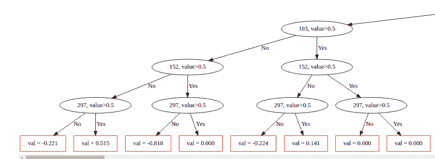

# 梯度推进决策树[指南]:一个概念性的解释

> 原文：<https://web.archive.org/web/https://neptune.ai/blog/gradient-boosted-decision-trees-guide>

梯度推进决策树已被证明优于其他模型。这是因为 boosting 涉及实现几个模型并聚合它们的结果。

由于在 Kaggle 上的机器学习比赛中的表现，梯度增强模型最近变得很受欢迎。

在这篇文章中，我们将看到梯度提升决策树是怎么回事。

## 梯度推进

在[梯度提升](https://web.archive.org/web/20230304041944/https://en.wikipedia.org/wiki/Gradient_boosting#:~:text=Gradient%20boosting%20is%20a%20machine,prediction%20models%2C%20typically%20decision%20trees.)中，弱学习器的集合用于提高机器学习模型的性能。弱学习者通常是决策树。结合起来，它们的输出会产生更好的模型。

在回归的情况下，从所有弱学习者的平均值产生最终结果。通过分类，最终结果可以被计算为来自弱学习者的大多数投票的类。

在梯度推进中，弱学习者顺序工作。每个模型都试图改进前一个模型的误差。这不同于 bagging 技术，在 bagging 技术中，几个模型以并行方式拟合数据子集。这些子集通常随机抽取并替换。装袋的一个很好的例子是在随机森林中。

**升压过程看起来是这样的**:

*   用数据建立一个初始模型，
*   对整个数据集进行预测，
*   使用预测值和实际值计算误差，
*   给不正确的预测分配更多的权重，
*   创建另一个模型，尝试修复上一个模型的错误，
*   使用新模型对整个数据集运行预测，
*   创建多个模型，每个模型旨在纠正前一个模型产生的错误，
*   通过加权所有模型的平均值获得最终模型。

## 机器学习中的助推算法

我们来看看机器学习中的 boosting 算法。

### adaboost 算法

AdaBoost 将一系列弱学习者与数据进行拟合。然后，它给不正确的预测分配更多的权重，给正确的预测分配更少的权重。通过这种方式，算法更加关注难以预测的观察结果。最终结果是从分类中的多数票，或回归中的平均值获得的。

您可以使用 Scikit-learn 实现这个算法。“n_estimators”参数可以传递给它，以指示所需弱学习器的数量。您可以使用“learning_rate”参数来控制每个弱学习者的贡献。

默认情况下，该算法使用决策树作为基本估计器。可以调整基本估计器和决策树的参数来提高模型的性能。默认情况下，AdaBoost 中的决策树只有一次拆分。

#### 使用 AdaBoost 分类

您可以使用 Scikit-learn 中的“AdaBoostClassifier”来实现 AdaBoost 模型以解决分类问题。正如您在下面看到的，基本估计器的参数可以根据您的喜好进行调整。分类器也接受您想要的估计数。这是模型所需的决策树数量。

```
from sklearn.tree import DecisionTreeClassifier
from sklearn.ensemble import AdaBoostClassifier
base_estimator=DecisionTreeClassifier(max_depth=1,criterion='gini', splitter='best', min_samples_split=2)
model = AdaBoostClassifier(base_estimator=base_estimator,n_estimators=100)
model.fit(X_train, y_train)
```

#### 使用 AdaBoost 进行回归

将 AdaBoost 应用于回归问题类似于分类过程，只是做了一些表面上的改变。首先，您必须导入“AdaBoostRegressor”。然后，对于基本估计量，您可以使用“DecisionTreeRegressor”。就像上一个一样，你可以调整决策树回归器的参数。

```
from sklearn.tree import DecisionTreeRegressor
from sklearn.ensemble import AdaBoostRegressor
base_estimator = DecisionTreeRegressor(max_depth=1, splitter='best', min_samples_split=2)
model = AdaBoostRegressor(base_estimator=base_estimator,n_estimators=100)
model.fit(X_train, y_train)
```

### Scikit-learn 梯度增强估计器

梯度提升不同于 AdaBoost，因为损失函数优化是通过梯度下降完成的。和 AdaBoost 一样，它也使用决策树作为弱学习器。它也依次适合这些树。添加后续树时，使用梯度下降将损失降至最低。

在 Scikit-learn 实现中，您可以指定树的数量。这是一个应该密切关注的参数，因为指定太多的树会导致过度拟合。另一方面，指定很少数量的树会导致拟合不足。

该算法允许您指定学习率。这决定了模型学习的速度。低学习率通常需要模型中有更多的树。这意味着更多的训练时间。

现在让我们看看 Scikit-learn 中梯度增强树的实现。

#### 使用 Scikit-learn 梯度增强估计器进行分类

这是使用“GradientBoostingClassifier”实现的。该算法预期的一些参数包括:

*   定义要优化的损失函数的“损失”
*   确定每棵树贡献的“学习率”
*   ` n_estimatorst '表示决策树的数量
*   “最大深度”是每个估计器的最大深度

```
from sklearn.ensemble import GradientBoostingClassifier
gbc = GradientBoostingClassifier(loss='deviance', learning_rate=0.1, n_estimators=100, subsample=1.0, criterion='friedman_mse', min_samples_split=2, min_samples_leaf=1)
gbc.fit(X_train,y_train)
```

拟合分类器后，您可以使用“feauture _ importances _”属性获得特征的重要性。这通常被称为基尼系数。

```
gbc.feature_importances_
```


值越高，特性越重要。获得的数组中的值总和将为 1。

注意:基于杂质的重要性并不总是准确的，尤其是当有太多的特征时。在这种情况下，您应该考虑使用[基于排列的重要性](https://web.archive.org/web/20230304041944/https://scikit-learn.org/stable/modules/generated/sklearn.inspection.permutation_importance.html#sklearn.inspection.permutation_importance)。

#### 使用 Scikit-learn 梯度增强估计器进行回归

Scikit-learn 梯度增强估计器可使用“GradientBoostingRegressor”实现回归。它采用类似于分类的参数:

*   损失，
*   估计数，
*   树木的最大深度，
*   学习率…

…仅举几个例子。

```
from sklearn.ensemble import GradientBoostingRegressor
params = {'n_estimators': 500,
          'max_depth': 4,
          'min_samples_split': 5,
          'learning_rate': 0.01,
          'loss': 'ls'}
gbc = GradientBoostingRegressor(**params)
gbc.fit(X_train,y_train)
```

像分类模型一样，您也可以获得回归算法的特征重要性。

```
gbc.feature_importances_
```

海王与[斯克利亚
T2 的融合](/web/20230304041944/https://neptune.ai/blog/the-ultimate-guide-to-evaluation-and-selection-of-models-in-machine-learning)

### XGBoost

[XGBoost](/web/20230304041944/https://neptune.ai/blog/how-to-organize-your-xgboost-machine-learning-ml-model-development-process) 是一个支持 Java、Python、Java 和 C++、R、Julia 的渐变增强库。它还使用弱决策树的集合。

这是一个通过并行计算进行树学习的线性模型。该算法还附带了用于执行交叉验证和显示特性重要性的特性。这种模式的主要特点是:

*   接受树增强器和线性增强器的稀疏输入，
*   支持自定义评估和目标函数，
*   “Dmatrix ”,其优化的数据结构提高了性能。

让我们看看如何在 Python 中应用 XGBoost。该算法接受的参数包括:

*   “目标”定义任务的类型，比如回归或分类；
*   ` colsample_bytree `构造每个树时列的子采样比率。子采样在每次迭代中发生一次。这个数字通常是 0 到 1 之间的一个值；
*   “learning_rate ”,确定模型学习的快慢；
*   ` max_depth '表示每棵树的最大深度。树越多，模型越复杂，过度拟合的机会就越大；
*   ` alpha '是权重上的 L1 正则化;
*   “n_estimators”是要拟合的决策树的数量。

#### 使用 XGBoost 分类

导入算法后，您可以定义想要使用的参数。因为这是一个分类问题，所以使用“二元:逻辑”目标函数。下一步是使用“XGBClassifier”并解包定义的参数。您可以调整这些参数，直到获得最适合您的问题的参数。

```
import xgboost as xgb
params = {"objective":"binary:logistic",'colsample_bytree': 0.3,'learning_rate': 0.1,
                'max_depth': 5, 'alpha': 10}
classification = xgb.XGBClassifier(**params)
classification.fit(X_train, y_train)

```

#### 使用 XGBoost 进行回归

在回归中，使用“XGBRegressor”。在这种情况下，目标函数将是“reg:squarederror”。

```
import xgboost as xgb
params = {"objective":"reg:squarederror",'colsample_bytree': 0.3,'learning_rate': 0.1,
                'max_depth': 5, 'alpha': 10}
regressor = xgb.XGBRegressor(**params)
regressor.fit(X_train, y_train)
```

XGBoost 模型还允许您通过“feature_importances_”属性获得特性的重要性。

```
regressor.feature_importances_
```


您可以使用 Matplotlib 轻松地将它们可视化。这是使用 XGBoost 中的“plot_importance”函数完成的。

```
import matplotlib.pyplot as plt
xgb.plot_importance(regressor)
plt.rcParams['figure.figsize'] = [5, 5]
plt.show()
```

“保存模型”功能可用于保存您的模型。然后，您可以将这个模型发送到您的模型注册中心。

```
regressor.save_model("model.pkl")
```

查看 Neptune 文档，了解与 XGBoost 和 T2 matplotlib 的集成

### LightGBM

[LightGBM](/web/20230304041944/https://neptune.ai/blog/how-to-organize-your-lightgbm-ml-model-development-process-examples-of-best-practices) 与其他梯度推进框架不同，因为它使用逐叶树生长算法。已知逐叶树生长算法比逐深度生长算法收敛得更快。然而，他们更容易过度适应。

该算法是基于[直方图的](https://web.archive.org/web/20230304041944/https://scikit-learn.org/stable/modules/generated/sklearn.ensemble.HistGradientBoostingClassifier.html)，因此它将连续值放入离散的箱中。这导致更快的训练和有效的存储器利用。

该算法的其他显著特征包括:

*   支持 GPU 训练，
*   对分类特性的本机支持，
*   处理大规模数据的能力，
*   默认情况下处理缺失值。

让我们来看看这个算法的一些主要参数:

*   ` max_depth `每棵树的最大深度；
*   默认为回归的“目标”;
*   ` learning_rate `提高学习率；
*   ` n_estimators '要拟合的决策树的数量；
*   ` device_type `无论你是在 CPU 上工作还是在 GPU 上工作。

#### LightGBM 分类

训练二元分类模型可以通过将“二元”设置为目标来完成。如果是多分类问题，则使用“多类”目标。

数据集也被转换成 LightGBM 的“数据集”格式。然后使用“训练”功能完成模型训练。您还可以使用“valid_sets”参数传递验证数据集。

```
import lightgbm as lgb
lgb_train = lgb.Dataset(X_train, y_train)
lgb_eval = lgb.Dataset(X_test, y_test, reference=lgb_train)
params = {'boosting_type': 'gbdt',
              'objective': 'binary',
              'num_leaves': 40,
              'learning_rate': 0.1,
              'feature_fraction': 0.9
              }
gbm = lgb.train(params,
    lgb_train,
    num_boost_round=200,
    valid_sets=[lgb_train, lgb_eval],
    valid_names=['train','valid'],
   )
```

#### 用 LightGBM 回归

对于使用 LightGBM 的回归，您只需要将目标改为“回归”。提升类型默认为梯度提升决策树。

如果您愿意，您可以将其更改为随机森林，“dart ”-漏失符合多重加法回归树，或“Goss ”-基于梯度的单侧采样。

```
import lightgbm as lgb
lgb_train = lgb.Dataset(X_train, y_train)
lgb_eval = lgb.Dataset(X_test, y_test, reference=lgb_train)
params = {'boosting_type': 'gbdt',
              'objective': 'regression',
              'num_leaves': 40,
              'learning_rate': 0.1,
              'feature_fraction': 0.9
              }
gbm = lgb.train(params,
    lgb_train,
    num_boost_round=200,
    valid_sets=[lgb_train, lgb_eval],
    valid_names=['train','valid'],
   )
```

您还可以使用 LightGBM 来绘制模型的特征重要性。

```
lgb.plot_importance(gbm)
```

LightGBM 还有一个用于保存模型的内置函数。该功能是“保存模型”。

```
gbm.save_model('mode.pkl')
```

海王星与 [LightGBM](https://web.archive.org/web/20230304041944/https://docs.neptune.ai/essentials/integrations/machine-learning-frameworks/lightgbm) 的融合

### CatBoost

[CatBoost](https://web.archive.org/web/20230304041944/https://github.com/catboost) 是 Yandex 开发的深度梯度推进库。该算法使用不经意决策树生成一棵平衡树。

它使用相同的特征在树的每一层进行左右分割。

例如，在下图中，您可以看到“297，值> 0.5”被用于该级别。



[CatBoost](https://web.archive.org/web/20230304041944/https://catboost.ai/news/catboost-enables-fast-gradient-boosting-on-decision-trees-using-gpus) 的其他显著特性包括:

*   对分类特性的本机支持，
*   支持在多个 GPU 上训练，
*   使用默认参数会产生良好的性能，
*   通过 CatBoost 的模型应用程序进行快速预测，
*   本机处理丢失的值，
*   支持回归和分类问题。

现在让我们来看看 CatBoost 的几个训练参数:

*   ` loss_function `用于分类或回归的损失；
*   ` eval_metric `模型的评估度量；
*   ` n_estimators '决策树的最大数量；
*   ` learning_rate '决定模型学习的快慢；
*   “深度”,每棵树的最大深度；
*   ` ignored_features '确定在训练期间应该忽略的特征；
*   ` nan_mode '将用于处理缺失值的方法；
*   ` cat_features `分类列的数组；
*   用于声明基于文本的列的“text_features”。

#### 使用 CatBoost 分类

对于分类问题，使用“CatBoostClassifier”。在训练过程中设置“plot=True”将使模型可视化。

```
from catboost import CatBoostClassifier
model = CatBoostClassifier()
model.fit(X_train,y_train,verbose=False, plot=True)
```

#### 使用 CatBoost 进行回归

在回归的情况下，使用“CatBoostRegressor”。

```
from catboost import CatBoostRegressor
model = CatBoostRegressor()
model.fit(X_train,y_train,verbose=False, plot=True)
```

您还可以使用“feature_importances_”来获得特性的重要性排名。

```
model.feature_importances_
```


该算法还支持执行交叉验证。这是通过传递所需参数时使用“cv”函数来完成的。

通过“plot="True "”将使交叉验证过程可视化。“cv”函数要求数据集采用 CatBoost 的“Pool”格式。

```
from catboost import Pool, cv
params = {"iterations": 100,
          "depth": 2,
          "loss_function": "RMSE",
          "verbose": False}
cv_dataset = Pool(data=X_train,
                  label=y_train)
scores = cv(cv_dataset,
            params,
            fold_count=2,
            plot=True)
```

您还可以使用 CatBoost 来执行网格搜索。这是使用“grid_search”功能完成的。搜索后，CatBoost 在最佳参数上进行训练。

在此过程之前，您不应该拟合模型。传递“plot=True”参数将可视化网格搜索过程。

```
grid = {'learning_rate': [0.03, 0.1],
        'depth': [4, 6, 10],
        'l2_leaf_reg': [1, 3, 5, 7, 9]}

grid_search_result = model.grid_search(grid, X=X_train, y=y_train, plot=True)
```

CatBoost 还使您能够可视化模型中的单棵树。这是通过使用“plot_tree”函数并传递您想要可视化的树的索引来完成的。

```
model.plot_tree(tree_idx=0)
```


## 梯度推进树的优势

有几个原因可以解释为什么您会考虑使用梯度推进树算法:

*   通常比其他模式更精确，
*   训练速度更快，尤其是在大型数据集上，
*   它们中的大多数都支持处理分类特征，
*   它们中的一些本身就处理缺失值。

## 梯度增强树的缺点

现在，让我们来解决使用梯度增强树时面临的一些挑战:

*   易于过度拟合:这可以通过应用 L1 和 L2 正则化惩罚来解决。你也可以尝试低学习率；
*   模型可能计算量很大，需要很长时间来训练，尤其是在 CPU 上；
*   很难解释最终的模型。

## 最后的想法

在本文中，我们探讨了如何在机器学习问题中实现梯度推进决策树。我们还介绍了各种基于 boosting 的算法，您可以立即开始使用。

具体来说，我们涵盖了:

*   什么是梯度推进，
*   梯度推进是如何工作的，
*   各种类型的梯度增强算法，
*   如何对回归和分类问题使用梯度推进算法，
*   梯度推进树的优点，
*   梯度增强树的缺点，

…还有更多。

你已经准备好开始提升你的机器学习模型了。

### 资源