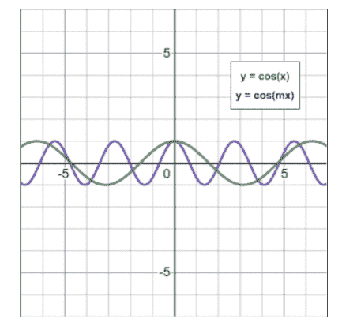
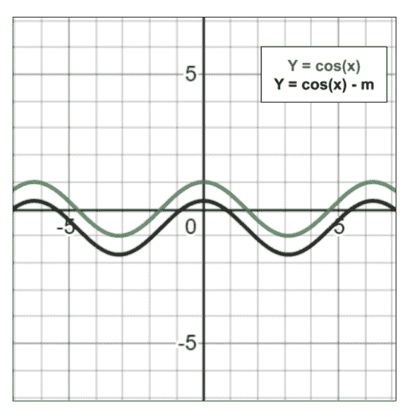
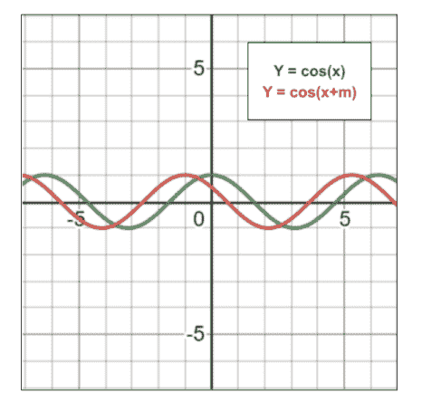
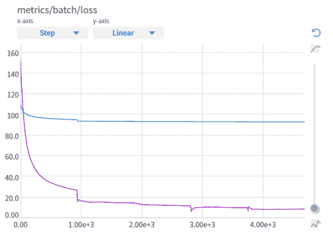
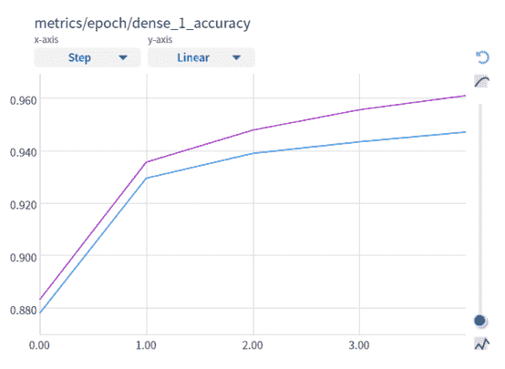

# 人脸识别如何选择损失函数

> 原文：<https://web.archive.org/web/https://neptune.ai/blog/how-to-choose-loss-function-for-face-recognition>

[人脸识别](https://web.archive.org/web/20221231065532/https://machinelearningmastery.com/introduction-to-deep-learning-for-face-recognition/) (FR)是深度学习最有趣的任务之一。从表面上看，这就像是另一个[多类分类问题](https://web.archive.org/web/20221231065532/https://towardsdatascience.com/machine-learning-multiclass-classification-with-imbalanced-data-set-29f6a177c1a)。当你试着去实现它时，你会意识到它有更多的含义。损失函数的选择可能是决定模型性能的最关键因素。

为了让 FR 模型表现良好，它必须学会以这样一种方式从图像中提取这样的特征，即将属于同一张脸的所有图像紧密地放置在一起(在特征空间中)，并将不同脸的图像远离放置。换句话说，我们需要模型来减少特征空间中数据点的类内距离*，增加类间*距离*。本文的前半部分描述了对这两个子任务提供细粒度控制的损失函数。*

与一般的分类任务不同，预先收集所有可能人脸的样本图像是不切实际的。因此，使用依赖于固定数量的类的损失函数可能不是一个好主意。在本文的后半部分，我们将探索损失函数，其目的是*学习图像的良好的**表示，而不是*将*图像分类到一组预定的类别中。这些表示然后被馈送到任何合适的最近邻分类器，例如 k-NN。*

 *## 基于分类的损失函数

[损失函数](https://web.archive.org/web/20221231065532/https://www.section.io/engineering-education/understanding-loss-functions-in-machine-learning/)将任何图像分类到已知类别。我的理解是，如果你有一个小的固定数量的类和更少的可用数据，它们会工作得更好。可以使用不同的度量来测量数据点之间的距离。欧几里德距离和余弦相似性(及其修改)是最流行的。

### 用欧几里得距离来衡量

#### 软最大损失

##### 背景/动机

Softmax 损失只不过是最后一层中 softmax 激活的分类交叉熵损失。这是 FR 最基本的损失函数，也可能是最差的。为了完整起见，我将它包含在这里，因为在此之后出现的损失是对 softmax 损失的一些修改。

##### 定义

softmax 损耗定义如下:

**X****[I]****是第 i ^幅幅图像的特征向量。 *W* *[j]* 是权重的第 j^(列， *b* *[j]* 是偏置项。类别数和图像数分别为 *n* 和 *m* ，而*y**[I]**是第*I**^(th)*幅图像的类别。*)**

 ***##### 优势

*   这种损失在文献中有很好的探讨，并且在信息理论中有很强的概念基础
*   大多数标准的机器学习框架已经提供了这种损失的内置实现。

##### 不足之处

*   每个类都需要在训练集中表示
*   无法对类内/类间距离进行精细控制

##### 代码示例

```
import tensorflow as tf

def softmax_loss(y_true, W, b, x):

    y_pred = tf.matmul(x, W) + b
    numerators = tf.reduce_sum(y_true * tf.exp(y_pred), axis=1)
    denominators = tf.reduce_sum(tf.exp(y_pred), axis=1)
    loss = - tf.reduce_sum(tf.log(numerators / denominators))

    return loss
```

#### 中心损失

##### 背景/动机

*   为了解决 Softmax 损失的局限性，这篇论文的作者提出了中心损失的概念。
*   首先，他们注意到数据在特征空间中的分布存在显著的类内差异。
*   他们用一个玩具模型来证明这一点，这个玩具模型的最后一层只有两个完全连接的节点。
*   训练后最终层激活的图如下图所示(摘自论文)

*   为了缓解这种情况，他们在 softmax loss 中引入了一个额外的项，如果数据点远离其类的质心，则该项会惩罚模型。

##### 定义

中心损耗定义为:

*   第一项(灰色)与 softmax 损失相同。
*   在第二项中，*c**[yi]***是属于特征空间中第 i ^个数据点的类*y*I 的所有点的质心。**
*   **第二项实质上是所有点距其各自类质心的平方距离之和。实际上，这个质心是一次为一个批次而不是整个数据集计算的。**
*   **是控制第二项效果的超参数。**

 **##### 优势

*   圆形损失明确地惩罚了*类内*变化。
*   与对比损失或三重损失(稍后讨论)不同，它不需要将训练样本复杂地重新组合成对或三重。

##### 不足之处

*   如果类的数量非常大，那么质心的计算就变得非常昂贵[ [Source](https://web.archive.org/web/20221231065532/https://arxiv.org/abs/1801.07698)
*   它没有明确地惩罚*类间*的变化。

##### 代码示例

```
import tensorflow as tf

def circle_loss(W, b, lamda_center):

    def inner(y_true, x):
        y_pred = tf.matmul(x, W) + b
        numerators = tf.reduce_sum(y_true * tf.exp(y_pred), axis=1)
        denominators = tf.reduce_sum(tf.exp(y_pred), axis=1)
        loss_softmax = - tf.reduce_sum(tf.log(numerators / denominators))

        class_freqs = tf.reduce_sum(y_true, axis=0, keepdims=True)
        class_freqs = tf.transpose(class_freqs)

        centres = tf.matmul(tf.transpose(y_true), x)
        centres = tf.divide(centres, class_freqs)
        repeated_centres = tf.matmul(y_true, centres)

        sq_distances = tf.square(tf.norm(x - repeated_centres, axis=1))
        loss_centre = tf.reduce_sum(sq_distances)

        loss = loss_softmax + (lambda_center/2) * loss_centre

        return loss
    return inner
```

### 通过角距离测量

#### A-Softmax(又名 SphereFace)

##### 背景/动机

*   从 softmax 损耗中学习的特征本质上具有角度分布(参见中心损耗部分的图)。
*   这篇论文的作者明确利用了这个事实。

##### 定义

*   作者根据特征向量和与其在权重矩阵中的类别相对应的列向量之间的角度来改写 softmax 损失的表达式(参考 softmax 损失以了解除θ之外的术语的解释):

*   然后，他们通过 L [2] 归一化每个 W [j] 并忽略偏差项来简化表达式。这仍然是一个很好的近似值(我的理解是，这只是为了计算损耗，而不是在实际架构中)。

*   然后他们添加一个超参数 *m* 来控制这个表达式对角度的敏感度

*   这是球面损失。为了完整起见，本文描述了进一步的修改，但是这种表达对于概念性的理解是足够的。
*   余弦函数被修改的余量如下(绿色为未修改)。



*Source: Author*

优势

##### 该损失函数直接与角度变量一起工作，这更符合如前所述的数据的内在分布。

*   它不需要将训练样本复杂地重组成对或三元组。
*   这种损失有助于减少*类内*距离，同时增加*类间*距离(在分母中可以清楚地看到，因为*类内*角度比*类间*角度受到更大的惩罚)
*   不足之处

##### 原论文做了几个近似和假设(如 *m* 被约束为整数)。

*   随着 *m* 的增加，余弦函数的局部极小值也来到可能的θ的范围内，在此之后该函数是非单调的(即在θ = /m 之后)。
*   作者需要对原始损失函数进行分段修正来解决这个问题。
*   代码示例

##### 大幅度余弦损失(又名余弦损失)

```
import tensorflow as tf

def SphereFaceLoss(W, x, m):
    def inner(y_true, x):

        M = (m-1) * y_true + 1

        normalized_W, norms = tf.linalg.normalize(W, axis=0)

        y_pred = x * normalized_W

        cos_theta, norm_x = tf.linalg.normalize(y_pred, axis=1)
        theta = tf.acos(cos_theta)

        new_theta = theta * M
        new_cos_theta = tf.cos(new_theta)
        new_y_pred = norm_x * new_cos_theta

        numerators = tf.reduce_sum(y_true * tf.exp(new_y_pred), axis=1)
        denominators = tf.reduce_sum(tf.exp(new_y_pred), axis=1)
        loss = - tf.reduce_sum(tf.log(numerators / denominators))

        return loss
    return inner
```

#### 背景/动机

##### 这种损失是由与 SphereFace 相同的推理引起的，但是论文的作者声称它更容易理解和执行。

*   定义

##### 在这种损失中，特征向量也被归一化(类似于 W [j] )并通过常数因子 *s* 进行缩放

*   余量 *m* 被加到角度的余弦上。公式是:
*   余弦函数修改如下(绿色未修改):

*   优势



*Source: Author*

##### 与 SphereFace 不同，余弦函数的非单调性不会产生问题。

*   因为特征向量也被归一化，所以模型必须学习更好的角度分离，因为它没有通过学习不同的范数来减少损失的自由。
*   代码示例

##### 附加角裕度损失(又名弧面)

```
import tensorflow as tf

def CosFaceLoss(W, m, s):
    def inner(y_true, x):

        y_true = tf.cast(y_true, dtype=tf.float32)
        M = m * y_true

        dot_product = tf.matmul(x, W)
        cos_theta, cos_theta_norm = tf.linalg.normalize(dot_product,axis=0)

        y_pred = s * cos_theta - M

        numerators = tf.reduce_sum(y_true * tf.exp(y_pred), axis=1)
        denominators = tf.reduce_sum(tf.exp(y_pred), axis=1)
        loss = - tf.reduce_sum(tf.math.log(numerators/denominators))
        return loss
    return inner
```

#### 背景/动机

##### 这是 angular softmax 损失系列中的又一损失。论文的作者声称它比它的前辈有更好的性能和更清晰的几何解释。

*   定义

##### 这里，cos 函数内部的余量被添加到角度本身。

*   优势

##### 这里的余量 *m* 可以解释为半径 *s* 的超球面上的附加弧长

*   (从实验来看)在具有大致相同的*类内*相似性的同时，类间差异似乎比三重丢失更好。
*   该论文中的模型优于前面提到的论文中的所有模型。
*   余弦函数修改如下(绿色未修改):
*   不足之处



*Source: Author*

##### 余弦函数的非单调性会在θ值大于*–**m*时产生问题，但作者似乎没有具体解决这个问题。

*   代码示例

##### 基于表征学习的损失函数

```
import tensorflow as tf

def ArcFaceLoss(W, m):
    def inner(y_true, x):

        M = (m-1) * y_true + 1

        normalized_W, norms_w = tf.linalg.normalize(W, axis=0)
        normalized_x, norms_x = tf.linalg.normalize(x, axis=0)

        cos_theta = normalized_x * normalized_W

        theta = tf.acos(cos_theta)

        new_theta = theta + M
        new_cos_theta = tf.cos(new_theta)

        y_pred = s * new_cos_theta

        numerators = tf.reduce_sum(y_true * tf.exp(y_pred), axis=1)
        denominators = tf.reduce_sum(tf.exp(y_pred), axis=1)
        loss = - tf.reduce_sum(tf.log(numerators / denominators))

        return loss

    return inner
```

## 明确的反面例子

### 对比损失

#### 背景/动机

##### 这是人脸识别中最著名的损失函数之一。

*   这种损失背后的动机是开发一种模型，该模型将学习在特征空间中表示图像，使得该空间中的距离将对应于原始空间中的语义距离。
*   这种损失是基于神经网络的连体结构
*   定义

##### 数据集由属于相同类别(y [i] = 1)或不同类别(y [i] = 0)的图像对组成。

*   每幅图像(x [i，1] ，x [i，2] )通过基神经网络，得到其特征向量(f(x [i，1] )，f(x [i，2] )。则 d [i] 为嵌入之间的距离，即 d [i] = || f(x [i，1])–f(x[I，2] ) ||
*   如果这一对属于同一类，那么如果嵌入的距离很近，损失就比较小。否则，模型会尝试让配对之间至少相隔*米*的距离。
*   优势

##### 损失很简单理解。

*   Margin *m* 作为一种控制，控制着模型将不同的嵌入分开的努力程度。
*   非常容易为新的/看不见的类别扩展训练的模型，因为模型学习创建图像的语义表示，而不是简单地在预定的类别集合中对其进行分类。
*   不足之处

##### 对于 *n* 个图像，有 O(n ² 个图像对。因此，覆盖所有可能的对在计算上是昂贵的。

*   裕量 *m* 对于所有不相似的对都是相同的常数，这隐含地告诉模型在所有不相似的对之间具有相同的距离是可以的，即使一些对比其他对更不相似。【[酸](https://web.archive.org/web/20221231065532/https://arxiv.org/pdf/1706.07567.pdf)ce
*   这里使用了相似和不相似对的绝对概念，它不能从一个上下文转移到另一个上下文。例如，在随机对象的图像对上训练的模型在仅在人的图像数据集上测试时将很难表现良好。[ [来源](https://web.archive.org/web/20221231065532/https://arxiv.org/pdf/1412.6622.pdf)
*   代码示例

##### 三重损失

```
import tensorflow as tf

def contrastive_loss(m):
    def inner(y_true, d):
        loss = tf.reduce_mean(y_true*d+(1-y_true)*tf.maximum(m-d, 0))
        return loss
    return inner 
```

#### 背景/动机

##### 三重损失可能是人脸识别中最著名的损失函数。

*   数据被排列成三个一组的图像:锚、正例、反例。
*   图像通过一个共同的网络，目的是减少锚正距离，同时增加锚负距离。
*   损失基础的架构如下所示:
*   定义


*Source: Original image from [this](https://web.archive.org/web/20221231065532/https://arxiv.org/pdf/1412.6622.pdf) paper with modifications by author*

##### 这里，A [i] ，P [i] ，N [i] ，分别是主播，正面例子，反面例子形象。

*   f(A [i] )，f(P [i] )，f(N [i] )是这些图像在特征空间中的嵌入。
*   余量为*米*
*   优势

##### 意象的相似和相异的概念只是在相对意义上使用，而不是像对比损失那样在绝对意义上定义。

*   尽管对于所有的三连音来说余量 *m* 是相同的，但是在每种情况下锚负距离(d^–)可以是不同的，因为锚正距离(d ^+ )是不同的。
*   最初的论文声称胜过基于损失的对比模型。
*   不足之处

##### 对 d ^+ 和 d^–的惩罚被约束为相同。损失是无视(d^+–d^–)值的根本原因:高 d ^+ vs 低 d^–。这是低效的。[ [来源](https://web.archive.org/web/20221231065532/https://arxiv.org/pdf/2002.10857.pdf)

*   代码示例

##### 圆形损失

```
import tensorflow as tf

def triplet_loss(m):
    def inner(d_pos, d_neg):
        loss = tf.square(tf.maximum(d_pos - d_neg + m, 0))
        loss = tf.reduce_mean(loss)
        return loss
    return inner
```

#### 背景/动机

##### 受上面提到的三重态损失的不利影响，[本文的作者](https://web.archive.org/web/20221231065532/https://arxiv.org/pdf/2002.10857.pdf)提出了一个损失函数来解决这个问题。

*   该论文还提出了一个框架，该框架将基于分类的损失和基于表示学习的损失统一在一个保护伞下。
*   定义

##### 损失使用的是两幅图像之间的相似性概念，而不是距离。比方说，这种相似性可以是点积。

*   该文件还提供了一个类似 softmax 的损失公式，以固定类别数表示。这里，我们将只考虑相似和不相似对的公式。
*   设有 K 个具有相似度 s^Ip= { 1，2，3，…，K}和 M 个具有相似度 s[n]j= { 1，2，3，…，L}的负相关像对
*   那么损失定义为:
*   这里，是超参数，是系数，可以更好地控制各项对损耗的影响。

*   它们被定义为:
*   这里，O [p] 和 O [n] 是分别表示正图像对和负图像对中相似度的最佳值的超参数。

*   这导致了一个循环决策边界，如图所示:
*   优势


*(a) Decision boundary with Triplet loss (b) Decision Boundary with Circle Loss [[source](https://web.archive.org/web/20221231065532/https://arxiv.org/pdf/2002.10857.pdf)]*

##### 圆损耗比三重损耗具有更明确的收敛目标，因为在(S [n] ，S [p] 空间中有一个单点，优化被驱动向该单点(O [n] ，O [p]

*   不足之处

##### 这里，O [p] 和 O [n] 的选择有些随意

*   需要显式的反例挖掘(或者在替换公式中，类的数量是固定的)
*   代码示例

##### 该代码使用了纸张损耗的简化表达式

*   没有明确的反面例子

```
import tensorflow as tf

def circle_loss(s_pos, O_pos, s_neg, O_neg, gamma):
    alpha_pos = tf.maximum(O_pos - s_pos, 0)
    alpha_neg = tf.maximum(O_neg - s_neg, 0)

    sum_neg = tf.reduce_sum(tf.exp(gamma * alpha_neg * s_neg))
    sum_pos = tf.reduce_sum(tf.exp(-1 * gamma * alpha_pos * s_pos))

    loss = tf.log(1 + sum_neg * sum_pos)

    return loss
```

### 巴洛双胞胎

#### 背景/动机

##### 这是一个[自我监督学习(SSL)](/web/20221231065532/https://neptune.ai/blog/self-supervised-learning) 的例子。SSL 中的一种常见方法是学习对输入图像的失真不变的图像表示。

*   这种方法中的一个常见问题是崩溃到平凡解，即所有图像的相同常数表示。
*   [本文](https://web.archive.org/web/20221231065532/https://arxiv.org/pdf/2103.03230.pdf)提出了一种损失函数，该函数抑制同一图像的两种不同表示之间的互相关。
*   定义

##### 图像受到 2 种不同的(随机选择的)失真，并通过共享权重的连体结构:

*   损失函数定义为:

*   其中每一项 C [ij] 计算如下:

*   z 是学习的表示向量。下标 I，j 分别表示矢量表示的第 i ^个和第 j ^个分量。上标 A、B 表示同一输入图像的不同失真版本。下标 b 表示批次中的索引。

*   优势

##### 这种方法不需要固定数量的类

*   它也不会受到数据膨胀的影响，因为它不需要明确的反面例子
*   不足之处

##### 该论文中的模型需要最终表示的大维数以获得良好的性能。

*   对于消除输入的某些失真，性能并不稳定。
*   simsimi 代码示例

##### 背景/动机

```
import tensorflow as tf
import tensorflow_probability as tfp

def barlow_twins_loss(lamda_bt):
    def inner(z_a, z_b,):
        correlation_matrix = tfp.stats.correlation(z_a, z_b)
        identity_matrix = tf.eye(correlation_matrix.shape[0])
        loss = tf.reduce_sum(tf.abs(identity_matrix - correlation_matrix))
        return loss
    return inner
```

#### 这个损失是在[这篇论文](https://web.archive.org/web/20221231065532/https://arxiv.org/pdf/2011.10566.pdf)中提出的。

##### 本文试图构建一个最简单的连体建筑，它可以很好地表达图像。

*   定义
*   损失基于以下架构:

##### 这里，stop-grad 意味着 z [2] 被视为常数，并且编码器网络的权重不从其接收任何梯度更新。

*   在最终损失表达式中，添加了另一个对称项，预测器网络位于右分支而不是左分支。

*   单个图像的损失为:
*   其中每一项定义如下:(|| || [2] 是 L[2]-范数)
*   这是整个批次的总和或平均值。

*   优势

*   这种损失不需要明确的反面例子挖掘

##### 它不需要固定数量的类

*   与 SimCLR 或 BYOL(本文未讨论)不同，它也不需要大批量
*   不足之处
*   这篇论文不能从理论上解释为什么这个模型不能塌缩成一个平凡的解(常数表示)，而只能从经验上证明它。

##### 代码示例

*   运行中的示例代码

##### 本文探讨的每种损失都有利弊。对于一个给定的问题，很难预测哪种损失效果最好。你需要在训练中进行大量的实验，以找到最适合你的情况的解决方案。

```
import tensorflow as tf

def SimSiamLoss(p_1, p_2, z_1, z_2):

    cosine_loss = tf.keras.losses.CosineSimilarity(axis=1)
    D_1 = cosine_loss(p_1, tf.stop_gradient(z_2))
    D_2 = cosine_loss(p_2, tf.stop_gradient(z_1))
    loss = 0.5 * (D_1 + D_2)

    return loss
```

## Neptune 提供了一个很好的工具来监控模型的损失(和其他指标)。它还能与您可能正在使用的其他工具/框架无缝协作。以下代码显示了如何将 MNIST 数字分类器模型的陪面损失与 TensorFlow 中的简单 Neptune 回调合并。

您可以使用 CosFace 和 ArcFace loss 分别运行一次以下脚本。只需注释/取消注释所需损失函数的函数调用(第 83 行)。

借助 Neptune 上的“比较运行”选项，我能够比较两者的性能:

由于两种损失的函数形式不同，直接比较两种损失的绝对值意义不大(但它们的总体趋势可能会提供信息)。为了更好地比较性能，我们来看看结果的准确性。

```
import tensorflow as tf
import neptune.new as neptune
from neptune.new.integrations.tensorflow_keras import NeptuneCallback

run = neptune.init(project='common/tf-keras-integration',
api_token='ANONYMOUS')

mnist = tf.keras.datasets.mnist
(x_train, y_train), (x_test, y_test) = mnist.load_data()
x_train, x_test = x_train / 255.0, x_test / 255.0

y_train = tf.one_hot(y_train, 10)
y_test = tf.one_hot(y_test, 10)

model_input = tf.keras.Input((28, 28))
flat = tf.keras.layers.Flatten()(model_input)
dense_1 = tf.keras.layers.Dense(32, activation=tf.keras.activations.relu)(flat)
dense_2 = tf.keras.layers.Dense(10, activation='sigmoid')(dense_1)
dense_2.trainable = False

model = tf.keras.models.Model(inputs=model_input, outputs=[dense_1, dense_2])
model.build(input_shape=(28, 28))
model.summary()

def CosFaceLoss(W, m, s):
    def inner(y_true, x):

        y_true = tf.cast(y_true, dtype=tf.float32)
        M = m * y_true

        dot_product = tf.matmul(x, W)
        cos_theta, cos_theta_norm = tf.linalg.normalize(dot_product,axis=0)

        y_pred = s * cos_theta - M

        numerators = tf.reduce_sum(y_true * tf.exp(y_pred), axis=1)
        denominators = tf.reduce_sum(tf.exp(y_pred), axis=1)
        loss = - tf.reduce_sum(tf.math.log(numerators/denominators))
        return loss
    return inner

def ArcFaceLoss(W, m, s):
    def inner(y_true, x):

        M = (m-1) * y_true + 1

        dot_product = tf.matmul(x, W)
        cos_theta,cos_theta_norms = tf.linalg.normalize(dot_product,axis=0)

        theta = tf.acos(cos_theta)

        new_theta = theta + M
        new_cos_theta = tf.cos(new_theta)

        y_pred = s * new_cos_theta

        numerators = tf.reduce_sum(y_true * tf.exp(y_pred), axis=1)
        denominators = tf.reduce_sum(tf.exp(y_pred), axis=1)
        loss = - tf.reduce_sum(tf.log(numerators / denominators))

        return loss

    return inner
def dummy_loss(ytrue, ypred):
    return tf.constant([0])

loss_func = CosFaceLoss(W=model.layers[-1].weights[0], m=10.0, s=10.0)

model.compile(optimizer='adam', metrics=['accuracy'],
              loss=[loss_func, dummy_loss])

neptune_cbk = NeptuneCallback(run=run, base_namespace='metrics')

model.fit(x_train,y_train,epochs=5,batch_size=64,callbacks=[neptune_cbk])
```

从这个图来看，ArcFace loss 在这里的表现似乎更好。请记住，这只是一个玩具示例，在真实世界的数据集中，结果可能会有所不同，并且可能需要对边缘值和其他超参数进行更广泛的实验。



*The blue curve represents CosFace loss and the purple represents ArcFace. X-axis is the batch number and Y-axis is the loss value. *| Source: [Author’s Neptune project](https://web.archive.org/web/20221231065532/https://app.neptune.ai/charudatta.manwatkar/my-first-neptune/experiments?split=cmp&dash=charts&viewId=standard-view)**

检查如何[跟踪和监控您的 TensorFlow 模型训练](https://web.archive.org/web/20221231065532/https://docs.neptune.ai/integrations-and-supported-tools/model-training/tensorflow-keras)(包括损失、指标、超参数、硬件消耗等)。



*The blue curve represents CosFace loss and the purple represents ArcFace. X-axis is the epoch number and Y-axis is the accuracy. | Source: [Author’s Neptune project](https://web.archive.org/web/20221231065532/https://app.neptune.ai/charudatta.manwatkar/my-first-neptune/experiments?split=cmp&dash=charts&viewId=standard-view)*

结论

损失函数可能是人脸识别模型中最重要的组成部分。本文中讨论的每个损失函数都有一组独特的特征。有些提供了对类分离的强大控制，有些提供了更好的可伸缩性和可扩展性。我希望这篇文章能帮助您更好地理解可用的选项以及它们对您的特定问题的适用性。我很想听听你对我提到的和我遗漏的问题的看法。感谢阅读！

## Conclusion

Loss Function is possibly the most important component of a Face Recognition model. Each loss function discussed in this article comes with a unique set of characteristics. Some provide great control over class separations, others provide better scalability and extensibility.  I hope this article helps you develop a better understanding of the available options and their suitability for your particular problem. I would love to hear your thoughts on the ones I mentioned and also the ones I left out. Thanks for reading!******