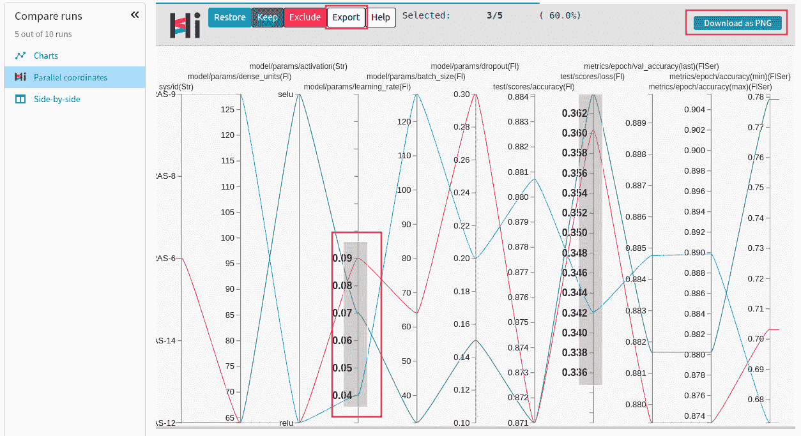
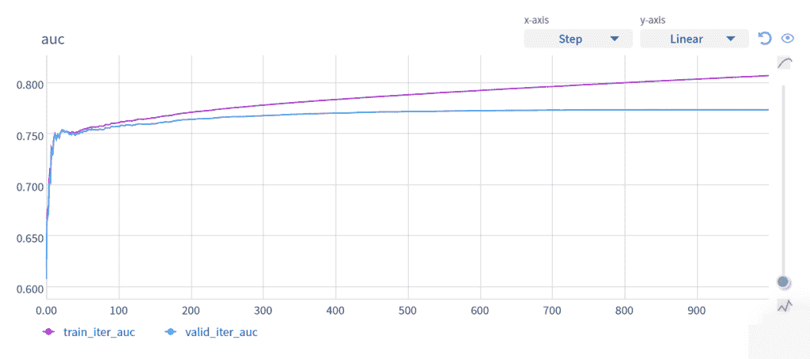
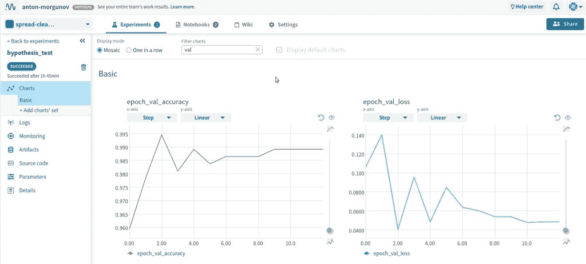
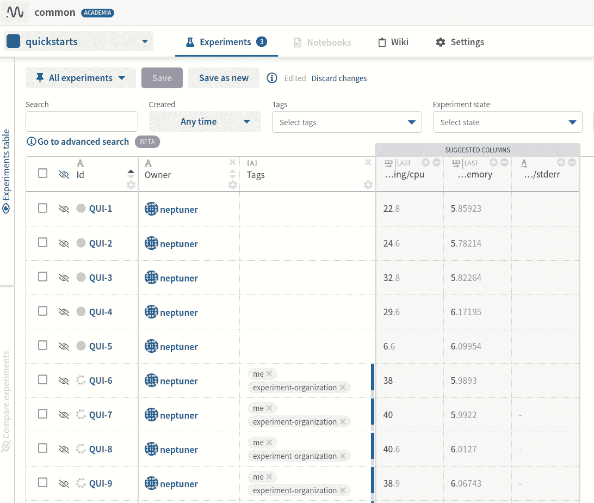

# 如何比较机器学习模型和算法

> 原文：<https://web.archive.org/web/https://neptune.ai/blog/how-to-compare-machine-learning-models-and-algorithms>

机器学习在过去几年里迅速发展。今天，数据科学家和开发人员不再使用简单的、单向的或线性的 ML 管道，而是运行多个并行实验，即使对于大型团队来说，这些实验也可能变得不堪重负。每个实验都应该以一种不变的、可重复的格式记录下来，这就产生了无穷无尽的日志，其中包含了无价的细节。

我们需要通过将机器学习模型与平行实验进行彻底比较来缩小技术范围。使用计划周密的方法对于理解如何选择算法和手头数据的正确组合是必要的。

因此，在本文中，我们将探讨如何比较 ML 模型和算法。

## 模型选择的挑战

每个模型或任何机器学习算法都有几个以不同方式处理数据的特征。通常，根据之前的实验阶段，输入这些算法的数据也是不同的。但是，由于机器学习团队和开发人员通常会记录他们的实验，因此有足够的数据可供比较。

挑战在于理解哪些参数、数据和元数据必须被考虑以达到最终的选择。这是一个经典的悖论，有大量的细节却不清晰。

更具挑战性的是，我们需要了解一个具有高值的参数，比如说一个较高的度量分数，是否实际上意味着该模型比一个具有较低分数的模型更好，或者它是否只是由统计偏差或错误的度量设计引起的。

## 比较机器学习算法的目的

比较机器学习算法本身很重要，但有效地比较各种实验也有一些不那么明显的好处。让我们来看看比较的目标:

模型比较和选择的主要目标肯定是[机器学习软件](https://web.archive.org/web/20221207014354/https://www.g2.com/categories/machine-learning)/解决方案的更好性能。目标是缩小适合数据和业务需求的最佳算法的范围。

如果选择的模型与训练数据紧密耦合，并且无法解释看不见的数据，则高性能可能是短暂的。因此，找到理解底层数据模式的模型也很重要，这样预测才能持久，并且重新训练的需要最小。

当模型被评估并为比较做准备时，微小的细节和元数据被记录下来，这在再训练时会派上用场。例如，如果开发人员可以清楚地追溯选择模型背后的原因，那么模型失败的原因将会立即显现出来，重新训练可以以相同的速度开始。

有了可用的模型细节，就很容易缩小模型的范围，使其能够提供高处理速度和[最佳利用内存资源](https://web.archive.org/web/20221207014354/https://docs.neptune.ai/you-should-know/displaying-metadata#monitoring)。同样在生产过程中，需要几个参数来配置机器学习解决方案。拥有生产级别的数据有助于轻松与生产工程师保持一致。此外，了解不同算法的资源需求，也将更容易检查它们相对于组织分配的资产的合规性和可行性。

## 机器学习算法的参数以及如何比较

让我们深入分析和理解如何比较可用于分类和选择最佳机器学习模型的算法的不同特征。可比参数分为两个高级类别:

*   基于发展，以及
*   基于生产的参数。

### 基于发展的参数

#### 统计测试

在基本层面上，机器学习模型是在多个数据点上高速运行以得出结论的统计方程。因此，对算法进行统计测试对于正确设置算法至关重要，对于了解模型方程是否适合手头的数据集也至关重要。这里有一些流行的统计测试，可以用来为比较奠定基础:

*   **零假设检验:**零假设检验用于确定两个数据样本或指标性能的差异是否具有统计显著性或大致相等，以及是否仅由噪声或巧合引起。
*   **ANOVA:** 方差分析，它类似于线性判别分析，只是它使用一个或多个分类特征和一个连续目标，提供不同组的均值是否相似的统计检验。
*   **卡方:**这是一种统计工具或测试，可用于分类特征组，在频率分布的帮助下评估关联或相关的可能性。
*   **学生 t 检验:**在标准差未知的情况下，比较正态分布不同样本的平均值或均值，以确定差异是否具有统计显著性。
*   **十重交叉验证:**十重交叉验证在不同的数据集上比较每个算法的性能，这些数据集已经配置了相同的随机种子，以保持测试中的一致性。接下来，应该进行假设检验，如学生的配对 t 检验，以验证两个模型之间的指标差异是否具有统计学意义。

下面是如何利用 Neptune 来跟踪假设测试，甚至将它们与吉拉等项目管理工具集成:

#### 模型特征和目标

要为给定的数据集选择最佳的机器学习模型，必须考虑模型的特征或参数。参数和模型目标有助于衡量模型的灵活性、假设和学习风格。

例如，如果比较两个线性回归模型，一个模型可能旨在减少均方误差，而另一个模型可能旨在通过目标函数减少平均绝对误差。为了了解第二个模型是否更适合，我们需要了解数据中的异常值是否会影响结果，或者它们是否不应该影响数据。如果必须考虑异常值或异常值，使用目标函数为平均绝对误差的第二个模型将是正确的选择。

类似地，对于分类，如果考虑两个模型(例如，决策树和随机森林)，那么比较的主要基础将是模型能够达到的概括程度。只有一棵树的决策树模型通过 max_depth 参数减少方差的能力有限，而随机森林将具有通过 max_depth 和 n_estimators 参数进行泛化的扩展能力。

可以考虑模型的其他几个行为特征，如模型做出的假设类型、参数化、速度、学习风格(基于树还是基于非树)等等。

[平行坐标](https://web.archive.org/web/20221207014354/https://docs.neptune.ai/you-should-know/comparing-runs#parallel-coordinates)可用于查看不同的模型参数如何影响指标:

*Parallel coordinates comparison plot | [Source](https://web.archive.org/web/20221207014354/https://docs.neptune.ai/you-should-know/comparing-runs#parallel-coordinates)*

检查[如何使用平行坐标比较](https://web.archive.org/web/20221207014354/https://docs.neptune.ai/you-should-know/comparing-runs#parallel-coordinates)来查看模型参数如何影响度量。

#### 学习曲线

学习曲线有助于确定模型是否处于实现偏差-方差权衡的正确学习轨道上。它还为比较不同的机器学习模型提供了基础——在训练集和验证集上都具有稳定学习曲线的模型可能会在更长的时间内在看不见的数据上表现良好。

**Bias** 是机器学习模型用来使学习过程更容易的假设。**方差**是估计的目标变量将随着训练数据的变化而变化多少的度量。最终目标是将偏差和方差降低到最小——一种很少假设的高稳定性状态。

偏差和方差是间接成正比的，两者达到最小值的唯一途径是在交点处。了解模型是否实现了显著的权衡的一种方法是，查看它在训练和测试数据集之间的性能是否几乎相似。

跟踪模型训练进度的最好方法是使用学习曲线。这些曲线有助于确定超参数的最佳组合，并在模型选择和模型评估中提供大量帮助。通常，学习曲线是一种在 y 轴上跟踪模型性能的学习或改进，在 x 轴上跟踪时间或经验的方法。

两个最受欢迎的学习曲线是:

*   **培训学习曲线**–它有效地绘制了培训过程中随时间变化的评估指标分数，从而有助于跟踪模型在培训过程中的学习或进度。
*   **验证学习曲线**–在该曲线中，评估指标分数相对于验证集的时间绘制。

有时可能会发生这样的情况，训练曲线显示出改进，但是验证曲线显示出不良的性能。这表明模型过度拟合，需要恢复到之前的迭代。换句话说，验证学习曲线确定了模型 ***概括*** 的程度。

因此，在训练学习曲线和验证学习曲线之间有一个折衷，模型选择技术必须依赖于两条曲线的交叉点和最低点。

你可以在这里看到一个学习曲线[的例子:](https://web.archive.org/web/20221207014354/https://ui.neptune.ai/o/neptune-ai/org/credit-default-prediction/e/CRED-93/charts)

*Training and validation learning curves |* [*Source*](https://web.archive.org/web/20221207014354/https://ui.neptune.ai/o/neptune-ai/org/credit-default-prediction/e/CRED-93/charts)

查看[如何使用图表比较](https://web.archive.org/web/20221207014354/https://docs.neptune.ai/you-should-know/comparing-runs#charts)来比较度量或损失的学习曲线。

#### 损失函数和度量

损失函数和度量函数经常混淆。损失函数用于模型优化或模型调整，而度量函数用于模型评估和选择。然而，由于回归精度无法计算，相同的指标用于评估性能以及优化的模型误差。

损失函数作为参数传递给模型，使得模型可以被调整以最小化损失函数。当模型解决了不正确的判断时，损失函数提供了高的惩罚。

**回归的损失函数和度量:**

*   **均方误差:**测量误差或偏差的平方平均值，即估计值和真实值之间的差异。它有助于对异常值施加更高的权重，从而减少过度拟合的问题。
*   **平均绝对误差:**估计值与真实值的绝对差值。与均方误差相比，它降低了离群误差的权重。
*   **平滑绝对误差:**接近真实值的预测的估计值与真实值的绝对差值，异常值(或远离预测值的点)的估计值与真实值差值的平方。本质上是 MSE 和 MAE 的结合。

*Regression loss functions/metrics recorded experiment-wise on* [*neptune.ai*](/web/20221207014354/https://neptune.ai/) *|* [*Source*](https://web.archive.org/web/20221207014354/https://docs.neptune.ai/you-should-know/organizing-and-filtering-runs)

**分类损失函数:**

*   **0-1 损失函数:**这就像统计误分类样本的个数。没什么更多的了。它可以很容易地从混淆矩阵中确定，该矩阵显示了错误分类和正确分类的数量。它旨在惩罚错误分类，并将最小损失分配给正确分类数量最多的解决方案。
*   **铰链损失函数(L2 正则化):**铰链损失用于最大间隔分类，最显著的是用于[支持向量机](https://web.archive.org/web/20221207014354/https://en.wikipedia.org/wiki/Support_vector_machine) (SVMs)。基本上，它测量两个不同类之间的边距的平方距离，以及平行穿过边距两侧的类中最近点的直线。
*   **逻辑损失:**该函数显示出与铰链损失函数相似的收敛速度，由于它是连续的(不同于铰链损失)，可以使用[梯度下降](https://web.archive.org/web/20221207014354/https://en.wikipedia.org/wiki/Gradient_descent)方法。然而，逻辑损失函数不会对任何点分配零惩罚。相反，对具有高置信度的点进行正确分类的函数受到的惩罚较少。这种结构导致逻辑损失函数对数据中的异常值敏感。
*   **交叉熵/对数损失:**衡量分类模型的性能，其输出是 0 到 1 之间的概率值。交叉熵损失随着预测概率偏离实际标签而增加。

还有其他几个损失函数可以用来优化机器学习模型。上面提到的是基本的，为模型设计的发展建立了基础。

**分类标准:**

对于每个分类模型预测，可以构建一个称为混淆矩阵的矩阵，该矩阵展示了正确和错误分类的测试用例的数量。大概是这样的(考虑到 1–正和 0–负是目标类):

| **实际 0** | **实际 1** | **预测 0** |
| 真阴性(TN) | 假阴性(FN) | **预测 1** |
| 假阳性(FP) | 真阳性(TP) | TN:正确分类的阴性病例数 |

*   TP:正确分类的阳性病例数
*   FN:被错误归类为阴性的阳性病例数
*   FP:正确归类为阳性的阴性病例数
*   **精度**

准确性是最简单的度量，可以定义为正确分类的测试用例的数量除以测试用例的总数。

它可以应用于大多数一般问题，但在涉及不平衡数据集时不是很有用。例如，如果我们在银行数据中检测欺诈，欺诈与非欺诈案例的比例可能是 1:99。在这种情况下，如果使用准确性，通过预测所有测试案例为非欺诈，该模型将证明是 99%准确的。

这就是为什么准确性是模型健康的错误指标，对于这种情况，需要一个可以关注欺诈数据点的指标。

**精度**

精度是用于识别分类正确性的度量。

直观上，这个等式是正确的肯定分类与预测的肯定分类总数的比率。分数越大，精度越高，这意味着模型正确分类正类的能力越强。

**回忆**

回忆告诉我们在阳性病例总数中正确识别的阳性病例数。

**F1 得分**

F1 分数是召回率和准确率的调和平均值，因此它平衡了两者的优势。这在召回率和精确度都很重要的情况下很有用——比如识别可能需要修理的飞机部件。在这种情况下，需要精确以节省公司成本(因为飞机零件极其昂贵),需要召回以确保机器稳定且不会对人类生命构成威胁。

**AUC-ROC**

ROC 曲线是真阳性率(回忆)对假阳性率(TN / (TN+FP))的图。AUC-ROC 代表受试者操作特征下的面积，面积越大，模型性能越好。如果曲线在 50%对角线附近，则表明模型随机预测了输出变量。

基于生产的参数

*Metrics and loss plots displayed in [Neptune](/web/20221207014354/https://neptune.ai/) for a particular experiment. Can be tracked for both training and validation sets *| [Source](/web/20221207014354/https://neptune.ai/blog/experiment-tracking-tools-in-project-management-setup)**

### 到目前为止，我们观察到了在开发阶段优先考虑的可比较的模型特性。让我们深入了解一些以生产为中心的特性，它们可以加快生产和处理时间。

时间复杂度

#### 根据用例的不同，选择模型的决策可以主要集中在时间复杂度上。例如，对于实时解决方案，最好避免 K-NN 分类器，因为它在预测时计算新数据点与训练点的距离，这使它成为一种缓慢的算法。然而，对于需要批处理的解决方案来说，预测速度慢并不是一个大问题。

请注意，在给定所选模型的情况下，训练和测试阶段的时间复杂性可能不同。例如，决策树必须在训练期间估计决策点，而在预测期间，模型必须简单地应用在预先决定的决策点已经可用的条件。因此，如果解决方案需要频繁的重新训练，就像在时序解决方案中一样，选择一个在训练和测试期间都有速度的模型将是正确的选择。

空间复杂性

#### 引用上面的 K-NN 的例子，每次模型需要预测时，它都要将整个训练数据加载到内存中来比较距离。如果训练数据相当大，这可能成为公司资源的昂贵消耗，例如为特定解决方案分配的 RAM 或存储空间。RAM 应该始终有足够的空间用于处理和计算功能。加载大量数据会对解决方案的速度和处理能力产生不利影响。

通过 Neptune 的用户友好的仪表板，可以很容易地跟踪不同实验的资源使用情况，这有助于组织 ML 实验:

**线上和线下学习**

*Details of memory displayed for all recorded experiments |* [*Source*](https://web.archive.org/web/20221207014354/https://docs.neptune.ai/how-to-guides/experiment-tracking/organize-ml-experiments)

在线学习是指机器学习解决方案可以即时实时更新新数据，而离线学习需要更多时间，并在更新模型参数的同时从头开始重新学习整个训练集。对于实时解决方案，在线学习是最合适的选择。

**并行处理能力**

并行处理的能力对 K-NN 等耗时算法来说是一个福音，在 K-NN 中，距离计算可以分布在几台机器上。此外，通过分布估计器/树，随机森林模型可以受益于并行处理。然而，对于某些设计为顺序的机器学习模型，如梯度推进，并行处理是不可能的，因为一棵树的结果需要馈送到下一棵树。

最后一个音符

## 不缺乏可比较的技术来衡量不同机器学习模型的有效性。然而，最重要但经常被忽略的要求是跟踪不同的可比参数，以便可以放心地使用结果，并且可以轻松地再现所选管道。

在本文中，我们探索了一些比较机器学习模型的流行方法，但是这些方法的列表要大得多，所以如果您没有为您的项目找到一个好的方法，请继续寻找！

**来源:**

[【2】](/web/20221207014354/https://neptune.ai/blog/machine-learning-project-with-less-data)[【3】](https://web.archive.org/web/20221207014354/https://www.amazon.in/Data-Science-Enterprises-Deployment-beyond/dp/9352673352)——自我引用

[[1]](/web/20221207014354/https://neptune.ai/blog/the-ultimate-guide-to-evaluation-and-selection-of-models-in-machine-learning) [[2]](/web/20221207014354/https://neptune.ai/blog/machine-learning-project-with-less-data) [[3]](https://web.archive.org/web/20221207014354/https://www.amazon.in/Data-Science-Enterprises-Deployment-beyond/dp/9352673352) – Self citations