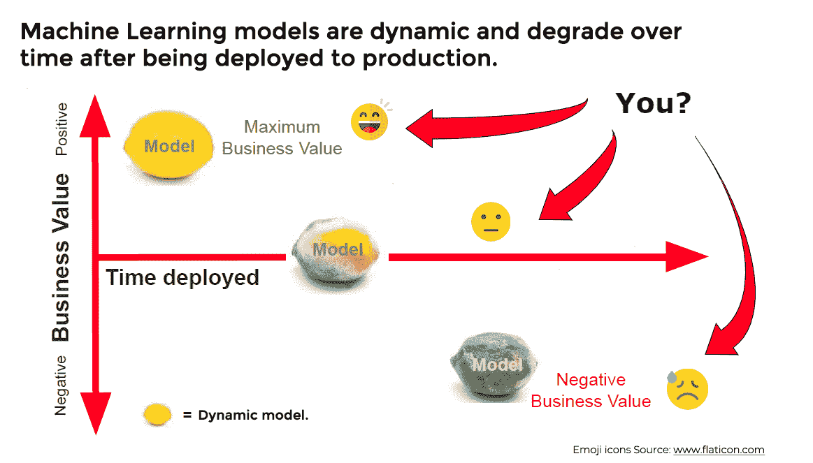
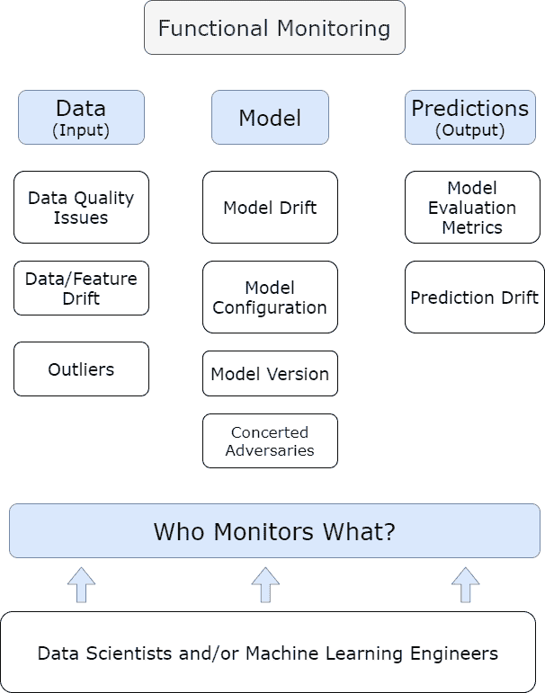
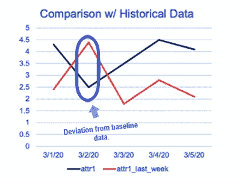
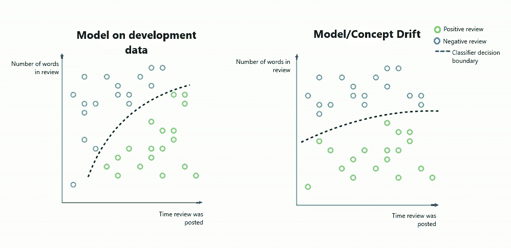
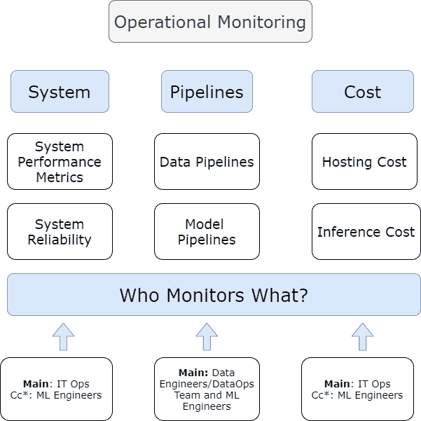
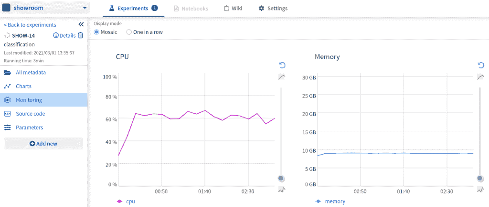
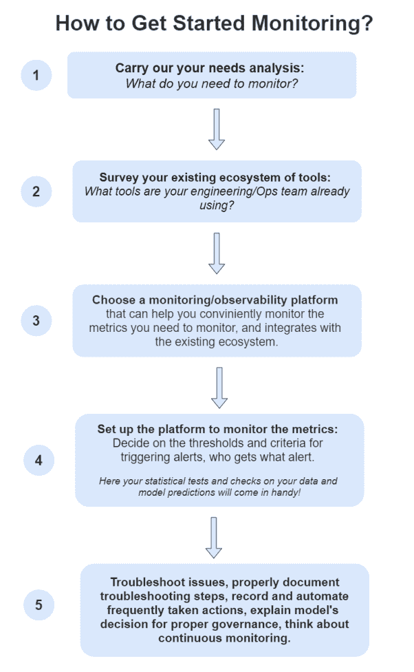
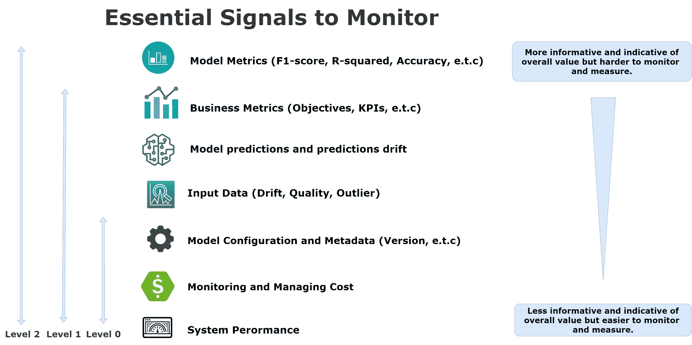
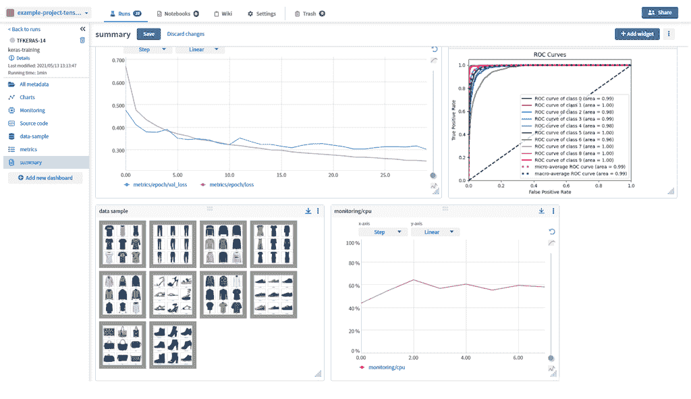
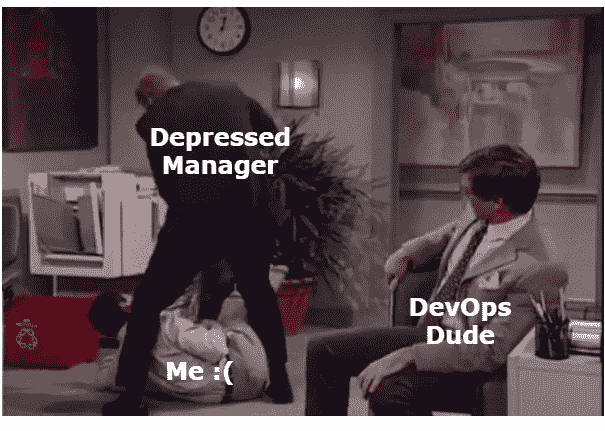

# 关于如何在生产中监控模型的全面指南

> 原文：<https://web.archive.org/web/https://neptune.ai/blog/how-to-monitor-your-models-in-production-guide>

<https://web.archive.org/web/20221228213243im_/https://neptune.ai/wp-content/uploads/model-monitorig-gif.mp4>

*[Source](https://web.archive.org/web/20221228213243/https://gfycat.com/uk/heartfeltconstantkingfisher)* 

*记录暂存*

*定格*

是的，这就是我，因为我们的欺诈检测系统错误地将欺诈交易标记为合法交易，导致公司损失了 50 多万美元，我老板的职业生涯可能就此结束。坐在椅子上的那个人呢？那是我们的 DevOps 工程师。你可能想知道我们是如何来到这里的…

我的故事从一张你可能已经看过 1001 次的图片开始——一个 ML 项目的生命周期。

*Source: Author*

几个月前，经过几个月完善我们的模型，我们终于[投入生产](https://web.archive.org/web/20221228213243/https://stackoverflow.blog/2020/10/12/how-to-put-machine-learning-models-into-production/)。“恭喜你！”我告诉我自己和我的同事，“我们的努力肯定有回报，不是吗？”。兴奋是无法估量的。

我们的模型是实时服务请求并成批返回结果——好东西！这就足够了，对吗？对吗？

不完全是，我们以一种相对戏剧化的方式意识到了这一点。

我不会用那些陈词滥调的理由来烦你，为什么部署工作软件的典型方式在机器学习应用中不奏效。我还在努力从老板留给我的伤痕中恢复过来，最起码我能做的就是帮助你不要像我一样，在“成功的模型部署”后，最终躺在医院的病床上。

**我会告诉你所有关于:**

*   为什么部署不是您的最后一步，
*   为什么你还需要拥有和监控生产中的模型，
*   在生产中应该监控什么以及如何监控，
*   不同的监测和观察平台以及如何选择它们，
*   记录和报警，
*   在生产中监控模型的挑战和最佳实践，
*   还有更多！

**在本文**结束时，您应该确切地知道在部署您的模型之后要做什么，包括如何在生产中监控您的模型，如何发现问题，如何排除故障，以及如何接近您的模型的“生命”,超越监控。

## 祝贺您…但它不会停留在部署阶段

部署后，看看您的传统软件应用程序:

很好，对吧？你几乎不用担心任何事情。基于[软件开发生命周期](https://web.archive.org/web/20221228213243/https://en.wikipedia.org/wiki/Systems_development_life_cycle)，它应该像预期的那样工作，因为你已经严格地测试和部署了它。事实上，当您主要升级以满足新的系统需求或新的业务需求时，您的团队可能会决定定期发布稳定的新版本。

在监控您的应用程序方面，您可能会担心系统指标、错误率、流量、应用程序加载时间、基础设施(服务器数量、负载、CPU/GPU 使用情况)等等。您的应用程序可以扩展到很多用户，它可以按照预期的方式工作，并解决它本来要解决的问题。

那是传统软件。但是现在，进入机器学习的世界:

部署您的模型本身可能就是一件麻烦事。但是现在，谁来管理您部署的内容呢？该软件可能有一个 DevOps 团队来监控和维护生产中的系统，但对于机器学习应用程序，你不能只是将部署的模型交给运营团队——在你的情况下，这必须是一个共同的责任。

*Modified by the author and adapted from the [source](https://web.archive.org/web/20221228213243/https://info.algorithmia.com/hubfs/2020/Webinars/Forrester/Eight-must-haves-slides-final.pdf?hsLang=en-us).*

从上图可以看出，机器学习模型会随着时间退化。他们是动态的，对现实世界中的真实变化非常敏感。

但是模型有点像汽车。一辆新车从经销商处被开出来的那一刻起，其价值就下降了 10%——也就是它们被“部署”到现实世界的那一刻。你的新型号也一样。

从您将模型部署到生产环境的那一刻起，它的性能就开始下降。一个模型在被部署到生产之前处于最佳状态。这就是为什么部署不应该是您的最后一步。

除此之外，还必须有一种方法，让您能够始终如一地向业务利益相关者报告，您部署的机器学习解决方案是否以及如何解决任何问题。

开发期间的验证结果很少能完全证明您的模型在生产中的性能。这是为什么您必须在部署后监控您的模型的一个关键原因——以确保它们保持预期的性能。

还可能存在这样的情况，您部署了本地化到多个地理区域的模型。你如何确保你的模型为每个对自己现实有高度兴趣的客户提供预期的结果(预测)？如何解释为什么一个模型对一个地理区域做出某些预测，而对另一个区域做出不同的预测？

最终，关键的教训是:在部署之后有许多工作要做，你不应该太容易地交付你的模型。部署并不是模型工作的结束，它实际上是开始！

## 为什么您需要在生产中监控您的机器学习模型

如果你已经做到了这一步，我可能已经成功地让你相信模型在生产中的表现比在开发中的表现差。作为数据科学家或机器学习工程师，这是一个你需要意识到的挑战。您将在生产中找到这一挑战的解决方案，这是您在部署后采取下一步行动的地方—监控！

但是**为什么你需要监控你的模型？**

为了回答这个问题，让我们来看看您的模型在生产中会遇到的一些挑战:

|  | 生产挑战 | 关键问题 |
| --- | --- | --- |
|  | 

数据分布变化

 | 

为什么我的特征值会突然变化？

 |
|  | 

生产中的车型所有权

 | 

谁拥有生产中的模型？DevOps 团队？工程师？数据科学家？

 |
|  |  | 

尽管我们在开发过程中进行了严格的测试和验证，为什么该模型在生产中的效果不佳？

 |
|  |  | 

为什么我的模型在生产中表现良好，但随着时间的推移，性能突然下降？

 |
|  |  | 

我如何根据业务目标并向相关利益相关者解释和说明我的模型预测？

 |
|  |  | 

如何保证我的模型安全？我的模型被攻击了吗？

 |
|  |  | 

我如何比较我的模型的新版本和生产版本的结果？

 |
|  |  | 

为什么我的培训管道在执行时会失败？为什么再培训工作需要这么长时间？

 |
|  |  | 

为什么我的预测服务延迟很高？为什么我的不同型号的延迟差别很大？

 |
|  | 

【极端事件(离群值)】

 | 

我如何跟踪我的模型在极端和意外情况下的效果和表现？

 |
|  |  | 

我如何确保生产数据以与培训数据相同的方式进行处理？

 |

这将让您大致了解部署到 prod 后可能遇到的挑战，以及*为什么*您需要在部署后通过监控生产中的模型来继续良好的工作。

本质上，在生产中监控模型的目标是:

*   为了在您的模型和为您的模型服务的系统开始产生负面的商业价值之前检测它们，
*   通过对生产中的模型或支持它们的输入和系统进行分类和故障排除来采取行动，
*   为了确保他们的预测和结果能够得到解释和报告，
*   为了确保模型的预测过程对相关的利益相关者是透明的，
*   最后，提供在生产中维护和改进模型的途径。

让我们说得更具体一些。

## 根据您的模型在生产中可能遇到的挑战监视什么:功能监视与操作监视

您已经部署了您的模型，现在您需要在整个生命周期中观察和检查您的 ML 应用程序在生产中的进度和质量，保持对它的系统审查，以便它继续服务于其预期的价值——这是在生产机器学习系统的背景下进行的监控。

> 你的机器学习应用不仅仅是模型，而是在生产中支持你的模型的一切，包括基础设施、输入数据、资源和其他上游和/或下游服务。

如果您想知道要监控什么，通常应该考虑两件事:

1.  什么会走*右*？
2.  什么可能会出问题？

### 什么是正确的？

想知道什么是正确的，你应该回想一下你的机器学习项目工作流程的规划阶段，在那里你希望围绕用户和业务目标进行规划。

首先，所有可能正确的事情都是为了保证业务目标和用户(人/服务/系统)需求得到满足。

您如何监控和衡量这一点？对于每个业务用例来说，它都是非常独特的，通常取决于:

*   你的企业如何定义成功？在规划阶段设定了哪些 KPI？
*   在部署到生产环境之前，性能预期是什么？
*   如果我的模型向客户返回一个预测，它对结果有什么期望，应该多快交付？

要回答上述问题，您需要一些度量选择标准。对于一个企业来说，成功可能意味着你的模型在整个系统中只扮演了很小的角色。

为了磨练和细化您的指标选择标准，您可以遵循以下一些最佳实践(这要归功于 [Lina Weichbrodt](https://web.archive.org/web/20221228213243/https://medium.com/mlops-community/domain-specific-machine-learning-monitoring-88bc0dd8a212) ):

*   选择一个跨模型的可比指标，
*   简单易懂，
*   可以被实时收集，
*   允许对问题发出可操作的警报。

为了思考成功对一个企业意味着什么，你还必须思考什么是好的用户体验。然后**考虑你的模型如何在整个系统的背景下为良好的用户体验做出贡献——你的模型通常不是 UX 问题的主要解决方案**。

例如，如果我们正在构建一个贷款审批系统，一个好的业务目标可以是:

“快速批准将在规定时间还款的客户贷款”

像这样的目标可能会带来良好的用户体验，但很难监控我们的模型对此有多大贡献。影响客户是否还贷的因素有很多(包括他们对业务的看法、利率等等)。我们无法监控。

因此，一个合适的监控指标可以是:

"模型对客户的请求进行评分并返回预测的速度有多快？"

有这样的约束:

*   我们的模型应该返回 0.6 到 0.7 之间的预测(可能性)分数，作为应该以非常高的利率来减轻风险的贷款，0.71 和 0.90 作为应该以中等利率来的贷款，以及大于 0.91 的分数作为应该以低利率来的贷款。这是因为我们无法获得关于该客户是否会实际付款的实时反馈(作为评估我们模型的基本事实)，所以我们将使用模型的分数作为实时指标进行监控。
*   对客户端请求的成功 HTTP 200 OK 响应。
*   大约 100 毫秒的延迟被认为是良好的响应时间。
*   对于微服务架构中的下游服务，SLA(服务级别协议)超过 95%。

这样，我选择了一个指标:

*   可以在不同的模型之间进行比较，
*   既不太宽泛也不太具体；简单易懂。
*   可以实时收集。
*   允许对生产中可能出现的问题发出可操作的警报。

任何否定上述观点的东西都应该被认为是“糟糕的”用户体验，可以被描述为任何可能出错的东西。在这种情况下，如果模型为贷款请求返回 0.55 的可能性分数，这应该会警告某人(可能是可以查看贷款请求的顾问)或警告不同的系统加载另一个模型进行评分。

现在是有趣的部分——监控可能出错的事情。

### 什么会出错？

您可以在两个层面上监控您的机器学习模型在生产中可能出现的问题:

*   **功能级监控**–监控模型性能、输入(数据)和输出(预测)。
*   **操作级监控**–系统和资源级监控。

### 功能监控

作为一名数据科学家，您主要负责这一级别的监控。您主要是监控与输入相关的模型性能、预测结果以及在生产中学习时模型中发生的情况。

*Source: author*

#### 数据

输入级功能监控在生产中至关重要，因为您的模型会对收到的输入做出反应。如果输入不是您的模型所期望的，它很可能会影响性能。监控和测量输入级挑战是排除功能性能问题并在造成严重损害之前解决这些问题的第一步。

下面是您可能希望在输入级别监控的三种情况。

**1。数据质量问题**

数据质量(完整性)问题主要源于数据管道的变化。为了在数据到达模型之前验证生产数据的完整性，我们必须监控基于数据属性的某些指标。这样，如果输入数据不是我们所期望的或者我们认为模型所期望的，就可以触发一个警报，让数据团队或服务所有者查看。

这里监控的主要目标是在数据被发送到您的模型之前标记任何数据质量问题，无论是来自客户端还是由于不健康的数据管道(这将生成不可靠的预测作为响应)。

数据质量问题的一些可追踪原因是:

***预处理生产数据***

在某些情况下，您的流数据管道将从多个来源接收数据。一个或多个数据源的变化很容易导致管道中数据预处理步骤的中断——GIGO(垃圾输入垃圾输出)。

***更改源数据模式***

在其他情况下，您可能会遇到这样的情况:对数据源中的数据进行了有效的更改，预处理工作正常，但它不是模型所训练的那种输入配置。

例如，模式更改可能是某个数据源的数据库管理员重命名了一个特性列，并添加了另一个列来捕获新数据。虽然这可能会通过预处理步骤进行调整，但对于模型预测来说肯定会很麻烦，因此它很可能会作为预测给出部分响应。模式更改意味着需要更新模型，然后才能映射新特性列和旧特性列之间的关系。

***数据在源头丢失/损坏***

在其他一些情况下，数据管道可能无法从一个源接收数据，因为数据不可用，这可能是由于上游数据源发生了变化，或者数据没有被记录。可能会出现上游数据源损坏或丢失要素的情况。必须监控这些问题，因为它们无疑会影响系统的整体性能。

***数据质量问题检测技术***

编写测试来检测数据质量问题。一些数据质量检查包括:

*   测试输入数据是否重复，
*   测试输入数据的缺失值，
*   捕捉语法错误，
*   捕捉数据类型和格式错误，
*   检查模式在功能名称方面的语义错误，
*   有效的[数据剖析](https://web.archive.org/web/20221228213243/https://en.wikipedia.org/wiki/Data_profiling)针对数据管道中的复杂依赖关系，
*   一般完整性检查；数据是否满足下游服务或消费者的要求？

***检测到数据质量问题后可能的解决方案***

*   在模式更改后提供警报。
*   确保数据所有者实施正确的数据验证实践。
*   确保每个人都意识到自己在将数据传送到管道中的角色，并实现数据所有者之间的有效沟通，以便当数据源发生变化时，模型所有者和其他服务所有者也能意识到。

**2。数据/特征漂移**

监控您的输入可能是功能监控最重要的方面。它可以提前通知您正在解决的业务案例周围不断变化的环境和背景。模型不够聪明，无法适应不断变化的世界，除非它们不断地被重新训练和更新。

数据漂移是指训练数据和生产数据之间的分布发生有意义的变化。随着时间的推移，输入数据分布的变化会影响模型的性能，尽管这一过程比数据质量问题要慢。

虽然可以在整个数据集的级别上监控这种漂移，但通常建议在要素级别上进行监控。

***特性/属性漂移***

在要素级别进行监控通常是检测输入数据问题的最佳方式。在分析阶段，当您寻求对模型性能和行为的解释时，正确理解这一点非常有帮助。

您可以通过检测每个要素值的统计属性随时间的变化来监控要素漂移。这些属性包括标准偏差、平均值、频率等。

由于数据质量问题或现实世界中的一般变化，如商业客户偏好的变化，可能会发生特征漂移。下面是一个特征/属性漂移的例子，其中一组历史属性被用作基线，新的属性被比较，以便检测属性分布的变化。

*Modified by the author and adapted from this [source](https://web.archive.org/web/20221228213243/https://youtu.be/t7vHpA39TXM?t=866).*

通常，对模型性能影响最大的更改是对模型用来“连接各个点”和进行预测的最重要的功能所做的更改。密切监控输入(数据)漂移可以在模型漂移/模型性能出现问题之前提醒您。当数据分布发生变化、要素漂移或输入发生其他问题时，您可以在它们开始降低模型性能之前收到警告。

***数据漂移检测技术***

为了检测数据漂移，通过使用距离度量测量分布变化来执行[分布测试](https://web.archive.org/web/20221228213243/https://itrcweb.org/gsmc-1/Content/GW%20Stats/5%20Methods%20in%20indiv%20Topics/5%206%20Distributional%20Tests.htm):

*   可用于测试历史要素和当前要素之间漂移的基本统计指标有:均值/平均值、标准偏差、最小值和最大值比较以及相关性。
*   对于连续的特征，可以使用散度和距离检验，如[kull back–lei bler 散度](https://web.archive.org/web/20221228213243/https://en.wikipedia.org/wiki/Kullback%E2%80%93Leibler_divergence)、 [Kolmogorov-Smirnov 统计量](https://web.archive.org/web/20221228213243/https://en.wikipedia.org/wiki/Kolmogorov%E2%80%93Smirnov_test)(广泛使用)、种群稳定性指数(PSI)、[、海灵格距离](https://web.archive.org/web/20221228213243/https://en.wikipedia.org/wiki/Hellinger_distance)等等。
*   对于分类特征，[卡方检验](https://web.archive.org/web/20221228213243/https://en.wikipedia.org/wiki/Chi-squared_test)，[熵](https://web.archive.org/web/20221228213243/https://en.wikipedia.org/wiki/Entropy_(information_theory))，特征的基数或频率。
*   一些平台(如 [Fiddler](https://web.archive.org/web/20221228213243/http://fiddler.ai/) )现在正在使用机器学习和其他无监督方法为离群点检测提供开箱即用的监控解决方案。
*   如果特征是巨大的，就像很多数据集的情况一样，你可能想要使用[维度缩减技术](https://web.archive.org/web/20221228213243/https://en.wikipedia.org/wiki/Dimensionality_reduction)(例如 [PCA](https://web.archive.org/web/20221228213243/https://en.wikipedia.org/wiki/Principal_component_analysis) )来修剪它们，然后执行必要的统计测试。

**如果你想了解更多关于这些统计方法的信息**，这份由 Arize AI 撰写的[白皮书提供了关于这些统计检查的概念性的详细信息。](https://web.archive.org/web/20221228213243/https://arize.com/wp-content/uploads/2021/09/Statistical-Distances-for-Machine-Learning.pdf)

幸运的是，大多数 ML 监控平台(在下一节中会有更多)都提供了一些现成的指标，因此您不必自己编写脚本。

***数据漂移检测后可能的解决方案***

*   最合理的解决方案是触发警报并向服务所有者发送通知。您可能希望使用一个编排工具来启动一个包含生产数据的再培训作业，如果分布变化非常大，您可能希望使用新数据构建另一个模型。
*   通常，您的新数据不够大，不足以重新训练您的模型或进行重塑。因此，您可以将您的新数据与历史(训练)数据相结合并进行准备，然后在重新训练过程中，为彼此差异较大的特征分配较高的权重。
*   在其他情况下，您可能很幸运，有足够的新生产数据来完成任务。在这种情况下，您可以继续构建一个挑战者模型，部署它(离线或在线)，并使用[影子测试](https://web.archive.org/web/20221228213243/https://towardsdatascience.com/safely-rolling-out-ml-models-to-production-13e0b8211a2f#60f7)或 [A/B 测试](https://web.archive.org/web/20221228213243/https://towardsdatascience.com/safely-rolling-out-ml-models-to-production-13e0b8211a2f#082e)方法进行测试，以确定它是否比生产中的冠军(当前)模型更好或一样好。

**3。离群值**

监控输入数据中的异常值至关重要，但也非常棘手。您正在监控极端和异常事件，这些事件可能是一次性事件或一组一次性事件。这不可避免地会影响模型性能，因为异常值在整个数据集中没有足够的可学习结构，这将导致模型返回不可靠的响应，因为它不会完全“连接”生产数据中的点。

***离群点检测***

您可能无法设置特定的监视器来检测异常值，但是您可以做的是:

*   使用我们在上一节中讨论的测试来确定特性的值和分布是否*与正常的基准期*有很大不同——非常明显的漂移。
*   对单个事件或少量最近发生的事件执行统计距离测试，以检测非分布问题。
*   分析您的模型最敏感的功能(您的模型在训练后了解到的最重要的功能)是否发生了巨大变化。
*   使用任何合适的分布测试来确定这些要素(异常值)与训练集中的要素有多远。
*   使用无监督学习方法对模型输入和预测进行分类，允许您发现异常示例和预测的群组。一些平台使用 AutoML 来检测您的测试无法捕捉到的异常值。

***离群点检测后可能的解决方案***

*   对子数据集执行数据切片方法，以检查特定预测子类的模型性能。当您的模型使用您的监控工具做出预测并将预测记录到一个[评估存储库](/web/20221228213243/https://neptune.ai/product)时，您可以自动化这个过程。
*   如果根据您的度量标准，您的模型一直表现不佳，您可能需要考虑评估模型的当前状态，然后训练一个新的挑战者模型。
*   记录问题，并跟踪这是季节性异常还是极端的一次性异常，以便您可以制定策略来解决未来的此类问题。
*   如果模型的性能在重新训练后不能提高，或者新模型不能完全达到它，您可能想要考虑模型的性能基准，并且可能有一个人在循环中，在那个时期协助决策过程。

#### 模型

模型是最重要的监控部分，它是整个生产系统的核心。使用您的模型，您可以监控它在生产、组件、版本和安全威胁方面的性能。

**1。监控模型漂移**

当特征和/或标签之间的关系——在监督或无监督学习解决方案的情况下——不再成立时，会发生模型漂移，或[概念漂移](/web/20221228213243/https://neptune.ai/blog/concept-drift-best-practices),因为学习的关系/模式已经随着时间的推移而改变。与基准或业务指标/KPI 相比，随着时间的推移，模型始终返回不可靠和不准确的结果。

一个例子是部署情感分类模型。随着时间的推移，人们对任何话题的情绪都会发生变化。如果你用单词和某些话题训练你的模型关于积极或消极的情绪，一些被标记为积极的情绪可能会随着时间的推移演变为消极的情绪，在我们极度固执己见的社交媒体世界中，你不能排除这种情况。

*Modified and adapted from [source](https://web.archive.org/web/20221228213243/https://www.brighttalk.com/webcast/17563/375776)*

模型漂移的发生是因为现实世界的变化(因此模型被训练来预测的基本事实/目标)——业务问题的答案总是不断变化的。今天适用的东西明天可能不再适用，我们希望在我们的机器学习应用程序中反映这一事实。

模型漂移可以是渐进的，就像商业环境自然变化和发展一样，也可以是突然的，就像极端事件突然中断所有运营一样。

***模型漂移可以以不同的方式发生***

*   **瞬时模型漂移:**当模型性能随时间突然下降时发生。这可能是导致数据质量问题的数据管道中的错误，或者是在新领域中部署的模型，或者是异常事件(如全球危机)。
*   **渐进模式漂移:** *最常见的模式漂移*是动态、不断变化和演进的商业环境的自然结果。随着时间的推移，用户偏好的改变，采用你的产品的客户的新的人口统计数据，或者新引入的特性扭曲了数据中的潜在模式，都可能导致这种情况的发生。
*   **周期性模型漂移:**这是一年中周期性和重复性季节性事件的结果——模式总是已知的，并且可以预测。这些可能是假期和年度折扣。在大多数情况下，用户偏好是季节性的，或者一个型号服务于不同的地区。
*   **临时模型漂移:**这很难通过基于规则的方法来检测，并且通常使用无监督的方法来检测。它的发生是由于奇怪的、一次性的事件，如恶意攻击、用户以非预期的方式使用产品、模型临时服务于新客户或系统性能问题。

***模型漂移检测***

*   您可以使用与数据漂移相同的统计测试来检测模型/概念漂移。
*   随着时间的推移，对模型预测性能的监控(使用评估指标)会减少。通过设置预测指标阈值，您可以确认您的模型是否始终返回不可靠的结果，然后从那里分析**预测漂移**(预测结果随时间的变化)。
*   监控数据漂移可以提醒您是否应该分析模型的退化或漂移。
*   当您可以将基础事实/实际标签与模型预测进行比较以分析趋势和数据的新解释时，监控标签漂移(对于监督学习解决方案，实际标签分布的变化)。

***检测到模型/概念漂移后的可能解决方案***

*   根据您的业务现实，保持对已部署模型的监控和再培训。如果您的业务目标和环境经常变化，您可能需要考虑让您的系统自动化，以便与更稳定的业务相比，以预定义的时间间隔安排和执行再培训(点击了解更多关于再培训的信息)。
*   如果重新训练您的模型不能提高性能，您可能要考虑重新建模或从头重新开发模型。
*   如果你正在从事较大规模的项目，预算充足，成本和性能之间几乎没有权衡(就你的模型赶上动态商业环境的程度而言)，你可能想为你的项目考虑[在线学习算法](https://web.archive.org/web/20221228213243/https://en.wikipedia.org/wiki/Online_machine_learning)。

**2。模型配置和工件**

模型配置文件和工件包含用于构建该模型的所有组件，包括:

*   训练数据集位置和版本，
*   测试数据集位置和版本，
*   使用的超参数，
*   默认特征值，
*   依赖项及其版本；您希望监控依赖关系版本中的变更，以便在依赖关系变更导致模型失败时，能够轻松地找到它们以进行根本原因分析，
*   环境变量，
*   模型类型(分类与回归)，
*   模型作者，
*   目标变量名，
*   从数据中选择特征，
*   测试场景的代码和数据，
*   模型及其预处理的代码。

跟踪配置的相关性，尤其是在针对任何异常情况进行再训练期间模型使用的超参数值。

**3。车型版本**

如果您希望确保部署正确的版本，那么监控生产中的模型版本是至关重要的。

通过将重新训练管道配置为在训练后自动报告模型版本并将元数据记录到元数据存储中，可以监视模型版本。版本历史应该与模型预测一起记录到评估存储中，这样问题将更容易与模型版本联系起来。

阅读如何[将您的模型开发置于控制之下](/web/20221228213243/https://neptune.ai/product/model-registry)——版本、存储、组织和查询模型。

**4。一致的对手**

每个企业都面临安全威胁。随着机器学习应用越来越成为大多数公司的中央决策系统，您必须关注您的模型在生产中的安全性。大多数机器学习模型容易受到[对抗性攻击](https://web.archive.org/web/20221228213243/https://en.wikipedia.org/wiki/Adversarial_machine_learning)。

这在信贷风险和金融机构的机器学习应用中尤为常见，例如，欺诈者可能试图欺骗负责检测可疑信用卡交易的模型。

其他容易受到恶意攻击的应用程序包括:

*   采用人工智能检测假新闻和其他不当内容的媒体公司，
*   处理音频或图像识别的一般应用程序。

协调一致的对手直接来自系统或黑客，他们通过敌对攻击有意利用您的系统。他们用对立的例子误导系统，因此它可以提供不可靠的结果并导致它出错。这种攻击(通常是异常的)代表了您的机器学习应用程序在生产中的特定安全问题，需要进行监控。

***您可以通过*** 来监控您系统的对抗性攻击

*   使用与标记异常事件相同的步骤，因为对抗性威胁不遵循模式，它们是非典型事件。

***检测到一致的对手后可能的解决方案***

有[正在研究](https://web.archive.org/web/20221228213243/https://news.mit.edu/2021/artificial-intelligence-adversarial-0308)能够保护模型免受敌对威胁的方法和算法，但大多数研究仍处于早期阶段。阻止协同对手的解决方案仍然需要在使用预测之前将检测到的异常事件路由给人类管理者。主题专家可以研究这些案例，并使用它们来保护模型免受进一步的威胁。

在关键业务应用中，速度至关重要。专家检测敌对威胁、研究这种威胁、通过重新训练模型来修补漏洞以及重新部署模型的速度可能会对业务产生很大影响。

可信人工智能的[对抗性鲁棒性工具箱(ART)](https://web.archive.org/web/20221228213243/https://github.com/Trusted-AI/adversarial-robustness-toolbox) 值得一试。

#### 预测(输出)

监控生产中的模型输出不仅仅是模型性能的最佳指标，它还告诉我们是否满足业务 KPI。就模型预测而言，最需要监控的是符合业务指标的模型性能。

**模型评估指标**

使用度量来评估模型性能是在生产中监控模型的一个重要部分。这里可以使用不同的度量，比如分类、回归、聚类、强化学习等等。

当您有基础事实/标签来比较您的模型时，我们通常使用预定义的模型评分指标(准确性、AUC、精确度等)来评估模型。

***地面实况/实际标签***

您的基本事实/实际标签是您的模型试图在现实世界中解决的问题的正确解决方案。

一个基本的例子是:

“这个用户会点击这个广告吗？”

如果用户点击广告，那么实际(标签)是肯定的。您的模型预测(如果他们点击了广告或没有点击)和正确的解决方案之间的比较汇总可以让您了解您的模型在生产中的表现。在这种情况下有实时反馈，因为你的系统几乎可以立即判断用户是否点击了广告。比较可能是这样的:

然而，**在大多数情况下，将生产中的实际情况与预测进行比较是一项非常困难的任务**。尤其是如果你没有[专门的专家注释器](https://web.archive.org/web/20221228213243/https://innodata.com/5-questions-to-ask-before-getting-started-with-data-annotation/)来为你记录实际的标签，如果它们不可能实时得到的话。例如，贷款审批系统不会实时给你“正确的解决方案”，因为贷款偿还选项可能需要几个月，甚至几年。这个过程涉及到一个复杂的反馈回路，使我们能够根据现实世界的预期来衡量模型的性能。

有时，您可能会遇到这样的情况，您的基础事实受到模型预测的影响。

例如，如果您构建一个贷款批准模型来预测哪个客户可能会偿还贷款，那么您的模型可能会通过适当地批准将会正确偿还的客户的贷款而表现良好(也就是说，符合基本事实)。但是我们怎么确定它不认可的客户不会还钱给你呢？地面事实可能不是这种模型性能的最合适的事实来源。

***地面真值可用时的评分模型***

衡量模型在生产中的功能性能的最有效方法是监控模型的预测，并将其与现实世界中的真实情况进行比较。

为了实现这一点，模型预测与收集的基本事实一起被记录，以给出关于生产环境中性能的具体想法。下面是一个例子，说明如何建立一个监控系统，从各种来源或[单一来源](https://web.archive.org/web/20221228213243/https://en.wikipedia.org/wiki/Single_source_of_truth)收集地面真相数据:

*Modified by the author and adapted from [source](https://web.archive.org/web/20221228213243/https://www.brighttalk.com/webcast/17563/375776)*

在 1 中，一部分生产数据(输入数据)被传送到地面实况服务，该服务通常涉及由您的系统生成的实时地面实况(例如，当模型预测用户点击广告时，记录用户是否点击了广告)、人工标签注释器或其他数据标签供应商，用于更复杂的任务(例如，确认客户是否在规定的时间偿还了贷款，或者在联系客户后确认交易是欺诈性的还是合法的)。

跟踪预测和模型详细信息的事件 id 用该基本事实事件进行标记，并记录到数据存储中。然后，数据被接收到监控平台中，监控平台根据模型的预测和实际标签计算模型性能指标。

正如您可能已经知道的，分类模型的[指标包括:](/web/20221228213243/https://neptune.ai/blog/evaluation-metrics-binary-classification)

*   准确(性)
*   混乱矩阵，
*   ROC-AUC 评分，
*   精确度和召回分数，
*   f1-得分。

[回归模型](https://web.archive.org/web/20221228213243/https://machinelearningmastery.com/regression-metrics-for-machine-learning/)的指标包括:

*   均方根误差(RMSE)，
*   R 平方和调整的 R 平方度量，
*   平均绝对误差(MAE)，
*   平均绝对百分比误差(MAPE)。

只有当您有了基本事实时，才可能计算上面的模型度量。

***地面实况不可用时的评分模型——预测漂移***

当基本事实不可用或受到损害时怎么办？我们使用预测结果分布作为一个性能代理，因为它已经被设置为符合业务 KPI。

希望您的监控平台以这样一种方式设置，即模型预测也被记录到模型评估存储中。模型评估存储保存模型对每个环境中每个模型版本的每条输入数据的响应(模型决策的签名)。这样，您将能够随着时间的推移监控模型预测，并使用统计指标来比较分布，例如[海灵格距离(HDDDM)](https://web.archive.org/web/20221228213243/https://datascience.stackexchange.com/questions/22725/what-is-hellinger-distance-and-when-to-use-it) 、[库尔巴克-莱布勒散度](https://web.archive.org/web/20221228213243/https://en.wikipedia.org/wiki/Kullback%E2%80%93Leibler_divergence)和[人口稳定指数(PSI)](https://web.archive.org/web/20221228213243/https://towardsdatascience.com/psi-and-csi-top-2-model-monitoring-metrics-924a2540bed8) 。

您可能还需要考虑在生产中监控模型的其他情况。查看[阿帕娜·迪纳卡兰](https://web.archive.org/web/20221228213243/https://arize.com/blog/monitor-your-model-in-production/)撰写的关于监控生产中车型性能的实用剧本。

### 操作级监控

运营和系统级别的监控主要由 IT 运营人员或 DevOps 团队负责。但是，这也是您和运营团队的共同责任。当事情发展到这种程度时，警报通常会转发给运营团队以采取行动，但您也可以选择获得一份副本。

在这个层次上，您主要是监控您的模型在生产中运行的资源，并确保它们是健康的。资源，如管道健康状况、系统性能指标(I/O、磁盘利用率、内存和 CPU 使用率、流量、运营人员通常关心的事情)和成本。

*Cc* means “carbon copy” in the context of who gets an alert. Source: author*

#### 生产中 ML 模型的系统性能监控

在生产中实施机器学习解决方案从根本上来说是一个基础设施问题。监控模型性能和数据而不监控您的 ML 基础设施的性能就像建造沙堡一样——您的基础设施是成功部署和维护机器学习解决方案的基础。

监控您的系统/应用程序性能可以帮助您回答以下问题:

*   该应用程序满足正常运行时间要求吗？
*   它满足请求的速度够快吗？
*   是否高效利用资源，节约成本？
*   代码依赖的变化怎么样，it 能处理吗？
*   它满足可伸缩性要求吗？
*   它的服务局限性是什么？

**系统性能指标**

我们在这里监控的内容受到我们预期我们的模型和数据在利用过程中会面临的挑战的影响。虽然这不是您的主要监控问题，但是您确实需要了解某些指标，这些指标可以指示您的模型在整个应用程序堆栈中的执行情况。如果您的模型在返回预测时有很高的延迟，那肯定会影响系统的整体速度。

要监控的系统/应用程序性能指标将为您提供模型性能的概念，包括:

*   **CPU/GPU 利用率**当模型计算每个 API 调用传入数据的预测时；告诉您您的模型对每个请求消耗了多少。
*   **内存利用率**用于模型缓存数据或输入数据缓存在内存中以获得更快的 I/O 性能。
*   事件/操作导致的**个失败请求**的数量。
*   **API 调用总数**。
*   **模型服务器或预测服务的响应时间**。

下面是一个示例 Neptune 仪表板，它跟踪应用程序的一些值得注意的性能指标:

*Neptune dashboard showing application performance metrics | [Source](https://web.archive.org/web/20221228213243/https://docs.neptune.ai/you-should-know/what-can-you-log-and-display#hardware-consumption)* 

**系统可靠性**

在这里，我们正在监控基础设施和网络正常运行时间。有多少个集群在运行，哪些机器在运行，以及与基础设施相关的一切。您正在监视在任何给定时间启动并运行的集群数量，以及哪个预测服务(如果您有多个预测服务)收到的请求最多。

作为 ML 工程师和数据科学家，这不是我们主要关心的问题，但是难道你不想知道为你的模型提供动力的整个系统的可靠性吗？知道这些也无妨。

#### 管道

监控数据和模型管道的健康状况。不健康的数据管道会影响数据质量，模型管道泄漏或意外变化很容易产生负值。

##### **数据管道**

监控数据管道的健康状况是极其重要的，因为数据质量问题可能是由坏的或不健康的数据管道引起的。这对于您的 IT 运营/开发运维团队来说尤其难以监控，可能需要授权您的数据工程/数据运营团队监控和解决问题。

这也必须是一项共同的责任。与您的 DataOps 团队合作，交流您的模型期望什么，该团队将告诉您他们的数据管道的输出是什么——这可以帮助您收紧您的系统并推动积极的结果。

如果您负责监控您的数据管道，以下是您可能想要跟踪的一些指标和因素:

*   **输入数据**–管道中的数据和文件是否具有适当的结构、模式和完整性？是否有适当的数据验证测试和检查，以便团队可以在摄取的数据中出现异常时得到警告？监控进入数据管道的内容，以保持其健康。
*   **中间工作流程步骤**——[DAG](https://web.archive.org/web/20221228213243/https://en.wikipedia.org/wiki/Directed_acyclic_graph)中的每个任务和流程的输入和输出，在文件数量和文件类型方面是否如预期的那样？一个任务在管道中运行需要多长时间？这可能是数据预处理任务，或者验证任务，或者甚至是数据分布监控任务。
*   **输出数据**–在特征和特征嵌入方面，输出数据模式是否符合机器学习模型的预期？输出文件的典型文件大小是多少？
*   **数据质量指标**–根据流入的数据跟踪统计指标。这可能是数据的基本统计属性，如平均值、标准差、相关性等，或者是距离度量(如 KL 散度、Kolmogorov-Smirnov 统计)。所使用的统计指标将主要取决于预期数据的维度；几个特征或几个特征。
*   作业的计划运行时间、实际运行时间、运行时间以及作业的状态(作业成功还是失败？).

**模型管道**

您想要跟踪在重新培训和重新部署之后，可能导致您的模型在生产中中断的关键因素。这包括:

*   **依赖关系**–您不希望出现这样的情况:您的模型是用 Tensorflow 2.0 构建的，而您团队中的其他人最近对 Tensorflow 2.4 捆绑的依赖关系进行了更新，导致您的部分再培训脚本失败。验证运行模型的每个依赖项的版本，并将其记录为管道元数据，这样导致失败的依赖项更新可以更容易调试。
*   触发再培训作业的实际时间、运行再培训作业花费的时间、作业的资源使用情况以及作业的状态(成功再培训和重新部署模型，还是失败？).

**成本**

你需要留意你和你的组织托管整个机器学习应用的成本，包括数据存储和计算成本、再培训或其他类型的协调工作。这些成本会很快增加，尤其是在没有被跟踪的情况下。另外，你的模型需要计算能力来对每个请求进行预测，所以你还需要跟踪推理成本。

您的应用程序可能托管在云供应商处，如 AWS 或 Google Cloud。这些供应商跟踪您的账单和每项服务的成本，并使您能够设置预算，并在预算已达到上限时发送警报。对于内部部署的系统，监控系统使用和成本可以帮助您分析应用程序的哪个部分成本最高，并查看可以做出(或不做出)哪些妥协。

您可能要考虑监控的另一个指标是应用程序中的服务级别协议(SLA)。预测服务可能与数据管道或查询它的服务有一组 SLA。确保设置阈值，以便在不满足 SLA 时触发警报。

我们已经讨论了许多您可能需要考虑监控的内容，这实在是太多了，不是吗？在下一部分中，您将了解在您当前的 MLOps 成熟度水平下需要监控什么，这将为您提供一个可行的思路，让您知道从哪里开始。

## 侧栏:生产机器学习系统中的监控与可观察性

如果你有 DevOps 背景，你可能知道监视一个系统和观察同一个系统是[两种不同的方法](https://web.archive.org/web/20221228213243/https://dashbird.io/blog/monitoring-vs-observability/)。

可观察性是您查看您一直在监控的指标并对其执行根本原因分析的能力，以了解它们为什么是某种方式，以及它们对您的系统的整体性能构成了什么威胁——所有这些都是为了提高系统质量。

监控几乎是在可观察性之前发生的所有事情:

*   收集绩效指标，
*   追踪他们，
*   检测潜在的问题，
*   提醒正确的用户。

简单来说，你可以监控而不观察，但是不监控就不能观察你的系统的整体性能。监控是收集点，观察是连接它们！

如果你想了解更多关于机器学习生产系统的可观察性和监控，请查看 [Christopher 的文章](https://web.archive.org/web/20221228213243/https://christophergs.com/machine%20learning/2020/03/14/how-to-monitor-machine-learning-models/#monitoring-vs-observability)。

## 如何开始在生产中监控您的机器学习模型

您的下一个任务是在部署模型之后开始监控它们。下面是您应该采取的一步一步方法的直观说明，现在您已经知道为什么需要监控以及需要监控什么。

*Source: author*

### 1.需求分析:根据您的 MLOps 成熟度级别监控什么

不同的用户需要跟踪相对大量的东西，这使得在生产中监控模型成为一个复杂的过程。我们需要工具和平台来简化事情。什么是合适的工具和平台，当我看到一个时，我如何知道？

事情是这样的——ML 监控是一个不断发展的领域。我可以向您保证，没有放之四海而皆准的好工具，只有最适合您特定需求的工具。

列出需求并弄清楚你的前期需求可能会非常棘手，所以我认为在你的 MLOps“成熟阶段”与你见面可能会更简单，正如这篇谷歌云博客文章中所强调的。我还在“将它们整合在一起”一节中用一个插图总结了这一点。

#### 您目前处于 MLOps 成熟度阶段的 0 级

处于这个级别意味着您正在手动训练和部署模型。在这个阶段，您可能甚至还没有想到要监控您的模型，可能只是想办法在测试集上验证您的模型，并将其交给您的 it 运营人员或软件开发人员进行部署。

我知道因为我在那里。正如本文开头所提到的，当我把它交给别人的时候，我庆祝了一番，但是正如你所知道的——几个月后——它确实以眼泪和病床结束了。

为了避免这种情况，我建议你优先考虑最低挂的水果。尽管信息量较少，并且不能帮助您监控模型性能，但它仍然可以作为一个合理的性能代理，告诉您您的一般应用程序是否按预期工作。

当您的工作流仍然处于手动部署阶段时，您不希望花费长时间关注于监控您的模型的指标，或者试图根据业务 KPI 来证明它的性能；当您的 MLOps 系统变得成熟时，这样的指标将变得更容易测量和分析，并且您可以收集基础事实标签或在缺乏基础事实的情况下集成其他性能代理。

#### 您目前处于 MLOps 成熟阶段的第 1 级

处于这一级别意味着您已经自动化了机器学习管道，从而能够基于由标准或定义的阈值设置的触发器来持续训练您的机器学习模型。

在这个阶段，我认为你应该更加关注于监控:

*   用于衡量模型性能的业务指标(参见“什么会变好”一节)——如果它不是很难衡量的话，特别是如果您不能花费它们来获得用于监控模型指标的基本事实的话。
*   生产数据的属性和模型在生产中的性能，以检测模型的陈旧性和退化；可以通过触发器帮助进行持续培训，这些触发器可以自动执行 ML 生产管道，用新的生产数据重新培训模型。
*   您的模型的重新训练过程需要[记录管道元数据](/web/20221228213243/https://neptune.ai/)、模型配置和[模型元数据](/web/20221228213243/https://neptune.ai/)，因为您最有可能手动部署一个重新训练的模型，并且您想要确保您可以在将其重新部署到生产环境之前监控该模型的属性。
*   您还需要监控生产管道的健康状况，因为再培训步骤是自动化的，并且您的数据管道验证和预处理来自一个或多个来源的数据。
*   你还应该开始监控你的持续培训过程产生了多少费用，这样你就不会在某一天醒来时收到你或你的公司没有计划到的巨额 AWS 账单。

#### 您目前处于 MLOps 成熟阶段的第 2 级

处于这一级别表明您的 MLOps 实施已经完全成熟，几乎整个管道都是一个[健壮的自动化 CI/CD 系统](https://web.archive.org/web/20221228213243/https://cloud.google.com/architecture/mlops-continuous-delivery-and-automation-pipelines-in-machine-learning#mlops_level_2_cicd_pipeline_automation)。您的培训、验证和部署阶段都是在一个互补的反馈循环中自动完成的。

在这个阶段，你应该监控所有的事情，但是你的团队应该关注更多信息的度量，确保所有相关的涉众在花费更多时间在最少信息的度量上之前，能够获得更多信息的度量。

#### 将他们聚集在一起…

以下是我认为您应该根据您的 MLOps 工作流的成熟度重点监控的可视化说明。

*Original concept [here](https://web.archive.org/web/20221228213243/https://fullstackdeeplearning.com/spring2021/lecture-11/). Source: author*

虽然这不是一个硬性的规则，可能需要你的团队集思广益才能弄清楚，但我认为你应该问一些问题:

*   我们希望从 MLOps 监控平台或工具中获得什么？
*   此时对我们来说最重要的指标是什么？
*   你想得到什么样的见解？这些见解是否与提高我们整个应用程序的性能直接一致，以确保持续的积极业务价值？
*   为了得到 80%的结果，我们现在付出 20%的努力能得到什么？在这种情况下，80%是正的商业价值。
*   我们现有的工具生态系统是什么？我们有专门的 ITOps/DevOps 工程师团队吗？
*   MLOps 监控解决方案与现有软件部署生态系统集成的难易程度如何？

通常，这些很难一次想清楚，但是必须要做，并且不断地重新评估。我想你会从这个问题开始:“我们现在付出 20%的努力能得到 80%的结果吗？”。

一旦你可以和你的团队一起有效地记录上述问题的答案，跟踪必要的指标就足够困难了——你应该从一个简单的解决方案开始。或者至少是一个解决方案，帮助您使用更少的工具来监控最重要的指标。然后，当您了解工具和您的需求时，您可以迭代，如果您需要，添加更丰富的工具，并知道如何使用它们。

### 调查现有的工具生态系统

根据您的 MLOps 成熟度，您知道要监控什么。如果可能的话，您可能希望在您的组织中调查您的运营/工程团队用来监控部署的应用程序的现有工具。

例如，您可能在一个组织中，您的运营团队已经使用 [Prometheus 和 Grafana](https://web.archive.org/web/20221228213243/https://prometheus.io/docs/visualization/grafana/) 来监控系统性能和其他指标。这对您来说可能是个好消息，因为您可能不必太担心寻找平台，您只需设置和定义您的指标，和/或为您的模型和数据编写测试用例。

不管怎样，这种情况很少发生。通常，您可能需要着手寻找一个平台，该平台可以根据您的需求分析来帮助您监控所需的指标。

请务必调查您的公司，了解工程和运营文化(如果您有运营团队，请与他们交谈！)、工具和可能的生态系统集成，然后再开始寻找适合您需求的平台。

### 选择监控/观察平台

选择一个可观察性平台是非常棘手的，你必须做好它。有很多成本、数据安全问题和其他挑战。

幸运的是，这可以通过以下方式简化:

*   理解您的监控需求，您可能已经在本文的这一点上做到了。
*   知道你能得到什么；实地调查你的组织和预算。有些平台可能非常昂贵，但有一些你不需要的功能，也有一些开源的解决方案。
*   考虑到 ML 应该具备的必备素质和可观测平台。

#### 选择监控/可观察性平台之前需要考虑的事项

目前，长期以来用于监控和观察生产中软件的[原则正被用于监控生产中的数据和机器学习模型。](https://web.archive.org/web/20221228213243/https://newrelic.com/blog/best-practices/principles-of-observability-modern-software-development)

有些平台最适合在生产中监测和观察数据质量(如[蒙特卡洛](https://web.archive.org/web/20221228213243/https://www.montecarlodata.com/)和[阿诺马洛](https://web.archive.org/web/20221228213243/https://www.anomalo.com/))，而其他平台(如 [superwise.ai](https://web.archive.org/web/20221228213243/https://www.superwise.ai/) 和[阿里泽 AI](https://web.archive.org/web/20221228213243/https://arize.com/) )则是通用(生产)机器学习可观测性平台。

*Arize AI* *monitoring platform | [Source](https://web.archive.org/web/20221228213243/https://arize.com/)*

如果您想要一个用于您的实验和培训流程的模型监控解决方案，以及一个用于您的 MLOps 工作流的一体化元数据数据存储，您应该查看 Neptune.ai。它可以免费使用并且您可以在这里的[实时沙盒中试用。](https://web.archive.org/web/20221228213243/https://app.neptune.ai/o/common/org/example-project-tensorflow-keras/experiments?split=tbl&dash=charts&viewId=44675986-88f9-4182-843f-49b9cfa48599)

*Customized dashboard in Neptune*

您的 ML 监控/观察平台应该:

*   **简单直观地使用**，可由个人服务所有者(您！)而不是中央运营团队；把一个模型投入生产已经够难了，不要给自己添堵。
*   **拥有现成的指标**，为您注册的模型提供智能默认指标。
*   **开箱即用且灵活的集成**:确保平台能够通过 DB(数据库)连接器、API、文件传输将您的生产数据与其系统集成，并且通常能够集成来自任何数据源的数据(无论是批处理还是流数据)。
*   **拥有现成的可视化和仪表板**:提供智能预填充的仪表板和图形，可视化您的指标。您还应该能够添加新面板，使用必要的信息创建可视化效果，并根据您的需要创建自定义查询。
*   **灵活访问:**一些平台为您提供编程访问和通过管理控制台或用户界面的访问。
*   **可定制:**您应该能够定义您的度量标准，编写您的测试案例和检查，创建定制的仪表板和可视化，定制的检查和插件，设置定制的阈值，并且通常设置定制的集成和工作流。
*   协作:这不是你可能见过的那种单人工作。您应该能够与相关的利益相关者和服务所有者广泛共享数据、仪表板和报告。该平台应该能够根据我们的模型预测，为每个相关的利益相关者提供关于他们如何才能最好地继续提供积极商业价值的见解和警报。
*   **具有模型可解释性特征:**一些工具可以通过使用像数据切片这样的方法对特定的部分进行测试来帮助你解释模型决策。
*   **能够测试模型预测，以检测偏见和威胁**(例如，对抗性攻击)。
*   **与环境和语言无关:**无论您在构建模型时使用了什么技术，或者它在生产环境中运行于什么环境，您都希望平台能够正常工作。
*   **可扩展**到其他平台，并轻松与现有组织生态系统集成。
*   **能够自动检测异常值:**平台开始使用自动和无监督的方法来检测输入数据中的异常。
*   **拥有云和/或本地部署解决方案:**大多数平台提供基于 SaaS 的服务或本地解决方案。更妙的是，有些两者都有！
*   **成为生产级:**生产是一个非常辛苦的地方，尤其是模特。您不希望出现这样的情况:您选择的平台跟不上每秒进行数千甚至数百万次预测的监控模型——本质上，要考虑平台的可扩展性。
*   **粒度观点:**平台/工具应该能够为您提供数据和模型性能的粒度视图。比如说；使用此工具，您能否深入生产数据中的每个要素，以检测要素级别的问题和偏差？您能监控每秒、每小时、每天、每月甚至每年的指标(或指标的集合)吗？这将确保灵活性，不管您正在监控的用例是实时的还是批处理的。
*   **执行日志审计:**审计来自模型、数据、管道和其他系统日志的日志，用于适当的审计和沿袭可追溯性。

如您所见，选择一种工具需要全面的分析。下面是我见过的一些工具，可以勾选上面的所有或大部分选项。如果您想了解更多关于您可以选择的一些工具和部署平台的信息，[Ori Cohen 博士](https://web.archive.org/web/20221228213243/https://www.linkedin.com/in/cohenori/)已经在[这篇文章](https://web.archive.org/web/20221228213243/https://towardsdatascience.com/monitor-stop-being-a-blind-data-scientist-ac915286075f#0162)中解释了其中的大部分，我建议您看一看它们:

## 在生产中监控机器学习系统时，您可能会遇到的其他挑战

### 投入层面的监测挑战

在生产中监控输入数据时，您可能会遇到一些挑战，包括:

1.  **您生产中的数据源可能是分散且不可靠的**，因此，根据您的数据架构，将它们统一到一个真实的数据源或数据网格中可能会非常困难。
2.  **您没有明确的数据需求**，不知道数据结构和模式应该是什么，也不知道上游数据源可接受的服务水平协议(SLA)是什么。
3.  **您的数据源没有定义所有权**，这可能会导致团队之间跨职能的沟通不畅，特别是如果有人对数据源进行了更新(比如对数据库的模式更改)而没有通知其他人。
4.  **您的生产数据工作流程的元数据无法被发现**，因此，跟踪数据传承变得非常困难。也记录事件；您不知道相关数据的生产者和消费者，这使得跟踪、故障排除和维护变得困难。

有些挑战不仅仅是建筑上的，也可能是文化上的。如果数据是产品，那么:

*   人们拥有“产品”(在这种情况下，我们的数据！)并被分配特定的角色，
*   团队成员相互交流他们数据源的状态，
*   他们通过元数据记录来记录它们，
*   每个人都能看到数据被有效地访问和利用，这对解决文化问题大有帮助。

如果你很好奇，你可以在这里了解更多关于“数据作为产品”的想法[。](https://web.archive.org/web/20221228213243/https://martinfowler.com/articles/data-monolith-to-mesh.html)

### 监控模型质量时的一些挑战

在生产中监控输入数据时，您可能会遇到一些挑战，包括:

*   [地面实况可用性](https://web.archive.org/web/20221228213243/https://arize.com/blog/monitor-your-model-in-production/)；您很可能会遇到这样的情况，即您没有实时的基础事实收集，并且可能不得不依赖上游系统甚至人工注释器来收集实际的标签。
*   源于算法偏差或数据集偏差或两者兼有的模型偏差。
*   [黑盒模型](https://web.archive.org/web/20221228213243/https://hdsr.mitpress.mit.edu/pub/f9kuryi8/release/6)预测无法解释，可能导致合规问题。
*   不跟踪生产中的模型元数据以实现沿袭可追溯性。当你使用 Neptune.ai 这样的元数据存储时，这并不是一个问题——在这里了解更多。

您可以使用的解决方案是执行数据切片来分析模型预测的各个部分并测试偏差。一些工具可以自动为您完成这项工作。数据集特有的一些偏差也可以通过生产数据验证测试案例[预防和/或消除](https://web.archive.org/web/20221228213243/https://towardsdatascience.com/5-types-of-bias-how-to-eliminate-them-in-your-machine-learning-project-75959af9d3a0)。模型特有的偏差可以通过模型元数据和/或度量来检测。

**PRO-TIP** :你可能也想看看谷歌新的[基于网络的数据探索工具 Know Your Data](https://web.archive.org/web/20221228213243/https://knowyourdata.withgoogle.com/) ，据他们称，该工具有助于研究人员、工程师、产品团队和决策者理解数据集，以提高数据质量，并帮助缓解公平性和偏见问题。

## 在生产中监控机器学习模型的最佳实践

在这一点上应该很清楚，除了将您的模型部署到生产中，还有很多工作要做。

这将帮助您了解您的模型是否按预期执行并解决了问题，或者它是否需要重新培训，是否部署了挑战者模型，或者您是否需要重新定义良好的业务绩效。下面是我推荐你开始的一些最佳实践。

### 一般监控最佳实践

*   **以人为本**。如果您在组织中建立了一种将数据视为产品的文化，人们很可能会倾向于获得产品的所有权，以确保它端到端地服务于其预期目的。你可以从 [DevOps 文化变迁](https://web.archive.org/web/20221228213243/https://devops.com/10-top-tips-devops-cultural-change/)中学到很多。
*   如果可能的话，**不要把应用的“监控权”交给一个人**。如果你有一个由数据专业人员和运营工程师组成的跨职能团队，让每个人都处理好自己的服务，并进行有效的沟通。这将有助于分散知识和技能，当用例扩展时，没有人会不知所措。
*   **采取精益方法**；使用太多的工具会很麻烦。集中你的工具，但是分散团队；每个人都处于任务的顶端。
*   监控不是在部署后开始，而是在您开始试验时开始。从模型开发阶段就开始建立监控文化(监控模型实验度量、日志等等)。
*   当你遇到任何关键的决策点时，总是考虑什么对你的团队的生产力是最佳的。
*   鼓励您的团队正确记录他们的故障排除框架，并为[有效的模型维护](/web/20221228213243/https://neptune.ai/blog/machine-learning-model-management)创建一个从警报到行动再到故障排除的框架。

### 数据监控的最佳实践

*   批处理和流数据应该以相同的方式处理，使用相同的管道，这样数据管道的问题可以更加直观地进行故障排除。
*   请确保您不只是检查整个数据集的漂移，而是逐渐查看要素漂移，因为这可以提供更多见解。
*   投资一个全球[数据目录](https://web.archive.org/web/20221228213243/https://dbmstools.com/categories/data-catalogs)，它可以帮助记录每个用户(您的数据和 ML 团队)都可以依赖的高质量元数据；它将帮助您应对流式传输和保持可靠数据质量的挑战。这也将使血统跟踪更容易。
*   在将您的模型投入生产以建立基准性能之前，对您的评估集执行[预发布验证](https://web.archive.org/web/20221228213243/https://arize.com/blog/what-is-ml-observability/)。

### 模型监控的最佳实践

*   随着时间的推移，模型性能将不可避免地下降，但是要小心性能的**大幅下降**,这通常表明有问题——您可以选择自动检测这一点的工具。
*   对挑战者模型和冠军模型进行[影子部署和测试](https://web.archive.org/web/20221228213243/https://christophergs.com/machine%20learning/2019/03/30/deploying-machine-learning-applications-in-shadow-mode/#how)并记录预测，以便在生产中跟踪新模型和当前模型的性能；在你决定部署新训练的(挑战者)模型之前。
*   您可以使用一个[元数据存储库](/web/20221228213243/https://neptune.ai/product)(比如 Neptune.ai)来存储已经版本化并在生产中重新训练的模型的超参数；这改进了审计、合规性、沿袭可追溯性和故障排除。

### 监控预测/输出的最佳实践

*   预测漂移可以作为模型度量的一个很好的性能代理，特别是当地面实况不可收集时，但是它不应该被用作唯一的度量。
*   跟踪模型中不合理的输出。例如，您的分类模型预测了一组具有高置信度得分的输入的错误类，或者您的回归模型预测了一组给定要素的负得分(当基本度量得分应为 0 时)。

## 侧栏:以正确的方式设置提醒

警报是监控的重要组成部分。如果您跟踪您的度量标准，但是当出现问题时没有得到通知，为什么还要跟踪它们呢？当出现问题时，您肯定希望得到通知。

不可避免地，不同优先级的不同事情会出错。你怎样把小麦和谷壳分开？一些工具提供了开箱即用的智能警报功能，但通常情况下，它会根据应用程序归结为对特定业务有意义的内容。

### 以正确的方式设置警报

我从欧内斯特·穆勒和 T2·徐伟贤·卡拉扬诺夫在他们 T4 的 DevOps 课程中得到的最好的建议是:

1.  **在警报投入生产之前对其进行测试**

例如，在数据漂移的情况下，编写测试用例来模拟您用来监控开发(验证)数据集和您正在模拟的生产数据之间的分布变化的统计指标。一些平台(如 [Domino](https://web.archive.org/web/20221228213243/https://www.dominodatalab.com/) )会自动为您应用这些统计检查，因此您所要做的就是注册您的开发数据并集成您用于模拟的生产数据。选择特定的统计检查并设置阈值。

*Image modified by the author and adapted from this [source](https://web.archive.org/web/20221228213243/https://www.brighttalk.com/webcast/17563/375776).*

2.  监控需求分析中得出的主要指标。
3.  **就警报媒体达成一致，这样每个服务负责人都会对他们的媒体感到满意。**懈怠？[传呼机](https://web.archive.org/web/20221228213243/https://www.pagerduty.com/)？[信息辐射器](https://web.archive.org/web/20221228213243/http://scrumbook.org/value-stream/information-radiator.html)？其他团队聊天？电子邮件？
4.  **通过包含描述性信息和主要服务所有者的操作，向警报发送上下文。**
5.  **确保建立一个反馈回路，让你的监控更好**。在数据漂移因超过设定的阈值而触发警报的情况下，如果数据被自动记录，您可能希望使用类似 [Apache Airflow](https://web.archive.org/web/20221228213243/https://airflow.apache.org/) 的管道编排工具来启动再培训。或者，团队可能不得不手动对新数据进行再培训，或者根据新数据彻底改造问题。

### 警报的最佳实践

*   确保您和您的团队清楚谁收到了什么警报。如果可能，数据质量警报应主要发送给数据运营/数据工程团队，模型质量警报发送给 ML 团队或数据科学家，系统性能警报发送给 IT 运营团队。
*   仅当您知道存在需要干预的情况时，才设置警报。例如，为数据质量设置一个商定阈值，仅当不满足阈值条件时才触发警报。
*   了解什么会对业务产生真正的影响，并仅对那些人发出警报，而不仅仅是应用程序出现的任何问题。
*   让团队描述他们收到的警报(无论是误报、漏报还是真报)，记录他们采取的行动以及结果。
*   本质上，你想避免“警报地狱”；一系列不相关的警报可能会让您在噪音中迷失真正的、影响业务的警报。

最好的工具也将帮助您正确地管理您的警报，所以请留意这个功能！

## 侧边栏:为什么你应该记录一切！

如果我告诉你，只要知道火源在哪里，你就可以用生产中的机器学习应用程序来节省大量灭火时间，你会怎么样？

回车—日志记录！在大多数情况下，日志监视可以让您在解决生产中整个系统的任何组件的问题时有一个很好的开端。

### 那么你为什么要记录呢？

很简单——因为你要确保在紧要关头能轻松灭火，识别火源，并采取措施防止未来进一步的火灾爆发。

用机器学习的话来解释——你记录日志是因为你希望能够通过快速识别原因或潜在原因来有效地解决问题，采取必要的措施来解决这些问题，并修补你系统中的漏洞(或至少保持检查)。

还有一件事，你日志审计和合规！能够记录您的数据和模型事件将有助于创建[数据和模型谱系](https://web.archive.org/web/20221228213243/https://en.wikipedia.org/wiki/Data_lineage),相关的利益相关者可以对其进行跟踪和审计，以符合要求和标准。

### 那么你应该记录什么呢？

虽然记录系统中每个组件的每个活动很有趣(从数据到模型到应用程序和其他一切)，但数量总是会成为一个问题。就卷而言，我指的是将用于托管和处理该过程中生成的日志文件的存储和资源。

对你记录的东西要非常有策略。您可能没有预算来记录系统每个组件的每个活动。您应该只记录真正的问题，而不是所有的问题。从本质上讲，您记录的内容应该对您的应用程序所提供的商业价值有一定的影响。

*Meme modified by the author from this [source](https://web.archive.org/web/20221228213243/https://imgflip.com/i/5asvqk)*

您应该记录的数据和模型组件的一些对象包括:

*   数据管道事件，
*   生产数据(如有可能，包括旁边的元数据)，
*   [模型元数据](/web/20221228213243/https://neptune.ai/blog/ml-metadata-store)；这包括型号版本和配置细节，
*   来自模型的预测结果，
*   影子测试的预测结果(挑战者模型)；如果适用于您的系统，
*   地面实况标签(如果有的话)，
*   一般操作性能(标准监控系统的典型性能)。

最需要注意的是密切关注成交量。记录的文件可以增长到千兆字节，并需要资源来托管和解析，所以您需要确保它包含在您开始时设定的预算中。

此外，还要考虑哪项成本更高—监管机构因无法审核您的系统的合规性要求而收取的费用，或者记录必要对象所需的存储量和资源。

一些有用的测井工具包括 [Neptune.ai](/web/20221228213243/https://neptune.ai/) 、 [New Relic](https://web.archive.org/web/20221228213243/https://newrelic.com/) 、 [Honeycomb.io](https://web.archive.org/web/20221228213243/https://www.honeycomb.io/) 和 [Datadog](https://web.archive.org/web/20221228213243/https://www.datadoghq.com/) 。

### 日志记录的最佳实践

*   对于您的管道，您应该记录从计划时间到开始时间、结束时间、作业失败错误、运行次数的运行情况；这一切都是为了让不健康的管道更容易排除故障。
*   对于您的模型，您应该记录预测以及基础事实(如果可用)、预测的唯一标识符(prediction_id)、预测调用的详细信息、模型元数据(版本、名称、超参数、签名)、模型部署到生产的时间。
*   对于您的应用程序，您应该记录 champion 模型在生产中服务的请求数量，以及每次服务的平均延迟。
*   对于您的数据，记录成功运行的每个管道的每个预处理数据的版本，以便它们可以满足审计要求，并且可以跟踪它们的沿袭。
*   为了存储日志的结构，可以考虑使用带有实际结构的 JSON 格式，这样就可以很容易地解析和搜索它们。
*   考虑轮换日志文件以便更好地管理；删除旧的和不必要的日志，因为审计或其他原因，您确定不再需要这些日志。
*   根据欧内斯特·穆勒(Ernest Mueller)的说法，最好的日志是格式化的，具有良好的时间戳和严重性级别，并为用户提供大量的上下文。

## 哦！它也不止于监视吗？🙁

您将您的模型部署到生产中是有原因的，并且您在那里持续地监控它是有原因的——以继续提供积极的商业价值。

你知道什么是负商业价值吗？当监管者或你的客户要求知道你的系统如何做出决策，而你无法提供时，你会被取消，客户流失，或者更糟，你会被监管者处以巨额罚款(只需[问高盛](https://web.archive.org/web/20221228213243/https://www.ai-cio.com/news/uk-regulators-fine-goldman-sachs-international-126-million-1mdb-failures/)！).

或者当您的推荐系统连续 30 天向所有用户提供相同的推荐时(这里是真实事件)。

为了实现真正完整的监控，您需要:

*   持续管理生产中的模型，以确保它不会向负业务价值倾斜，
*   确保模型的决策过程可以被治理、审计和解释。

这里有一个[很棒的教程](/web/20221228213243/https://neptune.ai/blog/machine-learning-model-management)来学习更多关于生产中的模型管理。

## 通过实时沙盒变得实用

我们已经在本文中介绍了许多实用概念，现在是时候通过检验、使用和/或配置您自己的监控解决方案来充分利用这些概念了。

1.  **使用 SaaS 解决方案尝试 ML 监控:** Whylabs.ai 提供了一个漂亮的[实时沙箱](https://web.archive.org/web/20221228213243/https://try.whylabsapp.com/models)您可以使用它来检查来自数据漂移、跟踪模型性能、查看数据质量问题警报等事件的监控指标。

2.  尝试托管您的解决方案:如果您想使用开源解决方案， [Prometheus + Grafana](https://web.archive.org/web/20221228213243/https://prometheus.io/docs/visualization/grafana) 可能是您的最佳选择！这里有一个[很好的实用教程](https://web.archive.org/web/20221228213243/https://www.jeremyjordan.me/ml-monitoring/)，教你如何用 Prometheus 和 Grafana 监控你的集装箱化服务模型(使用 [FastAPI](https://web.archive.org/web/20221228213243/https://fastapi.tiangolo.com/) )。
3.  如果你想**实际了解**一家公司如何实现机器学习监控和可观察性，你可以在这里查看 [DoorDash 的伟大文章](https://web.archive.org/web/20221228213243/https://doordash.engineering/2021/05/20/monitor-machine-learning-model-drift/)。

## 结论

没错。监控是我没有做的事情，这就是我如何结束了与 DevOps 家伙试图不卷入所有的疯狂。

*Meme modified by the author from this [source](https://web.archive.org/web/20221228213243/https://gfycat.com/uk/heartfeltconstantkingfisher).*

我希望你获得了一些有用的技巧，关于如何在生产中监控你的机器学习模型——不要像我一样结束！我希望您能够理解为什么部署永远不是最后一步，并且您现在已经足够清楚在生产中监控您的模型应该从哪里开始。

在这篇文章的结尾，我想给出前面章节中的挑战的解决方案:

|  | 生产挑战 | 关键问题 | 解决方法 |
| --- | --- | --- | --- |
|  | 

数据分布变化

 | 

为什么我的特征值会突然变化？

 | 

使用统计检查来检测数据漂移

 |
|  | 

生产中的车型所有权

 | 

谁拥有生产中的模型？DevOps 团队？工程师？数据科学家？

 | 

生产中的模型所有权是共同的责任

 |
|  |  | 

尽管我们在开发过程中进行了严格的测试和验证，为什么该模型在生产中的效果不佳？

 | 

确保您的生产数据与您的培训数据没有太大的不同，并且您的生产数据和培训数据以相同的方式处理。

 |
|  |  | 

为什么我的模型在生产中表现良好，但随着时间的推移，性能突然下降？

 | 

根据新数据重新训练模型或根据新数据开发另一个模型，如果前者不起作用的话。

 |
|  |  | 

我如何根据业务目标并向相关利益相关者解释和说明我的模型预测？

 | 

查看模型预测的可解释部分。

 |
|  |  | 

如何保证我的模型安全？我的模型被攻击了吗？

 | 

使用无监督学习方法进行离群点检测，包括统计检查，保护您的系统免受安全威胁。

 |
|  |  | 

我如何比较我的模型的新版本和生产版本的结果？

 | 

使用影子测试来测试挑战者(新培训的)模型与冠军模型(当前正在生产的模型。

 |
|  |  | 

为什么我的培训管道在执行时会失败？为什么再培训工作需要这么长时间？

 | 

使用日志来审计错误和警报，以通知服务所有者。

 |
|  |  | 

为什么我的预测服务延迟很高？为什么我的不同型号的延迟差别很大？

 | 

使用日志来审核不符合所需 SLA 的各种服务。

 |
|  | 

【极端事件(离群值)】

 | 

我如何跟踪我的模型在极端和意外情况下的效果和表现？

 | 

理解它是采取行动前的一个瞬间或暂时的漂移。

 |
|  |  | 

我如何确保生产数据以与培训数据相同的方式进行处理？

 | 

编写数据完整性测试并执行数据质量检查。

 |

快乐监控！

关于生产中 ML 监控的参考资料和其他资源

## References and other resources on ML monitoring in production