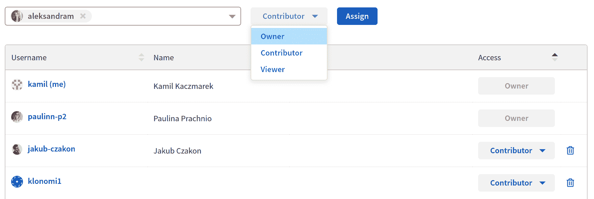

# 如何组织深度学习项目——最佳实践范例

> 原文：<https://web.archive.org/web/https://neptune.ai/blog/how-to-organize-deep-learning-projects-best-practices>

一个成功的深度学习项目，你需要很多迭代，很多时间，很多努力。为了让这个过程不那么痛苦，你应该尽量利用你的资源。

一个好的循序渐进的工作流程将帮助你做到这一点。有了它，你的项目变得**高效、可复制、**和**可理解**。

在本文中，您将看到如何构建深度学习项目的工作——从开始到部署，监控部署的模型，以及中间的一切。

在这个过程中，我们将使用 Neptune 来运行、监控和分析您的实验。Neptune 是提高 ML 项目生产率的一个很酷的工具。

在本文中，您将了解到:

1.  关于项目的生命周期。
2.  定义项目目标的重要性。
3.  根据项目需求收集数据。
4.  模型训练和结果探索，包括:
    1.  为更好的结果建立基线。
    2.  采用现有的开源最新模型研究论文和代码库中的技术和方法。
    3.  实验跟踪和管理
5.  避免欠拟合和过拟合的模型优化技术，例如:
    1.  控制超参数
    2.  规范化
    3.  修剪
6.  在部署之前测试和评估您的项目。
7.  模型部署
8.  项目维护

## 生命周期

因为深度学习项目是如此迭代，我们必须非常小心地以减少任何紧张和复杂性的方式组织项目。

要做到这一点，理解 DL 项目的生命周期是什么样子是有帮助的。这里有一个大概的想法:

## 定义任务

当你开始一个项目时，你需要清楚地定义任务的目标。迫切需要了解机器学习系统的解决方案最终将如何用于目标问题，这一点非常重要。

甚至当你的任务很模糊的时候，会引发对**评价标准**、**优化函数，以及损失函数、数据收集/数据生成过程、**等等的不同想法。

这是正确规划项目的关键一步。如果没有适当的规划，当你在后期遇到障碍时，将很难恢复。

### 这个项目有可能吗？

你可能没有无穷无尽的资源，所以考虑到你的局限性，验证追求你的项目是否有意义是很重要的。

想想你已经拥有的资源或者你可以轻松访问的开源资源:**数据集**、**发表的作品**、**代码库**和**计算能力**。

*   **数据采集**
    *   没有可靠的数据来源，无法启动 DL 项目。这通常会占用项目的大部分时间，因为这是一个连续的过程，即使在部署之后，数据也会不断地输入到您的 DL 模型中。
*   **发表作品**
    *   对你正在做的事情有个参考总是好的。大多数时候，会有文献可供你学习和获得灵感。利用现有的研究来改进你的方法真的很有帮助。
*   **代码库**
    *   代码和算法，你可以重复使用，以节省时间。在 [Github](https://web.archive.org/web/20221223063159/https://github.com/) 和[栈溢出](https://web.archive.org/web/20221223063159/https://stackoverflow.com/)上寻找代码和算法。
*   **计算能力**
    *   这是您可以通过良好的优化节省最多资金的地方。根据您的模型所使用的数据，您可以使用以下任一选项，或者组合使用这两种选项:
        *   [Google Colab](https://web.archive.org/web/20221223063159/https://colab.research.google.com/)
        *   [卡格尔](https://web.archive.org/web/20221223063159/https://www.kaggle.com/)
            *   每周免费使用多达 40 小时的 GPU 和 TPU。为了延长时间周期，或者获得更高的处理速度，你可以将你的项目与谷歌云连接起来，并进行一些配置。
        *   [AWS](https://web.archive.org/web/20221223063159/https://aws.amazon.com/)
            *   没有免费选项，您可以获得大量的处理能力，并使用它提供的专门用于机器学习训练的设施。
        *   [蔚蓝色](https://web.archive.org/web/20221223063159/https://searchcloudcomputing.techtarget.com/definition/Windows-Azure)

### 合理组织你的项目

按照定义任务的思路，您还应该适当地组织您的项目。这也会帮助你避免将来的问题。

创建你的**目录**和**文件结构**是开始一个项目最简单的方法之一，你必须为任何 DL 项目做这件事。

一个整洁有序的结构可以改善团队合作，让不同的团队成员更容易专注于各自的任务。当您在开发一个成熟的应用程序时，您需要更加精确地了解项目的需求。

一些需求将涉及保存参数和模型的版本、文档、许可证、Jupyter 笔记本等等。下面是一个如何更有效地构建项目或设置项目代码库的示例:

### 讨论一般的模型权衡

权衡是重要的决定。你必须用逻辑来解决问题，并可能重新制定项目的目标。

***决策智能*** *是在任何尺度下将信息转化为更好行动的学科*。–凯西·科济尔科夫，谷歌首席决策科学家

说到深度学习，应该考虑到**速度**和**精度**之间的权衡。例如，苹果的 Siri、亚马逊的 Alexa、Grammarly 等使用的深度神经模型。用于从大量数据中进行预测，旨在快速准确。在这些类型的应用中，使用显示此类属性的架构至关重要。这意味着，在设计这种系统时，我们希望调整不同的神经网络参数，以共同最小化两个目标:**某些验证数据的预测误差**和**预测速度。**

一般来说，这类问题涉及解决**多目标优化**问题。有两个或更多目标的问题。由于模型的大小会随着输入数据的复杂性而增加，所以您必须足够小心地知道并理解您希望从 DL 模型中得到什么。

从用户的角度彻底理解问题总是一个好的实践，这样你就可以重复和重新审视已定义的目标和目的。模拟出你的深度学习模型，并迭代(如果需要)用户体验，记住目标受众和提供给他们的模型类型。

请记住，一个更快的模型在预测时可能会出错，而一个准确的模型可能会很慢。理解前面的要点可以帮助我们实现一个在速度和准确性之间取得平衡的模型。

在接下来的章节中，我们将看到如何根据我们的需求优化模型。

## 数据收集

有许多收集数据的方法。如果你在做任何工作之前和你的团队讨论这个问题，它可以为你节省很多时间。

例如，如果您正在考虑从供应商那里购买数据，那么应该回答以下问题:

*   你需要多少数据？
*   你能在数据上花多少钱？
*   有没有更便宜的获取数据的方法，或者开源的替代方法？

一个好的数据来源可以让后续的深度学习任务变得更容易。如果您的资源包含太多有偏见的数据或错误标记的数据，您将不得不解决这些问题。

数据是深度学习过程的燃料，从合法可信的资源中获取数据至关重要。

具有适当管理的数据的此类资源的好例子有:

### 定义基本事实

定义基本事实(标记)通常是为监督学习而做的。如果数据源不合法，可能会出现问题，导致流程后期出现不合适的 DL 模型，最终导致大量的财务压力。

人工智能不能为你设定目标，那是人类的工作。–凯西·科济尔科夫，谷歌首席决策科学家

地面真相，或标记，意味着为机器设定一个目标，它完全取决于你定义的任务——就像我们之前的例子一样，“建立一个深度学习系统，对一朵花中的真菌图像进行分类”。

你需要决定 DL 系统是对真菌图像敏感还是宽容。这就是我们通常用精确度来交换精确度的地方，反之亦然。

总是建议根据定义的任务和目标受众来设计算法，以便不会过度使用计算资源和财务资源。

另一种标注数据的方法是 [**主动学习**](https://web.archive.org/web/20221223063159/https://medium.com/mindboard/active-learning-for-fast-data-set-labeling-890d4080d750) 。它通常用于需要标记的大量数据。

标注可能非常昂贵，因此您需要限制在这项任务上花费的时间。

### 验证数据的质量

当你定义完基本事实后，下一步就是验证数据的质量。根据项目的不同，您的偏好可能会有所变化。如果您正在构建一个图像分类器，那么应该解决以下问题:

*   你需要高分辨率的图像吗？
*   需要什么尺寸的图像？
*   应该黑白的，还是彩色的？
*   图像应该有多长时间了？

同样，如果您正在构建一个 NLP 模型，更重要的问题是:

*   需要多少语料库？
*   你的项目需要简短的文本吗，比如推文、调查、反馈，还是需要段落，比如短文、故事或者聊天机器人的对话？
*   需要俚语还是标点符号？
*   它是面向普通读者还是像小说作家或研究人员这样的领域专家？

当我们分析这些问题时，我们可以从数据中移除不需要的部分或异常。验证数据质量就是在我们将数据输入机器学习模型之前准备好数据。

如果从数据集中移除了噪声，则数据是干净的。除了消除异常，它还涉及裁剪和回答关键问题，就像上面的两个例子。

一旦数据质量得到验证，您就可以继续创建接收管道。

### 构建数据接收管道

为了达到你想要的结果，你可能需要一次又一次地开始整个过程。自动化的一个好方法是建立一个叫做**管道**的连续过程。

流水线是执行一系列期望动作的一系列算法。当我们处理**数据**和管道时，我们倾向于描述与**数据** **摄取管道**相同的过程。

数据摄取管道是一组从各种来源提取数据并使用客观参数对其进行转换的操作。

数据接收管道可以有各种流程:

*   从各种来源收集数据。它可以是 API、数据中心、云存储，甚至是数据库管理系统。
*   数据的转换:
    *   使用统计方法填补缺失值
    *   如果是图像，那么调整大小为方阵，归一化等。
*   数据分析或可视化
*   创建批次以输入深度学习模型

有了数据接收管道，收集、转换和加载数据的整个过程都变得自动化了。

它的伟大之处在于，您可以将相同的管道转移到其他项目，只需根据适合的项目需求在这里和那里更改一些细节。这使得管道既可伸缩又可再生。

## 模型训练与探索

现在可以开始探索有用的模型了。这是一个高度迭代的过程。模型探索包括**建立一个模型，训练它，**和**评估它在你的测试数据上的表现**以估计它的泛化能力。

一旦你用不同配置的几个型号尝试了相同的策略，你就可以选择最终的型号并继续前进。

### 建立模型性能的基线

你正在处理的每个问题都必须有两条基线:

*   简单模型基线，
*   人的水平基线。

基线描述了我们对模型的期望。我们希望模型对各种数据是复杂的、灵活的，还是僵化的？在第二种情况下，我们可能最终在训练上表现良好，但在验证数据时却不太准确。在第一种情况下，该模型也可以在新的和看不见的数据上表现良好。

简单的模型基线可能涉及具有两个隐藏层的深度学习模型。如果模型达到一个较低的阈值(假设 70%的准确率)，那么我们肯定可以通过添加层、正则化、池化层等等来增加模型的复杂性，一点一点地达到人类水平的基线。

建立基线的一个好方法是深入研究你的问题。寻找**研究文献**来近似你的基线，以便更清晰。永远不要被你周围的深度学习世界蒙在鼓里。了解同一个领域的不同工作可以极大地增强你的工作，并引发高效和优化模型的新技术。

### 从使用初始数据管道的简单模型开始

你可以从一个简单的模型开始，然后逐渐增加复杂度。这通常涉及到使用一个简单的模型，但也可以包括从一个更简单的任务开始。例如，不使用整个数据集，而是使用单个批处理。

试着理解简单模型的局限性。这样，您将看到增加复杂性的必要步骤。开始时，你的目标应该是避免不合身。

### 将简单模型过度拟合到训练数据

这听起来可能不太好，但知道无约束模型是否可以从数据中学习很重要。如果你的神经网络不能过度拟合单个数据点，那么架构就有严重的问题，但可能很微妙。

过度拟合告诉你，相对于数据的复杂程度，模型是复杂的，这是一件好事。一旦我们知道模型过度拟合，我们就可以开始相应地约束它，或者换句话说，调整它。

### 为您的问题域找到最先进的(SotA)模型(如果有的话)，将其作为第二个基线应用到您的数据集

规范任何深度学习模型的一个好方法是找到关于你正在使用的模型的**文献**。

可能会有针对您当前正在进行的项目的研究论文，所以请查阅文献并尝试不同的方法来改进您的模型。

大多数研究论文描述了他们的**最先进的模型**，并且它提供了改进模型的重要数学方法。努力找到这一点是值得的。

您可以遵循以下步骤来确保找到正确的研究文献以及代码库:

1.  参观 paperwithcode.com。它有一个人工智能文献档案，在那里你可以找到几乎所有当前的人工智能研究，以及 [Github](https://web.archive.org/web/20221223063159/https://github.com/) 上的代码库。你所需要做的就是找到一份符合你需求的合适的论文，并彻底检查这篇论文。(你也可以参观 arxiv.org 的)。
2.  在 [Github](https://web.archive.org/web/20221223063159/https://github.com/) 中搜索合适的代码或库。再次，仔细检查代码，并相应地修改您的算法。**没有必要多此一举。**你所需要做的就是理解资源库中的代码，并找到一种方法将其应用到你自己的代码中。
3.  不要拘泥于一篇研究论文，从不同的来源获得想法，然后自己想办法解决。
4.  将更改应用到您的模型，根据您自己的数据对其进行训练，直到获得最佳性能。**键是再现结果**。

海王星允许你随时跟踪所有的实验。每个实验都可以:

*   使用不同的型号配置
*   使用不同的培训或评估数据
*   基于实现的各种技术运行不同的代码
*   在不同的环境中运行相同的代码(不知道安装的是 PyTorch 还是 Tensorflow 版本)

随着项目中这些变化的进行，很容易忘记在各种配置和环境下进行的实验。Neptune 为每次运行保存所有与实验相关的信息或元数据。这意味着不同配置的型号可以分开存放，不会混淆，并且可以检索或下载到您的本地系统。每个实验都将包含自己的元数据，如参数配置、模型权重、可视化、环境配置文件等。这允许你比较不同的实验，并为项目选择最好的一个。

要深入了解使用 Neptune 的[实验跟踪](/web/20221223063159/https://neptune.ai/experiment-tracking)请查看这篇文章: [ML 实验跟踪:它是什么，为什么重要，以及如何实施](/web/20221223063159/https://neptune.ai/blog/ml-experiment-tracking)。

## 模型细化

一旦您对成功的模型体系结构和解决问题的方法(包括数据转换)有了大致的了解，您现在应该关注于提高模型性能。

在提高模型性能时要记住几件事:提高模型的准确性，减少过度拟合。

提高效率的一个好方法是用不同的配置训练多个模型，并像前面讨论的那样同时监控它们。这样可以节省时间，也更容易比较和做出决定。

### 控制模型以避免过度拟合

我们之前提到过过度拟合。当模型在训练数据上表现得非常准确时，它是过度拟合的，但是当根据测试或看不见的数据进行评估时，它表现得很差。

这是因为模型过度拟合了数据。训练精度高于测试精度是这一现象的明显标志。谢天谢地，有一些技术可以解决这个问题。

你可以做以下几件事来减少或避免过度拟合:

*   **正规化**
    *   “*用四个参数我就能让一头大象适应，用五个参数我就能让它扭动鼻子*”——约翰·冯·诺依曼，恩利克·费密在《自然》杂志上引用。DL 模型的参数不止几千个，甚至上百万。有了这么多的参数，我们创建了一个复杂的模型，可以适应任何复杂的数据集，但灵活性带来了过度适应的诅咒。正则化试图通过约束来控制模型，对大权重增加惩罚。这确保了模型去除了一定的复杂性，并且可以在看不见的数据中很好地概括。
    *   有两种类型的正规化功能:L1 和 L2。两者的关键区别在于，前者使用**均方误差**，后者使用**平均绝对误差**。
*   **辍学**
    *   辍学是另一种类型的正规化，在深度学习中非常流行。它由 Geoffrey Hinton 于 2012 年提出，并由 Nitish Srivastava 于 2014 年[在本文](https://web.archive.org/web/20221223063159/https://www.cs.toronto.edu/~hinton/absps/JMLRdropout.pdf)中进一步完善。
    *   想法很简单。在每个训练时期，每个神经元都有可能被暂时关闭或“退出”，但在下一个训练时期它可能是活跃的。
*   **提前停止**
    *   如前所述，深度神经网络可能非常复杂，通常我们不知道训练时期应该是什么。如果模型训练的时间太长，那么模型就会过拟合，如果训练的时间不够长，就会过拟合。克服这个问题的一种方法是在指定的时期数之前，尽早停止训练过程。这是通过观察训练和验证损失来实现的。如果在任何给定数量的时期，模型在验证数据集上的性能开始下降(例如，损失开始增加或准确度开始降低)，则训练过程停止。

除此之外，我们还可以练习:

*   **修剪模型**
    *   DL 模型可能不必要的庞大，一些神经元毫无意义，它们只是占用空间。修剪是一种技术，我们试图删除某些权重，而不牺牲太多的功能和准确性。这里的想法是，我们只移除那些具有特定阈值的神经元。
*   **微调超参数**
    *   DL 模型由大量的层组成，每层都有大量的神经元，最上层是激活，然后是权重初始化逻辑、学习速率等等，为了产生一个好的模型，你必须非常小心地选择这些超参数的组合。
    *   一种选择是尝试不同的超参数组合，看看哪一个在验证集上效果最好。

### 组织模型并跟踪训练跑步

海王星更容易进行模型探索和实验。它适用于 Python、Jupyter 笔记本以及所有基于云的笔记本，如 Google Colab。

Neptune 最棒的地方就是可以进行多次实验，训练时的所有信息都会在 Neptune 仪表盘中被追踪。这为您提供了一个在训练过程中模型所发生情况的实时交互式可视化。

到目前为止，您已经探索了不同的技术，以及一些关于配置的想法，比如超参数调优、学习速率、时期数等等。

在某些时候，您应该创建相当多的模型，并同时或一次一个地训练它们。有了 Neptune，所有的信息都可以记录到你的个人仪表盘中。

请记住，带有配置的模型可以用不同的版本名称存储，并且每个模型都有自己的关于模型版本的存储信息。

*The image above shows different models (ID) controlled by different owners. | [Source](/web/20221223063159/https://neptune.ai/how-it-works)*

*Each model (ID) has its own saved output stored under the same ID. | [Source](/web/20221223063159/https://neptune.ai/how-it-works)*

Neptune 允许您分别组织每个版本的所有逻辑、数据和代码，因此您可以独立工作，而没有为其他版本更改代码的风险。

您可以在仪表板中比较所有版本，并选择符合您需求的型号。

要深入了解 Neptune 的实验跟踪，请查看本文: [ML 实验跟踪:它是什么，为什么重要，以及如何实现它](/web/20221223063159/https://neptune.ai/blog/ml-experiment-tracking)。

## 测试和评估

在项目生命周期的这一点上，您应该开始编写测试。深度学习中的测试确保算法在看不见的数据上表现良好。

需要记住的一点是，深度学习算法是数据驱动的，与传统的软件模型相比，测试这种模型非常困难，因为 DL 旨在为一个之前没有答案的问题提供答案。

在测试时，我们必须确保所有组件(训练、预测和部署)都运行良好:

*   训练系统处理**原始数据，运行实验，管理结果，存储权重**。
*   要求的测试:
    *   测试完整的训练管道(从原始数据到训练好的模型),以确保我们的应用程序的数据存储方式没有发生上游更改。这些测试应该每晚/每周运行一次。
*   预测系统构建网络，加载存储的权重，并进行预测。
*   要求的测试:
    *   对验证数据(已处理)进行推断，确保模型分数不会因新模型/权重而降低。这应该由每次代码推送触发。
    *   您还应该有一个快速的功能测试，在几个重要的例子上运行，这样您可以快速地(< 5 分钟)确保您在开发过程中没有破坏功能。当您编写新代码时，这些测试被用作健全性检查。
    *   考虑您的模型可能会遇到的场景，并开发测试来确保新模型仍能充分执行。“测试用例”是由人定义的场景，由一组精选的观察结果表示。
        *   例如:对于一辆自动驾驶汽车，你可能会进行一次测试，以确保汽车不会在黄灯时左转。在这种情况下，您可以在汽车处于黄灯状态时运行您的模型，并确保预测不会告诉汽车前进。
*   服务系统接受“真实世界”的输入，并对生产数据进行推理。该系统必须能够根据需求进行扩展。
    *   要求的监控:
        *   停机和错误警报，
        *   检查数据的分布变化。

## 模型部署

当您部署 ML 模型时，您需要一直保持新的数据进入。模型需要在现实世界中进行调整，因为添加了新的类别、新的级别等等。

部署您的模型是一个开始，模型通常需要重新训练和检查性能。DL 模型需要用新数据来训练，所以最好有一个版本控制系统来处理:

*   模型参数，
*   车型配置，
*   特色管道，
*   训练数据集，
*   验证数据集。

*Versioning system by Neptune | [Source](/web/20221223063159/https://neptune.ai/how-it-works)*

部署模型最常见的做法之一是将整个系统包装到 Docker 容器中，并公开一个 REST API 进行推理。

向一小部分用户提供新型号(即 5%)，同时仍然为其他人提供现有模型。这就是版本控制有用的地方。如果一切正常(部署顺利)，那么向其他用户部署一个新模型，同时保存新版本。

**Shadow mode** :将一个新模型与现有模型一起发布，仍然使用现有模型进行预测，但是存储两个模型的输出。测量新模型预测和当前模型预测之间的差值将向您显示当您切换到新模型时，事情会发生多么剧烈的变化。

这些是您在使用的软件中可以观察到的一些常见做法。在公开版本发布之前，总会有一个测试版提供给开发者。很好的例子是 iOS、macOS、Instagram 和其他流行的系统。

## 持续的模型维护

一旦您完成了培训、测试和部署，就该进行监控和维护了。

这是最昂贵的过程。您必须理解，模型应该随着时间的推移而发展，以便它总是满足现在的需求——而不是过去，也不是未来。

### 理解变化会以意想不到的方式影响系统

DL 模型对变化很敏感，即使是一个小的超参数变化也会影响模型的性能。因为您的模型需要发展，所以您需要为模型提供一个新的验证数据集。这样，模型将在看不见的数据上表现良好，并且具有适应性和灵活性。

使用新的验证数据集观察和分析模型的性能。如果性能下降，隔离问题并解决它。

请记住，问题的解决不应该在已部署的模型中进行，而应该在与已部署模型相同的版本中进行。一旦问题得到解决，您就可以部署代码了。

### 定期重新训练模型，以防止模型不锈钢

当您注意到模型中的退化时，您隔离问题，处理它，然后部署它。一般情况下也是如此。

由于模型是连续工作的，即使您没有注意到性能的任何下降，也不要忘记重新训练模型。有时很难看出输入数据的变化以及神经网络是如何分析的。

为了安全起见，最好的做法是不时地重新训练模型。

### 如果模型所有权发生转移，就要对新团队进行培训

通常，一旦模型准备好并部署好，工程团队就把它交给监控团队。

在这种情况下，您需要对监控团队进行全面的模型教育。你也可以用海王星来完成这个过程。因为每个人都共享同一个仪表板，所以监控团队可以很容易地了解工程人员提出的所有过程，并在方便的时候监控它们。

*Neptune offers sharing of your projects with your teammates | [Source](/web/20221223063159/https://neptune.ai/how-it-works)*

## 深度学习项目工作流程到此结束

我希望这篇文章能帮助你明白为什么在你的深度学习项目中实施一个有组织的、一步一步的工作流程是重要的。

这仍然是一个新的领域，因此工作流每个阶段的最佳实践都在不断发展。关键是保持更新，不断尝试新事物来优化你的项目。

这样，你将避免浪费时间、超支和使用比你实际需要的更多的资源来实现良好的绩效。

祝你好运！