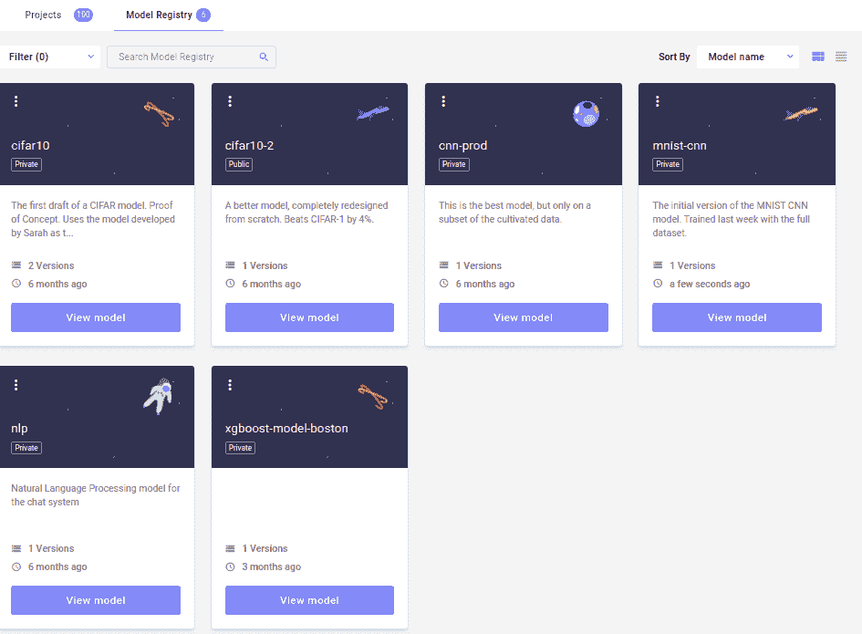

# 如何解决 ML 中的再现性

> 原文：<https://web.archive.org/web/https://neptune.ai/blog/how-to-solve-reproducibility-in-ml>

有可能你遇到了一篇机器学习论文，并试图复制它，却发现你得到了非常不同的结果。你调整你的代码，但总是出错。此时，您正在怀疑自己作为数据科学家的技能，但是不要担心。我在这里告诉你，这完全没关系，这不是你的错！

这是[再现性挑战](https://web.archive.org/web/20221109101338/https://paperswithcode.com/rc2020)的*经典案例*，不是机器学习独有的问题。

在科学中，再现性是科学方法的一个主要原则。它表明，从实验或研究中获得的结果或观察结果应该用相同的方法但由不同的研究人员重复，并且这些不同的研究人员获得的结果必须与原始研究人员获得的结果相似。因为一个结果只有在不同的研究团队成功复制几次之后才能成为科学事实。

但是，让我们回到机器学习。ML 中的再现性到底是什么意思？

## 机器学习中的再现性是什么？

机器学习的可重复性意味着你可以**在某些数据集上重复运行你的算法，并在特定项目上获得相同(或相似)的结果**。

机器学习中的可再现性意味着能够复制在论文、文章或教程中执行的 ML 编排，并获得与原始工作相同或相似的结果。

大多数 ML 编排通常是端到端的，我指的是从数据处理到模型设计、报告、模型分析或评估到成功部署。

能够复制结果是非常重要的，因为这意味着项目是可扩展的，并准备好推动大规模部署的生产。

再现性来之不易。复杂的挑战使得从论文中复制 ML 结果看起来几乎是不可能的，我们马上就要探索这些挑战。

可以说，机器学习中的再现性取决于任何模型的三个核心要素:

代码:为了实现可重复性，你必须在实验过程中跟踪并记录代码和算法的变化。

**数据:**添加新数据集、数据分布和样本变化都会影响模型的结果。必须记录数据集版本和变更跟踪，以实现可再现性。

**环境:**对于一个可重现的项目，必须捕获构建它的环境。必须记录框架依赖性、版本、使用的硬件以及环境的所有其他部分，并且易于重现。我们的环境应符合以下标准:

*   使用最新的库和文档版本，
*   能够在不破坏设置的情况下返回到先前状态，
*   在多台机器上使用相同的版本，
*   设置随机化参数，
*   使用所有可用的计算能力。

这三个核心元素结合在一起就构成了你的模型。这三者之间的桥梁就是所谓的 ML 管道。

现在我们已经讨论了这些元素，让我们继续讨论机器学习中的再现性挑战。

## 机器学习中的再现性挑战

### 1.缺少记录

这可以说是 ML 中可重复实验的最大挑战。当输入和新的决策没有被记录时，通常很难复制所取得的结果。在试验过程中，超参数值、批量大小等参数会发生变化。如果没有这些参数变化的适当记录，理解和复制模型将变得困难。

### 2.数据的变化

当原始工作的数据被改变时，几乎不可能得到相同的结果。例如，在获得结果后，当新的训练数据被添加到数据集时，不可能获得相同的结果。

数据集上不正确的数据转换(清理等)、数据分布的变化等也会影响再现性的机会。

### 3.超参数不一致性

当默认的超参数在实验过程中被改变并且没有被正确记录时，它们将产生不同的结果。

### 4.随机性

ML 充满了随机化，尤其是在发生大量随机化的项目中(随机初始化、随机噪声引入、随机增强、选择隐藏层、丢弃、混洗数据等)。

### 5.实验

机器学习是实验性的，开发一个模型需要大量的迭代。算法、数据、环境、参数等的变化都是模型构建过程的一部分，虽然这很好，但它会带来丢失重要细节的困难。

### 6.ML 框架的变化

ML 框架和库在不断升级，用于实现某个特定结果的特定库版本可能不再可用。这些更新可能会导致结果发生变化。例如，Pytorch 1.7+支持来自 NVIDIA 的 apex 库的混合精度，但以前的版本不支持。

此外，从一个框架转换到另一个框架(比如从 Tensorflow 转换到 Pytorch)会产生不同的结果。

### 7.GPU 浮点差异

再现性的另一个挑战是由于硬件设置、软件设置或编译器而导致的与浮点不同的结果。GPU 架构的变化也使得再现性变得不可能，除非强制执行其中的一些操作。

### 8.非确定性算法

非确定性算法中，不同运行时同类输入的输出是不同的，这带来了更大的再现性挑战。在深度学习算法中，如随机梯度下降、蒙特卡罗方法等，在实验过程中经常会出现不确定性。深度强化学习也容易受到非确定性的影响，代理从某种程度上不稳定的经验分布中学习，这种学习大多数时候受到非确定性环境和非确定性策略的影响。不确定性的其他来源是 GPU、随机网络初始化和小批量采样。

**为了应对这些挑战，我们这些数据科学家必须能够:**

1.  跟踪实验过程中代码、数据和环境的变化。
2.  记录实验中使用的所有代码参数、数据和环境。
3.  重用实验中使用的所有代码参数、数据和环境。

现在，让我们来看看解决重现性挑战的解决方案和工具。

### 1.实验跟踪和记录

模型训练是一个迭代的过程，改变参数的值，检查每个算法的性能，并对其进行微调以获得理想的结果等。在这个过程中，如果没有适当的记录，细节将会丢失，就像他们说的“美在细节中”。

在模型训练和实验期间，你需要能够跟踪发生的每一个变化。让我们来看看一些工具:

*   通过 [DVC](https://web.archive.org/web/20221109101338/https://dvc.org/) ，dvc exp 命令跟踪项目的每一个度量，它有一个度量列表，其中存储了度量值以跟踪进度。因此，您可以使用自动版本控制和检查点日志记录来跟踪您的实验。比较参数、度量、代码和数据的差异。应用、删除、回滚、恢复或共享任何实验。

点击这里查看更多关于 DVC 实验的实用介绍。

*   [Neptune](/web/20221109101338/https://neptune.ai/product/experiment-tracking) 允许您[记录 ML 运行期间发生的任何事情](https://web.archive.org/web/20221109101338/https://docs.neptune.ai/you-should-know/what-can-you-log-and-display)，包括指标、超参数、学习曲线、训练代码、配置文件、预测(图像、表格等)、诊断图表(混淆矩阵、ROC 曲线等)和控制台日志。

### 了解更多信息

检查如何以自动化的方式[版本化你的代码和数据](https://web.archive.org/web/20221109101338/https://docs.neptune.ai/you-should-know/what-can-you-log-and-display#data-versions)。

*   [MLflow Tracking](https://web.archive.org/web/20221109101338/https://www.mlflow.org/docs/latest/tracking.html) 使用 mlflow.autolog()函数自动跟踪和记录每个模型运行和部署的参数、指标和代码版本。这必须在培训之前完成，它可以在本地和远程保存每个实验日志。

*   [Pachyderm](https://web.archive.org/web/20221109101338/https://hub.pachyderm.com/) 自动报告匿名使用指标。它还跟踪模型开发过程中使用的所有代码和数据。

*   [WandB](https://web.archive.org/web/20221109101338/https://wandb.ai/site/experiment-tracking) 允许您跟踪实验，提供一个仪表板，您可以在其中实时可视化实验，并允许您记录超参数和每次实验运行的输出指标。

*   Comet 帮助数据科学团队跟踪实验代码、指标依赖等。它还有助于在模型的生命周期中比较、解释和优化实验指标和模型。

### 了解更多信息

你可以在这里获得更多你的 ml 追踪的追踪工具-> [15 个追踪机器学习实验的最佳工具。](/web/20221109101338/https://neptune.ai/blog/best-ml-experiment-tracking-tools)

### 2.元数据储存库

机器学习中的元数据是描述数据集、计算环境和模型的信息。ML 再现性取决于此，如果不记录和存储元数据，就无法重新创建实验。一些流行的工具可以帮助你记录和跟踪任何元数据和元数据的变化:

*   [DVC](https://web.archive.org/web/20221109101338/http://dvc.org/) 通过创建元文件作为指向存储的数据集和模型的指针来进行数据和模型版本控制。这些图元文件是使用 Git 处理的。
*   [Neptune](/web/20221109101338/https://neptune.ai/) 有一个可定制的 UI，允许你比较和查询你所有的 MLOps 元数据。
*   [TensorFlow Extended (TFX)](https://web.archive.org/web/20221109101338/https://www.tensorflow.org/tfx) 使用 [ML 元数据(MLMD)](https://web.archive.org/web/20221109101338/https://www.tensorflow.org/tfx/guide/mlmd) 库存储元数据，并使用 API 从存储后端记录和检索元数据；它也有现成的 SQLite 和 MySQL 的参考实现。
*   [Kubeflow 元数据存储库](https://web.archive.org/web/20221109101338/https://kubeflow-metadata.readthedocs.io/en/latest/)帮助数据科学家跟踪和管理其工作流程产生的大量元数据。

### 阅读更多

要了解有关元数据工具的更多信息，请查看此处-> [最佳元数据存储解决方案](/web/20221109101338/https://neptune.ai/blog/best-metadata-store-solutions)。

### 3.艺术品商店

机器学习中的工件是描述完全训练的模型的训练过程的输出的数据，或者用 ML 术语来说，模型检查点。工件存储记录了模型中的每个检查点。管理和存储每一个模型检查点在可再现性上是很重要的，因为工件使得模型很容易被 ML 团队成员复制和验证。工具，例如:

*   [DVC](https://web.archive.org/web/20221109101338/https://dvc.org/) 可以从项目外部访问数据工件，以及如何从另一个 DVC 项目导入数据工件。这有助于将特定版本的 ML 模型下载到部署服务器，或者将模型导入到另一个项目中。
*   [Neptune](/web/20221109101338/https://neptune.ai/) 存储 ML 工件，例如到数据集或模型的路径(s3 桶、文件系统)、数据集散列/预测预览(表头、图像文件夹的快照)、描述、谁创建/修改、上次修改时间、数据集大小等。
*   [Amazon Sagemaker](https://web.archive.org/web/20221109101338/https://docs.aws.amazon.com/sagemaker/latest/APIReference/API_ModelArtifacts.html) 提供了一个模型工件存储，它存储了模型的 s3 存储桶位置，其中包含了关于模型类型和内容的信息。Amazon Sagemaker 也为 AutoML 实验存储工件。
*   Kubeflow 也将工件数据存储在其工件存储中；它使用工件来理解各种 Kubeflow 组件的管道是如何工作的。Kubeflow Pipeline 可以输出工件数据的简单文本视图和丰富的交互式可视化
*   [WandB](https://web.archive.org/web/20221109101338/https://docs.wandb.ai/guides/artifacts/api) 允许您使用下面的代码为实验运行创建一个工件存储。

```
artifact = wandb.Artifact('my-dataset', type='dataset')

```

*   [TFX 元数据](https://web.archive.org/web/20221109101338/https://www.tensorflow.org/tfx/guide/mlmd)也存储您的 ml 管道中生成的模型工件，并通过 SQLite 和 MySQL 存储它们。见下图

### 4.版本控制

这是一个软件开发工具，有助于管理对代码所做的更改。VCS 通过跟踪源代码中发生的每一个小变化来减少错误和冲突的可能性。

如果您正在处理启用了 VCS 的项目，您将拥有以下内容:

*   每次修改的版本都会被记录和存储，这样在出错的时候很容易恢复。
*   对于每个团队成员，都维护了源代码的不同副本。在得到其他团队成员的验证之前，它不会合并到主文件中。
*   记录了关于谁、为什么以及对项目做了什么更改的信息。

Git 是软件开发中 VCS 最流行的例子。Git 是一个免费的开源分布式版本控制系统，用于跟踪任何一组文件的变化。

### 5.模型版本控制

模型版本化是组织控件、跟踪模型中的更改以及实现模型策略的整个过程。有助于模型版本化的工具:

*   [DVC](https://web.archive.org/web/20221109101338/https://dvc.org/) 通过创建元文件作为指向存储的数据集和模型的指针，同时将它们存储在本地或云中，来进行数据和模型版本控制。这些图元文件是使用 Git 处理的。git commit 等命令

*   [Neptune](/web/20221109101338/https://neptune.ai/) 可以让你在实验的时候存储和跟踪不同的模型版本。它允许您比较不同的模型版本，还允许您对模型进行过滤、分组和排序。

*   [MLflow](https://web.archive.org/web/20221109101338/https://www.mlflow.org/docs/latest/model-registry.html) Model Registry 是一个集中的模型存储库，允许您自动保存并跟踪注册模型的版本。您可以在 MLflow 中使用 log_model 方法来实现。一旦您记录了模型，您就可以通过 UI 或 API 在模型注册中心添加、修改、更新、转换或删除模型。

*   WandB 为构建的每个模型提供自动保存和版本控制。每个模型版本的工件都被存储起来，从而创建一个开发历史，并允许我们使用模型的先前版本。您也可以通过索引或其他自定义别名使用任何其他版本。


*Source: Author*

### 6.数据版本化

在输入或添加更多训练数据的过程中，数据会不时发生变化。数据版本化意味着随时跟踪和记录每一个数据变化。数据集是可以更新的，试图用更新的数据集复制模型是不可能的。有了数据版本控制，您可以跟踪每一个数据

*   [DVC](https://web.archive.org/web/20221109101338/https://dvc.org/doc/start/data-and-model-versioning) 在一个 XML 文件中单独存储有关数据的信息，并存储数据处理和加工，从而实现高效共享。对于大型数据集，DVC 使用一个[共享缓存](https://web.archive.org/web/20221109101338/https://dvc.org/doc/use-cases/shared-development-server#configure-the-shared-cache)来高效地存储、版本化和访问数据集上的数据。同样对于外部数据，DVC 支持亚马逊 S3，宋承宪，HDFS。
*   Neptune 支持多种记录和显示数据集元数据的方式。您可以使用名称空间和基本的日志记录方法来组织应用程序中的任何 ML 元数据。通常，人们会记录数据集的 md5 哈希、数据集的位置、类列表和功能名称列表。
*   [Delta Lake](https://web.archive.org/web/20221109101338/https://delta.io/) 为您的数据湖带来可靠性，在您的实验运行中统一批量数据处理，并且它在您现有的数据湖之上工作。它与 Apache Spark APIs 兼容。
*   [Pachyderm](https://web.archive.org/web/20221109101338/https://www.pachyderm.com/) 版本在处理数据时控制数据。它跟踪数据修订并阐明数据沿袭和转换。它处理纯文本、二进制文件和非常大的数据集
*   WandB 允许您将数据集存储在其工件存储中，并使用其工件引用直接指向系统中的数据，如 S3、GCP 或本地托管的数据集。
*   [Qri](https://web.archive.org/web/20221109101338/http://qri.io/) 是一个开源的分布式数据集版本控制系统，可以帮助你清理、版本化、组织和共享数据集。它可以通过命令行、桌面 UI(macOS 和 Windows)和云来使用。它记录对数据集所做的每一次更改，并通过戳记保存它们

### 7.数据沿袭跟踪

每个模型都是对其进行训练的数据的压缩版本，随着时间的推移，数据会发生变化，如新的训练数据或现有数据的变化会使模型的预测过时，因此必须跟踪这方面的变化。这可以通过数据沿袭来实现。

数据沿袭是理解、记录、可视化数据从其来源到最终消费的变化和转换的过程。它提供了关于数据如何转换、转换了什么以及为什么转换的每个细节。了解数据集的数据血统有助于再现性。

*   MLflow 使用三角洲湖来跟踪模型中使用的大规模数据。
*   [Pachyderm](https://web.archive.org/web/20221109101338/https://www.pachyderm.com/data-lineage/) 帮助您找到数据源，然后在模型开发过程中对其进行跟踪和版本化。Pachyderm 还允许您快速审计数据版本跟踪和回滚中的差异
*   [Apatar](https://web.archive.org/web/20221109101338/http://www.apatarforge.org/) 使用可视化来显示数据从起点到终点的流动。这是一个开源的提取、转换和加载(ETL)项目，用于跨多种格式和来源移动数据。它提供了内置的数据集成工具和数据映射工具。
*   [Truedat](https://web.archive.org/web/20221109101338/https://www.truedat.io/) ，一个开源的数据治理工具，提供从模型开始到结束的端到端数据可视化。
*   [CloverDX](https://web.archive.org/web/20221109101338/http://cloverdx.com/) 通过开发人员友好的可视化设计器为您的数据集提供数据沿袭。它有利于自动化数据相关的任务，如数据迁移，而且速度很快。

可以使用基于模式的沿袭、数据标记和解析等技术来跟踪数据。

### 8.随机化管理

如前所述，机器学习中有很多随机性，例如随机初始化、随机噪声引入、随机增强、选择隐藏层、放弃，为了克服随机性，设置并保存您的环境种子。

您可以按如下方式设置种子值:

```
import os
os.environ['PYTHONHASHSEED'] = str(seed)
random.seed(seed)

```

或者使用 numpy 伪随机生成器来设置固定的种子值:

```
import numpy as np
np.random.seed(seed_value)
from comet_ml import Experiment

```

或者使用 TensorFlow 伪随机生成器来设置固定的种子值:

```
import tensorflow as tf
tf.set_random_seed(seed_value)

```

您还可以配置新的全局“tensorflow”会话:

```
from keras import backend as K
session_conf = tf.ConfigProto(intra_op_parallelism_threads=1, inter_op_parallelism_threads=1)
sess = tf.Session(graph=tf.get_default_graph(), config=session_conf)
K.set_session(sess)

```

In pytorch:

```
import torch
torch.manual_seed(0)
```

设置种子参数以避免随机初始化是很重要的，为你正在使用的框架设置种子参数。使用 GPU 时，种子参数可能会被忽略。但是，设定和记录你的种子仍然很重要。还有，请不要像超参数一样优化你的种子。为了克服拆分数据进行训练、测试和验证时的随机性，请在 test_split_train 代码中包含种子参数。

### 9.模型注册表

Model registry 是一种跟踪机制，它记录和存储所有的模型元数据、沿袭和版本化日志。它捕获了训练期间使用的数据集、谁训练了模型、模型训练时使用了什么指标以及何时将它部署到生产中。

*   [Neptune](https://web.archive.org/web/20221109101338/https://neptune.ai/product/model-registry) model registry 允许您将您的模型组织到一个中央模型注册表中，供进行大量实验的研究和生产团队使用。

*   MLflow [Model Registry](https://web.archive.org/web/20221109101338/https://www.mlflow.org/docs/latest/model-registry.html) 允许您用唯一的名称、版本、阶段和其他元数据注册您的模型。

*   Comet 允许你通过用户界面或者 comet python SDK 注册你的模型。



*Card view of registered models in Comet | [Source](https://web.archive.org/web/20221109101338/https://www.comet.ml/site/using-comet-model-registry/)*

### 10.依赖性管理

如果不匹配与模型构建时相同的开发环境和软件库/框架，几乎不可能复制模型。正如你所知道的，ML 框架是不断升级的，所以存储和保存软件版本的信息以及在构建模型时使用的环境是很重要的。诸如 Conda、Docker、Kubeflow、Pipenv、Singularity 等工具将帮助您存储环境和软件依赖性。

*   Docker 使得使用一个单一的环境变得很容易，这个环境包含了运行项目所需的所有依赖项、框架、工具和库。在 docker 中，团队可以使用预构建的 Docker 映像轻松构建环境，这些映像可以在 [DockerHub](https://web.archive.org/web/20221109101338/https://hub.docker.com/) 中找到。
*   [MLflow Projects](https://web.archive.org/web/20221109101338/https://www.mlflow.org/docs/latest/projects.html) 允许你为一个项目选择一个特定的环境并指定其参数。
*   使用 Kubeflow，您可以将环境的代码、依赖项和配置打包到一个名为 [Dockerfile](https://web.archive.org/web/20221109101338/https://docs.docker.com/engine/reference/builder/) 的容器中
*   [Conda](https://web.archive.org/web/20221109101338/https://docs.conda.io/en/latest/) : Conda 是一个开源的环境和包管理系统。它允许您快速安装、运行和更新软件包及其依赖项。Conda 可以在本地计算机上轻松创建、保存、加载和切换环境。
*   Pipenv :使用 Pipenv，您可以为您的 ml 项目自动创建和管理虚拟环境。

### 11.协作和交流

建立模型或进行研究需要团队合作，从数据工程师到研究人员以及参与该过程的每个人。缺乏沟通很容易导致建设过程中出现问题。所以团队必须使用工具来促进他们之间有效的合作和交流。像 DVC、Github、Neptune.ai、Comet.ml、Kubeflow、Pycharderm 和 WandB 这样的工具允许团队有效地远程协作和交流

*   [Neptune](https://web.archive.org/web/20221109101338/https://docs.neptune.ai/you-should-know/collaboration-in-neptune) 帮助您的团队协作构建 ML 模型。
*   [Pachyderm](https://web.archive.org/web/20221109101338/https://www.pachyderm.com/) 提供跨机器学习工作流程和项目的合作。
*   WandB 允许协作，你可以很容易地邀请人们来编辑和评论一个项目。
*   Comet 让你与其他人分享和合作项目。
*   Colab、Deepnote 等笔记本也提供模型构建方面的协作。

### 12.避免不确定的算法

对于相同的输入，非确定性算法在不同的运行中显示不同的行为，这对可重复性来说是个坏消息。

*   Pytorch 允许您通过使用[torch . use _ deterministic _ algorithms()](https://web.archive.org/web/20221109101338/https://pytorch.org/docs/stable/generated/torch.use_deterministic_algorithms.html#torch.use_deterministic_algorithms)来避免非确定性算法。每当使用非确定性算法时，此方法都会返回错误。

```
import torch
torch.use_deterministic_algorithms(True)

```

*   TensorFlow 具有 GPU 确定的功能，可以通过英伟达 NGC TensorFlow 容器或 TensorFlow 版本 1.14、1.15 或 2.0 访问，支持 GPU。

对于 NGC tensorflow 容器(版本 19.06–19.09)，通过以下方式实现:

```
import tensorflow as tf
import os
os.environ['TF_DETERMINISTIC_OPS'] = '1'

```

对于 TensorFlow 版本 1.14、1.15 和 2.0，它是这样实现的:

```
import tensorflow as tf
from tfdeterminism import patch
patch()

```

### 13.综合

大多数 MLOps 工具可能不具备成功的端到端模型编排(从模型设计到模型部署)所需的所有特性。工具的无缝集成对于再现性来说是一件好事。

此外，团队中缺乏对某些工具的专业知识也会导致一个项目使用不同的工具。然后，用于这样一个项目的工具相互之间适当地集成是有意义的。

例如:

*   Docker 与 AWS、Tensorflow、Kubeflow 集成良好。
*   Neptune 使用 [neptune-client](https://web.archive.org/web/20221109101338/https://docs.neptune.ai/getting-started/hello-world) 与其他 ml 工具和库集成。海王星与牛郎星、Dalex、Fastai、MLflow、Pandas、Pytorch、Tensorflow 等整合良好。
*   MLflow 提供了几种可能对您的应用程序有用的标准风格，如 Python 和 R 函数、H20、Keras、MLeap、PyTorch、Scikit-learn、Spark MLlib、TensorFlow 和 ONNX。
*   Pachyderm 也可以在 5 分钟左右部署在 AWS/GCE/Azure 上。
*   WandB 与 PyTorch、Keras、Hugging Face 等产品集成良好。WandB 支持 AWS、Azure、GCP 和 Kubernetes。

以下是一些可复制工具及其功能的总结:

在笔记本电脑上工作时，您可以查看以下链接，了解有关再现性的更多提示:

## 结论

再现性是更好的数据科学和 ML 研究的关键，它使你的项目灵活，适合大规模生产。

当你为你的下一个 ML 项目选择工具时，记住没有放之四海而皆准的解决方案(特别是如果你不喜欢 SageMaker 这样的端到端解决方案)。工具的正确选择总是取决于您独特的环境。只要确保您有工具来跟踪您的代码和计算环境，并且存储您的元数据、工件和模型版本。

可重复性，尤其是在研究中，使其他人更容易合作，使您的项目能够长期发展，并有助于正确建立机构知识。但它在商业中同样重要，它可以缩短你的上市时间，提高底线。

### 小野寺次郎

机器学习工程师和研究员，对人工智能和人类福祉(医疗保健和教育)之间的交叉充满热情。在我的空闲时间，我喜欢尝试新的菜肴和看动漫。

* * *

**阅读下一篇**

## 在 AILS 实验室建立可扩展的医学 ML 研究工作流程[案例研究]

8 分钟阅读| Ahmed Gad |发布于 2021 年 6 月 22 日

AILS Labs 是一个生物医学信息学研究小组，致力于使人类更加健康。这个任务就是**建造模型，也许有一天可以拯救你的心脏病**。它归结为应用机器学习来基于临床、成像和遗传学数据预测心血管疾病的发展。

四名全职和五名以上兼职团队成员。生物信息学家、内科医生、计算机科学家，许多人都有望获得博士学位。正经事。

虽然业务可能是一个错误的术语，因为面向用户的应用程序还没有在路线图上，但研究是主要的焦点。**研究如此激烈，以至于需要一个定制的基础设施**(花了大约一年时间建造)来从不同类型的数据中提取特征:

*   电子健康记录(EHR)，
*   诊断和治疗信息(时间-事件回归方法)，
*   图像(卷积神经网络)，
*   结构化数据和心电图。

通过融合这些特征，精确的机器学习模型可以解决复杂的问题。在这种情况下，这是心血管一级预防的*风险分层。*本质上，它是关于**预测哪些患者最有可能患心血管疾病**。

AILS 实验室有一套完整的研究流程。每个目标都有七个阶段:

1.  定义要解决的任务(例如，建立心血管疾病的风险模型)。
2.  定义任务目标(例如，定义预期的实验结果)。
3.  准备数据集。
4.  使用 Jupyter 笔记本以交互模式处理数据集；快速试验，找出任务和数据集的最佳特性，用 R 或 Python 编码。
5.  一旦项目规模扩大，使用像 Snakemake 或 Prefect 这样的工作流管理系统将工作转化为可管理的管道，并使其可重复。否则，复制工作流程或比较不同模型的成本会很高。
6.  使用 Pytorch Lightning 与 Neptune 集成创建机器学习模型，其中应用了一些初始评估。记录实验数据。
7.  最后，评估模型性能并检查使用不同特征和超参数集的效果。

## 扩大机器学习研究的 5 个问题

AILS Labs 最初是由一小群开发人员和研究人员组成的。一个人编写代码，另一个人审查代码。没有太多的实验。但是协作变得更具挑战性，随着新团队成员的到来，新问题开始出现:

1.  数据隐私，
2.  工作流程标准化，
3.  特征和模型选择，
4.  实验管理，
5.  信息记录。

[Continue reading ->](/web/20221109101338/https://neptune.ai/blog/ml-research-workflow-case-study-ails-labs)

* * *