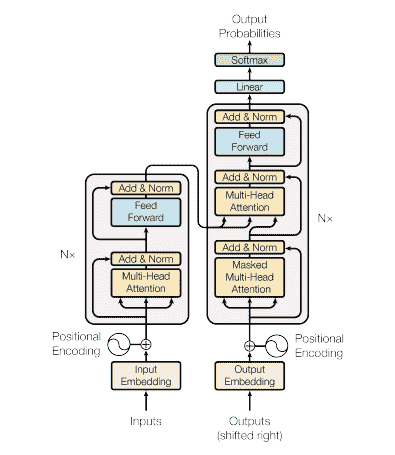
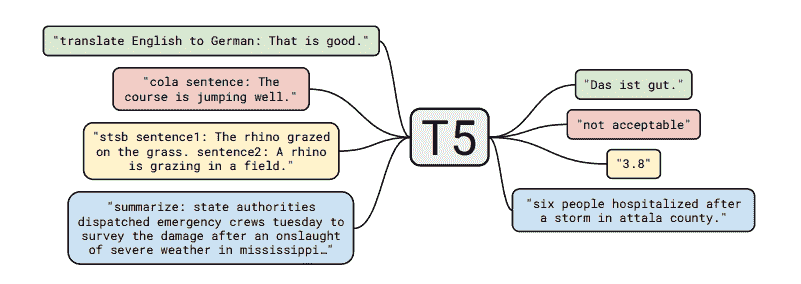
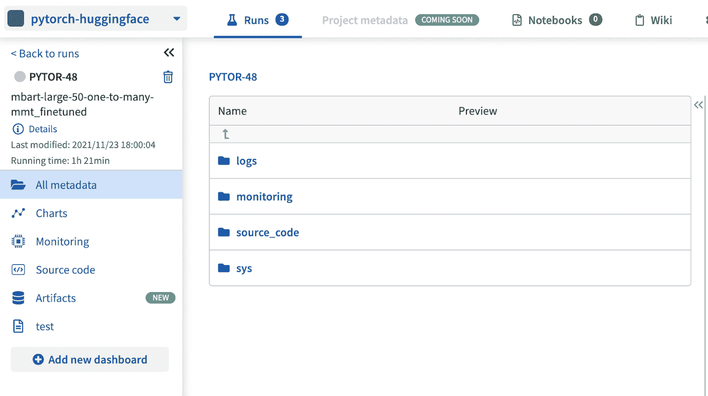
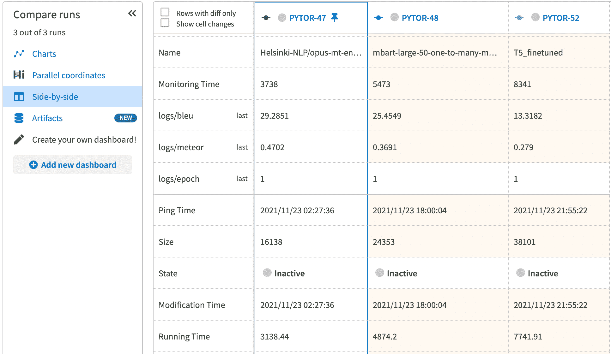

# 拥抱脸预训练模型:找到最适合你的任务

> 原文：<https://web.archive.org/web/https://neptune.ai/blog/hugging-face-pre-trained-models-find-the-best>

当你在处理一个机器学习问题时，调整现有的解决方案并重新利用它可以帮助你更快地找到解决方案。使用现有模型，不仅可以帮助机器学习工程师或数据科学家，还可以帮助公司节省计算成本，因为它需要更少的培训。有许多公司提供包含预训练模型的开源库，拥抱脸就是其中之一。

[抱脸](https://web.archive.org/web/20230220191807/https://huggingface.co/)早在 2017 年就首次推出了其[聊天平台](https://web.archive.org/web/20230220191807/https://techcrunch.com/2017/03/09/hugging-face-wants-to-become-your-artificial-bff/)。为了规范化 NLP 并使所有人都可以访问模型，他们创建了一个 NLP 库，提供各种资源，如数据集、转换器和记号化器等。在发布名为 Transformers 的 NLP 库和各种各样的工具后，拥抱脸立即在大型科技公司中变得非常流行。

拥抱脸专注于自然语言处理(NLP)任务，其想法不仅仅是识别单词，而是理解这些单词的含义和上下文。计算机处理信息的方式与人类不同，这就是为什么我们需要一个管道——处理文本的一系列步骤。

许多公司现在正在将 NLP 技术添加到他们的系统中，以增强交互体验，并且使通信尽可能接近人类体验变得比以往更加重要。这就是拥抱脸的由来。在接下来的部分中，我们将通过一些动手练习详细介绍拥抱脸及其变形金刚。

## 入门指南

在开始之前，您需要清楚地了解用例及其背后的目的。拥抱脸有多种变形金刚和模型，但它们是针对特定任务的。他们的平台提供了一种简单的方式来搜索模型，你可以通过应用多个过滤器来过滤掉模型列表。

在他们的网站上，在[模型的](https://web.archive.org/web/20230220191807/https://huggingface.co/models)页面，你会看到一个任务、库、数据集、语言等的列表。

假设您正在寻找能够满足您的用例的以下需求的模型:

*   将文本从一种语言翻译成另一种语言
*   支持 PyTorch

一旦您选择了这些过滤器，您将获得如下预训练模型列表:

您还需要确保您提供的输入格式与预训练模型的训练格式相同。一旦您从列表中选择了一个模型，您就可以开始为它设置环境。

### 设置环境

拥抱脸支持超过 20 个库，其中一些非常受 ML 工程师的欢迎，如 TensorFlow，Pytorch 和 FastAI 等。我们将使用 pip 命令安装这些库来使用拥抱脸:

```
!pip install torch

```

安装 PyTorch 后，我们可以使用下面的命令安装 transformer 库:

```
!pip install transformers
```

有两种方法可以开始使用 Hugging Face NLP 库:使用 pipeline 或任何可用的预训练模型，通过重新调整它的用途来处理您的解决方案。这些模型占用了大量的空间，当您第一次运行上面的代码时，模型将被下载。因此，建议最初使用 Google Colab 或 Kaggle 笔记本进行实验。在本文的后面，我们将了解如何利用管道和预训练模型。

## 拥抱脸支持的基本任务

在我们了解拥抱脸模型如何用于实现 NLP 解决方案之前，我们需要知道拥抱脸支持哪些[基本 NLP 任务](https://web.archive.org/web/20230220191807/https://huggingface.co/course/chapter1/2?fw=pt)以及我们为什么关注它们。拥抱脸部模型提供了许多不同的配置，并为各种用例提供了强大的支持，但这里有一些它广泛用于的基本任务:

#### 1.序列分类

给定一些类别，任务是预测输入序列的类别。这是一个预测建模问题，有着广泛的应用。一些真实世界的用例是——理解评论背后的情绪，检测垃圾邮件，纠正语法错误等。

#### 2.问答

为给定的上下文问题提供答案。这个想法是建立一个可以自动回答人类提出的问题的系统。问题可以是开放式的，也可以是封闭式的，系统的设计应该兼容这两种情况。答案可以通过查询结构化数据库或搜索非结构化文档集合来构建。

#### 3.命名实体识别

命名实体识别是将令牌识别为个人、地点或组织的任务。它正被用于自然语言处理的许多领域，并帮助解决许多现实世界的问题。在这种技术中，我们可以扫描文章，提取基本实体，并将它们归类到定义的类别中。

#### 4.摘要

你记得在学校或大学写总结报告吗？嗯，这个任务是一样的，给定一个文档，在 NLP 的帮助下，它可以转换成一个简洁的文本。这是一个为较长的文本创造一个简短、连贯和流畅版本的过程。有两种方法可以用于文本摘要-提取和抽象。在提取法中，我们提取重要的句子和短语，而在抽象法中，我们需要解释上下文并再现文本，保持核心信息完整。

#### 5.翻译

它的任务是将文本从一种语言翻译成另一种语言。替换原子单词是不够的，因为我们想要创建一个能够像人类翻译员一样翻译文本的系统。我们需要一个考虑语音类型、习语翻译等的语料库。进行复杂的翻译。

#### 6.语言建模

语言建模包括生成文本以理解一系列标记或预测一些可用于完成文本的短语。这些任务可以分为——掩蔽语言建模和随意语言建模。

NLP 的任务不仅仅是处理书面文本，它还涵盖了与语音识别、计算机视觉、生成文本等相关的解决方案。NLP 任务很难用机器学习来处理，已经做了大量的研究来提高这些模型的准确性。

## 拥抱面部变形金刚以及如何使用它们

> NLP 中的 Transformer 是一种新颖的架构，旨在解决序列到序列任务，同时轻松处理长期依赖关系。？
> 
>  [KDnuggets](https://web.archive.org/web/20230220191807/https://www.kdnuggets.com/2021/02/hugging-face-transformer-basics.html)

变形金刚的概念是在 2017 年提出的，并受到了后来推出几个型号的许多研究人员的影响。


*Transformer Model Evolution | [Source](https://web.archive.org/web/20230220191807/https://huggingface.co/course/chapter1/4?fw=pt)*

变形金刚是语言模型，已经在大量文本上以自学的方式进行了训练。[自我监督](/web/20230220191807/https://neptune.ai/blog/self-supervised-learning)或转移学习是一种训练，系统在移动中学习，不需要任何标记数据。

### 变压器架构

变换器语言模型由编码器-解码器结构组成。这些组件在核心架构中相互连接，但也可以独立使用。

*   编码器接收输入，并迭代地处理输入，以生成关于输入的哪些部分彼此相关的信息。该模型将被优化以从输入中获得最佳理解。

*   解码器使用来自编码器的表示生成目标序列，并使用上下文信息生成输出。



*The transformer – model architecture | [Source](https://web.archive.org/web/20230220191807/https://arxiv.org/pdf/1706.03762.pdf)*

transformer 模型架构的一个关键特性是关注层。这一层会告诉模型注意具体的细节和用词。它可以被描述为一个键和一组键值对到输出的映射，其中查询、键、值和输出都是向量。要详细了解变压器架构，请查看关于变压器的论文-[注意力是你所需要的全部](https://web.archive.org/web/20230220191807/https://arxiv.org/pdf/1706.03762.pdf)和[图解变压器](https://web.archive.org/web/20230220191807/http://jalammar.github.io/illustrated-transformer/)博客。

现在你已经对这个架构有了一个基本的了解，让我们看看拥抱脸是如何使这个过程更简单易用的。

### 变压器和管道介绍

拥抱面部变压器库由不同任务的不同模型组成，可通过高级 API 访问。变压器模型构建起来很复杂，因为它们需要数百亿个参数的微调和高强度的训练。创建拥抱面部变形库是为了通过访问一个 API 来提供使用这些复杂模型的便利性、灵活性和简单性。可以毫不费力地加载、训练和保存模型。

典型的 NLP 解决方案包括从获取数据到微调模型的多个步骤。

使用预定义的管道


*Source: Author*

#### 拥抱面部转换器管道对给定的输入文本数据执行所有预处理和后处理步骤。每个 NLP 解决方案的整个流程都封装在这些管道中，这些管道是 Transformer 库中最基本的对象。这有助于将模型与所需的预处理和后处理步骤联系起来，我们只需提供输入文本。

使用管道时，您不必担心单独实现这些步骤。您可以选择一个与您的用例相关的管道，并用如下几行代码创建一个机器翻译器:

管道是开始熟悉拥抱脸的一个好方法，因为你可以使用预先训练和微调的变压器创建自己的语言模型。拥抱面为上述任务提供了管道，以及一些额外的管道，如这里所提到的。

```
from transformers import pipeline
translator = pipeline("translation_en_to_de")
text = "Hello world! Hugging Face is the best NLP tool."
translation = translator(text)

print(translation)
```


*Source: Author*

创建您自己的渠道

#### 默认管道仅支持这些基本任务的一些场景，例如，上述翻译管道仅支持英语到德语的翻译，但是如果您想要翻译成不同的语言呢？对于这些场景，您必须使用经过微调的训练模型来创建管道。

幸运的是，拥抱脸有一个[模型中枢](https://web.archive.org/web/20230220191807/https://huggingface.co/models)，这是一个预先训练和微调的模型集合，用于上面提到的所有任务。这些模型基于各种变压器架构——GPT、T5、BERT 等。如果你过滤[翻译](https://web.archive.org/web/20230220191807/https://huggingface.co/models?pipeline_tag=translation&sort=downloads)，你会看到截至 2021 年 11 月有 1423 个模型。在这一节，我们将看到你如何使用这些模型和翻译文本。让我们创建一个[机器学习翻译器](https://web.archive.org/web/20230220191807/https://huggingface.co/course/chapter2/2?fw=pt):

1.导入并初始化标记器

##### Transformer 模型不能处理原始文本，需要转换成数字才能理解数据。

2.导入模型

```
from transformers import AutoTokenizer, AutoModelForSeq2SeqLM
tokenizer = AutoTokenizer.from_pretrained("Helsinki-NLP/opus-mt-en-nl")
```

##### 我们可以下载预先训练好的模型，就像我们在上面的步骤中下载标记器一样。在这里，我们将实例化一个模型，其中包含一个基本的变压器模块，给定输入，它将产生输出，即高维向量。

3.以 seq2seq 方式标记和编码文本

```
model = AutoModelForSeq2SeqLM.from_pretrained("Helsinki-NLP/opus-mt-en-nl")
```

##### 为了让模型能够理解数据，我们使用了一个标记器，它可以帮助:

将文本拆分成单词和子单词

*   将每个令牌映射到一个整数
*   我们在步骤 1 中初始化了标记器，并将在这里使用它来获取输入文本的标记。tokenizer 的输出是一个包含两个键的字典——输入 id 和注意屏蔽。输入 id 是句子中标记的唯一标识符。注意掩码用于将输入序列分批在一起，并指示令牌是否应该由我们的模型处理。注意掩码值为 0 的令牌表示令牌将被忽略，1 表示令牌很重要，将用于进一步处理。

4.批量翻译和解码元素

```
text = "Hello my friends! How are you doing today?"
tokenized_text = tokenizer.prepare_seq2seq_batch([text])
print(tokenized_text)

```

```
{'input_ids': [[16816, 187, 2493, 68, 650, 48, 41, 1531, 950, 31, 0]], 'attention_mask': [[1, 1, 1, 1, 1, 1, 1, 1, 1, 1, 1]]}

```

##### 我们将把预处理后的输入输入到模型中，模型生成一个输出向量。

正如我们所看到的，除了仅支持英语-德语、英语-法语和英语-罗马尼亚语翻译的简单管道之外，我们可以在 HuggingFace 中为任何预训练的 Seq2Seq 模型创建语言翻译管道。让我们看看哪些 transformer 模型支持翻译任务。

```
translation = model.generate(**tokenized_text)
translated_text = tokenizer.batch_decode(translation, skip_special_tokens=True)[0]
print(translated_text)

```

语言转换器模型

## *“transformer 是一种深度学习模型，它采用注意力机制，对输入数据的每个部分的重要性进行不同的加权。它主要用于自然语言处理领域。？*

> 变压器越来越成为解决 NLP 问题的首选模型，这也是该领域出现许多发展的原因。许多拥抱脸支持的模型是基于变压器的架构。“翻译有若干？以及“text2text？在拥抱脸和本节中，我们将看看一些流行的语言翻译模型。
> 
> [Source](https://web.archive.org/web/20230220191807/https://en.wikipedia.org/wiki/Transformer_(machine_learning_model))

在这里，我们将首先了解这些模型，然后获得开发翻译器的实践经验。这些模型中的大多数都支持多任务，并且可以进一步微调，以便为任何其他 NLP 任务提供支持。我们还将评估他们的表现，并找出哪一个是最好的。所以，让我们开始吧！

mBART 模型

### [mBART](https://web.archive.org/web/20230220191807/https://huggingface.co/transformers/model_doc/mbart.html) 遵循 BART 的概念，是一个序列到序列去噪自动编码器，在多种语言的大规模单语语料库上进行了预训练。实际的 BART 通过随机打乱原始句子的顺序并用单个掩码标记替换文本，将损坏的文档映射到它所源自的原始文档。通过破坏文档和优化解码器输出和主文档之间的损失来训练 BART。可以使用方向模型对损坏的文档进行编码，并使用自回归解码器产生原始文档。

对于输入编码器或转换，它允许您对文档应用任何类型的破坏，如标记屏蔽、删除、填充置换和检测。BART 支持各种下游应用，如序列分类、标记分类、序列生成和机器翻译。


*Input encoder & output decoder | [Source](https://web.archive.org/web/20230220191807/https://arxiv.org/pdf/1910.13461.pdf)*

mBART 模型是在[神经机器翻译的多语言去噪预训练](https://web.archive.org/web/20230220191807/https://arxiv.org/pdf/2001.08210.pdf)中提出的。虽然以前的模型和方法只关注编码器、解码器和转换部分文本，但研究人员首次提出使用 mBART 模型可以对多种语言的全文进行去噪。


*Transformations for noising the input | [Source](https://web.archive.org/web/20230220191807/https://arxiv.org/pdf/1910.13461.pdf)*

mBART 是一个多语言编码器-解码器(序列到序列)模型，主要用于翻译任务。由于模型是多语言的，它期望序列采用不同的格式。在源文本和目标文本中都添加了一个特殊的语言 id 标记来标识文本的语言。

该模型针对所有语言训练一次，并提供一组参数，这些参数可以针对有监督的(句子和文档级别)和无监督的机器翻译进行微调，而无需任何任务或语言特定的修改。让我们看看它如何在这些场景中处理机器翻译:


*Framework of multilingual denoising pre-training and fine-tuning on downstream | [Source](https://web.archive.org/web/20230220191807/https://arxiv.org/pdf/2001.08210.pdf)*

**句子级翻译** : mBART 在句子级机器翻译任务上进行评估，目标是最小化源和目标句子表示之间的差异。与其他可用的方法相比，mBART 的预训练设置提供了显著的性能改进。该模型仅使用双文本(词对齐以识别语言之间的翻译关系)进行预训练，然后与反向翻译结合。

*   文档级翻译:这处理学习不同句子之间的依赖关系，然后翻译一个段落或整个文档。对于预处理文档级数据，在每个块中，应该用句子符号分隔句子，并且整个训练示例应该以语言 id 结束。而翻译模型将在发现语言 id 时停止，因为它不知道句子的数量。

*   **无监督翻译** : mBART 还支持无监督翻译，即没有可用的双文本。当没有双文本时，模型使用反向翻译，并且当没有双文本可用但是在文档集合中的其他语言对中找到目标语言时，它使用语言转移。

*   由于其独特的框架，它不需要跨多种语言的并行数据，但有针对性的方向。这有助于提高语言的可伸缩性，即使我们没有足够的资源或者这些资源是特定于领域的。

T5 型号

### 这个模型是在[探索迁移学习的局限性的一篇统一的文本到文本迁移](https://web.archive.org/web/20230220191807/https://arxiv.org/pdf/1910.10683.pdf)论文中介绍的。研究人员通过引入一个统一的框架，可以将所有基于文本的语言问题转换为文本到文本的格式，从而探索迁移学习的有效性。T5 基于编码器-解码器架构，其基本思想是将文本作为输入，并产生新的文本作为输出。

它遵循与最初的变形金刚[相同的概念。输入文本的标记序列被映射到嵌入序列，以将其传递给编码器。编码器由模块组成，每个模块包括两个部分:自我关注层，后面是一个小的前馈网络。解码器在结构上类似于编码器，除了它在每个关注编码器输出的自关注层之后包括一个标准关注机制。它还使用一种自回归或因果自我关注的形式，允许模型关注过去的输出。](https://web.archive.org/web/20230220191807/https://arxiv.org/pdf/1706.03762.pdf)



*Diagram of text-to-text framework | [Source](https://web.archive.org/web/20230220191807/https://arxiv.org/pdf/1910.10683.pdf)*

T5 模型在未标记的数据上进行训练，这些数据是使用更干净版本的[公共爬行](https://web.archive.org/web/20230220191807/https://commoncrawl.org/)、巨大干净爬行语料库(C4)生成的。在文本到文本转换器和新的预训练数据集的帮助下，T5 模型有助于调查大量的想法。

T5 模型通过在输入序列前添加任务前缀，可以很好地处理各种现成的任务，例如翻译- *将英语翻译成法语*和摘要- *摘要。*

马里亚纳姆模型

### MarianMT 也基于编码器-解码器架构，最初由 rg Tiedemann 使用 Marian 库进行训练。Marian 是一个高效且独立的神经机器翻译框架，由一个基于动态计算图的集成自动微分引擎组成。

Marian 完全是用 C++写的。这个库支持更快的训练和翻译。由于它具有最小的依赖性，所以它提供了对优化基于 MPI 的多节点训练、高效的批量波束搜索、新模型的紧凑实现等的支持。Marian 工具包可用于解决许多 NLP 问题:

**自动后期编辑**:专注于端到端神经模型来自动编辑机器翻译输出，研究人员发现，两个编码器上的双注意力机制能够从原始机器翻译输出中恢复缺失的单词。

*   语法错误纠正:玛丽安还被用来制作一套 GEC 场景的模型。想法是使用低资源神经机器翻译进行自动语法错误纠正(GEC)。这些方法被用作 Marian 的扩展，以在源文本中引入噪声、指定加权训练目标、预训练嵌入、使用预训练模型的迁移学习等。

*   使用 Marian 框架，可以组合不同的编码器和解码器，并创建 Marian MT 来减少实现工作。MarianMT 模型在[开放平行语料库(OPUS)](https://web.archive.org/web/20230220191807/http://opus.nlpl.eu/) 上进行训练，开放平行语料库是从网络上收集的翻译文本。

大约有 1300 种型号支持多种语言对。所有这些模型都遵循相同的命名约定——Helsinki-NLP/opus-mt-{ src }-{ target }，其中 src 和 target 是两个字符的语言代码。每个模型在磁盘上大约有 298 MB，这意味着它比其他模型小，可以用于实验、微调和集成测试。[Marian 的新型多语言车型](https://web.archive.org/web/20230220191807/https://github.com/Helsinki-NLP/Tatoeba-Challenge)需要三字符语言代码。

创建您自己的机器学习翻译器，并对其进行微调

## 现在，您已经熟悉了一些语言翻译器模型，我们现在将了解如何在相同的数据上使用这些预训练的模型来创建我们自己的机器学习翻译器。我们将开发一个英语到德语文本转换的语言翻译器，并从 transformer 库中训练/微调预训练模型。

在开始之前，我们需要一个数据集，其中包含英语到德语或德语到英语的句子，并可用于教学模型。我们将使用拥抱脸数据集库来寻找我们建模所需的数据。大约有 1，800 个数据集，并且特定于不同的 NLP 任务。在本次动手练习中，我们将使用 wmt16 来培训和调整我们的翻译模型–T5、MarianMT 和 mBART。

1.加载数据集

### 我们将使用 load_dataset 函数下载数据集并将其缓存在笔记本中。

您可以看到数据已经分为测试、训练和验证。训练集有大量的数据，因此我们的模型训练和微调需要时间。

```
from datasets import load_dataset, load_metric
raw_datasets = load_dataset("wmt16", "de-en")
raw_datasets
```

2.预处理数据集

### 为了预处理 NLP 数据，我们需要使用预定义的标记器对其进行标记。

现在，我们将创建一个预处理函数，并将其应用于所有数据分割。

```
model_marianMT = "Helsinki-NLP/opus-mt-en-de"

from transformers import AutoTokenizer
tokenizer = AutoTokenizer.from_pretrained(model_marianMT,use_fast=False)
```

```
model_mbart = 'facebook/mbart-large-50-one-to-many-mmt'

from transformers import MBart50TokenizerFast

tokenizer = MBart50TokenizerFast.from_pretrained(model_mbart,src_lang="en_XX",tgt_lang = "de_DE")
```

```
model_t5 = "t5-small"
from transformers import AutoTokenizer
tokenizer = AutoTokenizer.from_pretrained(model_marianMT,use_fast=False)
```

T5 模型需要一个特殊的前缀放在输入之前，您应该采用下面的代码来定义前缀。对于 mBART 和 MarianMT，前缀将保持空白。

3.创建数据集的子集

```
prefix = "translate English to German:" 
```

```
prefix = "" 
max_input_length = 128
max_target_length = 128
source_lang = "en"
target_lang = "de"
def preprocess_function(examples):
   inputs = [prefix + ex[source_lang] for ex in examples["translation"]]
   targets = [ex[target_lang] for ex in examples["translation"]]
   model_inputs = tokenizer(inputs, max_length=max_input_length, truncation=True)

   with tokenizer.as_target_tokenizer():
       labels = tokenizer(targets, max_length=max_target_length, truncation=True)
   model_inputs["labels"] = labels["input_ids"]
   return model_inputs
tokenized_datasets = raw_datasets.map(preprocess_function, batched=True)
```

### 为了避免训练中的延迟，我们将从标记化的数据集创建小的训练和验证子集，并将使用这些子集来训练和微调模型。

4.训练和微调模型

```
small_train_dataset = tokenized_datasets["train"].shuffle(seed=42).select(range(1000))
small_eval_dataset = tokenized_datasets["test"].shuffle(seed=42).select(range(1000))
```

### **我们将为 T5 和 MarianMT 使用 AutoModelForSeq2SeqLM，为 mBART 使用 MBartForConditionalGeneration 来缓存或下载模型:**

 **为了我们的训练，我们还需要一些东西。首先，定制我们的培训所需的培训属性。

```
from transformers import AutoModelForSeq2SeqLM, DataCollatorForSeq2Seq, Seq2SeqTrainingArguments, Seq2SeqTrainer

model = AutoModelForSeq2SeqLM.from_pretrained(model_marianMT)

```

```
from transformers import MBartForConditionalGeneration
model = MBartForConditionalGeneration.from_pretrained(model_mbart)
```

```
from transformers import AutoModelForSeq2SeqLM, DataCollatorForSeq2Seq, Seq2SeqTrainingArguments, Seq2SeqTrainer
model = AutoModelForSeq2SeqLM.from_pretrained(model_t5)
```

其次，我们将定义一个数据排序器来填充输入并标记它们:

```
batch_size = 16
model_name = model.split("/")[-1]
args = Seq2SeqTrainingArguments(
   f"{model_name}-finetuned-{source_lang}-to-{target_lang}",
   evaluation_strategy = "epoch",
   learning_rate=2e-5,
   per_device_train_batch_size=batch_size,
   per_device_eval_batch_size=batch_size,
   weight_decay=0.01,
   save_total_limit=3,
   num_train_epochs=1,
   predict_with_generate=True
)
```

最后一件事是在我们训练模型时计算指标。

```
data_collator = DataCollatorForSeq2Seq(tokenizer, model=model)
```

现在，我们可以将所有这些和数据集一起传递给训练器 API。

```
import numpy as np
from datasets import load_metric
metric = load_metric("sacrebleu")
meteor = load_metric('meteor')

def postprocess_text(preds, labels):
   preds = [pred.strip() for pred in preds]
   labels = [[label.strip()] for label in labels]
   return preds, labels

def compute_metrics(eval_preds):
   preds, labels = eval_preds
   if isinstance(preds, tuple):
       preds = preds[0]
   decoded_preds = tokenizer.batch_decode(preds, skip_special_tokens=True)

   labels = np.where(labels != -100, labels, tokenizer.pad_token_id)
   decoded_labels = tokenizer.batch_decode(labels, skip_special_tokens=True)

   decoded_preds, decoded_labels = postprocess_text(decoded_preds, decoded_labels)
   result = metric.compute(predictions=decoded_preds, references=decoded_labels)
   meteor_result = meteor.compute(predictions=decoded_preds, references=decoded_labels)
   prediction_lens = [np.count_nonzero(pred != tokenizer.pad_token_id) for pred in preds]
   result = {'bleu' : result['score']}
   result["gen_len"] = np.mean(prediction_lens)
   result["meteor"] = meteor_result["meteor"]
   result = {k: round(v, 4) for k, v in result.items()}
   return result
```

在对模型进行微调之后，模型可以保存在目录中，我们应该能够像预训练模型一样使用它。我们还可以将该模式推广到拥抱脸集线器和共享。

```
trainer = Seq2SeqTrainer(
   model,
   args,
   train_dataset=small_train_dataset,
   eval_dataset=small_eval_dataset,
   data_collator=data_collator,
   tokenizer=tokenizer,
   compute_metrics=compute_metrics
)
trainer.train()
```

评估和跟踪模型性能–选择最佳模型

```
trainer.save_model()
```

## 现在，我们的模型已经根据更多的数据进行了训练和微调，我们需要决定为我们的解决方案选择哪个模型。有几件事我们可以看看:

1.预训练 vs 微调 vs 谷歌翻译

### 在上一节中，我们将微调后的模型保存在本地目录中。现在，我们将测试这些模型，并将翻译后的文本与预先训练的文本和谷歌翻译进行比较。以下是如何从本地目录访问您的微调模型:

马里亚姆特模型

#### MBart50 型号

```
import os
for dirname, _, filenames in os.walk('/content/opus-mt-en-de-finetuned-en-to-de'):
   for filename in filenames:
       print(os.path.join(dirname, filename))

from transformers import MarianMTModel, MarianTokenizer
src_text = ['USA Today is an American daily middle-market newspaper that is the flagship publication of its owner, Gannett. Founded by Al Neuharth on September 15, 1982.
']
model_name = 'opus-mt-en-de-finetuned-en-to-de'
tokenizer = MarianTokenizer.from_pretrained(model_name)
model = MarianMTModel.from_pretrained(model_name)
translated = model.generate(**tokenizer(src_text, return_tensors="pt", padding=True))
[tokenizer.decode(t, skip_special_tokens=True) for t in translated]
```

#### T5 型号

```
import os
for dirname, _, filenames in os.walk('/content/mbart-large-50-one-to-many-mmt-finetuned-en-to-de'):
   for filename in filenames:
       print(os.path.join(dirname, filename))

from transformers import MBart50TokenizerFast, MBartForConditionalGeneration
src_text = ["USA Today is an American daily middle-market newspaper that is the flagship publication of its owner, Gannett. Founded by Al Neuharth on September 15, 1982."]
model_name = 'mbart-large-50-one-to-many-mmt-finetuned-en-to-hi'
tokenizer = MBart50TokenizerFast.from_pretrained(model_name,src_lang="en_XX")
model = MBartForConditionalGeneration.from_pretrained(model_name)
model_inputs = tokenizer(src_text, return_tensors="pt")

generated_tokens = model.generate(
   **model_inputs,forced_bos_token_id=tokenizer.lang_code_to_id["de_DE"])
translation = tokenizer.batch_decode(generated_tokens, skip_special_tokens=True)
translation
```

#### 让我们比较一下 MarianMT、mBART 和 T5 型号的翻译文本:

```
import os
for dirname, _, filenames in os.walk('/content/t5-small-finetuned-en-to-de'):
   for filename in filenames:
       print(os.path.join(dirname, filename))

from transformers import AutoModelForSeq2SeqLM, AutoTokenizer
src_text = ['USA Today is an American daily middle-market newspaper that is the flagship publication of its owner, Gannett. Founded by Al Neuharth on September 15, 1982.']
model_name = 't5-small-finetuned-en-to-de'
tokenizer = AutoTokenizer.from_pretrained(model_name)
model = AutoModelForSeq2SeqLM.from_pretrained(model_name)
translated = model.generate(**tokenizer(src_text, return_tensors="pt", padding=True))
[tokenizer.decode(t, skip_special_tokens=True) for t in translated]
```

***输入文本**—《今日美国》是一份美国中型市场日报，是其所有者 Gannett 的旗舰出版物。由 Al Neuharth 于 1982 年 9 月 15 日创立。*

* * *

***【预先训练的 MarianMT 模型翻译】**——【今天是美国中档日报，是其所有者的旗舰甘尼特。Al Neuharth 于 9 月 15 日成立
【精调 MarianMT 模型翻译】—今天，美国一家日报是其所有者的旗舰甘尼特的中产阶级。9 月 15 日 Al Neuharth 成立【*

***【预先训练的姆班波特模型翻译】**——【今天是美国一家面向中型市场的日报，是其主人甘尼特的旗舰型出版物。9 月 15 日 Al Neuharth 成立【*

***【精调姆班波特】** **【模型翻译】**—美国今天是面向中型市场的美国日报，是其主人甘尼特的旗舰出版物。1982 年 9 月 15 日 Al Neuharth 成立。*

***预培训 T5 模型翻译**----今天是美国中档报纸《T3》的一期*

 ****【谷歌翻译】**—美国今天是美国面向中产阶级的日报，它是所有者的旗舰甘尼特。1982 年 9 月 15 日 Al Neuharth 成立。*

使用 MarianMT 微调模型完成的翻译比预训练的 MarianMT 模型好，接近 Google translator。尽管这三本书的翻译都有一些语法错误。

* * *

与 MarianMT 和 Google translator 不同，预训练的 mBART 能够识别更多的单词，但在他们的翻译文本中没有太多差异。根据计算时间，mBART 微调需要很多时间，但当测试微调模型时，翻译结果或多或少与预训练相同。

T5 是所有模型中表现最差的，因为它不能翻译整段。预训练和微调的 T5 模型都没有正确翻译文本，甚至与其他模型相差甚远。

2.评估指标–比较模型

### 为了评估我们的模型，我们需要能够验证转换文本的质量及其准确性的指标。这就是原因，我们将采用以下指标进行评估。

双语评估替补演员

#### “这是一种算法，用于评估由机器从一种自然语言翻译成另一种自然语言的文本的质量。质量被认为是机器的输出与人类的输出之间的对应关系:“机器翻译越接近专业的人类翻译越好”——这是 BLEU 背后的中心思想。它是第一个声称与人类质量判断高度相关的指标之一，并且仍然是最受欢迎的自动化和廉价的指标之一。？

> [拥抱脸指标](https://web.archive.org/web/20230220191807/https://huggingface.co/metrics/bleu)
> 
>  流星

#### 这是一种用于机器翻译评估的自动度量，其基于机器产生的翻译和人类产生的参考翻译之间的单词匹配的一般化概念。？

> [拥抱脸指标](https://web.archive.org/web/20230220191807/https://huggingface.co/metrics/meteor)
> 
>  在本文中，我们将这些指标定义为上面 compute_metrics()函数的一部分。我们可以在笔记本或任何其他 IDE 中运行代码时看到这些指标的值，但它可能很难阅读，也不太用户友好。为了自动跟踪和查看这些指标，清楚地看到最终的评估结果，我们可以使用 Neptune。它很容易使用，非常方便用户。

要了解我们选择这些指标的更多原因，请参考这篇[文章](https://web.archive.org/web/20230220191807/https://blog.taus.net/automated-mt-evaluation-metrics)。

3.跟踪您的模型数据–参数、培训损失、CPU 使用率、指标等

### [Neptune](/web/20230220191807/https://neptune.ai/product) 提供了一个很棒的用户界面来减轻跟踪模型、它们的训练、CPU 和 RAM 使用以及性能指标的痛苦。现在您已经知道了我们将在 Neptune 上跟踪和记录什么，让我们看看如何在 Neptune 平台上创建一个设置:

记录指标并在 Neptune UI 中查看它们:

```
pip install neptune-client
import neptune.new as neptune
%env NEPTUNE_PROJECT= natasha/pytorch-huggingface
%env NEPTUNE_API_TOKEN="<YOUR_API_TOKEN>"

run=neptune.init(project_qualified_name=NEPTUNE_PROJECT, api_token=NEPTUNE_API_TOKEN)

neptune.create_experiment()
```

*   为了[在 Neptune](https://web.archive.org/web/20230220191807/https://docs.neptune.ai/logging/what_you_can_log/) 中记录度量值，我们需要调用 Neptune . log _ metric("<metric _ name>？).这个函数可以在训练模型的时候调用，但是对于本文，我们将在训练完成或者模型被微调之后记录指标。

Neptune 发布了与 HuggingFace Transformers 的集成[，所以你现在可以用它来更快地开始跟踪。](https://web.archive.org/web/20230220191807/https://docs.neptune.ai/integrations/transformers/)

我们首先使用 trainer API 的方法 evaluate 获得评估指标。

让我们看看它在海王星平台上是什么样子:

```
evaluate_results = trainer.evaluate()
neptune.log_metric('epoch',evaluate_results['epoch'])
neptune.log_metric('bleu',evaluate_results['eval_bleu'])
neptune.log_metric('meteor',evaluate_results['eval_meteor'])
```

在截图中，你可以看到所有预训练模型的 bleu 和 meteor 分数。这些指标表明，即使经过微调，T5 也无法准确预测。mbart 微调的 Bleu 评分(13)和 meteor 评分(. 27)表明很难从其翻译中获得要点。对于 MarianMT 和 mBART 模型，得分非常接近，这表明他们都产生了可理解的良好翻译。

[](https://web.archive.org/web/20230220191807/https://app.neptune.ai/natasha/pytorch-huggingface/experiments?split=tbl&dash=charts&viewId=standard-view)

*Standard view of the project and experiments | [Source](https://web.archive.org/web/20230220191807/https://app.neptune.ai/natasha/pytorch-huggingface/experiments?split=tbl&dash=charts&viewId=standard-view)*

我们还可以通过选择任何实验来检查模型的元数据、CPU 和 RAM 的使用情况。

单击“monitoring”时，您将看到 CPU 和 RAM 的使用情况，在“logs”部分，您将看到所有记录的指标。

[](https://web.archive.org/web/20230220191807/https://app.neptune.ai/natasha/pytorch-huggingface/experiments?split=tbl&dash=charts&viewId=standard-view)

*Model Metadata – logs and monitoring | [Source](https://web.archive.org/web/20230220191807/https://app.neptune.ai/natasha/pytorch-huggingface/e/PYTOR-48/all)*

您还可以直观显示 CPU 和 RAM 的使用情况，如下所示:

让我们在 Neptune 中并排比较所有微调的模型，以便在一个地方有一个统一的视图:

除了比较这两个指标之外，我们还可以做更多的事情，但就本文而言，查看这些指标和翻译结果，我们可以得出结论，MarianMT 和 mBART 预训练模型和微调模型的性能优于 T5。mBART 的表现略好于 MarianMT，因为它能够识别输入文本中的更多单词，并且通过更多的训练可能会表现得更好。

[](https://web.archive.org/web/20230220191807/https://app.neptune.ai/natasha/pytorch-huggingface/experiments?split=tbl&dash=leaderboard&viewId=standard-view)

*Side-by-side model comparison | [Source](https://web.archive.org/web/20230220191807/https://app.neptune.ai/natasha/pytorch-huggingface/experiments?compare=CwdgNAjGxA&split=cmp&dash=leaderboard&viewId=standard-view)*

最后的想法

## 在这篇文章中，我们看到了拥抱脸是如何使 NLP 任务更容易集成到系统中的。虽然拥抱脸做了所有繁重的工作，但我们可以利用他们的 API 来创建 NLP 解决方案。拥抱脸支持许多自然语言处理任务，我们逐一研究了这些任务。我们还看到了拥抱脸如何为这些任务中的每一个任务提供专用管道，以及在无法使用它们的地方，我们可以使用预先训练的模型创建自己的管道。

在本文中，我们主要关注语言翻译任务，并研究了两种流行的模型。我们还看到了如何根据新数据训练和微调这些模型，并提高文本的质量。

在执行 mBart 时，我们还意识到 CPU 和 RAM 的使用高于 MarianMT 和 T5，并且它们的结果也没有太大的不同。有很大的改进空间，我们可以使用稍微大一点的训练数据来训练模型，增加训练的步骤和次数。你可以看看拥抱脸教程来了解更多关于这些模型和如何[微调](https://web.archive.org/web/20230220191807/https://huggingface.co/course/chapter3/3?fw=pt)。

这些不是支持 NLP 翻译任务的唯一模型。拥抱脸模型中心有许多可用的模型，或者可以使用多语言转换器创建。例如，XLM、伯特和 T5 模型，所有这些模型都被直接或间接地用来改进语言翻译系统，使之接近人工翻译。

拥抱 Face platform 为每个人提供了一个机会，通过他们的开源库开始解决 NLP 问题。他们的网站上也有一些精彩的教程，可以引导你浏览他们的图书馆。

Hugging Face platform is providing everyone an opportunity through their open source repositories to get started with NLP problems. They also have some brilliant [tutorials](https://web.archive.org/web/20230220191807/https://huggingface.co/course/chapter1) on their website which can guide you through their library.***