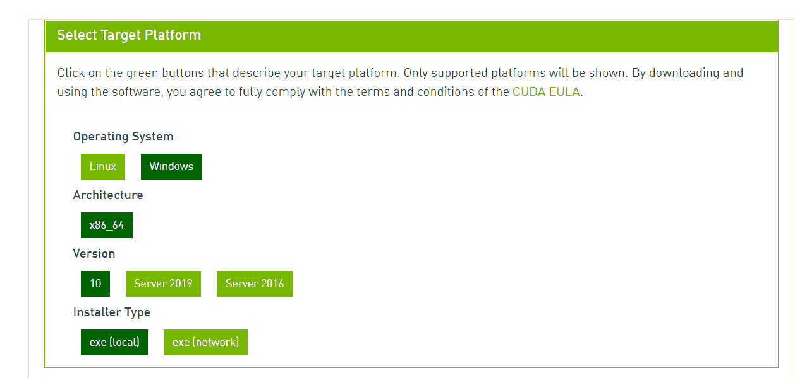
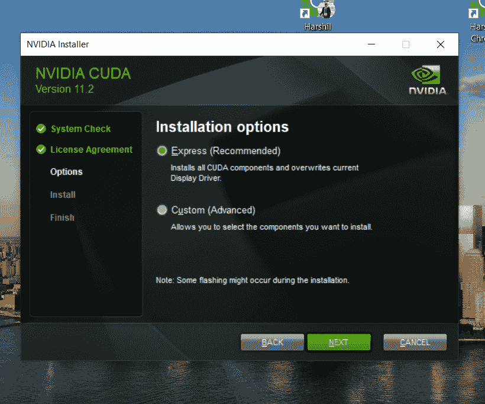
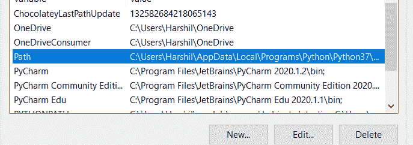
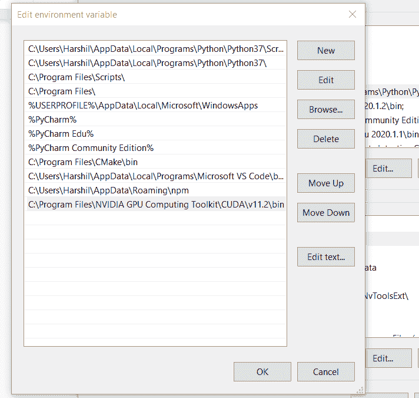
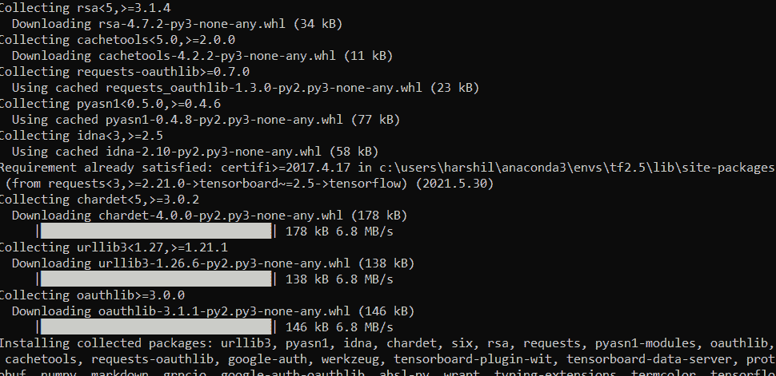
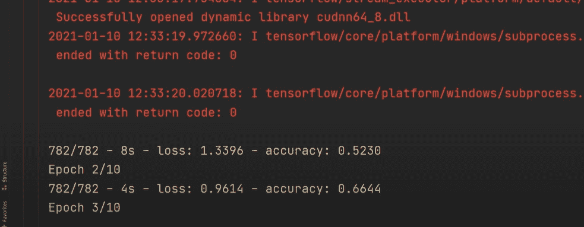
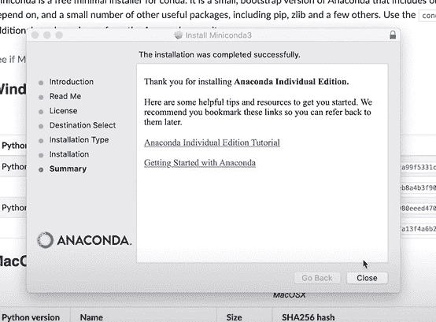
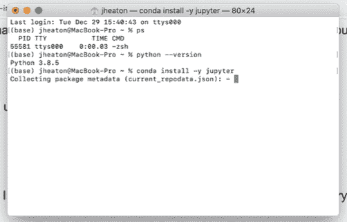
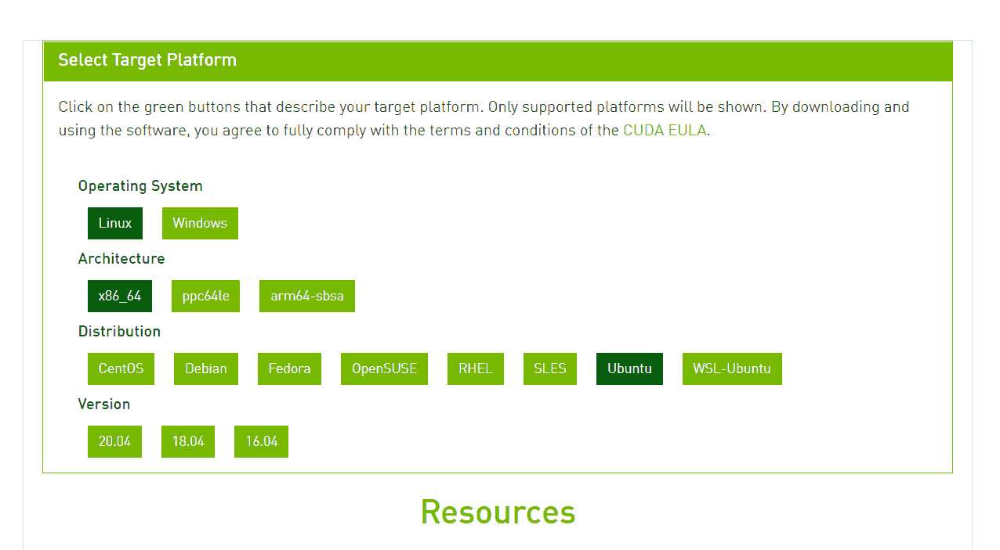

# 安装 tensor flow 2 GPU[分步指南]

> 原文：<https://web.archive.org/web/https://neptune.ai/blog/installing-tensorflow-2-gpu-guide>

[Tensorflow](https://web.archive.org/web/20230307230509/https://www.tensorflow.org/) 是最常用的深度学习框架之一。它可以说是网络上最受欢迎的机器学习平台，拥有广泛的用户，从刚刚起步的人到寻求职业和业务优势的人。

并不是所有用户都知道，如果你的硬件支持的话，可以安装 TensorFlow GPU。我们将讨论什么是 Tensorflow，它在当今世界的使用情况，以及如何在 Windows、Mac 和 Linux 中安装支持 CUDA、cudNN 和 GPU 的最新 TensorFlow 版本。

## 张量流简介

TensorFlow 是一个用于机器学习的开源软件库，由 Google 创建。它最初于 2015 年 11 月 28 日发布，现在被用于许多领域，包括科学和工程研究。

TensorFlow 背后的想法是让训练使用各种数学模型的深度神经网络变得快速简单。这些网络能够在没有人工干预或监督的情况下从数据中学习，这使它们比传统方法更有效。该库还支持在使用不同操作系统和 GPU 的多台机器上同时进行处理。

## TensorFlow 应用

TensorFlow 是谷歌建立的深度学习库，自去年年初推出以来，它已经获得了很多关注。主要功能包括自动微分、卷积神经网络(CNN)和递归神经网络(RNN)。它是用 C++和 Python 编写的，为了获得高性能，它使用了一个运行在谷歌云平台上的名为“云张量流”的服务器。它不需要 GPU，这是它的主要特点之一。

Tensorflow 的最新版本也支持通过 matplotlib 进行数据可视化。这个可视化库非常受欢迎，它经常在数据科学课程中使用，也经常被艺术家和工程师使用 MATLAB 或 Python / R /等进行数据可视化。

## 安装支持 CUDA、cudNN 和 GPU 的最新 TensorFlow 版本

让我们看看如何在 Windows、macOS 和 Linux 上安装最新的 TensorFlow 版本。

## Windows 操作系统

### 先决条件

### 步伐

**1)从:**下载 Microsoft Visual Studio

[https://visualstudio.microsoft.com/vs…](https://web.archive.org/web/20230307230509/https://visualstudio.microsoft.com/vs...)

**2)安装 NVIDIA CUDA 工具包**(【https://developer.nvidia.com/cuda-too…】T2)，检查软件和硬件版本要求，我们将使用:

| **版本** | **Python 版本** | **编译器** | **构建工具** | **cuDNN** | **CUDA** |
| tensorflow-2.5.0 | 3.6-3.9 | GCC 7.3.1 版 | 巴塞尔协议 3.7.2 | 八点一 | 11.2 版 |

我们将安装 CUDA 版本 11.2，但请确保您安装了最新或更新的版本(例如–11 . 2 . 2，如果可用的话)。


点击最新版本，会弹出一个屏幕，你可以从几个选项中选择，所以按照下面的图片，为 Windows 选择这些选项。



选择以上选项后，等待下载完成。



使用快速(推荐)选项安装它，在您的机器上安装需要一段时间。

3) **现在我们来下载 NVIDIA cuDNN，**[](https://web.archive.org/web/20230307230509/https://developer.nvidia.com/cudnn)

 **从 TensorFlow 网站查看版本代码。


现在，检查 CUDA 和 cuDNN 的版本，并为您的操作系统单击 download。如果你找不到你想要的版本，点击 cuDNN 存档并从那里下载。

下载完成后，解压文件。


现在，复制这三个文件夹(bin，include，lib)。进入 c 盘>程序文件，搜索 NVIDIA GPU 计算工具包。


打开文件夹，选择 CUDA >版本名称，替换(粘贴)那些复制的文件。

现在点击 bin 文件夹并复制路径。应该是这样的: **C:程序文件 NVIDIA GPU 计算工具 kitCUDAv11.2bin.**

在您的 PC 上，搜索环境变量，如下所示。


点击左下方的**环境变量**。现在点击表示**路径**的链接。



一旦你点击路径，你会看到这样的东西。



现在点击**新建(左上)，并将 bin 路径粘贴到这里。转到 CUDA 文件夹，选择 libnvvm 文件夹，并复制其路径。**遵循相同的过程，将该路径粘贴到系统路径中。接下来，只要重启你的电脑。

4) **安装张量流**

打开 conda 提示符。如果没有安装，在这里得到它→[https://www.anaconda.com/products/individual](https://web.archive.org/web/20230307230509/https://www.anaconda.com/products/individual)。

现在复制下面的命令并粘贴到提示符中(检查版本)。

```
conda create --name tf2.5 python==3.8
```

```
conda activate tf2.5 (version)
```

```
pip install tensorflow (With GPU Support) //Install TensorFlow GPU command, pip install --upgrade tensorflow-gpu
```



您将会看到这样的安装屏幕。如果您看到任何错误，请确保您使用的是正确的版本，不要错过任何步骤。

我们已经安装了所有的东西，所以让我们在 Pycharm 中测试一下。

### 试验

为了测试整个过程，我们将使用 Pycharm。如果没有安装，获取社区版→[https://www.jetbrains.com/pycharm/download/#section=windows](https://web.archive.org/web/20230307230509/https://www.jetbrains.com/pycharm/download/#section=windows)。

首先，要检查 TensorFlow GPU 是否已正确安装在您的计算机上，请运行以下代码:

```
import tensorflow as tf
tf.test.is_built_with_cuda()
tf.test.is_gpu_available(cuda_only=False, min_cuda_compute_capability=None)
```

它应该显示为 TRUE 作为输出。如果是假的或者有什么错误，看步骤。

现在让我们运行一些代码。

对于一个简单的演示，我们在手写数字的 MNIST 数据集上训练它。我们将了解如何创建网络以及初始化损失函数、检查准确性等等。


配置 env，创建一个新的 Python 文件，并粘贴以下代码:

```
import torch
import torchvision
import torch.nn.functional as F
import torchvision.datasets as datasets
import torchvision.transforms as transforms
from torch import optim
from torch import nn
from torch.utils.data import DataLoader
from tqdm import tqdm
```

这里查看其余代码-->[https://github . com/aladdinpersson/Machine-Learning-Collection/blob/master/ML/py torch/Basics/py torch _ simple _ CNN . py](https://web.archive.org/web/20230307230509/https://github.com/aladdinpersson/Machine-Learning-Collection/blob/master/ML/Pytorch/Basics/pytorch_simple_CNN.py)。

运行代码时，寻找 ***成功打开 cuda(versioncode)。***



一旦训练开始，所有的步骤都成功了！

## 马科斯

MacOS 不支持最新版本的 Nvidia GPU，所以这将是一个纯 CPU 安装。通过一些额外的努力和要求，你可以在 Mac 上获得 GPU 支持。

### 先决条件


您可以安装网站上的最新版本，但是对于本教程，我们将使用 Python 3.8。此外，请访问 TensorFlow 网站了解版本支持。



**2)准备环境:**

安装 Miniconda 后，打开命令提示符。

```
conda install -y jupyter
```



安装 jupyter 需要一些时间。接下来，安装 Mac [tensorflow.yml](https://web.archive.org/web/20230307230509/https://raw.githubusercontent.com/jeffheaton/t81_558_deep_learning/master/tensorflow.yml) 文件。还可以创建一个. yml 文件来安装 TensorFlow 和依赖项(下面会提到)。

```
dependencies:
    - python=3.8
    - pip>=19.0
    - jupyter
    - scikit-learn
    - scipy
    - pandas
    - pandas-datareader
    - matplotlib
    - pillow
    - tqdm
    - requests
    - h5py
    - pyyaml
    - flask
    - boto3
    - pip:
        - tensorflow==2.4
        - bayesian-optimization
        - gym
        - kaggle
```

从包含 **tensorflow.yml** 的同一目录中运行以下命令。

```
conda env create -f tensorflow.yml -n tensorflow
```

此安装可能需要几分钟时间。

使用以下命令激活环境:

```
python -m ipykernel install --user --name tensorflow --display-name "Python 3.8 (tensorflow)"
```

### 试验

为了测试整个过程，我们将使用 Jupyter 笔记本。使用以下命令启动 Jupyter:

```
jupyter notebook
```

复制下面的代码并在 jupyter 笔记本上运行。

```
import sys

import tensorflow.keras
import pandas as pd
import sklearn as sk
import tensorflow as tf

print(f"Tensor Flow Version: {tf.__version__}")
print(f"Keras Version: {tensorflow.keras.__version__}")
print()
print(f"Python {sys.version}")
print(f"Pandas {pd.__version__}")
print(f"Scikit-Learn {sk.__version__}")
gpu = len(tf.config.list_physical_devices('GPU'))>0
print("GPU is", "available" if gpu else "NOT AVAILABLE")
```

这可能需要一些时间，但是您会在您安装的版本中看到类似这样的内容。


## Linux 操作系统

我们可以在 Linux 上安装 CPU 和 GPU 两个版本。

### 先决条件

### 步伐

**1)首先从**[**【https://docs.conda.io/en/latest/miniconda.html】**](https://web.archive.org/web/20230307230509/https://docs.conda.io/en/latest/miniconda.html)下载并安装 Miniconda


要在您的机器上安装 CUDA，您需要:



您可以通过运行以下命令安装 CUDA，

```
$ sudo apt install nvidia-cuda-toolkit
```

安装 CUDA 后，运行以验证安装:

```
nvcc -V
```

您将看到它的输出如下所示:

```
nvcc: NVIDIA (R) Cuda compiler driver
Copyright (c) 2005-2021 NVIDIA Corporation
Built on Sun_Jul_22_21:07:16_PDT_2019
Cuda compilation tools, release ‘version’

```

3) **现在我们来下载 NVIDIA cuDNN，**[](https://web.archive.org/web/20230307230509/https://developer.nvidia.com/rdp/form/cudnn-download-survey)

 **从 TensorFlow 网站查看版本代码。

下载后，解压缩文件:

```
tar -xvzf cudnn-10.1-linux-x64-'version'.tgz
```

现在，我们将把提取的文件复制到 CUDA 安装路径:

```
sudo cp cuda/include/cudnn.h /usr/lib/cuda/include/
sudo cp cuda/lib64/libcudnn* /usr/lib/cuda/lib64/
```

设置 cuDNN 的文件权限:

```
$ sudo chmod a+r /usr/lib/cuda/include/cudnn.h /usr/lib/cuda/lib64/libcudnn*
```

**4)准备好环境:**

导出 CUDA 环境变量。要设置它们，请运行:

```
$ echo 'export LD_LIBRARY_PATH=/usr/lib/cuda/lib64:$LD_LIBRARY_PATH' >> ~/.bashrc
$ echo 'export LD_LIBRARY_PATH=/usr/lib/cuda/include:$LD_LIBRARY_PATH' >> ~/.bashrc
```

也可以用康达和 jupyter 笔记本设置环境。

安装 Miniconda 后，打开命令提示符。

```
conda install -y jupyter
```


现在，检查 TensorFlow 站点的版本，并运行以下命令:

```
conda create --name tensorflow python=3.8
```

要进入环境:

```
conda activate tensorflow
```

让我们为您的新环境创建 Jupyter 支持:

```
conda install nb_conda

```

这将需要一些时间来完成工作。

要仅安装 CPU，请使用以下命令:

```
conda install -c anaconda tensorflow
```

要安装 GPU 和 CPU，请使用以下命令:

```
conda install -c anaconda tensorflow-gpu
```

要添加其他库，更新或在根位置创建 ymp 文件，请使用:

```
conda env update --file tools.yml
```

以下是您需要安装的附加库(您可以使用 pip 安装它们)。

```
dependencies:
    - jupyter
    - scikit-learn
    - scipy
    - pandas
    - pandas-datareader
    - matplotlib
    - pillow
    - tqdm
    - requests
    - h5py
    - pyyaml
    - flask
    - boto3
    - pip
    - pip:
        - bayesian-optimization
        - gym
        - kaggle
```

### 试验

有两种方法可以测试你的 GPU。

首先，您可以运行以下命令:

```
import tensorflow as tf
tf.config.list_physical_devices("GPU")
```

您将看到类似的输出，[physical device(name = '/physical _ device:GPU:0 '，device_type='GPU')]

第二，也可以用 jupyter 笔记本。使用此命令启动 Jupyter。

```
jupyter notebook
```

现在，运行下面的代码:

```
import sys

import tensorflow.keras
import pandas as pd
import sklearn as sk
import tensorflow as tf

print(f"Tensor Flow Version: {tf.__version__}")
print(f"Keras Version: {tensorflow.keras.__version__}")
print()
print(f"Python {sys.version}")
print(f"Pandas {pd.__version__}")
print(f"Scikit-Learn {sk.__version__}")
gpu = len(tf.config.list_physical_devices('GPU'))>0
print("GPU is", "available" if gpu else "NOT AVAILABLE")
```

您会看到类似这样的结果:

```
TensorFlow Version: 'version'
Keras Version: 'version'-tf

Python 3.8.0
Pandas 'version'
Scikit-Learn 'version'
GPU is available
```

所以，当你看到一个 GPU 可用时，你就成功地在你的机器上安装了 TensorFlow。

## 结论

TensorFlow 是谷歌创建的一个免费的开源机器学习软件库，它最著名的是它的 GPU 加速计算速度。我们看到了如何在 Windows、Mac 和 Linux 上安装 TensorFlow。希望这个指南能帮助你入门 TensorFlow！

### 参考资料和推荐读物:****