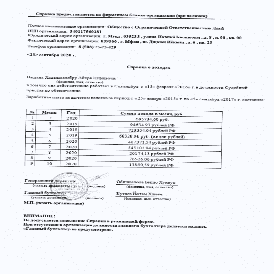

# Keras Tuner:从现实深度学习模型的超参数调整中获得的经验

> 原文：<https://web.archive.org/web/https://neptune.ai/blog/keras-tuner-tuning-hyperparameters-deep-learning-model>

你的机器学习模型的性能取决于你的配置。对于每个机器学习工程师来说，找到模型和训练算法的最佳配置是一个巨大的挑战。

模型配置可以定义为一组影响模型架构的超参数。在深度学习的情况下，这些可以是像层数或激活函数类型这样的事情。另一方面，训练算法配置影响训练过程的速度和质量。您可以将学习率值视为训练配置中参数的一个很好的示例。

为了选择正确的超参数集，我们进行超参数调整。尽管调优可能会耗费时间和 CPU，但最终结果是值得的，可以释放您的模型的最大潜力。

如果你像我一样，是一名使用 TensorFlow/Keras 的深度学习工程师，那么你应该考虑使用 **Keras Tuner。**这是一款非常棒的工具，有助于以智能、便捷的方式进行超参数调整。

在这篇文章中，我将告诉你我如何喜欢在深度学习项目中实现 Keras Tuner。

## 为什么真正的项目很重要

我所做的一切都是基于一个真实的项目。这不是一个玩具问题，提到这一点很重要，因为你可能已经看到了其他不是基于真实项目的文章。嗯，不是这个！

为什么参与反映现实生活的项目如此重要？很简单:这些项目的核心要复杂得多。在小的合成问题上可能工作良好的工具，在现实生活的挑战中可能表现不佳。所以，今天我将向你展示**你可以从** **Keras Tuner** 、中期待什么样的真正价值，以及如何在你自己的深度学习项目中实现它。

## 项目描述和问题陈述

我们将做一个图像分割任务。我们将尝试在纸张扫描图像上分割多个感兴趣的对象。我们的最终目标是使用分段提取特定的文本片段。下面的纸张扫描是我们将要使用的示例:



*Example of an input image where we will need to segment text objects of our interest*

我们可以利用计算机视觉的最新进展来解决这个问题。例如，由 Ronneberger，Fischer 和 Brox 在 2015 年首次推出的用于分割医学图像的 U-NET 是一种深度学习神经网络，我们可以利用它来实现我们的目的。U-NET 的输出是一组遮罩，其中每个遮罩包含一个感兴趣的特定对象。


*Real UNET’s output for an input image introduced previously. Table ordering numbers are segmented in a single mask* 


*Real UNET’s output for an input image introduced previously. Stamp region is segmented in a single mask* 

基本上，对于一个包含一些物体的输入图像，我们的深度神经网络在训练的时候，要把我们感兴趣的所有物体分割出来，返回一组遮罩；每个遮罩对应于一个特定类别的对象。如果你对 U-NET 及其工作原理感兴趣，我强烈推荐阅读这篇[研究论文](https://web.archive.org/web/20221206110800/https://arxiv.org/pdf/1505.04597.pdf)。

## 模型和指标选择

我们不会从头开始创建一个模型。自 2015 年推出 U-NET 以来，我们已经有了多种实施方案。让我们利用这一点。

我已经导入了模型，我将初始化模型类的一个对象。让我们看一下文档来了解可变参数:

```
Signature:
unet(
    input_size=(512, 512, 1),
    start_neurons=64,
    net_depth=4,
    output_classes=1,
    dropout=False,
    bn_after_act=False,
    activation='mish',
    pretrained_weights=None,
)
Docstring:
Generates U-Net architecture model (refactored version)

Parameters:
    input_size : tuple (h, w, ch) for the input dimentions
    start_neurons : number of conv units in the first layer
    net_depth : number of convolution cascades including the middle cascade
    dropout : True -> use dropouts
    bn_after_act : True -> BatchNormalizations is placed after activation layers. Before otherwise
    activation : Type of activation layers: 'mish' - Mish-activation (default), 'elu' = ELU, 'lrelu' - LeakyReLU, 'relu' - ReLU
    pretrained_weights - None or path to weights-file
Return:
    U-net model
File:      ~/ml_basis/synthetic_items/models/unet.py
Type:      function
```

*显示一组初始化参数的 U-NET 类的 Docstring】*

正如我们从 docstring 中看到的，有八个参数定义了我们未来的模型。只有五个参数影响模型的架构。另外三个参数`input_size, output_classes`和`pretrained_weights`，让我们分别定义输入图像的大小、输出类的数量以及从先前预训练的模型到权重的路径。

我们将关注 5 个参数中的一个，这 5 个参数使模型的架构更加清晰。这就是我们将使用 Keras 调谐器进行超参数调谐的地方。

为了通过超参数调整找到最佳的模型架构，我们需要为模型评估选择一个度量。为了解决这个问题，让我们回忆一下 U-NET 对每个图像像素执行二进制分类，将每个像素链接到一个特定的对象类。与图像尺寸相比，我们的问题域中感兴趣的对象非常小。考虑到这一点，我们应该想出一个度量标准来最好地解释像素分类中的这种不平衡。这也是 [F1 得分](https://web.archive.org/web/20221206110800/https://en.wikipedia.org/wiki/F-score)在车型评估方面表现尤为出色的地方。

## Keras 调谐器实现

### 可用调谐器的高级概述

如何使用 Keras Tuner 充分利用我们的模型？首先要说的是，Keras 有多个调谐器。他们使用不同的算法进行超参数搜索。以下是算法，以及 Keras 中相应的调谐器:

*   `kerastuner.tuners.hyperband.Hyperband`为基于超波段的算法；
*   `kerastuner.tuners.bayesian.BayesianOptimization`为基于高斯过程的算法；
*   `kerastuner.tuners.randomsearch.RandomSearch`为随机搜索调谐器。

为了让你对这些方法有一个初步的直觉，我可以说`RandomSearch`是效率最低的方法。它不从先前测试的参数组合中学习，而只是从搜索空间中随机抽取参数组合。

`BayesianOptimization`与`RandomSearch`相似，都是对超参数组合的子集进行采样。关键的区别在于`BayesianOptimization`并不是随机地对超参数组合进行采样，而是遵循一种内在的概率方法。这种方法考虑了已经测试过的组合，并使用该信息对下一个测试组合进行采样。

`Hyperband`是`RandomSearch`在搜索时间和资源分配方面的优化版本。

如果你是一个好奇的人，想了解更多关于随机搜索、贝叶斯优化和 HyperBand 的知识，我绝对推荐[这篇文章](/web/20221206110800/https://neptune.ai/blog/hyperband-and-bohb-understanding-state-of-the-art-hyperparameter-optimization-algorithms)。

### 定义搜索空间并建立模型

Keras tuner 提供了一种优雅的方式来定义模型和调谐器将使用的参数的搜索空间——您可以通过创建一个**模型构建器函数**来完成这一切。为了向您展示它是多么简单和方便，下面是我们项目的模型构建器功能:

```
def model_builder(hp):
    """
    Build model for hyperparameters tuning

    hp: HyperParameters class instance
    """

    start_neurons = hp.Int(name = 'start_neurons', min_value = 16, max_value = 128, step = 16)
    net_depth = hp.Int(name = 'net_depth', min_value = 2, max_value = 6)
    dropout = hp.Boolean(name = 'dropout', default = False)
    bn_after_act = hp.Boolean(name = 'bn_after_act', default = False)
    activation = hp.Choice(name = 'activation', values = ['mish', 'elu', 'lrelu'], ordered = False)

    input_size = (544,544,3)
    target_labels = [str(i) for i in range(21)]

    model = u(input_size = input_size,
              start_neurons = start_neurons,
              net_depth = net_depth,
              output_classes = len(target_labels),
              dropout = dropout,
              bn_after_act = bn_after_act,
              activation = activation)

    model.compile(optimizer = Adam(lr = 1e-3),
                  loss = weighted_cross_entropy,
                  metrics = [f1, precision, recall, iou])

    return model
```

您可能已经注意到，在模型构建器功能中，我们使用了多种方法来定义超参数的搜索空间—`hp.Int, hp.Boolean`和`hp.Choice`。

这些方法的操作方式没有什么特别之处，只是简单地定义了可以在参数搜索空间中使用的值。真正重要的是，作为工程师，我们如何为每个参数选择方法，并为要采样的值定义最佳范围/选项。

例如，仔细考虑`hp.Int`中的参数非常重要，给它有意义的最小值和最大值(`min_value`和`max_value`)以及一个合适的`step`。这里您的目标是不要被选项的数量淹没，这会导致调优过程花费太多的时间和资源。同样重要的是，不要限制搜索空间，否则调优器甚至不会考虑可能的最佳值。根据你的专业技能、知识和问题领域，考虑什么样的价值观可能是最好的测试。

除了`hp.Int, hp.Boolean`和`hp.Choice`之外，还有一些其他选项可供我们在搜索空间中定义值。你可以通过[文档](https://web.archive.org/web/20221206110800/https://keras-team.github.io/keras-tuner/documentation/hyperparameters/)熟悉这些方法。

作为创建模型构建器函数的最后一步，我们在返回模型之前对其进行`.compile`。

### 调谐器初始化

到目前为止，您应该已经有了一个定义好的模型构建器函数，并且知道您想要使用什么算法来进行超参数调整。如果您已经设置好了函数和算法，那么您就可以启动一个调谐器对象了。

对于我们正在进行的图像分割项目，我决定坚持使用`Hyperband`算法，因此我的初始化代码如下所示:

```
tuner = kt.Hyperband(hypermodel = model_builder,
                     objective = kt.Objective("val_f1", direction="max"),
                     max_epochs = 20,
					 project_name='hyperband_tuner')
```

初始化期间使用四个参数:

*   `hypermodel`是我们之前定义的模型生成器函数；
*   `objective`是我们的模型试图改进的指标(最大化或最小化)。您可能会从上面的代码片段中注意到，我显式指定了我选择的度量函数的名称(val_f1，代表验证数据集的 [f1 得分](https://web.archive.org/web/20221206110800/https://en.wikipedia.org/wiki/F-score))以及它必须前进的方向(max)；
*   `max_epochs`定义用于训练每个模型的总时期数。[官方文档](https://web.archive.org/web/20221206110800/https://keras-team.github.io/keras-tuner/documentation/tuners/)建议“将此值设置为比您最大模型的预期收敛时间稍高的值”；
*   `project_name`是放置和存储所有调整相关结果的文件夹路径。

### 调整流程启动

启动 hypertuning 过程类似于在 Keras/TensorFlow 中拟合模型，除了我们在 tuner 对象上使用`.search`方法而不是常规的`.fit`方法。下面是我如何开始该项目的调优工作:

```
tuner.search(training_data=train_dg,
             steps_per_epoch=batches_per_epoch,
             validation_data=valid_dg,
             validation_steps=len(glob(img_dir + '/*')) / valid_batch_size,
             epochs=50,
             shuffle=True,
             verbose=1,
             initial_epoch=0,
             callbacks=[ClearTrainingOutput()],
             use_multiprocessing=True,
             workers=6)
```

`.search`方法和其中使用的所有参数你应该已经很熟悉了，我唯一想指出的是`ClearTrainingOutput()`回调，它本质上只是在每个训练周期结束时清除输出。下面是`ClearTrainingOutput`回调的代码:

```
class ClearTrainingOutput(tf.keras.callbacks.Callback):
    def on_train_end(*args, **kwargs):
        IPython.display.clear_output(wait = True)
```

### 获取优化结果

最激动人心的部分来了。让我们看看调音师表现如何。我们很好奇我们能够实现什么样的结果，以及哪种型号配置带来了这样的性能。

要检查超调作业的摘要，我们只需在一个`tuner`实例上使用`.results_summary()`。以下是完整的代码:

```
tuner.results_summary()
```

运行时，我们在项目中使用的调谐器的输出如下所示:

```
Results summary:

Results in hyperband_tuner
Showing 10 best trials
Objective(name='val_f1', direction='max')

Trial summary
Hyperparameters:
start_neurons: 32
net_depth: 5
dropout: False
bn_after_act: True
activation: mish
tuner/epochs: 15
tuner/initial_epoch: 0
tuner/bracket: 0
tuner/round: 0
Score: 0.9533569884300232

Trial summary
Hyperparameters:
start_neurons: 80
net_depth: 5
dropout: False
bn_after_act: True
activation: elu
tuner/epochs: 10
tuner/initial_epoch: 0
tuner/bracket: 1
tuner/round: 0
Score: 0.9258414387702942

Trial summary
Hyperparameters:
start_neurons: 128
net_depth: 3
dropout: True
bn_after_act: False
activation: elu
tuner/epochs: 18
tuner/initial_epoch: 3
tuner/bracket: 1
tuner/round: 1
tuner/trial_id: 5bc455f16fad434a9452c51a71c741b0
Score: 0.9170311570167542
..............
Trial summary
Hyperparameters:
start_neurons: 48
net_depth: 3
dropout: True
bn_after_act: False
activation: mish
tuner/epochs: 3
tuner/initial_epoch: 0
tuner/bracket: 1
tuner/round: 0
Score: 0.5333467721939087

Trial summary
Hyperparameters:
start_neurons: 96
net_depth: 3
dropout: True
bn_after_act: True
activation: mish
tuner/epochs: 3
tuner/initial_epoch: 0
tuner/bracket: 1
tuner/round: 0
Score: 0.5279057025909424

Trial summary
Hyperparameters:
start_neurons: 32
net_depth: 3
dropout: False
bn_after_act: False
activation: elu
tuner/epochs: 3
tuner/initial_epoch: 0
tuner/bracket: 1
tuner/round: 0
Score: 0.5064906477928162
```

在上面的代码片段中，我将`.results_summary()`的输出缩短到只有 6 次试验，显示了前 3 名和后 3 名的模型。您可能会注意到，对于我们选择的指标(f1 得分)，最差的模型只能达到 50 %，而最佳模型的性能达到了惊人的 95.3 %。

### 结果和业务影响

表现最好和最差之间的差距超过 45 %。从这样的差异中，我们可以得出这样的结论:

*   Keras Tuner 在寻找模型参数的最佳设置方面做了令人难以置信的工作，显示了度量增长的两倍；
*   作为工程师，我们定义了适当的搜索空间进行采样；
*   Keras Tuner 不仅适用于玩具问题，更重要的是，适用于现实生活中的项目。

让我也分享一下我们获得的业务影响。使用超参数调优针对特定问题域进行了更好优化的模型使我们的服务获得了更稳定、更准确的长期性能。与我们其他类似但未经优化的服务相比，我们的服务接受率提高了 15 %，分类置信度提高了 25 %。

## 结果跟踪和分享

是时候做一些[小动作](/web/20221206110800/https://neptune.ai/blog/mlops-what-it-is-why-it-matters-and-how-to-implement-it-from-a-data-scientist-perspective)了。好消息:如果你使用 [Neptune](/web/20221206110800/https://neptune.ai/) ，它现在支持与 Keras Tuner 的完全集成。

借助 Neptune 集成，您可以:

*   查看每个试验的记录指标图表，
*   查看每次试验的参数，
*   查看搜索过程中的硬件消耗，
*   训练后记录最佳参数，
*   对数超参数搜索空间，
*   记录 Keras Tuner 项目目录中所有试验的信息

相当刺激！让我向您展示我如何在我的项目中集成 Neptune 进行跟踪，以便在云中存储调优结果。

我将跳过基本步骤，如[海王星初始化](https://web.archive.org/web/20221206110800/https://docs.neptune.ai/getting-started/hello-world)和[实验创建](https://web.archive.org/web/20221206110800/https://docs.neptune.ai/administration/projects#create-project)，因为它在[官方文档](https://web.archive.org/web/20221206110800/https://docs.neptune.ai/)中有很好的描述。

相反，我将把重点放在将 Neptune 应用到您的项目工作流中所需的代码更改上。唯一的变化是调谐器初始化部分。下面是进行更改后初始化的样子:

```
import neptunecontrib.monitoring.kerastuner as npt_utils

tuner = kt.Hyperband(hypermodel = model_builder,
                     objective = kt.Objective("val_f1", direction="max"),
                     max_epochs = 20,
                     project_name = 'hyperband_tuner',
					 logger = npt_utils.NeptuneLogger())
```

我们在调谐器中添加了 logger，因此我们可以在每次试用后记录以下内容:

*   在“超参数/值”文本日志下运行参数；
*   损失和编译 Keras 模型时定义的所有指标；
*   搜索过程中 CPU、GPU 和内存的硬件消耗。

除此之外，我还利用`.log_tuner_info()`方法将更多信息从 Keras Tuner 对象记录到 Neptune。我是这样做的:

```
npt_utils.log_tuner_info(tuner)
```

这将记录我们想要跟踪的几乎所有内容:

*   最佳分数(“最佳分数”度量)；
*   最佳参数(' best_parameters '属性)；
*   每次运行的得分(“run_score”，度量)；
*   调谐器项目目录(' TUNER_PROJECT_NAME '项目)；
*   参数空间(“超参数/空间”文本日志)；
*   用作目标的指标/损失的名称(“目标/名称”属性)；
*   用作目标的指标/损失的方向(“目标/方向”属性)；
*   调谐器 id(“tuner _ id”属性)；
*   最佳试用 id ('best_trial_id '属性)。

有兴趣了解更多吗？观看此[指导视频](https://web.archive.org/web/20221206110800/https://www.loom.com/share/089eac8375054169a4b46548c7a6ea1a)，其中展示了另一个项目的端到端集成示例。另一个巨大的灵感来源是[官方文件](https://web.archive.org/web/20221206110800/https://docs.neptune.ai/integrations-and-supported-tools/hyperparameter-optimization/keras-tuner)。

在本文中，我们介绍了一个真实项目中完整的 Keras tuner 实现，展示了它通过选择最佳参数集来提高模型性能的潜力。

我们了解了搜索空间定义的重要性，现在知道如何设置我们自己的调优器并开始调优工作。

最后，我向您展示了如何将 Neptune 集成到您的项目中，并跟踪您的试验结果。

我希望这篇文章是有帮助的，你现在知道如何开始使用 Keras 调谐器，以及它能为你做什么。感谢阅读！