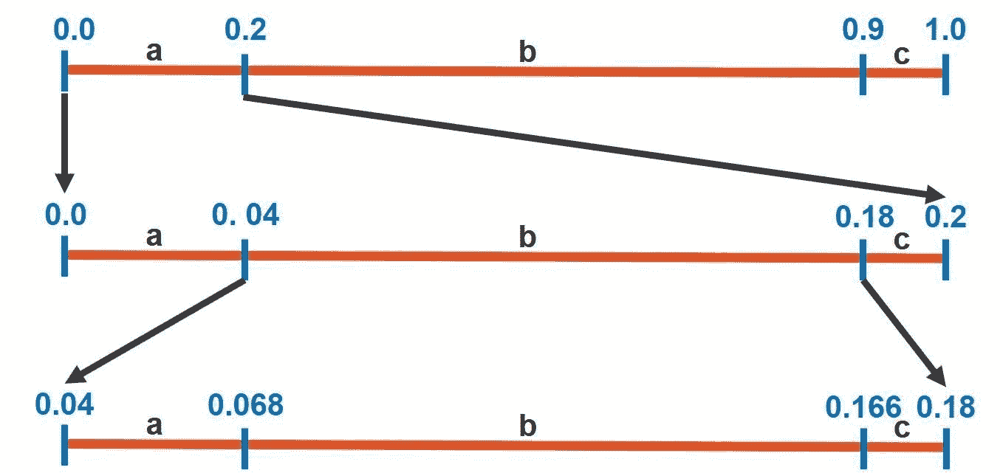
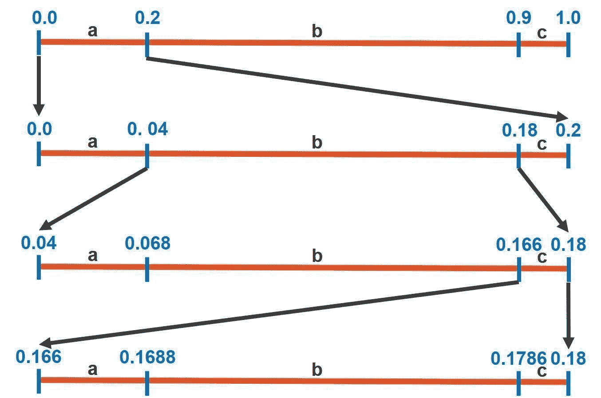
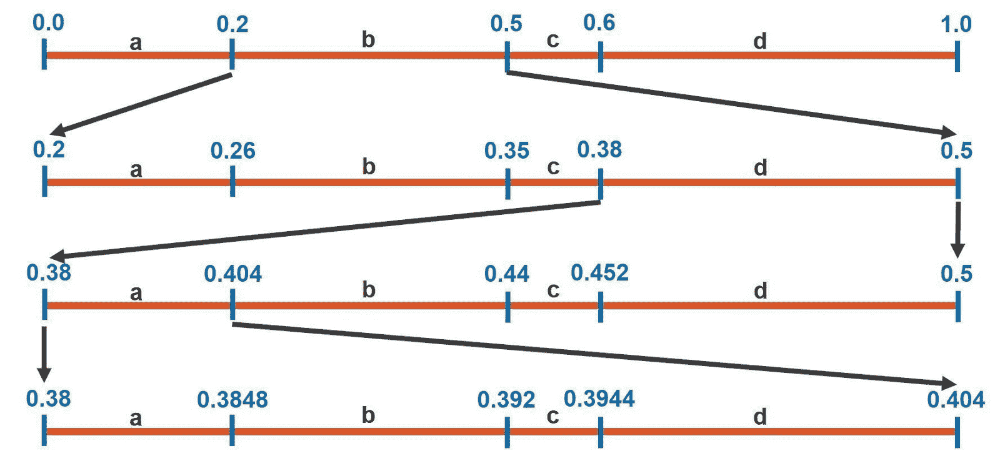

# Python 算术编码无损数据压缩及其在深度学习中的应用

> 原文：<https://web.archive.org/web/https://neptune.ai/blog/lossless-data-compression-using-arithmetic-encoding-in-python-and-its-applications-in-deep-learning>

数据[压缩算法](https://web.archive.org/web/20221206010842/https://dzone.com/articles/crunch-time-10-best-compression-algorithms)使用比原始表示更少的比特数来表示长的符号序列。数据压缩算法有两类:[有损和无损](https://web.archive.org/web/20221206010842/http://sun.aei.polsl.pl/~sdeor/pub/deo03.pdf)。

在本教程中，我们将讨论一种称为算术编码(AE)的无损算法。您将通过一个展示消息编码和解码步骤的示例来了解 AE 是如何工作的。

我们还将构建一个可以编码和解码文本消息的 Python 实现。这个 GitHub 项目的实现是可用的。

以下是我们将在本教程中涉及的所有内容:

*   算术编码概述
*   频率和概率表
*   编码
*   解码
*   十进制模块
*   Python 实现
*   无损压缩在深度学习中的应用

开始吧！

无损算法概述(算术编码)

## 在数据压缩中，有损算法在压缩数据的同时会丢失一些细节。它们减少了用于表示消息的位数，即使这会降低重建数据的质量。

无损算法无损重建原始数据。因此，与有损算法相比，它们使用的位数更多。

[算术编码](https://web.archive.org/web/20221206010842/https://www.cs.cmu.edu/~aarti/Class/10704/Intro_Arith_coding.pdf) (AE)是一种无损算法，使用少量比特来压缩数据。

这是一种基于熵的算法，在 1987 年的一篇论文中首次提出(威滕、伊恩·h、拉德福德·m·尼尔和约翰·g·克利里。"用于数据压缩的算术编码."*美国计算机学会的通讯* 30.6 (1987): 520-540)。

AE 算法减少位数的一个原因是 AE 使用 0.0 到 1.0 之间的单个数字对整个消息进行编码。消息中的每个符号在 0-1 间隔中取一个子间隔，对应于它的概率。

为了计算每个符号的概率，应该给出一个频率表作为算法的输入。该表将每个字符映射到其频率。

符号越频繁，分配给它的比特数越少。结果，减少了表示整个消息的总位数。这与在[霍夫曼编码](https://web.archive.org/web/20221206010842/http://home.cse.ust.hk/faculty/golin/COMP271Sp03/Notes/MyL17.pdf)中对消息中的所有符号使用固定数量的比特相比较。

频率表

要使用 AE 对信息进行编码(=压缩)，您需要以下输入:

## 要编码的消息。

信息中所有可能符号的频率表。

1.  频率表通常通过分析不同的消息并根据每个符号重复的次数得出结论来计算。
2.  例如:假设待编码的消息仅由 3 个符号 **a** 、 **b** 和 **c** 组成。通过分析一些以前的消息(例如 babb、cbab 和 bb)，我们得到 3 个符号的频率:

a=2

b=7

1.  c=1
2.  根据频率表，如何使用 AE 对类似于 **abc** 的消息进行编码？在开始编码之前，你需要从频率表中计算出一个概率表。
3.  概率表

使用频率表，我们可以计算每个符号出现的概率。概率计算如下:

符号的频率/所有符号的频率之和

## 根据频率表，以下是我们 3 个符号的概率:

p(a)=2/10=0.2

p(b)=7/10=0.7

p(c)=1/10=0.1

1.  给定消息和概率表，AE 可以开始编码过程。
2.  编码
3.  AE 中的编码工作原理是表示一条线上所有符号的累积概率，范围从 0.0 到 1.0。在那一行，每个符号使用一个子范围。

给定任何符号 C，它从值开始，到使用以下公式计算的值结束:

***S+(P(C))*R***

## 其中:

s:所有先前概率的累积和。

P(C):符号 C 的概率。

r:线的范围，通过从线的末端减去起点来计算。

一开始，这条线从 0.0 开始，到 1.0 结束，因此 R=1.0。

*   让我们计算 3 个符号 **a** 、 **b** 、 **c** 的起始值和结束值。
*   对于第一个符号， **a** ，从 0.0 开始到 0.0+(0.2)*1.0=0.2。起始值为 0.0，因为它是第一个符号。范围是(0.0:0.2)。
*   对于第二个符号， **b** ，从 0.2 开始到 0.2+(0.7)*1.0=0.9。范围是(0.2:0.9)。

第三个符号， **c，**从 0.9 开始到 0.9+(0.1)*1.0=1.0。范围是(0.9:1.0)。

给定所有符号的范围，最好用图形表示它们，如下图所示:

1.  以下是一些注意事项:
2.  第一个符号从线的相同起点(0.0)开始，最后一个符号在线的终点(1.0)结束。
3.  符号 C 覆盖了与其概率相对应的范围的百分比。例如，符号 b 覆盖了 70%的线，因为它的概率是 0.7。


**限制间隔**

1.  AE 的工作原理是限制行间隔，行间隔从 0.0 到 1.0，通过一些等于消息中符号数的阶段。在这个例子中，消息中只有 3 个符号，所以只有 3 个阶段。
2.  在每个阶段，根据当前符号的子间隔来限制线的间隔。

处理完所有符号后，AE 返回一个编码整个消息的单个 double 值。

### 现在，是时候查看要编码的消息， **abc** ，并处理第一个符号 **a** 以限制行间隔。基于上图，符号 **a** 覆盖了从 0.0 到 0.2 的区间。此间隔成为线条的间隔。换句话说，线间距从 0.0:1.0 变为 0.0:0.2，如下图所示。注意，符号 **a** 从 0.0 开始，最后一个符号**c**结束于 0.2。

为了计算每个符号的间隔，我们将使用已经提到的公式:

***S+(P(C))*R***

因为线的范围变了，R 变成 0.2-0.0=0.2。让我们计算每个符号的起始值和结束值:

对于第一个符号， **a** ，从 0.0 开始到 0.0+(0.2)*0.2=0.04。起始值为 0.0，因为它是第一个符号。范围是(0.0:0.04)。


对于第二个符号 **b** ，从 0.04 开始到 0.04+(0.7)*0.2=0.18。范围是(0.04:0.18)。

第三个符号 **c** 从 0.18 开始到 0.18+(0.1)*0.2=0.2。范围是(0.18:0.2)。

在第一阶段结束时，下图显示了每个符号间隔的起始值和结束值。

1.  请注意，每个符号都占据了等于其概率的线的一部分。例如，符号 **b** 的概率是 0.7，因此它占据了线的间隔的 70%。
2.  下图总结了 AE 在这一点上的进展。让我们开始第二阶段，这只是重复我们在第一阶段所做的。
3.  消息中的下一个符号是 **b** 。根据最新的行间隔(0.0 到 0.2)，符号 **b** 从 0.04 到 0.18 开始。在这个阶段，线的区间将进一步限制为 b 的区间，如下图所示:

因为线的间隔变为(0.04:0.18)，所以 R 也改变。它的新值是 0.18-0.04=0.14。让我们计算每个符号的起始值和结束值:


对于第一个符号， **a** ，从 0.04 开始到 0.04+(0.2)*0.14=0.068。范围是(0.04:0.068)。

对于第二个符号， **b** ，从 0.068 开始到 0.068+(0.7)*0.14=0.166。范围是(0.068:0.166)。


第三个符号， **c，**从 0.166 开始到 0.166+(0.1)*0.14=0.18。范围是(0.166:0.18)。


下图总结了 3 个符号的间隔。这标志着第二阶段的结束。

1.  为了总结到目前为止所取得的进展，下图连接了两个完成的阶段。让我们进入第三阶段。
2.  消息中的第三个也是最后一个符号是 **c** 。根据最新阶段，该符号落在从 **0.166** 开始到 **0.18** 结束的范围内。 **c** 根据下一个数字，当前间隔将是生产线的下一个间隔。这条新线的 r 为 0.18-0.166=0.014。
3.  在那一行，类似于前两个阶段，这是 3 个符号的间隔:

符号 **a** 从 0.166 开始到 0.166+(0.2)*0.014=0.1688。范围是(0.166 :0.1688)。


符号 **b** 从 0.1688 开始到 0.1688+(0.7)*0.014=0.1786。范围是(0.1688 :0.1786)。



符号 **c** 从 0.1786 开始到 0.1786+(0.1)*0.014=0.18。范围是(0.1786:0.18)。


间隔反映在下图中。

1.  消息中没有更多符号。下图总结了从初始间隔(0.0:1.0)到最后一个间隔(0.166:0.18)的计算。
2.  假设 AE 完成了编码过程，那么下一小节将计算对整个消息进行编码的单个数字。

**单值编码报文**


AE 达到的最新区间从 0.166 开始到 0.18。在此范围内，任何值都可以用来编码整个消息。例如，该值可以是 **0.17** 。



在本教程中，该值是间隔的平均值，即:

***(0.166+0.18)/2 = 0.173***

### 因此，基于所使用的频率表，消息 **abc** 被编码为值 **0.173** 。当频率表改变时，对消息进行编码的值也会改变。

这标志着编码过程的结束。现在我们来讨论解码过程。

解码

解码的输入有:

对消息进行编码的单个值。

频率表。它应该与用于编码的相同。

原始消息中的符号数。

## 在我们的例子中，编码消息的值是 **0.173** 。频率表为**【a = 2，b=7，c = 1】**。消息中的符号数是 3。

解码的第一步是根据频率计算符号的概率，类似于我们之前所做的。

1.  概率表为**【p(a)= 0.2，p(b)=0.7，p(c)= 0.1】**。基于概率表，通过构造相同的间隔，解码过程类似于编码。
2.  首先，根据下图创建一条从 0.0 开始到 1.0 结束的线。使用用于编码消息的相同等式来计算 3 个符号的间隔。
3.  ***S+(P(C))*R***

值 **0.173** 落在第一个区间内(0.0:0.2)。因此，编码消息中的第一个符号是 **a** 。因此，线的间隔被限制为从 0.0 到 0.2 开始的间隔。

值 **0.173** 落在第二个区间内(0.04:0.18)。因此，编码消息中的第二个符号是 **b** 。在下图中，间隔将被限制在 0.04 到 0.18 之间。

值 **0.173** 落在第三个区间(0.166:0.18)内。这就是为什么消息中的下一个符号是 **c** 的原因。

记住原始消息中的符号数是 **3** 。解码 3 个符号后，解码过程完成。解码后的消息是 **abc** 。

让我们看另一个例子。


实施例 2


在这个例子中，我不会像以前那样详述步骤。


有 4 个符号可用于构建消息—**a**、 **b** 、 **c** 和 **d** 。这些符号的频率是:

a=2

b=3

c=1

## d=4

根据频率表，符号的概率如下:

p(a)=2/10=0.2

1.  p(b)=3/10=0.3
2.  p(c)=1/10=0.1
3.  p(d)=4/10=0.4
4.  下图显示了符号的累积概率，其中每个符号的间隔等于其概率。

现在，该对消息进行编码了，即 **bdab** 。

1.  在第一阶段，该消息中的第一个符号 **b** 被处理。间隔将被限制为从 0.2 到 0.5 开始的 **b** 的间隔。
2.  在第二阶段，消息中的下一个符号是 **d** 。如下图所示，线的间隔将被限制为从 0.38 到 0.5 开始的 **d** 的间隔。
3.  因为消息中的下一个符号是 **a** ，所以第三阶段的间隔被限制为从 0.38 开始，到 0.404 结束。
4.  在第四个也是最后一个阶段，下一个符号是 **b** ，所以间隔被限制在 0.3848 到 0.392 之间。

最后一个阶段结束时，区间从 0.3848 到 0.392。为了对整个消息进行编码，可以使用间隔内的任何值。


本例中使用平均值，即 0.3884。这标志着编码过程的结束。

***(0.3848+0.392)/2 = 0.3884***


给定以下 3 个输入，解码过程开始:


对消息编码的值， **0.3884** 。



频率表。


消息的长度， **4** 。

解码器从准备概率表开始，类似于编码器。请注意，解码器构建了与上图相同的图形。

解码过程是这样的:

通过检查从 0.0 到 1.0 的初始区间，值 **0.3884** 落在符号 **b** 的区间内。因此，消息中的第一个符号是 **b** 。

1.  在从 0.2 到 0.5 开始的下一个区间中，值 **0.3884** 落在从 0.38 到 0.5 开始的 **d** 的区间内。因此，第二个符号是 **d** 。
2.  下一个区间被限制为值 **0.3884** 落在符号 **a** 的区间内的 **d** 的区间。因此，第三个符号是 **a** 。
3.  在下一个间隔中，值 **0.3884** 落在符号 **b** 的间隔内，因此消息中的第四个也是最后一个符号是 **b** 。

经过一些等于消息长度的阶段，即 **4** ，解码后的消息为 **bdab** 。

至此，算术编码背后的理论已经很清楚了。我们准备用 Python 实现这个算法。

1.  在开始之前，我们将讨论一个称为 decimal 的重要模块，它对于成功实现 AE 算法至关重要。

3.  **十进制模块**
4.  AE 技术将整个消息(无论其长度如何)编码成一个浮点数。

在 Python 中，float 数据类型被限制为有限数量的十进制数字。Python float 不能精确地保存超过这个十进制位数的数字。使用 structseq sys.float_info 中的 dig 属性返回精确的位数，如下一个代码([文档参考](https://web.archive.org/web/20221206010842/https://docs.python.org/2/library/sys.html#sys.float_info))所示。

例如，当创建一个值为 123456789.12345678998 的浮点变量时，实际存储的值是 123456789.12345679，与原始值不同。

在 AE 中，这是一场灾难，因为每个数字都有所不同。为了让 AE 使用 float 类型，消息必须限制为几个符号。

在 Python 中，有一个称为 decimal 的模块，它使用用户定义的精度。您可以存储任意位数的数字([文档参考](https://web.archive.org/web/20221206010842/https://docs.python.org/3/library/decimal.html))。

## 小数值的默认精度是 28，由 getcontext()返回。prec 属性。

如果要存储的数字超过精度 28，则该精度可以改变。下一行将精度设置为 1500。

根据[本页](https://web.archive.org/web/20221206010842/https://docs.python.org/3/library/decimal.html#decimal.MAX_PREC)，32 位系统的最大精度为 425000000。对于 64 位系统，它是 99999999999999999。这足以编码巨大的信息。

```
import sys

print(sys.float_info.dig)
```

下一小节创建一个十进制值。

```
print(float(123456789.12345678998))
```

**创建一个小数值**

decimal 模块有一个名为 Decimal 的类，它创建十进制值。下面是一个例子。这样，可以创建任意精度的数。

```
from decimal import getcontext

getcontext().prec 

```

请注意，精度只在进行算术运算时才重要。即使创建的十进制值的精度超过 getcontext()中指定的精度。prec，十进制值将不受该精度的限制。只有在做算术运算的时候才会受到限制。

```
getcontext().prec = 1500

```

在接下来的代码中，我们创建了一个存储大数的十进制值。打印时，将返回该值，不会丢失任何数字。

```
print(decimal.MAX_PREC)

```

当应用算术运算时，比如在数字上加 1，getcontext()中的精度。prec 属性将生效，以限制小数位数。下一个代码的结果将是 1234567910432815552，其中末尾的一些数字被剪裁。

要解决此问题，您应该提高精度。

**改变精度**

```
from decimal import Decimal

a = Decimal(1.5)

```

decimal 模块允许您通过为 get context()prec 设置一个大于缺省值 28 的值来提高精度。在将精度设置为 40 之后，下一个代码的结果是 12345679104328155517578125，其中没有剪裁的数字。

现在让我们构建算术编码算法的 Python 实现。

```
a = Decimal(‘123456789.12345679104328155517578125’)
```

Python 实现

```
b = a + 1
print(b) 

```

我们将 AE 的实现构建为一个名为 ArithmeticEncoding 的类，位于一个名为 pyae.py 的模块中。

传递给该方法的频率表是一个字典，其中每一项都有一个表示符号的字符串键和一个表示频率的整数值。这里有一个例子:

### 构造函数调用一个名为 get_probability_table()的方法。它接受频率表并返回存储在 probability_table 实例属性中的概率表。

下面是 get_probability_table 方法的实现。它只是将每个符号的频率除以表中所有频率的总和。

```
getcontext().prec = 40

a = Decimal('123456789.12345679104328155517578125')
b = a + 1
print(b) 

```

返回的概率表是一个类似于用于频率的字典。这是之前频率表的概率表。

**编码器**

## ArithmeticEncoding 类有一个名为 encode()的方法对消息进行编码。它接受两个参数:

msg:要编码的消息。

```
def __init__(self, frequency_table):
    self.probability_table = self.get_probability_table(frequency_table)

```

概率表:概率表。

```
{"a": 2,
 "b": 3,
 "c": 1,
 "d": 4}

```

下面是 encode()方法的实现。它有一个迭代次数等于消息长度的循环。

在每次迭代中，使用 process_stage()方法在一个阶段中处理消息的一个符号。该方法简单地接受概率表和当前间隔，并返回当前阶段内每个符号的间隔的字典。

```
def get_probability_table(self, frequency_table):
    total_frequency = sum(list(frequency_table.values()))

    probability_table = {}
    for key, value in frequency_table.items():
        probability_table[key] = value/total_frequency

    return probability_table
```

这是第一次迭代后返回的字典。这个字典被附加到一个名为 encoder 的列表中，该列表保存了所有阶段的间隔。

```
{'a': 0.2,
 'b': 0.3,
 'c': 0.1,
 'd': 0.4}

```

根据消息中的下一个符号和 process_stage 方法返回的结果，确定新的间隔。

### 处理完所有阶段后，调用 get_encoded_value()方法。它返回对整个消息进行编码的值。该值是上一阶段间隔的平均值。

在本例中，该值为 0.3884。除了编码器列表之外，编码器还返回这个值。当消息是 bdab 时，下面是编码器列表。列表中的每一项都是代表一个阶段的字典。每个字典保存每个符号的音程。

1.  **解码器**
2.  解码器是使用下面列出的 decode()方法在 ArithmeticEncoding 类中实现的。它接受以下三个参数:

encoded_msg:编码消息的值。

```
def encode(self, msg, probability_table):
    encoder = []

    stage_min = Decimal(0.0)
    stage_max = Decimal(1.0)

    for msg_term_idx in range(len(msg)):
        stage_probs = self.process_stage(probability_table, stage_min, stage_max)

        msg_term = msg[msg_term_idx]
        stage_min = stage_probs[msg_term][0]
        stage_max = stage_probs[msg_term][1]

        encoder.append(stage_probs)

    stage_probs = self.process_stage(probability_table, stage_min, stage_max)
    encoder.append(stage_probs)

    encoded_msg = self.get_encoded_value(encoder)

    return encoder, encoded_msg
```

msg_length:原始消息长度。

概率表:编码过程中使用的概率表。

```
{
    'a': [Decimal('0.0'), Decimal('0.2')],
    'b': [Decimal('0.2'), Decimal('0.5')],
    'c': [Decimal('0.5'), Decimal('0.6')],
    'd': [Decimal('0.6'), Decimal('1.0')]
}
```

它的工作方式类似于 encode()消息，因为它会遍历一些等于消息长度的迭代。

通过每次迭代，调用 process_stage()方法来查找每个符号的间隔。对这些间隔进行检查，以找到限制消息编码值的间隔。

一旦定位到间隔，其对应的符号就是原始消息中的下一个。

```
[
 {'a': [Decimal('0'),
        Decimal('0.2')],
  'b': [Decimal('0.2'),
        Decimal('0.5')],
  'c': [Decimal('0.5'),
        Decimal('0.6')],
  'd': [Decimal('0.6'),
        Decimal('1.0')]},

 {'a': [Decimal('0.2'),
        Decimal('0.26')],
  'b': [Decimal('0.26'),
        Decimal('0.35')],
  'c': [Decimal('0.35'),
        Decimal('0.38')],
  'd': [Decimal('0.38'),
        Decimal('0.5')]},

 {'a': [Decimal('0.38'),
        Decimal('0.404')],
  'b': [Decimal('0.404'),
        Decimal('0.44')],
  'c': [Decimal('0.44'),
        Decimal('0.452')],
  'd': [Decimal('0.452'),
        Decimal('0.5')]},

 {'a': [Decimal('0.38'),
        Decimal('0.3848')],
  'b': [Decimal('0.3848'),
        Decimal('0.392')],
  'c': [Decimal('0.392'),
        Decimal('0.3944')],
  'd': [Decimal('0.3944'),
        Decimal('0.404')]},

 {'a': [Decimal('0.3848'),
        Decimal('0.38624')],
  'b': [Decimal('0.38624'),
        Decimal('0.3884')],
  'c': [Decimal('0.3884'),
        Decimal('0.38912')],
  'd': [Decimal('0.38912'),
        Decimal('0.392')]}
]
```

一旦找到等于消息长度的多个符号，解码过程结束。

### **完整代码**

pyae.py 模块的完整代码如下所示。要获得最新的代码，请查看这个 GitHub 项目。

2.  **使用 pyae 的例子。算术编码类**
3.  使用 pyae。算术编码类，请按照下列步骤操作:

导入 pyae

实例化算术编码类

准备一条信息

```
def decode(self, encoded_msg, msg_length, probability_table):
    decoder = []
    decoded_msg = ""

    stage_min = Decimal(0.0)
    stage_max = Decimal(1.0)

    for idx in range(msg_length):
        stage_probs = self.process_stage(probability_table, stage_min, stage_max)

        for msg_term, value in stage_probs.items():
            if encoded_msg >= value[0] and encoded_msg <= value[1]:
                break

        decoded_msg = decoded_msg + msg_term
        stage_min = stage_probs[msg_term][0]
        stage_max = stage_probs[msg_term][1]

        decoder.append(stage_probs)

    stage_probs = self.process_stage(probability_table, stage_min, stage_max)
    decoder.append(stage_probs)

    return decoder, decoded_msg
```

对信息进行编码

### 破译信息

下面是使用 frequency_table 变量中给出的频率表对消息 bdab 进行编码的示例代码。

```
from decimal import Decimal

class ArithmeticEncoding:
    """
    ArithmeticEncoding is a class for building arithmetic encoding.
    """

    def __init__(self, frequency_table):
        self.probability_table = self.get_probability_table(frequency_table)

    def get_probability_table(self, frequency_table):
        """
        Calculates the probability table out of the frequency table.
        """
        total_frequency = sum(list(frequency_table.values()))

        probability_table = {}
        for key, value in frequency_table.items():
            probability_table[key] = value/total_frequency

        return probability_table

    def get_encoded_value(self, encoder):
        """
        After encoding the entire message, this method returns the single value that represents the entire message.
        """
        last_stage = list(encoder[-1].values())
        last_stage_values = []
        for sublist in last_stage:
            for element in sublist:
                last_stage_values.append(element)

        last_stage_min = min(last_stage_values)
        last_stage_max = max(last_stage_values)

        return (last_stage_min + last_stage_max)/2

    def process_stage(self, probability_table, stage_min, stage_max):
        """
        Processing a stage in the encoding/decoding process.
        """
        stage_probs = {}
        stage_domain = stage_max - stage_min
        for term_idx in range(len(probability_table.items())):
            term = list(probability_table.keys())[term_idx]
            term_prob = Decimal(probability_table[term])
            cum_prob = term_prob * stage_domain + stage_min
            stage_probs[term] = [stage_min, cum_prob]
            stage_min = cum_prob
        return stage_probs

    def encode(self, msg, probability_table):
        """
        Encodes a message.
        """

        encoder = []

        stage_min = Decimal(0.0)
        stage_max = Decimal(1.0)

        for msg_term_idx in range(len(msg)):
            stage_probs = self.process_stage(probability_table, stage_min, stage_max)

            msg_term = msg[msg_term_idx]
            stage_min = stage_probs[msg_term][0]
            stage_max = stage_probs[msg_term][1]

            encoder.append(stage_probs)

        stage_probs = self.process_stage(probability_table, stage_min, stage_max)
        encoder.append(stage_probs)

        encoded_msg = self.get_encoded_value(encoder)

        return encoder, encoded_msg

    def decode(self, encoded_msg, msg_length, probability_table):
        """
        Decodes a message.
        """

        decoder = []
        decoded_msg = ""

        stage_min = Decimal(0.0)
        stage_max = Decimal(1.0)

        for idx in range(msg_length):
            stage_probs = self.process_stage(probability_table, stage_min, stage_max)

            for msg_term, value in stage_probs.items():
                if encoded_msg >= value[0] and encoded_msg <= value[1]:
                    break

            decoded_msg = decoded_msg + msg_term
            stage_min = stage_probs[msg_term][0]
            stage_max = stage_probs[msg_term][1]

            decoder.append(stage_probs)

        stage_probs = self.process_stage(probability_table, stage_min, stage_max)
        decoder.append(stage_probs)

        return decoder, decoded_msg
```

以下是代码打印的消息。因为十进制模块中使用的精度足以对消息进行编码，所以消息被成功解码。

### 深度学习的应用

一个高度感兴趣的深度学习 AE 应用是图像和视频压缩。

1.  它与深度自动编码器一起使用，以非常小的每像素位数(bpp)实现高质量的图像压缩。
2.  最近使用 AE 的论文之一是:程，，等“通过时空能量压缩学习图像和视频压缩”IEEE 计算机视觉和模式识别会议论文集。2019.
3.  下一张图摘自总结事物如何工作的论文。
4.  分析转换块表示自动编码器的编码器。它的潜在向量被馈送到量化步骤。使用算术编码对量化的输出进行编码。编码量化向量的值被转换成二进制。
5.  然后，使用算术编码对二进制串进行解码，以馈送到代表自动编码器解码器的合成变换块。

结论

```
import pyae

frequency_table = {"a": 2,
                   "b": 3,
                   "c": 1,
                   "d": 4}

AE = pyae.ArithmeticEncoding(frequency_table)

original_msg = "bdab"
print("Original Message: {msg}".format(msg=original_msg))

encoder, encoded_msg = AE.encode(msg=original_msg,
                                 probability_table=AE.probability_table)
print("Encoded Message: {msg}".format(msg=encoded_msg))

decoder, decoded_msg = AE.decode(encoded_msg=encoded_msg,
                                 msg_length=len(original_msg),
                                 probability_table=AE.probability_table)
print("Decoded Message: {msg}".format(msg=decoded_msg))

print("Message Decoded Successfully? {result}".format(result=original_msg == decoded_msg))
```

我对算术编码算法的介绍到此结束。AE 将整个消息编码成一个浮点数。

```
Original Message: bdab
Encoded Message: 0.3884
Decoded Message: bdab
Message Decoded Successfully? True
```

我们基于两个例子讨论了 AE 的详细步骤，在这两个例子中，编码器和解码器是如何工作的是很清楚的。

## 我们还构建了这个算法的一个 Python 实现，可以在 GitHub 上找到。

该实现只有一个名为 pyae.py 的模块，其中有一个名为 ArithmeticEncoding 的类来构建算法。

算术编码在深度学习中的一个很酷的应用是压缩高质量的图像，同时实现非常低的每像素位数(bpp)率。

在后面的教程中，我将提供更多关于算术编码的细节，比如对算术编码应用的深入讨论。该实现将扩展到处理各种类型的数据。此外，从编码过程返回的十进制值将被转换为二进制。

现在，感谢阅读！

The Analysis Transform block represents the encoder of the autoencoder. Its latent vector is fed to a quantization step. The output of the quantization is encoded using arithmetic encoding. The value that encodes the quantized vector is converted into binary. 

The binary string is then decoded using the arithmetic encoding to be fed to the Synthesis Transform block which represents the decoder of the autoencoder.

## Conclusion

This concludes my introduction to the arithmetic encoding algorithm. AE encodes the entire message into a single floating-point number. 

We went over the detailed steps of AE based on 2 examples, within which it is clear how the encoder and the decoder work. 

We also built a [Python implementation](https://web.archive.org/web/20221206010842/https://github.com/ahmedfgad/ArithmeticEncodingPython) of this algorithm which is [available on GitHub](https://web.archive.org/web/20221206010842/https://github.com/ahmedfgad/ArithmeticEncodingPython). 

The implementation has just a single module named pyae.py, which has a class named ArithmeticEncoding that builds the algorithm.

One cool application of arithmetic encoding in deep learning is compressing images with high quality while achieving a very low bits per pixel (bpp) rate.

In later tutorials, I’ll provide more details about arithmetic encoding, like an in-depth discussion of the applications of arithmetic encoding. The implementation will be extended to work with various types of data. Also, the decimal value returned from the encoding process will be converted into binary.

For now, thanks for reading!