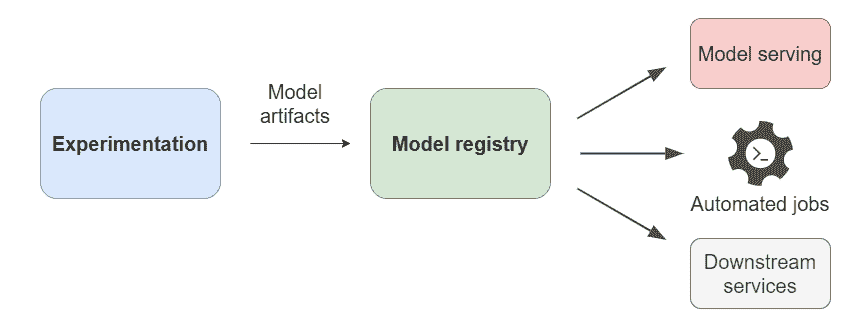
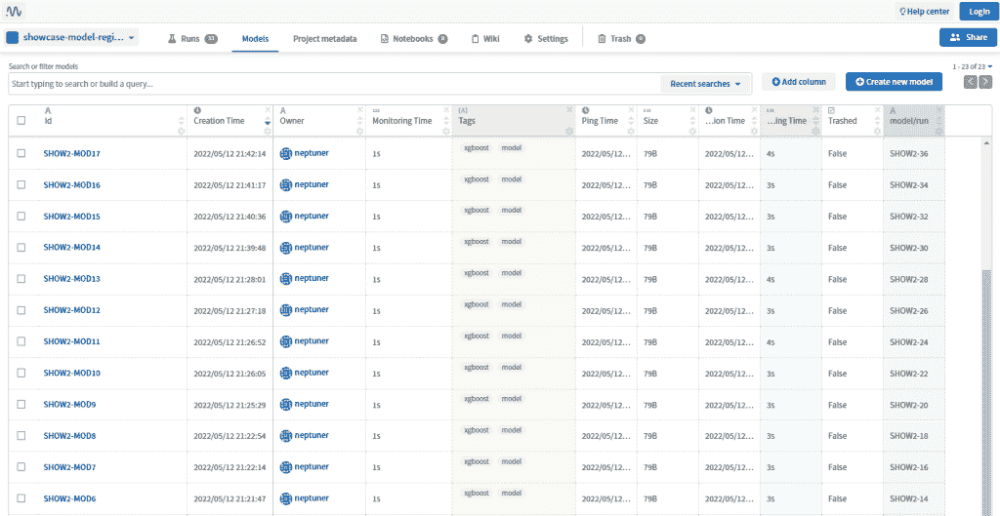
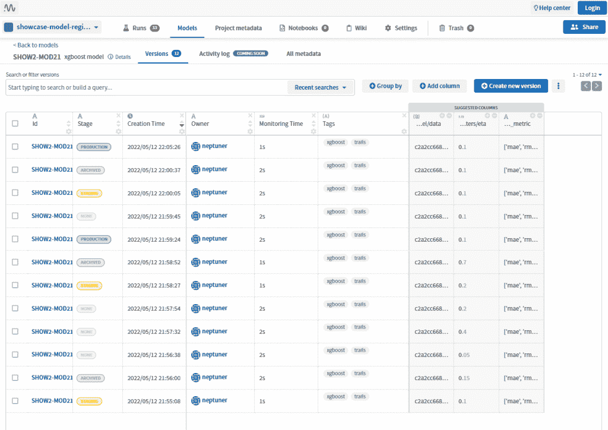
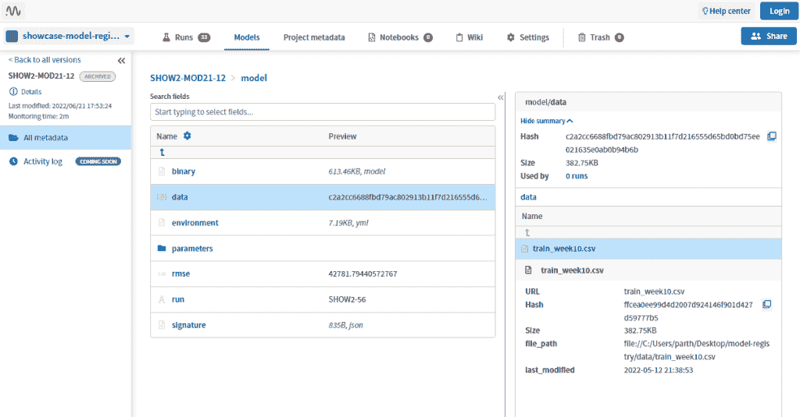
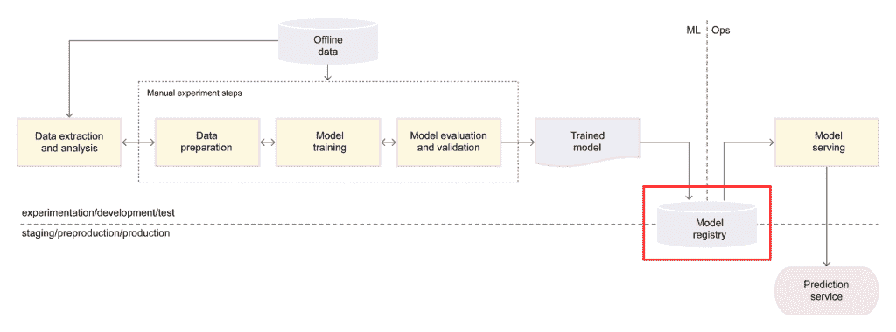
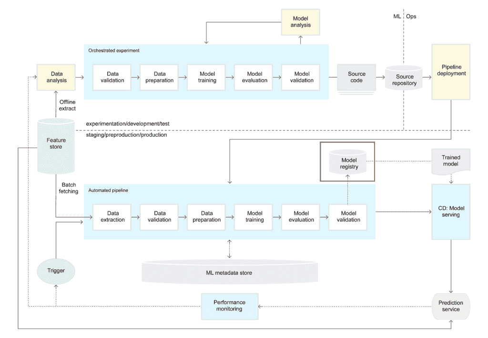
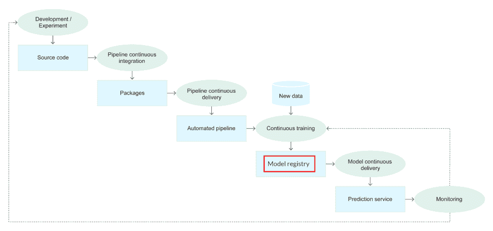
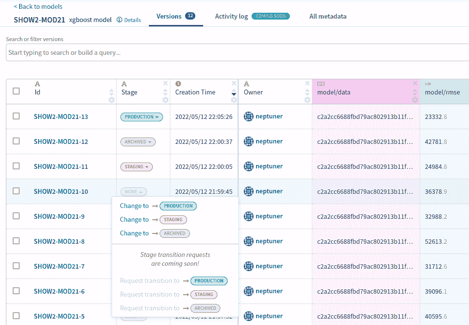
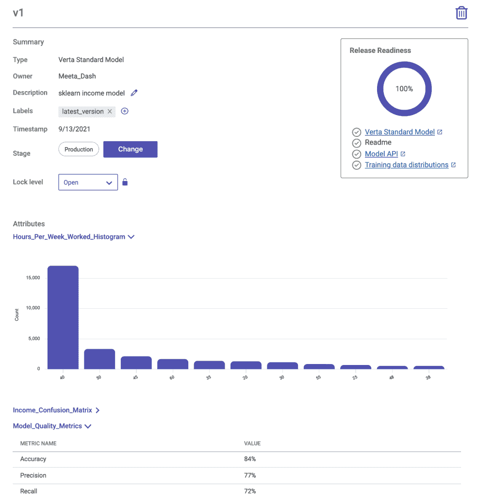

# ML 模型注册中心:它是什么，为什么重要，如何实现

> 原文：<https://web.archive.org/web/https://neptune.ai/blog/ml-model-registry>

为什么一定要多了解 model registry？如果你曾经是团队中唯一的数据科学家，你可能会有这种感觉:你开始从事一个机器学习项目，并进行一系列实验，产生各种模型(和工件)，你通过非标准的命名约定“跟踪”这些模型(和工件)。由于您用于模型文件的命名约定不明确，所以您需要花费一些时间来找到您训练的最佳模型。当您最终这样做时，您决定要么将原始工件交给操作团队，要么更糟，自己部署它。

运营团队收集了您的模型，并告诉您他们需要更多关于以下方面的信息:

## 1 如何使用

*   2 如果模型被测试
*   3 模型的运行时依赖性
*   4 和其他重要的操作信息
*   因为您所做的只是构建模型并交付，所以可能很难与他们合作来成功部署。

现在想象另一个场景。你的公司正计划推出更多基于 ml 的产品/特性。一名数据科学家、工程师，甚至可能还有一名产品经理加入团队。当您独自工作时，尽管您的模型部署起来很痛苦(如果部署了的话)，但是您的工作流是有效的。现在您有了新的队友，他们开始询问您的模型版本，您意识到将模型存储在文件中并不是那么容易管理的。这是您真正感受到没有有效的方法来共享您的模型版本、工件和模型元数据的痛苦的时刻。

问题是，在这一点上，没有简单的方法回到过去，建立一些适当的东西。

您经过改进的新跨职能团队向您询问:

我们在哪里可以找到该模型的最佳版本，以便我们可以审计、测试、部署或重用它？

*   这个模型是怎么训练出来的？
*   我们如何跟踪每个模型的文档，以确保它们是兼容的，并且人们可以知道关于它的必要细节，包括元数据？
*   我们如何在模型投入使用之前或者甚至在它们被部署之后对其进行评审呢？
*   我们如何集成工具和服务，使新项目的发布更加容易？
*   你能责怪他们吗？

他们希望了解生产中运行的是什么，如何改进它或回滚到以前的版本。这很有道理。

有了这些美好的经历，你开始了你的下一个项目，并寻找一个处理它的工具。你会发现这篇关于 ML 模型注册的文章。

在本文中，您将了解到:

## 什么是模型注册中心？

## 模型注册中心是一个中央存储库，它允许模型开发人员发布生产就绪的模型以便于访问。有了注册中心，开发人员还可以与其他团队和利益相关者一起工作，共同管理组织中所有模型的生命周期。数据科学家可以将训练好的模型推送到模型注册中心。一旦在注册表中，您的模型就可以在类似于下面的工作流中进行测试、验证和部署到生产中了:

模型注册中心提供:

*What is a model registry? | Source: Author*

所有型号的集中存储，

*   和用于模型生命周期管理协作单元。
*   让我们仔细看看以上几点:

集中存储

### 模型注册中心提供了一个中央存储单元，用于保存模型(包括模型工件),以便应用程序(或服务)进行检索。没有模型注册中心，模型工件将被存储在难以跟踪的文件中，并被保存到任何已建立的源代码存储库中。有了模型注册中心，通过集中存储这些模型的区域，这个过程变得更加简单。

集中式存储还使数据团队能够拥有所有模型状态的单一视图，从而使协作更加容易。下面的例子展示了不同模型的单一视图，模型工件存储在模型注册中心:

协作单位

模型注册中心为 ML 团队提供了一个协作单元来处理和共享模型。它通过以下方式实现协作:

*A list of different models registered in the model registry | [Source](https://web.archive.org/web/20221008041956/https://app.neptune.ai/common/showcase-model-registry/models)*

### 弥合实验和生产活动之间的差距。

为团队提供一个集中的 UI(用户界面)来协作开发模型。

*   为下游系统提供使用模型的接口。
*   弥合实验和生产活动之间的差距
*   模型注册中心是 [MLOps](/web/20221008041956/https://neptune.ai/blog/mlops) 的核心组件，它使模型开发团队、软件开发团队和操作团队能够协作。这是组织内技术和文化的重要组成部分。构建机器学习模型和操作化它们之间太熟悉的差距可以通过使用模型注册表作为 MLOps 堆栈的一部分来弥合。

#### Bridging the gap between experiment and production activities

该注册中心以及自动化培训管道还可以实现生产中模型服务的持续集成、交付和培训(CI/CD/CT ),因为模型可以被频繁地更新、推送到该注册中心，并且全部部署在管道中。

为团队提供一个集中的 UI(用户界面)来协作开发模型

*Model registry is a central component of MLOps | Source: modified and adapted from [YouTube](https://web.archive.org/web/20221008041956/https://youtu.be/WrieKPgXZyo?t=643)*

模型注册为团队提供了对他们模型的可见性。有了中央界面，团队可以:

#### 搜索模型，

查看模型的状态(如果它们正在暂存、部署或退役)，

*   批准或不批准不同阶段的模型，
*   并查看必要的文档。
*   这使得团队中的每个人更容易发现模型。如果需要部署模型，运营团队可以轻松地:
*   搜索一下，

查找验证结果和其他指标，

*   打包模型(如果需要的话)，
*   并将它从暂存环境移动到生产环境。
*   这改善了跨职能团队在 ML 项目上的合作方式。
*   And move it from the staging environment to the production environment. 

通过 UI，模型评审者(或 QA 工程师)还可以在批准、发布或审核治理的生产模型之前，审核模型以确保它适合部署到生产中。

为下游服务提供使用模型的接口

*Inspecting model’s versions through the dashboard in Neptune.ai | [Source](https://web.archive.org/web/20221008041956/https://app.neptune.ai/common/showcase-model-registry/m/SHOW2-MOD21/versions)*

模型注册中心提供了接口，使得下游服务能够通过 API 集成来使用模型。通过这种集成，下游系统可以很容易地获得模型的最新(或可接受的)版本。该集成还可以跟踪模型的离线和在线评估指标。正如我们在上一节中所讨论的，这使得使用 ML 管道构建 CI/CD/CT 的自动化设置变得容易。下游服务可以是模型用户、自动化作业或 REST 服务，它们可以使用最稳定的——或任何版本的模型。

#### 为什么需要模型注册中心？

由于在上一节中已经向您介绍了什么是模型注册中心，您的问题可能是为什么它对您有用，以及它给您的工作流带来了什么好处。模型注册表支持机器学习操作。回想一下，MLOps 的[四大支柱包括:](https://web.archive.org/web/20221008041956/https://www.datarobot.com/podcasts/mlops-model-deployment/)

## Why do you need a model registry?

1 生产模式部署

## 2 生产模式监控

*   3 车型生命周期管理

*   4 生产模式治理
*   现在，让我们了解一下 MLOps 工作流中的模型注册组件如何支持部署、管理和治理支柱。
*   Model registry 支持更快地部署您的模型

您在前面已经了解到，模型注册中心支持协作的方式之一是它在实验和生产活动之间架起了一座桥梁。这导致您的生产模型的更快推出。此外，模型注册中心存储了经过训练的模型，以便任何集成的应用程序或服务能够快速方便地检索，这最终是您在理想的自动化设置中想要的。

### 有了模型注册中心，软件工程师和评审人员可以很容易地识别和选择经过训练的模型的最佳版本(基于评估度量)，因此模型可以被测试、评审和发布到产品中。这使得它成为培训和部署管道的一个很好的统一组件，因为在从实验到生产环境的生产就绪模型的移交中有更少的摩擦。

模型注册简化了模型生命周期管理

当你在一个大型组织中工作，有许多实验在运行，许多模型，和跨职能团队，管理这些模型的生命周期通常是一个具有挑战性的过程。虽然管理一个或几个模型是可能的，但是在大多数情况下，您将有许多模型在生产中运行并服务于不同的用例。模型注册中心有助于应对这一挑战，并简化模型生命周期的管理。使用注册表，您可以:

### **在一个组织有序、可搜索的中央存储库中注册、跟踪和发布**您的经过培训、部署和淘汰的模型。

**存储** **您训练好的模型**的元数据，以及它们的运行时依赖关系，从而简化部署过程。

*   **建立自动化管道**使生产模式的持续集成、交付和培训成为可能。
*   **将生产中运行的模型**(冠军模型)与试运行环境中新训练的模型(或挑战者模型)进行比较。
*   以下是一个在模型注册表中注册和版本化的训练模型的示例，其中包括模型训练摘要和相关元数据:
*   **Compare models running in production** (champion models) to freshly trained models (or challenger models) in the staging environment.

注册中心还可以跟踪和存储模型的在线和离线评估指标。利用这一功能，您可以轻松地查找生产中的模型，以检测模型性能的下降(或[概念漂移](https://web.archive.org/web/20221008041956/https://en.wikipedia.org/wiki/Concept_drift))。您还可以比较它们的在线和离线性能，以查看哪些生产模型需要审查、维护或归档。

您不仅可以在生产和培训中跟踪模型的评估指标，还可以跟踪系统指标，以了解哪些模型消耗了最多的应用程序资源(CPU、内存和 GPU 使用)。以下是 Neptune.ai 模型注册中心跟踪离线系统和最佳模型评估指标的示例:

*Example of a trained model’s version in the Neptune model registry | [Source](https://web.archive.org/web/20221008041956/https://app.neptune.ai/common/showcase-model-registry/m/SHOW2-MOD21/v/SHOW2-MOD21-12/metadata?path=model%2F&attribute=data&file=train_week10.csv&filePath=.)*

The registry can also track and store online and offline evaluation metrics for the models. With this functionality, you can easily look up models that are in production to detect a drop in the performance of the model (or [concept drift](https://web.archive.org/web/20221008041956/https://en.wikipedia.org/wiki/Concept_drift)). You can also compare their online and offline performance to see which of the production models need to be reviewed, maintained, or archived.

模型注册支持生产模型治理

模型注册中心做得非常好的一件事是集中模型并组织它们的相关细节。有了注册表，您就有了模型在其生命周期的不同阶段的中心真实来源，包括:

*Trained model monitoring on Neptune.ai | [Source](https://web.archive.org/web/20221008041956/https://app.neptune.ai/common/example-project-tensorflow-keras/e/TFKERAS-9/monitoring)*

### 发展，

验证，

*   部署，
*   和监控。
*   这有助于创建可见性和模型发现，这对于特定行业(如卫生、金融和法律)中需要全面监管投诉流程的模型非常重要。
*   负责确保法律合规性的用户应该能够轻松查看注册表中的模型，并理解:

模型是如何被训练的，

模型是在什么版本的数据上被训练的，

*   在充分了解模型的能力和局限性的情况下，模型表现最佳并产生一致结果的条件。
*   一个标准的模型注册还将加强模型的文档和报告，确保结果是可重复的，并且可以被任何审计用户复制。评审、批准、发布和回滚都是模型启动过程中的步骤，注册中心可以提供帮助。这些选择基于多种因素，包括离线表现、偏见和公平措施以及在线实验的结果。
*   模型注册还可以提高模型的安全性

必须对模型以及用于构建模型的底层包进行漏洞扫描，尤其是在使用大量包来开发和部署模型时。模型注册中心可以管理包的特定版本，您可以扫描并删除可能对系统造成威胁的安全漏洞。

### 模型同样容易受到恶意攻击，因此，必须对它们进行维护和保护。在某些情况下，必须采用[最低特权访问安全概念](https://web.archive.org/web/20221008041956/https://en.wikipedia.org/wiki/Principle_of_least_privilege)，以便只有授权用户才能访问指定的模型信息、数据隐私以及保护[【PII】](https://web.archive.org/web/20221008041956/https://searchsecurity.techtarget.com/definition/personally-identifiable-information-PII)和其他资源。

模型注册中心在 MLOps 堆栈中的什么位置？

如果您想要高效且大规模地运行机器学习项目，您很可能需要将模型注册表添加到您的 MLOps 堆栈中。根据您在 MLOps 栈中的实现级别,您对模型注册中心的需求会有所不同。哪里合适？好吧，回想一下我们之前学过的，模型注册处位于机器学习开发和部署之间。

## MLOps 级别 0 中的模型注册表

如果您处于 MLOps 的[级别 0](https://web.archive.org/web/20221008041956/https://cloud.google.com/architecture/mlops-continuous-delivery-and-automation-pipelines-in-machine-learning#mlops_level_0_manual_process) 实现，那么您的带有模型注册中心的工作流可能如下所示:

### 实验步骤的输出被输入到模型注册中心。这涉及到一个手动过程，数据科学家准备模型工件和元数据，也可以在注册它们之前打包它们([序列化](https://web.archive.org/web/20221008041956/https://en.wikipedia.org/wiki/Serialization)，[容器化](https://web.archive.org/web/20221008041956/https://www.ibm.com/cloud/learn/containerization))。在将打包的模型部署到可以与其他应用程序集成的预测服务引擎之前，运营团队可以将打包的模型推送到临时环境进行测试。

MLOps 级中的模型注册表

*MLOps level 0 workflow with a model registry | [Source](https://web.archive.org/web/20221008041956/https://cloud.google.com/architecture/mlops-continuous-delivery-and-automation-pipelines-in-machine-learning#mlops_level_0_manual_process) (modified)*

与 0 级(其中工作流是手动过程)相反，[1 级](https://web.archive.org/web/20221008041956/https://cloud.google.com/architecture/mlops-continuous-delivery-and-automation-pipelines-in-machine-learning#mlops_level_1_ml_pipeline_automation)中工作流的目标是通过自动化 ML 管道来执行模型的连续训练。这是一个模型注册中心能够很好实现的过程，因为它能够与管道集成。在这一级，整个管道被部署，并且当模型在所提供的数据集上被训练时，输出(被训练的模型和元数据)被馈送到模型注册中心，在那里它可以被登台，并且如果它通过必要的测试和检查，它可以被馈送到连续交付管道用于发布。

### MLOps 级别 2 中的模型注册表

在 MLOps 工作流程的第 1 级中，模型注册中心的角色也与第 2 级的角色相同——自动化管道将经过训练的模型交付到模型注册中心，在那里进行准备，可能通过 QA 检查，然后发送到连续交付管道:

*MLOps level 1 workflow with a model registry | [Source](https://web.archive.org/web/20221008041956/https://cloud.google.com/architecture/mlops-continuous-delivery-and-automation-pipelines-in-machine-learning#mlops_level_1_ml_pipeline_automation) (modified)*

### 模型注册中心在任何自动化管道中都是一个至关重要的组件，因为事件触发器可以与它集成，以便在对新数据或归档模型进行重新训练时提升具有良好指标的模型。

模型登记册的关键功能

*Stages of the CI/CD automated ML pipeline with a model registry | [Source](https://web.archive.org/web/20221008041956/https://cloud.google.com/architecture/mlops-continuous-delivery-and-automation-pipelines-in-machine-learning#mlops_level_2_cicd_pipeline_automation) (modified)*

在上一节中，我们学习了模型注册如何适应您的 MLOps 工作流。为了理解模型注册中心的关键功能及其必备条件，让我们看看它是如何适应开发和运营的。

## 模型注册表中的**关键功能包括:**

与实验管理系统或培训管道集成。

*Workflow components of an ideal model registry | Source: Author*

为您的定型模型提供登台环境。

*   与自动化的模型交付工具和服务集成。
*   与模型部署工具集成。
*   整合实验管理系统或培训管道
*   模型注册中心必须能够与输出经过训练的模型的系统集成。经过训练的模型可以是原始的工件(模型权重、配置和元数据)或者是为了与生产环境兼容而被序列化为文件(例如 ONNX 文件)或者被容器化(使用 Docker)以导出到生产环境的模型。

### 模型注册中心**应该能够**:

**登记**车型、

**给**分配一个版本，

*   注意模型被训练的数据集的**版本，**
*   添加**注释**和**标签**，
*   从实验管理系统中检索模型上的**参数**、**验证结果**(包括度量和可视化)，以及其他**相关的模型元数据**。
*   **为了使协作更容易**，注册管理机构还应包括以下详细信息:
*   模型所有者或开发者，

模型在实验运行 id 下被训练，

*   版本化模型源代码，
*   用于训练模型(和版本)的环境运行时依赖性，
*   评论和模型改变历史，
*   和模型文档。
*   为您的训练模型集成登台环境
*   模型注册中心应该提供与登台环境集成的功能，以便在模型上运行所有类型的检查和平衡。这些检查可以包括在模型被提升到生产环境之前的[集成测试](https://web.archive.org/web/20221008041956/https://www.guru99.com/integration-testing.html)(与其他应用程序)和其他 [QA 测试](https://web.archive.org/web/20221008041956/https://www.guru99.com/all-about-quality-assurance.html)。

### 应该为该环境中的模型启用共享和协作，以便部署工程师可以与数据科学家合作来测试模型，并确保它们适合部署。

在阶段环境中，模型评审者还应该能够对模型执行公平性检查，以确保它:

输出**可解释的结果**，

符合**法规要求**，

*   并提供**有用的商业利益**。
*   通常，治理和批准工作流应该在这种环境中配置。对于这种环境中的模型，还应该有访问级别控制和安全授权，尤其是那些使用带有敏感信息的数据进行训练的模型。
*   自动化是构建任何可伸缩软件的关键部分。在机器学习中，建立自动化管道将允许你花更多的时间**来构建新产品，而不是维护旧模型**。

模型注册中心应该能够与管道自动化工具集成，并提供自定义 API，允许您插入自定义工作流工具。例如，使用 webhooks 来触发基于注册表中预定义事件的下游操作。

您还应该能够通过**开发(培训)**、**登台(测试)**、**生产(服务)**等不同环境**配置模型推广方案**。性能是构建自动化管道的关键要求。模型注册中心应该对基于事件或时间表的自动化作业高度可用，以支持模型的持续培训和交付。

最终，必须部署模型，部署过程越高效越好。模型注册中心应该能够与下游服务和 REST 服务集成，这些服务可以消费模型，并在生产环境中为模型服务。

注册中心还应该能够收集生产模型的实时(或聚合)指标，以记录模型的性能细节。这将有助于模型之间的比较(已部署的和已部署的)，以及审计生产模型以供审查。

如何建立一个 ML 模型注册中心？

构建与管理和购买

## 为您的 MLOps 工作流设置模型注册中心需要您决定是构建一个、维护一个还是购买一个。到目前为止，在本指南中，我们已经重点了解了什么是模型注册中心以及为什么您需要一个模型注册中心。您还了解了模型注册中心在 MLOps 工作流的特定实现级别中的位置。我们还发现，无论您处于什么样的 MLOps 实现级别，模型注册中心都是有用的。也许级别越高，您就越需要一个模型注册中心。

### 我想到的一个更重要的决定是，您是应该构建自己的、管理的还是自己托管的解决方案，还是购买完全托管的解决方案。让我们仔细看看这些决定中的每一个，以及在做出选择之前要考虑的因素。

构建模型注册中心解决方案

像任何软件解决方案一样，如果你了解关键功能和需求，你可以[自己构建一个系统](https://web.archive.org/web/20221008041956/https://mlinproduction.com/model-registries-for-ml-deployment-deployment-series-06/)。模型注册中心就是这种情况。您可能希望设置以下内容:

### [**存储对象**](https://web.archive.org/web/20221008041956/https://en.wikipedia.org/wiki/Object_storage) 为模型和构件。

[**数据库**](https://web.archive.org/web/20221008041956/https://en.wikipedia.org/wiki/Database) 用于记录模型详细信息。

*   [**API 集成**](https://web.archive.org/web/20221008041956/https://tray.io/blog/what-is-an-api-integration-for-non-technical-people) 用于接收模型、跨各种环境推广模型以及从不同环境收集模型信息。
*   [**用户界面**](https://web.archive.org/web/20221008041956/https://www.indeed.com/career-advice/career-development/user-interface) (UI)供 ML 团队与可视化工作流进行交互。
*   虽然自己构建解决方案可能看起来很理想，但您应该考虑以下因素:
*   **激励**:构建您的解决方案的激励是什么？是为了定制还是为了拥有解决方案的专有许可证？

**人力资源**:你有能力和技能来构建你的解决方案吗？

*   **时间**:你需要多长时间来构建一个解决方案，值得等待吗？
*   **运营**:当解决方案最终建成时，谁来维护它的运营？
*   **成本**:构建一个解决方案需要多少成本，包括解决方案的维护？
*   维护自托管的模型注册中心
*   如果您不想构建解决方案，另一个可以考虑的选择是自己维护现有的解决方案。在这个场景中，解决方案已经构建好了，但是您可能需要管理一些特性，比如对象存储和数据库。这些现有的解决方案大多是开源解决方案。

### 以下是需要考虑的因素:

**解决方案类型**:您是选择没有许可成本的开源解决方案还是有许可成本的闭源解决方案？

**运营**:谁来管理解决方案？该解决方案是否支持一致的维护和软件更新？

*   **成本**:就托管解决方案的基础设施和运行成本而言，运营该解决方案的成本是多少？
*   **特性**:已经实现了哪些特性，有哪些特性是你要自己构建和管理的？与构建您的解决方案相比，它是否值得采用？
*   **支持**:如果在操作过程中发生故障，有什么类型的支持？有社区或专门的客户支持渠道吗？对于开源解决方案，虽然您可能有一个社区，但与闭源解决方案相比，您可能缺少解决问题所需的必要的开发人员支持。
*   **可访问性**:开始使用该解决方案有多容易？文档是否足够全面？从模型评审人员到模型开发人员和软件工程师，每个人都能直观地使用该解决方案吗？
*   购买全面管理解决方案的许可证
*   要考虑的最后一个选项是订阅完全托管的解决方案，由解决方案供应商处理注册中心的运营和管理。在这种情况下，您不必担心构建或维护解决方案。您只需要确保您的系统和服务能够与注册中心集成。

### 以下是需要考虑的因素:

**行业类型**:模型是为什么类型的行业打造的？模特们学到了哪些敏感信息？是否有数据隐私合规措施？模型只允许留在内部吗？

**特性**:该解决方案中是否提供了任何模型注册中心的关键特性和功能？有哪些额外功能可用，它们与您的工作流程有多大关联？

*   **成本:**购买许可证的成本是多少，这些功能是否物有所值？
*   **安全性**:托管解决方案的平台有多安全？抗第三方攻击吗？
*   **性能**:注册表的性能高吗？对于模型太大的情况，注册中心能提供模型让服务以低延迟消费吗？
*   **可用性**:解决方案的正常运行时间有多长，是否满足您要求的[服务水平协议(SLA)](https://web.archive.org/web/20221008041956/https://en.wikipedia.org/wiki/Service-level_agreement) ？
*   **支持**:万一事情变糟，可以提供什么级别的支持？
*   **可访问性**:开始使用该解决方案有多容易？文档和学习支持是否足够好？在使用方面有什么学习曲线？
*   现在，您已经了解了可供您决定是否要选择解决方案的各种选项。您还应该仔细考虑每个选项下的因素，以便做出最佳决策。让我们来看看市场上的一些模型注册中心解决方案。
*   有哪些 ML 模型注册解决方案？

1.Neptune.ai 模型注册表

## **类型**:专有，提供免费和付费服务。

### **选项**:托管(自托管)、完全托管的产品。

Neptune 是 MLOps 的元数据存储库，为运行大量实验的研究和生产团队而构建。

它为您提供了一个中心位置来记录、存储、显示、组织、比较和查询机器学习生命周期中生成的所有元数据。

*Neptune model registry dashboard | [Source](/web/20221008041956/https://neptune.ai/product/model-registry)*

个人和组织使用 Neptune 进行[实验跟踪](/web/20221008041956/https://neptune.ai/product/experiment-tracking)和[模型注册](/web/20221008041956/https://neptune.ai/product/model-registry)来控制他们的实验和模型开发。

特征

海王星让你:

#### **创建模型**并跟踪通用模型元数据，例如模型签名和验证数据集。

**为您的模型创建版本**:

*   日志参数和其他元数据可能会从一个版本更改到另一个版本。
*   跟踪或存储模型二进制文件。
    *   跟踪特定模型版本的性能。
    *   **使用四个可用阶段管理模型阶段转换**。
    *   **查询并下载**任何存储的模型文件和元数据。
*   查看[型号注册文档](https://web.archive.org/web/20221008041956/https://docs.neptune.ai/how-to-guides/model-registry)了解更多详情。
*   海王星商店:

数据集元数据，

模型源代码版本，

*   环境配置版本，
*   模型参数，
*   模型评估指标，
*   模型二进制。
*   它[支持和存储许多 ML 模型相关的元数据](https://web.archive.org/web/20221008041956/https://docs.neptune.ai/you-should-know/what-can-you-log-and-display)类型，您可以对建模过程中生成的大多数元数据进行版本化、显示和查询。
*   就**成本**而言，Neptune 既有[自托管选项](/web/20221008041956/https://neptune.ai/pricing/server)可用，也有[各种订阅层级](/web/20221008041956/https://neptune.ai/pricing)的全托管云产品。

如果您想了解更多信息:

➡️看到了[产品页面](/web/20221008041956/https://neptune.ai/product/model-registry)

### ➡️看到了[文档](https://web.archive.org/web/20221008041956/https://docs.neptune.ai/)

➡️检查出一个[示例项目](https://web.archive.org/web/20221008041956/https://app.neptune.ai/common/showcase-model-registry/models)(不需要注册)

2.MLflow 模型注册表

**类型**:开源

### **选项**:托管(自托管)、完全托管的产品。

[MLflow Model Registry](https://web.archive.org/web/20221008041956/https://www.mlflow.org/docs/latest/model-registry.html#mlflow-model-registry) 组件是一个集中式模型存储、一组 API 和 UI，用于协作管理 MLflow 模型的整个生命周期。它提供了模型沿袭(MLflow 实验和运行产生了模型)、模型版本化、阶段转换(例如从阶段转换到生产)和注释。模型注册组件是 2019 年 MLflow 用户的迫切需求之一。

MLflow 模型注册中心是当今市场上为数不多的开源模型注册中心之一。你可以决定在你的基础设施上管理这个 T1，或者在像 T4 数据块 T5 这样的平台上使用 T2 完全管理的实现 T3。

*MLflow model registry dashboard | [Source](https://web.archive.org/web/20221008041956/https://www.mlflow.org/docs/latest/model-registry.html#ui-workflow)*

特征

MLflow 提供:

#### **注释和描述工具**用于标记模型，提供文档和模型信息，如模型注册日期、注册模型的修改历史、模型所有者、阶段、版本等。

**模型版本**在更新时自动跟踪注册模型的版本。

*   一个 **API 集成**，将机器学习模型作为 RESTful APIs，用于在线测试、仪表板更新等。
*   **CI/CD 工作流集成**记录阶段转换、请求、审查和批准变更，作为 CI/CD 管道的一部分，以实现更好的控制和治理。
*   一个**模型阶段特性**为每个模型版本分配预设或定制的阶段，如“阶段”和“生产”来代表模型的生命周期。
*   **促销方案配置**方便在不同阶段之间移动模型。
*   MLflow 商店:
*   模型人工制品，

元数据，

*   参数，
*   度量标准。
*   定价将取决于您选择的选项—自主托管解决方案或完全托管的产品。
*   你可以在这里了解更多关于工作流程[的信息，在这里](https://web.archive.org/web/20221008041956/https://www.mlflow.org/docs/latest/model-registry.html#model-registry-workflows)开始使用 MLflow [。](https://web.archive.org/web/20221008041956/https://www.mlflow.org/docs/latest/quickstart.html)

3.亚马逊 Sagemaker 模型注册表

**类型**:捆绑 [SageMaker](https://web.archive.org/web/20221008041956/https://aws.amazon.com/sagemaker/) 的自由层和按需[定价](https://web.archive.org/web/20221008041956/https://aws.amazon.com/sagemaker/pricing/)。

### **选项**:完全管理的产品

亚马逊 SageMaker 是一个完全托管的服务，开发者可以在 ML 开发的每一步使用它，包括模型注册。[模型注册中心](https://web.archive.org/web/20221008041956/https://docs.aws.amazon.com/sagemaker/latest/dg/model-registry.html%5C)是 SageMaker 中[MLOps 套件](https://web.archive.org/web/20221008041956/https://aws.amazon.com/sagemaker/mlops/)的一部分，该套件通过在整个组织中**自动化**和**标准化** MLOps 实践来帮助用户构建和操作机器学习解决方案。

特征

*Amazon SageMaker model registry | [Source](https://web.archive.org/web/20221008041956/https://docs.aws.amazon.com/sagemaker/latest/dg/model-registry-details.html)*

使用 SageMaker 模型注册表，您可以执行以下操作:

#### **生产用目录型号**。

管理**型号版本**。

*   **将元数据**，例如训练指标，与模型相关联。
*   管理模型的**审批状态。**
*   将模型部署到生产中。
*   使用 CI/CD 自动进行模型部署。
*   您可以创建一个模型组来跟踪您为解决特定问题而训练的所有模型。然后，您训练的每个模型都可以被注册，模型注册中心会将它作为一个新的模型版本添加到模型组中。典型的工作流可能如下所示:
*   创建模型组。

使用训练模型的 [SageMaker 管道](https://web.archive.org/web/20221008041956/https://docs.aws.amazon.com/sagemaker/latest/dg/pipelines-build.html)创建一个 ML 管道。

*   对于 ML 管道的每次运行，创建一个模型版本，并在第一步中创建的模型组中注册。
*   使用模型注册中心的成本与 SageMaker [定价层](https://web.archive.org/web/20221008041956/https://aws.amazon.com/sagemaker/pricing/)捆绑在一起。你可以在[文档](https://web.archive.org/web/20221008041956/https://docs.aws.amazon.com/sagemaker/latest/dg/model-registry.html)中了解更多关于 SageMaker 的模型注册组件的信息。
*   4.Verta.ai 模型注册表

**Type** :专有，带有开源、SaaS 和企业产品。

### **选项**:完全管理的产品。

Verta.ai 模型注册表帮助您在一个位置管理您的 AI-ML 模型。它提供了一些特性，使您能够打包、验证和可靠地提升发布就绪模型，并应用安全的发布和治理实践。

特征

*Verta.ai model registry dashboard | [Source](https://web.archive.org/web/20221008041956/https://blog.verta.ai/introducing-verta-model-registry)*

它提供了一个**统一中心来发布发布就绪模型**,允许您:

#### 连接**实验管理系统**进行**端到端的信息跟踪**。

*   在一个中央存储库中发布所有的**模型元数据**、**文档**和**工件**。
    *   从模型实验中选择**最适合的模型**和**准备发布**。
    *   记录**状态转换**和**管理从开发、试运行、生产到归档的发布生命周期**。
    *   它支持**模型验证**和 **CI/CD 自动化**，允许您:
    *   与 Jenkins、Chef 等现有 CI/CD 渠道整合。

*   使用 **webhooks 触发下游动作**进行模型验证和部署。
    *   自动**跟踪型号版本**和**标记的版本**。
    *   设置**粒度访问控制**编辑、审阅者和协作者。
    *   访问**详细的审计日志**以了解合规性。
*   一旦模型通过基本的**安全性和公平性检查**，就发布它们。
*   您可以在此页面上了解有关可用[定价等级的更多信息。你可以在这个](https://web.archive.org/web/20221008041956/https://www.verta.ai/pricing)[页面](https://web.archive.org/web/20221008041956/https://blog.verta.ai/introducing-verta-model-registry)上了解更多关于 Verta 注册表的信息。
*   想了解市场上更多可用的解决方案吗？

澄清一些模型注册中心的误解

### 模型注册中心与模型存储

## 一个常见的误解是，模型注册中心只是一个作为营销术语的[模型商店](/web/20221008041956/https://neptune.ai/blog/mlops-model-stores)。虽然这两个组件在功能上几乎没有区别，并且两者都可以被一些从业者互换使用，但是它们之间还是有一些细微的差别。

### 模型存储是模型注册的超集——这意味着在模型存储中，您可以找到模型注册组件。store 是一个服务，其他服务可以通过它从注册表中检索模型。在模型注册中心，您可以存储和获取模型(就像 docker 注册中心)，但是在模型存储中心，您可以拥有完整的日志、发现、资产、管道、元数据、所有模型信息，甚至是用于构建新模型的蓝图。典型的模型商店的例子有谷歌的人工智能中心和拥抱面孔模型库。

模型注册与实验跟踪

MLOps 世界中另一个常见的误解是注册表只是“[实验跟踪](/web/20221008041956/https://neptune.ai/blog/ml-experiment-tracking)重命名”。你可能已经知道，这与事实相差甚远。模型注册必须与[实验管理系统](/web/20221008041956/https://neptune.ai/blog/best-ml-experiment-tracking-tools)(跟踪实验)集成，以注册来自各种实验运行的模型，使它们更容易找到和使用。让我们来看看模型注册和实验管理系统之间的一些关键区别。

### Model registry vs experiment tracking

模型注册表

实验跟踪

在中央存储库中存储经过培训的、生产的和退役的模型

为了跟踪不同参数配置和组合的实验运行

Model registry:

确保模型是可发现的，并且可以被任何用户或系统访问

Experiment tracking:

确保实验更容易管理和合作

Model registry:

与实验跟踪系统集成，以注册来自成功实验的模型，包括模型和实验元数据

Experiment tracking:

与培训管道集成，以执行实验运行并跟踪实验细节，包括数据集版本和元数据

Model registry:

MLOps 和生产模型的关键部分

Experiment tracking:

在模型开发阶段最有用，但对模型的操作有间接影响。

Model registry:

结论

Experiment tracking:

在本指南中，到目前为止，您已经了解到模型注册能够使机器学习项目成功运作。它提供了模型的可见性，并使用户能够轻松地发现和使用模型。使用模型注册表，您可以:

有把握地部署模型。

## 有效管理模型生命周期。

启用了自动化工作流。

*   在有组织的工作流程中共享和协作模型和项目。
*   适当地管理机器学习模型。
*   下一步是你挑选一个解决方案，看看它是否能改善你的 MLOps 工作流程。如果您是一名个人数据科学家，Neptune 是免费的，并且在 5 分钟内就可以轻松上手——但是当然，让这篇文章作为您的指南，根据您的 MLOps 实施水平和值得考虑的因素做出具体的决定。
*   为更多的建设和运作干杯！
*   参考资料和资源

斯蒂芬·奥拉德勒

开发者倡导者和 MLOps 技术内容创建者。

### **阅读下一篇**

### Continuum Industries 案例研究:如何跟踪、监控和可视化 CI/CD 管道

7 分钟阅读| 2021 年 8 月 9 日更新

* * *

**READ NEXT**

## [Continuum Industries](https://web.archive.org/web/20221008041956/https://www.continuum.industries/) 是一家基础设施行业的公司，希望自动化和优化线性基础设施资产的设计，如水管、架空传输线、海底电力线或电信电缆。

其核心产品 Optioneer 允许客户输入工程设计假设和地理空间数据，并且**使用进化优化算法来寻找可能的解决方案，以在给定约束的情况下连接 A 点到 B 点。**

[Continuum Industries](https://web.archive.org/web/20221008041956/https://www.continuum.industries/) is a company in the infrastructure industry that wants to automate and optimize the design of linear infrastructure assets like water pipelines, overhead transmission lines, subsea power lines, or telecommunication cables.  

首席科学家安德烈亚斯·马莱科斯(Andreas Malekos)致力于研究人工智能发动机，他解释道:

“建造像电力线这样的东西是一个巨大的项目，所以你必须在开始之前获得正确的设计。你看到的设计越合理，你就能做出更好的决定。Optioneer 可以在几分钟内为您提供设计资产，而成本只是传统设计方法的一小部分。”

但是，创建和操作 Optioneer 引擎比看起来更具挑战性:

目标函数不代表现实

有很多土木工程师事先不知道的假设

不同的客户给它提出完全不同的问题，算法需要足够健壮来处理这些问题

*   与其构建完美的解决方案，不如向他们展示一系列有趣的设计选项，以便他们做出明智的决策。
*   引擎团队利用来自机械工程、电子工程、计算物理、应用数学和软件工程的各种技能来实现这一目标。
*   问题

无论是否使用人工智能，构建一个成功的软件产品的一个副作用是，人们依赖它工作。当人们依赖您的优化引擎做出价值百万美元的基础设施设计决策时，您需要有一个强大的质量保证(QA)。

正如 Andreas 所指出的，他们必须能够说，他们返回给用户的解决方案是:

## **好**，意思是这是一个土木工程师可以看到并同意的结果

**更正**，这意味着计算并返回给最终用户的所有不同工程数量都尽可能准确

除此之外，该团队还在不断改进优化引擎。但要做到这一点，您必须确保这些变化:

*   不要以这样或那样的方式破坏算法
*   实际上，它们不仅改善了一个基础设施问题的结果，还改善了所有问题的结果

基本上，您需要**建立适当的验证和测试，**但是团队试图解决的问题的性质带来了额外的挑战:

*   您无法自动判断算法输出是否正确。**这不像在 ML 中，你已经标记了数据**来计算你的评估集的准确度或召回率。
*   您**需要一组示例问题，代表算法在生产中需要解决的那类问题的**。此外，这些问题需要被版本化，以便尽可能容易地实现可重复性。

Basically, you need to **set up a proper validation and testing,** but the nature of the problem the team is trying to solve presents additional challenges:

*   You cannot automatically tell whether an algorithm output is correct or not. **It is not like in ML where you have labeled data** to compute accuracy or recall on your evaluation set. 
*   You **need a set of example problems that is representative** of the kind of problem that the algorithm will be asked to solve in production. Furthermore, these problems need to be versioned so that repeatability is as easily achievable as possible.

[Continue reading ->](/web/20221008041956/https://neptune.ai/customers/continuum-industries)

* * *