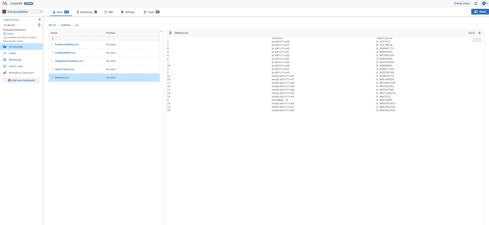
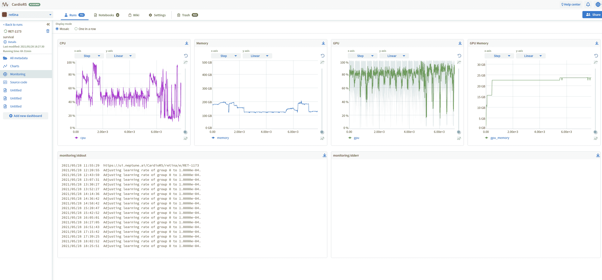
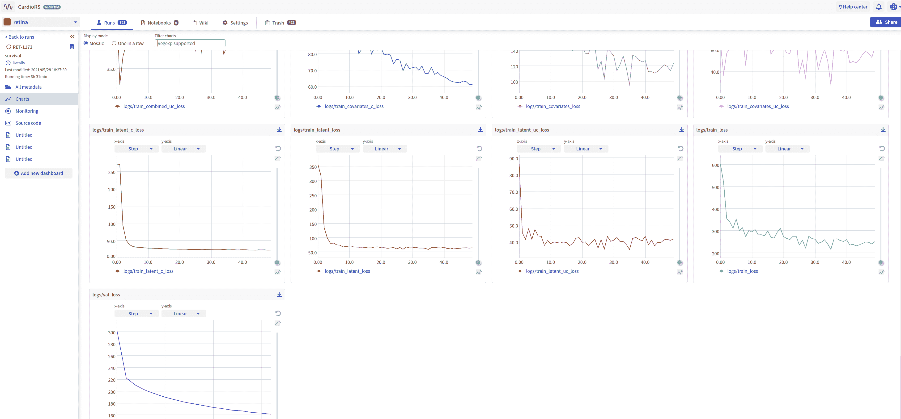
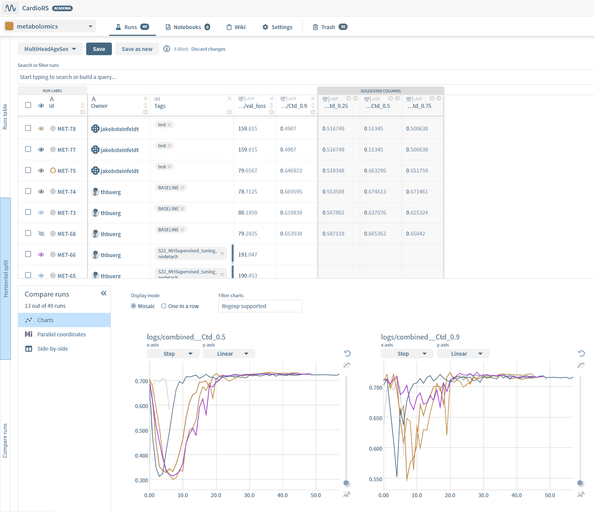

# 在 AILS 实验室建立可扩展的医学 ML 研究工作流程[案例研究]

> 原文：<https://web.archive.org/web/https://neptune.ai/blog/ml-research-workflow-case-study-ails-labs>

ailslab 是一个生物医学信息学研究小组，致力于使人类更加健康。这个任务就是**建造模型，也许有一天可以拯救你的心脏病**。它归结为应用机器学习来基于临床、成像和遗传学数据预测心血管疾病的发展。

四名全职和五名以上兼职团队成员。生物信息学家、内科医生、计算机科学家，许多人都有望获得博士学位。正经事。

虽然业务可能是一个错误的术语，因为面向用户的应用程序还没有在路线图上，但研究是主要的焦点。**研究如此激烈，以至于需要一个定制的基础设施**(花了大约一年时间建造)来从不同类型的数据中提取特征:

*   电子健康记录(EHR)，
*   诊断和治疗信息(时间-事件回归方法)，
*   图像(卷积神经网络)，
*   结构化数据和心电图。

通过融合这些特征，精确的机器学习模型可以解决复杂的问题。在这种情况下，这是心血管一级预防的*风险分层。*本质上，它是关于**预测哪些患者最有可能患心血管疾病**。

ailslab 有一个彻底的研究过程。每个目标都有七个阶段:

1.  定义要解决的任务(例如，建立心血管疾病的风险模型)。
2.  定义任务目标(例如，定义预期的实验结果)。
3.  准备数据集。
4.  使用 Jupyter 笔记本以交互模式处理数据集；快速试验，找出任务和数据集的最佳特性，用 R 或 Python 编码。
5.  一旦项目规模扩大，使用一个工作流管理系统，如 [Snakemake](https://web.archive.org/web/20221208013339/https://snakemake.readthedocs.io/en/stable/) 或 [Prefect](https://web.archive.org/web/20221208013339/https://www.prefect.io/) 将工作转化为一个可管理的管道，并使其可复制。否则，复制工作流程或比较不同模型的成本会很高。
6.  使用 Pytorch Lightning 与 Neptune 集成创建机器学习模型，其中应用了一些初始评估。记录实验数据。
7.  最后，评估模型性能并检查使用不同特征和超参数集的效果。

## 扩大机器学习研究的 5 个问题

ailslab 最初是一个由开发人员和研究人员组成的小组。一个人编写代码，另一个人审查代码。没有太多的实验。但是协作变得更具挑战性，随着新团队成员的到来，新问题开始出现:

1.  数据隐私，
2.  工作流程标准化，
3.  特征和模型选择，
4.  实验管理，
5.  信息记录。

### 1.数据保密

数据收集需要很多时间。对于像这样的医学机器学习研究，很难获得足够的数据，甚至是未标记的数据。这是一个关键问题，使得建立通用模型变得困难。该解决方案涉及使用来自医院和医疗保健系统的受 NDA 保护的私有数据。

你不能把这么敏感的数据上传到远程服务器，所以你只能**在本地**训练模型。当您的团队运行许多实验并存储每个实验的信息时，这是一个令人痛苦的限制。

对于 ailslab 来说，在本地管理实验，比较不同的模型，甚至与他人分享结果变得更加困难。

### 2.工作流程标准化

有一段时间这是一个小得多的团队。尽管要处理大量的定制代码，但只有几个开发人员，管理这个项目还是很容易的。

> “去年，我们建设了基础设施。我们开始开发时间-事件回归方法和几个特征提取器。目前，我们为成像数据建立类似 CNN 的模型，为 ECG 数据建立类似 TCN 的模型。我们有足够的自定义代码。现在的目标是每个月标准化一些东西。”–Jakob stein feldt，内科研究员@ailslab

没有理由太在意开发流程的结构化或标准化，也没有太多的代码检查在进行。

然而，新的开发人员不断加入团队，带来了不同风格的编码。对标准化代码开发解决方案的需求变得很明显。调试和跟踪每个团队成员编写的代码变得更加困难，因为没有清晰的过程。

### 3.特征和模型选择

这项研究的核心任务之一是使用时间-事件回归方法进行生存预测。这包括来自大型队列的观察数据，涉及详细的患者记录。

记录有不同的数据形式:

*   文字，
*   声音，
*   图像，
*   等等。

这带来了一个重大挑战:多模态学习。与只使用一种类型的模型相比，使用多种类型的数据构建模型更具挑战性。

例如，除了医学图像之外，患者的 EHR(电子健康记录)中可能还有上下文数据。诊断需要两者。

*Metadata logged in Neptune | Click to enlarge the image*

像长短期记忆(LSTM)这样的模型处理文本，而卷积神经网络(CNN)处理图像。每个模型都有不同的属性和发现。

为了进行更准确的诊断，可以将不同类型数据的发现结合起来。但是，正如 ailslab 的研究人员可以证明的那样，这造成了许多困难:

*   如何从不同的数据形态中提取有代表性的特征并融合它们？
*   对于所有数据形态来说，完成时间-事件预测这样的任务的最佳模型类型是什么？
*   哪些超参数最适合模型和数据？

回答这些问题需要大量的试错，比如生成不同的特征集来训练多个模型。**但是还有另一个问题**——比较由不同特征集训练的不同模型。

由于 ailslab 团队做了如此多的实验，**有必要找到一种简单的方法来跟踪所有的工作，避免原地打转**。否则，很难跟踪在不同版本的数据集及其特征上训练的所有模型。

### 4.实验管理

团队不断壮大，研究人员不断加入项目。他们中的一些人可能经验不足。**你如何确保两个人不会误做同一项任务**？

考虑这个场景:

二十名研究人员，在一名技术负责人的监督下，一起努力寻找同一问题的解决方案。每个人都以自己的方式设计解决方案，并向技术主管解释。反过来，技术主管会根据结果判断什么是正确的，什么是不正确的。

技术主管应该能够重新运行代码并重现良好的结果。超参数、特性和度量应该是清楚的。对于 ailslab 来说，像手动创建检查点，或者弄清楚如何更改一个或多个超参数来做另一个实验这样的任务简直就是浪费时间。

此外，学生有时会在有限的时间内参与项目。有必要跟踪和存储任何项目贡献者的实验数据，不管他们是否还在团队中。

> “你可以在电子表格中记录你的工作，但这非常容易出错。每一个我不使用和事后不看的实验都是浪费计算:这对环境有害，对我也有害，因为我浪费了时间。”–索尔·bürgel，博士生@ailslab

### 5.信息记录

对于每个实验，需要记录一些信息，包括:

*   用于训练的 GPU，
*   模型架构，
*   像特征、端点、数据集日期、路径，
*   度量及其性能。

*Monitoring in Neptune | Click to enlarge the image*

这些记录的信息是每个实验的特征。它在分析和回答以下问题时非常方便:

*   该模型在不同的记录组上表现如何？
*   哪些功能或功能集最能预测端点？
*   特征对预测有什么影响？

使用自定义记录器，回答这些问题或全面比较不同的实验并不容易。构建定制的记录器会带来长期管理记录器和在必要时添加新功能的负担。当错误发生时，就有更多的时间来构建一个内部工具，而不是做研究。这是艾尔斯伯想要避免的。

## 有了 Neptune，扩大机器学习研究变得更加容易

我们描述的五个问题是由于扩大团队和增加实验数量而产生的。海王星在 PyTorch Lightning docs 中引起了他们的注意，并很快加入了他们的研究工具集。

> "海王星的工作完美无缺，与 PyTorch Lightning 的整合非常顺利."–Jakob stein feldt，内科研究员@ailslab

为什么是海王星？它是如何帮助解决团队扩展中的五个问题的？请继续阅读，寻找答案。

### 艾尔斯伯为什么选择海王星

简而言之——因为它节省时间。

如果你是一名研究人员，你会知道管理多个实验是具有挑战性的。

电子表格只是在某个时候停止切割。如果您有数百个实验保存在电子表格中，您的本地机器或云服务器会很混乱。你可能永远也不会充分利用所有的实验信息。

你浪费更多的时间建立电子表格，然后你很少使用这些电子表格。你可以让 Neptune 收集并存储所有信息，而不是那样做。

你会看到你所有实验的综合历史，比较它们，选择哪些不值得保留。准备环境的开销更少，并且节省了时间。

### 数据保密

由于医疗数据特别敏感，有必要**将数据工作流与分析工作流**分开。

Neptune 不需要上传敏感数据，符合数据保护法。它只接收研究人员决定共享的记录信息，训练部分可以在本地机器或其他任何地方进行。它意味着最大限度的控制。数据始终是安全的，不存在数据泄露的风险。

> “通过允许我们只在本地训练模型并记录 ML 元数据而不上传实际数据，Neptune 为我们解决了一个巨大的问题。”–Jakob stein feldt，内科研究员@ailslab

### 工作流程标准化

在大范围内，最好使用标准化的工具进行开发。没人能否认这一点。Neptune 对 ailslab 进行标准化研究，因为:

*   它支持使用标准库来构建模型，这比编写难以解释或调试的定制代码要容易得多。
*   通过[完整的 PyTorch Lightning 集成](https://web.archive.org/web/20221208013339/https://docs.neptune.ai/integrations-and-supported-tools/model-training/pytorch-lightning)，Neptune 提供了记录信息的**标准化视图**。您可以记录您喜欢的任何内容，Neptune 在一个简单的视图中处理所有信息。所有团队成员都使用相同的基础设施。
*   海王星统一了每个人展示结果的方式，所以沟通不畅的情况会更少。

> “我们有许多学生，对我们研究的许多方面和我们使用的基础设施都不熟悉。这种设置为许多潜在问题创造了空间。海王星帮助我们沟通和避免这些问题。而不是讨论，我们可以只看超参数空间或者特征空间里的一切。很方便。”–Jakob stein feldt，内科研究员@ailslab

### 特征和模型选择

使用 Neptune，可以更容易地为模型选择最佳特征，因为它有多种方式来呈现和比较不同的实验:

*   有一个漂亮而简单的用户界面，具有类似弹性的搜索功能。
*   您可以在交互式图表中比较模型性能，并查看哪种模型最适合给定的一组功能。
*   当您选择参数进行比较时，除了评估指标之外，您还可以看到哪些功能最能描述一组记录。

模型性能(即预测准确性)很少是唯一的目标。ailslab 团队还关心所使用的资源。Neptune 测量硬件指标，以查看消耗了多少功率(RAM 或 GPU)来获得结果。

*Metrics’ charts in Neptune | Click to enlarge the image*

此外，海王星很容易扩展到数百万次实验。这意味着，即使在有许多活动部分和大量实验的多模态学习的情况下，跟踪所有这些仍然是方便的。

### 实验管理

考虑到不同的用户对同一个项目做出贡献，Neptune 在管理来自不同研究人员的贡献方面起着关键作用。它使得监督研究人员和比较他们的实验变得容易得多，而且这一切都发生在一个仪表板上。

> “所以我要说，使用 Neptune 的主要理由是，你可以确保没有任何东西丢失，一切都是透明的，我可以随时回到历史中进行比较。”–索尔·bürgel，博士生@ailslab

组织实验不再是一个问题，因为海王星做得很优雅。此外，海王星版本的数据更好地控制实验。

### 信息记录

海王星可以分组实验进行对比。很容易得到一个链接，与另一个研究人员或利益相关者分享结果。即使研究人员或学生离开项目，不再有空，他们实验的所有信息都会保存下来。

作为一个日志记录器和元数据存储库，Neptune 有一个记录每个实验的自动化流程。它有一个 API，让研究人员毫不费力地记录他们的结果。团队的所有成员都可以看到所有实验，这使得整个项目变得透明。

## 海王星——更多的时间用于 ML，更容易的合作，完全透明

海王星最突出的两点是:

*   易用性，
*   所有东西都放在一个地方。

与使用定制的日志程序相比，Neptune 可以处理所有的事情，并且团队有更多的时间来完成研究任务。Neptune 简单的用户界面使构建和比较实验变得前所未有的简单。

ailslab 研究人员现在使用**一个平台，他们的结果以同样的方式呈现**。监督他们的工作更容易，即使他们只是短期工作，或者没有向他人展示成果的经验。**比较不同研究者使用的数据参数不再是问题**。它减少了犯错的空间。

比较和管理实验也需要更少的时间。研究人员可以在实验历史之间来回切换，做出改变，并观察这些改变如何影响结果。完成的实验越多，工作效率就越高。团队成员只需登录 Neptune，就可以查看所有必要的数据，而不会让他们的驱动器或服务器堆满电子表格。

*Runs view in Neptune | Click to enlarge the image*

构建复杂的模型并探索它们是如何工作的变得更加容易了。Neptune 存储关于环境设置、底层代码和模型架构的数据。

最后，**海王星帮助组织事情**。在 ailslab 中，他们将 Neptune 的实验 URL 添加到他们的看板中的卡片上。实验信息的便捷获取有助于保持一切井然有序。整个团队对超参数对模型的影响有了更好的认识。

机器学习很难。建立 ML 模型以在心脏病发生前检测它增加了另一层非常厚的困难。我们很高兴海王星带走了 ailslab 项目的乏味部分，我们祝愿他们在研究中一切顺利。