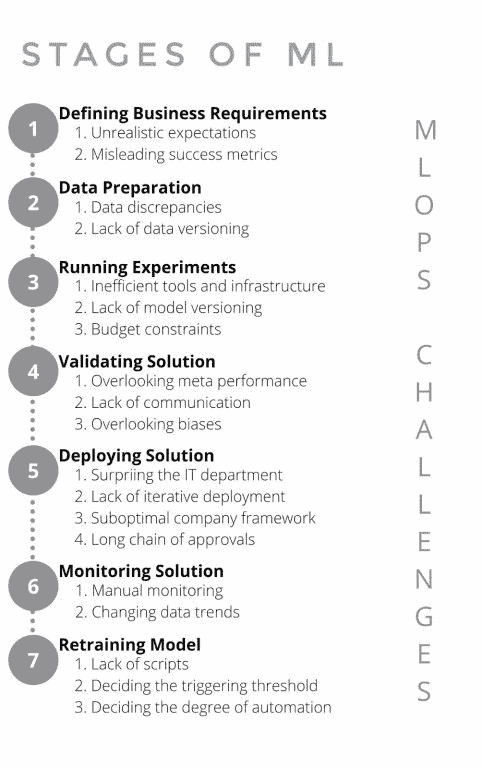
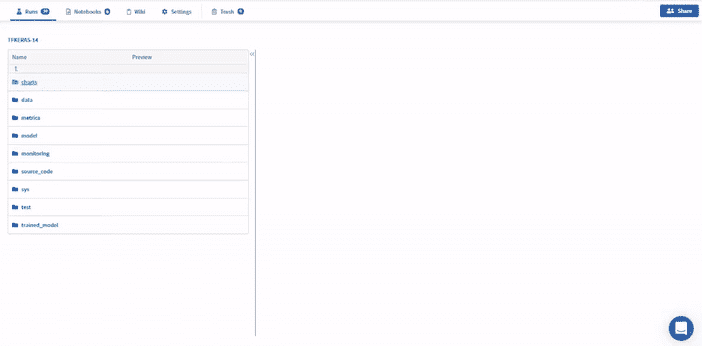

# MLOps 挑战和如何面对它们

> 原文：<https://web.archive.org/web/https://neptune.ai/blog/mlops-challenges-and-how-to-face-them>

大约在 2018 年，企业组织开始尝试机器学习(ML)功能，以在他们现有的解决方案上构建附加组件，或为他们的客户创建全新的解决方案。

在那个时候，这不是速度的问题，而是在竞争中获得额外的优势。如果你在你的提议中加入一些听起来科幻的 ML 功能，你可以吸引更多有兴趣尝试最新技术的客户。

在当前的 MLOps 趋势中，叙述几乎完全改变了。与任何其他时代的技术相比，人工智能(AI)每年都有指数级的进步。这个领域发展非常迅速，人们更加意识到它的局限性和机遇。

## 这些年来 AI/ML 的格局发生了怎样的变化，未来 MLOps 的趋势是什么？

以下是对人工智能和人工智能的发展影响最大的三大因素:

*   **大规模采用**-企业界现在对人工智能/人工智能解决方案非常感兴趣，这不仅是为了潜在客户和顾客的利益，也是为了获得投资者和推动增长。基于人工智能的功能可以说是公司获得资金与否的决定性因素。
*   **更激烈的竞争**–由于快速的大规模采用，在传统软件中增加一个简单的 ML 特性已经不足以给你带来优势。事实上，如此多的组织正在运行 AI/ML 项目，它已经成为一个标准的业务特性，而不仅仅是一个好东西。
*   **高速生产**–就像传统的软件生产一样，需要通过高速生产新的和改进的功能来应对激烈的竞争。考虑到早期的 ML 开发方式(没有 MLOps ),这个壮举似乎几乎是不可能的。

总的来说，我们可以说，就公司如何使用它们而言，AI/ML 解决方案正变得等同于常规软件解决方案，因此毫不奇怪，他们需要一个像 DevOps 一样规划良好的生产框架。

这个精心策划的框架就是 **MLOps** 。你可能听说过，但 MLOps 到底是什么？

## 什么是 MLOps？

MLOps 基本上是 DevOps(开发和运营团队协作的系统流程)，但用于机器学习开发。

MLOps 通过在端到端 ML 管道中引入结构和透明性，将机器学习和操作结合起来。借助 MLOps，数据科学家可以有组织、高效地与部署解决方案的数据工程师一起工作并共享他们的解决方案。MLOps 还提高了参与生产流程各个环节的各种其他技术和非技术利益相关方的可见性。

多年来，组织已经开始看到 MLOps 在执行高效生产流水线方面的优势。然而，MLOps 仍处于青少年阶段，大多数组织仍在寻找适合各自项目的最佳实现。

MLOps 中有几个漏洞和开放式挑战，需要解决。让我们来看看挑战并权衡可能的解决方案。

## MLOps 挑战和潜在解决方案

我根据 ML 管道的七个不同阶段将挑战分为七组。

*Fig 2\. Summary of MLOps challenges across Stages of ML | Illustrated by Author*

### 阶段 1:定义业务需求

这是业务涉众设计解决方案的初始阶段。它通常涉及三个利益相关者:客户、解决方案架构师和技术团队。在这一阶段，您设定期望值，确定解决方案的可行性，定义成功标准，并设计蓝图。

*   **挑战 1:不切实际的期望**

一些企业将人工智能视为解决所有问题的神奇方法。这种观点通常是由非技术利益相关者提出的，他们跟随流行词汇，而不考虑背景细节。

**解决方案:**这是技术领导发挥关键作用的地方。有必要让所有利益相关者意识到解决方案的可行性，并清楚地解释其局限性。毕竟，**一个解决方案只和数据一样好。**

*   **挑战 2:误导性的成功指标**

机器学习解决方案的有效性可以通过一个或多个指标来衡量。俗话说得好，**“你衡量什么就得到什么”**，即使在构建 ML 解决方案时也是如此。对解决方案需求的不良分析会导致不正确的度量目标，从而阻碍设计的健康发展。

**解决方案:**技术团队需要对解决方案目标进行深入分析，以得出现实的衡量标准。在这里，技术和非技术利益相关者都扮演着重要的角色，因为这涉及到对业务的深刻理解。决定度量标准的最佳方式是缩小两种度量标准的范围:

*   **高级指标:**适合客户观点，并提供解决方案发展方向的好主意。换句话说，高级指标展示了全局。

*   **低级指标:**这些是在解决方案开发期间支持开发人员的详细指标。通过分析多个低级指标，开发人员可以调整解决方案以获得更好的读数。低级指标加起来就是高级指标。

### 第二阶段:数据准备

数据准备包括根据需要收集、格式化、清理和存储数据。这是一个高度敏感的阶段，因为输入的数据决定了解决方案的命运。ML 工程师需要对数据质量和数据访问点进行健全性检查。

*   **挑战 1:数据差异**

数据通常需要来自多个来源，这导致了数据格式和值的不匹配。例如，最近的数据可以直接从预先存在的产品中获取，而旧的数据可以从客户端收集。映射中的差异，如果没有正确评估，可能会破坏整个解决方案。

**解决方案**:限制数据差异可能是一项人工密集型且耗时的任务，但您仍然需要这样做。处理这个问题的最好方法是集中数据存储，并在不同的团队之间建立通用映射。这是每个新账户的一次性设置，只要客户还在，你就能从中受益。

*   **挑战 2:缺乏数据版本控制**

即使使用中的数据没有任何中断或格式问题，也总会有时间问题。数据不断发展和再生，对于更新的数据转储，相同模型的结果可能会有很大差异。更新可以是不同处理步骤的形式，也可以是新的、修改的或删除的数据。如果你没有版本，你的模型性能记录不会很好。

**解决方案:**修改预先存在的数据转储对于空间优化非常有用，但是最好创建新的数据版本。但是，为了优化空间，您可以存储给定数据版本的元数据，以便可以从更新的数据中检索它，除非值也被修改。

### 阶段 3:运行实验

由于 ML 解决方案是基于大量研究的，因此需要大量实验来获得最佳路线。实验涉及开发的所有阶段，包括特征选择、特征工程、模型选择和模型调整。

*   **挑战 1:低效的工具和基础设施**

运行多个实验可能会很混乱，而且会耗费公司资源。不同的数据版本和流程需要在配备了在最短时间内执行复杂计算的硬件上运行。此外，不成熟的团队依赖笔记本来运行他们的实验，这是低效和耗时的。

**解决方案:**如果硬件是一个问题，开发团队可以寻求订购虚拟硬件的预算，例如 AWS 或 IBM Bluemix 上的虚拟硬件。当谈到笔记本电脑时，开发人员必须在脚本上进行实验，因为这样效率更高，耗时更少。

*   **挑战 2:缺乏模型版本控制**

每个 ML 模型都必须用多组超参数组合进行测试，但这不是主要的挑战。输入数据的变化会降低所选组合的性能，因此必须重新调整超参数。尽管代码和超参数由开发人员控制，但数据是影响受控元素的独立因素。

**解决方案:**应该记录模型的每个版本，以便能够找到最佳结果，并以最少的麻烦重现。这可以通过像 [neptune.ai](https://web.archive.org/web/20221024052132/https://docs.neptune.ai/how-to-guides/model-registry/log-model-building-metadata) 这样的平台无缝完成，这些平台在一个地方管理所有的模型构建元数据，你可以记录、存储、组织和轻松比较不同的模型版本。

*Fig 3\. A practical benefit of model (experiment) versioning at play | Illustrated by Neptune.ai*

*   **挑战 3:预算限制**

有时，由于预算限制，或者由于多个团队共享一项资源，开发团队不能使用公司资源。具有高性能计算或巨大存储容量的资源，即使它们对于扩展 ML 解决方案至关重要，也超出了大多数组织的预算标准。在这种情况下，ML 团队必须找到一种解决方法(这通常是次优的)，尽可能使解决方案以相同的功率工作。

**解决方案:**为了减少长时间的审批和预算限制，开发团队通常需要深入业务方面，并对限制供应和可以在这些供应上运行的工作解决方案的投资回报进行彻底的成本效益分析。团队可能需要与其他部门合作，以获得关于成本数据的准确反馈。组织中的关键决策者具有短期或长期利润导向的观点，而承诺增长的成本效益分析可能是打开一些瓶颈的驱动因素。

### 阶段 4:验证解决方案

ML 模型基于历史数据进行训练，并且需要在看不见的数据上进行测试，以检查模型的稳定性。模型需要在验证阶段表现良好，以便于部署。

*   **挑战 1:忽略元性能**

仅仅考虑模型验证的高层次和低层次的成功度量是不够的。仅仅基于这些因素就批准可能会导致处理速度变慢，并最终导致最终客户的问题升级。

**解决方案:**在验证解决方案时，还应考虑内存和时间消耗、硬件要求或生产环境限制等因素。它们被称为元度量，考虑它们将在很大程度上帮助您避免墨菲定律的后果。

*   **挑战 2:缺乏沟通**

仅仅从开发人员的角度来验证解决方案是有害的。没有让所有的利益相关者都参与到验证过程中会与期望相冲突，并导致返工和不满意。

**解决方案:**让业务干系人参与进来，了解模型性能如何与业务 KPI 相关联，以及它们如何直接影响干系人。一旦他们理解了这种联系，验证过程将会更加有效，因为它将结果与现实世界的含义进行了比较。

*   **挑战 3:忽视偏见**

偏见是非常狡猾的，即使是有经验的开发人员也可能会忽略它。例如，当结果在验证集上很好，但在输入的测试数据上却非常失败时，我们可能会有偏见。发生这种情况是因为模型是在有偏差的样本上训练的，并且当验证集具有与有偏差的样本相似的样本时。

**解决方案:**在多个数据组合上验证模型，无需替换。如果所有集合的结果几乎一致，这意味着模型是无偏的。但是，如果结果在这些集合之间有显著差异，这意味着需要使用偏差较小的样本更新训练数据，并且需要重新训练模型。

### 阶段 5:部署解决方案

在这一阶段，本地开发的解决方案在生产服务器上启动，以便最终客户可以使用。这是部署和开发团队协作执行发布的地方。

*   **挑战 1:让 IT 部门大吃一惊**

在真实的场景中，开发和部署团队之间会有很大的摩擦。这是因为从最初的步骤开始就没有沟通，也没有 IT 部门的参与。通常，在一个解决方案被设计出来之后，开发团队希望它在最早的时候被部署，并在很短的时间内要求 it 团队进行昂贵的设置。延迟沟通是有原因的——通过多次实验，开发团队不确定将实施哪个解决方案，并且每个解决方案都有不同的需求。

**解决方案:**尽快让 IT 团队参与进来。有时，他们对特定解决方案的需求方向有很好的见解。他们还可以指出可以在早期建立的潜在解决方案之间的共同要素。

*   **挑战 2:缺乏迭代部署**

开发和生产团队在大多数情况下是不同步的，在解决方案设计的最后才开始协作。即使 ML 有一个基于研究的方法，一次性的部署过程是错误的和低效的。

**解决方案:**就像在任何常规的软件部署中一样，ML 解决方案的迭代部署可以节省大量的返工和摩擦。迭代地设置解决方案的不同模块并在 sprints 中更新它们是理想的。即使在基于研究的解决方案中，需要测试模型的多个变体，也可以将模型的一个模块传达给部署团队，部署团队可以在 sprints 中更新该模块。

*   **挑战 3:次优的公司框架**

对于部署 ML 解决方案来说，一个公司正在开发的软件部署框架可能是次优的，甚至是不相关的。例如，一个基于 Python 的 ML 解决方案可能必须通过一个基于 Java 的框架来部署，以符合公司现有的系统。这可能会使开发和部署团队的工作加倍，因为他们必须复制大部分代码库，这需要大量的资源和时间。在资源优化方面，陈旧的、在以前构建的框架上统一运行的公司可能看不到 ML 团队的最佳结果，因为团队将忙于计算如何通过有限的可用框架来最好地部署他们的解决方案。一旦弄清楚了，他们必须为他们想要部署的每个解决方案重复次优的过程。

**解决方案:**对此的长期解决方案是投资创建一个独立的 ML 堆栈，它可以集成到公司框架中，但也可以减少开发方面的工作。对此的快速解决方案是利用虚拟环境为最终客户部署 ML 解决方案。Docker 和 Kubernetes 等服务在这些情况下非常有用。

*   **挑战 4:审批链过长**

对于需要在生产服务器上反映的每个更改，都需要批准。这需要很长时间，因为验证过程很长，最终会延迟开发和部署计划。这个问题不仅仅是生产服务器的问题，在提供不同的公司资源或集成外部解决方案方面也存在这个问题。

**解决方案:**为了缩短生产服务器上机器学习库的审批时间，开发人员可以将他们的代码引用限制为经过验证的代码库，如 TensorFlow 和 scikit-learn。如果使用了 Contrib 库，开发人员必须对其进行彻底检查，以验证输入和输出点。

### 阶段 6:监控解决方案

创建和部署解决方案并不是服务的终点。模型根据本地和过去的数据进行训练。检查它们在新的和未知的数据上的表现是至关重要的。这是建立解决方案的稳定性和成功性的阶段。

*   **挑战 1:手动监控**

手动监控要求很高，并且浪费资源和时间。除非资源是可消耗的，否则这不是监控模型结果的好方法。此外，对于时间敏感的项目，手动监控绝对不是一个选项，因为它无法在性能下降时立即发出警报。

**解决方案:**有两个选项。首先，明确地自动化监控过程和同步警报。第二，如果自动化目前不是一个即时的选项，您可以研究最近的监控数据。如果表现似乎持续下降，是时候建立再培训过程了(不是开始而是设置)。

*   **挑战 2:数据趋势的变化**

有时，由于与数据历史不同步的外部因素，数据可能会面临突然的变化。例如，股票数据可能会受到相关新闻文章的严重影响，或者进口数据可能会受到新税法的影响。清单是无穷无尽的，处理这样的突然中断是一个挑战。

**解决方案:**解决方案是保持数据最新或极其新鲜，尤其是在解决方案对时间敏感的情况下。这可以通过可以定期检查数据的自动爬虫来完成。这也将防止性能数据的滞后。

### 第七阶段:再培训模式

模型再训练是任何机器学习解决方案不可避免的阶段，因为它们都严重依赖数据，并且数据趋势会随时间而变化。有效的模型再训练有助于保持解决方案的相关性，并节省重新创建新解决方案的成本。

*   **挑战 1:缺少脚本**

不太成熟的 ML 团队是手工密集型的。一个早期团队仍在寻找框架、最佳解决方案和职责。然而，这也降低了团队效率，增加了重新培训的等待时间。

**解决方案:**总结 ML 管道的脚本创建或调用起来并不困难，并且通过一次性设置节省了时间和资源。创建脚本的最佳方式是对不同的子模块使用条件调用，这样就可以决定自动化的程度。

*   **挑战 2:决定触发阈值**

你应该什么时候开始重新训练模型？每一个机器学习模型在商业中都有一些现实世界的后果，一个偏离的表现可以显著影响各种团队的表现。因此，知道何时开始再培训是至关重要的，也同样具有挑战性。

**解决方案:**由于业务利益相关者想要良好的模型性能，权衡他们的观点和他们对性能下降的挑战是很重要的。例如，预测客户付款日期的模型会直接影响收款人发出的电话。因此，在进行再培训电话时，需要考虑诸如顺便拜访的点击次数和损失的付款等因素。

*   **挑战 3:决定自动化程度**

模型再训练可能很棘手。一些解决方案的再培训可以完全自动化，而其他解决方案需要密切的手动干预。不成熟的团队可能会犯在没有评估低性能原因的情况下自动化整个再培训脚本的错误。模型需要重新训练主要是因为偏离数据。在数据堆上训练模型，但是随着时间的推移，学习到的趋势可能不再适用于传入的数据。在这里调整模型超参数不会改变太多。

**解决方法:**解决方法是观察性能偏差，找出其背后的原因。如果数据偏差很小，自动化脚本可以很好地处理再训练过程。然而，如果数据发生了重大变化(一个极端的例子:全球危机期间就业数据的偏差)，探索性数据分析是可行的方法(即使这是一个人工密集型过程)。

## 结论

我们探讨了 MLOps 和 ML 管道中最常见的高级挑战。如你所见，它们是沟通和技术挑战的混合体。

每个阶段都有几个较低层次的挑战，但从解决重大组织、沟通和技术问题的 MLOps 战略开始，是解决低层次挑战的关键。

在本文中，我使用了我之前在 Neptune 博客上发表的一些内容，您可能会感兴趣:[当 MLOps 是一个组织和沟通问题时，而不是一个技术问题](/web/20221024052132/https://neptune.ai/blog/mlops-organizational-and-communication-problem-not-a-tech-problem)。

### 萨马德里塔·戈什

一个内容营销和 AI 爱好者。她的使命是帮助基于人工智能的公司建立品牌知名度，并通过高质量的内容抓住网民的巨大市场，无论是信息丰富的博客还是教育播客！

* * *

**阅读下一篇**

## 最佳 MLOps 工具以及如何评估它们

12 分钟阅读| Jakub Czakon |年 8 月 25 日更新

在我们的一篇文章中——[机器学习团队实际使用的最好的工具、库、框架和方法——我们从 41 家 ML 初创公司学到的东西](https://web.archive.org/web/20221024052132/https://neptune.ai/blog/tools-libraries-frameworks-methodologies-ml-startups-roundup)——Acerta 的 CTO Jean-Christophe Petkovich 解释了他们的 ML 团队如何接近 MLOps。

**据他所说，一个完整的 MLOps 系统有几个要素:**

*   您需要能够构建包含预处理数据和生成结果所需的所有信息的模型工件。
*   一旦您能够构建模型工件，您必须能够跟踪构建它们的代码，以及它们被训练和测试的数据。
*   您需要跟踪所有这三样东西，模型、它们的代码和它们的数据，是如何关联的。
*   一旦您可以跟踪所有这些内容，您还可以将它们标记为准备就绪，进行生产，并通过 CI/CD 流程运行它们。
*   最后，为了在该过程的最后实际部署它们，您需要某种方法来基于该模型工件旋转服务。

这是对如何在公司中成功实施 MLOps 的高度概括。但是理解高层需要什么只是拼图的一部分。另一个是采用或创建适当的工具来完成工作。

这就是为什么我们编制了一份**最佳 MLOps 工具**的清单。我们将它们分为六类，以便您可以为您的团队和业务选择合适的工具。让我们开始吧！

[Continue reading ->](/web/20221024052132/https://neptune.ai/blog/best-mlops-tools)

* * *