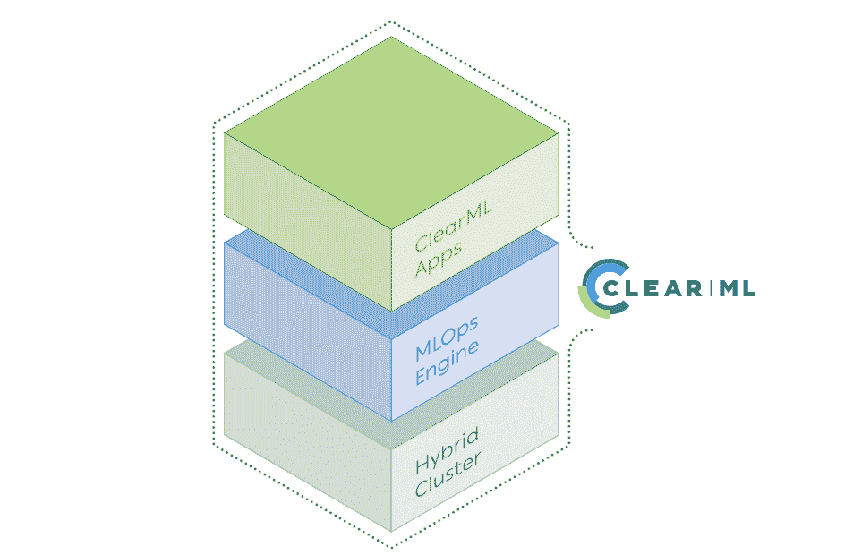
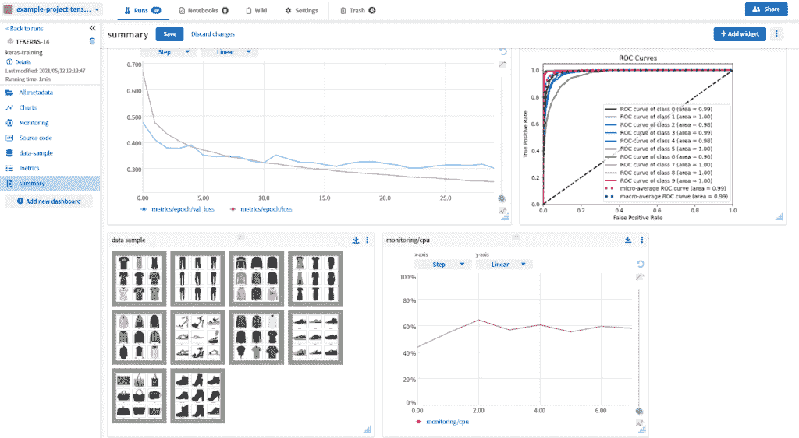
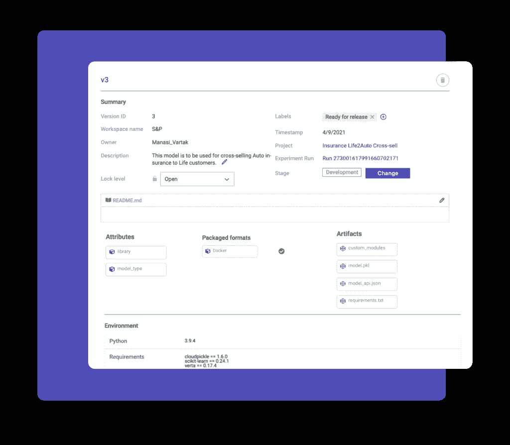

# MLOps 模型商店:定义、功能、工具回顾

> 原文：<https://web.archive.org/web/https://neptune.ai/blog/mlops-model-stores>

什么是 ML(机器学习)模型库？这里有一个你可能会发现自己身处其中的场景。你经历了一个严格的开发工作流程，用不同的结果和性能分数试验和训练各种机器学习模型。你决定最好的协作方式是共享你的模型，这些模型存储在像 [S3](https://web.archive.org/web/20220926092528/https://aws.amazon.com/s3/) 或 [GCS](https://web.archive.org/web/20220926092528/https://cloud.google.com/storage) 这样的对象存储器中，并在电子表格上记录。

您经历了上面的过程，所以当团队中的每个人见面时，您都可以讨论结果，并可能回去开发更多的实验，或者在某些情况下，讨论团队应该部署哪些模型。

在就部署什么模型进行了几个小时的争论后，团队最终同意了一个模型。现在又出现了另一个问题，那就是实际打包将要部署的模型，对其进行分级，并使其为生产做好准备。

这种手动、费力且重复的过程可能非常耗时，甚至可能对您和您的团队有害。必须有一种方法来保持开发和部署机器学习模型的所有协作高效和简化，对吗？

模型商店是一种新的东西，可以帮助你做到这一点。让我们探索什么是模型商店，它们如何帮助，以及如何为您的项目选择正确的模型商店。

## 什么是模型商店？

模型存储是数据科学家获取和管理他们的模型和实验的中央存储，包括模型文件、工件和元数据。

通过模型存储，您可以控制管理多个机器学习模型的复杂性。这种结构还有助于数据科学家:

*   将多个新训练的模型版本与现有部署的版本进行比较；
*   将全新模型与标记数据上的其他模型版本进行比较；
*   [随着时间的推移跟踪模型性能](/web/20220926092528/https://neptune.ai/blog/how-to-track-machine-learning-model-metrics)；
*   跟踪组织范围内的实验；
*   管理全组织机器学习模型的服务需求。

像特征商店这样的模型商店是你的机器学习项目的[资产](https://web.archive.org/web/20220926092528/https://en.wikipedia.org/wiki/Asset_management)管理技术。“模型商店”术语是新一波 [MLOps](/web/20220926092528/https://neptune.ai/blog/mlops-what-it-is-why-it-matters-and-how-to-implement-it-from-a-data-scientist-perspective) 行话的一部分。这看起来像是一个营销噱头，但对于如何开发和部署机器学习应用程序至关重要。

除了这些模型的可搜索清单之外，您还可以访问模型工件、模型配置文件以及相关模型的实验元数据。

模型存储充当您将提供给生产环境的模型的登台环境。模型商店允许您将再现性和生产就绪模型结合起来。在您的所有模型经历了必要的开发工作流程之后，可以把它想象成一个包装器。此时，它们已经准备好部署到生产环境中，或者由预测服务引入生产环境中。

当您希望您的模型是可复制的并且可用于生产时，您可以使用模型存储。模型存储包含重现模型结果所需的所有信息和文件。它包括对模型进行打包、测试和准备部署的必要过程。

*What is a model store? | Source: Author*

可以说，模型商店和注册中心几乎没有区别。然而， [Eduardo Bonet](https://web.archive.org/web/20220926092528/https://www.linkedin.com/in/eduardobonet/) 在 [MLOps 社区 Slack 频道](https://web.archive.org/web/20220926092528/https://app.slack.com/client/T7FHA770F/D02BK6AT90B/thread/C015J2Y9RLM-1628847048.319500)中提出的一个重要观点是，在模型注册表中，你存储和获取模型(就像 docker 注册表一样)。

在模型存储中，您有日志、发现、示例、元数据，所有您需要的，并且模型存储包含模型注册。您可能仍然会发现公司更喜欢使用“模型注册中心”作为一个包含性的术语，因为现在在命名约定中没有任何特定的标准。

## 为什么您的 MLOps 项目需要一个模型商店？

机器学习操作(MLOps)项目需要模型存储有三个主要原因:

让我们仔细看看这些关键的原因，以理解为什么您的项目需要模型商店。

### 模型的再现性

机器学习项目最具挑战性的方面之一是重现结果。在试验过程中，您的模型会用随机值进行初始化，然后根据训练数据进行调整。这种随机性使得手动实现再现性成为一个复杂的过程。其他工件需要修复，以确保训练期间的再现性。

模型存储通过以下方式保证再现性:

*   [跟踪和收集实验](/web/20220926092528/https://neptune.ai/experiment-tracking)–和 ML 管道相关的元数据(实验作者/所有者、描述等。).
*   收集数据集元数据，包括数据集的版本、位置和描述。此外，用户如何选择数据或数据链接到特征存储中的何处。
*   收集模型工件、元数据(包、框架、语言、环境文件、git 文件等)和配置文件。
*   收集容器文物。
*   项目文档，包括如何运行模型的演示和例子。

该商店也是团队“购买”可重用模型的地方，有助于更有效的协作和可访问的机器学习项目。您可以在类似于其他人最初训练模型的数据集上重新训练现成的模型，确保团队可以更快地试验和推出模型。

团队成员可以通过目录功能搜索相关的模型，以重用、改进或管理这些模型。这个特性在某种程度上消除了孤岛构建的问题，并简化了整个组织的协作。有了模型存储，无论项目在何时何地运行，它们的结果都是一致的。

总之，模型存储在可再现性方面促进了个人和团队的协作、可访问性和更有效的机器学习项目工作流。

### 确保模型可以投入生产

模型存储与生产系统集成在一起，为模型提供弹性服务。使用模型存储，您可以更快地部署生产模型，因为将模型部署到生产中的一个技术瓶颈是由数据科学家(开发模型)和操作团队(部署模型)之间的移交过程引起的。

在模型存储中，为生产绑定的模型验证了它们的工件，模型被编译并集成到登台环境中。此功能确保在将模型部署到预测服务之前，可以测试模型与其他应用程序的兼容性和预测能力。

模型存储还包含模型的预处理描述。生产中的数据管道可以使用模型在实验期间经历的相同预处理，以避免[训练-服务偏斜](https://web.archive.org/web/20220926092528/https://developers.google.com/machine-learning/guides/rules-of-ml#training-serving_skew)。模型存储与生产环境和服务基础设施集成，以便于模型部署、模型废弃(或归档)和回滚。

除了试运行之外，模型存储还可以支持验证和部署模型的其他策略，例如[金丝雀](https://web.archive.org/web/20220926092528/https://harness.io/blog/continuous-verification/blue-green-canary-deployment-strategies/)集成测试和部署、[影子模式部署](https://web.archive.org/web/20220926092528/https://christophergs.com/machine%20learning/2019/03/30/deploying-machine-learning-applications-in-shadow-mode/#what)和 [A/B 部署](https://web.archive.org/web/20220926092528/mailto:okeziestanley@gmail.com)。对于自动化的 MLOps 管道，您可以将模型存储与[持续集成和交付/部署](https://web.archive.org/web/20220926092528/https://cloud.google.com/architecture/mlops-continuous-delivery-and-automation-pipelines-in-machine-learning#mlops_level_2_cicd_pipeline_automation) (CI/CD)和[持续培训](https://web.archive.org/web/20220926092528/https://cloud.google.com/architecture/mlops-continuous-delivery-and-automation-pipelines-in-machine-learning#mlops_level_1_ml_pipeline_automation) (CT)相集成，以消除手动操作实践。

为了跟踪和重现应用程序中的错误，您需要知道哪个模型正在生产中运行。为此，您需要保留一份与训练模型所基于的数据集(和要素)相链接的训练模型记录，模型存储会为您完成这项工作。

### 有效管理模型

跨项目和整个组织管理模型可能非常复杂。组织已经从部署少数解决特定问题的模型发展到部署数百甚至数千个模型来解决不同的生产问题。模型存储有助于这些模型的可见性、可发现性和管理。

#### 改进模型治理

在生产中管理模型的一个主要原因是为了改善这些模型的治理和安全性。大多数行业在向客户部署产品时都遵循法规要求。模型存储允许对模型进行审查和审计，因此它们的结果符合法规要求。

除了法规要求之外，确保在使用许可和开源工具开发和部署模型时没有任何限制也是至关重要的。此类限制可能导致违反许可协议或使用这些工具。在这个场景中，评审和审计成为模型管理的重要方面。

#### 提高模型安全性

还需要对模型和用于构建模型的底层包进行漏洞扫描，尤其是当大量包开发和部署模型时——管理包的特定版本，消除任何可能对系统造成威胁的安全漏洞。

模型也容易受到恶意攻击，因此需要管理和保护模型免受这种攻击。还有一些情况需要应用最低特权访问的[安全原则，以便只有授权用户才能访问特定的模型信息和资源。](https://web.archive.org/web/20220926092528/https://en.wikipedia.org/wiki/Principle_of_least_privilege)

## 模型商店适合您的 MLOps 平台

到目前为止，我们知道模型存储提高了模型的可再现性和弹性服务。让我们看看它们在您的 MLOps 平台中的位置。

下图由谷歌云的《MLOps:机器学习中的连续交付和自动化管道》文章[修改而来。](https://web.archive.org/web/20220926092528/https://cloud.google.com/architecture/mlops-continuous-delivery-and-automation-pipelines-in-machine-learning)

模型存储与您的实验管理系统相耦合，并与您的生产管道相集成，以管理模型部署过程:审查、测试、批准、发布和回滚。模型存储处理来自实验管理系统的工件和元数据，或者在高层次上支持连续训练的自动化生产管道。

在工件管理方面，模型存储管理模型的生命周期，包括打包模型用于阶段化或发布。对于元数据管理，搜索与模型相关的元数据、创建报告和其他功能使得在商店中发现模型变得容易。

## 你能在模型商店里找到什么

让我们来看看一个模型在你训练和验证之后的旅程:

1.  您已经训练和验证的模型的工件和元数据从实验管理系统到达模型存储。
2.  对工件进行验证，以确保经过训练的模型包含所有必需的工件，以便提供服务和进行监控。
3.  模型工件和元数据被打包到一个独立的、可加载的包中，为集成的生产环境服务。
4.  打包后的模型将进行部署，以验证模型并确保它们适合服务。验证包括对模型和它将集成到生产环境中的其他应用程序进行质量保证测试。

采取这些步骤的主要原因是为了确保模型在生产中的稳定性*。*由于同一个容器中加载了多个模型，一个糟糕的模型可能会导致预测请求失败，并可能中断同一个容器中的模型。在其他场景中，同一模型可能会破坏整个应用程序的结果和性能。

让我们来看看你能在模型商店里找到什么:

*   **多样的元数据**:来自模型、数据、实验。
*   **工件**:像元数据一样，存储包含所有与您如何开发、部署和管理模型相关的工件。
*   **文档和报告工具**:文档对于评审和可重复项目至关重要。模型存储支持与您如何开发、部署和管理模型相关的文档。
*   **目录**:模型商店中的信息需要是可搜索的，而目录可以实现这一点。搜索要使用的模型？相关元数据怎么样？搜索在特定数据集上训练的模型？目录使得商店可被搜索。
*   **登台工具**:模型存储的另一个特性是它可以在模型上执行的登台集成测试。您可以在模型存储中找到用于测试的暂存模型的工具。
*   **自动化工具**:模型存储的目标之一是在您训练和验证了一个模型之后，自动化一些重复的任务，以提高部署大量模型的团队的生产力。在商店内，您可以找到支持该流程的自动化工具和工作流程。

跟踪和管理元数据对于任何机器学习工作流都至关重要。该特性包括对您如何开发、部署和管理模型很重要的任何类型的元数据。模型存储与实验管理系统集成，以跟踪实验或管道相关的元数据。

当您运行实验时，实验管理系统会记录实验的输出，以便可以有效地跟踪和管理它们。这里的“有效”是指来自实验运行的元数据旨在帮助你[在开发过程中监控](/web/20220926092528/https://neptune.ai/blog/ml-model-monitoring-best-tools)你的模型，[调试](/web/20220926092528/https://neptune.ai/blog/ml-model-debugging-and-tools)你可能遇到的任何错误，甚至[在图表中可视化](/web/20220926092528/https://neptune.ai/blog/visualizing-machine-learning-models)模型的性能。

您可以在模型存储中找到的一些实验元数据包括:

*   **环境配置**:封装了完整的环境，包括所有的工具、依赖项、包、Docker 文件和其他构建模型所需的配置文件。
*   **计算信息**:在实验运行期间使用的硬件和加速器(如果有的话)的类型，以及在该过程中消耗的功率有助于确定项目的碳足迹。
*   **代码版本**:包括提交的 git SHA 或者用于构建模型的代码的实际快照。
*   **执行细节**:特定运行的唯一标识符、实验触发日期(时间戳)、运行时间以及完成时间。
*   **管道相关元数据**:如管道版本、运行号、管道参数等。
*   **URI 的文件为图表、曲线图和实验的性能结果。**

让我们看看您可以在实验运行的模型存储中找到的其他一些元数据类别。

您可以在模型存储中找到的模型元数据包括:

*   **型号名称**由用户设定。
*   **用户开发的型号描述**。
*   模型的 [URI](https://web.archive.org/web/20220926092528/https://en.wikipedia.org/wiki/Uniform_Resource_Identifier) (或者它将被存储的位置)。
*   **模型类型**:你用于模型的算法。假设是逻辑回归算法或者卷积神经网络算法。
*   **框架**和**库**，包括被训练模型的版本号。
*   该实验运行模型的**超参数配置**。
*   **车型版本**，对于在车型商店中唯一标识车型至关重要。
*   **型号标签**(开发、退役或生产)或**标签**。
*   型号代码。
*   **用于模型的指标类型**。
*   其他必要的模型配置文件。

您可以在模型存储中记录的数据集元数据包括:

*   数据集的版本。
*   用于训练模型的数据集的 URI 或位置(文件路径)。
*   数据集所有者。
*   数据集源。

所有这些都允许您更详细地跟踪摄取的数据。它们还将使您能够验证在训练期间使用的数据集仍然是稍后时间点的数据集，这对于再现性是至关重要的。

### 史前古器物

您可以在模型存储中找到的工件包括模型工件(以各种格式保存的模型，如 [ONNX](https://web.archive.org/web/20220926092528/https://onnx.ai/) 、 [pickle](https://web.archive.org/web/20220926092528/https://docs.python.org/3/library/pickle.html#module-pickle) 、 [protobuf](https://web.archive.org/web/20220926092528/https://en.wikipedia.org/wiki/Protocol_Buffers) 等)和容器工件，如在模型打包以进行测试和部署期间的 Docker 图像。

### 证明文件

模型文档是模型可再现性和审计的关键部分。记录和共享关于模型如何做出预测的上下文可以实现协作，因此团队成员可以基于示例再现结果，并帮助透明的模型报告。该文档还将包含模型预期用途的详细信息、模型可能表现出的偏差，以及关于模型预期表现良好的输入类型的免责声明。一些商店正在测试[模型卡](https://web.archive.org/web/20220926092528/https://modelcards.withgoogle.com/about)，用于模型文档和报告。

### 目录

在模型存储中，您会发现一个模型目录，您可以搜索它，这样就可以很容易地找到资产，特别是当成百上千的模型在生产中运行或不运行时。在某些模型商店中，这种搜索是通过图形用户界面(GUI)或 API 完成的，因此该功能可以与其他系统集成。

## 模型存储的功能

模型商店的关键功能和必备条件是什么？

### 集成到实验管理系统中

如果您想要提高生产率并确保模型结果的可重复性，以便它们在运行中保持一致，那么跟踪您的实验是关键。模型存储应该与实验管理系统相结合来跟踪实验，因此元数据、工件和其他信息都被收集到存储中。这种集成还有助于做出将模型发布到生产环境的决策。

### 暂存环境

在模型存储中，应该有一组运行模型所需的基础设施，这些基础设施与应用程序或服务的其他部分相集成。此功能通常包括应用程序服务器、数据库、缓存以及与预测服务(包含模型)集成的其他系统。序列化的模型被编译并部署到登台环境中。

登台环境用于在将模型发布到生产环境之前在集成环境中进行测试，这通常是客户使用的环境以及他们与之交互的其他服务。从试运行环境中，我们可以执行质量保证测试、适当的治理和批准工作流。

适当的治理和批准工作流还需要模型存储中的共享和协作。团队和涉众可以很容易地访问注册的模型，并编辑和更新其中的信息。它还应该包括访问控制功能，商店中注册模型的所有者可以授予用户完全访问、部分访问、读取或写入权限。这个功能还应该附带一个活动日志，它可以跟踪和记录模型存储中的变更以及必要的信息。

### 自动化

自动化是模型存储的另一个功能，因为正如我们前面所讨论的，许多项目工作流是手工的和重复的。这一功能带来了对工具的需求，该工具可以在您开发模型之后自动化模型生命周期，因此生命周期中的审查、批准、发布和回滚步骤是无缝的。

当前面的步骤完成时，模型存储应该使用 API 和 webhooks 来触发下游动作。在本文的前面，您看到了一个模型在实验之后的旅程。当实验管理系统发送工件和元数据时，需要触发的下游活动对于模型存储来说是至关重要的。

例如，当实验管理系统传递模型工件时，它们必须被自动注册。当用户将模型移动到阶段环境中时，在批准和发布(部署)之前，它们被容器化以进行本地测试。

您可以根据模型存储将模型加载到预测服务的方式来配置一些模型存储。例如，如前所述，将模型加载到预测服务中合适的集群，或者使用特定的部署策略(如 canary 部署或 A/B 部署)。当部署需要特定加速器在生产环境中有效工作的大型模型时，该功能也是如此。

### 部署

模型存储的另一个核心功能是与生产环境的集成。前面，您一定已经看到，如果您使用包含 CI/CD 工作流的自动化管道，交付经过充分测试的模型是至关重要的，这使得生产系统稳定。

## 查看各种模型商店

在本节中，我们将回顾各种模型商店，以思考您可能想要探索的一些选项。值得注意的是，这些工具中的一些也可能被称为“模型注册表”在本文的前面，我们已经了解了模型存储和模型注册之间的细微差别。

其中一些解决方案是开源的；其他涉及定价计划。现在，我们将简要介绍您可以开始探索的 5(五)个模型商店，在下一节中，我们将总结如何根据您的需求选择合适的模型商店。

### 开源解决方案

#### 模型商店

[Modelstore](https://web.archive.org/web/20220926092528/https://modelstore.readthedocs.io/en/latest/) (多么原创， [Neal](https://web.archive.org/web/20220926092528/https://www.linkedin.com/in/nlathia/) ！😅)是一个**开源 Python 库**，它允许你在你的文件系统或云存储提供商(AWS 或 GCP)之间版本化、导出和保存/检索机器学习模型。

除了开源之外，modelstore 还有以下一些特性:

*   自动化模型的版本控制。
*   以结构化的方式存储您的模型，以便于访问。
*   收集和处理用于训练模型的代码的 Python 运行时、依赖项和 git 状态的元数据。
*   支持几种流行的开源机器学习库，你可以在这里找到它们[。](https://web.archive.org/web/20220926092528/https://modelstore.readthedocs.io/en/latest/concepts/libraries.html)
*   它可以使用你的本地文件存储、[谷歌云存储](https://web.archive.org/web/20220926092528/https://cloud.google.com/storage)或 [AWS S3 存储桶](https://web.archive.org/web/20220926092528/https://aws.amazon.com/s3/)作为你的后端。
*   它提供了模型打包特性以及工件处理特性。
*   积极维护，添加了其他支持和模型存储功能。

在撰写本文时，modelstore 还不支持模型存储的一些核心特性，并且有一些缺点，包括:

*   目前通过 API 访问特性，因为还没有 GUI 访问。
*   该库的模型文档和报告功能仍在开发中。

值得注意的是，目前有一个贡献者在管理 modelstore，所以如果你想采用这个解决方案，你需要考虑到这一点。

要开始使用 modelstore，请查看[快速入门指南](https://web.archive.org/web/20220926092528/https://modelstore.readthedocs.io/en/latest/usage/quickstart.html)。

#### ClearML 模型存储

ClearML [在其网站](https://web.archive.org/web/20220926092528/https://clear.ml/)上声明，它是唯一一款在统一、强大的平台上管理所有 MLOps 的开源工具，提供协作式实验管理、强大的编排、易于构建的数据存储和一键式模型部署。

一个令人兴奋的 ClearML 特性是 [MLOps 开放架构栈](https://web.archive.org/web/20220926092528/https://clear.ml/)，它带有一个开源的 MLOps 引擎，如果 [ClearML 应用](https://web.archive.org/web/20220926092528/https://clear.ml/docs/latest/docs/apps/)不能解决你的问题，你可以在其上构建定制应用。

*ClearML Open Architecture Stack | [Source](https://web.archive.org/web/20220926092528/https://clear.ml/)*

虽然模型存储不是 ClearML 应用程序堆栈的一部分，但是您可以在开源的 MLOps 引擎上构建一个定制的模型存储，它提供了模型存储应该提供的核心功能。正如第[由](https://web.archive.org/web/20220926092528/https://youtu.be/xliX3IhNdmw?t=576)[制作的视频](https://web.archive.org/web/20220926092528/https://www.linkedin.com/in/lstmeow/)所解释的，唯一的问题是:

*   您不能为元数据创建自定义标签。
*   在模型打包期间，不能使用自定义序列化(比如 [ONNX](https://web.archive.org/web/20220926092528/https://en.wikipedia.org/wiki/Open_Neural_Network_Exchange) )。引擎使用开发过程中使用的框架生成的序列化文件，例如，Tensorflow 和 Keras 模型的 [protobuf](https://web.archive.org/web/20220926092528/https://en.wikipedia.org/wiki/Protocol_Buffers) 或 [.h5](https://web.archive.org/web/20220926092528/https://en.wikipedia.org/wiki/Hierarchical_Data_Format) 格式。这一挑战可能会导致生产中的兼容性问题(例如模型互操作性)。

你可以通过观看[这个视频](https://web.archive.org/web/20220926092528/https://youtu.be/xliX3IhNdmw)和后续的 [Google Colab 演示](https://web.archive.org/web/20220926092528/https://colab.research.google.com/drive/1mLSpn0hjAXe13fL1cCIRQjYMRwPxQWRG?usp=sharing)来开始使用 ClearML 中的模型商店。

#### MLflow 模型注册表

MLflow 是一个管理 ML 生命周期的开源平台，包括实验、可复制性、部署和中央模型注册。MLflow 模型注册组件是一个集中式模型存储、一组 API 和 UI，用于跨数据团队协作管理 MLflow 模型的整个生命周期。

MLflow 模型注册表的一些功能包括:

*   提供一个**中央存储库**来存储和管理唯一命名的注册模型，以实现跨数据团队的协作和可见性。
*   为注册表操作提供了 **UI 和 API，以及流畅的工作流体验。**
*   允许**在不同的阶段环境(阶段和生产环境)中有多个版本的模型**。
*   允许**跨不同环境和阶段**的过渡和模型推广方案。模型可以从试运行中移走，加载到生产环境中，回滚，退役或归档。
*   **与 CI/CD 管道**集成，以快速加载特定的模型版本，用于测试、审查、批准、发布和回滚。
*   **模型谱系跟踪特征**，提供模型描述、谱系和活动。

MLflow registry 还提供对元数据存储和工件存储的支持。元数据存储可以在任何有 [PostgreSQL](https://web.archive.org/web/20220926092528/https://www.postgresql.org/) 、 [MySQL](https://web.archive.org/web/20220926092528/https://www.mysql.com/) 和 [SQLlite](https://web.archive.org/web/20220926092528/https://www.sqlite.org/index.html) 的地方使用。工件存储支持本地文件系统后端和一些托管后端，如 [S3 存储](https://web.archive.org/web/20220926092528/https://aws.amazon.com/s3/)、 [Azure Blob 存储](https://web.archive.org/web/20220926092528/https://azure.microsoft.com/en-us/services/storage/blobs/)、[谷歌云存储](https://web.archive.org/web/20220926092528/https://cloud.google.com/storage)和 [DBFS 工件存储库](https://web.archive.org/web/20220926092528/https://github.com/mlflow/mlflow/blob/master/mlflow/store/artifact/dbfs_artifact_repo.py)。此外，还有一个可管理的 MLflow 计划，您可能想在此处查看。

你可以从[这个工作坊](https://web.archive.org/web/20220926092528/https://youtu.be/AxYmj8ufKKY)开始学习 MLflow Model Registry，看看[文档](https://web.archive.org/web/20220926092528/https://mlflow.org/docs/latest/model-registry.html)。

### 免费和付费解决方案

#### Neptune.ai

Neptune 是 MLOps 的元数据存储，为运行许多实验的研究和生产团队而构建。

它为您提供了一个中心位置来记录、存储、显示、组织、比较和查询机器学习生命周期中生成的所有元数据。

个人和组织使用 Neptune 进行实验跟踪和模型注册，以控制他们的实验和模型开发。

*Example dashboard in Neptune |* [*Source*](https://web.archive.org/web/20220926092528/https://app.neptune.ai/o/common/org/example-project-tensorflow-keras/e/TFKERAS-13/dashboard/summary-6f234f52-6b77-476a-9486-63037655b3be)

海王星的一些核心特征包括:

*   记录所有类型的机器学习模型相关的元数据类型。您可以在[文档](https://web.archive.org/web/20220926092528/https://docs.neptune.ai/you-should-know/what-can-you-log-and-display)中找到所有元数据类型的完整列表。
*   在您工作的地方工作，因为 Neptune [与机器学习、深度学习和强化学习中流行的 Python 库进行了 25+次集成](https://web.archive.org/web/20220926092528/https://docs.neptune.ai/integrations-and-supported-tools/intro)。

Neptune 更像是一个元数据存储，而不是一个实际的工件存储，模型存储也管理和处理工件存储。Neptune 对于您的实验和生产用例都是最佳的。

Neptune 对一个用户免费，[对团队付费](/web/20220926092528/https://neptune.ai/pricing)(可以进行团队试用)。大约 5 分钟后[就可以开始免费使用](https://web.archive.org/web/20220926092528/https://docs.google.com/document/d/1xrmbWXp6noEyiSQXWucMs9PhlO4EXND34Zo28JyQ33U/edit#/register)。您还可以了解更多信息:

#### Verta.ai

[Verta.ai](https://web.archive.org/web/20220926092528/https://www.verta.ai/platform/) 使用一套[工具](https://web.archive.org/web/20220926092528/https://www.verta.ai/platform/)来支持数据科学和机器学习团队快速开发和部署生产就绪模型，从而实现 ML 与各种产品的高效集成。他们平台中的一个工具是[模型注册中心](https://web.archive.org/web/20220926092528/https://www.verta.ai/platform/model-registry/)，这是一个寻找、发布、协作和使用生产就绪模型的中央存储库。

*Verta.ai Model Registry dashboard |* [*Source*](https://web.archive.org/web/20220926092528/https://www.verta.ai/platform/model-registry/)

Verta.ai 与您的模型治理工作流和部署系统相集成，以保证可靠和自动化的发布过程。要开始使用 Verta 的模型注册工具，你可以点击这里进行[免费试用](https://web.archive.org/web/20220926092528/https://trial.verta.ai/signup)。

#### 其他解决方案

您可能想了解的一些其他选项有:

## 如何为您的 MLOps 项目选择合适的模型存储

当您想要为您的项目选择一个模型存储时，有一些考虑事项。我们来复习一下。

### 团队的规模和部署的模型数量

如果你是一个一个人的团队或者一个小团队，那么模型商店在你的平台堆栈中不是最优先的，这是可以理解的。通常，如果一个小团队部署了少量的模型，您不需要模型存储。尽管如此，随着您的团队不断成长，团队正在开发和部署的模型数量不断增加，必须考虑采用模型存储来简化可重复性和服务。

您希望确保通过减少冗余流程来优化团队的生产力。这些过程包括设置一个存储桶，手动上传工件、配置文件，以及每当团队决定一个模型可以生产时打包模型。

对于一个**小团队**来说，想要开始一个模型商店，尝试使用一个具有最基本功能的免费选项，例如:与开发环境集成、元数据和工件处理、目录特性和打包特性。

对于**较大的团队**部署许多模型，其中协作和可见性是必不可少的，考虑选择一个模型商店来解决围绕您的模型的更快展示、改进的治理和批准工作流以及组织范围的模型可见性和发现的痛点。

另一个需要考虑的问题是，如果必须对模型进行记录和审计，尤其是在监管严格的行业，那么应该考虑部署到生产中的模型的类型。

## 结论和资源

通过本指南，您已经了解了什么是模型商店以及为什么您可能需要它们。您了解到它们是管理和部署机器学习模型的模型优先方法。

它们有助于集中组织范围内的 ML 模型，因此它们更容易复制，在某些情况下，更容易重用。您了解了模型存储与您的实验管理系统集成，并根据它们在 MLOps 堆栈中的位置来帮助您的模型启动过程。

模型存储将可再现性、治理、安全性和弹性服务一起结合到您的项目工作流中。

### 资源和参考资料

### 斯蒂芬·奥拉德勒

开发者倡导者和 MLOps 技术内容创建者。

* * *

**阅读下一篇**

## 最佳 MLOps 工具以及如何评估它们

12 分钟阅读| Jakub Czakon |年 8 月 25 日更新

在我们的一篇文章中——[机器学习团队实际使用的最好的工具、库、框架和方法——我们从 41 家 ML 初创公司学到的东西](https://web.archive.org/web/20220926092528/https://neptune.ai/blog/tools-libraries-frameworks-methodologies-ml-startups-roundup)——Acerta 的 CTO Jean-Christophe Petkovich 解释了他们的 ML 团队如何接近 MLOps。

**据他所说，一个完整的 MLOps 系统有几个要素:**

*   您需要能够构建包含预处理数据和生成结果所需的所有信息的模型工件。
*   一旦您能够构建模型工件，您必须能够跟踪构建它们的代码，以及它们被训练和测试的数据。
*   您需要跟踪所有这三样东西，模型、它们的代码和它们的数据，是如何关联的。
*   一旦您可以跟踪所有这些内容，您还可以将它们标记为准备就绪，进行生产，并通过 CI/CD 流程运行它们。
*   最后，为了在该过程的最后实际部署它们，您需要某种方法来基于该模型工件旋转服务。

这是对如何在公司中成功实施 MLOps 的高度概括。但是理解高层需要什么只是拼图的一部分。另一个是采用或创建适当的工具来完成工作。

这就是为什么我们编制了一份**最佳 MLOps 工具**的清单。我们将它们分为六类，以便您可以为您的团队和业务选择合适的工具。让我们开始吧！

[Continue reading ->](/web/20220926092528/https://neptune.ai/blog/best-mlops-tools)

* * *