# 为计算机视觉构建 MLOps 流水线:图像分类任务[教程]

> 原文：<https://web.archive.org/web/https://neptune.ai/blog/mlops-pipeline-for-computer-vision-image-classification>

Vaswani 和团队在 2018 年推出的[变形金刚，为各种任务的深度学习模型的研发带来了重大变革。转换器利用了 Bahdanau 和团队从注意力机制中采用的自我注意力机制。通过这种机制，一个输入可以与其他输入进行交互，使其能够集中或关注数据的重要特征。](https://web.archive.org/web/20221206144339/https://proceedings.neurips.cc/paper/2017/file/3f5ee243547dee91fbd053c1c4a845aa-Paper.pdf)

因此，transformers 能够在各种 [NLP](/web/20221206144339/https://neptune.ai/category/natural-language-processing) 任务中实现最先进的结果，如机器翻译、摘要生成、文本生成等。它还在几乎所有的 NLP 任务中取代了 RNN 及其变体。事实上，随着它在 NLP 中的成功，变形金刚现在也被用于[的计算机视觉](/web/20221206144339/https://neptune.ai/category/computer-vision)任务中。2020 年，Dosovitskiy 和他的团队开发了《视觉变形金刚》(ViT)，他们认为没有必要依赖 CNN。基于这个前提，在本文中，我们将探索和学习 ViT 如何帮助完成图像分类的任务。

本文是一篇旨在使用 [ViT](https://web.archive.org/web/20221206144339/https://www.google.com/url?q=https://ai.googleblog.com/2020/12/transformers-for-image-recognition-at.html&sa=D&source=docs&ust=1658825455903181&usg=AOvVaw23I6LB81bRMZdj0MrMq7ID) 为计算机视觉任务**构建 MLOps 管道的指南，它将关注与典型数据科学项目相关的以下领域:**

1.  项目的目标
2.  硬件规格
3.  注意力可视化
4.  建立模型和实验跟踪
5.  测试和推理
6.  创建用于部署的细流应用
7.  使用 GitHub 操作设置 CI/CD
8.  部署和监控

这篇文章的代码可以在这个 [**Github**](https://web.archive.org/web/20221206144339/https://github.com/Nielspace/ViT-Pytorch) 链接上找到，这样你就可以跟上了。让我们开始吧。

## 用于图像分类的 MLOps 管道:理解项目

了解项目或客户的需求是重要的一步，因为它可以帮助我们集思广益，研究项目可能需要的各种组件，如最新的论文、存储库、相关工作、数据集，甚至基于云的部署平台。本节将重点讨论两个主题:

## 

*   1 项目目的。

*   2 加速训练的硬件。

### 项目目标:鸟类图像分类器

该项目的目的是建立一个图像分类器来对不同种类的鸟类进行分类。由于该模型稍后将部署在云中，我们必须记住，必须对该模型进行训练，以在训练和测试数据集中获得良好的准确性分数。为了做到这一点，我们应该使用精度、召回率、混淆度、F1 和 AUROC 分数等指标来查看模型在两个数据集上的表现。一旦模型在测试数据集上取得了好成绩，我们将创建一个 web 应用程序，将其部署在基于云的服务器上。

简而言之，这就是项目的执行方式:

## 

*   1 用 Pytorch 构建深度学习模型

*   2 测试模型

*   3 创建一个简化应用

*   4 为部署创建目录及其各自的配置文件

*   最后，将其部署在谷歌云平台上

这个项目将包括您将在本文中找到的一些附加实践，例如:

*   实时跟踪以监控指标，
*   注意力可视化，
*   目录结构，
*   所有 python 模块的代码格式。

### 加速训练的硬件

我们将使用两套硬件进行实验:

1.  M1 Macbook :苹果 M1 处理器的效率将允许我们快速开发模型，并在更小的数据集上训练它们。一旦训练完成，我们就可以开始在本地机器上构建一个 web 应用程序，并在云中扩展模型之前，创建一个小型的数据接收、数据预处理、模型预测和注意力可视化管道。

**注意**:如果你有一台 M1 笔记本电脑，那么一定要在我的 [Github repo](https://web.archive.org/web/20221206144339/https://github.com/Nielspace/ViT-Pytorch) 中查看安装过程。

2.  Kaggle 或 Google Colab GPU:一旦我们的代码在我们的本地机器上正常工作，并且创建了管道，我们就可以扩展它，并在免费的 Google Colab 或 Kaggle 中对整个模型进行更长时间的训练。一旦训练完成，我们就可以将新的权重和元数据下载到我们的本地计算机，并在将 web 应用程序部署到云之前，测试它在看不见的数据中是否表现良好。

现在让我们开始实现。

## 用于图像分类的 MLOps 流水线:数据准备

实施深度学习项目的第一步是规划我们将要拥有的不同 python 模块。尽管我们将使用 Jupyter 笔记本进行实验，但在开始编码之前做好一切准备总是一个好主意。规划可能包括参考代码库以及研究论文。

为了提高效率和便于导航，为项目创建目录结构总是一个好主意。

```py
ViT Classification
├── notebooks
│   └── ViT.ipynb
└── source
    └──config.py

```

在我们的例子中，主目录称为 ViT 分类，它包含两个文件夹:

1.  笔记本:这是 jupyter 笔记本所有实验的地方。
2.  **Source** :这是所有 Python 模块将驻留的地方。

随着我们的进展，我们将继续向源目录添加 Python 模块，我们还将创建不同的子目录来存储元数据、docker 文件、README.md 文件等等。

### 建立图像分类模型

如前所述，研究和规划是实现任何机器学习项目的关键。我通常首先做的是，创建一个 config.py 来存储与数据预处理、模型训练和推理、可视化等相关的所有参数。

[配置文件](https://web.archive.org/web/20221206144339/https://github.com/Nielspace/ViT-Pytorch/blob/main/source/config.py)

```py
class Config:

   IMG_SIZE = 32
   PATCH_SIZE = 10
   CROP_SIZE = 100
   BATCH_SIZE = 1
   DATASET_SAMPLE = 'full'

   LR = 0.003
   OPIMIZER = 'Adam'

   NUM_CLASSES = 400
   IN_CHANNELS = 3
   HIDDEN_SIZE = 768
   NUM_ATTENTION_HEADS = 12
   LINEAR_DIM = 3072
   NUM_LAYERS = 12

   ATTENTION_DROPOUT_RATE = 0.1
   DROPOUT_RATE = 0.1
   STD_NORM = 1e-6
   EPS = 1e-6
   MPL_DIM = 128
   OUTPUT = 'softmax'
   LOSS_FN = 'nll_loss'

   DEVICE = ["cpu","mps","cuda"]

   N_EPOCHS = 1

```

上面的代码块给出了参数应该是什么样子的模糊概念。随着我们取得进展，我们可以不断添加更多的参数。

**注**:在设备配置部分，我已经给出了三个硬件的列表:CPU、MPS、CUDA。MPS 或金属性能着色器是在 M1 macbook 上训练的硬件类型。

#### 资料组

我们将使用的数据集是可以从 Kaggle 下载的[鸟类分类数据集。该数据集由 400 个鸟类类别组成，具有三个子集:训练、验证和测试，每个子集分别包含 58388、2000 和 2000 张图像。一旦数据下载完毕，我们就可以创建一个函数来读取和可视化图像。](https://web.archive.org/web/20221206144339/https://www.kaggle.com/datasets/gpiosenka/100-bird-species)

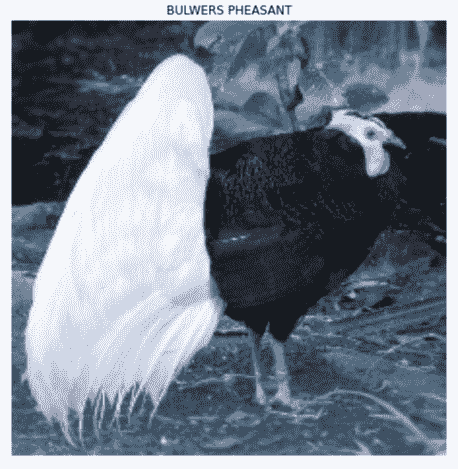

*The image above is a sample from the dataset along with the class that it belongs to | [Source](https://web.archive.org/web/20221206144339/https://www.kaggle.com/datasets/gpiosenka/100-bird-species)*

#### 准备数据

我们可以继续创建一个数据加载器，将图像转换成图像张量。除此之外，我们还将执行尺寸调整、图像裁剪和规范化。一旦预处理完成，我们就可以使用 DataLoader 函数批量自动生成用于训练的数据。以下伪函数将让您了解我们正在努力实现的目标，您可以在代码标题中提供的链接中找到完整的代码:

[预处理. py](https://web.archive.org/web/20221206144339/https://github.com/Nielspace/ViT-Pytorch/blob/main/source/preprocessing.py)

```py

def Dataset(bs, crop_size, sample_size='full'):
      return train_data, valid_data, test_data

```

上面的函数有一个样本大小参数，它允许创建训练数据集的子集，以便在本地机器上进行测试。

## 用于图像分类的 MLOps 流水线:使用 Pytorch 构建视觉转换器

我已经按照作者在论文中对 ViT 的描述创建了完整的模型。这段代码的灵感来自于 [**jeonsworld**](https://web.archive.org/web/20221206144339/https://github.com/jeonsworld/ViT-pytorch) repo，为了这个任务的目的，我增加了一些更多的细节并编辑了一些代码行。

我创建的模型分为 9 个模块，每个模块可以独立执行各种任务。为了便于理解，我们将探讨每个部分。

### 把...嵌入

变形金刚和所有的自然语言模型都有一个重要的组件叫做**嵌入**。它的功能通常是通过将相似的信息组合在一起来捕获语义信息。除此之外，嵌入可以跨模型学习和重用。

在 ViT 中，嵌入通过保留可以输入编码器的位置信息来达到同样的目的。同样，下面的伪代码将帮助您理解发生了什么，您也可以在代码标题中提供的链接中找到完整的代码。

[embedding.py](https://web.archive.org/web/20221206144339/https://github.com/Nielspace/ViT-Pytorch/blob/main/source/embeddings.py)

```py
class Embeddings(nn.Module):

   def __init__(self, img_size:int, hidden_size:int, in_channels:int):

   def forward(self, x):

       return embeddings

```

请注意，可以使用卷积层来创建图像的嵌入补丁。这是非常有效的，也很容易修改。

### 编码器

编码器由许多关注模块组成，关注模块本身有两个重要模块:

## 

*   1 自我注意机制

*   2 多层感知器(MLP)

#### 自我注意机制

先说自我关注机制。

自我关注机制是整个系统的核心。它使模型能够关注数据的重要特征。它通过对不同位置的单个嵌入进行操作来计算相同序列的表示。您可以在下面找到完整代码的链接，以获得更深入的了解。

[attention.py](https://web.archive.org/web/20221206144339/https://github.com/Nielspace/ViT-Pytorch/blob/main/source/attention.py)

```py

class Attention(nn.Module):
       return attention_output, weights
```

注意力块的输出将产生注意力输出以及注意力权重。后者将用于可视化使用注意机制计算的 ROI。

#### 多层感知器

一旦我们接收到注意力输出，我们就可以把它输入到 MLP 中，这将给我们一个分类的概率分布。您可以在 forward 函数中了解整个过程。要查看完整代码，请单击下面代码标题中提供的链接。

[linear.py](https://web.archive.org/web/20221206144339/https://github.com/Nielspace/ViT-Pytorch/blob/main/source/linear.py)

```py

class Mlp(nn.Module):
   def __init__(self, hidden_size, linear_dim, dropout_rate, std_norm):
       return x
```

值得注意的是，我们使用 GELU 作为我们的激活函数。

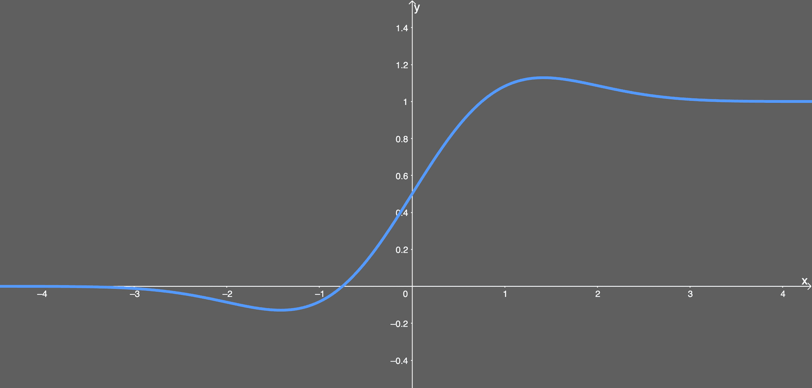

*GELU as activation function | [Source](https://web.archive.org/web/20221206144339/https://mlfromscratch.com/activation-functions-explained/#/)*

使用 GELU 的好处之一是它避免了消失梯度，这使得模型易于缩放。

#### 注意力阻断

注意模块是我们组装两个模块的模块:自我注意模块和 MLP 模块。

[attention_block.py](https://web.archive.org/web/20221206144339/https://github.com/Nielspace/ViT-Pytorch/blob/main/source/attention_block.py)

```py

class Block(nn.Module):
       return x, weights

```

该模块还将直接从注意力机制中产生注意力权重，以及由 MLP 产生的分布。

现在让我们简单了解一下编码器。编码器本质上使我们能够创建多个注意块，给转换器更多对注意机制的控制。三个组件:编码器、变压器和 ViT 写在同一个模块中，即 [transformers.py](https://web.archive.org/web/20221206144339/https://github.com/Nielspace/ViT-Pytorch/blob/main/source/attention_block.py) 。

```py

class Encoder(nn.Module):
       return encoded, attn_weights
```

### 变压器

组装好关注模块后，我们就可以对转换器进行编码了。注意块转换器是嵌入模块和编码器模块的组合。

```py
class Transformer(nn.Module):
   def __init__(self, img_size, hidden_size, in_channels, num_layers,
                num_attention_heads, linear_dim, dropout_rate, attention_dropout_rate,
                eps, std_norm):
       super(Transformer, self).__init__()
       self.embeddings = Embeddings(img_size, hidden_size, in_channels)
       self.encoder = Encoder(num_layers, hidden_size, num_attention_heads,
                              linear_dim, dropout_rate, attention_dropout_rate,
                              eps, std_norm)

   def forward(self, input_ids):
       embedding_output = self.embeddings(input_ids)
       encoded, attn_weights = self.encoder(embedding_output)
       return encoded, attn_weights

```

### 视觉变压器

最后，我们可以编码我们的视觉转换器，它包括两个组件:转换器和最终的线性层。最终的线性将帮助我们找到所有类别的概率分布。它可以被描述为:

```py
class VisionTransformer(nn.Module):
   def __init__(self, img_size, num_classes, hidden_size, in_channels, num_layers,
                num_attention_heads, linear_dim, dropout_rate, attention_dropout_rate,
                eps, std_norm):
       super(VisionTransformer, self).__init__()
       self.classifier = 'token'

       self.transformer=Transformer(img_size, hidden_size, in_channels,
                                    num_layers, num_attention_heads, linear_dim,
                                    dropout_rate, attention_dropout_rate, eps,
                                    std_norm)
       self.head = Linear(hidden_size, num_classes)

   def forward(self, x, labels=None):
       x, attn_weights = self.transformer(x)
       logits = self.head(x[:, 0])

       if labels is not None:
           loss_fct = CrossEntropyLoss()
           loss = loss_fct(logits.view(-1, 400), labels.view(-1))
           return loss
       else:
           return logits, attn_weights
```

请注意，网络将持续产生注意力权重，这对可视化注意力地图非常有用。

这是额外的小费。如果您想要查看模型的架构以及输入是如何操作的，那么使用下面的代码行。代码将为您生成一个完整的操作架构。

```py
from torchviz import make_dot
x = torch.randn(1,config.IN_CHANNELS*config.IMG_SIZE*config.IMG_SIZE)
x = x.reshape(1,config.IN_CHANNELS,config.IMG_SIZE,config.IMG_SIZE)
logits, attn_weights = model(x)
make_dot(logits, params=dict(list(model.named_parameters()))).render("../metadata/VIT", format="png")
```

你可以在给定的[链接](https://web.archive.org/web/20221206144339/https://github.com/Nielspace/ViT-Pytorch/blob/main/metadata/VIT.png)中找到图像。

但简而言之，这就是建筑的样子。


*The architecture of vision transformer | [Source](https://web.archive.org/web/20221206144339/https://arxiv.org/pdf/2010.11929.pdf)*

## 用于图像分类的 MLOps 流水线:使用 Pytorch 训练视觉转换器

在培训模块中，我们将组装所有其他模块，如配置模块、预处理模块和转换器，并将包括元数据在内的参数记录到 Neptune API 中。记录参数最简单的方法是使用 Config。__ 词典 _ _。这会自动将类转换成字典。

您可以稍后创建一个函数，从字典中删除不必要的属性。

```py
def neptune_monitoring():
   PARAMS = {}
   for key, val in Config.__dict__.items():
       if key not in ['__module__', '__dict__', '__weakref__', '__doc__']:
           PARAMS[key] = val
   return PARAMS
```

### 培养

训练函数非常简单明了。我在伪代码中包含了培训和评估。您可以在此找到[完整的训练模块，或者您可以点击下面的代码标题。](https://web.archive.org/web/20221206144339/https://github.com/Nielspace/ViT-Pytorch/blob/main/source/train.py)

[train.py](https://web.archive.org/web/20221206144339/https://github.com/Nielspace/ViT-Pytorch/blob/main/source/train.py)

```py
def train_Engine(n_epochs, train_data, val_data, model, optimizer, loss_fn, device,
                monitoring=True):

```

现在我们的训练循环已经完成，我们可以开始训练并将元数据记录到 [Neptune.ai](/web/20221206144339/https://neptune.ai/) 仪表板中，我们可以使用它在旅途中监控训练，保存图表和参数，并与队友共享它们。

[train.py](https://web.archive.org/web/20221206144339/https://github.com/Nielspace/ViT-Pytorch/blob/main/source/train.py)

```py
if __name__ == '__main__':
   from preprocessing import Dataset
   from config import Config
   config = Config()
   params = neptune_monitoring(Config)

   run = neptune.init( project="nielspace/ViT-bird-classification",
                       api_token=API_TOKEN)
   run['parameters'] = params

   model = VisionTransformer(img_size=config.IMG_SIZE,
                num_classes=config.NUM_CLASSES,
                hidden_size=config.HIDDEN_SIZE,
                in_channels=config.IN_CHANNELS,
                num_layers=config.NUM_LAYERS,
                num_attention_heads=config.NUM_ATTENTION_HEADS,
                linear_dim=config.LINEAR_DIM,
                dropout_rate=config.DROPOUT_RATE,
                attention_dropout_rate=config.ATTENTION_DROPOUT_RATE,
                eps=config.EPS,
                std_norm=config.STD_NORM)

   train_data, val_data, test_data = Dataset(config.BATCH_SIZE, config.IMG_SIZE,
                                             config.DATASET_SAMPLE)

   optimizer = optim.Adam(model.parameters(), lr=0.003)
   train_Engine(n_epochs=config.N_EPOCHS, train_data=train_data, val_data=val_data,
               model=model,optimizer=optimizer, loss_fn='nll_loss',
               device=config.DEVICE[1], monitoring=True)
```

**注意**:这个模型的原型是在 Macbook Air M1 的一个更小的数据集上完成的，这个数据集有 10 个类。在原型阶段，我尝试了不同的配置，并尝试了模型的架构。一旦我满意了，我就用 Kaggle 来训练这个模型。由于数据集有 400 个类，模型需要更大，并且需要更长时间的训练。

### 实验跟踪

在原型阶段，实验跟踪成为对模型进行进一步修改的一个非常方便和可靠的来源。您可以在训练期间关注模型的性能，并随后对其进行必要的调整，直到您获得一个高性能的模型。

Neptune API 使您能够:

如果您想在系统中记录您的元数据，那么导入 Neptune API 并调用 init 函数。接下来，输入为项目提供的 API 键，就可以开始了。在这里了解更多关于如何[开始使用 Neptune 的信息。另外，](https://web.archive.org/web/20221206144339/https://docs.neptune.ai/getting-started/installation)[这里是 Neptune 仪表板](https://web.archive.org/web/20221206144339/https://app.neptune.ai/nielspace/ViT-bird-classification/experiments?split=tbl&dash=charts&viewId=standard-view)，它有与这个项目相关的元数据。

```py
run = neptune.init(project="nielspace/ViT-bird-classification",
api_token="API_TOKEN")
```

一旦完成初始化，就可以开始日志记录了。例如，如果您想要:

1.  上传参数，使用:run['parameters'] = params。注意:确保参数是字典类的。
2.  上传指标，使用:run['Training_loss']。log(loss.item())并运行['Training_loss']。log(loss.item())
3.  上传模型权重，使用:run["model_checkpoints/ViT"]。上传(" model.pt ")
4.  上传图片，使用:run["val/conf_matrix"]。上传("混淆 _ 矩阵. png ")

根据您优化模型的目的，有很多事情可以记录和跟踪。在我们的例子中，我们强调训练和验证的损失和准确性。

#### 记录元数据和仪表板

在持续的培训过程中，您可以监控模型的性能。随着每次迭代，图形将会更新。

除了模型的性能，您还会发现 CPU 和 GPU 的性能。见下图。

您还可以找到所有的模型元数据。

[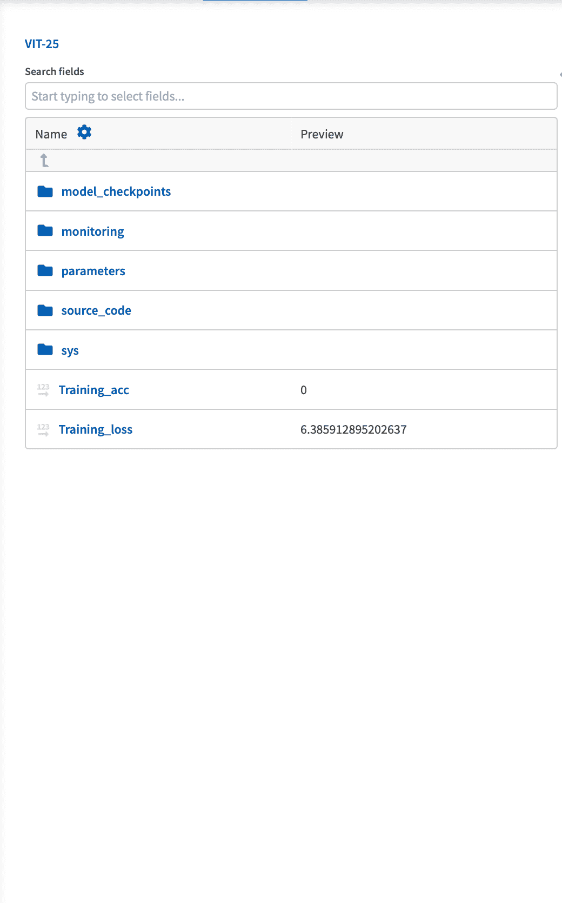](https://web.archive.org/web/20221206144339/https://neptune.ai/mlops-pipeline-computer-vision-6)

*The model metadata*

### 使用 Kaggle 缩放

现在，让我们缩放模型。我们将在这个项目中使用 Kaggle，因为它是免费的，也因为数据集是从 Kaggle 下载的，所以它将很容易在平台本身上扩展和训练模型。

1.  我们需要做的第一件事是上传模型，将目录路径更改为 Kaggle 特定的路径，并启用 GPU。

2.  请注意，模型必须是复杂的，以便捕捉用于预测的相关信息。您可以通过逐渐增加隐藏层的数量并观察模型的行为来开始缩放模型。你可能不希望接触其他参数，如注意力头的数量和隐藏大小，因为它可能会抛出算术错误。

3.  对于每一次更改，您都要让模型在所有 400 个类别的小数据批次中运行至少两个时期，并观察准确性是否在提高。通常，它会增加。

4.  一旦满意，运行模型 10 到 15 个时期，对于 30000 个样本的子集，这将花费大约 5 个小时。

5.  在训练之后，在测试数据集上检查它的性能，如果它表现良好，则下载模型权重。此时，对于 400 个类，模型的大小应该在 650 MB 左右。

### 注意力可视化

如前所述，自我关注是整个视觉转换器架构的关键，有趣的是，有一种方法可以将其可视化。注意图的源代码可以在这里找到[。我对它做了一点修改，并将其创建为一个单独的独立模块，可以使用转换器的输出来生成注意力地图。这里的想法是存储输入图像及其对应的注意图图像，并在 README.md 文件中显示。](https://web.archive.org/web/20221206144339/https://github.com/jeonsworld/ViT-pytorch/blob/main/visualize_attention_map.ipynb)

[attention_viz.py](https://web.archive.org/web/20221206144339/https://github.com/Nielspace/ViT-Pytorch/blob/main/source/attention_viz.py) ( [来源](https://web.archive.org/web/20221206144339/https://github.com/jeonsworld/ViT-pytorch/blob/main/visualize_attention_map.ipynb))

```py
def attention_viz(model, test_data, img_path=PATH, device='mps'):

```

我们可以通过简单地调用 **attention_viz** 函数并传递相应的参数来运行这段代码。

```py
if __name__ == '__main__':
   train_data, val_data, test_data = Dataset(config.BATCH_SIZE,config.IMG_SIZE, config.DATASET_SAMPLE)
   model = torch.load('metadata/models/model.pth', map_location=torch.device('cpu'))
   attention_viz(model, test_data, PATH)
```

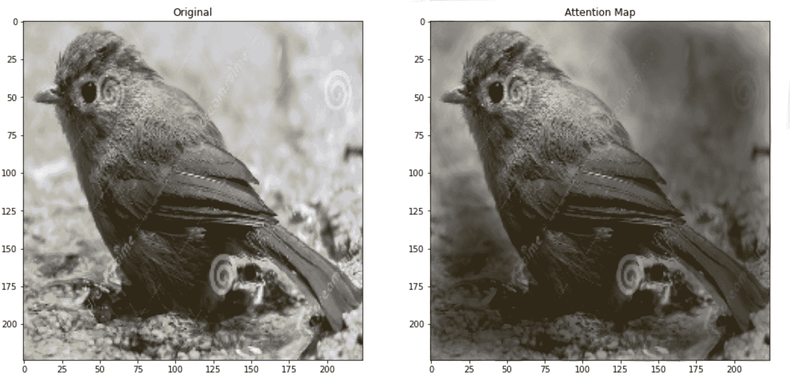

*The image above is an example of attention visualization. The image on the left is the original image whereas the image on the right is overlaid with the attention map. The region i.e. the face of the bird is quite bright as that area constitutes the features to which the model is paying attention *

### 测试和推理

我们还可以在测试模块中使用 **attention_viz** 函数，我们将在测试数据上测试模型，并测量模型在各种指标上的性能，如混淆矩阵、准确度分数、f1 分数、召回分数和精确度分数。

[test.py](https://web.archive.org/web/20221206144339/https://github.com/Nielspace/ViT-Pytorch/blob/main/source/test.py)

```py
def test(model, test_data):
   return logits_, ground, confusion_matrix

```

我们可以使用 seaborn 的热图轻松生成混淆矩阵并进行可视化，并将其保存在 results 文件夹中，我们还可以使用该文件夹在 README.md 文件中显示它。

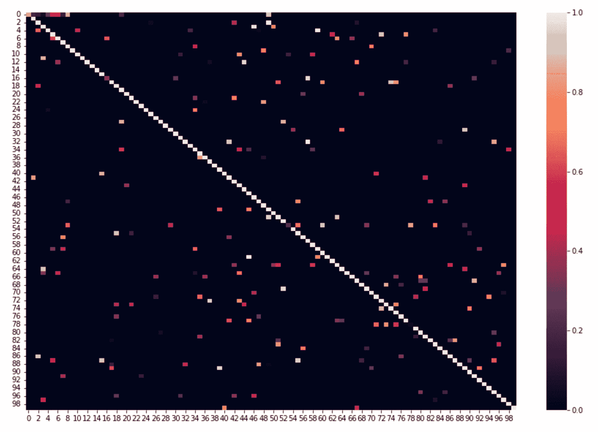

*Above is the image of a confusion matrix that is of the shape 100X100 trained for 50 epochs. As you can see the model is quite efficient to predict true positives which can be seen in the diagonals in white color. But there are few false positives across the graph which means that the model still makes wrong predictions*

我们还可以生成精度和损失图，并将其存储在结果文件夹中。因此，我们可以使用 Sklearn 找到其他度量，但在此之前，我们必须将 tensors 数组转换为 NumPy 数组。

```py
probs = torch.zeros(len(logits_))
y_ = torch.zeros(len(ground))
idx = 0
for l, o in zip(logits_, ground):
   _, l = torch.max(l, dim=1)
   probs[idx] = l
   y_[idx] = o.item()
   idx+=1

prob = probs.to(torch.long).numpy()
y_ = y_.to(torch.long).numpy()

print(accuracy_score(y_, prob))
print(cohen_kappa_score(y_, prob))
print(classification_report(y_, prob))
```

一旦我们对模型的性能感到满意，我们就可以通过同时创建一个 Streamlit 应用程序来进行推理。

## 用于影像分类的 MLOps 管道:使用 Streamlit 创建应用程序

[Streamlit](https://web.archive.org/web/20221206144339/https://streamlit.io/) 应用将是一个网络应用，我们将部署在云上。为了构建应用程序，我们必须首先 pip 安装 streamlit，然后在新模块中导入库。

该模块将包含与推理模块相同的模块，我们只需要复制和粘贴评估函数，然后使用 Streamlit 库构建应用程序。下面是应用程序的代码。

[app.py](https://web.archive.org/web/20221206144339/https://github.com/Nielspace/ViT-Pytorch/blob/main/source/app.py)

```py
import warnings
warnings.simplefilter(action='ignore', category=FutureWarning)

from PIL import Image
import torch
from torchvision import transforms
import torch
import streamlit as st

from embeddings import Embeddings
from attention_block import Block
from linear import Mlp
from attention import Attention
from transformer import VisionTransformer, Transformer, Encoder

from config import Config
config = Config()

st.set_option('deprecation.showfileUploaderEncoding', False)
st.title("Bird Image Classifier")
st.write("")

file_up = st.file_uploader("Upload an image", type = "jpg")

def predict(image):
   """Return top 5 predictions ranked by highest probability.
   Parameters
   ----------
   :param image: uploaded image
   :type image: jpg
   :rtype: list
   :return: top 5 predictions ranked by highest probability
   """
   model = torch.load('model.pth')

   transform = transforms.Compose([
       transforms.Resize(128),
       transforms.CenterCrop(128),
       transforms.ToTensor(),
       transforms.Normalize(
           mean = [0.485, 0.456, 0.406],
           std = [0.229, 0.224, 0.225])])

   img = Image.open(image)
   x = transform(img)
   x = torch.unsqueeze(x, 0)
   model.eval()
   logits, attn_w = model(x)

   with open('../metadata/classes.txt', 'r') as f:
       classes = f.read().split('n')

   prob = torch.nn.functional.softmax(logits, dim = 1)[0] * 100
   _, indices = torch.sort(logits, descending = True)
   return [(classes[idx], prob[idx].item()) for idx in indices[0][:5]]

if file_up is not None:

   image = Image.open(file_up)
   st.image(image, caption = 'Uploaded Image.', use_column_width = True)
   st.write("")
   st.write("Processing...")
   labels = predict(file_up)

   for i in labels:
       st.write(f"Prediction {i[0]} score {i[1]:.2f}")
```

但是在部署之前，我们必须在本地进行测试。为了测试应用程序，我们将运行以下命令:

```py
streamlit run app.py
```

一旦执行了上述命令，您将得到以下提示:

```py
You can now view your Streamlit app in your browser.

  Local URL: http://localhost:8501
  Network URL: http://192.168.0.105:8501
```

复制网址粘贴到你的浏览器，app 就上线了(本地)。

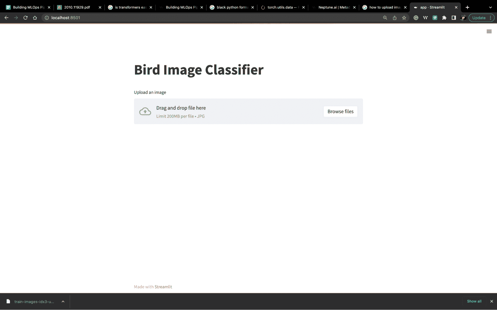

*Copied URL*

上传图片进行分类。

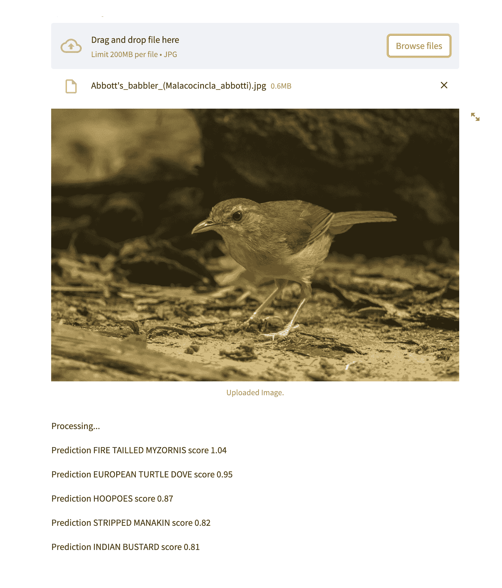

*Uploaded image*

随着 ViT 模型的训练和应用程序的准备，我们的目录结构应该看起来像这样:

```py
.
├── README.md
├── metadata
│   ├── Abbott's_babbler_(Malacocincla_abbotti).jpg
│   ├── classes.txt
│   ├── models
│   │   └── model.pth
│   └── results
│       ├── accuracy_loss.png
│       ├── attn.png
│       └── confusion_matrix.png
├── notebooks
│   ├── ViT.ipynb
│   └── __init__.py
└── source
    ├── __init__.py
    ├── app.py
    ├── attention.py
    ├── attention_block.py
    ├── attention_viz.py
    ├── config.py
    ├── embeddings.py
    ├── linear.py
    ├── metrics.py
    ├── preprocessing.py
    ├── test.py
    ├── train.py
    ├── transformer.py 
```

现在我们开始部署应用程序。

## 用于图像分类的 MLOps 流水线:代码格式化

首先，让我们格式化我们的 Python 脚本。为此，我们将使用黑色。Black 是一个 Python 脚本格式化程序。你所需要做的就是 pip 安装 black，然后运行 ***`black `*** 跟在 python 模块甚至整个目录的名字后面。对于这个项目，我运行 black，然后运行包含所有 python 模块的源目录。

```py
ViT-Pytorch git:(main) black source
Skipping .ipynb files as Jupyter dependencies are not installed.
You can fix this by running ``pip install black[jupyter]``
reformatted source/config.py
reformatted source/embeddings.py
reformatted source/attention_block.py
reformatted source/linear.py
reformatted source/app.py
reformatted source/attention_viz.py
reformatted source/attention.py
reformatted source/preprocessing.py
reformatted source/test.py
reformatted source/metrics.py
reformatted source/transformer.py
reformatted source/train.py

```

使用 black 的好处是去掉了不必要的空格，增加了双引号而不是单引号，让审查代码更快更高效。

下面给出了使用**黑色**格式化代码前后的图像。

[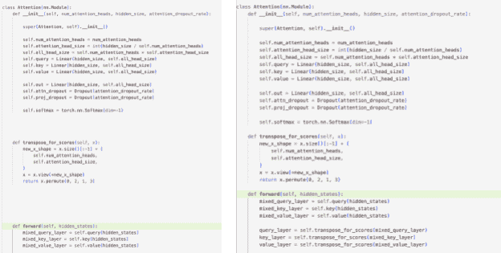](https://web.archive.org/web/20221206144339/https://neptune.ai/mlops-pipeline-computer-vision-11)

*Examples before and after using black to format the code*

如你所见，不必要的空格被删除了。

## 用于图像分类的 MLOps 管道:设置 CI/CD

对于我们的 CI/CD 流程，我们将使用 **Github Actions、**和 **Google Cloud Build** 来集成和部署我们的 Streamlit 应用程序。以下步骤将帮助您创建完整的 MLOps 管道。

#### 创建 Github 存储库

第一步是创建 Github 存储库。但在此之前，我们必须创建三个重要文件:

## 

*   1 要求. txt

*   2 makefile

*   3 main.yml

#### requirements.txt

requirements.txt 文件必须包含模型正在使用的所有库。有两种方法可以创建 requirements.txt 文件。

1.  如果您有专门为此项目创建的专用工作环境，那么您可以运行 pip freeze>requirements.txt，它将为您创建一个 requirements.txt 文件。
2.  如果您有一个通用的工作环境，那么您可以运行 pip 冻结并复制粘贴您一直在工作的库。

该项目的 requirement.txt 文件如下所示:

```py
numpy==1.22.3
torch==1.12.0
torchvision==0.12.0
tqdm==4.64.0
opencv-python==4.6.0.66
streamlit==1.10.0
neptune-client==0.16.3

```

**注意:**始终确保你提到的版本，以便在未来，应用程序保持稳定和最佳性能。

#### 生成文件

简而言之，Makefile 是一个命令提示符文件，它可以自动完成安装库和依赖项、运行 Python 脚本等等的整个过程。典型的 Makefile 如下所示:

```py
setup:
   python3 -m venv ~/.visiontransformer
   source ~/.visiontransformer/bin/activate
   cd .visiontransformer
install:
   pip install --upgrade pip &&
       pip install -r requirements.txt
run:
   python source/test.py
all: install run
```

对于这个项目，我们的 Makefile 将有三个过程:

## 

*   1 设置虚拟环境并激活它。

*   2 安装所有的 Python 库。

*   3 运行一个测试文件。

实际上，每次我们进行新的提交时，都会执行 makefile，它会自动运行 test.py 模块，生成最新的性能指标并更新 README.md 文件。

但是 Makefile 只有在我们创建一个动作触发器时才能工作。让我们来创造它。

#### 动作触发器:。github/workflow/main.yml

要创建动作触发器，我们需要创建以下目录:。github/workflow，之后创建一个 **main.yml** 文件。每当 repo 被更新时，main.yml 将创建一个动作触发器。

我们的目标是持续集成现有构建中的任何变更，如更新参数、模型架构，甚至 UI/UX。一旦检测到更改，它将自动更新 README.md 文件。这个项目的 main.yml 被设计为在任何 push 或 pull 请求时触发工作流，但是只针对 main 分支。

在每次新提交时，该文件将激活 ubuntu-latest 环境，安装特定的 python 版本，然后执行 Makefile 中的特定命令。

[main.yml](https://web.archive.org/web/20221206144339/https://github.com/Nielspace/ViT-Pytorch/blob/main/Makefile)

```py
name: Continuous Integration with Github Actions

on:
 push:
   branches: [ main ]
 pull_request:
   branches: [ main ]

jobs:
 build:
   runs-on: ubuntu-latest

   steps:
     - uses: actions/checkout@v2
     - name: Set up Python 3.8
       uses: actions/setup-python@v1
       with:
         python-version: 3.8
     - name: Install dependencies
       run: |
         make install
         make run

```

#### 测试

创建文件后，您可以将整个代码库推送到 Github。上传后，您可以点击 Actions 选项卡，亲自查看内置进度。


*Build-in progress in the Actions tab*

#### 部署:Google 云构建

测试完成后，Github README.md 文件中的所有日志和结果都已更新，我们可以进入下一步，即将应用程序集成到云中。

1.  首先，我们将访问:[https://console.cloud.google.com/](https://web.archive.org/web/20221206144339/https://console.cloud.google.com/)，然后我们将在仪表板中创建一个新项目，并将其命名为 Vision Transformer Pytorch。


*Creating a new project*

一旦创建了项目，您就可以导航到该项目，它看起来会像这样:

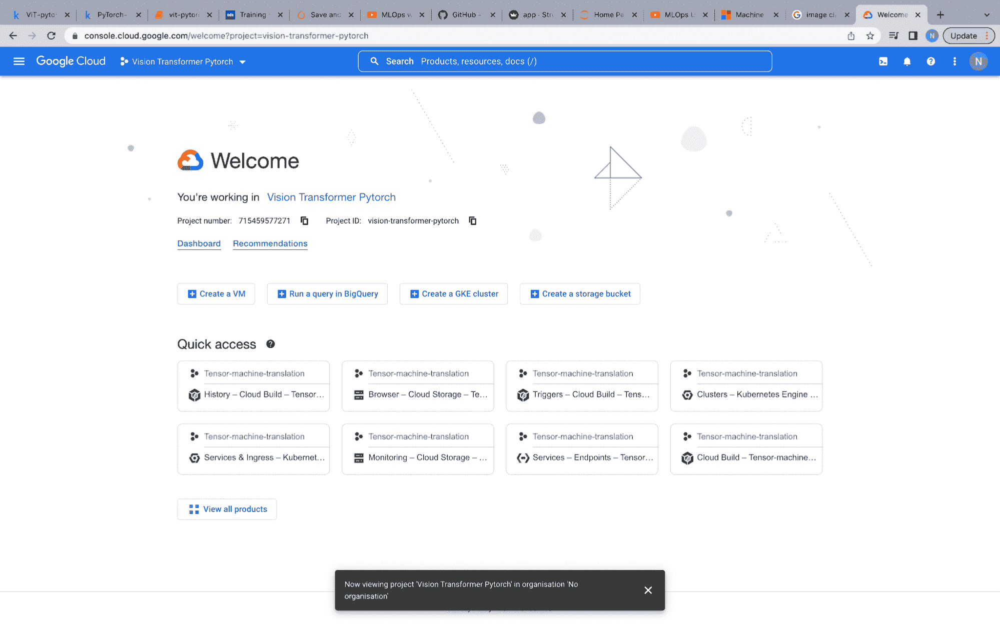

*The project*

如你所见，google cloud build 在项目主页上为我们提供了各种现成的服务，如虚拟机、大查询、GKE 或 Kubernetes 集群。但是在我们在云构建中创建任何东西之前，我们必须启用 Kubernetes 集群，并在项目目录中创建某个目录和它们各自的文件。

2.  **Kubernetes**

让我们在创建任何文件之前设置我们的 Kubernetes 集群。为此，我们可以在谷歌云控制台搜索栏中搜索 GKE 并启用 API。


*Setting up Kubernetes cluster*

启用 API 后，我们将导航到下一页。

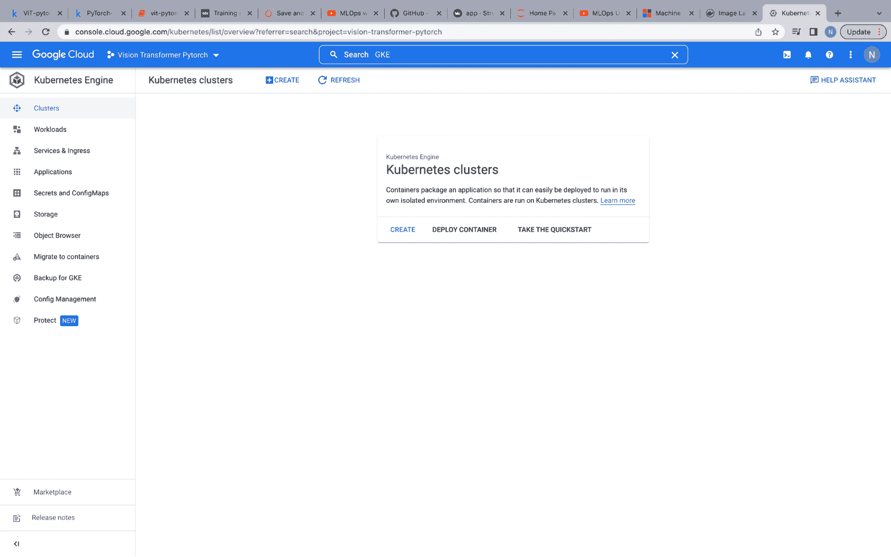

*Kubernetes cluster*

但是我们将使用内置的云 shell 来创建集群，而不是手动创建集群。为此，点击右上角的终端按钮，查看下图。


*Activating Cloud Shell*


*Creating cluster by using inbuild cloud shell*

激活云 shell 后，我们可以键入以下命令来创建 Kubernetes 集群:

```py
gcloud container clusters create project-kube --zone "us-west1-b" --machine-type "n1-standard-1" --num-nodes "1"
```

这通常需要 5 分钟。

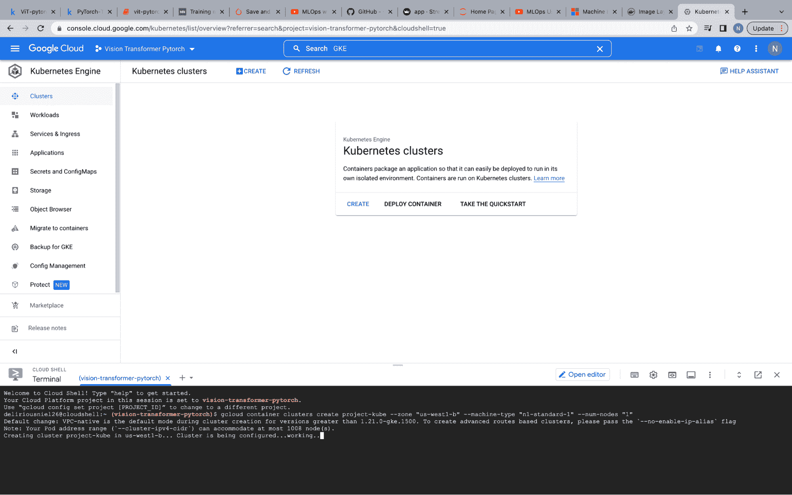

*Creating Kubernetes clusters*

完成后，它看起来会像这样:

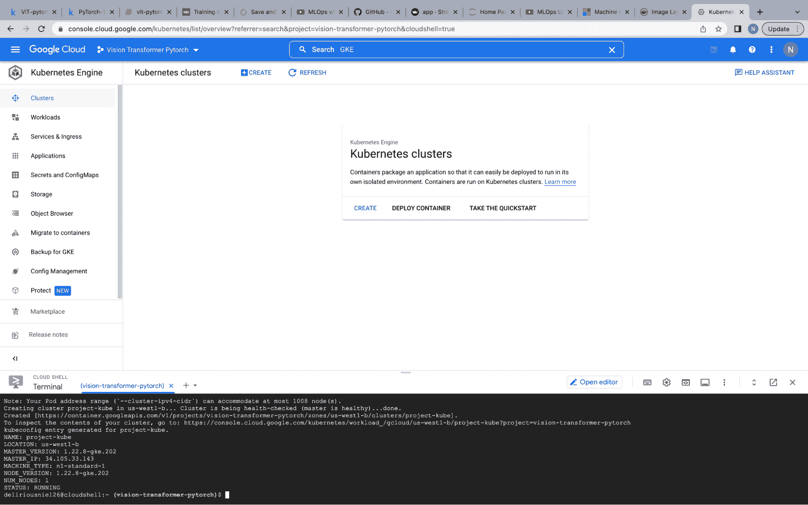

*Kubernetes clustering completed*

现在让我们设置两个配置 Kubernetes 集群的文件:deployment.yml 和 service.yml。

yml 文件允许我们在云中部署模型。根据要求，部署可以是淡黄色、重新创建、蓝绿色或任何其他颜色。在本例中，我们将覆盖部署。这个文件也有助于使用参数**副本**有效地缩放模型。下面是一个 deployment.yml 文件的示例。

[deployment.yml](https://web.archive.org/web/20221206144339/https://github.com/Nielspace/ViT-Pytorch/blob/main/kubernetes/deployment.yml)

```py

apiVersion: apps/v1
kind: Deployment
metadata:
 name: imgclass
spec:
 replicas: 1
 selector:
   matchLabels:
     app: imageclassifier
 template:
   metadata:
     labels:
       app: imageclassifier
   spec:
     containers:
     - name: cv-app
       image: gcr.io/vision-transformer-pytorch/vit:v1
       ports:
       - containerPort: 8501
```

下一个文件是 service.yml 文件。它本质上是将应用从容器连接到现实世界。注意到*容器端口*参数被指定为 8501，我们将在我们的 service.yml 中为*目标端口*参数使用相同的数字。这与 Streamlit 用来部署应用程序的数字相同。除此之外，两个文件中的*应用*参数是相同的。

[服务. yml](https://web.archive.org/web/20221206144339/https://github.com/Nielspace/ViT-Pytorch/blob/main/kubernetes/service.yml)

```py

apiVersion: v1
kind: Service
metadata:
 name: imageclassifier
spec:
 type: LoadBalancer
 selector:
   app: imageclassifier
 ports:
 - port: 80
   targetPort: 8501
```

**注意**:一定要确保 app 的名字和版本都是小写的。

3.  **Dockerfile**

现在让我们配置 Dockerfile 文件。该文件将创建一个 Docker 容器来托管我们的 Streamlit 应用程序。Docker 是非常必要的，因为它将应用程序包装在一个易于扩展的环境中。典型的 docker 文件如下所示:

[Dockerfile](https://web.archive.org/web/20221206144339/https://github.com/Nielspace/ViT-Pytorch/blob/main/Dockerfile)

```py
FROM python:3.8.2-slim-buster

RUN apt-get update

ENV APP_HOME /app
WORKDIR $APP_HOME
COPY . ./

RUN ls -la $APP_HOME/

RUN pip install -r requirements.txt

CMD [ "streamlit", "run","app.py" ]

```

Dockerfile 包含一系列命令，这些命令:

*   安装 Python 版本。
*   将本地代码复制到容器映像。
*   安装所有库。
*   执行 Streamlit 应用程序。

请注意，我们使用的是 Python 3.8，因为一些依赖项使用的是最新的 Python 版本。

4.  **cloudbuild.yaml**

在 Google Cloudbuild 中，cloudbuild.yml 文件将所有工件缝合在一起，创建了一个无缝管道。它有三个主要步骤:

*   使用当前目录中的 Docker 文件构建 Docker 容器。
*   将容器推送到 google 容器注册表。
*   在 Kubernetes 引擎中部署容器。

[云构建. yml](https://web.archive.org/web/20221206144339/https://github.com/Nielspace/ViT-Pytorch/blob/main/cloudbuild.yaml)

```py
steps:
- name: 'gcr.io/cloud-builders/docker'
 args: ['build', '-t', 'gcr.io/vision-transformer-pytorch/vit:v1', '.']
 timeout: 180s
- name: 'gcr.io/cloud-builders/docker'
 args: ['push', 'gcr.io/vision-transformer-pytorch/vit:v1']
- name: "gcr.io/cloud-builders/gke-deploy"
 args:
 - run
 - --filename=kubernetes/ 
 - --location=us-west1-b
 - --cluster=project-kube
```

**注意**:请交叉检查 deployment.yml 和 cloudbuild.yml 文件中的容器名等参数。此外，还要用 clouldbuild.yml 文件中的集群名称交叉检查您之前创建的集群名称。最后，确保*文件名*参数与 deployment.yml 和 service.yml 所在的 Kubernetes 目录相同。

创建文件后，整个项目的文件结构应该如下所示:

```py
.
├── Dockerfile
├── .github/workflow/main.yml
├── Makefile
├── README.md
├── cloudbuild.yaml
├── kubernetes
│   ├── deployment.yml
│   └── service.yml
├── metadata
│   ├── Abbott's_babbler_(Malacocincla_abbotti).jpg
│   ├── classes.txt
│   ├── models
│   │   └── model.pth
│   └── results
│       ├── accuracy_loss.png
│       ├── attn.png
│       └── confusion_matrix.png
├── notebooks
│   ├── ViT.ipynb
│   └── __init__.py
├── requirements.txt
└── source
    ├── __init__.py
    ├── app.py
    ├── attention.py
    ├── attention_block.py
    ├── attention_viz.py
    ├── config.py
    ├── embeddings.py
    ├── linear.py
    ├── metrics.py
    ├── preprocessing.py
    ├── test.py
    ├── train.py
    ├── transformer.py
    └── vit-pytorch.ipynb 
```

5.  **克隆和测试**

现在，让我们在 google cloud build 项目中克隆 GitHub repo，将其放入 cd 中，并运行 cloudbuild.yml 文件。使用以下命令:

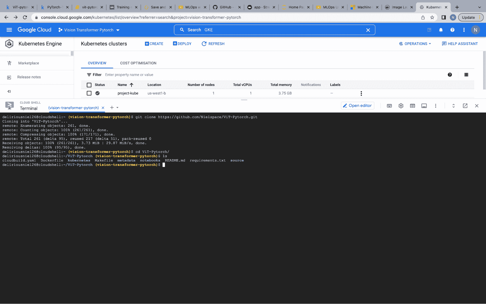

*Cloning the GitHub repo*

*   *gcloud builds 提交–配置 cloudbuild.yaml*

部署过程将如下所示:


*The deployment process*

6.  部署大约需要 10 分钟，这取决于各种因素。如果一切都正确执行，您将会看到这些步骤用绿色标记进行了颜色编码。


*Succcessful deployment*

7.  部署成功后，您可以在 Kubernetes 引擎的 Services & Ingress 选项卡中找到应用程序的端点。单击端点，它会将您导航到 Streamlit 应用程序。


*The endpoints*

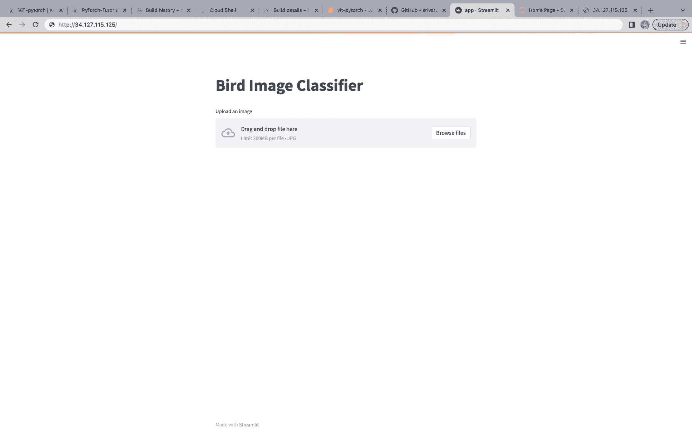

*The Streamlit app*

**附加提示:**

1.  确保在所有*中使用小写的应用程序名称和项目 id。yml 配置文件。
2.  交叉检查所有*的论点。yml 配置文件。
3.  由于您是在虚拟环境中拷贝您的存储库，请交叉检查所有目录和文件路径。
4.  如果在云构建过程中出现错误，请寻找一个命令来帮助您解决在错误语句中发现的错误。请看下图，以便更好地理解；我突出显示了在重新运行云构建命令之前需要执行的命令。

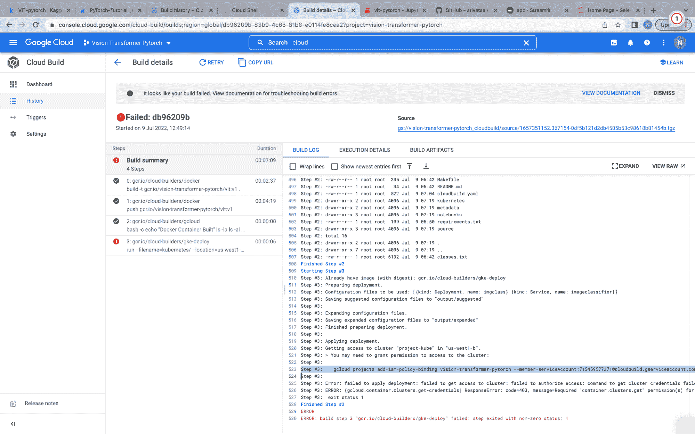

*An error in the cloud build process*

#### 云构建集成

现在，我们将把 Google cloud 构建集成到 Github repo 中。这将创建一个触发操作，每当在回购中进行更改时，该操作将更新构建。

1.  在市场中搜索谷歌云构建

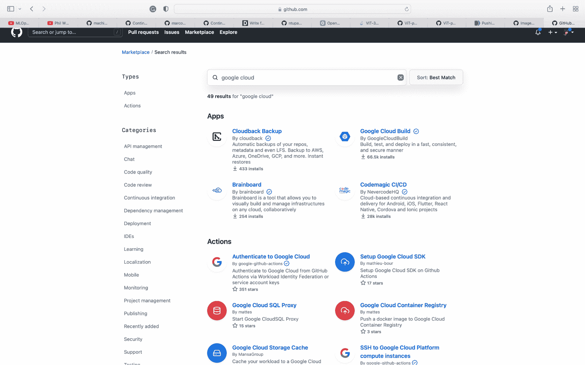

*Searching for Google Cloud Build*

2.  选择要连接的回购。在这种情况下，它将是 ViT-Pytorch 并保存它。

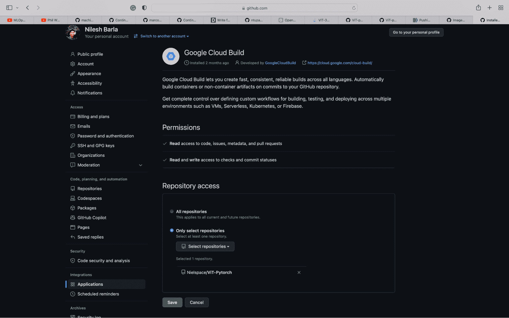

*Selecting the repo*

3.  在 Google Cloud Build 中，我们将转到 Cloud Build 页面，并单击 Triggers 选项卡来创建触发器。


*Creating triggers*

4.  单击“创建触发器”后，我们将被导航到下面的页面。这里我们将提到触发器名称，选择将触发 cloudbuild.yml 文件的事件，并选择项目存储库。

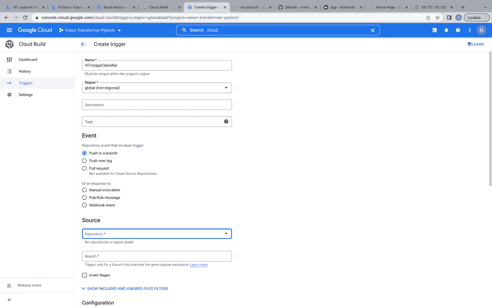

*Trigger settings*

5.  遵循认证过程。

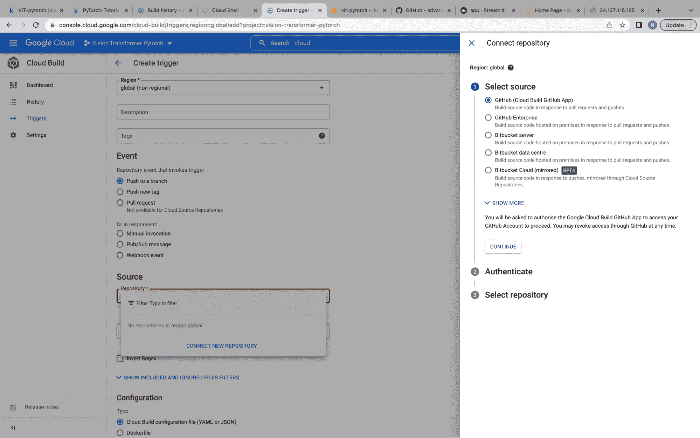

*Authentication process*

6.  连接存储库。

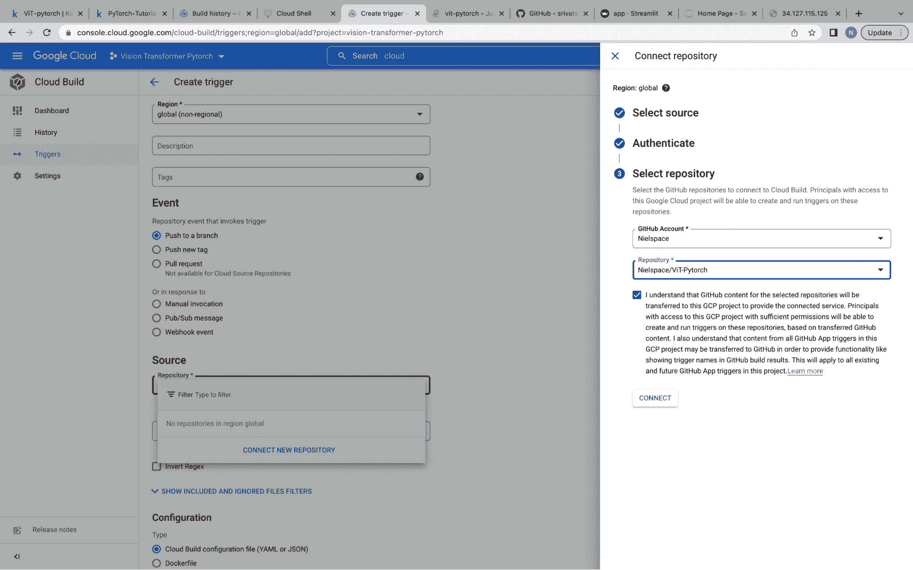

*Connecting the repository*

7.  最后，创建触发器。

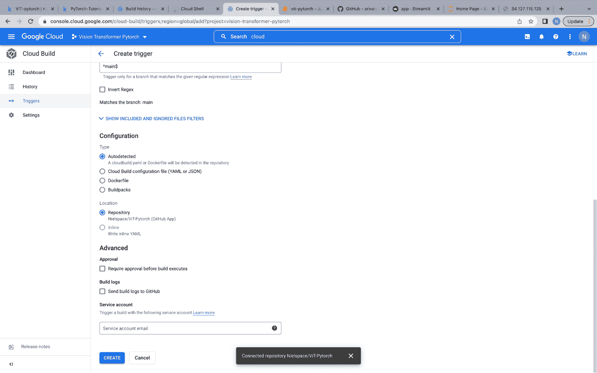

*Creating the trigger*

既然已经创建了触发器，那么您在 Github repo 中所做的所有更改都将被自动检测到，并且部署也将被更新。

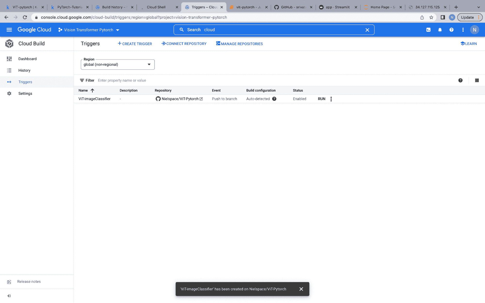

*Created trigger*

#### 监控模型衰减

随着时间的推移，模型会衰退，这将影响预测能力。我们需要定期监控性能。一种方法是偶尔在新数据集上测试模型，并在我之前提到的指标上进行评估，如 F1 分数、准确度分数、精确度分数等。

监控模型性能的另一个有趣的方法是使用 AUROC 指标，它测量模型的区分性能。因为此项目是多分类项目，所以您可以将其转换为二元分类项目，然后检查模型的性能。如果模型的性能已经衰退，那么必须用新的样本和更大的样本再次训练模型。如果真的需要，那么也要修改架构。

[这里的](https://web.archive.org/web/20221206144339/https://gist.github.com/khizirsiddiqui/559a91dab223944fb83f8480715d2582)是代码的链接，它将允许您测量 AUROC 分数。

## 结论

在本文中，我们学习了使用 Pytorch 和 Streamlit 通过 Vision Transformer 构建一个图像分类器应用程序。我们还看到了如何使用 Github 操作和技术(如 Kubernetes、Dockerfile 和 Makefile)在 Google 云平台上部署应用程序。

本项目的重要收获:

1.  更大的数据需要更大的模型，这本质上需要更多时代的训练。
2.  在创建原型实验时，减少类的数量，并测试准确性是否随着每个历元而增加。在 Kaggle 或 Colab 等云服务上使用 GPU 之前，尝试不同的配置，直到您确信模型的性能正在提高。
3.  使用各种性能指标，如混淆指标、精确度、召回率、混淆指标、f1 和 AUROC。
4.  一旦部署了模型，就可以偶尔而不是频繁地对模型进行监控。
5.  为了进行监控，使用像 AUROC 分数这样的性能指标是很好的，因为它会自动创建阈值并绘制模型的真阳性率和假阳性率。有了 AUROC 评分，就可以很容易地比较模型以前和当前的性能。
6.  只有当模型发生显著漂移时，才应该重新训练模型。由于像这样的模型需要大量的计算资源，频繁的重新训练可能是昂贵的。

我希望你发现这篇文章信息丰富，实用。你可以在这个 [Github repo](https://web.archive.org/web/20221206144339/https://github.com/Nielspace/ViT-Pytorch) 中找到完整的代码。也可以随意与他人分享。

### 参考

1.  [一幅图像值 16×16 个字:大规模图像识别的变形金刚](https://web.archive.org/web/20221206144339/https://arxiv.org/pdf/2010.11929.pdf)
2.  [变形金刚比 CNN 更健壮吗？](https://web.archive.org/web/20221206144339/https://arxiv.org/abs/2111.05464)
3.  [https://www . kdnugges . com/2022/01/machine-learning-models-die-silence . html](https://web.archive.org/web/20221206144339/https://www.kdnuggets.com/2022/01/machine-learning-models-die-silence.html)
4.  [https://github.com/jeonsworld/ViT-pytorch](https://web.archive.org/web/20221206144339/https://github.com/jeonsworld/ViT-pytorch)
5.  [https://gist . github . com/khizirsiddiqui/559 a 91 dab 223944 FB 83 f 8480715d 2582](https://web.archive.org/web/20221206144339/https://gist.github.com/khizirsiddiqui/559a91dab223944fb83f8480715d2582)
6.  [https://github.com/srivatsan88/ContinousModelDeploy](https://web.archive.org/web/20221206144339/https://github.com/srivatsan88/ContinousModelDeploy)
7.  [为 NLP 构建 MLOps 管道:机器翻译任务](https://web.archive.org/web/20221206144339/https://neptune.ai/blog/mlops-pipeline-for-nlp-machine-translation)