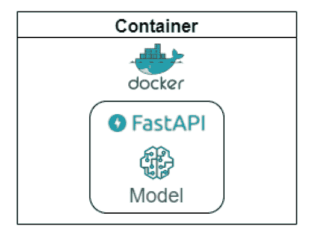
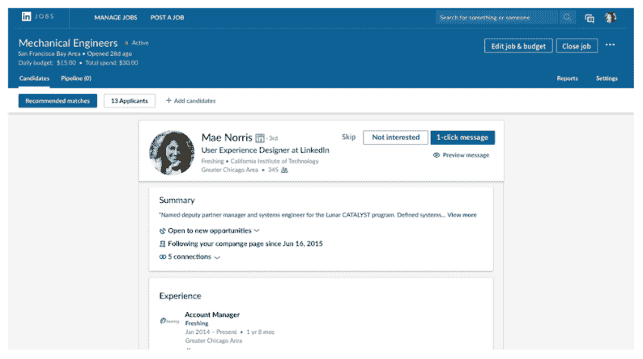

# 模型部署挑战:来自 6 ML 工程师的 6 堂课

> 原文：<https://web.archive.org/web/https://neptune.ai/blog/model-deployment-challenges-lessons-from-ml-engineers>

部署机器学习模型很难！如果你不相信我，去问任何一个被要求将他们的模型投入生产的 ML 工程师或数据团队。为了进一步支持这一说法， [Algorithima](https://web.archive.org/web/20220926093626/https://algorithmia.com/) 的“ [2021 年企业 ML 状态](https://web.archive.org/web/20220926093626/https://info.algorithmia.com/hubfs/2020/Reports/2021-Trends-in-ML/Algorithmia_2021_enterprise_ML_trends.pdf)”报告称，组织部署机器学习模型所需的时间正在增加，64%的组织需要一个月或更长时间。同一份报告还指出，38%的组织将超过 50%的数据科学家时间用于将机器学习模型部署到生产中，并且随着规模的扩大，情况只会变得更糟。

由于 [MLOps](/web/20220926093626/https://neptune.ai/blog/mlops) 仍然是一个新兴领域，很难找到既定的最佳实践和模型部署示例来实施机器学习解决方案，因为问题的解决方案可能会因以下因素而异:

## 

*   1 业务用例的类型
*   2 使用的技术
*   3 涉及的人才
*   4 组织规模和结构

*   5 和可用资源

不管您的机器学习模型部署管道如何，在本文中，您将了解许多 ML 工程师及其团队所面临的模型部署挑战，以及他们为应对这些挑战而采用的变通方法。**本文的目的是让您从不同行业、组织规模、不同用例的角度来看待这些挑战，如果您在部署场景中面临类似问题，希望这可以成为您的一个良好起点。**

***注意:**这些挑战在发布前已经得到前述工程师的批准和审核。如果你有任何想要解决的问题，请随时通过 [LinkedIn](https://web.archive.org/web/20220926093626/https://www.linkedin.com/in/stephenoladele/) 联系我。*

## 事不宜迟，ML 工程师告诉我们关于模型部署的 6 个难点:

## 挑战 1:为机器学习解决方案选择正确的生产需求

**组织:** [网飞](https://web.archive.org/web/20220926093626/https://www.netflix.com/)

**团队规模:**没有专门的 ML 团队

**行业:**媒体和娱乐

### 用例

网飞内容推荐问题是机器学习的一个众所周知的用例。这里的业务问题是:如何为用户提供个性化的、准确的和按需的内容推荐？反过来，他们又如何获得推荐内容的优质流媒体体验？

感谢一位来自网飞的前软件工程师(他不愿透露姓名)在这篇文章发表前给了我一次采访和审阅的机会。

### 挑战

#### 网飞内容推荐问题

对于网飞的工程团队来说，部署推荐服务是一项艰巨的挑战。内容推荐服务提出了一些有趣的挑战，其中为用户和下游服务提供高度可用和个性化的推荐是主要的挑战。正如一位前网飞工程师指出的:

> "*流和推荐的业务目标是，每次任何人登录网飞，我们都需要能够提供推荐。因此，生成推荐的服务器的可用性必须非常高。*
> 
>  *Ex-Software Engineer at* [*Netflix*](https://web.archive.org/web/20220926093626/https://netflix.com/)

当用户想要观看内容时，提供点播推荐也直接影响内容的可用性:

> “假设我向你推荐《纸牌屋》,作为你需要观看的节目，如果你最终点击并播放了该节目，那么我们还需要保证我们能够以非常可靠的方式向你提供流媒体。因此，我们无法将所有这些内容从我们的数据中心传输到您的设备，因为如果我们这样做，网飞运营所需的带宽将会摧毁许多国家的互联网基础设施。”
> 
>  *Ex-Software Engineer at* [*Netflix*](https://web.archive.org/web/20220926093626/https://netflix.com/)

例如，当你流媒体播放你推荐的节目时，为了确保一个[质量的流媒体体验](https://web.archive.org/web/20220926093626/https://netflixtechblog.com/a-b-testing-and-beyond-improving-the-netflix-streaming-experience-with-experimentation-and-data-5b0ae9295bdf#9c23)，网飞不得不从成千上万[受欢迎的](https://web.archive.org/web/20220926093626/https://netflixtechblog.com/content-popularity-for-open-connect-b86d56f613b#5785)内容[中选择推荐的标题，这些内容被主动缓存在他们由成千上万](https://web.archive.org/web/20220926093626/https://netflixtechblog.com/netflix-and-fill-c43a32b490c0#789b)[开放连接设备](https://web.archive.org/web/20220926093626/https://openconnect.netflix.com/en/appliances/) (OCAs)组成的全球网络中。这有助于确保推荐的标题对于观众来说也是高度可用的，因为如果它们不能无缝地流式传输，那么提供点播推荐又有什么用呢！

推荐服务将需要以高精度容易地预测他们的用户将观看什么以及他们将在一天中的什么时间观看，以便他们可以利用非高峰带宽在这些可配置的时间窗口期间将大多数内容更新下载到他们的 OCA。你可以在[本公司博客](https://web.archive.org/web/20220926093626/https://about.netflix.com/en/news/how-netflix-works-with-isps-around-the-globe-to-deliver-a-great-viewing-experience)中了解更多关于网飞 [Open Connect](https://web.archive.org/web/20220926093626/https://openconnect.netflix.com/en/) 技术的信息。

因此，面临的挑战是在部署他们的建议模型之前选择正确的生产要求，以确保:

*   推荐服务是高度可用的，
*   向用户提供新鲜的、个性化的推荐，
*   推荐的标题已准备好从 OCA 传输到用户的设备。

### 解决办法

#### 为业务目标和工程目标选择最佳生产要求

团队必须选择一个对工程和商业问题都最优的生产需求。因为推荐不必为每个用户每分钟或每一小时改变，因为它们不会实时改变，所以模型评分可以离线进行，并且在用户登录到他们的设备后提供:

> “在生成推荐方面，网飞所做的是离线训练他们的推荐模型，然后部署这些模型，为每一个离线消费者生成一组推荐。然后他们会将这些生成的推荐存储在数据库中。”
> 
>  *Ex-Software Engineer at* [*Netflix*](https://web.archive.org/web/20220926093626/https://netflix.com/)

这解决了工程问题，因为:

*   大规模推荐是为每个用户离线评分和预先计算的。
*   它们也不依赖于为每个用户大规模运行推荐服务的高可用性服务器——这将非常昂贵——而是依赖于存储在数据库中的结果。

这使得网飞能够以更高效的方式向全球用户群提供推荐。

对于商业问题，当用户登录到他们的设备时，可以向他们显示推荐的标题。由于标题可能已经为用户缓存在 Open Connect CDN 中，一旦用户点击“播放”,推荐的标题就准备好被流式传输。这里需要注意的一点是，如果推荐在几个小时后稍微过时，那么与加载缓慢或过时数天、数周或数月的推荐相比，用户体验可能不会受到影响。

在高可用性方面，网飞规模的在线评分或学习将不可避免地导致服务器的延迟问题。这很可能会给基础架构和运营带来压力，进而影响用户体验，进而影响业务。选择一个从工程和商业角度来看都是最佳的生产要求，有助于团队确保解决这一挑战。

## 挑战 2:简化模型部署和机器学习操作(MLOps)

**机构** : [宣传者](https://web.archive.org/web/20220926093626/https://hypefactors.com/)

**团队规模**:小团队

**行业**:公关&传播，媒体情报

*感谢* [*越南阮氏*](https://web.archive.org/web/20220926093626/https://www.linkedin.com/in/nguyenvietyen/) *允许我使用宣传者在 AWS* *上发表的* [*文章。*](https://web.archive.org/web/20220926093626/https://aws.amazon.com/blogs/machine-learning/simplified-mlops-with-deep-java-library/)

### 用例

一种广告预测功能，用于过滤直接从出版社、数千种不同媒体内容(如杂志和报纸)接收的付费广告。这些媒体内容以数字文件的形式流入数据处理管道，该管道从这些来源中提取相关细节，并预测它是否是广告。

*Hypefactors dashboard | [Source](https://web.archive.org/web/20220926093626/https://hypefactors.com/dashboard/)*

### 挑战

在构建 ad-predictor 的第一个版本时，该团队选择在无服务器平台上部署该模型。他们在外部服务上部署了一个独立的 ad predictor 端点，该端点将从数据管道中获取数据并执行无服务器推理。

虽然无服务器部署具有自动扩展实例、按需运行以及提供易于集成的接口等优势，但它也带来了一些众所周知的挑战:

*   **将数据管道与预测服务**分离，增加操作难度。
*   **高网络调用和长启动时间(冷启动问题)**，导致返回预测结果的高延迟。
*   **自动缩放数据管道和预测服务**以补偿来自管道的高流量。

> *“由于网络调用和启动时间，预测具有更高的延迟，从而导致超时和因实例中断导致预测器不可用而产生的问题。我们还必须自动扩展数据管道和预测服务，考虑到不可预测的事件负载，这一点非常重要。”*
> 
> *Hypefactors team*

### 解决办法

> **“我们对这些挑战的解决方案以结合两个框架的优势为中心:* [*开放神经网络交换*](https://web.archive.org/web/20220926093626/https://onnx.ai/) *(ONNX)和深度 Java 库(DJL)。通过 ONNX 和 DJL，我们在渠道中直接部署了新的多语言广告预测模型。这取代了我们的第一个解决方案，即无服务器广告预测器。”**
> 
> *Hypefactors team*

为了解决他们在第一个版本中遇到的挑战，他们使用 [ONNX 运行时](https://web.archive.org/web/20220926093626/https://onnxruntime.ai/)来[量化](https://web.archive.org/web/20220926093626/https://pytorch.org/docs/stable/quantization.html)模型，并将其与[深度 Java 库](https://web.archive.org/web/20220926093626/https://djl.ai/) (DJL)一起部署，这与他们基于 Scala 的数据管道兼容。将模型直接部署在管道中确保了模型与管道的耦合，并且可以随着数据管道扩展到流传输的数据量而扩展。

该解决方案还在以下方面帮助他们改进了系统:

1.  该模型不再是一个独立的外部预测服务；它现在与数据管道相结合。这**确保了延迟的减少**并且推理是实时进行的，不需要启动另一个实例或将数据从管道移动到另一个服务。
2.  它帮助**简化了他们的测试套件**，带来了更多的测试稳定性。
3.  它允许团队**将其他机器学习模型与管道**集成，进一步改善数据处理管道。
4.  它**简化了模型管理**，帮助团队轻松地发现、跟踪和重现推理错误。

要从 Hypefactors 团队了解这个特定用例的解决方案的更多信息，您可以查看他们在 AWS 博客上发布的这篇文章。

## 挑战 3:为机器学习操作导航组织结构

**组织** : [阿科拉](https://web.archive.org/web/20220926093626/https://www.arkera.ai/)

**团队规模** : 4 名数据科学家和 3 名数据分析师

**行业**:金融科技——市场情报

*感谢* [*拉斯洛·斯拉格纳*](https://web.archive.org/web/20220926093626/https://www.linkedin.com/in/laszlosragner/) *在本节选发表前给予我采访和审阅的机会。*

### 用例

一个处理新兴市场新闻的系统，为交易者、资产管理者和对冲基金管理者提供情报。

*Arkera.ai LinkedIn cover image | [Source](https://web.archive.org/web/20220926093626/https://media-exp1.licdn.com/dms/image/C4D1BAQGUazfINFmPXQ/company-background_10000/0/1569336475437?e=1638658800&v=beta&t=p8ZTZ5BCQnqx_sUxfdGGUFxl1cE9tsDZVcPTsdstsPM)*

### 挑战

> *“我看到的最大挑战是，生产环境通常属于软件工程师或 DevOps 工程师。机器学习工程师和软件工程师之间需要就他们的 ML 模型如何在 DevOps 或软件工程团队的监督下投入生产进行某种交流。必须保证你的代码或模型能够正确运行，你需要找出最好的方法。”*
> 
> *Laszlo Sragner, ex-Head of Data Science at [Arkera](https://web.archive.org/web/20220926093626/https://www.arkera.ai/)*

数据科学家面临的一个常见挑战是，编写生产代码与开发环境中的代码有很大不同。当他们为实验编写代码并提出模型时，移交过程很棘手，因为将模型或管道代码部署到生产环境会带来不同的挑战。

如果工程团队和 ML 团队不能就模型或管道代码在部署到生产时不会失败达成一致，这很可能会导致可能导致整个应用程序错误的失败模式。故障模式可能是:

*   **系统故障**:由于加载或评分时间慢、异常错误、非统计错误等错误导致生产系统崩溃。
*   **统计失败**:或“无声”失败，即模型持续输出错误的预测。

这两种故障模式中的一种或两种都需要由两个团队来解决，但是在解决之前，团队需要知道他们负责什么。

### 解决办法

#### 模型检验

为了解决 ML 和软件工程团队之间的信任挑战，需要有一种方法让每个人都可以确保交付的模型能够按预期工作。到那时为止，两个团队能够达成一致的唯一方法是在部署之前测试模型，使模型能够按预期工作。

> “我们是如何解决这个(挑战)的？这个用例是大约 3 年前的事了，比 [*【谢顿】*](https://web.archive.org/web/20220926093626/https://www.seldon.io/) *或者任何一种部署工具都要早得多，所以我们需要竭尽所能。我们所做的是将模型资产存储在 protobufs 中，并将它们发送给工程团队，他们可以在那里对模型进行测试，并将其部署到生产中。”*
> 
> **Laszlo Sragner, ex-Head of Data Science at [Arkera](https://web.archive.org/web/20220926093626/https://www.arkera.ai/)**

软件工程团队必须测试该模型，以确保它按照要求输出结果，并与生产中的其他服务兼容。他们会向模型发送请求，如果服务失败，他们会向数据团队提供一份报告，说明他们向模型传递了什么类型的输入。

他们当时使用的技术是 [TensorFlow](https://web.archive.org/web/20220926093626/https://www.tensorflow.org/) 、 [TensorFlow Serving](https://web.archive.org/web/20220926093626/https://www.tensorflow.org/tfx/guide/serving) 和 [Flask](https://web.archive.org/web/20220926093626/https://flask.palletsprojects.com/) 为基础的微服务 direct[tensor flow Serving](https://web.archive.org/web/20220926093626/https://www.tensorflow.org/tfx/guide/serving)实例。Laszlo 承认，如果他要再次解决这个部署挑战，他会使用 [FastAPI](https://web.archive.org/web/20220926093626/https://fastapi.tiangolo.com/) 并将模型直接加载到 [Docker](https://web.archive.org/web/20220926093626/https://www.docker.com/) 容器中，或者只是使用供应商创建的产品。

*FastAPI + Docker deployment tool | Source: Author*

#### 创建有界上下文

Laszlo 团队采用的另一种方法是创建一个“[有界上下文](https://web.archive.org/web/20220926093626/https://martinfowler.com/bliki/BoundedContext.html)”，为 ML 和软件工程团队形成领域边界。这使得机器学习团队知道他们负责的错误并拥有它们——在这种情况下，模型内发生的一切，即统计错误。软件工程团队负责模型之外的领域。

这有助于团队了解在任何给定的时间点谁负责什么:

*   如果一个错误发生在生产系统中，工程团队追溯到模型，他们会把错误交给 ML 团队。
*   如果需要快速修复错误，工程团队将退回到旧模型(作为应急协议)，以给机器学习团队时间来修复模型错误，因为他们无法在生产环境中进行故障排除。

这个用例也是在模型注册中心爆炸之前，所以模型(序列化为 [protobuf](https://web.archive.org/web/20220926093626/https://developers.google.com/protocol-buffers) 文件)被存储在一个 S3 桶中，并作为目录列出。当对模型进行更新时，它是通过一个拉请求来完成的。

在紧急协议的情况下，负责维护模型之外的基础设施的软件工程师将回滚到模型的前一个拉请求，而 ML 团队用最近的拉请求来排查错误。

#### 更新预测服务

如果 ML 团队想要部署一个新的模型，并且它不需要对它的部署方式进行任何改变，那么这个模型将被重新训练，新的模型资产被创建并作为一个单独的模型被上传到 S3 存储桶，并且一个拉取请求与模型目录一起被创建，因此工程团队可以知道有一个更新的模型可以被部署。

## 挑战 4:模型开发(离线)和部署(在线推断)度量的相关性

**组织** : [LinkedIn](https://web.archive.org/web/20220926093626/https://www.linkedin.com/)

**团队规模**:未知

**行业**:面向商业的社交网络

*感谢* [*斯凯勒·佩恩*](https://web.archive.org/web/20220926093626/https://www.linkedin.com/in/skylar-payne-766a1988/) *在这篇节选发表前给我一次采访和审阅。*

### 用例

[推荐匹配](https://web.archive.org/web/20220926093626/https://www.linkedin.com/business/talent/blog/product-tips/new-linkedin-jobs-features-give-small-businesses-easier-way-find-candidates)是 LinkedIn 的 [LinkedIn Jobs](https://web.archive.org/web/20220926093626/https://business.linkedin.com/talent-solutions/cx/17/03/jobs-single-cta-2-bg) 产品中的一项功能，它为用户的公开招聘职位提供候选人推荐，随着时间的推移，这些推荐会根据用户的反馈变得更有针对性。该功能的目标是让用户不必花费时间费力地浏览数百个应用程序，并帮助他们更快地找到合适的人才。

*A screenshot from the Recommended Matches feature | [Source](https://web.archive.org/web/20220926093626/https://engineering.linkedin.com/blog/2019/04/ai-behind-linkedin-recruiter-search-and-recommendation-systems)*

### 挑战

#### 同一模型的离线和在线指标的相关性

Skylar 的团队在部署候选人推荐服务时遇到的一个挑战是在线和离线指标之间的相关性。对于推荐问题，通常很难将模型的离线结果与适当的在线指标联系起来:

> *“部署模型的一个真正大的挑战是在您的离线和在线指标之间建立关联。搜索和推荐在在线和离线指标之间建立关联已经是一个挑战，因为你有一个很难解决或评估的反事实问题。”*
> 
> [*Skylar Payne*](https://web.archive.org/web/20220926093626/https://www.linkedin.com/in/skylar-payne-766a1988/) *ex-Staff Software Engineer at* [*LinkedIn*](https://web.archive.org/web/20220926093626/https://www.linkedin.com/)

对于像这样的大规模推荐服务，使用离线学习的模型(但使用活动特征进行在线推断)的一个缺点是，在当前搜索会话期间，当招聘人员审查推荐的候选人并提供反馈时，很难将招聘人员的反馈考虑在内。这使得很难用正确的标签在线跟踪模特的表现，即他们不能确定推荐给招聘人员的候选人是否是可行的候选人。

从技术上来说，您可以将这样的挑战归类为[训练-服务偏斜](https://web.archive.org/web/20220926093626/https://developers.google.com/machine-learning/guides/rules-of-ml#training-serving_skew)挑战，但是这里要注意的关键点是，该团队拥有推荐引擎的部分排序和检索堆栈，他们无法在离线时非常有效地再现，因此训练要部署的健壮模型提出了模型评估挑战。

#### 模型建议的覆盖范围和多样性

团队面临的另一个问题是建议的覆盖面和多样性，这导致了对部署模型的结果进行度量的困难。有许多潜在候选人的数据从未向招聘人员展示过，因此团队无法判断该模型在选择过程中是否有偏差，或者这是基于招聘人员的要求。由于没有对这些候选人进行评分，因此很难跟踪他们的指标并了解部署的模型是否足够健壮。

> “挑战的一部分是偏见和产品中事物的呈现方式，因此当你对检索的工作方式进行小调整时，很可能我在重新排序和排序后从检索中获得的新文档集将没有该查询的标签。
> 
> 这部分是一个稀疏标签的问题。如果你不提前思考如何解决这个问题，这将是一个挑战。在您的模型评估分析中，您可以将自己置于一个糟糕的境地，在那里您不能真正地对您的模型执行健壮的分析。"
> 
> [*Skylar Payne*](https://web.archive.org/web/20220926093626/https://www.linkedin.com/in/skylar-payne-766a1988/) *ex-Staff Software Engineer at* [*LinkedIn*](https://web.archive.org/web/20220926093626/https://www.linkedin.com/)

### 解决办法

> “归根结底，我们在如何进行评估方面变得更加稳健。我们使用了许多不同的工具…”
> 
> [*Skylar Payne*](https://web.archive.org/web/20220926093626/https://www.linkedin.com/in/skylar-payne-766a1988/) *ex-Staff Software Engineer at* [*LinkedIn*](https://web.archive.org/web/20220926093626/https://www.linkedin.com/)

该团队试图用几种技术来解决这些挑战:

*   使用反事实评估标准。
*   避免对推荐引擎堆栈的检索层进行更改。

#### 使用反事实评估技术

该团队用来对抗模型选择偏差的技术是反向倾向评分(IPS)技术，旨在根据从在线招聘人员与产品的互动中收集的日志，离线评估候选人排名政策。正如 Skylar 解释的那样:

> “我们经常关注和使用的一种技术是反向倾向评分技术。基本上，你可以通过反向倾向评分来消除样本中的一些偏差。这是有帮助的。”
> 
> [*Skylar Payne*](https://web.archive.org/web/20220926093626/https://www.linkedin.com/in/skylar-payne-766a1988/) *ex-Staff Software Engineer at* [*LinkedIn*](https://web.archive.org/web/20220926093626/https://www.linkedin.com/)

[本文](https://web.archive.org/web/20220926093626/https://vision.cornell.edu/se3/wp-content/uploads/2018/08/recsys18_unbiased_eval.pdf)作者杨等人。艾尔。根据为[反事实评估](https://web.archive.org/web/20220926093626/https://en.wikipedia.org/wiki/Impact_evaluation#Counterfactual_evaluation_designs)开发的 IPS 技术，提供了使用无偏见评估者的更多细节。

#### 避免对检索层进行更改

根据 Skylar 的说法，当时的临时解决方案是，他们避免对推荐堆栈中的检索层进行任何可能影响候选人被推荐给招聘人员的更改，从而无法在线跟踪模型结果。正如 Skylar 在下面指出的，一个更好的解决方案可能是构建支持更健壮的工具或帮助测量检索层的变化的工具，但当时，构建这种工具的资源是有限的。

> *“最终发生的情况是，我们只是尽可能避免对检索层进行更改，因为如果我们进行了更改，它是否会被在线翻译是非常不确定的。*
> 
> 我认为真正的解决方案应该是建立更复杂的工具，比如模拟或分析工具，来衡量恢复阶段的变化。"
> 
> [*Skylar Payne*](https://web.archive.org/web/20220926093626/https://www.linkedin.com/in/skylar-payne-766a1988/) *ex-Staff Software Engineer at* [*LinkedIn*](https://web.archive.org/web/20220926093626/https://www.linkedin.com/)

## 挑战 5:模型部署和机器学习操作(MLOps)的工具和基础设施瓶颈

**组织**:未公开

**团队规模**:团队 15 人

**行业**:零售和消费品

*感谢* [*伊曼纽尔·拉吉*](https://web.archive.org/web/20220926093626/https://www.linkedin.com/in/emmanuelraj7/) *在本节选发表前接受我的采访和审阅。*

### 用例

这个用例是一个为零售客户开发的项目，帮助客户使用机器学习以自动化的方式解决问题。当人们提出问题或由维护问题产生问题时，机器学习用于将问题归类到不同的类别，帮助更快地解决问题。

### 挑战

#### 数据科学家和 ML 工程师之间缺乏标准的开发工具

大多数数据团队在协作时面临的主要挑战之一是团队中人才使用的工具的多样性。如果没有标准工具，每个人都使用他们知道如何最好地使用的工具进行开发，那么统一工作将永远是一个挑战，尤其是在必须部署解决方案的情况下。这是 Emmanuel 的团队在处理这个用例时面临的挑战之一。正如他解释的那样:

> *“一些数据科学家使用 sklearn 开发模型，一些使用 TensorFlow 和不同的框架进行开发。团队没有采用一个标准框架。”*
> 
> [*Emmanuel Raj*](https://web.archive.org/web/20220926093626/https://www.linkedin.com/in/emmanuelraj7/)*, Senior Machine Learning Engineer*

由于工具使用的差异，并且因为这些工具不具有互操作性，团队很难部署他们的 ML 模型。

#### 模型基础设施瓶颈

团队在模型部署过程中面临的另一个问题是整理模型的运行时依赖性和生产中的内存消耗:

*   在某些情况下，在模型容器化和部署之后，一些包会随着时间而贬值。
*   其他时候，当模型在生产环境中运行时，基础设施不会稳定地工作，因为容器集群经常会耗尽内存，导致团队不时地重新启动集群。

### 解决办法

#### 对模型使用开放格式

因为让人们学习一个通用工具要困难得多，所以团队需要一个能够:

*   使使用不同框架和库开发的模型具有互操作性，
*   将团队中每个人的努力整合到一个应用程序中，该应用程序可以被部署来解决业务问题。

该团队决定加入流行的开源项目[开放神经网络交换](https://web.archive.org/web/20220926093626/https://onnx.ai/)(或 ONNX)，这是一个机器学习模型的开放标准，允许团队跨[不同的 ML 框架和工具](https://web.archive.org/web/20220926093626/https://onnx.ai/supported-tools.html)共享模型，促进这些工具之间的互操作性。这样，团队很容易使用不同的工具开发模型，但是相同的模型以特定的格式打包，这使得这种模型的部署不那么具有挑战性。正如 Emmanuel 所承认的:

> 谢天谢地，ONNX 出现了，开放神经网络交换，这帮助我们解决了这个问题。因此，我们会以特定的格式将其序列化，一旦我们有了序列化文件的类似格式，我们就可以将模型容器化并进行部署。”
> 
> [*Emmanuel Raj*](https://web.archive.org/web/20220926093626/https://www.linkedin.com/in/emmanuelraj7/)*, Senior Machine Learning Engineer*

## 挑战 6:处理部署前后的模型大小和比例

**机构** : [总部](https://web.archive.org/web/20220926093626/https://mono.co/)

**团队规模**:小团队

**行业**:金融科技

*感谢* [*【埃梅卡】鲍里斯*](https://web.archive.org/web/20220926093626/https://www.linkedin.com/in/emekaboris/) *在本节选发表前给予我采访和审阅。*

### 用例

MonoHQ 的交易元数据产品使用机器学习对交易语句进行分类，这些交易语句有助于各种企业客户应用程序，如信贷申请、资产规划/管理、BNPL(立即购买，稍后支付)和支付。数以千计的客户的交易基于叙述被分类成不同的类别。

### 挑战

#### 模型尺寸

[自然语言处理](/web/20220926093626/https://neptune.ai/blog/natural-language-processing-with-hugging-face-and-transformers) (NLP)模型以其规模著称——尤其是基于 transformer 的 NLP 模型。埃梅卡面临的挑战是确保他的模型大小满足部署到公司基础架构所需的要求。模型通常加载在内存有限的服务器上，因此它们需要符合一定的大小阈值才能通过部署。

#### 模型可扩展性

埃梅卡在尝试部署他的模型时遇到的另一个问题是，当它与系统中的上游服务集成时，该模型如何扩展以对收到的大量请求进行评分。正如他提到的:

> *“由于该模型在我们的微服务架构中与其他服务相集成，如果我们有 20，000 个事务，这些事务中的每一个都会被单独处理。当多达 4 个客户查询事务元数据 API 时，我们观察到了严重的延迟问题。这是因为该模型连续处理事务，导致对下游服务的响应速度变慢。*
> 
> *在这种情况下，该模型将为每个客户记录多达 5，000 笔交易，并且这是连续发生的，而不是同时发生的。"*
> 
> [*Emeka Boris*](https://web.archive.org/web/20220926093626/https://www.linkedin.com/in/emekaboris/)*, Senior Data Scientist at MonoHQ.*

### 解决方法

#### 通过端点访问模型

优化 NLP 模型的大小通常是在模型鲁棒性或准确性(模型的推理效率)和获得更小的模型之间进行权衡的游戏。埃梅卡以不同的方式处理这个问题。他决定最好将模型存储在其集群上，并通过 API 端点使其可访问，以便其他服务可以与之交互，而不是每次请求时都将模型从 [S3](https://web.archive.org/web/20220926093626/https://aws.amazon.com/s3/) 加载到服务器。

#### 使用 Kubernetes 集群来扩展模型操作

在撰写本文时，埃梅卡正在考虑采用 [Kubernetes](https://web.archive.org/web/20220926093626/https://kubernetes.io/) 集群来扩展他的模型，以便它们可以同时对请求进行评分，并满足下游服务所需的 [SLA](https://web.archive.org/web/20220926093626/https://en.wikipedia.org/wiki/Service-level_agreement) 。他计划在这个解决方案中使用完全管理的 Kubernetes 集群，这样就不用担心管理维护集群所需的基础设施。

## 结论

在本文中，我们了解到 ML 工程师和数据团队面临的模型部署挑战不仅仅是将模型投入生产。它们还包括:

*   思考并选择正确的**业务**和**生产需求**，
*   **不可忽视的基础设施**和**运营关注点**，
*   **组织架构**；团队如何参与和构建项目，
*   **模型测试**，
*   **模型和服务的安全性和合规性**，
*   以及一大堆其他的问题。

希望这些案例中的一个或多个对您有用，因为您也希望解决在您的组织中部署 ML 模型的挑战。

### 参考资料和资源

#### 一般

#### 网飞

#### 催眠因子

#### 商务化人际关系网

### 斯蒂芬·奥拉德勒

开发者倡导者和 MLOps 技术内容创建者。

* * *

**阅读下一篇**

## Continuum Industries 案例研究:如何跟踪、监控和可视化 CI/CD 管道

7 分钟阅读| 2021 年 8 月 9 日更新

[Continuum Industries](https://web.archive.org/web/20220926093626/https://www.continuum.industries/) 是一家基础设施行业的公司，希望自动化和优化线性基础设施资产的设计，如水管、架空传输线、海底电力线或电信电缆。

其核心产品 Optioneer 允许客户输入工程设计假设和地理空间数据，并且**使用进化优化算法来寻找可能的解决方案，以在给定约束的情况下连接 A 点到 B 点。**

首席科学家安德烈亚斯·马莱科斯(Andreas Malekos)致力于研究人工智能发动机，他解释道:

“建造像电力线这样的东西是一个巨大的项目，所以你必须在开始之前获得正确的设计。你看到的设计越合理，你就能做出更好的决定。Optioneer 可以在几分钟内为您提供设计资产，而成本只是传统设计方法的一小部分。”

但是，创建和操作 Optioneer 引擎比看起来更具挑战性:

*   目标函数不代表现实
*   有很多土木工程师事先不知道的假设
*   不同的客户给它提出完全不同的问题，算法需要足够健壮来处理这些问题

与其构建完美的解决方案，不如向他们展示一系列有趣的设计选项，以便他们做出明智的决策。

引擎团队利用来自机械工程、电子工程、计算物理、应用数学和软件工程的各种技能来实现这一目标。

## 问题

无论是否使用人工智能，构建一个成功的软件产品的一个副作用是，人们依赖它工作。当人们依赖您的优化引擎做出价值百万美元的基础设施设计决策时，您需要有一个强大的质量保证(QA)。

正如 Andreas 所指出的，他们必须能够说，他们返回给用户的解决方案是:

*   **好**，意思是这是一个土木工程师可以看到并同意的结果
*   **更正**，这意味着计算并返回给最终用户的所有不同工程数量都尽可能准确

除此之外，该团队还在不断改进优化引擎。但要做到这一点，您必须确保这些变化:

*   不要以这样或那样的方式破坏算法
*   实际上，它们不仅改善了一个基础设施问题的结果，还改善了所有问题的结果

基本上，您需要**建立适当的验证和测试，**但是团队试图解决的问题的性质带来了额外的挑战:

*   您无法自动判断算法输出是否正确。**这不像在 ML 中，你已经标记了数据**来计算你的评估集的准确度或召回率。
*   您**需要一组示例问题，代表算法在生产中需要解决的那类问题的**。此外，这些问题需要被版本化，以便尽可能容易地实现可重复性。

[Continue reading ->](/web/20220926093626/https://neptune.ai/customers/continuum-industries)

* * *