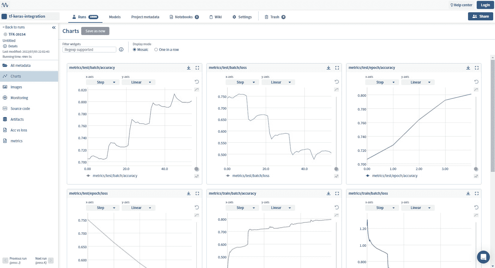
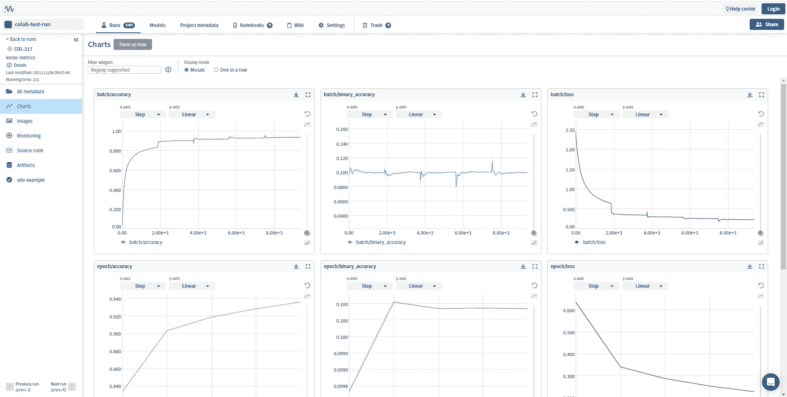
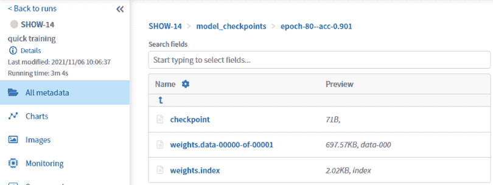

# 海王星现场监测 ML 实验完全指南

> 原文：<https://web.archive.org/web/https://neptune.ai/blog/monitoring-machine-learning-experiments-guide>

训练机器学习或深度学习模型可能需要很长时间。

如果你和我一样，你想知道那段时间发生了什么，你可能会感兴趣:

*   监控您的培训和验证损失，
*   再看 GPU 消耗，
*   每隔一个时期查看图像预测
*   还有一堆其他的东西。

海王星让你做到这一切，在这篇文章中，我会告诉你如何做到这一点。循序渐进。

看看这个[例子，运行](https://web.archive.org/web/20221206002423/https://app.neptune.ai/shared/step-by-step-monitoring-experiments-live/e/STEP-22/charts)，看看它在 Neptune 应用程序中会是什么样子。


如果你想在没有注册的情况下尝试 Neptune monitoring，只需跳转到`Initialize Neptune`部分，作为一个匿名用户从那里开始。

## 设置您的 Neptune 帐户

建立一个项目并将你的脚本连接到 Neptune 是非常简单的，但是你仍然需要这样做🙂

让我们尽快解决这个问题。

### 1.**创建一个项目**

让我们先[创建一个项目](https://web.archive.org/web/20221206002423/https://docs.neptune.ai/setup/creating_project/)。

为此:

*   进入[海王星 app](https://web.archive.org/web/20221206002423/https://app.neptune.ai/) ，
*   点击左边的`New project`按钮，
*   给它一个名字，
*   决定它是公开的还是私人的，
*   完成了。

### 2.**获取您的 API 令牌**

您将需要一个 [Neptune API 令牌](https://web.archive.org/web/20221206002423/https://docs.neptune.ai/setup/setting_api_token/)(您的个人密钥)来连接您用 Neptune 运行的脚本。

为此:

*   点击右边的用户标志
*   点击`Get Your API token`
*   复制您的 API 令牌
*   将它粘贴到环境变量、配置文件中，或者直接粘贴到您的脚本中(如果您真的喜欢冒险的话)🙂

令牌就像密码一样，所以我尽量保护它的安全。

因为我是 Linux 爱好者，所以我把它放在了我的环境文件`~/.bashrc`中。如果您使用不同的系统，请查看文档中的 [API 令牌部分。](https://web.archive.org/web/20221206002423/https://docs.neptune.ai/setup/setting_api_token/)

有了它，无论你何时运行我的训练脚本，Neptune 都会知道你是谁，并适当地记录事情。

### 3.**安装客户端库**

要使用 Neptune，您需要一个客户端库来记录您所关心的一切。

因为我正在使用 Python，所以我将使用 Python 客户端，但是您也可以通过 R 语言使用 Neptune。

您可以用 pip 安装它:

```
pip install neptune-client

```

### 4.初始化海王星

现在您已经设置好了一切，您可以开始监控了！

首先，通过在脚本顶部添加以下内容，将脚本连接到 Neptune:

```
import neptune.new as neptune

run = neptune.init_run(
    project="workspace-name/project-name",
    api_token="Your Neptune API token",
)
```

### 5.创建跑步

使用 [init_run()](https://web.archive.org/web/20221206002423/https://docs.neptune.ai/api/neptune/#init_run) 方法创建一个新的运行。当我们执行上面的 neptune.init_run()时，我们开始了一次运行。

然后，开始的运行在后台跟踪一些系统指标，以及您在代码中记录的任何元数据。默认情况下，Neptune 会定期在后台与服务器同步数据。检查【Neptune 到底自动记录了什么。

到 Neptune 的连接保持打开，直到运行停止或者脚本执行完毕。您可以通过调用 run.stop()来显式停止运行。

#### 但是什么是跑步呢？

一个' [run](https://web.archive.org/web/20221206002423/https://docs.neptune.ai/api/neptune/#init_run) '是项目中的一个名称空间，您可以在其中记录模型构建元数据。

通常，每次执行进行模型训练、重新训练或推理的脚本时，都会创建一个运行。可以将运行视为您在代码中定义的类似字典的结构。

他们有:

*   *字段*，您可以在其中记录您的 ML 元数据
*   *名称空间*，它组织你的字段

无论您创建什么层次元数据结构，Neptune 都会在 UI 中反映出来。

要创建结构化名称空间，请使用正斜杠/

```
run["metrics/f1_score"] = 0.67
run["metrics/test/roc"] = 0.82 
```

上面的片段:

*   创建两个名称空间:metrics 和 metrics/test。
*   为字段 f1_score 和 roc 赋值。

关于 run 参数的完整列表，可以参考 [Neptune 的 API 文档。](https://web.archive.org/web/20221206002423/https://docs.neptune.ai/api/neptune/#init_run)

## 海王星上的监测实验:方法

### 记录基本的东西

简而言之，登录 Neptune 非常简单:

```
run["WHAT_YOU_WANT_TO_LOG"] = ITS_VALUE
```

让我们来看看一些不同的方式，你可以记录重要的事情到海王星。

您可以记录:

*   度量和损失-> `run["accuracy"]=0.90`
*   图像和图表->`run["images"].upload("bboxes.png")`；
*   模型文件之类的工件-> `run["model_checkpoints"].upload("my_model.pt")`
*   和许多其他事情。

有时你可能只是想在训练前后记录一些东西。

在这种情况下，只要做:

```
params = {
    "activation": "sigmoid",
    "dropout": 0.25,
    "learning_rate": 0.1,
    "n_epochs": 100,
} 
```

在其他场景中，有一个训练循环，您可能希望在其中记录一系列值。为此，我们使用。log()函数。

```
for epoch in range(params["n_epochs"]):
    # this would normally be your training loop
    run["train/loss"].log(0.99**epoch)
    run["train/acc"].log(1.01**epoch)
    run["eval/loss"].log(0.98**epoch)
    run["eval/acc"].log(1.02**epoch) 
```

这将创建名称空间“train”和“eval”，每个名称空间都有一个`loss`和`acc`字段。

稍后你可以在应用程序中看到这些可视化的图表。

### 集成日志记录

为了使日志更容易，我们为大多数 Python ML 库创建了集成，包括 PyTorch、TensorFlow、Keras、scikit-learn 等等。你可以在这里看到所有海王星的整合。这些集成为您提供了现成的实用程序，可以记录您通常会在这些 ML 库中记录的大多数 ML 元数据。我们来看几个例子。

#### Monitor TensorFlow/Keras models

Neptune–Keras 集成会自动记录以下元数据:

*   模型摘要
*   用于定型模型的优化程序的参数
*   训练期间传递给 model.fit 的参数
*   每个时期的当前学习率
*   训练期间的硬件消耗和 stdout/stderr 输出
*   培训代码和 Git 信息

要在使用 Keras 训练模型时记录元数据，可以按以下方式使用 NeptuneCallback。

```
from neptune.new.integrations.tensorflow_keras import NeptuneCallback

run = neptune.init_run()
neptune_cbk = NeptuneCallback(run=run)

model.fit(
    x_train,
    y_train,
    epochs=5,
    batch_size=64,
    callbacks=[neptune_cbk],
)
```

您的训练指标将自动记录到 Neptune:



[See this example in the Neptune app](https://web.archive.org/web/20221206002423/https://app.neptune.ai/common/tf-keras-integration/e/TFK-39154/charts)

查看文档，了解更多关于如何使用 [Neptune-Keras 集成](https://web.archive.org/web/20221206002423/https://docs.neptune.ai/integrations/keras/)的信息。

#### 监控时间序列先知模型

Prophet 是一个流行的时间序列预测库。通过 Neptune-Prophet 集成，您可以在使用 Prophet 训练模型时跟踪参数、预测数据框、残差诊断图表、交叉验证折叠和其他元数据。

这里有一个如何一次性记录关于你的先知模型的相关元数据的例子。

```
import pandas as pd
from prophet import Prophet
import neptune.new as neptune
import neptune.new.integrations.prophet as npt_utils

run = neptune.init_run()

dataset = pd.read_csv(
    "https://raw.githubusercontent.com/facebook/prophet/main/examples/example_wp_log_peyton_manning.csv"
)
model = Prophet()
model.fit(dataset)

run["prophet_summary"] = npt_utils.create_summary(
    model, dataset, log_interactive=True
) 
```


[See this example in the Neptune app](https://web.archive.org/web/20221206002423/https://app.neptune.ai/common/fbprophet-integration/e/FBPROP-249/dashboard/Diagnostic-charts-5855c208-c4b8-4171-b065-d0e8802b1b60)

查看文档以了解更多关于 [Neptune-Prophet 整合](https://web.archive.org/web/20221206002423/https://docs.neptune.ai/integrations/prophet/)的信息。

#### 监控 Optuna 超参数优化

参数调整框架 [Optuna 也有一个回调系统，您可以很好地将 Neptune](https://web.archive.org/web/20221206002423/https://docs.neptune.ai/integrations/optuna/) 插入其中。每次参数搜索迭代后，所有结果都会被记录和更新。

```
import neptune.new.integrations.optuna as optuna_utils

run = neptune.init_run()
neptune_callback = optuna_utils.NeptuneCallback(run)

study = optuna.create_study(direction="maximize")
study.optimize(objective, n_trials=20, callbacks=[neptune_callback]) 
```


[See this example in the Neptune app](https://web.archive.org/web/20221206002423/https://app.neptune.ai/common/optuna-integration/e/NEP1-370/dashboard/Vizualizations-5ea92658-6a56-4656-b225-e81c6fbfc8ab)

访问文档以了解更多关于 Neptune-Optuna 整合的信息。

大多数 ML 框架都有回调系统。它们略有不同，但想法是一样的。你可以看看 Neptune 支持的工具的完整列表[。如果您无法在这个列表中找到您的框架，您总是可以求助于通过 Neptune 客户端登录的老方法，正如上面已经讨论过的。](https://web.archive.org/web/20221206002423/https://docs.neptune.ai/integrations/)

## 在海王星能监测到什么？

您可以登录 Neptune 并实时监控许多不同的事情。

可以记录每个实验的指标和学习曲线、硬件消耗、模型预测、ROC 曲线、控制台日志等，并进行实时探索。

让我们一个接一个地检查其中的几个。

### **监控 ML 指标和损失**

您可以使用= assignment 将分数和度量记录为单个值，或者使用 log()方法将分数和度量记录为一系列值。

```
# Log scores (single value)
run["score"] = 0.97
run["test/acc"] = 0.97

# Log metrics (series of values)
for epoch in range(100):
    # your training loop
    acc = ...
    loss = ...
    metric = ...

    run["train/accuracy"].log(acc)
    run["train/loss"].log(loss)
    run["metric"].log(metric) 
```



[See this example in the Neptune app](https://web.archive.org/web/20221206002423/https://app.neptune.ai/common/colab-test-run/e/COL-217/charts)

### **监控硬件资源**和控制台日志

这些实际上是自动记录到 Neptune 的:

```
run = neptune.init_run(capture_hardware_metrics=True)
```

直接去`Monitoring`版块看就知道了:


[See this example in the app](https://web.archive.org/web/20221206002423/https://app.neptune.ai/common/showroom/e/SHOW-14/monitoring)

### **监控图像预测**

您可以记录单个图像或一系列图像(如下例所示)。

```
from neptune.new.types import File

for name in misclassified_images_names:
    y_pred = ...
    y_true = ...
    run["misclassified_imgs"].log(File("misclassified_image.png")) 
```

它们将出现在应用程序的图库中:


[See this example in the app](https://web.archive.org/web/20221206002423/https://app.neptune.ai/common/pytorch-lightning-integration/e/PTL-15/images)

### **监控文件更新**

你可以通过使用`upload()`方法从任何深度学习框架中保存模型权重。在下面的例子中，它们被记录在名称空间`model_checkpoints`中名为`my_model`的字段下。

```
# Log PyTorch model weights
my_model = ...
torch.save(my_model, "my_model.pt")
run["model_checkpoints/my_model"].upload("model_checkpoints/my_model.pt") 
```

模型检查点出现在**所有元数据**部分。



[See this example in the Neptune app](https://web.archive.org/web/20221206002423/https://app.neptune.ai/o/common/org/showroom/e/SHOW-14/all?path=model_checkpoints)

## 将正在进行的实验与以前的实验进行比较

在海王星监测 ML 实验很酷的一点是，你可以将正在运行的实验与你之前的实验进行比较。

这使得确定正在训练的模型是否显示出改进的希望变得容易。如果没有，你甚至可以从用户界面中止实验。

为此:

*   转到实验仪表板
*   选择几个实验
*   单击比较以覆盖学习曲线，并显示参数和指标的差异
*   如果你看不到训练的重点，点击中止正在进行的训练

## 通过链接与其他人分享跑步实验

您可以通过复制实验的链接并将其发送给某人来分享您正在进行的实验。

就像我在这里和你分享这个实验一样:

[https://ui . Neptune . ai/o/shared/org/STEP-by-STEP-monitoring-experiments-live/e/STEP-22](https://web.archive.org/web/20221206002423/https://ui.neptune.ai/o/shared/org/step-by-step-monitoring-experiments-live/e/STEP-22)

最酷的是，你可以让人们直接进入你实验中有趣的部分，比如代码、硬件消耗图表或学习曲线。你也可以通过链接分享实验对比。

[在海王星看到的](https://web.archive.org/web/20221206002423/https://ui.neptune.ai/o/shared/org/step-by-step-monitoring-experiments-live/e/STEP-22/artifacts?path=charts%2F)

## 最后的想法

有了这些信息，你应该能够监控你所关心的机器学习实验的每一部分。

如需更多信息，您可以:

实验监控快乐！