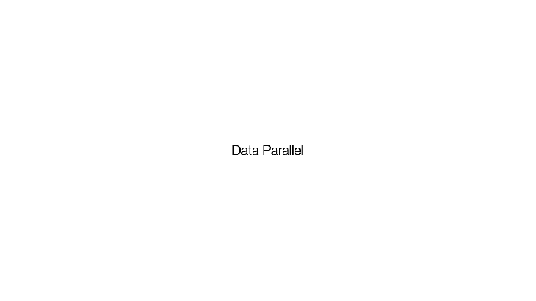
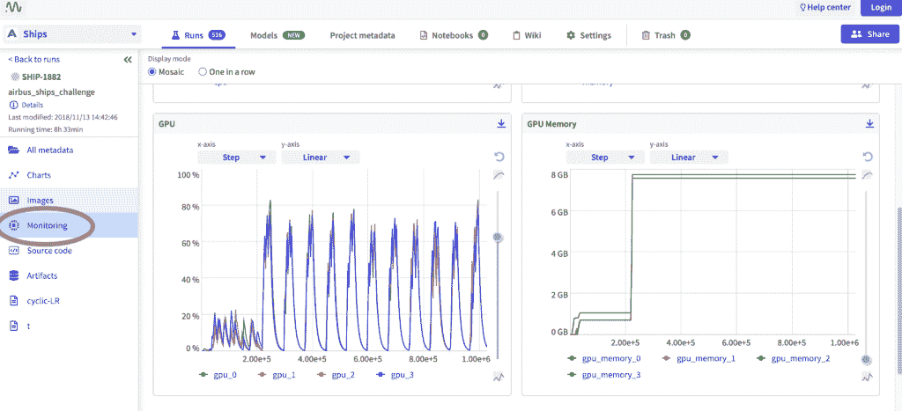
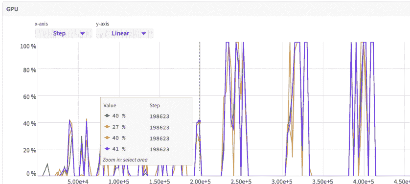

# 多 GPU 模型训练:监控和优化

> 原文：<https://web.archive.org/web/https://neptune.ai/blog/multi-gpu-model-training-monitoring-and-optimizing>

你是否纠结于在多个 GPU 上监控和优化深度神经网络的训练？如果是的话，你来对地方了。

在本文中，我们将讨论 Pytorch Lightning 的多 GPU 训练，并找出优化训练过程应该采用的最佳实践。我们还将看到如何在训练过程中监控所有 GPU 的使用情况。

让我们从一些基础知识开始。

## 什么是使用 GPU 的分布式训练？

有时对于复杂的任务，如在[计算机视觉](/web/20221006025927/https://neptune.ai/resources/computer-vision-projects-pytorch-lightning)或自然语言处理中，训练一个[深度神经网络](https://web.archive.org/web/20221006025927/https://www.bmc.com/blogs/deep-neural-network/) (DNN)涉及到解决数百万或数十亿参数的梯度下降，因此它成为一个计算复杂的过程，可能需要几天甚至几周才能完成。

例如，生成式预训练变压器 3 (GPT-3)是一个自回归语言模型，具有 1750 亿个参数，在单个 NVIDIA Tesla V100 GPU 上训练它需要大约 355 年。但是如果用 1024 个 NVIDIA A100 GPUs 并行训练同一个模型，我们可以估计训练时间在 34 天左右。因此，在 GPU 上进行并行训练是目前广泛使用的加速过程的方法。

另请查看:[https://Neptune . ai/blog/distributed-training-frameworks-and-tools](https://web.archive.org/web/20221006025927/https://neptune.ai/blog/distributed-training-frameworks-and-tools)

为了清楚地了解我们如何能够使用多个 GPU 来训练深度神经网络，让我们简单地看看神经网络是如何训练的:

*   深度神经网络模型通常使用[小批量梯度下降](https://web.archive.org/web/20221006025927/https://builtin.com/data-science/gradient-descent)进行训练，其中训练数据被随机采样为小批量。
*   将小批量输入模型，分两个阶段遍历模型:
    *   前进传球
    *   偶数道次
*   正向传递生成预测，并计算预测和地面实况之间的损失。
*   反向传递通过网络的层传递误差(称为反向传播),以获得梯度来更新模型权重。
*   通过正向和反向阶段的小批量被称为迭代，并且时期被定义为通过整个训练数据集执行正向-反向传递。
*   训练过程持续多个时期，直到模型收敛。

如果这对你来说似乎是压倒性的，我会建议这篇[文章](https://web.archive.org/web/20221006025927/https://towardsdatascience.com/how-do-we-train-neural-networks-edd985562b73)来更深入地了解神经网络是如何被训练的。

为了加快训练过程，我们使用多个 GPU 来并行化训练过程，并且**数据并行**和**模型并行**是用于并行化任务的两种技术。

### 数据并行性

在数据并行中，每个 GPU 保存模型的副本，并且数据被分成 n 个分区，其中每个分区用于在每个 GPU 上训练模型的副本。

当应用异步数据并行时，参数服务器负责权重更新。每个 GPU 将其梯度发送到参数服务器，然后参数服务器更新权重，并将更新后的权重发送回该 GPU。

这样，GPU 之间就没有同步了。这种方法解决了分布式计算环境中不稳定的网络问题，但是它引入了不一致性问题。此外，这种方法不会减少 GPU 之间的数据传输次数。

### 模型并行性

模型并行性在多个 GPU 之间划分模型，其中每个 GPU 负责模型的指定层的权重更新。中间数据，例如用于前向传递的神经网络层的输出和用于后向传递的梯度，在 GPU 之间传送。

由于这些分区具有依赖性，在模型并行性的简单实现中，一次只有一个 GPU 是活动的，导致 GPU 利用率低。为了实现并行执行，流水线并行将输入小批分成多个微批，并在多个 GPU 之间流水线执行这些微批。下图对此进行了概述:


*Pipeline parallelism |  [Source](https://web.archive.org/web/20221006025927/https://arxiv.org/abs/1811.06965)*

上图表示的是一个模型，有 4 个层放在 4 个不同的 GPU 上(纵轴)。横轴表示随着时间的推移对该模型进行训练，表明 GPU 得到了更高效的利用。但是，仍然存在一个气泡(如图所示),其中某些 GPU 没有得到利用。

为了对模型并行性和数据并行性有一个完整的了解，我强烈建议阅读[分布式培训:数据科学家指南](/web/20221006025927/https://neptune.ai/blog/distributed-training)。

## PyTorch Lightning 的多 GPU 训练

在本节中，我们将重点讨论如何使用 [PyTorch Lightning](https://web.archive.org/web/20221006025927/https://www.pytorchlightning.ai/#grid-section) 在多个 GPU 上进行训练，因为它在去年越来越受欢迎。PyTorch Lightning 使用起来非常简单方便，它帮助我们缩放模型，没有样板文件。样板代码是大多数人在缩放模型时容易出错的地方。

有一些编码实践可以帮助您毫无问题地将代码迁移到 GPU。你应该参考 [PyTorch Lightning 文档](https://web.archive.org/web/20221006025927/https://pytorch-lightning.readthedocs.io/en/1.4.3/advanced/multi_gpu.html#preparing-your-code)来获得更多关于这个的信息。

### 分布式模式

在本节中，我们将介绍 Pytorch lightning 提供的不同分布式模式。

#### 数据并行

我们可以在一台拥有多个 GPU 的机器上训练一个模型。使用 DataParallel (DP)方法，一个批处理会在一个节点的所有选定 GPU 之间平均分配，之后根节点会聚合所有结果。但是 Pytorch lightning 开发人员不建议使用这种方法，因为它还不稳定，如果在 forward()或*_step()方法中为模块分配状态，您可能会看到错误或行为不当。

```
trainer = Trainer(gpus=4, accelerator="dp")
```

#### 分布式数据并行

分布式数据并行(DDP)的工作方式如下:

*   每个节点上的每个 GPU 都有自己的进程。
*   每个 GPU 都可以看到整个数据集的子集。它只会看到那个子集。
*   每个进程初始化模型。
*   每个进程并行执行完整的向前和向后传递。
*   梯度在所有过程中被同步和平均。
*   每个进程更新它的优化器。

我们可以通过两种方式使用该方法，即“ddp”和“ddp_spawn”。在“ddp”方法中，使用正确的环境变量多次调用脚本。

```
trainer = Trainer(gpus=8, accelerator="ddp")

trainer = Trainer(gpus=8, accelerator="ddp", num_nodes=4)
```

虽然在大多数情况下这似乎是一个不错的选择，但它有一些局限性，因为它不能在 Jupyter Notebook、Google COLAB 和 Kaggle 等工具中工作。此外，当有一个没有根包的嵌套脚本时，它似乎不起作用。在这些情况下，首选“ddp_spawn”方法。

“ddp_spawn”除了使用 torch.multiprocessing.spawn()方法启动训练过程之外，与 ddp 完全一样。因此，人们可能会认为总是首选“ddp_spawn”方法而不是“ddp ”,但“ddp_spawn”也有这些限制:

*   spawn 方法在子流程中训练模型，而主流程中的模型不会更新。
*   Dataloader(num_workers=N)，其中 N 很大，使用 DDP 训练会遇到瓶颈，即它会非常慢或者根本不起作用。这是 PyTorch 的限制。
*   这个方法强制所有东西都是可选择的。

```
trainer = Trainer(gpus=8, accelerator="ddp_spawn")
```

就速度和性能而言,“ddp”方法应始终优先于“ddp_spawn”。

#### 分布式数据并行 2

DDP2 在单台机器上的行为类似于 DP，但在多个节点上使用时，它就相当于 DDP。有时，在同一台机器上使用所有批次而不是子集可能是有用的，ddp2 方法在这种情况下可能会很方便。DDP2 执行以下操作:

*   将数据的子集复制到每个节点。
*   在每个节点上初始化一个模型。
*   使用 DP 向前和向后传递。
*   跨节点同步渐变。
*   应用优化程序更新。

```
trainer = Trainer(gpus=8, accelerator="ddp2", num_nodes=4)
```

目前不建议使用这种技术，因为它对所有 PyTorch 版本> = 1.9 都不适用，不清楚如何使它适用于 PyTorch >= 1.9，并且没有对这种方法进行功能测试

#### 霍罗沃德

[Horovod](https://web.archive.org/web/20221006025927/https://github.com/horovod/horovod) 是一个用于 TensorFlow、Keras、PyTorch 和 Apache MXNet 的分布式深度学习培训框架，它使分布式深度学习变得快速和易于使用。

*   每个进程都使用单个 GPU 来处理固定的数据子集。
*   在反向过程中，梯度在所有 GPU 上并行平均。
*   在进入下一阶段之前，在开始下一步之前，同步应用这些梯度。
*   在训练脚本中，Horovod 将检测环境中的工作人员数量，并自动调整学习速率以补偿增加的总批量。

Horovod 使用相同的训练脚本支持单 GPU、多 GPU 和多节点训练。它可以在培训脚本中配置为与任意数量的 GPUs 进程一起运行，如下所示:

```
trainer = Trainer(accelerator="horovod", gpus=1)
```

```
trainer = Trainer(accelerator="horovod")
```

启动培训作业时，驱动程序应用程序将用于指定工作进程的总数:

```
horovodrun -np 4 python train.py

horovodrun -np 8 -H hostname1:4,hostname2:4 python train.py
```

#### 共享培训

在训练大型模型或尝试较大批量时，您可能会遇到一些内存问题。人们可能会想到在这种情况下使用模型并行，但是目前，由于与之相关的复杂实现，我们使用分片训练来代替。

在底层，分片训练类似于数据并行训练，只是优化器状态和梯度是跨 GPU 分片的。在内存受限的多 GPU 设置中，或者在训练较大的模型(500M 以上的参数模型)时，强烈建议使用这种方法。

要使用分片训练，您需要首先使用下面的命令安装 [FairScale](https://web.archive.org/web/20221006025927/https://github.com/facebookresearch/fairscale) 。

```
pip install fairscale

trainer = Trainer(strategy="ddp_sharded")
```

当使用分片训练策略时，在内存和性能之间存在折衷，因为由于设备之间的高度分布式通信，训练可能变得更慢。

## 如何在多个 GPU 上优化训练

当在多个 GPU 上训练具有大型数据集的大型模型时，我们可能会遇到一些内存或性能瓶颈问题。在本节中，我们将了解如何优化培训流程。

### FairScale 激活检查点

激活检查点一旦在正向传递中不再需要激活，就从内存中释放激活。然后，根据需要为向后传递重新计算它们。当中间层产生大量激活时，激活检查点非常有用。

与 PyTorch 实现不同，FairScales 的检查点包装器还可以正确处理批处理规范层，确保由于多次转发而正确跟踪统计数据。

这在训练较大的模型时节省了内存，但是，需要包装您想要使用激活检查点的模块。你可以在这里阅读更多相关信息[。](https://web.archive.org/web/20221006025927/https://pytorch-lightning.readthedocs.io/en/stable/advanced/model_parallel.html#fairscale-activation-checkpointing)

```
from fairscale.nn import checkpoint_wrapper

class Model(LightningModule):
    def init(self):
        super().__init__()
        self.block1 = checkpoint_wrapper(nn.Sequential(nn.Linear(32, 32),       nn.ReLU()))
        self.block_2 = nn.Linear(32, 2)
```

### 混合精度(16 位)定型

默认情况下，PyTorch 和大多数深度学习框架一样，使用 32 位浮点(FP32)算法。另一方面，许多深度学习模型可以通过 16 位等低位浮点实现完全的准确性。因为它们需要更少的存储器，所以有可能训练和部署大型神经网络，这导致由于更少的存储器带宽需求而增强数据传输操作。

但是要使用 16 位浮点，您必须:

*   支持 16 位精度的 GPU，如 NVIDIA pascal 架构或更新版本。
*   你的优化算法，即 training_step，应该是数值稳定的。

混合精度结合了 32 位和 16 位浮点的使用，提高了性能，并消除了我们可能面临的任何内存问题。Lightning 通过本机或 APEX amp 后端为 GPU 提供混合精度训练。

```
Trainer(precision=16, amp_backend="native")

Trainer(amp_backend="apex", precision=16)
```

除非您需要更精细的控制，否则建议始终使用本机 amp_backend。

### 比起数据并行(DP ),更喜欢分布式数据并行(DDP)

正如前面提到的，我们应该更喜欢使用 DDP 策略而不是 DP。这背后的原因是 DP 每批使用 3 个转移步骤，而 DDP 仅使用 2 个转移步骤，因此速度更快。

DP 执行以下步骤:

1.  将模型复制到设备。
2.  将数据复制到设备。
3.  将每个器件的输出复制回主器件。



*GPU data parallel strategy | [Source](https://web.archive.org/web/20221006025927/https://pytorch-lightning.readthedocs.io/en/latest/guides/speed.html)*

DDP 执行以下步骤:

1.  将数据移动到设备。
2.  传输和同步渐变。


*GPU distributed data parallel strategy | [Source](https://web.archive.org/web/20221006025927/https://pytorch-lightning.readthedocs.io/en/latest/guides/speed.html)*

随着技术和策略的改变，我们也可以在代码中做一些改变来优化我们的训练过程，下面是其中的一些。

### 增加批量

如果您在训练时使用小批量，则更多的时间将花费在训练数据的加载和卸载上，而不是计算操作上，这会降低训练速度。因此，建议使用更大的批处理大小来提高 GPU 利用率。但是增加批量大小可能会对模型的准确性产生不利影响，因此我们应该用不同的批量大小进行实验，以找到最佳的批量大小。

### 使用 PyTorch 的 DataLoader 方法更快地加载数据

Pytorch 中的 DataLoader 类是加载和批处理数据的一种快速简便的方法。我们可以使用参数“num_workers ”,通过将它的值设置为一个以上来更快地为训练加载数据。使用 PyTorch lightning 时，它会为您推荐 num_workers 的最佳值。

但是，如果数据集非常大，因为加载器工作进程和父进程将为父进程中从工作进程访问的所有 Python 对象消耗相同数量的 CPU 内存，则可能会遇到内存问题。避免这个问题的一个方法是在 Dataloader __getitem__ 方法中使用 Pandas、Numpy 或 PyArrow 对象，而不是 python 对象。

### 将梯度设置为无

我们可以通过覆盖 optimizer_zero_grad()方法并将其设置为 None 来提高性能和速度，而不是将梯度设置为零，这样通常会占用更少的内存。

```
class Model(LightningModule):
    def optimizer_zero_grad(self, epoch, batch_idx, optimizer, optimizer_idx):
        optimizer.zero_grad(set_to_none=True)
```

### 模型切换

当我们必须在分布式设置中使用多个优化器执行梯度累积时，这种方法特别有用。当执行梯度累积时，将 sync_grad 设置为 False 将阻止此同步，并提高您的训练速度。

LightningOptimizer 为高级用户提供了一个 toggle_model()函数作为 contextlib.contextmanager()。这里有一个来自 PyTorch Lightning 官方文档的例子。

```
class SimpleGAN(LightningModule):
    def __init__(self):
        super().__init__()
        self.automatic_optimization = False

    def training_step(self, batch, batch_idx):

        g_opt, d_opt = self.optimizers()

        X, _ = batch
        X.requires_grad = True
        batch_size = X.shape[0]

        real_label = torch.ones((batch_size, 1), device=self.device)
        fake_label = torch.zeros((batch_size, 1), device=self.device)

        is_last_batch_to_accumulate = (batch_idx + 1) % 2 == 0 or self.trainer.is_last_batch

        g_X = self.sample_G(batch_size)

        with d_opt.toggle_model(sync_grad=is_last_batch_to_accumulate):
            d_x = self.D(X)
            errD_real = self.criterion(d_x, real_label)

            d_z = self.D(g_X.detach())
            errD_fake = self.criterion(d_z, fake_label)

            errD = errD_real + errD_fake

            self.manual_backward(errD)
            if is_last_batch_to_accumulate:
                d_opt.step()
                d_opt.zero_grad()

        with g_opt.toggle_model(sync_grad=is_last_batch_to_accumulate):
            d_z = self.D(g_X)
            errG = self.criterion(d_z, real_label)

            self.manual_backward(errG)
            if is_last_batch_to_accumulate:
                g_opt.step()
                g_opt.zero_grad()

        self.log_dict({"g_loss": errG, "d_loss": errD}, prog_bar=True)
```

正如您在代码中看到的，我们将 sync_grad 参数设置为 False，并仅在一个时期结束时或每两个批次后将其设置为 True。通过这样做，我们实际上是在每两个批次之后或者在时期结束时累积梯度。

### 避免。item()，。numpy()，。cpu()调用

避免。item()，。numpy()，。cpu()调用代码。如果您必须删除连接的图调用，您可以使用。请改用 detach()方法。这是因为这些调用中的每一个都将导致数据从 GPU 传输到 CPU，并将导致性能大幅下降。

### 清除缓存

每次调用 torch.cuda.empty_cache()方法，所有的 GPU 都要等待同步。所以避免不必要的调用这个方法。

## 如何在多个 GPU 上监控训练

在训练模型时，监控 GPU 的使用是非常重要的，因为它可能会提供一些有用的见解来改进训练，如果 GPU 未得到充分利用，我们可以相应地处理它。有各种工具，如 Neptune 和 Wandb，可用于[监控多个 GPU 上的训练。](https://web.archive.org/web/20221006025927/https://docs.neptune.ai/how-to-guides/neptune-api/distributed-computing)

在本节中，我们将使用 Neptune 来监控 GPU 和 GPU 内存，同时在多个 GPU 上进行训练。

### 用海王星监控训练

Neptune 是一个可以在任何 MLOps 工作流中使用的[元数据存储库](/web/20221006025927/https://neptune.ai/blog/metadata-store)。它允许我们在训练时监控我们的资源，因此我们可以使用它来监控训练时使用的不同 GPU 的使用情况。

将 Neptune 并入 PyTorch Lightning 代码非常简单，您所要做的就是创建一个 NeptuneLogger 对象并将其传递给 Trainer 对象，如下所示:

```
from pytorch_lightning import Trainer
from pytorch_lightning.loggers import NeptuneLogger

neptune_logger = NeptuneLogger(
    api_key="ANONYMOUS",  
    project="common/pytorch-lightning-integration",  
    tags=["training", "resnet"],  
)

trainer = Trainer(max_epochs=10, logger=neptune_logger)

trainer.fit(my_model, my_dataloader)
```

如果这是你第一次接触 Neptune，我强烈建议你通过这个[一步一步的指南](https://web.archive.org/web/20221006025927/https://docs.neptune.ai/getting-started/installation)来安装所有必要的库以使它工作。之后，查看[海王星+ PyTorch 闪电集成文档](https://web.archive.org/web/20221006025927/https://docs.neptune.ai/integrations-and-supported-tools/model-training/pytorch-lightning)。

运行该文件后，您应该会得到一个到控制台的链接。您可以看到[监控部分](https://web.archive.org/web/20221006025927/https://docs.neptune.ai/you-should-know/displaying-metadata#monitoring)(下图中的圆圈)，在这里您可以看到所有 GPU 在训练时的使用情况以及一些其他指标。



*Monitor training on multiple GPUs | [Source](https://web.archive.org/web/20221006025927/http://Monitor%20training%20on%20multiple%20GPUs,%20source:%20https://app.neptune.ai/neptune-ai/Ships/e/SHIP-1883/monitoring)*

让我们看看我们可以从 GPU 利用率图表中推断出什么样的有意义的见解。



*Monitor training on multiple GPUs | [Source](https://web.archive.org/web/20221006025927/https://app.neptune.ai/neptune-ai/Ships/e/SHIP-1883/monitoring)*

*   正如您在上面看到的，GPU 的使用是波动的，有一些短暂的时间没有被使用，解释其原因并不容易。
*   这可能发生在验证期间，因为我们在此阶段不计算梯度，或者这可能是由于一些其他瓶颈，例如，您可能使用 CPU 对数据使用一些数据预处理技术，这可能非常慢。
*   此外，在 Caffe 等一些框架中，默认情况下在验证阶段只使用一个 GPU，因此在这种情况下，您可能会发现只有一个 GPU 的使用率很高。
*   因此，根据您训练神经网络的方式，您可能会发现一个不同的图表，表明不同的 GPU 是如何被利用的。

## 结论

本文讨论了我们为什么要用多个 GPU 来训练机器学习模型。我们还发现了使用 Pytorch lightning 在多个 GPU 上进行训练是多么容易，以及优化训练过程的最佳方法。最后，我们发现了如何在训练时使用 Neptune 来监控 GPU 的使用情况。

如果你正在寻找关于这个主题的深入知识，我建议你浏览这个广泛的资源[改进共享计算环境中的 ML 应用](https://web.archive.org/web/20221006025927/https://aaronharlap.github.io//papers/aharlap_dissertation.pdf)或者这个[研究论文。](https://web.archive.org/web/20221006025927/https://arxiv.org/pdf/1809.02839.pdf)

### 参考

### 米尔扎·穆杰塔巴

经验丰富的机器学习工程师，具有金融服务行业的工作经历。精通分析技能、PHP、数据科学、数据分析和数据分析。拥有技术学士学位的优秀工程专业人士——来自克什米尔大学的 BTech 专注于计算机科学。

* * *

**阅读下一篇**

## 如何跟踪海王星的 PyTorch 闪电实验

5 分钟阅读|作者 Jakub Czakon |年 7 月 19 日更新

使用 PyTorch Lightning 并想知道应该选择哪个记录器来跟踪您的实验？

考虑使用 PyTorch Lightning 来构建您的深度学习代码，并且不介意了解它的日志功能吗？

不知道闪电有一个相当可怕的海王星积分？

这篇文章(很可能)适合你。

## 为什么是 PyTorch 闪电和海王星？

如果你从未听说过，PyTorch Lightning 是 PyTorch 之上的一个非常轻量级的包装器，它更像是一个编码标准而不是框架。这种格式可以让你摆脱大量的样板代码，同时保持简单易懂。

其结果是一个框架，为研究人员、学生和生产团队提供了尝试疯狂想法的终极灵活性，而不必学习另一个框架，同时自动化掉所有的工程细节。

[Continue reading ->](/web/20221006025927/https://neptune.ai/blog/pytorch-lightning-neptune-integration)

* * *