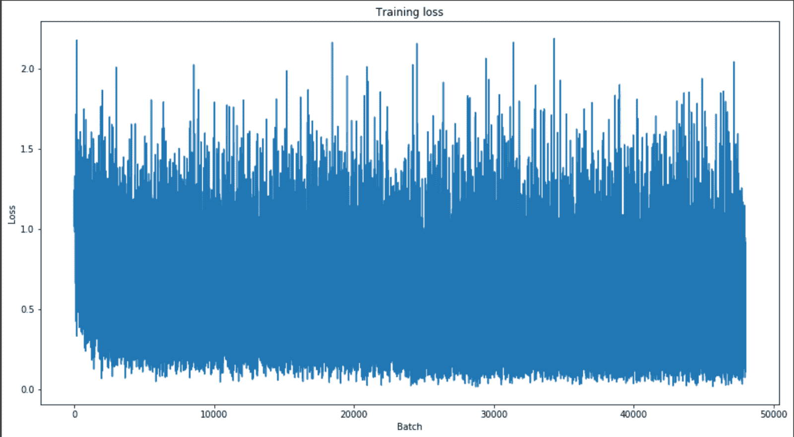

# 拥抱脸和变形金刚的自然语言处理

> 原文：<https://web.archive.org/web/https://neptune.ai/blog/natural-language-processing-with-hugging-face-and-transformers>

NLP 是机器学习的一个分支，旨在帮助计算机和智能系统像人类一样理解文本和口语。

NLP 驱动计算机程序执行各种各样非常有用的任务，如文本翻译、响应口头命令或在眨眼之间总结大量文本。您很有可能以下列形式与 NLP 技术进行过交互:

*   声控全球定位系统
*   智能机器人和数字助理
*   客服聊天机器人
*   基本上，任何涉及使用 STT 和 TTS 技术的数字服务

我们将讨论 NLP 的两个关键技术，但首先是 NLP 的基础——抽象层。

## NLP 中的抽象层

从书面文本中提取意义涉及几个抽象层，这些抽象层通常与不同的研究领域相关，但相互之间有很好的协同作用。

这些研究领域包括:

*   ***形态学*** 层次，研究词的结构和构词。
*   *词汇分析正是着眼于词汇和标记的构成，以及它们各自的词性。*
**   ***句法*** 分析负责使用词法分析阶段输出的词性标注将单词分组为连贯的短语。*   *语义处理然后通过将句法特征与给定的上下文相关联以及消除具有多个定义的单词的歧义来评估所形成的句子的意义和含义。***   最后是 ***语篇*** 层面，这里的处理是关于对文本结构和意义的分析，而不仅仅是单个句子，在单词和句子之间建立联系。**

 **当前最先进的 NLP 技术将所有这些层结合起来，产生非常类似于人类语音的出色结果。最重要的是，NLP 将人类语言的多种基于规则的建模与统计和深度学习模型相结合。

最近需求量很大的深度学习方法需要大量带注释的数据来学习和识别相关的相关性。像 BERT，GPT2，GPT3 或 RoBERTA 这样的著名模型消耗了大量的训练数据，它们只能由负担得起成本的大规模公司进行训练。例如，训练 [GPT-3 据报道花费了 12，000，000 美元…一次训练运行](https://web.archive.org/web/20221206005212/https://towardsdatascience.com/the-future-of-ai-is-decentralized-848d4931a29a#:~:text=Training%20GPT%2D3%20reportedly%20cost,a%20single%20training%20run%C2%B9.)。

## 变形金刚图书馆

### 注意力机制

2018 年出现的一个趋势是基于注意力的算法，这是一个由谷歌 R&D 部门研究和开发的概念，并于 2017 年在著名的“[注意力是你所需要的全部](https://web.archive.org/web/20221206005212/https://arxiv.org/pdf/1706.03762.pdf)”论文中首次发布。

注意力是一种模仿我们大脑内部认知结构的技术。它增强并本能地关注数据的特定部分，而淡化其余部分。因此，当面对复杂和大量的数据时，这种机制节省了时间和能量处理。

变形金刚网络大量利用注意力机制来实现高端表现力。因此，变压器在许多领域的 NLP 深度学习模型的架构中被广泛采用。

### 单词嵌入

在每个 NLP 模型的中心，都有一个预处理阶段，将有意义的单词和句子转换成实数向量。换句话说，嵌入是一种允许具有相似意思的单词具有相似表示的单词表示类型。

它们是文本的分布式表示，也许是深度学习方法在挑战自然语言处理问题上令人印象深刻的表现的关键突破之一。

单词嵌入的根源 [***分布语义学***](https://web.archive.org/web/20221206005212/https://en.wikipedia.org/wiki/Distributional_semantics) 理论试图根据单词周围的上下文来表征单词。例如，单词“演员”在句子“演员崩溃”中的意思与在句子“我的演员朋友给我发了这个链接”中的意思不同。共享相似上下文的单词也共享相似的意思。

单词嵌入有几种方法。它们可以追溯到人工智能的早期，并且是基于降维的方法。这些方法(称为“n-gram”或“k-means”)获取文本语料库，并通过在单词共现矩阵中找到聚类来将其缩减到固定的维数。目前最受欢迎的方法是基于 Word2Vec，最初是由谷歌研究人员托马斯·米科洛夫、程凯、格雷格·科拉多和 Quoc Le 在 2013 年推出的。

## 利用 BERT 进行情感分析

**BERT** 代表 **B** 方向**E**n 编码器 **R** 代表来自 **T** 变压器。这是谷歌人工智能在 2018 年底开发的一种架构，提供以下功能:

*   设计成深度双向的。从令牌的左右上下文中有效地捕获信息。
*   与前辈相比，在学习速度方面效率极高。
*   它结合了掩码语言模型(MLM)和下一句预测(NSP)。
*   这是一个通用的深度学习模型，可用于分类、问答、翻译、摘要等。

最初，用未标记的数据对 BERT 进行预训练。之后，模型输出输入的特定表示。

再训练过程可以以各种方式完成，或者通过从零开始构建判别或生成模型，或者对公共数据库中的现有模型进行微调。通过利用预先训练的模型，有可能将学习从一个领域转移到另一个领域，而无需花费从头开始学习所需的时间和精力。

***注*** *:我已经简要描述了实际的机制是如何工作的，更多细节我推荐'* [*BERT 解释:NLP 语言模型的现状*](https://web.archive.org/web/20221206005212/https://towardsdatascience.com/bert-explained-state-of-the-art-language-model-for-nlp-f8b21a9b6270) *'*

### 用 BERT 迁移学习

微调 BERT 以执行特定任务的方法相对简单。虽然 BERT 可用于各种 NLP 应用，但微调过程需要在核心模型中添加一个小层。例如:

**分类任务—**在变压器模块上使用分类层(情感分析)。

**Q & A** 相关任务——模型收到一个关于文本序列的问题，并被要求在命题中标出正确答案。伯特被训练学习两个向量，它们标记了答案的开始和结束。例如:班，1.1 版

**命名实体识别 NER:** 模型被输入一个文本序列，并被要求识别特定的实体(国家、组织、人、动物等)。)，并给它们贴上标签。这同样适用于这里，预先训练以识别实体的分类层与变换器块“组装”在一起以适合整个架构。

### 为什么抱脸？

[拥抱脸](https://web.archive.org/web/20221206005212/https://huggingface.co/)是一个大型开源社区，它迅速成为预先训练的深度学习模型的诱人中心，主要针对 NLP。他们自然语言处理的核心操作模式围绕着转换器的使用。

用 Python 编写的 Transformers 库公开了一个配置良好的 API，以利用过多的深度学习架构来完成像前面讨论的那些最先进的 NLP 任务。

正如您可能已经猜到的，一个核心的启动价值是可重用性——所有可用的模型都带有一组预先训练好的权重，您可以针对您的特定用途进行微调。

### 从拥抱脸开始

在官方文档中，您可以找到所有具有相关库结构的组件。

#### 拥抱脸轮毂 Repos

它们有基于 git 的存储库，可以作为存储，并且可以包含项目的所有文件，提供类似 github 的特性，例如:

*   版本控制，
*   提交历史记录和分支差异。

它们还提供了优于常规 Github 回购的重要优势:

*   关于已启动任务、模型训练、指标等的有用元数据，
*   测试推理的浏览器预览，
*   用于生产就绪环境的 API，
*   HUB 中有 10 多个框架:Transformers、Asteroid、ESPnet 等等。

***查看这里:*** [***抱抱脸库***](https://web.archive.org/web/20221206005212/https://huggingface.co/docs/libraries)

#### 拥抱面部小工具

一组现成的预训练模型，用于在 web 预览中测试推理。

一些例子:

***查看这里:*** [***抱脸小工具***](https://web.archive.org/web/20221206005212/https://huggingface-widgets.netlify.app/)

### 拥抱脸的伯特模型

现在，让我们试着做我们一直在谈论的事情。我们想要微调 BERT 来分析亚马逊上购买商品的一些商业评论，并确定评论的*正面*、*负面、*和*中立*。

#### 亚马逊产品评论数据集

该数据集包括超过 1480 万条来自购买、评级、文本、有用性投票等的产品评论。这些数据将证明对我们的任务非常有用，因为评论是由人们真实地做出的，以反映他们对给定产品的意见。文本倾向于主观性，因此本质上可以分为积极的，消极的和中性的类别。

***下载数据集的链接*** *:* [*亚马逊商品评论*](https://web.archive.org/web/20221206005212/http://jmcauley.ucsd.edu/data/amazon/)

数据集的示例如下所示:

```
{
  "reviewerID": "A2SUAM1J3GNN3B",
  "asin": "0000013714",
  "reviewerName": "J. McDonald",
  "helpful": [2, 3],
  "reviewText": "I bought this for my husband who plays the piano.  He is having a wonderful time playing these old hymns.  The music  is at times hard to read because we think the book was published for singing from more than playing from.  Great purchase though!",
  "overall": 5.0,
  "summary": "Heavenly Highway Hymns",
  "unixReviewTime": 1252800000,
  "reviewTime": "09 13, 2009"
}
```

为了确定每个类别，我们将依靠亚马逊评级系统。“总体”键值表示该产品的总体评级。我们可以为每个类别建立一个可测量的范围:

*   正面反馈:4-5 颗星
*   负面反馈:从 0-2 星
*   中性:3 颗星

由于数据涵盖了大量不同的主题和类别，建议缩小范围，只选择其中的一小部分。我选择了这些:

*   汽车的
*   服装、鞋子和珠宝
*   电子学
*   手机和配件

最后，我们将使用小版本的数据集，以避免处理能力过载。

#### 变形金刚图书馆

**安装抱脸变形金刚库**

1.  使用 conda 创建您的虚拟环境:

```
conda create --name bert_env python=3.6
```

2.  安装支持 cuda 的 Pytorch(如果您有专用的 GPU，或者没有专用的 CPU 版本):

```
conda install pytorch torchvision torchaudio cudatoolkit=10.2 -c pytorch
```

3.  从 conda 通道安装变压器版本 4.0.0:

```
conda install -c huggingface transformers
```

4.  安装火炬视觉:

```
pip install torchvision
```

5.  安装 pytorch-nlp 包中的 Bert 预训练版本:

```
pip install pytorch-pretrained-bert pytorch-nlp
```

我们将使用 Pytorch 版本的 BERT uncased，由 Hugging Face 提出。

#### 训练模型

**从预处理数据开始**

对于训练数据，我们只需要“总体”和“回顾”属性。我们将使用包含 **1** (正值)、 **2** (负值)和 **0** (中性)的“情绪数据”创建一个新列。根据总体得分，每一行都将标有这些数字。

```
import pandas as pd
review_data = pd.read_json('/content/Dataset_final.json', lines=True)
sentiment_data = []
for i in review_data[['overall']].values:
    if i >= 4:
      sentiment_data.append(1) 
    elif i < 3:
      sentiment_data.append(2) 
    else:
      sentiment_data.append(0) 

sentiment = pd.DataFrame(sentiment_data)
review_data['sentiment'] = sentiment
```

**启动 NSP 进程**

将[CLS]和[SEP]标签放在每个复习句子的前面。

```
sentences = ["[CLS] " + query + " [SEP]" for query in review_data['reviewText']]
```

#### BERT 令牌嵌入

在深入这部分代码之前，我们需要解释一下令牌嵌入及其工作原理。嵌入令牌提供了关于文本内容的信息。首先要做的是将我们的文本转换成一个向量。

BERT 使用内部算法将输入的单词分解成记号。BERT 实施的流程包括三个阶段:

*   令牌嵌入
*   嵌入位置
*   嵌入段

PyTorch 的 BertTokenizer 模块将负责内部的所有逻辑。将每个输入句子分成合适的记号，然后将它们编码成数字向量。

```
from pytorch_pretrained_bert import BertTokenizer

tokenizer = BertTokenizer.from_pretrained('bert-base-uncased', do_lower_case=True)
tokenized_texts = [tokenizer.tokenize(sent) for sent in sentences]
```

填充输入标记，并使用 BERT 标记器将标记转换为它们在 BERT 词汇表中的索引号:

```
from keras.preprocessing.sequence import pad_sequences

MAX_LEN = 512

input_ids = pad_sequences([tokenizer.convert_tokens_to_ids(txt) for txt in tokenized_texts],
                          maxlen=MAX_LEN, dtype="long", truncating="post", padding="post")

input_ids = [tokenizer.convert_tokens_to_ids(x) for x in tokenized_texts]
input_ids = pad_sequences(input_ids, maxlen=MAX_LEN, dtype="long", truncating="post", padding="post")
```

创建注意掩码，每个标记的掩码为 1，后跟填充的 0:

```
attention_masks = []
for seq in input_ids:
  seq_mask = [float(i>0) for i in seq]
  attention_masks.append(seq_mask)
```

**分离数据并为训练做准备**

拆分列车并测试拆分:

```
from sklearn.model_selection import train_test_split
train_inputs, validation_inputs, train_labels, validation_labels = train_test_split(input_ids, labels.values,  random_state=2018, test_size=0.2)
train_masks, validation_masks, _, _ = train_test_split(attention_masks, input_ids, random_state=2018, test_size=0.2)
```

将数据转换为 torch 张量，并使用特定的 batch_size 创建 Dataloader 迭代器:

```
import torch
from torch.utils.data import TensorDataset, DataLoader, RandomSampler,
SequentialSampler

train_inputs = torch.tensor(train_inputs)
validation_inputs = torch.tensor(validation_inputs)
train_labels = torch.tensor(train_labels)
validation_labels = torch.tensor(validation_labels)
train_masks = torch.tensor(train_masks)
validation_masks = torch.tensor(validation_masks)

batch_size = 8
train_data = TensorDataset(train_inputs, train_masks, train_labels)
train_sampler = RandomSampler(train_data)
train_dataloader = DataLoader(train_data, sampler=train_sampler, batch_size=batch_size)
validation_data = TensorDataset(validation_inputs, validation_masks, validation_labels)
validation_sampler = SequentialSampler(validation_data)
validation_dataloader = DataLoader(validation_data, sampler=validation_sampler, batch_size=batch_size)
```

实例化模型:

```
from pytorch_pretrained_bert import BertAdam, BertForSequenceClassification
model = BertForSequenceClassification.from_pretrained("bert-base-uncased", num_labels=3)
model.cuda()
```

定义优化的超参数:

```
param_optimizer = list(model.named_parameters())
no_decay = ['bias', 'gamma', 'beta']
optimizer_grouped_parameters = [
    {'params': [p for n, p in param_optimizer if not any(nd in n for nd in no_decay)],
     'weight_decay_rate': 0.01},
    {'params': [p for n, p in param_optimizer if any(nd in n for nd in no_decay)]  'weight_decay_rate': 0.0}
]

optimizer = BertAdam(optimizer_grouped_parameters, lr=2e-5, warmup=.1)
```

定义训练循环:

```
train_loss_set = []

epochs = 2

for _ in range(epochs, desc="Epoch"):

  model.train()

  tr_loss = 0
  nb_tr_examples, nb_tr_steps = 0, 0

  for step, batch in enumerate(train_dataloader):

    batch = tuple(t.to(device) for t in batch)

    b_input_ids, b_input_mask, b_labels = batch

    optimizer.zero_grad()

    loss = model(b_input_ids, token_type_ids=None, attention_mask=b_input_mask, labels=b_labels)
    train_loss_set.append(loss.item())

    loss.backward()

    optimizer.step()

    tr_loss += loss.item()
    nb_tr_examples += b_input_ids.size(0)
    nb_tr_steps += 1
```

开始跟踪培训损失，看看模型实际上如何改进。

将模型置于评估模式，评估一个批次的预测:

```
  model.eval()

  eval_loss, eval_accuracy = 0, 0
  nb_eval_steps, nb_eval_examples = 0, 0
```

```
for batch in validation_dataloader:

    batch = tuple(t.to(device) for t in batch)

    b_input_ids, b_input_mask, b_labels = batch

    with torch.no_grad():

      logits = model(b_input_ids, token_type_ids=None, attention_mask=b_input_mask)

    logits = logits.detach().cpu().numpy()
    label_ids = b_labels.to('cpu').numpy()
    tmp_eval_accuracy = flat_accuracy(logits, label_ids)
    eval_accuracy += tmp_eval_accuracy
    nb_eval_steps += 1
```

可以通过绘制 train_loss_set 列表来看一下训练损耗。

```
import matplotlib.pyplot as plt
plt.figure(figsize=(15,8))
plt.title("Training loss")
plt.xlabel("Batch")
plt.ylabel("Loss")
plt.plot(train_loss_set)
plt.show()
```



*Training loss plot*

训练完成后，您可以使用 torch.save()将其保存为检查点。

```
torch.save(model, '/bert_final_version.pth')
```

本节的目标是向您展示一个简单的演示，说明如何使用 Hugging Face 提供的预训练版本的 BERT，并使用特定的数据集对其进行微调，以执行所需的任务。

一旦保存了您的检查点，您就可以(例如)在 API 中使用它作为服务来将 tweets 或其他类似的文本内容分为正面、负面或中性类别。

要了解更多，请查看我以前关于对话人工智能的文章，在那里我使用 Django API 作为后端服务来服务模型推理→[Nvidia 支持的对话人工智能架构:工具指南](/web/20221206005212/https://neptune.ai/blog/conversational-ai-nvidia-tools-guide)

我在下面给你留了 google Colab 笔记本的链接，在那里你会找到运行这个实验的所有代码:[情感分析 BERT](https://web.archive.org/web/20221206005212/https://colab.research.google.com/drive/15Kp-wVEY5oDKDH_NlfOYSSEQ-OSa0RK8?usp=sharing)

## 结论

我真诚地推荐你检查拥抱脸的工作，他们有优秀的教程和文章来快速自信地让你开始 NLP 和深度学习。

还有，用 Fastai 和 PyTorch 看《程序员深度学习》这本书。他们有关于深度学习 NLP 方法的精彩章节，完全用 Pytorch 和 Fast AI 编码。这很容易，你将很快开始编写你的模型。

一如既往，如有任何问题，请随时通过我的电子邮件联系我:hachcham.ayman@gmail.com

## 参考**