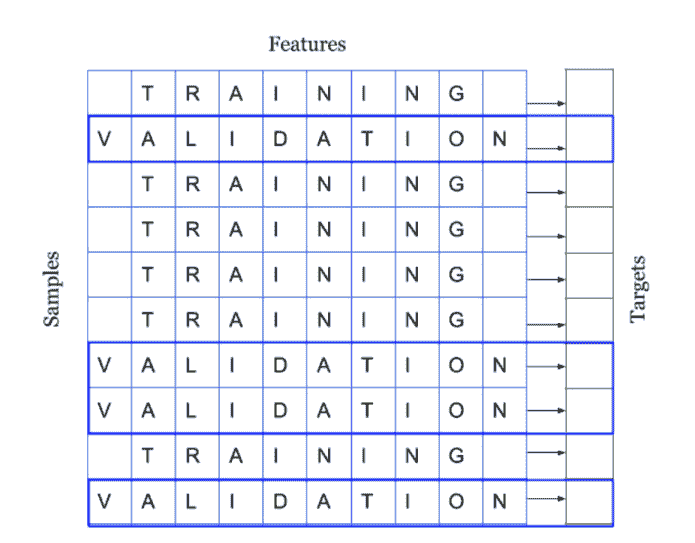
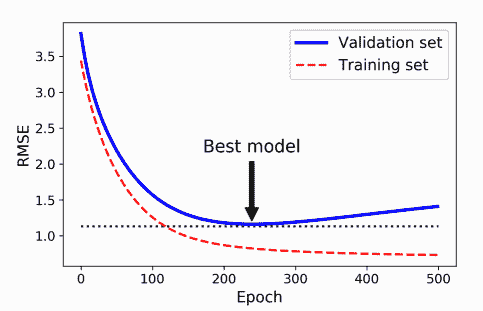

# 机器学习中的过拟合与欠拟合:你需要知道的一切

> 原文：<https://web.archive.org/web/https://neptune.ai/blog/overfitting-vs-underfitting-in-machine-learning>

在我们生活的世界里，数据支配着我们的许多活动。有人说数据是新燃料。数据不仅仅告诉我们过去。如果我们用精确的方法仔细建模，那么我们可以找到模式和相关性来预测股票市场，生成蛋白质序列，探索病毒等生物结构，等等。

像这样手动对大量数据建模是一项乏味的工作。为了实现这一点，我们转向了机器学习算法，这些算法可以帮助我们从数据中提取信息。ML 和 DL 算法的需求量很大，它们可以解决复杂的问题，这些问题是不切实际的，甚至是不可能手工完成的，并且可以学习分布、模式和相关性，揭示数据中的知识。

算法通过探索数据集并创建该数据分布的近似模型来做到这一点，这样当我们提供新的和未知的数据时，它将产生良好的结果。

机器学习中的一个问题是，我们希望我们的算法在处理训练数据(即，输入到算法中用于建模的数据)以及新数据时表现良好。这就是所谓的[](https://web.archive.org/web/20221206042522/https://mathanrajsharma.medium.com/generalization-in-machine-learning-for-better-performance-51bed74a3820)**。我们希望我们的算法善于泛化。**

 **然而，仍然存在一些问题:

1.  理解一个算法真正在做什么是相当具有挑战性的。
2.  假设我们已经生产了一个模型，但是它没有产生好的结果——理解哪里出了问题以及如何修复它是一个挑战。

机器学习中的一个普遍问题是，当算法在训练数据集上表现良好，但在测试数据或新数据上表现不佳，并且无法对给定的分布进行建模。

这是为什么呢？

关于算法的性能，可能有很多原因。决定机器学习算法性能的因素是它的以下能力:

1.  使训练误差尽可能小。
2.  使训练误差和测试误差之间的差距变小。–(深度学习书，伊恩·古德菲勒；2014)

这两个因素对应了机器学习中的两个核心挑战:[欠拟合和过拟合](https://web.archive.org/web/20221206042522/https://www.geeksforgeeks.org/underfitting-and-overfitting-in-machine-learning/)。**欠拟合**是训练误差高的时候。**过拟合**是指测试误差比训练误差高，或者两者差距大。

虽然理解大而复杂的 ML 和 DL 模型的工作方式具有挑战性，但我们可以从理解小而简单的模型的工作方式开始，并逐步增加复杂性。

***注:本文所有题目的代码都在这个*** [***colab 笔记本***](https://web.archive.org/web/20221206042522/https://github.com/Nielspace/Netpuneai-Tutorials/blob/main/Overfitting_Vs_Underfitting.ipynb) ***里。***

## 模型基础

机器学习算法，或深度学习算法，是一种**数学模型**，它使用数学概念从数据集中识别或学习某种类型的模式或相关性。我们所说的学习是什么意思？

让我们考虑方程 y = mx + b，其中 m 和 b 是参数，x 是输入。

在机器学习中，学习指的是一个**优化过程**，其中模型**的参数在训练的每次迭代中使用损失函数来更新**，使得方程完美地或近似地符合分布。见下图。

一些模型试图通过函数找到输入和输出之间的关系，而另一些模型试图将相似的数据组合在一起，或者找到相关的模式。第一种是**监督学习**，第二种被称为**非监督学习**。

在监督和非监督学习中，模型需要学习重要的特征，它可以利用这些特征产生好的结果。有几个因素可以帮助 it 实现这一目标:容量和体系结构。

## 模型容量和架构

从概念上讲，**容量表示机器学习算法可以选择作为最优解的函数(线性或非线性)的数量**。机器学习算法的性能取决于其容量。一个好的经验法则是，模型的容量应该与其任务的复杂性和训练数据集的输入成比例。

在解决复杂任务时，低容量的机器学习模型毫无用处。他们倾向于**欠配**。同样，容量(比需要的)更高的模型最有可能**过度配置**。

本质上，模型容量代表了一种度量，通过这种度量，我们可以估计模型是倾向于欠拟合还是过拟合。

让我们用一些代码来理解这一点:

```
import numpy as np
import matplotlib.pyplot as plt
```

首先，我们将创建一个数据集:

```
X = np.sort(np.random.rand(100))
```

然后我们将定义一个**真函数**。监督学习中的真正函数是已经将输入映射到输出的函数。这将帮助我们评估我们的机器学习算法对分布的建模有多正确。

```
true_f = lambda X: np.cos(3.5 * np.pi * X)
```

然后我们定义一个 y，它是真函数的输出:

```
y = true_f(X) + np.random.randn(100) * 0.1
```

当我们用 X 对 y 作图时，我们的数据分布看起来像这样:

我们希望我们的机器学习模型尽可能接近真实函数。

现在让我们定义我们的机器学习模型:

```
from sklearn.pipeline import Pipeline
from sklearn.preprocessing import PolynomialFeatures
from sklearn.linear_model import LinearRegression
```

为了解决容量问题，我们将使用“度”这个术语。与度数为 15 的模型相比，度数为 1 的模型容量较低。

```
degrees = [1,15]
```

在这个循环中，我们将用 1 度和 15 度两个度数来迭代模型。这将向我们展示容量如何帮助我们实现能够产生良好结果的良好模式。

```
plt.figure(figsize=(15, 10))
for i in range(len(degrees)):
   ax = plt.subplot(1, len(degrees), i+1)
   plt.setp(ax, xticks=(), yticks=())

   polynomial_features = PolynomialFeatures(degree=degrees[i],
                                               include_bias=False)
   linear_regression = LinearRegression()

   pipeline = Pipeline([("polynomial_features", polynomial_features),
                           ("linear_regression", linear_regression)])

   pipeline.fit(X[:, np.newaxis], y)

   X_test = np.linspace(0, 1, 100)
   yhat = pipeline.predict(X_test[:, np.newaxis])
   plt.plot(X_test, yhat,label="Model")
   plt.plot(X_test, true_fun(X_test), label="True function")
   plt.scatter(X, y, label="Samples")
   plt.xlabel("x")
   plt.ylabel("y")
   plt.xlim((0, 1))
   plt.ylim((-2, 2))
   plt.legend(loc="best")
   plt.title("Degree %d" % degrees[i])
plt.show()
```

从上图我们可以看出，能力对于建立一个好的机器学习模型有着重要的作用。左边的第一个图像**不符合**，而右边的图像完全符合分布。

请记住，如果模型的容量高于数据的复杂性，那么模型可能**过拟合**。

**架构**是对给定的一组数据分布进行建模的多级非线性函数的组合。不同的模型有不同的架构，这取决于您正在处理的数据。尤其是当你在开发深度学习模型，或者使用非参数模型，如 random forest 或 XGBoost 时。

当这些架构无法学习或捕捉模式时，可能会出现过拟合或欠拟合。

## 资料组

在典型的机器学习场景中，我们从用于分离和创建训练和测试数据集的初始数据集开始。传统上，我们使用 80%的数据集来训练模型，并保留 20%来测试它。

在训练阶段，我们的模型肯定会偏离训练数据。这通常被称为**训练误差。**同样，测试阶段产生的偏差称为**测试误差**。作为机器学习实践者，我们的工作应该是:

1.  减少训练误差——训练不足。
2.  减少训练和测试误差之间的差距——过度拟合。

记住这一点，我们考虑两个对数据集非常重要的概念:

1.  方差和偏差
2.  数据泄露

让我们来详细探讨一下。

### 方差和偏差

方差和偏差是我们大多数人忘记考虑的一些概念。它们是什么意思？

**偏差**通常指模型的刚性。考虑一个具有非线性属性的数据集(我们在开始时见过)。为了捕捉模式，我们需要应用足够灵活的机器学习算法来捕捉非线性属性。如果我们应用一个**线性方程**，那么我们说机器学习模型具有高偏差和低方差。简而言之，高偏差模型难以捕捉数据的复杂本质。

让我们定义一个非线性函数和一个简单的线性模型，该函数捕捉数据的真实特征或表示。

```
non_linear_func = lambda X: np.cos(3.5 * np.pi * X)
Simple_Model = 2**(X)
```

从上图可以看出，这个简单的模型是:

1.  太死板，太简单，无法捕捉非线性表示。
2.  高偏差和低方差。
3.  在训练集上产生高错误-欠拟合。

**方差**，另一方面，当算法在训练期间试图精确地模拟分布时，它捕获每个数据点的位置。结果，这个模式就是**太灵活**而**太复杂**。在这种情况下，模型具有高方差和低偏差。

如上图所示，复杂模型具有:

1.  倾向于从数据集中捕捉噪声。
2.  高方差和低偏差。
3.  测试集的高误差–过度拟合。

当涉及到过度拟合时，决策树算法非常容易出现这种情况。

## 什么是数据泄漏，它会影响模型性能吗？

导致过拟合的问题之一是数据泄漏。

当训练集的信息转移到测试集时，就会发生这种情况。在测试集的最终评估中，该模型表现良好。在部署模型之前，这种对模型的高估可能会产生很大的误导。它有可能表现不佳。

为了避免数据泄漏，在进行任何特征工程之前，最好将训练数据集和测试数据集分开。这样，信息不会转移到测试数据集中，模型的真实性能可以在测试过程中进行测量。

## 如何克服你的 ML 模型中的过拟合和欠拟合？

我们将讨论避免过拟合和欠拟合的六种方法:

1.  引入验证集，
2.  方差-偏差权衡，
3.  交叉验证，
4.  超参数调谐，
5.  正规化，
6.  提前停车。

### 验证集

验证数据集用于在训练数据集上训练模型后提供无偏见的评估。这在架构的设计迭代或模型的超参数调整期间很有帮助。在这两种情况下，它在部署之前提高了模型的性能，并确保模型在测试数据上具有良好的通用性。

重要的是要记住，在训练期间使用训练和验证数据来检查过拟合和欠拟合。测试数据用于确保模型具有良好的泛化能力。

一个好的实践是从整个数据中创建一个训练集和测试集，然后从先前分离的训练集中创建一个训练集和验证集。

### 方差-偏差权衡

我们已经知道什么是方差和偏差。它们可以在建立良好的机器学习模型，甚至是产生良好结果的深度学习模型方面发挥重要作用。从本质上讲，我们不能同时拥有极高数量的方差和偏差。我们都有限量版。

“改善过度拟合模型的一种方法是给它喂更多的训练数据，直到验证误差达到训练误差”——与 Scikit-Learn 和 TensorFlow 一起动手进行机器学习，aurélien géRon；2019)

方差-偏差权衡基本上是在偏差和方差之间找到一个最佳平衡点。我们知道偏差反映了模型对数据的严格性，而方差反映了数据的复杂性。高偏差导致**刚性模型**。当我们增加容量时，模型倾向于通过降低刚性来增加其灵活性。本质上，我们正在通过增加容量，将一个不充分拟合的模型转变为一个统计上良好拟合的模型。

一个好的做法是检查训练错误和验证错误。因为误差=偏差+方差。如果两个误差都较小且彼此接近，则该模型具有良好的拟合性。

左侧图像显示高偏差和欠拟合，中间图像显示良好拟合模型，右侧图像显示高方差和过拟合。

### 交叉验证

交叉验证通过在训练期间在各种验证数据集上评估 ML 模型来帮助我们避免过度拟合。这是通过将训练数据分成子集来完成的。那么交叉验证对模型有什么帮助呢？

嗯，我们希望模型在训练中学习重要的特征和模式。**交叉验证分割数据，使得验证数据代表训练和来自真实世界场景的数据**。这有助于模型很好地概括并产生良好的结果。



*Source: Approaching (Almost) Any Machine Learning Problem (2020), Abhishek Thakur*

让我们看一个例子。

首先，我们将构建四个决策树。每个决定将有不同的最大深度。接下来，我们将训练他们:

```
from sklearn.tree import DecisionTreeRegressor

tree_reg1 = DecisionTreeRegressor(random_state=42, max_depth=2)
tree_reg2 = DecisionTreeRegressor(random_state=42, max_depth=3)

tree_reg3 = DecisionTreeRegressor(random_state=42, max_depth=5)
tree_reg4 = DecisionTreeRegressor(random_state=42, max_depth=12)
tree_reg1.fit(X_train, y_train)
tree_reg2.fit(X_train, y_train)
tree_reg3.fit(X_train, y_train)
tree_reg4.fit(X_train, y_train)
```

现在，让我们看看所有四个模型在训练和测试数据集上的准确性:

```
The training and testing scores of model 1: 0.7732058844148597 and 0.770360248173112,
The training and testing scores of model 2: 0.8523996532650688 and 0.8476275950133408,
The training and testing scores of model 3: 0.8964495771468475 and 0.8907512124389504,
The training and testing scores of model 4: 0.9254890162488267 and 0.8895815575629907
```

我们可以观察到两件事:

1.  随着最大深度的增加，训练精度也增加。
2.  随着最大深度的增加，训练精度和测试精度之间的差异也会增加——过度拟合。

为了解决这个问题，我们将使用 k-fold 交叉验证从训练集中创建子集。k 折叠交叉验证将数据集分成“k”个折叠，然后使用“k”个折叠中的一个作为验证集，其他 k-1 个折叠作为训练集。

这个过程重复 k 次，使得 k 个折叠中的每一个被用作测试集一次。然后将从这 k 次训练和测试中获得的分数进行平均，以获得最终分数。

```
for index, (train, test) in enumerate(fold.split(X_train,y_train)):
   X_train_folds = X_train[train]
   y_train_folds = y_train[train]

   X_test_folds = X_train[test]
   y_test_folds = y_train[test]

   tree_reg1.fit(X_train_folds, y_train_folds)
   tree_reg2.fit(X_train_folds, y_train_folds)
   tree_reg3.fit(X_train_folds, y_train_folds)
   tree_reg4.fit(X_train_folds, y_train_folds)
```

k-fold 的目的是帮助模型很好地对测试数据进行概括。

```
Fold 1
Accuracy Comparison on model 1 :  0.7664370565884211 0.7801300087611103
Accuracy Comparison on model 2 :  0.8485031490397249 0.8586081582213081
Accuracy Comparison on model 3 :  0.8950440772346971 0.9007301852045746
Accuracy Comparison on model 4 :  0.9268552462895857 0.8978944174232537

Fold 2
Accuracy Comparison on model 1 :  0.7671249512433342 0.7687678014811595
Accuracy Comparison on model 2 :  0.8497676129534959 0.8515991797911563
Accuracy Comparison on model 3 :  0.8970919853597747 0.8931467178250443
Accuracy Comparison on model 4 :  0.9283195789947759 0.8911095249603449

Fold 3
Accuracy Comparison on model 1 :  0.7735518731532391 0.7684962516765577
Accuracy Comparison on model 2 :  0.8535462998699248 0.8470155912448611
Accuracy Comparison on model 3 :  0.8969106026960184 0.8898887269256492
Accuracy Comparison on model 4 :  0.9288963915724866 0.8884304629263801

Fold 4
Accuracy Comparison on model 1 :  0.7738322196681096 0.7753768159905526
Accuracy Comparison on model 2 :  0.8536239983149718 0.8512559589603865
Accuracy Comparison on model 3 :  0.8968186364805686 0.8931328656292392
Accuracy Comparison on model 4 :  0.9280796541851367 0.891684128138715

Fold 5
Accuracy Comparison on model 1 :  0.7733590419579685 0.750509982451151
Accuracy Comparison on model 2 :  0.8518211510105747 0.8362310647486868
Accuracy Comparison on model 3 :  0.8977214861124465 0.8890623271523825
Accuracy Comparison on model 4 :  0.9290267746532016 0.8859361597163452
```

正如我们所看到的，过度拟合在一定程度上减少了。到目前为止，一切顺利。

但是，我们必须记住，交叉验证纯粹基于我们如何为培训和评估阶段创建一个好的子集。它给了我们一个起点，但是我们还必须学习其他方法来优化我们的模型。

让我们发现其他方法来进一步减少过度拟合，同时提高模型性能。

### 超参数调谐

当创建一个(好的)ML 或 DL 模型时，您必须仔细决定和选择哪种架构最适合您的应用程序——在这种情况下，就是数据分布。当然，这将主要是一种试错法，除非我们找到可以准确模拟分布的最佳算法架构。为此，我们需要探索一系列的可能性。

在寻找最佳模型架构时，我们可以要求机器学习算法执行搜索，以便为我们的数据分布提供参数或架构的良好组合。此外，定义模型架构的参数被称为超参数，搜索这些参数的**过程被称为超参数调整**。

设计模型时，您可能会问的一些问题是:

1.  线性模型的多项式特征的次数应该是多少？
2.  决策树或随机森林允许的最大深度应该是多少？
3.  我应该在我的随机森林中包含多少棵树？
4.  梯度下降的学习率应该是多少？

在这个例子中，我们将看到如何使用**网格搜索**为我们的随机森林算法找到最佳参数，以减少过度拟合:

```
from sklearn.metrics import make_scorer
from sklearn.model_selection import GridSearchCV

from sklearn.metrics import r2_score

def performance_metric(y_true, y_predict):
   """ Calculates and returns the performance score between
       true and predicted values based on the metric chosen. """

   score = r2_score(y_true,y_predict)

   return score
```

为了进行完美的网格搜索，我们需要确保在字典中定义了所有的参数(我们想要更改的参数):

```
params = {'max_depth':np.arange(1,11),
         'n_estimators' : [10, 50, 100, 200],
         'oob_score' : [False, True],
         'max_features': ['auto', 'sqrt']}
```

```
scoring_fnc = make_scorer(performance_metric)
regressor_tree = RandomForestRegressor(random_state=42, n_jobs = -1)
grid = GridSearchCV(estimator=regressor_tree,param_grid=params,cv=5,scoring=scoring_fnc)
```

让我们拟合模型，并检查训练和测试数据集的准确性:

```
grid.fit(X_train, y_train)
grid.score(X_train, y_train), grid.score(X_test, y_test)
```

```
 (0.9597848908613165, 0.9481551892881535)
```

如您所见，网格搜索帮助您找到可以显著减少过度拟合的参数。

*要知道网格搜索为数据分布找到了什么参数或架构组合，只需运行* grid.best_estimator_

### 集成方法

集成方法结合一组预测模型来获得平均预测。这是一个非常成功的方法，不仅因为它减少了过度拟合，还因为它可以解决极其复杂的问题。一个很好的例子是 [HydraNet](https://web.archive.org/web/20221206042522/https://www.autopilotreview.com/teslas-andrej-karpathy-details-autopilot-inner-workings/) ，特斯拉用于其自动驾驶汽车。

由于汽车使用八个不同的摄像头来获得周围环境的全景，它需要一个可以模拟所有输入的算法。HydraNet 通过一套 CNN 架构实现了这一点。

不管怎样，到目前为止，我们已经看到了如何避免过度拟合的技术，如:引入验证数据集、交叉验证和通过网格搜索进行超参数调整。但是，我们的准确率仍然低于 90%，尽管过度拟合已经大大减少。

让我们使用集成方法来提高准确性，同时在数据分布上保持良好的统计拟合。我们还将使用到目前为止学到的所有技术。

这次，我们将使用一个**随机森林算法**。随机森林是决策树的组合，其中参数 n_estimators 定义了我们在模型中需要的树的数量。默认情况下，它设置为 100。

```
from sklearn.ensemble import RandomForestRegressor

regressor_for = RandomForestRegressor(random_state=42, n_jobs=-1)
params = {'max_depth':np.arange(1,6),
         'max_features':['auto', 'sqrt', 'log2'],
          'n_estimators': [10, 100, 200]

         }

scoring_fnc = make_scorer(performance_metric)
grid = GridSearchCV(estimator=regressor_for,param_grid=params,cv=5,scoring=scoring_fnc)

grid.fit(X_train, y_train)
print('The training and testing scores of model 1: {} and {}'.format(grid.score(X_train, y_train), grid.score(X_test, y_test)))
```

在用随机森林对数据建模之后，我们在训练和测试上都得到了如下分数:0.9098966600896439 和 0.80966665 它不仅提高了模型的准确性，而且保持了非常低的过拟合分数——足够好了。

### 正规化

到目前为止，在我们的示例中，我们主要使用的是非参数模型，这些模型不会对任何参数进行操作，这使它们比参数模型更有优势——它们具有更大的容量。

> “在观察到任何数据之前，参数模型学习由大小有限且固定的参数向量描述的函数”——深度学习书籍，Ian Goodfellow。

参数模型和非参数模型都可能过拟合，并且它们可以被正则化。

正则化是通过使复杂的模型变得简单和不太灵活来约束它。这样可以避免过拟合。

**注:调整被称为收缩**。

让我们看一个例子。

首先，我们将在数据分布中引入岭回归算法:

岭回归是线性回归的正则化版本:

```
from sklearn.linear_model import Ridge, LinearRegression
```

线性回归中的一个简单关系如下所示:


其中 y 是输入变量 x 和系数或参数之间的关系。

在训练阶段，通过优化过程更新系数来最小化损失函数。这个损失函数被称为残差平方和，或 RSS:


RSS 会根据您的训练数据调整系数。如果训练数据中有噪声，估计的系数将不能很好地推广到看不见的数据。在系数过于偏离真实函数的情况下引入正则化有助于系数收缩，或者将这些学习到的估计正则化为零。


在上面的等式中，RSS 用正则化量来修改，其中是正则化强度。

蓝线表示正则化强度为 0 的模型。请注意，当正则化强度大于 0 时，模型开始降低其容量或灵活性，从而减少过度拟合。

### 提前停止

在迭代算法中，如深度神经网络，甚至在浅层迭代算法中，如随机梯度回归器，您可以通过尽早停止训练来正则化模型-只要验证误差达到最小值。这是提前停止。



*Source: Hands-on machine learning with scikit-learn, keras and tensorflow, Aurélien Geron, 2019*

## 结论

在本文中，我们探讨了什么是过度拟合和欠拟合。我们总结一下:

*   过度拟合是指:
    *   学习算法可以很好地模拟训练数据，但无法模拟测试数据。
    *   模型复杂度高于数据复杂度。
    *   数据有太多噪音或差异。

*   欠拟合是指:
    *   学习算法无法对训练数据建模。
    *   模型简单而死板，无法捕捉数据点。
    *   模型具有高偏差。

*   在以下情况下可以识别过度拟合:
    *   训练精度高于测试精度。
    *   训练误差高于测试误差。

*   当模型的精度非常低时，可以识别出欠拟合，并且欠拟合在多次迭代之后增加。


*Source: Deep Learning Book, Ian Goodfellow*

要解决拟合不足的问题，请增加模型的容量。这将增加复杂性并降低偏差。

要解决过度拟合问题，请降低模型的容量。这将增加偏差，使模型不那么复杂。使用以下技术:

1.  引入验证集，
2.  方差-偏差权衡，
3.  交叉验证，
4.  超参数调谐，
5.  正规化，
6.  提前停车。

这篇文章的笔记本在这个[链接](https://web.archive.org/web/20221206042522/https://github.com/Nielspace/Netpuneai-Tutorials/blob/main/Overfitting_Vs_Underfitting.ipynb)中提供。请随意尝试！**