# 熊猫情节:深入到直接与熊猫密谋

> 原文：<https://web.archive.org/web/https://neptune.ai/blog/pandas-plot-deep-dive-into-plotting-directly-with-pandas>

数据可视化是任何数据科学管道中必不可少的一步。可视化地探索数据会让你对许多其他方式看不到的东西有所了解。

使用 Python 进行可视化有几个有用的库，比如 matplotlib 或 seaborn。这些库直观且易于使用。还有 [**熊猫**](https://web.archive.org/web/20221206012622/https://pandas.pydata.org/pandas-docs/stable/index.html) ，主要是一个数据分析工具，但也为可视化提供了多种选择。

用熊猫来策划相当简单。在本文中，我们将了解如何使用 pandas 来探索和可视化您的数据，然后我们将更深入地研究 pandas 的一些高级可视化功能。

## 和熊猫一起策划

熊猫对象配备了它们的[绘图功能](https://web.archive.org/web/20221206012622/https://pandas.pydata.org/pandas-docs/stable/user_guide/visualization.html#plotting-tools)。这些绘图函数本质上是围绕 [matplotlib](https://web.archive.org/web/20221206012622/https://matplotlib.org/) 库的包装器。把 matplotlib 想象成熊猫图的后端。

[**Pandas Plot**](https://web.archive.org/web/20221206012622/https://pandas.pydata.org/pandas-docs/stable/user_guide/visualization.html#hexagonal-bin-plot) 是一组方法，可用于 Pandas 数据帧或系列，从该数据帧中的数据绘制各种图形。Pandas Plot 简化了图形和绘图的创建，因此您不需要了解使用 matplotlib 的详细信息。

pandas 内置的可视化功能在帮助快速简单地绘制系列和数据帧方面大放异彩。

检查这个[海王星-熊猫集成](https://web.archive.org/web/20221206012622/https://docs.neptune.ai/integrations-and-supported-tools/model-visualization-and-debugging/pandas)让你记录熊猫数据帧到海王星。

## 导入数据集和库

我们将使用 **NIFTY-50 数据集**。NIFTY 50 指数是印度 T2 国家证券交易所的印度股票市场基准。NIFTY 50 代表国家指数 50，代表 17 个行业中 50 家印度公司股票的加权平均值。该数据集在 [Kaggle](https://web.archive.org/web/20221206012622/https://www.kaggle.com/sudalairajkumar/nifty-indices-dataset) 上公开提供，但我们将使用仅包含四个行业股票价值的数据子集——银行、制药、IT 和快速消费品。

*你可以从* [*这里*](https://web.archive.org/web/20221206012622/https://github.com/parulnith/Website-articles-datasets/tree/master/Pandas%20plot:%20deep%20dive%20into%20plotting%20directly%20with%C2%A0Pandas) *下载样本数据集。*

让我们导入可视化所需的必要库和提取的数据集:

```
import pandas as pd
import numpy as np
import matplotlib.pyplot as plt
%matplotlib inline

nifty_bank = pd.read_csv('NIFTY BANK.csv',parse_dates=["Date"])
nifty_fmcg = pd.read_csv('NIFTY FMCG.csv',parse_dates=["Date"])
nifty_IT = pd.read_csv('NIFTY IT.csv',parse_dates=["Date"])
nifty_pharma = pd.read_csv('NIFTY PHARMA.csv',parse_dates=["Date"])

```

%matplotlib inline 可确保单元格运行时，所绘制的图形在笔记本中正确显示。

### **先来看看俏皮 50 的数据**

让我们根据股票在某一天的“**收盘**”价格，将不同的 CSV 文件组合在一个数据框架中，并筛选出 2020 年之前的数据。

接下来让我们看看数据集的前几列:

```
nifty_bank_2019 = nifty_bank[nifty_bank['Date'] > '2019-12-31']
nifty_fmcg_2019 = nifty_fmcg[nifty_fmcg['Date'] > '2019-12-31']
nifty_IT_2019 = nifty_IT[nifty_IT['Date'] > '2019-12-31']
nifty_pharma_2019 = nifty_pharma[nifty_pharma['Date'] > '2019-12-31']
d = {
    'NIFTY Bank index': nifty_bank_2019['Close'].values,
    'NIFTY FMCG index': nifty_fmcg_2019['Close'].values,
    'NIFTY IT index': nifty_IT_2019['Close'].values,
    'NIFTY Pharma index': nifty_pharma_2019['Close'].values,
   }

df = pd.DataFrame(data=d)
df.index=nifty_bank_2019['Date']
df.head()

```

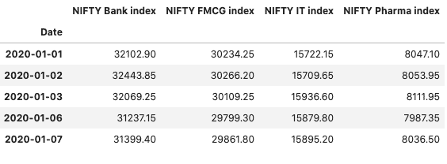

*Combined dataframe consisting of NIFTY indices of the bank, pharma, IT, and FMCG sectors*

## 第一个熊猫图:线形图

现在让我们使用 pandas 来探索和可视化这些数据。首先，看看**漂亮的银行指数**今年的表现会很有趣。

要使用熊猫绘制图形，可以调用。dataframe 上的 plot()方法。plot 方法只是 matplotlib 的 [**plt.plot()**](https://web.archive.org/web/20221206012622/https://matplotlib.org/api/_as_gen/matplotlib.axes.Axes.plot.html#matplotlib.axes.Axes.plot) **的一个简单包装。**您还需要指定作为 x 和 y 轴参考的 x 和 y 坐标。因为日期已经是索引列，所以它将被配置为 X 轴。

```
df.plot(y='NIFTY Bank index')

```

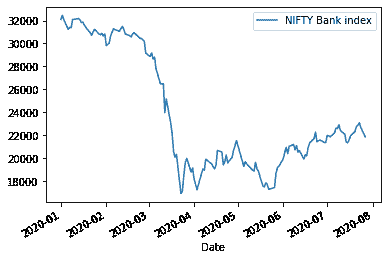

*Line plot showing the NIFTY Bank index performance in the year 2020*

正如您在上面看到的，调用。dataframe 上的 plot()方法默认返回一个**线图**。在 pandas 中绘图很简单，只需要很少的设置。但是，如果需要的话，在某些参数的帮助下，有一些方法可以改变输出。

### **绘图参数**

除了 x 和 y 之外，plot 方法还有几个参数，可以调整这些参数来改变绘图。

*   **x 和 y 参数**指定你想要的 x 和 y 列的值。在上面的例子中，这些是日期和漂亮的银行索引列。

*   **figsize** 指定图形对象的大小。
*   **标题**用于情节。
*   **图例**待放置轴上支线剧情。
*   **Style** :每列的 matplotlib 线条样式。
*   **X 和 y 标签**:用于 X 轴和 y 轴标签的名称。
*   **支线剧情**:为每一列制作单独的支线剧情。
*   **种类**:要产生的剧情种类。我们将在接下来的章节中详细讨论这个参数。

现在让我们用更多的参数绘制相同的数据帧，比如指定 **figsize** 和标签:

```
df.plot(y='NIFTY Bank index',figsize=(10,6),title='Nifty Bank Index values in 2020',ylabel = 'Value');

```


*Notice this cool Jupyter Notebook trick: adding a semicolon to the end of the plotting call suppresses unwanted output.*

## 《熊猫》不同的情节风格

熊猫打印方法可用于打印除默认线形打印之外的样式。这些方法都可以作为“类”关键字参数提供给[](https://web.archive.org/web/20221206012622/https://pandas.pydata.org/pandas-docs/stable/reference/api/pandas.DataFrame.plot.html#pandas.DataFrame.plot)****【剧情】。**可用选项有:**

**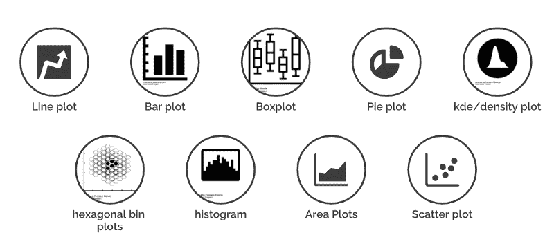

*Different plot styles in pandas*

你是如何创造这些情节的？有两种选择:

*   使用**种类**参数。此参数接受字符串值，并决定您将创建哪种绘图。你可以这样做:

```
Dataframe.plot(kind='<kind of the desired plot e.g bar, area etc>', x,y)

```

*   创建绘图的另一种方法是使用“DataFrame.plot. <kind>”方法，而不是提供 kind 关键字参数。这使得发现绘图方法及其使用的特定参数变得更加容易:</kind>

```
Dataframe.plot.<kind of the desired plot e.g bar, area, etc>()

```

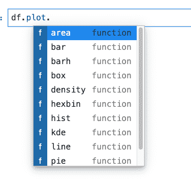

*Creating pandas plots by using the method DataFrame.plot.<kind*>

好吧，你知道如何创建一个线图。我们现在来看看《熊猫》中的其他情节。请注意，您可以使用上面显示的任何一种方法来创建它们。

### **条形图**

[条形图](https://web.archive.org/web/20221206012622/https://pandas.pydata.org/pandas-docs/stable/reference/api/pandas.DataFrame.plot.bar.html)是用矩形条表示分类数据的图。条形的长度与它们所代表的值成正比。

为了创建漂亮数据的条形图，您需要在月末对数据进行重新采样/汇总。pandas 的库有一个 resample()函数，它对时间序列数据进行重采样。pandas 中的重采样方法与其 groupby 方法类似，因为它本质上是根据特定的时间跨度进行分组。resample()函数如下所示:

```
df_sample = df.resample(rule = 'M').mean()[:5]
df_sample

```


*Data resampled by month-end*

**总结一下上面发生的事情:**

*   data.resample()用于对股票数据进行重采样。
*   “M”代表月末频率，表示您想要对数据进行重新采样的偏移值。
*   mean()表示这一时期的平均股价。

现在，让我们创建如下条形图:

```
df_sample.plot(kind='bar',figsize=(10,6))

```

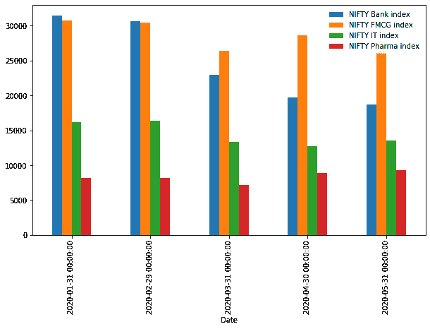

*Barplot showing performance of various NIFTY indices *

如上所述，您也可以在不提供“kind”参数的情况下创建相同的情节:

```
df_sample.plot.bar()

```


*Barplot without providing the ‘kind’ argument.*

方法的选择完全取决于你。

**条形图的类型**

条形图有两种类型，即:

1.  **水平条形图**

当你想水平而不是垂直的时候。通过将“条形图”指定为图表类型，可以创建水平条形图。

```
df_sample.plot(kind='barh',figsize=(10,6))

```


*Horizontal bar charts in pandas*

**2。堆积条形图**

要生成堆积条形图，请传递 stacked=True:

```
df_sample.plot(kind='bar',stacked=True) 
df_sample.plot(kind='barh',stacked=True) 

```

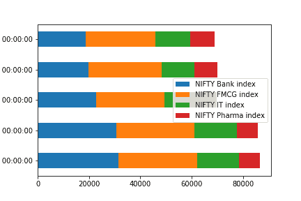

*Stacked bar plots in pandas*

### **直方图**

一个[直方图](https://web.archive.org/web/20221206012622/https://pandas.pydata.org/pandas-docs/stable/reference/api/pandas.DataFrame.plot.hist.html#pandas.DataFrame.plot.hist)是数据分布的表示。让我们只为漂亮的快速消费品索引和漂亮的银行索引创建直方图。

```
df[['NIFTY FMCG index','NIFTY Bank index']].plot(kind='hist',bins=30,alpha=0.5)

```

这里 **alpha** 表示透明度因子，而 bin 指的是数据被分割的范围。默认 bin 值为 10。可以使用“媒体夹”关键字更改媒体夹的大小。

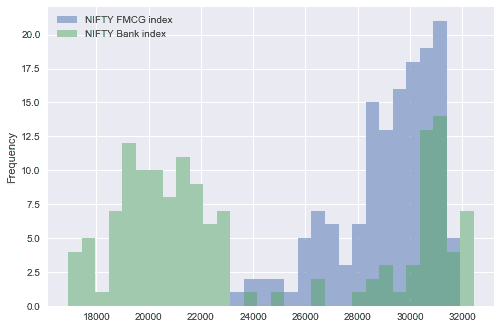

*Histograms in pandas*

直方图可以使用 stacked=True 进行堆叠。


*Stacked histogram in pandas*

### **KDE plots**

熊猫可以使用高斯核生成一个[**【KDE】**](https://web.archive.org/web/20221206012622/https://en.wikipedia.org/wiki/Kernel_density_estimation)核密度估计图。一个[核密度估计图显示了单个变量](https://web.archive.org/web/20221206012622/https://chemicalstatistician.wordpress.com/2013/06/09/exploratory-data-analysis-kernel-density-estimation-in-r-on-ozone-pollution-data-in-new-york-and-ozonopolis/)的分布，可以认为是一个平滑的直方图。

```
df[['NIFTY FMCG index','NIFTY Bank index']].plot(kind='kde');

```

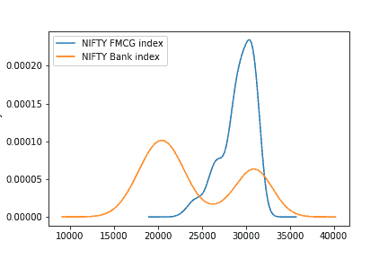

*KDE plot in pandas*

### **箱线图**

[箱线图](https://web.archive.org/web/20221206012622/https://pandas.pydata.org/pandas-docs/stable/reference/api/pandas.Series.plot.box.html#pandas.Series.plot.box)用于通过其四分位数描绘数据。单个箱线图可以传达大量信息，包括关于四分位距、中位数和异常值的详细信息。让我们首先为我们的数据框架创建盒状图，然后你将看到如何解释它们。

```
df.plot(kind='box',figsize=(10,6))

```


*Boxplots in pandas*

以下是你如何解读一个方框图。

任何在异常点之外的都是那些超过胡须末端的点。您可以看到 NiFTY FMCG 比其他产品有更高的异常点。与条形图一样，也可以通过指定 vert=False 来创建水平箱线图。

```
df.plot(kind='box',figsize=(10,6),vert=False)

```

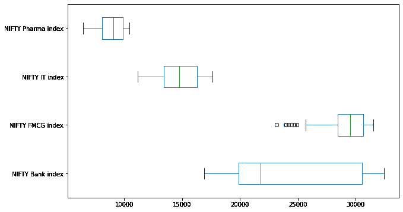

*Horizontal boxplots in pandas*

### **面积图**

一个[面积图](https://web.archive.org/web/20221206012622/https://pandas.pydata.org/pandas-docs/stable/reference/api/pandas.Series.plot.area.html#pandas.Series.plot.area)直观显示定量数据。

```
df.plot(kind='area',figsize=(10,6));

```

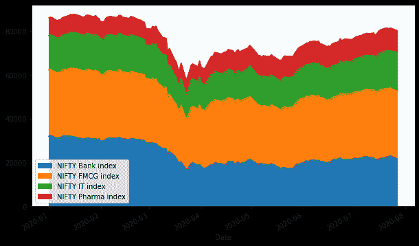

*Stacked area plot in pandas*

默认情况下，pandas 创建一个堆叠面积图，可以通过传递 stacked= **False 的值来取消堆叠。**

```
df.plot(kind='area',stacked=False,figsize=(10,6));

```

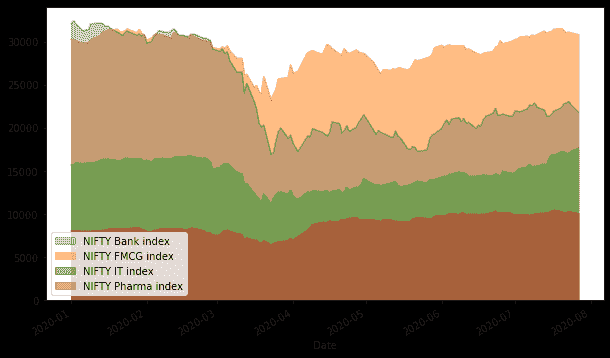

*Unstacked area plot in pandas*

### **散点图**

[散点图](https://web.archive.org/web/20221206012622/https://pandas.pydata.org/pandas-docs/stable/reference/api/pandas.DataFrame.plot.scatter.html#pandas.DataFrame.plot.scatter)用于绘制两个变量之间的相关性。这些相关性以不同颜色和大小的标记形式绘制。如果你要绘制一个散点图，显示 NIFTY IT 指数和 NIFTY FMCG 之间的关系，你可以这样做:

```
df.plot(kind='scatter',x='NIFTY FMCG index', y='NIFTY Bank index',figsize=(10,6),color='Red');

```

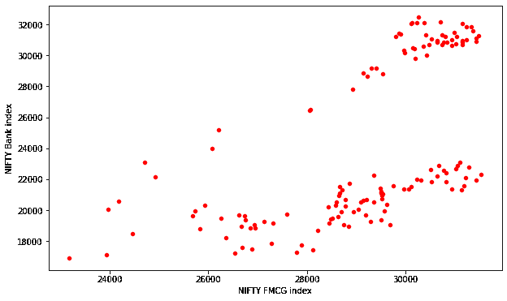

*Scatter plot in pandas*

### **六边形面元图**

六边形 bin 图，也称为 hexbin 图，可用作散点图的替代图。当数据点数量巨大，并且每个点不能单独绘制时，这种绘图特别有用。

```
df.plot(kind='hexbin',x='NIFTY FMCG index', y='NIFTY Bank index',gridsize=20,figsize=(10,6));
```


*Hexbin plot in pandas*

### **饼状图**

[饼图](https://web.archive.org/web/20221206012622/https://pandas.pydata.org/pandas-docs/stable/reference/api/pandas.DataFrame.plot.pie.html#pandas.DataFrame.plot.pie)是一列中数字数据的比例表示。让我们以 NIFTY 银行指数的月末重采样数据为例，看看它是如何逐月分布的。

```
df_sample.index=['jan','feb','march','Apr','may']
df_sample['NIFTY Bank index'].plot.pie(legend=False, autopct='%.f');

```

*熊猫的饼状图*

参数 **autopct** 用于使用 Python 字符串格式显示百分比值。默认情况下启用的图例可以通过指定 legend=False 来禁用。此外，如果指定了 subplots=True，则每列的饼图将绘制为 subplots。

```
df_sample.plot.pie(subplots=True, figsize=(16, 10),legend=False);

```


*Pie plots for each column are drawn as subplots*

Pandas 还有一个名为 [pandas.plotting](https://web.archive.org/web/20221206012622/https://pandas.pydata.org/pandas-docs/stable/user_guide/visualization.html#plotting-tools) 的绘图模块。该模块由几个绘图函数组成，并接受一个 [**系列**](https://web.archive.org/web/20221206012622/https://pandas.pydata.org/pandas-docs/stable/reference/api/pandas.Series.html#pandas.Series) 或 [**数据帧**](https://web.archive.org/web/20221206012622/https://pandas.pydata.org/pandas-docs/stable/reference/api/pandas.DataFrame.html#pandas.DataFrame) 作为参数。pandas 绘图模块包含以下功能。以下描述摘自[熊猫官方文件](https://web.archive.org/web/20221206012622/https://pandas.pydata.org/pandas-docs/stable/reference/plotting.html)。

让我们来看看其中的几个。

### **散点图矩阵图**

您已经看到了如何使用熊猫创建散点图。散点图矩阵，顾名思义，在 pandas 中使用 scatter_matrix 方法创建散点图矩阵。绘图:

```
from pandas.plotting import scatter_matrix
scatter_matrix(df, alpha=0.5, figsize=(10, 6), diagonal='kde');

```

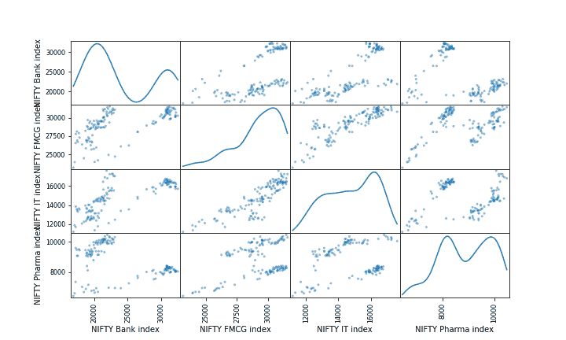

*A scatter matrix in pandas*

### **自举图**

[Bootstrap plots](https://web.archive.org/web/20221206012622/https://pandas.pydata.org/pandas-docs/stable/user_guide/visualization.html#bootstrap-plot) 直观评估统计的不确定性，如平均值、中间值、中间值等。Bootstrapping 涉及通过多次从相同的数据中随机采样来计算统计数据，然后对每个样本的单独结果进行平均。然后将从每个随机样本中获得的结果值绘制成线图和条形图。

```
pd.plotting.bootstrap_plot(df['NIFTY Bank index'])

```


*A bootstrap plot in Pandas*

## 结论

在本文中，我们研究了 pandas 作为绘图库的功能。我们讲述了如何在 pandas 中绘制一些基本的图，并涉及了一些高级的图，如 bootstrap 和散点图。

的。plot()函数是一个非常强大的工具，可以立即帮助您开始数据可视化过程——只需很少的代码行。如果您想了解更多关于 pandas 作为绘图库的功能，以及设计和定制您的绘图，pandas DataFrame 文档的[绘图部分](https://web.archive.org/web/20221206012622/https://pandas.pydata.org/pandas-docs/stable/reference/frame.html#plotting)是一个很好的起点。**