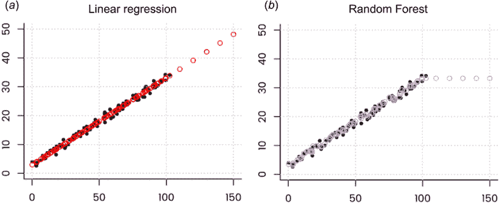
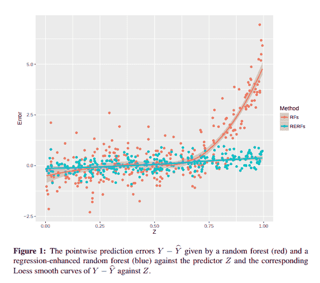

# 随机森林回归:何时失败，为什么？

> 原文：<https://web.archive.org/web/https://neptune.ai/blog/random-forest-regression-when-does-it-fail-and-why>

在本文中，我们将关注使用随机森林进行回归的一个主要问题，即**外推**。

我们将讨论以下项目:

*   随机森林回归与线性回归
*   随机森林回归外推问题
*   潜在的解决方案
*   应该使用随机森林进行回归吗？

让我们开始吧。

## 随机森林回归与线性回归

随机森林回归是一个相当健壮的算法，然而，问题是**你应该把它用于回归**？

为什么不用线性回归代替呢？线性回归中的函数可以很容易地写成 y=mx + c，而复杂随机森林回归中的函数看起来就像一个黑盒，不能很容易地用函数来表示。

一般来说，随机森林会产生更好的结果，适用于大型数据集，并且能够通过为缺失数据创建估计值来处理缺失数据。然而，他们提出了一个主要的挑战，那就是他们不能在看不见的数据之外进行推断。我们稍后将深入探讨这些挑战

### 决策树回归

决策树对于获取输入特征和目标变量之间的非线性关系非常有用。

决策树的内部工作可以被认为是一堆 if-else 条件。

它从最顶端的一个节点开始。然后，该节点分为左右两个节点，即决策节点。这些节点然后分裂成它们各自的左右节点。

在叶节点的末端，计算该区域内发生的观测值的平均值。最底层的节点被称为叶节点或终端节点。

树叶中的值通常是该特定区域内观测值的平均值。例如，在下面最右边的叶节点中，552.889 是 5 个样本的平均值。

这种分裂的程度就是我们所知的树的深度。这是可以调整的超参数之一。指定树的最大深度是为了防止树变得太深——导致过度拟合的情况。

### 随机森林回归

随机森林是决策树的集合。这就是说，许多树以某种“随机”的方式构成了一个随机森林。

*   每棵树都是从不同的行样本中创建的，并且在每个节点处，选择不同的要素样本进行分割。
*   每棵树都有自己的预测。
*   然后对这些预测进行平均以产生一个结果。

平均使得随机森林比单个决策树更好，因此提高了其准确性并减少了过度拟合。

来自随机森林回归变量的预测是森林中的树木产生的预测的平均值。

### 训练线性回归和随机森林的示例

为了进一步深入，让我们看一个线性回归和随机森林回归的例子。为此，我们将对同一数据集应用线性回归和随机森林回归，并比较结果。

让我们以这个数据集为例，您应该根据克拉、深度、表、x、y 和 z 等其他特征来预测钻石的价格。如果我们看下面的价格分布:

我们可以看到**价格从 326 到 18823 不等。**

让我们训练线性回归模型，并在验证集上运行预测。

预测价格的分布如下:

**预测价格明显在训练数据集中显示的“价格”值范围之外。**

线性回归模型，顾名思义，就是在数据上创建一个线性模型。一种简单的思考方式是采用 y = mx+C 的形式。因此，由于它符合线性模型，因此能够在预测过程中获得定型集以外的值。它能够根据数据进行推断。

现在让我们看看使用相同数据集从随机森林回归器获得的结果。

这些值显然在 326 和 18823 的范围内**——就像我们的训练集一样。没有超出该范围的值。**随机森林不能举一反三。****

正如您在上面看到的，当使用随机森林回归时，预测值永远不会超出目标变量的训练集值。

如果您查看预测值，它们将如下所示:

*Hengl, Tomislav et. al “Random forest as a generic framework for predictive modeling of spatial and spatio-temporal variables”. PeerJ. 6\. e5518\. 10.7717/peerj.5518\. | [Source](https://web.archive.org/web/20221224114220/https://www.researchgate.net/publication/327298817_Random_forest_as_a_generic_framework_for_predictive_modeling_of_spatial_and_spatio-temporal_variables)*

想知道为什么吗？

让我们在这里探索这一现象。上面使用的数据有以下几列克拉，深度，表，x，y，z 预测价格。

下图显示了随机森林回归器中的一个决策树。

让我们放大到这棵树的一小部分。例如，有 4 个深度为<= 62.75, x <= 5.545, carat <= 0.905, and z <= 3.915\. The price being predicted for these is 2775.75\. This figure represents the mean of all these four samples. Therefore, **的样本，测试集中落在该叶子中的任何值都将被预测为 2775.75。**

也就是说，当随机森林回归器承担预测以前未见过的值的任务时，它将总是预测以前见过的值的平均值。显然，样本的平均值不能超出样本中的最高值和最低值。

**随机森林回归器无法发现使其能够外推超出训练集**的值的趋势。当面对这种情况时，回归器假设预测将接近训练集中的最大值。上面的图 1 说明了这一点。

### 潜在的解决方案

好，那么你如何处理这个外推问题呢？

有几个选项:

*   使用线性模型，如 SVM 回归、线性回归等
*   构建深度学习模型，因为神经网络能够进行外推(它们基本上是类固醇上的堆叠线性回归模型)
*   使用[堆叠](https://web.archive.org/web/20221224114220/https://scikit-learn.org/stable/auto_examples/ensemble/plot_stack_predictors.html#sphx-glr-auto-examples-ensemble-plot-stack-predictors-py)组合预测值。例如，您可以使用线性模型和随机森林回归量来创建堆叠回归量。
*   **使用随机森林的修改版本**

其中一个扩展是[回归增强随机森林](https://web.archive.org/web/20221224114220/https://arxiv.org/pdf/1904.10416.pdf) (RERFs)。本文作者提出了一种借鉴惩罚参数回归优点的技术，以在外推问题中给出更好的结果。

具体来说，该过程有两个步骤:

*   在随机森林前跑套索，
*   根据 Lasso 的残差训练一个随机森林。

由于随机森林是一个完全非参数的预测算法，它可能不能有效地结合反应和预测之间的已知关系。响应值是观察值 Y1，.。。，Yn 来自训练数据。RERFs 能够整合响应和预测之间的已知关系，这是使用回归增强随机森林解决回归问题的另一个好处。

*Haozhe Zhang et. al 2019 “Regression-Enhanced Random Forests” | [Source](https://web.archive.org/web/20221224114220/https://arxiv.org/abs/1904.10416)*

## 最后的想法

在这一点上，我相信您可能想知道是否应该使用随机森林来解决回归问题。

让我们看看那个。

### 何时使用随机森林？

*   当数据具有非线性趋势时，训练数据之外的外推并不重要。

### 什么时候不用随机森林？

*   当您的数据是时间序列形式时。时间序列问题需要确定一个增长或下降的趋势，而这是一个随机的森林回归方程所不能表达的。

希望这篇文章能给你一些随机森林回归内部工作的背景知识。