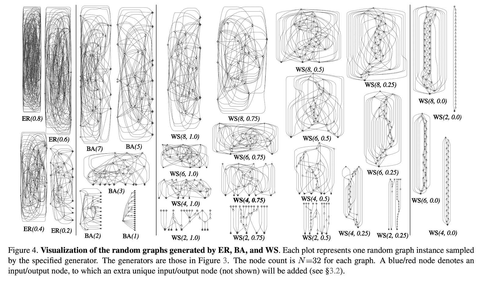

# 随机连线神经网络:你真正需要知道的

> 原文：<https://web.archive.org/web/https://neptune.ai/blog/randomly-wired-neural-networks>

神经网络的创新布线是神经网络架构成功的一大部分，如 [ResNets](https://web.archive.org/web/20221206131522/https://arxiv.org/abs/1512.03385) 和 [DenseNets](https://web.archive.org/web/20221206131522/https://arxiv.org/abs/1608.06993) 。通过[神经架构搜索(NAS)](https://web.archive.org/web/20221206131522/https://arxiv.org/abs/2005.11074) ，研究人员探索接线和操作类型的联合优化。

在来自脸书人工智能研究所的论文“[探索用于图像识别的随机连线神经网络](https://web.archive.org/web/20221206131522/https://arxiv.org/pdf/1904.01569.pdf)”中，作者通过随机连线神经网络的镜头研究了连接模式。随机网络生成器负责整个网络生成过程。

使用三种传统的随机图模型生成随机有线网络。根据作者的说法，这些网络在 ImageNet 基准上具有竞争性的准确性。

让我们探索一下[随机有线网络](https://web.archive.org/web/20221206131522/https://arxiv.org/abs/1904.01569)，看看它们都是些什么。

*Full computation graphs of three randomly wired network samples* | *[Source](https://web.archive.org/web/20221206131522/https://arxiv.org/pdf/1904.01569.pdf)*

## 从网络生成器的角度研究神经结构

设计神经网络的自动化过程被称为[神经架构搜索](https://web.archive.org/web/20221206131522/https://heartbeat.fritz.ai/research-guide-for-neural-architecture-search-b250c5b1b2e5) (NAS)。NAS 可以用来寻找神经网络的最佳布线模式。NAS 网络生成器定义了一组理想的布线模式。网络从这个集合中取样，服从一个可学习的概率分布。

因为 NAS 网络生成器是手工设计的，所以可用的布线模式仅限于一小部分可能的图形。这篇论文的作者介绍了新颖的网络生成器。随机连线的神经网络是从随机网络生成器中采样的。这一代是由人类设计的随机过程定义的。

作者在图论中使用三个现有的随机图模型家族来避免他们自己的偏见。完整的网络定义是通过将随机图转换为[有向无环图(DAG)](https://web.archive.org/web/20221206131522/https://en.wikipedia.org/wiki/Directed_acyclic_graph) ，并应用从节点到其功能角色的简单映射来完成的。

## 随机有线网络的体系结构

让我们来看看随机有线网络架构的基本概念。

### 网络发电机

网络生成器被定义为从参数空间到神经网络结构空间的映射。生成器决定如何连接计算图形。生成器执行确定性映射——给定相同的参数，它总是返回相同的网络架构。

如果引入一个伪随机数的种子，就导致了一个网络家族的构建。这些生成器被称为随机网络生成器。

### 随机连线神经网络

生成随机有线网络涉及以下概念:

*   生成一般图形
*   边缘操作
*   节点操作
*   输入和输出节点
*   阶段

#### 生成一般图形

首先，网络生成器创建一组节点和连接这些节点的边。图形与神经网络的相似程度没有限制。

获得图形后，它被映射到计算神经网络。这种映射是人为设计的。简单的映射用于关注图形连接模式。

#### 边缘操作

边缘用于数据流。定向边将数据从一个节点发送到另一个节点。

#### 节点操作

图中的节点可以有输入边和输出边。一些节点操作包括:

*   **聚合-**通过加权和合并来自边缘的输入数据。在砝码上应用一个 s 形确保它们是正的。这种聚合保持了与输入通道相同数量的输出通道，从而防止卷积的计算量变大。
*   **转换**–使用 ReLU-卷积-BN 三元组 4 转换聚合数据。相同类型的卷积应用于所有节点。在这种情况下，它是一个 3×3 深度方向卷积，后跟一个 1×1 卷积，其间没有非线性。转换应该具有相同数量的输入和输出通道，以便转换后的数据可以与来自任何其他节点的数据合并。修复通道计数后，每个节点的参数计数和浮点运算保持不变。
*   **分发**–由节点的输出边发出转换数据的相同副本。

#### 输入和输出节点

在图像分类问题中，你需要单一的输入和输出。由于没有输入边的多个输入节点，迄今获得的图将不是有效的神经网络。它还包含多个输出节点。

通过简单的后处理步骤，您可以生成有效的网络。创建一个连接到所有原始输入节点的额外节点。使用唯一输入节点向所有原始输入节点发送输入数据的相同副本。类似地，将一个输出节点连接到所有原始输出节点。该节点计算所有原始输出节点的未加权平均值。讨论中的两个节点不执行卷积。

#### 阶段

独特的输入和输出节点导致有效的神经网络。然而，在图像分类的例子中，网络并不始终保持完整的图像分辨率。将网络划分为对要素地图进行下采样的阶段非常重要。

生成的图形代表一个阶段。该图通过其独特的输入和输出节点连接到前一级和后一级。连接到输入节点的节点的变换被改变为步长为 2。当从一个阶段过渡到另一个阶段时，随机图中的通道数增加 2 倍。

下表总结了随机连线神经网络，称为 RandWire。

### 随机图模型

使用的经典图模型都是无向的。一个简单的试探法被用来引导他们。三个经典随机

使用的图形模型有:

*Comparison on random graph generators | [Source](https://web.archive.org/web/20221206131522/https://arxiv.org/pdf/1904.01569.pdf)*

### 设计和优化

人类设计师通过线或网格搜索来优化网络的参数空间。也可以通过随机搜索扫描随机种子来进行优化。

然而，在这种情况下不会这样做(尽管这是可能的)，因为对于不同的种子，精度变化可以忽略不计。而是报告多个网络实例的平均精度。

## 随机连线神经网络性能

这些网络中的实验是在 ImageNet 1000 类分类任务上进行的。对大约 120 万幅图像进行了训练，并对 5 万幅验证图像进行了测试。网络被训练 100 个历元，具有半周期余弦形状的学习速率衰减。标签平滑正则化的系数为 0.1。

*Visualization of the random graphs generated by ER, BA, and WS. | [Source](https://web.archive.org/web/20221206131522/https://arxiv.org/pdf/1904.01569.pdf)*

[MobileNet](https://web.archive.org/web/20221206131522/https://arxiv.org/abs/1704.04861) 、 [ResNet](https://web.archive.org/web/20221206131522/https://arxiv.org/abs/1512.03385) 和 [ShuffleNet](https://web.archive.org/web/20221206131522/https://arxiv.org/abs/1707.01083) 是用于实验的一些架构。实验中使用的所有网络实例都收敛并实现了 73%以上的平均准确率。网络之间的差异也很小。下图显示了在 [ImageNet](https://web.archive.org/web/20221206131522/http://image-net.org/download) 上的性能结果。

网络也可以被修改用于对象检测。在这种情况下，具有 FPN 的更快的 R-CNN 被用作对象检测器。

以下是对 COCO 物体探测的结果。

## 最后的想法

我们探索了受图论中随机图模型启发的随机连线神经网络。所获得的结果接近由人类设计的网络获得的结果和由基于神经结构搜索的模型获得的结果。这就是网络生成器的概念。

### 资源