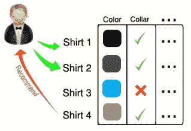
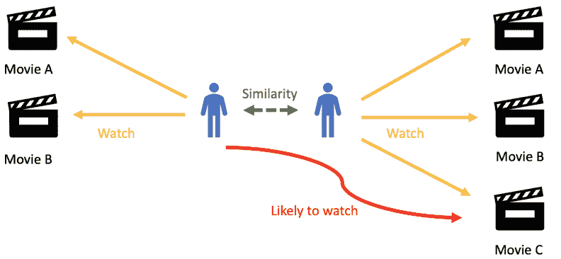
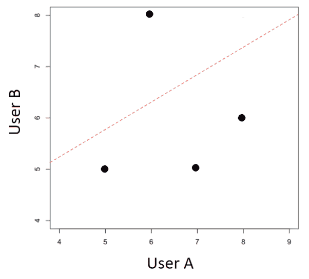
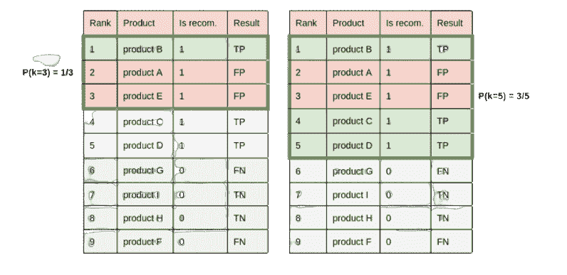
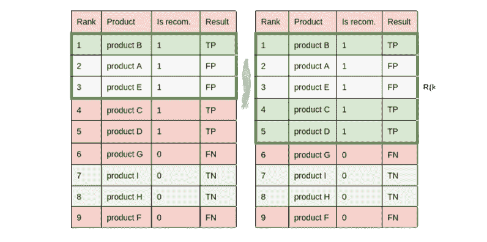
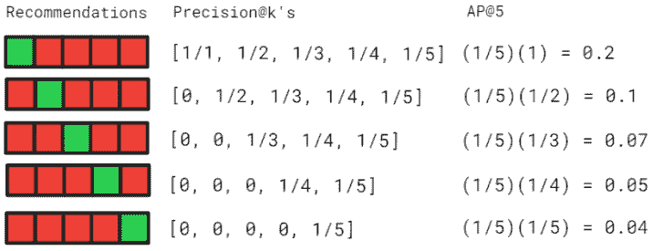
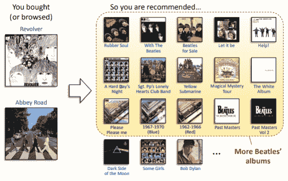
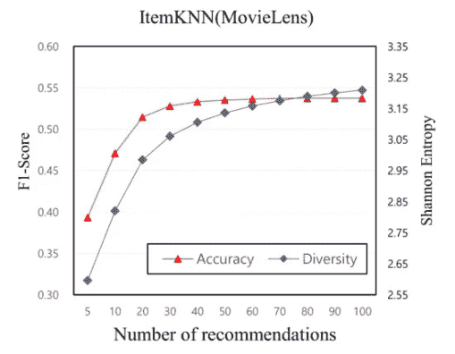

# 推荐系统:机器学习度量和商业度量

> 原文：<https://web.archive.org/web/https://neptune.ai/blog/recommender-systems-metrics>

通常，围绕如何评估一个推荐系统或者[我们应该关注什么 KPIs】存在争议？推荐系统可以通过多种方式使用多个度量组进行评估。每个指标组都有自己的用途。在本文中，我们将看看它们是什么，以及如何将它们结合起来，使](https://web.archive.org/web/20220926092302/https://info.algorithmia.com/hubfs/2020/Webinars/10%20Measures%20and%20KPIs/10%20Measures%20and%20KPIs%20for%20ML%20success.pdf?hsLang=en-us)[业务团队和 ML 工程师](/web/20220926092302/https://neptune.ai/blog/how-to-build-machine-learning-teams-that-deliver)都感到满意。

*   我们将从讨论什么是推荐系统以及它们的应用和好处开始。
*   我们还将比较为推荐系统建立机器学习模型的主要技术，并了解度量和业务评估技术。
*   最后，我们将了解如何为所需的评估选择这些指标。

## 推荐系统简介

### 什么是推荐系统？

推荐系统旨在向用户推荐他们可能喜欢或购买的相关内容或产品。它有助于找到用户正在寻找的商品——直到推荐显示出来，他们才意识到这一点。对于不同的客户，必须采用不同的策略，这些策略是由现有数据决定的。由于 RS 必须是一种数据驱动的方法，它可以由机器学习算法来驱动。

提出建议有两个主要阶段:

## 

*   1 候选生成–创建用户可能喜欢的产品子集。
*   2 评分——根据向用户显示的项目对候选列表进行缩减和排序。

这些技术和相关的评估指标将在本文中进一步描述。

### 产品推荐的力量

为了充分利用 RS 并改善用户体验，我们应该了解并深入研究以下各项之间的关系:

*   **用户和产品**–当用户对特定产品有偏好时。例如，一个网飞用户可能喜欢恐怖片，而另一个用户可能喜欢喜剧片。
*   **产品和产品**–当物品相似时。例如，相同流派的音乐或电影。
*   **用户和用户**——当用户对某一特定商品有相同或不同的喜好时。例如，青少年可能在他们消费的内容方面不同于成年人。

在设计 RS 时记住这些关系会给用户带来愉快的体验，从而提高他们对这些产品的参与度。让我们想象一下 YouTube 没有你喜欢的推荐视频。我们大多数人在那里花了很多时间，只是因为推荐是如此准确！

### 推荐系统背后的策略

要为这样的系统选择最佳策略，我们必须首先评估可用的用户和产品数据量。以下是一些流行的策略，按照所需数据量的升序排列:

## 

*   1 全球——为用户提供最常购买、最流行或最受欢迎的产品。它们可能与任何用户相关。
*   2 上下文-依靠产品属性和一起购买的物品，它们可以与地理位置等基本用户属性相结合，并可用于针对某个群体。
*   3 个性化——不仅需要情境数据，还需要用户行为，如购买历史、点击等。

这些策略应该相互结合，以增强 RS 的性能。例如，在线购物平台应该了解产品的背景以及用户的购买历史。虽然“一起查看”策略只适用于新用户，但对于老客户来说，“一起购买”策略更合适。

## 如何衡量一个推荐人的成功？

这里有一个重要的问题:如何衡量一个推荐人的成功？已经知道应该以某种方式组合的可能关系和策略，答案需要很大的努力。由于要涵盖多个组件和指标，因此很难衡量一个推荐引擎对于一个业务问题有多好。

然而，对于这样的任务，我们可以使用一些度量标准。由于它们的具体选择取决于算法，下一节将专门概述可能的候选生成技术，这是推荐系统的第一步。

### 候选生成技术

候选生成的目标是预测某个用户对产品的评价，并根据该评价选择他们可能喜欢的项目子集。

*Candidate generation | Source: Author*

有两种主要的技术需要描述:基于内容的过滤和协同过滤。

#### 1.基于内容的过滤

基于内容的过滤意味着 RS 将向喜欢或购买的项目推荐相似的项目(上下文策略)。举个例子，如果用户 A 看了两部恐怖电影，会向他推荐另一部恐怖电影。这种技术可以以用户或项目为中心。

##### 以项目为中心

以项目为中心的基于内容的过滤意味着 RS 仅基于与先前项目的相似性来推荐新项目(隐式反馈)。

*Item-centred content-based filtering | [Source](https://web.archive.org/web/20220926092302/https://towardsdatascience.com/introduction-to-two-approaches-of-content-based-recommendation-system-fc797460c18c)*

##### 以用户为中心

在以用户为中心的基于内容的过滤的情况下，例如通过问卷形式(明确的反馈)收集关于用户偏好的信息。这种知识导致推荐与喜欢的项目具有相似特征的项目。

*User-centered content-based filtering | [Source](https://web.archive.org/web/20220926092302/https://towardsdatascience.com/introduction-to-two-approaches-of-content-based-recommendation-system-fc797460c18c)*

##### 如何开始？

基于内容的系统的基本部分是选择相似性度量。首先，我们需要定义一个基于隐式或显式数据描述每个用户的特征空间。下一步是建立一个系统，根据选择的相似性度量对每个候选项目进行评分。适合基于内容的过滤任务的相似性度量将在本文后面讨论。

#### 2.协同过滤

它通过同时使用用户和项目之间的相似性来解决基于内容的过滤的一些限制。它允许我们基于相似用户 b 购买的商品向用户 A 推荐一个商品。此外，CF 模型的主要优点是它们自动学习用户的嵌入，而不需要手工设计。这意味着它们比基于内容的方法受到的限制更少。协同过滤系统可以分为基于记忆和基于模型的方法。

*Collaborative filtering | [Source](https://web.archive.org/web/20220926092302/https://medium.com/web-mining-is688-spring-2021/wayfair-recommendation-system-for-furniture-buyers-906c3f2d0427)*

##### 基于记忆的

基于记忆的 CF 系统处理来自项目-项目或用户-用户交互的记录值，假设没有模型。搜索是基于相似性和最近邻算法完成的。例如，找到与用户 A 最接近的用户，并推荐他们购买的商品。

##### 基于模型的

基于模型的方法假设生成模型解释用户-项目交互并做出新的预测。他们利用矩阵分解算法将稀疏的用户-项目矩阵分解成两个矩阵的乘积:用户因子和项目因子。近年来，在基于模型的遥感领域，人们研究了很多方法。例如关联规则、聚类算法、深度神经网络等。

##### 混合物

混合推荐系统是基于内容和协同过滤方法的结合。这些系统有助于克服这两种类型的推荐器所面临的问题。它可以通过多种方式实现:

*   这两个组件可以单独开发，也可以组合开发。
*   也可以基于关于可用用户数据量的条件来分层设计。如已经提到的，“一起查看”策略可以应用于新用户和基于内容的以项目为中心的过滤。这有助于克服冷启动问题。然而，当有更多的数据可用于过去的购买者时，我们可以为他们实施协同过滤方法。

在我们继续之前，让我们来看看下表中这两种技术的优缺点:

模型

基于内容

合作的

Content-based:

如果用户喜欢喜剧，推荐另一部喜剧

Collaborative:

如果用户 A 和用户 B 相似，用户 B 喜欢某个视频，那么这个视频就推荐给用户 A

Content-based:

*   不需要任何关于其他用户的数据
*   可以推荐小众单品

Collaborative:

*   不需要领域知识
*   帮助用户发现新的兴趣

Content-based:

*   需要大量的领域知识
*   仅基于用户的现有兴趣进行推荐

Collaborative:

*   无法处理新鲜物品(冷启动)
*   很难包含查询之外的功能

*基于内容和协作技术的比较|来源:作者*

## 推荐系统的评价

当谈到指标时，各种类型的推荐系统之间的区别是什么？评估模型有几个指标。在基于内容的过滤方面，我们应该从相似性度量中进行选择，而对于协作方法——预测和分类度量取决于我们是预测得分还是二进制输出。

在我们评估候选生成模型之后，我们可能希望根据业务价值评估整个系统，并涵盖更多非准确性相关的指标以进行评分。所有这些都将是本节的主题。

### 相似性度量

当我们有一个项目的元数据可用时，我们可以很容易地向用户推荐新的项目。例如，如果我们在网飞上观看了电影 A，我们可以根据其他电影的大量元数据标签推荐另一部电影，并计算它们与电影 A 之间的距离。另一种方法是使用 Tf-Idf 等 NLP 技术，并将电影描述表示为向量。我们只需要选择一个相似性度量。

最常见的有余弦相似度、雅克卡相似度、欧氏距离和皮尔逊系数。所有这些都可以在“sklearn.metrics”模块中找到。

#### 余弦相似性

对于一个以商品为中心的系统，要计算已购买商品和新商品之间的相似性，我们只需取代表这些商品的两个向量之间的余弦值。如果有很多高维特征，余弦相似度是最佳匹配，尤其是在文本挖掘中。

#### 雅克卡相似性

Jaccard 相似性是交集的大小除以两组项目的并集的大小。

与本文中其他相似性度量的不同之处在于，Jaccard 相似性将集合或二进制向量作为输入。如果向量包含排名或评级，则不适用。在电影推荐的情况下，假设我们有 3 部带有 3 个热门标签的电影。

*   电影 A 标签=(冒险、浪漫、动作)
*   电影 B 标签=(冒险、太空、动作)
*   电影 C 标签=(浪漫、喜剧、友情)

基于这些数据，我们可以说电影 A 更像电影 B 而不是电影 C。这是因为 A 和 B 共享 2 个标签(冒险、动作)，而 A 和 C 共享一个标签(浪漫)。

#### 欧几里得距离

它是以用户为中心的系统中两个用户之间的距离，是连接他们的线段的长度。偏好空间是可用项目，轴是由用户评级的项目。基于用户评级，我们搜索具有相似品味的用户喜欢的项目。两个人之间的距离越小，他们喜欢相似物品的可能性就越大。

这种度量的潜在缺点是，当人 A 倾向于给出比人 B 更高的分数(整体排名分布更高)时，欧几里德相似性将会很大，而不考虑人 A 和人 B 之间的相关性

#### 皮尔逊相关系数

PCC 是代表用户评级的两个向量之间的关系的线的斜率的度量。它的范围从-1 到 1，0 表示没有线性相关性。

例如，让我们考虑用户 A 和用户 B 给出的评级:

*   用户 A 的评分= [5，6，8，5，7]
*   用户 B 的评级= [5，8，6，5，5]

最佳拟合线具有正斜率，这意味着用户 A 和用户 B 之间的正相关性(下图):

*Correlation between ratings of two users | Source: Author*

通过使用这种方法，我们可以预测人 A 会如何评价一个还没有被评价的产品。为此，我们简单地取其他用户(包括用户 B)的评级的加权平均值，其中权重是使用 PCC 相似性来计算的。

### 预测指标

预测性测量解决了推荐系统的评级与用户评级有多接近的问题。对于非二进制任务，它们是一个很好的选择。平均绝对误差(MAE)和均方根误差(RMSE)是最流行和最容易解释的预测指标。

#### 平均绝对误差

MAE 是推荐和相关评级之间差异的平均幅度，非常容易解释。

*MAE formula, R – predicted Ratings matrix | [Source](https://web.archive.org/web/20220926092302/https://surprise.readthedocs.io/en/stable/accuracy.html)*

请注意，它不会惩罚大的错误或异常值，并对这些情况进行与其他情况相同的加权。这意味着 MAE 对评级准确性给出了一个相当全面的观点，而不是惩罚大的错误。

#### 均方根误差

RMSE 是一个二次评分指标，也衡量平均幅度，但平方根有所不同。

*RMSE formula, R – predicted Ratings matrix | [Source](https://web.archive.org/web/20220926092302/https://surprise.readthedocs.io/en/stable/accuracy.html)*

RMSE 对大错误给予很大的权重。这意味着当离群值不受欢迎时，这更有用。

在实践中，RMSE 和 MAE 通常在 K-fold 交叉验证数据集上被检查用于协同推荐模型。然而，从业务角度来看，重要的不仅是最高的 RMSE 或 MAE，还有用于评分的非准确性指标，这将在后面的部分中描述。现在，让我们继续讨论二值化推荐任务的指标。

### 分类指标

分类度量评估推荐系统的决策能力。对于识别与用户相关或不相关的产品这样的任务，它们是一个很好的选择。对于决策支持度量，精确的评级被忽略，而对于基于排名的方法，它通过排名具有隐含的影响。

#### 决策支持度量

基于所有用户的所有推荐项目，可以计算传统精度和召回率。在测试数据集中可用或接收到高交互值的推荐项目可以被认为是准确的预测，反之亦然。这些指标需要来自用户的注释，将我们的问题转化为二进制文件，并设置被考虑的顶级推荐的数量(Top-N)。然后，通过使用‘sk learn . metrics’模块，我们可以构建混淆矩阵并定义度量如下:

Relevant:

真阳性(TP)

Not relevant:

假阳性

Relevant:

假阴性(FN)

Not relevant:

真阴性(TN)

*推荐结果混淆矩阵|来源:作者*

精确

##### Precision@k 是与用户相关的前 k 个推荐项目的一部分

*P =(相关的前 k 个推荐的数量)/(被推荐的项目的数量)*

让我们来看看这个例子:

召回率@k 或命中率@k

*Calculation of precision@k | Source: Author*

##### Recall@k 或 HitRatio@k 是与用户相关的一组项目中的前 k 个推荐项目的一部分。请注意，k 越大，命中率越高，因为推荐中包含正确答案的可能性越大。

*R =(相关的前 k 个建议的数量)/(所有相关项目的数量)*

在我们的例子中它看起来像什么？

F1@k

*Calculation of recall@k | Source: Author*

##### F1@k 是 precision@k 和 recall@k 调和平均值，有助于将它们简化为单一指标。以上所有指标都可以基于混淆矩阵进行计算。确切的公式如下所示:

正如我们所见，F1 系数不考虑真负值。那些是推荐系统没有推荐与用户无关的项目的情况。这意味着，我们可以把任何值放入真负值，它不会影响 F1 的分数。一个有趣且完全对称的替代方法是马修斯相关系数(MCC)。

*Precision, recall, F1 formulas | [Source](https://web.archive.org/web/20220926092302/https://jonathan-hui.medium.com/map-mean-average-precision-for-object-detection-45c121a31173)*

马修斯相关系数

##### 马修斯相关系数是观察到的和预测的二元分类之间的相关系数:

当分类器是完美的(FP = FN = 0)时，MCC 的值是 1，表示完美的正相关。相反，当分类器总是错误分类(TP = TN = 0)时，我们得到的值为-1，代表完全负相关。

基于排名的指标

#### 如果我们有一个候选生成算法，它返回项目的排序，并且列表中更靠下的项目不太可能被使用或看到，那么应该考虑以下度量。

平均精度

##### precision@k (P(k))只考虑从排名 1 到 k 的推荐子集，而 average precision 奖励我们将正确的推荐放在列表的顶部。先说定义。如果我们被要求推荐 N 个项目，并且在项目的整个空间中相关项目的数量是 m，那么:

例如，让我们考虑 *AP@5* 的示例输出，同时我们向添加了 *m = 5* 产品的用户推荐商品。

在第一组建议中，我们可以看到只有第五项建议是相关的。它表示 precision @ 1 = precision @ 2 = precision @ 3 = precision @ 4 = 0，因为前四位没有相关项。精度@5 等于⅕，因为第 5 项是相关的。一旦我们计算了所有的 precision@k 值，我们将它们相加并将结果除以 5，即得到 AP@5 值的产品数。

*Calculation of AP, example 1 | Source: Author*

根据上面的例子，我们应该注意到，AP 会因为正确的推荐排名靠前而奖励我们。这是因为第 k 个子集的精度越高，我们对 k 点的猜测就越正确。这可以在下面的例子中看到。

Based on the above example we should notice that AP rewards us for top ranking the correct recommendations. That happens because the precision of the kth subset is higher the more correct guesses we have up to the point k. This can be seen in the below example.

当 precision@5 不变时，AP@5 随着推荐项目的等级而降低。需要注意的一件非常重要的事情是，AP 不会因为我们在列表中加入了额外的推荐而惩罚我们。在使用它时，我们应该确保我们只推荐最好的项目。

*Calculation of AP, example 2 | Source: Author*

平均精度

##### AP 适用于单个数据点，相当于单个用户，而 MAP 是所有 Q 个用户的 AP 指标的平均值。

平均倒数命中等级(ARHR)或平均倒数等级(MRR)

*MAP formula | Source: Author*

##### MRR 是用户倒数排名(RR)的平均值。倒数排名是第一个正确项目排名的“乘法倒数”。在两种情况下，MRR 是一个合适的选择:

MRR is the average of reciprocal rank (RR) over users. The reciprocal rank is the “multiplicative inverse” of the rank of the first correct item. MRR is an appropriate choice in two cases: 

## 1 只有一个相关项。

*   2 在用例中，只有第一个推荐的项目是必不可少的。
*   这意味着如果结果列表中有多个正确答案，则 MRR 不适用。如果你的系统返回 10 个条目，并且在第三高的位置有一个相关条目，这就是 MRR 所关心的。它不会检查其他相关项目是否出现在等级 4 和等级 10 之间。

MRR 的示例计算如下所示:

贴现累计收益(DCG)

*MRR calculation | Source: Author*

##### DCG 是衡量排名质量的一个标准。要描述它，我们应该从累积收益开始。CG 是列表中所有结果的分级相关性值的总和。这意味着我们需要计算我们的推荐的相关性分数。

DCG is a measure of ranking quality. To describe it, we should start with Cumulative Gain. CG is the sum of graded relevance values of all results in the list. That means that we need relevance scores of our recommendations to calculate it.

*累积增益计算|来源:作者*

正如我们所看到的，假设高度相关的文档在搜索结果列表中出现得越早就越有用，那么上述两个相关性得分列表获得相同的得分并不完全正确。

为了解决这个问题，应该引入 DCG。它通过减少与结果位置成对数比例的分级值来惩罚在搜索中出现较低的高度相关的文档。参见下面的等式。

基于我们的示例，让我们计算 Python 中“scoresA”的 DCG，将“scoresB”视为真实输出。

正如我们所见，DCG 分数大约是 3.6，而不是 6。DCG 的问题是很难比较不同查询的性能，因为它们不在 0 到 1 的范围内。这也是 nDCG 更常用的原因。它可以通过计算理想 DCG (IDCG)来获得。IDCG 是按降序排序的 DCG，起着归一化因子的作用。

*Computing DCG in Python | Source: Author*

在我们的例子中:

nDCG 评分的局限性在于它不惩罚假阳性。例如，[3]和[3，0，0]产生相同的 nDCG，但在第二个输出中，有 2 个不相关的建议。它也可能不适合具有几个同样好的结果的推荐系统。

*Computing nDCG in Python | Source: Author*

不仅仅准确性很重要

### 我们必须记住，建议不是预测。评估候选生成模型是一回事，把模型纳入整个 RS 系统，给最感兴趣的项目打最高分是另一回事。客户评估系统的方式不仅受到准确性的影响，还受到公司商业策略的影响。例如，对于新闻聚合网站来说，目标是增加人们在平台上花费的时间，而对于电子商务来说，RS 性能的决定因素是销售额的增加。

以推荐为中心的指标

#### 以推荐为中心的指标是独立于用户的概念，不需要用户信息。他们评估系统的领域，而不是用户的评级或他们的历史。它们包括本文前面定义的准确性和度量标准。让我们来看看其中的一些。

多样性

##### 当协作推荐系统只关注准确性时，我们可能会遇到图示的问题。在这个例子中，用户购买了几张披头士的专辑。结果，向他们提供了该乐队的其他专辑的列表。尽管用户可能喜欢它，但是这种本地化的推荐不是很有用。为其他波段留出更多空间会更有用。

When the collaborative recommender system is focused on accuracy only, we may experience the illustrated problem. In this example, the user bought a couple of Beatles’ albums. As a result, they are provided with a list of other albums of this band. Although the user might probably like it, such localised recommendations are not very useful. It would be more useful to have more space for other bands.

这就是多样性的含义，它是结果集中所有项目对之间的平均差异。当然，它高度依赖于可用的元数据以及我们选择的相似性度量。正如我们在下图中所看到的，虽然准确度在 40-100 个最佳推荐之间保持不变，但多样性仍然随着所显示的推荐项目的数量而增加。这意味着值得考虑多样性度量来对推荐项目重新排序。

*Not so useful recommendation | [Source](https://web.archive.org/web/20220926092302/http://www.mavir.net/docs/tfm-vargas-sandoval.pdf)*

新闻报道

覆盖率是推荐系统向用户推荐一个训练集中的所有项目的能力。让我们考虑像在抽奖中那样选择物品的随机推荐器。这种推荐器具有接近 100%的覆盖率，因为它具有推荐每个可用项目的能力。另一方面，基于流行度的推荐器将只推荐前 k 个项目。在这种情况下，覆盖率接近 0%。

*Evaluation of Top-K item recommendation where K ranges from 5 to 100 on the ItemKNN algorithm for the MovieLens dataset. For diversity, Shanon entropy has been used | [Source](https://web.archive.org/web/20220926092302/https://www.mdpi.com/2071-1050/13/11/6165/htm)*

##### 覆盖率不评估用户是否喜欢推荐，而是根据它给用户带来意想不到的能力来衡量 RS。覆盖率低会导致用户不满意。

以用户为中心的指标

以用户为中心的指标通过询问用户、自动记录交互和观察他的行为(在线)来收集。尽管这种实证测试困难、昂贵且需要大量资源，但这是真正衡量客户满意度的唯一方法。我们来讨论一下。

#### 新奇

它是衡量 RS 向用户介绍长尾项目的能力。电子商务平台可以从排名靠前的个性化小众商品中受益。例如，亚马逊通过销售传统书店没有的书籍，而不是畅销书，取得了巨大的成功。

##### 新奇可以被定义为用户喜欢的所有项目中未知项目的一部分。衡量它的理想方式是客户调查，但在大多数情况下，我们无法确定用户之前是否知道该商品。有了关于用户行为的隐含数据，我们就可以衡量推荐之间的差异，这种差异有时可以替代新奇分数。我们还必须记住，太多新奇的东西会导致用户缺乏信任。找到新颖性和可信赖性之间的平衡至关重要。

可信赖

*Long-tail is full of niche content that users may like | [Source](https://web.archive.org/web/20220926092302/https://miloszkrasinski.com/the-long-tail-effect-theory-in-practise-explained/)*

这是一个衡量用户是否信任与他们互动的推荐系统的指标。一个改进的方法是增加一个解释，解释为什么推荐一个特定的项目。

##### 流失和响应

用户评价新项目后，流失衡量推荐变化的频率。响应是这种变化的速度。应该考虑这两个指标，但与新颖性相似，它们会导致低可信度。

##### 现在我们知道，准确性不足以衡量 RS 的性能，我们还应该将注意力放在覆盖率和新颖性等指标上。

业务指标

不幸的是，上面描述的所有指标都没有向我们展示真正的客户对公司商业战略方面产生的建议的反应。衡量它的唯一方法是 A/B 测试。A/B 测试花费更多的资源和时间，但是它允许我们测量下图中显示的指标，我们将在本节中定义这些指标。

### 点击率

CTR 衡量的是推荐获得的点击量。假设点击率越高，推荐就越相关。它在新闻推荐领域非常受欢迎，并被 Google News 或 Forbes 等网络平台所使用。与基于流行度的系统相比，个性化的建议给他们带来了大约 38%的点击量增长。

*Business metrics for recommender systems | [Source](https://web.archive.org/web/20220926092302/https://arxiv.org/pdf/1908.08328.pdf)*

#### 采用和转换

虽然 CTR 告诉我们用户是否点击了某个商品，但它不能确定这个点击是否转化为购买。YouTube 和网飞已经考虑了替代收养措施。只有当用户观看了特定比例的视频(“长点击率”)时，他们的 YouTube 点击才会被计算在内。同样，网飞统计电影或连续剧被推荐后被观看的次数(“收视率”)。

#### 当一个项目无法查看时，必须定义其他特定于领域的度量。例如，在 LinkedIn 的情况下，它将是在工作机会推荐之后与雇主联系的次数。

销售和收入

在确定引入的算法在识别后来的观看或购买方面是成功的方面，CTR 和采用度量是好的。然而，销售的变化通常是最重要的。然而，确定遥感的商业价值方面的改进仍然是困难的。无论如何，用户可能已经购买了一件商品，而推荐可能是不相关的。

#### 对销售分布的影响

与之前相比，衡量引入 RS 后的销售变化是一种非常直接的方法。然而，这需要了解销售分布变化的影响。例如，我们可以观察到个体水平上多样性的减少，并通过进一步的努力来克服这种影响。

##### 用户行为和参与度

几个真实的 RS 测试发现，有一个推荐通常会增加用户的活跃度。通常，在不同的领域(例如，在 Spotify)，客户参与度和保持度之间存在对应关系。当流失率较低时，可能很难衡量。

#### 如何为一个推荐系统选择指标？

由于我们已经熟悉了推荐系统评估指标的多个指标，我们现在可能会怀疑从哪里开始。如果我们问自己以下问题，可能会有所帮助。

*Summary of business metrics | [Source](https://web.archive.org/web/20220926092302/https://arxiv.org/pdf/1908.08328.pdf)*

## 使用哪种候选生成技术？

对于基于内容的过滤，应考虑相似性度量来评估模型性能，如余弦或 Jaccard 相似性。对于协作方法，应选择预测性和准确性指标。

#### 有带注释的数据吗？

我们有从用户或企业收集的明确数据吗？如果是，我们可以将其用作测试集，并使用与准确性相关的度量标准执行监督模型构建。如果不是，我们不得不把隐含数据当作基本事实。这意味着与准确性相关的指标信息会更少，因为我们不知道用户会如何反应，例如，一个利基推荐项目。我们必须关注覆盖面和多样性。

#### 推荐物品有顺序吗？

如果用户打算以特定的顺序考虑多个推荐，与准确性相关的度量(例如 precision@k，recall@k)是不够的，因为它们忽略了排序，并且同等地加权具有较低和较高等级的项目。地图、MRR 或 DCG 可能是更好的选择。

#### 物品是用数字还是二进制来评分的？

在协作系统的情况下，二元尺度表示分类任务和准确性度量，而等级表示回归任务和预测性度量。对于基于内容的系统，二进制尺度允许我们使用 Jaccard 相似性度量。

#### 用户对排名较低的项目的兴趣衰减有多快？

地图、MRR 和 DCG 等指标反映了热门建议的顺序。当我们希望不仅包括排名，还包括顶级项目的评级时，最佳选择是 DCG。它包含了某些项目比其他项目更相关的知识。

#### 是否只显示排名靠前的项目？

如果是，整体预测或排名准确率都不是很好的匹配。确切的评级与用户无关，因为他们已经看到了非常有限的项目列表。在这种情况下，命中率和 CTR 就更合适了。

#### 可以进行在线 A/B 测试吗？

唯一正确的答案是肯定的。A/B 测试允许我们测量 RS 的商业价值，例如 CTR 和销售额的变化。此外，我们可以从用户的可信度、流失率和新奇度方面收集反馈。

#### 摘要

很难衡量一个推荐引擎对于一个商业问题有多好。二进制或等级感知准确性相关的度量将是通过所选 ML 方法生成一组候选项目的良好起点。不幸的是，准确性与对客户满意度至关重要的多样性或新颖性等指标并不一致。

## 最后，依靠最大似然度量来确定推荐系统的性能是不够的。就商业价值而言，只有用户反馈才能带来有价值的产出。这就是为什么总是要进行 A/B 测试的原因。它让我们能够衡量点击率、销售额及其衍生产品的改善情况。只有这样，商业策略和机器学习模型才会和谐地工作。

参考

祖赞娜·德国人

### 热衷于数据故事的高级机器学习工程师。在业务和数据科学团队之间搭建桥梁。人工智能专业应用数学硕士。在与 NLP、推荐系统和时间序列相关的任务的深度学习方面经验丰富。她的兴趣包括交互式 Tableau 仪表板开发。

### **阅读下一篇**

ML 模型测试:4 个团队分享他们如何测试他们的模型

* * *

10 分钟阅读|作者斯蒂芬·奥拉德勒| 2022 年 3 月 1 日更新

## ML Model Testing: 4 Teams Share How They Test Their Models

尽管机器学习行业在开发帮助数据团队和从业者操作他们的机器学习模型的解决方案方面取得了进展，但测试这些模型以确保它们按预期工作仍然是将它们投入生产的最具挑战性的方面之一。

大多数用于**测试生产用途的 ML 模型的过程**是传统软件应用程序的原生过程，而不是机器学习应用程序。当开始一个机器学习项目时，标准的做法是对业务、技术和数据集要求进行严格的记录。尽管如此，团队经常忽略稍后的测试需求，直到他们准备好部署或者完全跳过部署前的测试。

团队如何测试机器学习模型？

对于 ML 测试，你在问这样的问题:“我如何知道我的模型是否有效？”本质上，您希望确保您学习到的模型行为一致，并产生您期望的结果。

## 与传统的软件应用程序不同，建立测试 ML 应用程序的标准并不简单，因为测试不仅依赖于软件，还依赖于业务环境、问题领域、使用的数据集和选择的模型。

虽然大多数团队在部署模型之前都习惯于使用模型评估度量来量化模型的性能，但是这些度量通常不足以确保您的模型已经准备好投入生产。您还需要对您的模型进行彻底的测试，以确保它们在现实世界中足够健壮。

这篇文章将教你不同的团队如何对不同的场景进行测试。同时，值得注意的是，这篇文章不应该被用作模板(因为 ML 测试是与问题相关的),而应该是一个指南，指导你根据你的用例，为你的应用尝试什么类型的测试套件。

While most teams are comfortable with using the model evaluation metrics to quantify a model’s performance before deploying it, these metrics are mostly not enough to ensure your models are ready for production. You also need to perform thorough testing of your models to ensure they are robust enough for real-world encounters.

**This article will teach you how various teams perform testing for different scenarios.** At the same time, it’s worth noting that this article should not be used as a template (because ML testing is problem-dependent) but rather a guide to what types of test suite you might want to try out for your application based on your use case.

[Continue reading ->](/web/20220926092302/https://neptune.ai/blog/ml-model-testing-teams-share-how-they-test-models)

* * *