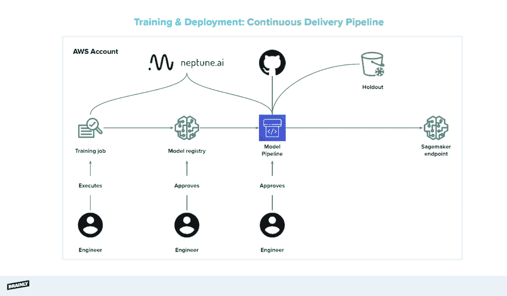

# 通过自我监督学习利用未标记的图像数据，或者通过 Mateusz Opala 利用伪标记

> 原文：<https://web.archive.org/web/https://neptune.ai/blog/self-supervised-learning-pseudo-labeling-with-mateusz-opala>

这篇文章最初是 ML ops Live(T1)的一集，这是一个互动 Q(T2)环节，ML 从业者在这里回答其他 ML 从业者的问题。

每集都专注于一个特定的 ML 主题，在这一集里，我们与 Mateusz Opala 讨论了如何利用无标记图像数据进行自我监督学习或伪标记。

你可以在 YouTube 上观看:

 [https://web.archive.org/web/20220926093535if_/https://www.youtube.com/embed/XiOXgsVWnUw?version=3&rel=1&showsearch=0&showinfo=1&iv_load_policy=1&fs=1&hl=en-US&autohide=2&wmode=transparent](https://web.archive.org/web/20220926093535if_/https://www.youtube.com/embed/XiOXgsVWnUw?version=3&rel=1&showsearch=0&showinfo=1&iv_load_policy=1&fs=1&hl=en-US&autohide=2&wmode=transparent)

视频

或者作为播客在以下位置收听:

但是，如果你喜欢书面版本，这里有！

您将了解到:

## 1 什么是伪标记和自监督学习

*   2 伪标签应用:图像和文本数据

*   3 应用 SSL 或伪标签时的挑战、错误和潜在问题

*   4 如何用伪标签解决过拟合

*   5 如何创建和增强数据集？

*   6 使用伪标记技术时用于数据处理和训练的 MLOps 架构

*   7 还有更！
*   我们开始吧。

**Sabine:** 今天和我们在一起的是 [Mateusz Opala](https://web.archive.org/web/20220926093535/https://www.linkedin.com/in/matthewopala/) ，他将回答关于**利用未标记图像数据** **进行自我监督学习或伪标记**的问题。欢迎你，马修。

**Mateusz Opala:** 大家好。很高兴来到这里。

萨宾:有你真好。Mateusz 在像 [Netguru](https://web.archive.org/web/20220926093535/https://www.netguru.com/) 和 [Brainly](https://web.archive.org/web/20220926093535/https://brainly.pl/) 这样的公司担任过许多机器学习的领导职位。Mateusz，你有计算机科学的背景，但你是如何更多地进入机器学习领域的呢？

**Mateusz:** 这一切都开始于我大学二年级的时候。我的一位教授告诉我，吴恩达正在 Coursera 上做著名的机器学习课程的第一次迭代。我差不多就是从那里开始的，然后做了一个深度无监督学习的学士论文，去了西门子从事深度学习的工作，然后我所有的岗位都是严格意义上的机器学习。

萨宾:从那以后你就一直走这条路？

是的，完全正确。我之前做过一段时间的后端工程师。但在我职业生涯的大部分时间里，我是一名机器学习工程师/数据科学家。

什么是伪标签？

## Sabine: Mateusz，给你暖暖身子。你如何在一分钟内给我们解释**伪标签**？

 [https://web.archive.org/web/20220926093535if_/https://www.youtube.com/embed/tPtWBQMwyaU?version=3&rel=1&showsearch=0&showinfo=1&iv_load_policy=1&fs=1&hl=en-US&autohide=2&wmode=transparent](https://web.archive.org/web/20220926093535if_/https://www.youtube.com/embed/tPtWBQMwyaU?version=3&rel=1&showsearch=0&showinfo=1&iv_load_policy=1&fs=1&hl=en-US&autohide=2&wmode=transparent)

视频

**Mateusz:** 我们来试试。

想象一下，我们有大量的数据，只有少量的数据被标记，而大多数数据是未标记的，我们想训练我们最喜欢的神经网络，让我们称之为 ResNet 50。

1.  在简化过程中，我们在一堆有标签的数据上训练了一个模型，然后利用这个模型，我们在一堆无标签的数据上预测标签。
2.  我们使用预测的标签作为目标来计算未标记数据的损失函数。
3.  我们将标记和未标记数据的损失结合起来，通过网络反向传播并更新权重。这样，我们就可以利用训练体系中未标记的数据。
4.  是一分钟还是更长？

萨宾:干得好。我认为这绝对适合一分钟内，

Mateusz: 我可以给你一个关于**计算机科学发展过程**的类比，你会怎么想。

假设我们有一个软件开发团队，有几个高级工程师和一堆中级工程师。显然，高级工程师比初级或中级工程师能产生更好的代码质量，但是你可以雇佣有限数量的高级工程师，而且你也想培养中级和初级工程师。所以你需要建立一个两者兼而有之的团队，并使之高效。

如果您投资于代码审查和最佳实践、测试、自动化 CI 和 CD，那么初级工程师也能够将代码交付到产品中。

你可以认为高级工程师是这里的标签数据，

1.  而初级工程师参考一次无标签伪标签。
2.  投资代码评审就像扫描**损失函数**。在训练初期，你需要投入更多，所以实际上，你更在意的是被标注的数据。一旦网络开始做出好的预测，你也从未标记的数据中受益，所以当你的开发实践非常扎实时，从初级和中级工程师中受益。

萨宾:好吧。谢谢你的比喻。

什么是自我监督学习？

## Sabine: 我们确实有一个社区问题:什么是自我监督？Mateusz，你介意做个总结吗？

**Mateusz:** 当然可以。自我监督，我会说这是无监督技术的子集，当你没有标签的时候。self 意味着您使用输入图像来生成标签。在这个简单对比学习的用例中，为了生成标签，你获取图像，对同一图像进行两次放大，你知道这是同一图像，这就是你的标签。如果你放大两张不同的图像，并把它们相互比较，那么你的标签就是它们不是相同的图像。

基本上，您从数据中生成标签。你在监督学习中训练，但是你没有像在监督学习中那样的注释标签，但是标签以某种方式从你的输入中产生。

伪标签应用:图像和文本数据

## **斯蒂芬:**牛逼。正如你提到的，你目前在 Brainly 担任高级机器学习工程师。你能给我们介绍一些在 Brainly 中对图像数据应用伪标签的不同用例吗？

我知道 **Snap 解决**是大概用的产品之一。你知道，你可能有更多的想法。

 [https://web.archive.org/web/20220926093535if_/https://www.youtube.com/embed/X4Qkjym3ysw?version=3&rel=1&showsearch=0&showinfo=1&iv_load_policy=1&fs=1&hl=en-US&autohide=2&wmode=transparent](https://web.archive.org/web/20220926093535if_/https://www.youtube.com/embed/X4Qkjym3ysw?version=3&rel=1&showsearch=0&showinfo=1&iv_load_policy=1&fs=1&hl=en-US&autohide=2&wmode=transparent)

视频

是的，当然。快速解决是我的团队工作最多的功能。也许我会简短地解释它是关于什么的。

基本上，当你打开手机时，你可以快速想象你想要回答的问题。然后作为一个用户，你可以调整作物来选择问题，然后根据图像上的内容将其发送到文本搜索或我们的数学求解器，你会得到你需要的答案。

我们的团队从事的项目有

*How Snap to Solve works |* [*Source*](https://web.archive.org/web/20220926093535/https://brainly.com/)

理解图像上的内容，理解问题的层次，

*   检测图像的质量问题，
*   试图告诉用户，他们可以以某种方式改善他们拍摄的图像，以获得更好的答案，
*   以及路由到该问题所需的特定服务。比如有数学的话，它可以，而不只是在数据库里搜索，它可以直接求解，比如。
*   去年，我们有一个项目叫做 VICE，是关于**视觉内容提取的。**

在那个项目中，我们想了解问题的布局。它只是一个**对象检测模型**，试图预测如下类别:

表，

*   问题，
*   图像，
*   图，
*   文字，
*   诸如此类，
*   问题布局上所有可见的东西。

问题是你的标签预算总是有限的。即使你有强大的预算，强大的公司，这家公司也不是一家初创公司——总有一个极限。不仅仅是钱的问题，还有时间的问题——你能等多久才能拿到标签。

在 Brainly 中，我们有许多来自用户的图像，我们真的喜欢利用所有这些未标记的数据。此外，当您希望开始标注用于训练目的时，您可能希望有一个或多或少平衡的分布。你想有一个类似数量的文本框和表格框，等等。很明显，你的数据通常很不平衡。

我们重用自我监督学习的第一种方法是实际进行一些**非监督**或**半监督分类**来生成用于标记的数据，以从我们所有的图像中向下采样数据。因此，我们可以仅为了训练的目的而标记，只是一个小的子集，它仍然是统一的。

在那个项目中，我们致力于一篇名为**简单对比学习**的论文。在这篇论文的顶部，有两个用于无监督分类的框架，称为:

简单的对比学习基本上就是对比两个图像，一个对另一个。你通过拍摄原始图像来完成，你对图像进行数据扩充和扰动。你对同一个图像做两次扰动。作为一种输入，你有不同的图像，但是你知道，它们是相同的，你学习这些图像的相似性，结果，你得到了那个图像的良好嵌入。

> 基于这种嵌入，有非常少量的标记数据，我们实际上可以很好地采样训练弱分类器，以最终获得标记的良好候选。这是我们 tem 的第一个自我监督学习方法。

在我们的情况下，伪标签是一个有趣的案例，因为在原始论文中，生成伪标签的是同一个网络。我们走的有点不同，因为在我们的例子中，我们有时有多模态输入，所以我们有文本和图像。但不是在所有阶段我们都有文本，所以有时候，我们只需要处理图像。

然而，当创建数据集和训练时，我们可能会重用历史上可用的文本。我们使用一种基于自然语言处理的方法来为模型生成一个伪标签，然后在产品中只对图像进行推理。

**Stephen:** 我想知道为什么我现在要回到 Brainly 的使用情形，因为 Snap 要解决。我想知道:

在自我监督学习技术之前，你是否尝试了所有的技术，

*   或者你只是知道这种特殊的技术是我们认为有效的，然后你就直接应用了它？
*   它和所有的技术相比怎么样？
*   **Mateusz:** 总的来说，我们使用的大多数技术仍然是监督学习，我们对数据进行标记，但这是有限的，而且很耗时。

对我们来说，应用自我监督学习的最佳用例是当我们想要从所有用于标注的数据中进行下采样时。我们实际上想要确保我们在那个标签中有不同种类的数据，并且我们也为我们覆盖所有有趣的情况。

> 我们可能没有 50-50 分布的笔迹和教科书的图像。在一些市场中，这可能是更多的笔迹，而在一些市场中，这可能只是一点点笔迹，但最终，如果我们有也包含笔迹的数据，则训练是最好的。

它包含不同种类的数据，因此我们可以:

It contains different kinds of data, so we can: 

## 1 处理好了

*   2 它更好地概括了。
*   我们提出了用于聚类或无监督图像分类目的的自我监督学习。

我提到过一些例子，其中我们有**文本**和**图像**。具体来说，你可以想象用例，这不是一个真正的用例，但你可以想象，我们有一个图像，一个带有一些文本的图像，不像 Brainly 中的问题，但一般来说，你有一些商店的横幅，一般来说，有图像，有文本。

让我们假设您有某种方法可以从图像中生成文本。你有你的数据，你有图像和文本。课文说有一家 24 小时营业的商店，实际上有那家商店的图像。我们想要做的是基于文本为图像生成伪标签，以了解它是商店还是体育场。

我们可以利用一些 NLP 模型，我们可以重用 [BERT](/web/20220926093535/https://neptune.ai/blog/how-to-code-bert-using-pytorch-tutorial) 或类似的东西来做微调。我们可以做**零镜头学习**之类的事情来生成标签，我们可以将它们视为平滑标签，然后只在图像上训练模型。

目前，我们最感兴趣的是如何重用在推理过程中不可用的模态，而是重用它们来生成标签，因此我们不需要标记所有的东西。

**斯蒂芬:**牛逼。谢了。顺便说一句，如果你想了解罪恶是如何运作的，我们用 Brainly 做了一个[案例研究。如果你想知道罪恶是如何运作的，我想那会让你明白更多。](/web/20220926093535/https://neptune.ai/customers/brainly)

Mateusz，在 Brainly 之前，你有从事伪标签工作的经验吗，对你来说怎么样？当时你在用什么应用？

 [https://web.archive.org/web/20220926093535if_/https://www.youtube.com/embed/NDh0QdXyOes?version=3&rel=1&showsearch=0&showinfo=1&iv_load_policy=1&fs=1&hl=en-US&autohide=2&wmode=transparent](https://web.archive.org/web/20220926093535if_/https://www.youtube.com/embed/NDh0QdXyOes?version=3&rel=1&showsearch=0&showinfo=1&iv_load_policy=1&fs=1&hl=en-US&autohide=2&wmode=transparent)

视频

实际上，就在论文发表的时候(我想论文是 2014 年的)。2014 年，我在克拉科夫的一家小创业公司工作，我们为小创业公司做小项目。

有一家创业公司在做智能狗项圈。智能狗项圈装有传感器，如加速度计、陀螺仪、温度计等。我们的机器学习系统的目标是预测狗的行为——狗是在吃东西、喝水还是在跑。后来，我们可以自动发送一些提示给狗主人，警报会说有一个高温和狗很长时间没有喝水。

想象一下，从传感器获取数据很容易，因为你只需给狗戴上狗项圈，但标记这些数据却非常困难。这是一个有趣的故事，我们实际上是如何标记的，因为有这些人，为了他们的工作，他们带很多狗出去。我们只是把它和这些人联系起来，我们和这些人一起散步了很多次，带着狗，我们只是注意到从 2:10 到 2:15，狗在喝酒等等。

这不是收集大量注释的真正可行的方法，但是收集大量未标记的注释很容易。因为我们深受过拟合之苦，据我所知，我们当时探索了伪标签的角度，这对解决该模型的过拟合问题很有帮助。

**Sabine:** Maciej 想要得到提到的论文的标题或链接。

**Mateusz:**[伪标原纸](https://web.archive.org/web/20220926093535/https://www.researchgate.net/publication/280581078_Pseudo-Label_The_Simple_and_Efficient_Semi-Supervised_Learning_Method_for_Deep_Neural_Networks)为董李。我觉得是 2013 年的。

Sabine: 我们实际上在聊天中有一个问题。您是如何选择图像增强来训练 SSL 模型的？您是使用了论文中的方法，还是通过实验找到了最适合您的数据的增强方法？"

 [https://web.archive.org/web/20220926093535if_/https://www.youtube.com/embed/IPijZroew5Q?version=3&rel=1&showsearch=0&showinfo=1&iv_load_policy=1&fs=1&hl=en-US&autohide=2&wmode=transparent](https://web.archive.org/web/20220926093535if_/https://www.youtube.com/embed/IPijZroew5Q?version=3&rel=1&showsearch=0&showinfo=1&iv_load_policy=1&fs=1&hl=en-US&autohide=2&wmode=transparent)

视频

我从研究论文中的**数据扩充**开始，所以这就是方案，但是我也尝试了不同种类的扩充。我记得我们的设置略有不同，因为我们的领域实际上与 [ImageNet](https://web.archive.org/web/20220926093535/https://www.image-net.org/) 不同。所以这是合理的，这是不同的东西。

例如，我们不做翻转，因为你不应该翻转文本，至少在英语中不应该，但我在 GPU 上使用 [Nvidia DALI](https://web.archive.org/web/20220926093535/https://docs.nvidia.com/deeplearning/dali/user-guide/docs/#:~:text=The%20NVIDIA%20Data%20Loading%20Library,image%2C%20video%20and%20audio%20data.) 进行数据增强。几乎可以说，我探索了该库中所有典型的增强。我知道，例如，在[albuminations](https://web.archive.org/web/20220926093535/https://albumentations.ai/)中有更多的输出，但它的速度较慢，所以通常我坚持使用 Nvidia DALI。

应用自我监督学习或伪标记时的挑战

## **Stephen:** 说到挑战，你在 Brainly 的应用中应用自监督学习或伪标注时遇到过哪些挑战？

 [https://web.archive.org/web/20220926093535if_/https://www.youtube.com/embed/S-qezq1wQtA?version=3&rel=1&showsearch=0&showinfo=1&iv_load_policy=1&fs=1&hl=en-US&autohide=2&wmode=transparent](https://web.archive.org/web/20220926093535if_/https://www.youtube.com/embed/S-qezq1wQtA?version=3&rel=1&showsearch=0&showinfo=1&iv_load_policy=1&fs=1&hl=en-US&autohide=2&wmode=transparent)

视频

**Mateusz:** 用**简单的对比学习，**这个算法需要大量的数据，甚至 100 万张图像。我认为训练这个算法并不容易。显然，在 Brainly，我们有更多的数据，我们可以在更多的数据上进行训练，但是，训练需要很多时间，而且这个项目有它的限制。

最后，我们得出结论，简单对比学习中的预训练嵌入并不比 ImageNet 中的预训练嵌入好多少。它更多的是关于选择标签候选人的任务。

最重要的部分实际上是:

The most important part was actually: 

## 在预训练嵌入上尝试一些简单的东西，比如分离向量机

*   2 并通过优化超参数搜索重新调整它们，
*   这在最困难的情况下效果很好。

总的来说，我认为，要进行简单的对比学习，需要:

In general, for tunning the simple contrastive learning, I think, it requires:

## 1 非常强大的计算能力，

*   2 分发算法的好方法，

*   我记得报纸上写的批量也非常大。
*   他们最初在一堆 TPU 上训练它，我想这篇论文也是来自谷歌。根据内存大小和批处理大小，以您受限的大小复制 TPU 上的所有内容并不容易，例如，在 GPU 上。这些是我看到的挑战。

就**伪标签**而言，有点不一样。通常，您有一个非常小的标注数据集。如果太小，无法学习基本的群集结构，可以分离出有噪声但很好的初始示例。当你增加越来越多的无标签损耗系数时，你只是在给你的数据添加噪声。

第一个问题可能是一个小的标注数据集。

1.  下一个是，当你做伪标记时，你有一个损失函数，它是标记数据损失和未标记数据损失的加权组合。通常，你从无标签数据的零损失开始，你喜欢在有标签的数据上预热你的网络。例如，在它实际学习聚类结构之前，你可以太快地从未标记开始增加损失函数。
2.  还有，在神经网络中，通常会出现过度自信的现象。例如，预测非常接近 1，或者非常接近 0，特别是当你做伪标记时，预测显然有时是不正确的，这也加强了这种现象，给数据增加了更多的噪声，于是有一种叫做**确认偏差**的东西，你需要一些技术来解决这个问题。

通常，这是通过应用混合策略来完成的，因此这是一种强大的数据增强，结合了用于正则化目的的标签平滑，这可以减轻确认偏差。

**斯蒂芬:**牛逼。这个特殊的应用程序是一个小团队就能应用的，还是需要大量的资源？你能告诉我们，对于一个小团队来说，开始应用这个会有多乏味吗，特别是当他们有更小的数据集时，因为当他们没有 Google 大小的数据集时，这更有意义。

我会说，像简单对比学习这样的技术，一般来说，是自我监督的技术，通常需要:

**Mateusz:** I would say that techniques like simple contrastive learning, which, in general, are self-supervised techniques, usually require: 

## 1 大量的计算，

*   2 很多 GPU
*   如果没有适当的基础设施，这对小团队或从事某项工作的个人来说肯定是困难的。

***我不认为这个技术对小团队来说是最好的，大概是预先训练好的模型还是比较好用的。***

此外，自我监督训练的模型有时也会发表，实际上在麻省理工学院的许可证上有一个很棒的[库](https://web.archive.org/web/20220926093535/https://github.com/facebookresearch/vissl)来自脸书，关于自我监督学习。它非常容易重用，并且是基于 PyTorch 构建的。

但伪标注是一种非常容易实现的东西，它对于对抗或过度拟合和正则化您的网络非常有用，当您有一个较小的数据集时，它可以发挥作用。

应用伪标签时的常见错误

## Stephen: 你见过团队在尝试为他们的系统应用伪标签或者甚至尝试应用自我监督学习技术时犯的常见错误吗？

**Mateusz:** 伪标记的典型问题是当你的少量数据不足以满足聚类假设时。假设数据在低密度区域的决策边界中被很好地分离。

它的基本思想是，彼此靠近并且在同一个簇中的图像共享相同的标签。如果你没有足够的数据来快速学习潜在的聚类结构，这可能不是最优的，但对伪标记来说足够好，那么你最终只会给数据添加噪声。

此外，你可能做得很好，但你最初的小数据集可能不一致，标记的不一致会极大地影响伪标记训练的质量。

> 如何用伪标签解决过拟合问题

## Stephen: 你之前提到过伪标签是一种用来克服过度拟合的特殊技术。在您的用例中，您是如何实现的？你能给我们详细描述一下你与过度拟合作斗争，然后伪标签来拯救你的场景吗？

**Mateusz:** 在过度拟合的时代，我的用例或多或少带有过去的经验，即带有狗项圈的用例，也更多带有 NLP 用例。

在 Brainly，我们目前有一个用例，我们正在探索应用伪标签的可能性。基本上，我们正在解决过度拟合的原因是我们正在解决的任务定义起来非常主观，并且我们在标签一致性方面很挣扎。此外，我们没有一个好的星期分类器，所以我们需要处理一些类别不平衡，我们没有太多的图像在我们想要检测的类别上。

实际上，对于半监督学习技术和伪标记来说，这是一个很好的例子，我们需要利用所有未标记的数据。

如何创建和增强数据集？

## 斯蒂芬:酷。放大这张照片。在某个时候，你碰到了这个路障，对吗？你是做什么的？你如何考虑增强你正在使用的这项技术，或者你只是探索其他技术？

因为您谈到了较小的数据集是使用伪标签的主要挑战。如何提高数据集的质量？你考虑过合成数据集吗？你能给我们介绍一下吗？

**Mateusz:** 我们试图在创建数据集的方式上有所创新。我们真的不需要重新创建像图像这样的数据，因为我们有太多的图像。如果我们有一张图片的标签，我们最好搜索相似的图片。我们有一些预先训练的相似性嵌入，如简单的对比学习。如果我们找到相似的图像，我们可以标记它们，就像有相同的标签一样。这是一方面。

我喜欢的另一件事是，通常，人们认为数据增强是图像或文本的增强，基本上不是目标，而是输入，对吗？

几年前，我在做姿势检测，给人类的姿势加标签也很耗时，因为你需要给 12 个身体关节加标签。我们也在过度适应中挣扎。

我们的想法是，如果你给姿势的身体关节加标签，然后把身体关节的标签移动几个像素，这基本上是相同的标签，因为你只是用一个点给整个头部加标签。我们做了**目标增强**。类似地，你可以想到我们有时试图在 Brainly 上做的数据扩充，我们试图改变输入图像，所以它们实际上反映了我们缺乏的不同目标。

这也是如何创造性地创建和增加数据集中图像数量的方法。在一天结束的时候，最好只是给你的图片贴上标签。有时候，这就是我个人在做的事情。我只是给更多的图片贴上标签:

That’s also the way how to creatively create and increase the number of images in datasets. At the end of the day, it’s best just to label your images. Sometimes, that’s what I’m just doing personally. I am just labeling more images to:

## 1 提高我的模型性能

*   或者改进我的方法，
*   但是在数据集的创建过程中保持创造性是很重要的。

我认为，在生产环境中创建数据集，就像在商业环境中一样，非常重要，甚至比培训更重要。

> 我认为 Brainly 的机器学习方法是一种非常以数据为中心的方法，我们试图以这样的方式构建我们的软件，如果我们需要改变数据集，我们可以重新运行一切，并在生产中快速更新新数据集上的模型。我真的相信有创造力和强调数据集的创建是非常重要的。

**Stephen:** 说到数据集，我们之前也谈到过小型团队，他们有权访问带标签的数据集。当然，我们有很多未标记的数据集，而且很可能不贵。

他们如何找到这种平衡，尤其是如果这对于他们的用例非常关键的话？

他们如何找到这种平衡，他们有这些小的标记数据集，但还有大量的未标记数据集，他们必须使用这种特殊的技术。

你会如何建议他们去寻找平衡，并适当地应用伪标签，甚至自我监督学习？

显然，我建议你需要考虑:

你有什么基础设施？

1.  实际上你能训练多少数据？
2.  您的问题的数据解决方案是什么？
3.  你有多少时间？
4.  当你唯一的限制是 GPU 的大小和培训的时间时，无论你是为云还是在你家的某个地方付费？
5.  当你考虑所有这些的时候，我会从实际训练的最小的标记数据集开始。

这不是抛硬币那样的工作，而是实际上的训练。我会尽可能早地将它可视化，看看数据集中是否确实有一些由你的聚类创建的聚类，以及它们是否有意义。

如果他们做**开始有意义，**然后有一部分你可以添加未标记的数据。在最初的设置中，您可以同时对已标记和未标记的数据进行训练，但显然，您可以从少量的标签数据开始，看看它是否有一点点表现，看看可视化是否有意义，然后当您发现足够多的数据时，您可以进行两阶段训练。

1.  如果你的**数据不够**并且没有看到任何聚类，也不是训练，那么你只需要在开始的时候多贴标签。一旦你在那里，然后你可以开始添加标签数据。你可以从头开始你的训练程序，并尝试同时进行。但是，即使你同时训练，你只是从训练未标记的部分和未标记损失的系数开始，这种方式在开始时为零，然后线性增加，直到它达到最终值，你仍然要训练一段时间。
2.  应用伪标签时的潜在问题

## **Stephen:** 除了数据集问题，您是否发现了一些问题会影响图像测试中伪标签的有效性？

**Mateusz:** 超越数据集问题。我会说，通常与训练问题相关的是神经网络预测的**过度自信。这是很难解决的问题。这就是确认偏差的问题。你可以做混合策略等等。但是说到底，这很难。**

实际上，为了理解我们的预测是否有意义，我们还使用了像 [SHAP 值](https://web.archive.org/web/20220926093535/https://shap.readthedocs.io/en/latest/index.html)或更老的[莱姆值](https://web.archive.org/web/20220926093535/https://github.com/marcotcr/lime)这样的解释器，但它们不一定总是能很好地处理图像。有时会，有时不会。

神经网络的过度自信，即使你有很好的指标，如测试集，验证集，无论是精度，召回，F1，等等，如果你看到你的预测非常过度自信，这仍然不是很好，这可能是错误的。这无疑也会影响重用伪标签的能力。

斯蒂芬:逮到你了。我认为有这种特殊，我不知道它有多普遍，但它就像集群假设是伪标签工作的必要条件。你对这个特定的短语本身有什么看法？

**Mateusz:聚类假设**基本上是说，数据在分类时，应该形成单独的聚类和决策边界。当你思考类似的问题时，比如在 SVM 的情况下，决策边界需要在低区域密度。

他们在原始论文中所做的，实际上，是一个非常有趣的伪标签实验。他们在众所周知的 MNIST 数据集上训练，但是一些实验后来在 CFAR 等上重现。不仅仅是 MNIST 的设定，在 MNIST，他们训练了模型，他们使用 t-SNE 在 2D 平面上进行降维来可视化预测。

实际上，预测的分离，当它以纯监督的方式被训练时，它没有当你使用伪标签时那么好。

> 当您使用伪标签时，集群显然是从其自身推出的，因此集群之间有明确的边界。这表明，**熵正则化，**只是一个伪标记损失函数，只是正则化熵正则化，这意味着我们试图减少类的重叠。最后，当你把它形象化时，它确实减少了，阶级的集群确实被分开了。

斯蒂芬:完美。就偏见而言。使用伪标签时，你是否发现使用伪标签存在伦理问题？如果有，也许你能让我们知道？

我认为问题是从你正在使用的数据集中继承而来的。我觉得更多的不是受模型或者模型的技术影响。

如果偏差在数据集中，它们将被模型重现。如果您想要消除模型的偏差，您需要消除数据集的偏差。

> 斯蒂芬:完美。我相信相当多的伪标注和自监督学习还在积极研究中，对吧。

有没有特定的情况或场景，你实际应用这些技术，然后它们提高你的模型的稳健性或你的模型性能，无论是在 Brainly，甚至是你以前的公司？因为我们有团队分享这一点，并说，“嘿，我们可以尝试一下，但我们需要实际的数字来了解它如何帮助现实世界的生产？”

**Mateusz:** 在这种典型的伪标签场景中，当您使用来自训练模型的标签时，在狗项圈的情况下，我们的模型过度适应了它实际上不可部署的方式。即使它有足够好的性能，例如，分类，但训练集和验证之间的差距是巨大的，所以我不会相信这个模型。伪标签在某种程度上有助于限制间隙，间隙足够小，我看到它不再过度拟合。

也许它不是完美的度量，但它不是过度拟合，所以它开始可部署。这绝对有帮助，这是在最初的设置。伪标记，当我们使用原始论文中的实现(这在任何框架中都很容易实现，无论你使用 [PyTorch](https://web.archive.org/web/20220926093535/https://pytorch.org/) 还是 [TensorFlow](https://web.archive.org/web/20220926093535/https://www.tensorflow.org/) )时，已经有了很多改进，使用确认偏差和混合策略来实现。

此外，在原始论文中，例如，对于伪标签，他们对模型的输出进行 **arg max** 。他们使用硬预测，特别是在 mix-up 论文中，他们表明硬预测也是神经网络过度自信的原因，因此，有一个小的混合，或者只是标签平滑，这有助于作为正则化来改善，以解决过度拟合。

使用伪标记技术时用于数据处理和训练的 MLOps 体系结构

## Stephen: 我想简单地回到计算方面。

就你的计算机架构而言，在使用这些技术时，Brainly 是否应用了特定的架构？

你使用分布式计算吗，特别是在数据扩充方面，我相信这将是分布式的？

您如何为数据处理(这是一项巨大的任务)以及模型本身的培训建立架构？

大多数的东西，我们用的是 [SageMaker](https://web.archive.org/web/20220926093535/https://aws.amazon.com/pm/sagemaker/?trk=dbee2005-cb7c-4fe1-b762-da3a9de0ac64&sc_channel=ps&sc_campaign=acquisition&sc_medium=ACQ-P%7CPS-GO%7CBrand%7CDesktop%7CSU%7CMachine%20Learning%7CSagemaker%7CEEM%7CEN%7CText%7CEU&s_kwcid=AL!4422!3!532493333032!e!!g!!sagemaker&ef_id=Cj0KCQjwuaiXBhCCARIsAKZLt3m0EjnqHThfei6aFrH5oImhjFw6fKeNxMSQtM7Hz_mN6hrRWp2kFYIaArWcEALw_wcB:G:s&s_kwcid=AL!4422!3!532493333032!e!!g!!sagemaker) 。对于实验跟踪，我们使用[海王星](/web/20220926093535/https://neptune.ai/)。这更多是在开发方面，但我们在那里跟踪一切，如处理作业。我们试图跟踪一切，以便在创建数据集或类似的过程中不遗漏任何东西。在计算方面，我们只是使用了 [SageMaker 估算器](https://web.archive.org/web/20220926093535/https://sagemaker.readthedocs.io/en/stable/api/training/estimators.html)和 [SageMaker 流水线](https://web.archive.org/web/20220926093535/https://sagemaker-examples.readthedocs.io/en/latest/sagemaker-pipelines/index.html)，它们都支持多 GPU 实例和极端多节点实例。

我们还尝试在实例集群上进行训练，其中每个实例都有一个多 GPUinstance。我们主要使用 PyTorch，它支持一个叫做 [Torch Distributed](https://web.archive.org/web/20220926093535/https://pytorch.org/docs/stable/distributed.html) 的工具，我们用它来运行 PyTorch 上的分发。也有本地 SageMaker 的方式来编排。我们目前也在探索它是否能改善某些东西。

我认为，在优化方面还有一些工作要做。典型的设置是 [Horovod](https://web.archive.org/web/20220926093535/https://horovod.ai/) 算法。在过去，我有一些比 Horovod 更好的分布式算法的经验，例如，弹性平均 SGD，在某些用例中，它实际上有时为训练收敛提供了超线性加速。这也是一个值得探讨的问题，但也需要一些自定义实现。

**Stephen:** 你能给我们介绍一下这个特定的数据基础设施吗？你把你所有的数据集存储在哪里，当然，如果是可公开的，你会如何积极地去做？你提到了 Nvidia DALI，这对于论证非常重要，我可以分享一下周围的另一个堆栈吗？

*Continuous delivery pipeline |* [*Source*](https://web.archive.org/web/20220926093535/https://brainly.com/)

**Mateusz:** 当然可以。我想我可以用简化的方式来做。通常，我们在 AWS 上使用 S3 来存储数据集。

实际上，我们已经为数据集版本化构建了我们的内部解决方案，因为到目前为止，我们还没有在这个领域找到任何足够适合我们的解决方案。每当我们在 SageMaker 上运行作业时，我们都使用该解决方案来获取数据集。我们建造了一些自己的筒仓来提取运行。

实际上，我们有相同的命令和相同的代码在本地环境中运行，在 EC2 上，但是在本地模式下，当你通过 SSH 连接时，这是在云中工作的数据科学家的完美设置。您只需打开一个终端，通过 SSH 连接，您面前就有 GPU 可供使用。通过 SageMaker 还可以以更具重现性的方式运行，因此您可以通过 SageMaker Estimator 来完成，或者在有多个步骤时作为 SageMaker 管道来完成。

通常，我们会在 SageMaker Pipeline 上运行更多的生产培训，以便我们可以对图像进行一些预处理，或者我们可以将培训推送到模型注册中心，我们也在 SageMaker 上使用过。

当我们把一些东西推送到模型注册中心时，我们有一些自动化的工作来评估我们在维持集上的性能。如果一切正常，如果作为一名数据科学家，您查看 Neptune 上的运行指标，这些指标是否正常，然后您进入代码管道，您批准模型，它将自动推向生产。

自我监督学习:研究与生产

## 斯蒂芬:我知道这个特殊的领域正在被积极地研究。在自我监督学习和伪标签方面，有没有什么正在积极研究的东西，你不能积极投入生产，或者你想这样做？

是的，他们是。**T3**

在那种商业环境下，你受到限制，你需要在有风险和无风险的事情之间取得平衡。在自我监督学习中，问题是训练需要很多时间和成本，所以你不能只是在参数上进行网格搜索，然后训练那个模型的 100 个变体，因为它会像 GPT 训练一样花费 200 万美元或类似的东西。

> 这是你需要认真努力的事情。但一般来说，使用这种自我监督的学习方法是我们肯定想用大脑探索的东西，因为我们有大量的数据。我们知道，我们的图像领域实际上与 ImageNet 甚至其他领域有很大不同。

例如，根据我们在 VICE 项目中的经验，当我们为问题布局进行对象检测时，我们试图重用医学出版物上的标签数据，这些数据实际上已经为边界框或一些数学论文进行了标记。

问题是这些数据实际上非常不同。根据数据训练的解决方案效果不好，甚至为了检测数据中的某些东西而重用数据也是随机的。这只是表明，深度学习在一天结束时只是训练一些在您的特定用例中工作得非常好的哈希映射。

最大的 MLOps 挑战

## 萨宾:我想把事情总结一下，马特乌斯。从您的角度来看，您认为目前您在 MLOps 方面面临的最大挑战是什么？

**数学:T1**

我现在最大的挑战是连接整个机器学习模型生命周期中的所有步骤。

我现在面临的许多挑战都与数据集的创建有关。

从数据版本控制部分开始，我们使用不同的技术创建了大量的数据集，这只是需要完成的一项工作。

*   对于创建，您还需要自动化，如我们用于培训的 SageMaker 管道，您可以使用 SageMaker 管道来自动化数据集创建。
*   与此同时，标签。我如何知道我有足够的数据被标记，我不需要标记更多，我不需要自己标记更多，或者我不需要支付自由职业者或标记更多，这就足够了？也可以考虑自动化主动学习技术，它在自动化数据集创建方面可能是有用的。
*   我目前在机器学习模型生命周期中面临的挑战主要围绕数据创建。我们在培训、生产和持续交付方面组织得非常好。

> 此外，我是一名机器学习工程师，但我更多地从事数据科学方面的工作。围绕数据集的挑战目前每天都是最具挑战性的。

还包括在没有标签的情况下，实际检测您的模型何时开始表现不佳的生产挑战:

分析预测变化，

*   输入发生了变化。
*   这些也是我目前正在探索的事情。

**Sabine:** 我相信你不会很快就面临挑战。

是的，我不是。

**萨宾:**马特乌斯，这是最后一个加分题。你到底想和谁共进午餐？

我认为这个世界上有很多有趣的人。也许我会提到来自 [Databricks](https://web.archive.org/web/20220926093535/https://databricks.com/) 的 to Matei Zaharia，他们正在做 [MLflow](https://web.archive.org/web/20220926093535/https://mlflow.org/) 和 [Spark](https://web.archive.org/web/20220926093535/https://spark.apache.org/) 。这些都是非常有趣的解决方案。

**萨宾:**优秀。人们如何才能关注你在做什么并与你联系？也许在网上，你可以分享？

**Mateusz:** 我觉得在 LinkedIn 和 Twitter 上和我联系很好。我想两者都是，这只是 Mateusz Opala，我的手柄。这是在社交上接近我的最好方式。

马特乌斯·奥帕拉

### Brainly 高级机器学习工程师| 2012 年起专业软件工程师，2013 年起做机器学习，2014 年起领导团队，频繁公开演讲包括 PyData Warsaw，DataSphere.it，MachineLearning@Enterprise。

**阅读下一篇**

* * *

Brainly 案例研究:如何管理 SageMaker 管道中的实验和模型

## 7 分钟阅读| 2022 年 8 月 18 日更新

7 mins read | Updated August 18th, 2022

Brainly 是全球领先的学习平台，拥有针对所有学校科目和年级的最广泛的知识库。每个月都有超过 3 . 5 亿的学生、家长和教育工作者依赖 Brainly 这个成熟的平台来加速理解和学习。

他们的核心产品和关键切入点之一就是 **Snap 解决**。

Snap to Solve 如何工作

### Snap to Solve 是一款基于机器学习的产品，用户可以拍摄并上传照片；然后，Snap to Solve 会检测照片中的问题并提供解决方案。

Snap to Solve 通过将用户与其他智能产品功能相匹配来提供此类解决方案，如社区问答(问题和答案的知识库)或数学求解器(提供数学问题的分步解决方案)。

关于团队

#### Brainly 有一个人工智能服务部门，它投资于在不同领域(如内容、用户、课程和视觉搜索)生产人工智能服务。

这个案例研究显示了视觉搜索团队如何将 Neptune.ai 与亚马逊 SageMaker Pipelines 集成，以跟踪 Brainly 的 Snap to Solve 产品的视觉内容提取(VICE)系统开发阶段的一切。

**团队详情**

1 名首席数据科学家

*   2 名数据科学家
*   2 名机器学习工程师
*   1 名 MLOps(机器学习操作)工程师
*   1 名数据分析师
*   1 名数据标签主管
*   1 名交付经理
*   工作流程

#### 该团队使用 Amazon SageMaker 来运行他们的计算工作负载，并为他们的模型提供服务。此外，他们已经采用 Tensorflow 和 PyTorch 来训练大量的计算机视觉模型，根据用例使用任一框架。最后，为了优化 GPU 的数据转换速度，他们将一些数据增强工作转移到了 NVIDIA DALI。

该团队在两周的冲刺中工作，并使用时间限制来保持他们的研究工作重点和管理实验。他们还保持工作流程的灵活性，因为他们经常适应实验结果。

The team works in two-week sprints and uses time-boxing to keep their research efforts focused and manage experimentation. They also keep their work processes flexible because they frequently adapt to the experiment results.

[Continue reading ->](/web/20220926093535/https://neptune.ai/customers/brainly)

* * *