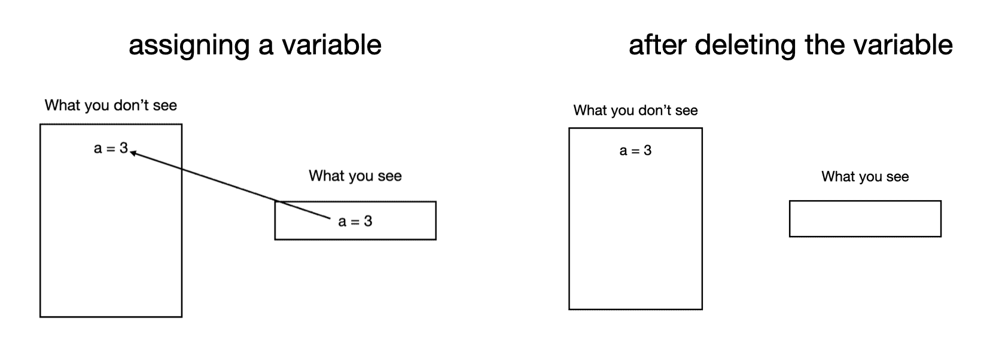

# 生产中该不该用 Jupyter 笔记本？

> 原文：<https://web.archive.org/web/https://neptune.ai/blog/should-you-use-jupyter-notebooks-in-production>

在过去的几年里，笔记本电脑已经成为数据科学和机器学习、科学研究、基因组学等领域的流行工具。

Jupyter 笔记本已经存在很长时间了。它们在机器学习中被大量使用，主要用于实验和可视化。然而，最近笔记本电脑在生产环境方面取得了进展。

在本文中，我们将讨论 Jupyter 笔记本电脑以及笔记本电脑在生产环境中的使用。

## 生产是什么意思？

“生产”对不同的人有不同的含义。对我们来说，它意味着一些最终用户正在使用或消费的代码。许多组织在生产中使用笔记本电脑，特别是当他们想要与其他人或非技术用户共享笔记本电脑的功能时。

通常，我们在生产中会看到两种类型的笔记本电脑:

*   静态报告笔记本
*   瞧，应用

**静态报告**笔记本是在[造纸厂](https://web.archive.org/web/20220928193533/https://papermill.readthedocs.io/en/latest/)的帮助下制作的。这是一个以编程方式参数化和执行笔记本的工具。此外，它将笔记本转换为数据工作流工具，线性执行每个单元，而不必打开笔记本界面。它为每次执行生成一份报告，并收集所有笔记本的指标。

通过自动化笔记本执行过程，使用 Jupyter 笔记本作为模板来生成报告变得更加容易。

瞧，这是一个开源的成熟的 Python 仪表盘框架。用户可以将他们的笔记本电脑转换成一个独立的交互式 web 仪表板应用程序。在 Voila 的帮助下，您可以将您的工作作为 web 应用程序进行共享，并将其部署在任何云服务上，这样人们就可以看到并使用仪表板。

生产笔记本也意味着以某种自动化的方式运行笔记本。它们不再是快速迭代或试验的便笺本。您使用这些工具将一些库与一些数据结合在一起，并将其与文本和 markdown 一起呈现，以获得一些最终结果或报告。

## 生产的需要

笔记本电脑一直是原型开发的好帮手，但近年来，我们已经看到了不同的业务问题和技术挑战。一个突出的挑战是生产分析和实验的需求，另一个挑战是云的快速采用。

多年来，对生产和创建数据产品的需求不断增长。

Jupyter 笔记本是用来做原型和探索的，而不是用来生产的。但是这些年来，生态系统已经成长了。我们现在有一套不同的工具，JupyterLab，插件，新的内核，以及许多其他的。

这些年来的变化得益于:

*   **云上的实验**–许多人开始更喜欢使用云进行大型计算和更大的数据集。
*   **开发人员工作流程**–许多机器学习团队开始采用软件工程实践，如版本控制、git-flow、容器化等等。
*   **生产分析**–如果分析代码是按照最佳实践编写的，那么它应该很容易在生产中重用。

## 在生产中使用笔记本电脑的利与弊

**优点**

*   您可以使用 voilà制作独立的应用程序和仪表盘，并为最终用户提供服务。
*   Jupyter 笔记本可以被安排为云上的作业。
*   你可以制作*模板化的*笔记本，并通过造纸厂执行它们。

**缺点**

*   没有正确的代码版本。
*   由于依赖于状态的执行，再现性可能是一个问题。
*   单元测试很难。
*   依赖关系管理不正确。
*   缓存是一个问题。
*   没有 CI/CD。

缺点并不是一个巨大的限制，因为有许多方法来处理它们。让我们来谈谈所有这些问题及其解决方案。

## 生产中的笔记本电脑问题

朱庇特对降价很在行。它使用 [base64](https://web.archive.org/web/20220928193533/https://en.wikipedia.org/wiki/Base64) 进行图像序列化，我们可以使用它的功能，比如代码执行，所有这些都通过一个 web 界面完成。

但是它也有自己的问题:

*   版本控制和文件大小
*   模块化和代码重用
*   隐藏状态
*   测试/调试

### 版本控制和文件大小

Jupyter 笔记本，扩展名为。包含 Python 代码的 ipynb 不是 Python 文件。它们基本上是大型 JSON 对象。它们不太适合类似 Git 的工作流。如果我们在变更后提交笔记本，差异会变得很大，很难检查它们或者合并到主分支中。这使得在团队中使用它们具有挑战性。

如果笔记本包括图像和大量的绘图，那么文件大小会大大增加。

**解决方案:**

*   这是一个帮助生成不同笔记本视图的工具。
*   它从笔记本中提取输出，这可以帮助我们更容易地进行解析和比较。

### 模块化和代码重用

模块化是创建健壮应用程序的最重要的概念之一。

代码模块化很重要。但是对于笔记本来说，我们将大部分代码放入单元格中。在 Python 中重用代码的好方法是通过函数和类。此外，笔记本不允许适当的包装。

**解决方案:**

我们可以用[不重复自己(干)](https://web.archive.org/web/20220928193533/https://en.wikipedia.org/wiki/Don%27t_repeat_yourself)的原则。你应该尽可能地概括和巩固你的代码。例如，函数应该只有一个任务，抽象你的逻辑而不过度工程化。但是，您应该注意创建太多的模块。

### 隐藏状态

Jupyter 笔记本是一个用于编写和试验代码的界面。但是朱庇特有一个弱点。你看到的并不总是你得到的。

很多人说笔记本有利于再现性。当你从头到尾以线性顺序运行代码时，这是正确的。但是我们也可以以非线性的顺序运行细胞。

Jupyter 按照您执行代码的顺序运行代码。它会记住任务，不管它们是否还在。下图说明了这一点。

左边的小方框代表隐藏状态。这是您已经执行的代码。在下一帧中，我们删除了变量，但它仍然加载在内存中。这可能会导致非常奇怪的情况。

*Jupyter notebooks: What you see is not always what you get*

**解决方案:**

*   如果您的代码行为异常，最好的第一步是重启内核。
*   用模块化和线性顺序编写代码，这对生产很有好处。

### 测试/调试

笔记本很难调试和测试，即使它们是线性的。那是因为两个原因。首先，当你在做一个项目，笔记本变得足够大时，有太多的东西需要跟踪(变量、函数等)，很难弄清楚执行流程。

第二个原因是很难进行单元测试，因为我们不能直接将笔记本中定义的功能导入测试模块。有很多方法可以做到，但并不简单。

**解决方案:**

*   testbook–一个单元测试框架，它将帮助我们测试笔记本内部的代码。
*   [nbval](https://web.archive.org/web/20220928193533/https://github.com/computationalmodelling/nbval) ，[pytest-notebook](https://web.archive.org/web/20220928193533/https://pytest-notebook.readthedocs.io/en/latest/)–nbval 是一个非常棒的可复制笔记本库。它将笔记本电脑存储的输出与笔记本电脑生成的输出进行比较。

对于生产笔记本电脑，我们希望鼓励最佳实践，并希望避免本节中提到的许多陷阱和反模式。

## 在生产中拥抱笔记本电脑

当你只是在玩和做实验的时候，笔记本是不错的选择。但是，一旦你需要分享你的代码或在生产中部署机器学习系统，笔记本电脑就变得非常具有挑战性。

我们想要一款可测试、可部署、可扩展的生产笔记本。

还有，这些笔记本都是线性执行的笔记本。当我们以自动化方式运行笔记本电脑时，我们是从上到下执行一次。

在进入生产流程之前，以下是需要考虑的事项。

**数据:你是怎么得到数据的？**

*   你从哪里得到数据？你使用的是实时数据还是摘录数据？还是连接到数据库并获取数据？或者从 S3 桶或其他数据存储中提取？
*   数据集是已经准备好了，还是需要准备？

代码:你的代码是如何组织的？

*   就如何组织代码而言，有很多选择。比如你是把东西记在笔记本里还是导出到标准的 Python 脚本里？
*   你把你的代码分成模块还是包？或者你只是把它放在一个地方。
*   你是把 Python 叫做 Jupyter 内核，还是把它转换成标准的 Python 脚本？
*   你所有的代码都在一个文件里吗？你在使用不同的功能吗？班级？你在做包装吗？

代码在哪里运行？

*   它是运行在你的个人笔记本电脑上还是服务器上？你会在笔记本上部署 Lambda 这样的服务吗？
*   你是如何处理你的代码依赖的？你在创造环境吗？使用 Docker 容器？

这些事情很重要。例如，仅仅因为你可以在你的笔记本电脑上运行一些东西并不意味着你应该这样做。你应该总是考虑长远，为可持续性做计划。

此外，如果你更多的是在软件开发方面，考虑容器化，或者仅仅是处理你不同的环境和依赖，这是进入生产的一大步。

输出:你的输出去了哪里？

*   一旦你运行完你的代码，输出到哪里去了？你想记在笔记本里吗？可以在笔记本里吗？还是要将其导出到不同的文件中？也许你想把它导出到不同的系统？
*   您如何做出这一决定实际上会影响您的产品代码的工作流。

## 建议的生产流程

这里有一些模式的建议，它们可能会根据您的需求而有所不同。

### 数据准备

首先要考虑的是你如何处理你的数据准备工作。您可以用 Python 或您选择的任何其他语言做大量的数据准备，但是当您处理数据库或任何其他数据库中的大量数据时，以原始形式提取所有数据是没有意义的。相反，您可以在生产周期的开始运行 ETL 步骤，最终在数据库端完成繁重的工作。或者，您甚至可以使用完全独立的管道来检索数据。

### 版本控制和 CI

你可能还想考虑一下[版本控制](/web/20220928193533/https://neptune.ai/blog/version-control-guide-for-machine-learning-researchers)和[持续集成](/web/20220928193533/https://neptune.ai/blog/continuous-integration-and-continuous-deployment-in-machine-learning-projects)。因为我们看到的是生产中的批处理工作流，其中有一些数据，你对这些数据做些什么，然后就有了结果。然后也许你会重复这个过程。这是一个非常简单的过程，你在生产中构建的很多东西远没有那么简单。尤其是当你考虑构建 API 或者提供流媒体服务的时候。在这种情况下，您必须拆分可交付成果。假设您正在训练一个模型，并且您想要按需进行预测。事情变得有点棘手了。您可能需要非常频繁地投入到开发和生产中。

通常在开发和生产之间划分工作并不容易。你可能需要在他们两个之间来来回回。像 Jenkins 或 Travis 这样的工具有助于这些过程。那么开始在代码中构建测试就变得非常重要了。这些是生产流程的一些关键部分。

### 容器和环境

当你进入生产阶段时，容器和环境也变得非常重要。假设您正在从命令行运行该脚本，但是您可能希望首先将其打包成 docker 容器，或者定义一个 anaconda 环境。只要确保生产工作流将具有所有相同的依赖关系，并且它将在未来更加可靠地运行，特别是如果这是您将长期使用的东西。

如果您计划自动化，您可能希望将您的依赖项与您的脚本打包在一起。

### 服务和部署

您可以采用不同的方式来部署笔记本电脑。如果你要为 API 构建东西或者在 AWS lambda 这样的无服务器架构上运行它们，它们有自己的一套需求。这意味着当你进入生产过程时，你需要考虑更多的复杂性。

那么，你如何做出这些选择呢？

### 选择生产流程时需要考虑什么

1.  可靠性:Jupyter 笔记本比几年前更加稳定。尽管如此，如果您没有在生产中正确设置笔记本电脑，它还是会破坏您的代码。例如，如果您没有为每个项目单独启动笔记本服务器，这可能会中断代码的工作流。
2.  **可访问性**:有许多应用程序和工具可以轻松共享笔记本。但是，在将输出或结果导出到文本文件、数据库、电子表格或保存的图像方面，仍然有更多的灵活性。
3.  可重用性:各种各样的包和模块让我们的生活变得更加简单。复制粘贴的代码很难复制，也很难维护。
4.  可解释性:笔记本使得将文档和结果放在代码旁边变得更加容易。它可以很容易地帮助我们，如果我们在未来看它，我们将知道代码做什么，这对生产是有价值的。
5.  **灵活性**:你几乎可以用它们完成大部分数据科学工作，但它们并不是每项工作的最佳工具。
6.  **敏捷**:我们都喜欢笔记本电脑，因为它们让数据科学变得更简单、更快速。将新产品快速投入生产通常是一件大事。

## 笔记本电脑在生产中的未来

*   **笔记本成为应用:**笔记本越来越成为应用。笔记本才是重点，它不仅仅是你获得你正在构建的任何产品的途径。相反，笔记本可能就是产品本身。随着笔记本电脑从开发环境发展到可共享的应用程序，它们本身也成为了最终产品。
*   **数据科学平台:**有很多数据科学平台，比如 Anaconda。他们将笔记本电脑作为其工具包的优先选择，帮助并简化部署。
*   **容器的兴起:**容器继续扩大其在数据科学生态系统中的地位，因此笔记本电脑正在成为生产部署的更实用工具，即使对于 Lambda 这样的无服务器架构也是如此。
*   **新的 Jupyter 功能:** JupyterLab 进一步模糊了生产应用和许多开发工具之间的界限——例如，用扩展代替传统的模块和包。

## 最后的想法

笔记本在生产中的使用一直是一个有争议的话题。许多人认为 Jupyter 笔记本只是用于实验和原型制作，并认为这是不可否认的事实，但我不完全同意他们的观点。

笔记本是处理数据的绝佳工具，尤其是在利用 papermill、airflow 或 nbdev 等开源工具时。Jupyter 允许我们在生产系统中可靠地执行笔记本。

**参考文献**

### 普拉巴特·库马尔·萨胡

机器学习工程师

* * *

**阅读下一篇**

## ML 元数据存储:它是什么，为什么重要，以及如何实现它

13 分钟阅读|作者 Jakub Czakon |年 8 月 13 日更新

大多数找到这个页面的人都想改进他们的建模过程。

但是他们在存储和管理 ML 模型元数据方面的问题是不同的。

对一些人来说，问题在于杂乱的实验。

其他人已经将第一批模型部署到生产中，但是他们不知道这些模型是如何创建的，也不知道使用了哪些数据。

有些人已经在生产中有了许多模型，但是编排模型 A/B 测试，切换挑战者和冠军，或者触发、测试和监控再培训管道并不是很好。

如果你认为自己属于这些群体中的一员，或者介于两者之间，我可以告诉你，ML 元数据存储可以帮助你完成所有这些事情，甚至更多。

您可能需要将其连接到其他 [MLOps 工具](/web/20220928193533/https://neptune.ai/blog/best-mlops-tools)或您的 CI/CD 管道，但它将简化大多数工作流程中的模型管理。

…但是[实验跟踪](/web/20220928193533/https://neptune.ai/experiment-tracking)、模型注册、模型存储、模型目录和其他与模型相关的动物也是如此。

那么 ML 元数据存储到底是什么，它与其他模型有什么不同，它如何帮助您更自信地构建和部署模型？

这就是这篇文章的内容。

另外，如果你是那种喜欢摆弄东西来看看它们是什么的人，你可以在 Neptune ML 元数据存储库中查看这个[示例项目。](https://web.archive.org/web/20220928193533/https://app.neptune.ai/common/example-project-tensorflow-keras/e/TFKERAS-14/dashboard/summary-6f234f52-6b77-476a-9486-63037655b3be)

但是首先…

## 元数据管理和什么是 ML 元数据？

在我们深入 ML 元数据存储之前，我可能应该告诉你我所说的“机器学习元数据”是什么意思。

当你做机器学习时，总会涉及到一个模型。这就是机器学习。

它可能是一个经典的监督模型，如 lightGBM 分类器、强化学习代理、贝叶斯优化算法或其他任何东西。

但它需要一些数据，通过一些数字运行，并输出一个决定。

…将它投入生产需要大量的工作。

[Continue reading ->](/web/20220928193533/https://neptune.ai/blog/ml-metadata-store)

* * *