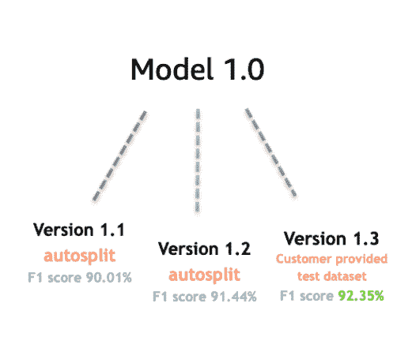
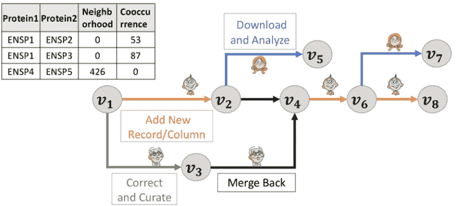
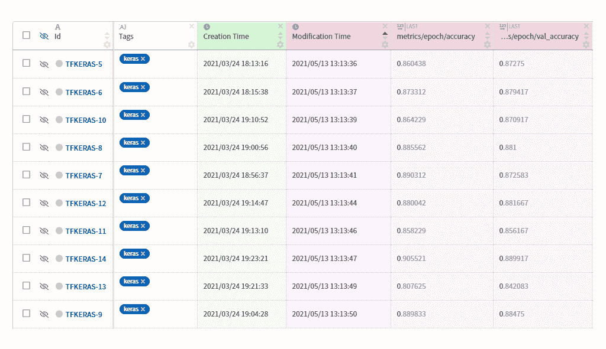
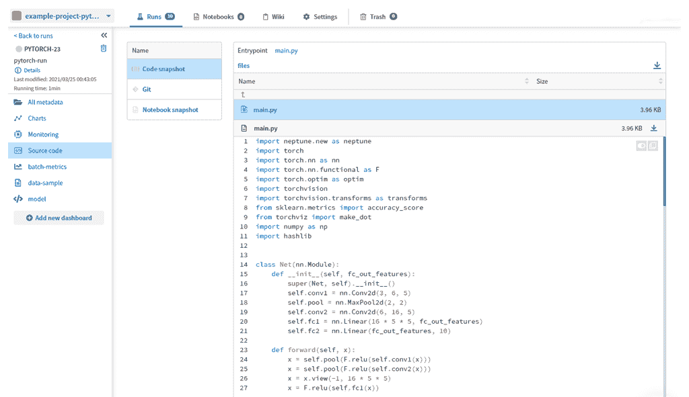
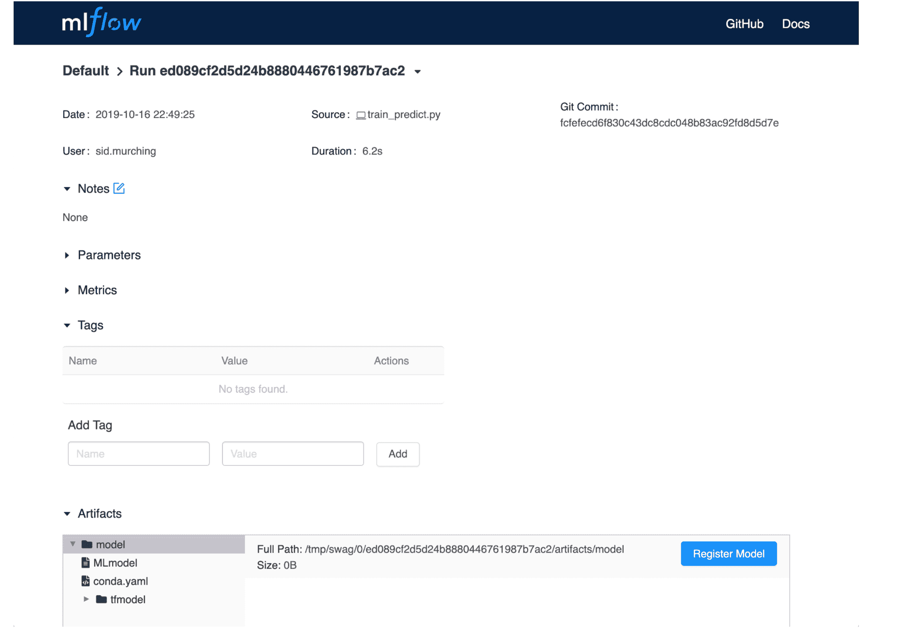
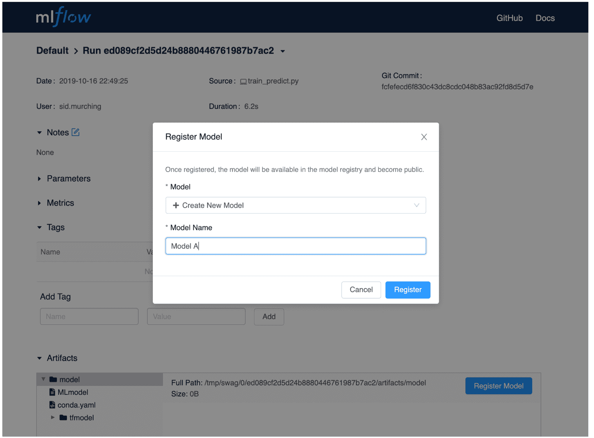
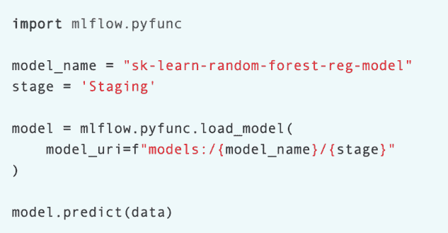
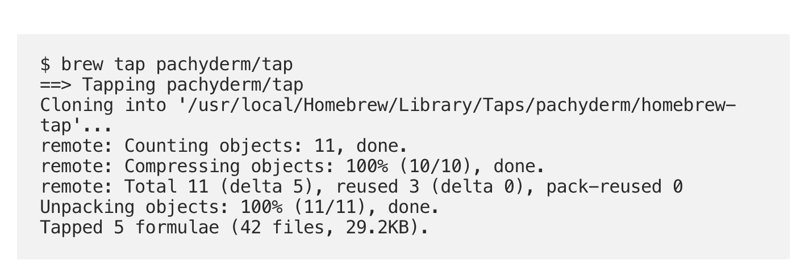
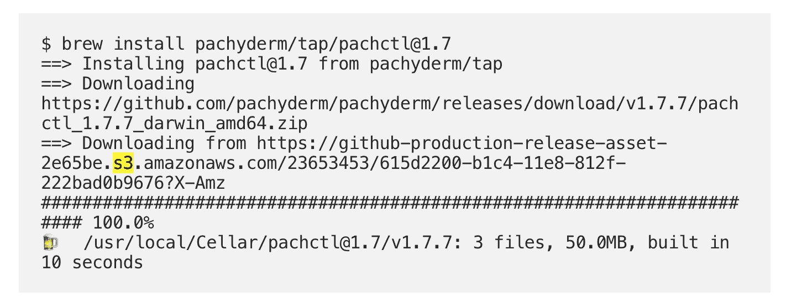
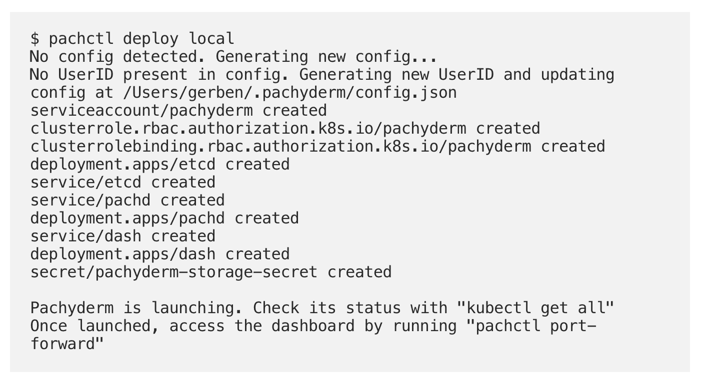

# 适用于您的 ML 工作流的顶级模型版本管理工具

> 原文：<https://web.archive.org/web/https://neptune.ai/blog/top-model-versioning-tools>

最近，机器学习由于其能够指导企业做出精确和准确的决策而变得越来越重要。在引擎盖下，机器学习是一个迭代和重复的过程。完成一系列训练工作以优化模型的预测性能。

如果没有正确的方法，很容易失去对训练数据集、超参数、评估指标和模型工件的实验跟踪。当你需要重现一个实验时，从长远来看这可能是有问题的。

在本文中，我将讨论我的**6 大模型版本化工具，它们可以极大地改进您的工作流**。具体来说，本文的大纲如下:

1.  什么是模型版本控制，为什么它如此重要？
2.  模型版本控制与数据版本控制
3.  什么工具可以用于模型版本控制
4.  这些工具之间的比较如何？

## 什么是模型版本控制，为什么它如此重要？

模型版本化在某种程度上涉及到跟踪对先前构建的 ML 模型所做的变更。换句话说，它是对 ML 模型的配置进行更改的**过程**。从另一个角度来看，我们可以将模型版本化视为一个**特性**，它可以帮助机器学习工程师、数据科学家和相关人员创建并保留同一个模型的多个版本。

可以把它看作是记录您通过调整超参数、用更多数据重新训练模型等对模型所做的更改的一种方式。

在模型版本化中，许多东西需要被版本化，以帮助我们跟踪重要的变更。我将在下面列出并解释它们:

1.  **实现代码:**从模型构建的早期到优化阶段，代码或者在这种情况下模型的源代码起着重要的作用。这些代码在优化阶段经历了重大的变化，如果跟踪不当，这些变化很容易丢失。因此，代码是模型版本化过程中要考虑的事情之一。
2.  **数据:**在某些情况下，在模型优化阶段，训练数据确实比其初始状态有显著改善。这可能是从现有特征中设计新特征来训练我们的模型的结果。还有元数据(关于你的训练数据和模型的数据)需要考虑版本化。元数据可以在不同的时间发生变化，而定型数据实际上不会发生变化。我们需要能够通过版本控制来跟踪这些变化
3.  **模型:**模型是前两个实体的产品，如其解释中所述，ML 模型通过超参数设置、模型工件和学习系数在优化阶段的不同点发生变化。版本控制有助于记录机器学习模型的不同版本。

现在，我们已经定义了模型版本化和需要版本化的实体。但概念有什么好大惊小怪的？它如何帮助我们改进预测模型？

### 模型版本化的优势

*   模型版本控制帮助我们跟踪实现代码和我们构建的模型，因此我们可以正确地跟踪开发周期(在项目协作时非常重要)。
*   模型版本可以有相应的开发代码和性能描述(带有评估指标)。我们可以知道提高或降低模型性能的依赖关系。
*   模型版本化简化了模型开发的过程，有助于人工智能的责任性(最近这个领域的许多公司试图填补这个空白)，治理和责任性。这对于自动驾驶汽车、人工智能驱动的健康应用或股票交易应用中使用的基于神经网络的模型尤为重要。

### 模型版本控制与数据版本控制

在某些情况下，模型和数据版本之间的差异非常明显。在其他时候，数据从业者可能会对这些区别感到困惑，并在某种程度上互换使用这些术语。

如上所述，模型版本化指的是跟踪变更，在某些情况下，是对模型的改进。这些变化可能由于优化工作、训练数据的变化等而发生。有关模型版本化的图示，请参见下图。在此图中，我们看到不同的车型版本有不同的 F1_scores。ML 工程师或数据科学家必须试验不同的超参数来改进度量。

*Pictorial illustration of model versioning | [Source](https://web.archive.org/web/20221123113221/https://docs.aws.amazon.com/comprehend/latest/dg/model-versioning.html)*

另一方面，数据版本化涉及跟踪更改，但这次是对数据集的更改。由于特征工程工作、季节性等因素，您处理的数据往往会随时间而变化。发生这种情况的一个例子是当原始数据集被重新处理、校正或者甚至追加到附加数据时。所以，追踪这些变化是很重要的。更好的解释见下图

*Pictorial illustration of data versioning | [Source](https://web.archive.org/web/20221123113221/https://medium.com/data-people/painless-data-versioning-for-collaborative-data-science-90cf3a2e279d)*

在上图中，我们可以看到数据是如何变化的。这些变化中的每一个都会产生一个新版本的数据，这个数据必须被存储。

**要点:**模型版本化是 MLOps 的一个重要方面，它涉及到对您的模型进行变更并跟踪变更。实现代码、训练数据和模型是在版本化过程中应该考虑的实体。最后，模型版本化不同于数据版本化，它们意味着完全不同的东西。

在这里，我将讨论六种不同的模型版本化工具，概述入门步骤和它们不同的功能。

Neptune AI 是一个 [MLOps 工具](/web/20221123113221/https://neptune.ai/blog/best-mlops-tools)，允许你跟踪和比较模型版本。它主要是为 ML 和数据科学团队运行和跟踪实验而构建的。该平台允许您存储、版本化、查询和组织模型及相关元数据。具体来说，您可以存储和版本化诸如您的训练数据、代码、环境配置版本、参数、超参数和评估度量、测试集预测等。

下面是 Neptune 的模型注册界面的截图，你可以在这里存储关于你的模型的元数据。

*Neptune’s model registry UI | [Source](/web/20221123113221/https://neptune.ai/product/model-registry)*

除了模型注册表和元数据存储之外，Neptune AI 还有一个易于使用的接口，用于比较您的模型的性能。在下图中，我们可以看到不同的 Keras 模型在训练和验证准确性方面的比较，以及创建和修改所花费的时间。

*Neptune’s comparison UI | [Source](/web/20221123113221/https://neptune.ai/product/model-registry)*

使用 Neptune AI 进行模型版本控制的一个额外优势是能够重新运行训练作业。Neptune AI 允许您通过重新运行您的实现代码来重新运行过去的培训工作(这是您应该版本化的事情的一部分)。下面的图片解释了这是如何实现的:

*Neptune’s code versioning UI | [Source](/web/20221123113221/https://neptune.ai/product/model-registry)*

**关键要点:** Neptune AI 作为一个 MLOps 工具，允许您试验超参数&根据评估指标比较模型版本，存储模型工件和元数据，训练数据的版本和实现代码。Neptune AI 具有能够重新运行训练作业的额外优势(因为期望的实现代码已经被版本化)。

ModelDB 是一个开源的 MLOps 工具，它允许您对实现代码、数据和模型工件进行版本化。它允许您管理在不同编程语言(python、C、Java 等)的本地环境和配置中构建的模型和管道。通过您的 IDE 或开发环境，使用 ModelDB 进行模型版本控制很容易。

使用 Model DB 的第一步是确保它在 docker 中运行。通过将存储库克隆到您的本地并运行以下命令，您可以很容易地做到这一点:

*Clone Model DB repository | [Source](https://web.archive.org/web/20221123113221/https://medium.com/hashmapinc/managing-ml-training-models-using-modeldb-e3c008b6385f)*

在此之后，您需要做的就是实例化或设置一个 modelDB 项目，使用:

*ModelDB project setup | [Source](https://web.archive.org/web/20221123113221/https://medium.com/hashmapinc/managing-ml-training-models-using-modeldb-e3c008b6385f) *

将您的培训数据版本化:

*Training data versioning | [Source](https://web.archive.org/web/20221123113221/https://medium.com/hashmapinc/managing-ml-training-models-using-modeldb-e3c008b6385f) *

之后，您可以运行实验并存储度量、模型工件、超参数，并访问 web 界面来查看您已经版本化的项目。以下是网络用户界面的快照:

**要点:** ModelDB 是一个开源的 ML 工具(标志着更多的支持和高质量的软件),它允许你版本化实现代码、数据集和模型版本。它是语言无关的，允许您在它们的本地环境中使用各种编程语言。

DVC，也称为数据版本控制，是一个开源的 MLOps 工具，允许你做版本控制，无论选择什么编程语言。有了类似 git 的体验，DVC 允许你以一种简单、快速和有效的方式对你的训练集、模型工件和元数据进行版本化。通过连接 Amazon s3、Google Drive、Google 云存储等，在 DVC 存储大文件是可能的。

DVC 的部分特性和功能包括通过命令列出所有模型版本分支及其相关指标值的指标跟踪，相关步骤的 ML 管道框架，语言无关的框架(无论您的实现代码是什么语言，您仍然可以使用它)，跟踪故障的能力等等。

在使用 DVC 时，第一步是确保它已安装。您可以通过执行以下操作来实现这一点:

下一步是准备好您的实现代码，用 [venv](https://web.archive.org/web/20221123113221/https://python.readthedocs.io/en/stable/library/venv.html) 模块创建一个虚拟环境，安装依赖项和需求，然后开始训练您的模型。在你的模型被训练之后，你现在能版本。对于 DVC 来说，版本化就像使用 DVC 的 add git 命令来版本化你的数据、模型和相关的东西一样简单。以下是显示如何使用该命令的示例代码:

**关键要点:** DVC 在 ML 模型版本化方面提供了类似 git 的体验。有了这个工具，您就能够跟踪评估指标，为必要的预处理和训练步骤开发一个管道/框架，并能够跟踪故障。

 ️检查 [DVC 和海王星](/web/20221123113221/https://neptune.ai/vs/dvc)的对比

MLFlow 是一个开源项目，允许机器学习工程师管理 ML 生命周期。像其他平台一样，MLFlow 允许您对数据和模型进行版本化，重新打包代码以进行可重复运行。该平台与许多 ML 库和工具集成良好，如 TensorFlow、Pytorch、XGBoost 以及 Apache Spark。

MLFlow 提供了四种不同的功能。其中包括:

1.  **MLFlow 跟踪:**通过记录参数、度量、代码版本和输出文件来跟踪实验。通过 Python，JAVA APIs 等进行日志和查询实验。
2.  **MLFlow 项目:**遵循编码约定，以可重现的方式组织实现代码。有了这个，你可以重新运行你的代码。
3.  **MLFlow 模型:**以标准化的方式封装 ML 模型。这样，您的模型就可以通过 REST API 使用或交互。使用 Apache spark 也可以进行批量预测
4.  **模型注册:**在这里，您可以对您的模型进行版本化，并拥有一个描述模型开发生命周期的模型谱系。

使用 MLFlow 对模型进行版本控制非常容易。对此的要求是，你已经注册了模型的第一个版本。有关相关的用户界面，请参见下文

*MLflow data versioning | [Source](https://web.archive.org/web/20221123113221/https://mlflow.org/docs/latest/model-registry.html)*

在这里，您可以注册模型的名称，并上传相关的元数据和模型如何工作的文档。注册一个模型版本同样简单，并且可以在同一个页面上完成。当您单击 Register model 时，您可以通过下拉菜单指出您的新版本所属的型号。更多解释见下面的用户界面

*MLflow model name registration | [Source ](https://web.archive.org/web/20221123113221/https://mlflow.org/docs/latest/model-registry.html)*

通过有限的几行代码就可以获取您之前版本化的模型。请参见下面的示例:

*MLflow fetching a model | [Source](https://web.archive.org/web/20221123113221/https://mlflow.org/docs/latest/model-registry.html)*

**要点:** MLFlow 是用于模型版本控制的顶级 MLOps 工具之一。使用 ML Flow，您能够以可重现的方式记录实验和组织实现代码，并通过模型版本注册开发模型谱系(模型开发历史)

 ️查一个深度对比: [MLflow vs 海王星](/web/20221123113221/https://neptune.ai/vs/mlflow)

Pachyderm 是一个数据和模型版本化平台，可以帮助数据科学家和机器学习工程师以有序的方式存储不同版本的训练数据，为您提供数据经历不同变化的可追溯性。该工具在 ML 工作流中的四个检查点上工作:数据准备、实验(用不同版本的数据训练您的模型，设置不同的超参数，并确定合适的指标)、训练和部署到生产中。

使用 Pachyderm 进行数据准备基本上包括从数据源摄取、处理和转换、模型训练和服务。使用 pachyderm，您可以将所有数据放在一个位置，组织数据的更新版本，运行数据转换作业(要求它在 docker 中运行)并保留数据的版本。

Pachyderm 运行在 Kubernetes 集群之上，在 Amazon s3 上存储数据和工件。安装和初始化 Pachyderm 从一些需要满足的依赖/需求开始。第一个是添加家酿 tap，允许您接入不同的存储库。您可以在您的终端中使用以下代码行来实现这一点:

*Pachyderm installation | [Source](https://web.archive.org/web/20221123113221/https://medium.com/bigdatarepublic/pachyderm-for-data-scientists-d1d1dff3a2fa)*

之后，在本地安装组件并在 Kubernetes 集群上部署 pachyderm:

*Pachyderm installation | [Source](https://web.archive.org/web/20221123113221/https://medium.com/bigdatarepublic/pachyderm-for-data-scientists-d1d1dff3a2fa)*

*Pachyderm installation | [Source](https://web.archive.org/web/20221123113221/https://medium.com/bigdatarepublic/pachyderm-for-data-scientists-d1d1dff3a2fa)*

您可以使用以下代码行在 Pachyderm 中创建存储库来存储代码和模型工件: **pachctl create-repo iris** 。将文件提交到这个存储库中非常简单:**pach CTL put-file iris master/raw/iris _ 1 . CSV-f data/raw/iris _ 1 . CSV**

**要点:** Pachyderm 允许您有序地存储不同版本的训练数据和模型。您还可以在 Amazon s3 上运行实验和存储工件。

Polyaxon 是一个为可扩展和可复制的功能提供机器学习包和算法的平台。Polyaxon 号称运行所有机器学习和深度学习库，如 Tensorflow、Scikit Learn 等，让你可以高效地将想法推向生产。关于模型版本化，Polyaxon 提供了实验、模型注册和管理以及自动化功能。使用 Polyaxon 进行模型版本控制的第一步是安装。这可以通过下面这行代码实现: **$ pip install -U polyaxon** 。

使用 Polyaxon 进行实验，您可以预处理训练数据并训练您的模型，运行性能分析以可视化指标和性能，运行笔记本电脑和 tensorboards。通过一个易于使用的界面，Polyaxon 允许您可视化评估和性能指标，如下所示:

*Polyaxon’s visualizations UI | [Source](https://web.archive.org/web/20221123113221/https://polyaxon.com/docs/experimentation/visualizations/)*

**要点:** Polyaxon 是你应该拥有的 MLOps 工具之一。它能够运行主要的 ML 库和包，如 Tensorflow、scikit learn。您还可以跟踪和可视化评估指标。

 ️这里有一个详细的比较[多轴和海王星](/web/20221123113221/https://neptune.ai/vs/polyaxon)

在本节中，我将概述在为您寻找合适的 MLOps 工具时需要注意的一些特征和功能。

清单上的第一项是定价。Neptune AI、Pachyderm 和 Polyaxon 有特殊的定价计划。虽然相对便宜，但无法与提供免费服务的 MLflow、ModelDB 和 DVC 相比。这些工具都是开源的，但是它们确实有间接的成本，比如自己安装和维护。所以，在选择工具的时候，你要决定哪个选项更适合你。

另一件要注意的事情是比较功能:比较不同模型版本的评估指标的能力。上面列出的所有工具都提供了这一点。然而，Pachyderm 更进一步，让用户能够比较模型管道，并看到不同的变化。

你也可以检查哪种版本控制系统最适合你。

请参见下表，该表解释了这些模型版本化工具之间的相互比较。

| 能力 | 海王星 AI | ModelDB | DVC | MLFlow | 迟钝的人 | 多轴 |
| --- | --- | --- | --- | --- | --- | --- |
|  | 

免费/付费
依赖
于[计划](https://web.archive.org/web/20221123113221/https://www.g2.com/products/neptune-ai/pricing)

 |  |  |  |  |  |
| 

**版本类型**
**控制系统**

 |  |  |  |  |  |  |
|  | 

托管
云服务
(不开源)

 |  |  |  |  |  |
| 

**支持大型**
**文件和构件**

 |  |  |  |  |  |  |
| 

**模型注册表**
**&可重现**
**实验**

 |  |  |  |  |  |  |
| 

**对比评价**
**指标&型号**
**性能**

 |  |  |  |  |  |  |
|  |  |  |  |  |  |  |

*模型版本化工具对比|来源:作者*

## 如果不做模型版本控制，会出什么问题？

模型版本化是 [MLOps 过程](/web/20221123113221/https://neptune.ai/blog/mlops)的重要部分。之前我们谈到了模型版本化的重要性。在这里，我们将看看没有对您的 ML 模型进行版本控制的后果，真正可能出错的是什么:

1.  **错误的实现代码:**实现代码是模型版本化过程中要版本化的实体的一部分。如果没有模型版本控制，或者在这种情况下没有实现代码的版本控制，就会有丢失有价值的实现代码的倾向。这样做的一个主要缺点是不能重复实验。
2.  **将半生不熟的模型推向生产:**不管喜欢与否，模型版本化是 ML 过程中从模型构建到生产的中间环节。当我们对模型进行版本化时，在某种程度上，我们准备好了我们的思想，根据它们的表现来比较它们，以确定哪一个表现最好。如果没有版本控制，我们就有将弱模型推向生产的风险。这对企业或客户来说可能是昂贵的。

## 结论

模型版本化是 MLOps 工作流的一个重要方面。它允许您保留和组织关于您的模型的重要元数据，鼓励使用不同版本的训练数据和超参数进行实验，并在某种程度上为您指出具有正确指标的模型，以解决您的业务挑战。

使用我上面解释的工具，模型版本控制变得可能和容易。这些工具提供了一系列功能，包括再现实验、模型监控和跟踪。您可以尝试这些工具中的每一个，找到适合您的工具，或者通过上表做出您的选择。

### 参考