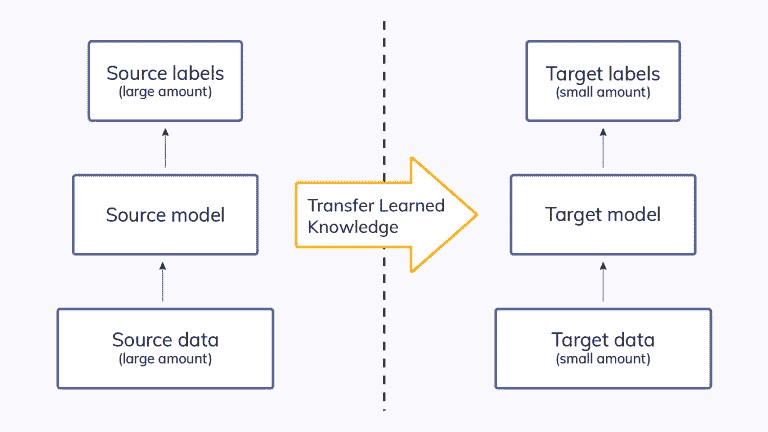

# 迁移学习指南:带有 Keras 中图像和文本示例的实用教程

> 原文：<https://web.archive.org/web/https://neptune.ai/blog/transfer-learning-guide-examples-for-images-and-text-in-keras>

在大型数据集上训练一个神经网络可能需要数周时间。幸运的是，由于预训练模型的模型权重，这个时间可以缩短——换句话说，应用**迁移学习**。

[迁移学习](https://web.archive.org/web/20230131180149/https://machinelearningmastery.com/transfer-learning-for-deep-learning/)是一种在图像分类任务和自然语言处理任务中起作用的技术。在本文中，您将深入了解:

*   什么是迁移学习，
*   如何实现迁移学习(在 Keras 中)，
*   图像分类的迁移学习，
*   自然语言处理中的迁移学习

那么，让我们开始学习吧！(无意双关…好吧，可能有一点)

## 什么是迁移学习？

[迁移学习是利用预训练模型的特征表示](https://web.archive.org/web/20230131180149/https://towardsdatascience.com/transfer-learning-from-pre-trained-models-f2393f124751)，因此您不必从头开始训练新模型。

预训练模型通常在大规模数据集上训练，这些数据集是计算机视觉前沿的标准基准。从模型中获得的权重可以在其他计算机视觉任务中重复使用。

这些模型可以直接用于对新任务进行预测，或者集成到训练新模型的过程中。将预先训练的模型包括在新模型中导致更少的训练时间和更低的泛化误差。

当你有一个小的训练数据集时，迁移学习特别有用。在这种情况下，例如，您可以使用预训练模型的权重来初始化新模型的权重。后面你会看到，迁移学习也可以应用到自然语言处理问题上。



*The idea of transfer learning*

预训练模型的优势在于它们足够通用，可用于其他真实世界的应用程序。例如:

*   **在 ImageNet 上训练的模型**可以用于现实世界的图像分类问题。这是因为数据集包含 1000 多个类。假设你是一名昆虫研究者。你可以使用这些模型，并对它们进行微调来对昆虫进行分类。
*   对文本进行分类需要了解一些向量空间中的单词表示。你可以自己训练矢量表示。这里的挑战是，您可能没有足够的数据来训练嵌入。此外，培训需要很长时间。在这种情况下，您可以使用像 GloVe 这样的预训练单词嵌入来加快您的开发过程。

稍后您将探索这些用例。

### 迁移学习和微调有什么区别？

**微调**是迁移学习的可选步骤。[微调通常会提高模型的性能](https://web.archive.org/web/20230131180149/https://www.researchgate.net/post/What-is-the-difference-between-Transfer-Learning-vs-Fine-Tuning-vs-Learning-from-scratch)。然而，由于您必须重新训练整个模型，您可能会过度适应。

过度拟合是可以避免的。只需使用**低学习率**重新训练模型或其一部分。这一点很重要，因为它可以防止对渐变进行重大更新。这些更新会导致性能下降。当模型停止改进时，使用回调来停止训练过程也是有帮助的。

### 为什么要用迁移学习？

假设您有 100 张猫和 100 只狗的图像，并且想要建立一个模型来对这些图像进行分类。如何使用这个小数据集训练一个模型？您可以从头开始训练您的模型，但它很可能会过度拟合。进入迁移学习。一般来说，你想使用迁移学习有两大原因:

*   **高精度的训练模型需要大量的数据**。例如，ImageNet 数据集包含超过 100 万张图像。在现实世界中，你不太可能有这么大的数据集。
*   假设你有那种数据集，你可能仍然**没有在如此大的数据集上训练模型**所需的资源。因此，如果你没有在大型数据集上训练模型所需的计算资源，迁移学习就很有意义。
*   即使你有可以支配的计算资源，你仍然需要等待几天或几周来训练这样一个模型。因此，使用预先训练好的模型会节省你的宝贵时间。

### 迁移学习什么时候不起作用？

当底层学习的高级特征不足以区分问题中的类别时，迁移学习将不起作用。例如，预先训练的模型可能非常擅长识别门，但不擅长识别门是关闭的还是打开的。在这种情况下，可以使用(预训练网络的)低级特征，而不是高级特征。在这种情况下，您必须重新训练模型的更多层或使用早期层中的特征。

当数据集不相似时，要素传递效果不佳。这篇[论文](https://web.archive.org/web/20230131180149/https://arxiv.org/pdf/1411.1792.pdf)更详细地调查了数据集的相似性。也就是说，如论文中所示，用预先训练的权重初始化网络比使用随机权重会产生更好的性能。

您可能会发现自己处于这样一种情况，即考虑从预先训练的模型中删除一些层。在这种情况下，迁移学习不太可能奏效。这是因为删除层会减少可训练参数的数量，从而导致过度拟合。此外，在不过度拟合的情况下确定要移除的正确层数是一个麻烦且耗时的过程。

## 如何实施迁移学习？

现在，让我们花点时间来看看如何实现迁移学习。

### 6 步迁移学习

你可以通过这六个步骤来实现迁移学习。

#### 获取预训练模型

第一步是获得您希望用于解决问题的[预训练模型](https://web.archive.org/web/20230131180149/https://keras.io/api/applications/)。预训练模型的各种来源在单独的部分中介绍。

#### 创建基础模型

通常，第一步是使用 ResNet 或 Xception 之类的架构实例化**基本模式** l。您也可以选择下载**预训练的重量**。如果您不下载权重，您将不得不使用架构从头开始训练您的模型。回想一下，基本模型在最终输出层中通常会有比您需要的更多的单元。因此，在创建基础模型时，必须移除最终输出层。稍后，您将添加与您的问题兼容的最终输出图层。

#### 冻结层，使它们在训练过程中不会改变

冻结预训练模型的层是至关重要的。这是因为您不希望这些层中的**权重被重新初始化**。如果是，那么你将会失去所有已经发生的学习。这将与从头开始训练模型没有什么不同。

```
base_model.trainable = False
```

#### 添加新的可训练层

下一步是**添加新的可训练层**，这将把旧的特征变成新数据集上的预测。这很重要，因为预训练模型是在没有最终输出层的情况下加载的。

#### 在数据集上训练新图层

请记住，预训练模型的最终输出很可能与您想要的模型输出不同。例如，在 ImageNet 数据集上训练的预训练模型将输出 1000 个类。然而，您的模型可能只有两个类。在这种情况下，您必须使用新的输出图层来训练模型。

因此，您可以随意添加一些新的密集层，但最重要的是，最终的密集层的**单位与您的模型**预期的输出数量相对应。

#### 通过微调改进模型

完成上一步后，您将拥有一个可以对数据集进行预测的模型。可选的，你可以通过微调来提高它的**性能。微调是通过解冻基础模型或其一部分，并以非常低的学习速率在整个数据集上再次训练整个模型来完成的。低学习率将提高模型在新数据集上的性能，同时防止过度拟合。**

学习率必须很低，因为模型很大，而数据集很小。这是一个过度适应的处方，因此学习率低。完成这些更改后，请重新编译模型，以便它们能够生效。这是因为每当您调用编译函数时，模型的行为就被冻结了。这意味着每当您想要改变模型的行为时，您都必须再次调用编译函数。下一步将是再次训练模型，同时通过回调来监控它，以确保它不会过度拟合。

很简单，是吧？

### 去哪里找预先训练好的模特？

现在让我们讨论一下在哪里可以找到在应用程序中使用的预训练模型。

#### Keras 预训练模型

Keras 提供了 20 多种预先训练好的模型。它们是通过 [**Keras 应用**](https://web.archive.org/web/20230131180149/https://keras.io/api/applications/) **送达的。**每个模特旁边都有预先训练好的重量。下载模型时，重量会自动下载。它们将存储在` ~/中。keras/models/`所有的 keras 应用程序都用于图像任务。例如，下面是如何初始化在 ImageNet 上训练的 MobileNet 架构。

```
model = tf.keras.applications.MobileNet(
    input_shape=None,
    alpha=1.0,
    depth_multiplier=1,
    dropout=0.001,
    include_top=True,
    weights="imagenet",
    input_tensor=None,
    pooling=None,
    classes=1000,
    classifier_activation="softmax",
)
```

#### 使用 TensorFlow Hub 进行迁移学习

值得一提的是，Keras 应用程序并不是迁移学习任务的唯一选择。也可以使用来自 [**TensorFlow Hub**](https://web.archive.org/web/20230131180149/https://www.tensorflow.org/hub) 的模型。

```
model = tf.keras.Sequential([
 hub.KerasLayer("https://tfhub.dev/google/imagenet/mobilenet_v2_100_224/feature_vector/4",
                   trainable=False),
    tf.keras.layers.Dense(num_classes, activation='softmax')
])
```

了解如何使用 [Neptune 与 TensorFlow/Keras 的集成来跟踪 Keras 模型训练](https://web.archive.org/web/20230131180149/https://docs.neptune.ai/integrations-and-supported-tools/model-training/tensorflow-keras)

#### 预训练单词嵌入

**单词嵌入**通常用于文本分类问题。因为你可以训练你的单词嵌入，使用一个预先训练好的会快得多。这里有几个单词嵌入，您可以考虑用于自然语言处理问题:

#### 拥抱脸

[**抱脸**](https://web.archive.org/web/20230131180149/https://github.com/huggingface) 提供了数千个预先训练好的模型，用于在文本上执行任务。一些受支持的功能包括:

*   问题回答
*   摘要
*   翻译和
*   文本生成，仅举几例

拥抱脸支持 100 多种语言。

这里有一个例子，你可以用拥抱脸来区分否定句和肯定句。

```
from transformers import pipeline
```

```
classifier = pipeline('sentiment-analysis')
classifier('We are very happy to include pipeline into the transformers repository.')
[{'label': 'POSITIVE', 'score': 0.9978193640708923}]
```

### 如何使用预先训练好的模型

有三种方法可以使用预训练模型:

*   **预测**，
*   **特征提取**，
*   **微调**。

#### 预言；预测；预告

在这里，你下载模型，并立即使用它来分类新的图像。下面是一个用于分类 ImageNet 类的 ResNet50 的例子。

[ImageNet](https://web.archive.org/web/20230131180149/https://en.wikipedia.org/wiki/ImageNet) 是一个广泛的图像集合，用于训练模型，包括 ResNet50。该数据集中有超过 100 万幅图像和 1000 个类。

```
from tensorflow.keras.applications.resnet50 import ResNet50
from tensorflow.keras.preprocessing import image
from tensorflow.keras.applications.resnet50 import preprocess_input, decode_predictions
import numpy as np
model = ResNet50(weights='imagenet')
img_path = 'elephant.jpg'
img = image.load_img(img_path, target_size=(224, 224))
x = image.img_to_array(img)
x = np.expand_dims(x, axis=0)
x = preprocess_input(x)
preds = model.predict(x)

print('Predicted:', decode_predictions(preds, top=3)[0])

```

#### 特征抽出

在这种情况下，最后一层之前的层的输出将作为新模型的输入。目标是使用预先训练的模型或其一部分来预处理图像并获得本质特征。

然后，您将这些特征传递给一个新的分类器——无需重新训练基础模型。预先训练的卷积神经网络已经具有对于手头的任务很重要的特征。

但是，预训练模型的最终部分不会转移，因为它特定于其数据集。因此，您必须构建模型的最后一部分来适应数据集。

在自然语言处理领域，预训练的单词嵌入可以用于**特征提取。**单词嵌入有助于将单词放置在向量空间中的正确位置。它们为模型提供相关信息，因为它们可以将单词放在句子的上下文中。单词嵌入的主要目的是语义理解和单词之间的关系。结果，这些单词嵌入对于自然语言问题是任务不可知的。

#### 微调

当你的新分类器准备好时，你可以使用**微调来提高它的精确度**。为了做到这一点，你**解冻分类器**，或者它的一部分，并且用低学习率的新数据重新训练它。如果要使基础模型(从预训练模型中获得)的要素制图表达与您的特定任务更加相关，微调至关重要。

您还可以使用预训练模型中的权重来初始化新模型中的权重。这里的最佳选择取决于你的问题，在你得到正确的答案之前，你可能需要做一些实验。

尽管如此，还是有一个标准的工作流程可以用来应用迁移学习。

我们去看看。

## 带 Keras 的图像迁移学习示例

有了这样的背景，让我们看看如何使用预先训练好的模型来解决图像和文本问题。尽管训练一个模型涉及许多步骤，但重点将放在迁移学习特有的六个步骤上。

### 图像数据的迁移学习

在这幅图中，让我们看看如何使用预训练模型来构建和**微调**图像分类器。让我们假设你是一个宠物爱好者，你想创建一个机器学习模型来对你喜欢的宠物进行分类；猫和狗。不幸的是，你没有足够的数据来做这件事。幸运的是，你熟悉 [Kaggle](https://web.archive.org/web/20230131180149/https://www.kaggle.com/c/dogs-vs-cats) ，可以得到一个小数据集。准备就绪后，您现在可以选择一个预先训练好的模型来使用。一旦你选择了你的[预训练模型](https://web.archive.org/web/20230131180149/https://keras.io/api/applications/)，你就可以开始用 Keras 训练模型了。为了说明，让我们使用在 ImageNet 数据集上训练的[异常](https://web.archive.org/web/20230131180149/https://keras.io/api/applications/xception/) [架构](https://web.archive.org/web/20230131180149/https://arxiv.org/abs/1610.02357)。

如果您正在编写代码，请一步一步地遵循本节，正确地应用迁移学习。

#### 获取数据集

我推荐使用 Google Colab，因为你可以获得免费的 GPU 计算。

首先，将数据集下载到 Colab 的虚拟机中。

```
!wget --no-check-certificate
    https://namespace.co.ke/ml/dataset.zip
    -O /content/catsdogs.zip
```

之后，解压缩数据集，并设置训练和验证集的路径。

```
import os
import zipfile
with zipfile.ZipFile('catsdogs.zip', 'r') as zip_ref:
    zip_ref.extractall('/content/cats_dogs')
base_dir = '/content/cats_dogs/dataset'
train_dir = os.path.join(base_dir, 'training_set')
validation_dir = os.path.join(base_dir, 'test_set')
```

#### 从目录中加载数据集

现在让我们从它们的位置加载图像。可以使用“image_dataset_from_directory”函数，因为它可以推断类标签。

该函数将从目录中创建一个` [tf.data.Dataset](https://web.archive.org/web/20230131180149/https://www.tensorflow.org/api_docs/python/tf/data/Dataset) `。请注意，要实现这一点，目录结构应该如下所示:


导入所需的模块并加载培训和验证集。

```
import tensorflow as tf
from tensorflow import keras
from tensorflow.keras.preprocessing import image_dataset_from_directory
training_set = image_dataset_from_directory(train_dir,
                                             shuffle=True,
                                             batch_size=32,
                                             image_size=(150, 150))
val_dataset = image_dataset_from_directory(validation_dir,
                                                  shuffle=True,
                                                  batch_size=32,
                                                  image_size=(150, 150))

```

#### 数据预处理

虽然数据预处理不是迁移学习中的一个特定步骤，但它是训练机器学习模型的一个重要步骤。因此，让我们对图像进行一些放大。将增强应用于训练集时，可以防止过度拟合，因为增强会将图像的不同方面暴露给模型。

当没有大量数据用于训练时，您尤其希望扩充数据。您可以使用各种转换来扩充它，例如:

*   随机旋转，
*   水平翻转，
*   缩放，
*   剪毛。

您可以在加载数据时应用这些转换。或者，正如你在下面看到的，你可以通过引入独特的层来增加。

```
data_augmentation = keras.Sequential(
    [       keras.layers.experimental.preprocessing.RandomFlip("horizontal"),
   keras.layers.experimental.preprocessing.RandomRotation(0.1),
    ]
)
```

这些层将仅在培训过程中应用。

通过将图层应用到同一张图像，您可以看到上述变换的结果。代码如下:

```
import numpy as np
import matplotlib.pyplot as plt
for images, labels in training_set.take(1):
    plt.figure(figsize=(12, 12))
    first_image = images[0]
    for i in range(12):
        ax = plt.subplot(3, 4, i + 1)
        augmented_image = data_augmentation(
            tf.expand_dims(first_image, 0)
        )
        plt.imshow(augmented_image[0].numpy().astype("int32"))
        plt.axis("off")
```

下面是结果的样子(因为图像被打乱了，你可能会得到不同的结果):

#### 从预训练的异常模型创建基础模型

让我们用 ImageNet 上训练的重量来加载**模型。完成后，就定义了所需的输入形状。**

**`include_top=False`** 表示您对模型的最后一层不感兴趣。因为模型是自下而上可视化的，所以这一层被称为顶层。**排除顶层对于特征提取很重要**。

```
base_model = keras.applications.Xception(
    weights='imagenet',
    input_shape=(150, 150, 3),
    include_top=False)  
```

接下来，**冻结基础模型层**，这样它们在训练过程中就不会更新。

由于许多预训练模型都有一个“TF . keras . layers . batch normalization”层，因此冻结这些层非常重要。否则，将更新层均值和方差，这将破坏模型已经学习的内容。让我们冻结这种情况下的所有层。

```
base_model.trainable = False
```

#### 创建最终的密集层

加载模型时，您使用了“include_top=False ”,这意味着不包括预训练模型的最终密集层。现在是时候**为这个模型**定义一个最终输出层了。

让我们从标准化输入图像的大小开始。

```
inputs = keras.Input(shape=(150, 150, 3))
```

之后，应用数据扩充。

```
x = data_augmentation(inputs) 
```

此模型需要范围在(-1，1)而不是(0，1)的数据。所以，你必须处理数据。

幸运的是，大多数预先训练好的模型都提供了这样的功能。

```
x = tf.keras.applications.xception.preprocess_input(x)
```

现在，让我们将模型定义如下:

*   确保**基础模型在推理模式**下运行，以便在微调阶段(设置“training=False ”)不会更新批量标准化层；
*   **使用“GlobalAveragePooling2D ”,将基础模型的特征转换为矢量**;
*   应用辍学正规化；
*   **添加一个最终的密集层** r(当你使用` include_top=False 时，最终的输出层不包括在内，所以你必须自己定义)。

```
x = base_model(x, training=False)
x = keras.layers.GlobalAveragePooling2D()(x)
x = keras.layers.Dropout(0.2)(x)
outputs = keras.layers.Dense(1)(x)
model = keras.Model(inputs, outputs)
```

#### 训练模型

现在可以**训练顶层**了。请注意，由于您使用的是预训练模型，验证准确性从一个已经很高的值开始。


```
model.compile(optimizer='adam', loss=tf.keras.losses.BinaryCrossentropy(from_logits=True),metrics=keras.metrics.BinaryAccuracy())
model.fit(training_set, epochs=20, validation_data=val_dataset)
```

### 微调模型

可以通过**解冻基础模型**并以非常低的学习速率重新训练它来改进模型。

您需要监控这一步，因为错误的实现会导致过度拟合。首先，解冻基本模型。

```
base_model.trainable = True
```

更新可训练属性后，必须再次编译模型**以实现更改。**

```
model.compile(optimizer=keras.optimizers.Adam(1e-5),
              loss=keras.losses.BinaryCrossentropy(from_logits=True),
              metrics=keras.metrics.BinaryAccuracy())
```

为了防止过度拟合，让我们通过回调来监控培训损失。当模型连续五个纪元没有改善时，Keras 将停止训练。让我们也用 TensorBoard 来监控损耗和精度。

```
from tensorflow.keras.callbacks import EarlyStopping, TensorBoard
rm -rf logs
%load_ext tensorboard
log_folder = 'logs'
callbacks = [
            EarlyStopping(patience = 5),
            TensorBoard(log_dir=log_folder)
            ]
```

好了，到了**重新训练模型**的时候了。当它完成时，你会注意到与以前的模型相比有了一点改进。

```
model.fit(training_set, epochs=15,validation_data=val_dataset,callbacks=callbacks)
```

此时，您已经有了猫狗分类数据集的工作模型。

如果您使用实验平台跟踪它，那么您现在可以保存模型并将其发送到您的模型注册中心。

## 自然语言处理中迁移学习的例子

在自然语言处理领域，你可以使用**预先训练的单词嵌入来解决文本分类问题**。我们举个例子。

### 预训练单词嵌入

嵌入的一个**字是一个表示文档的密集向量。在向量中，意思相似的单词看起来靠得更近。你可以使用 Keras 中的嵌入层来学习单词 embedding。训练单词嵌入需要很多时间，尤其是在大型数据集上，所以让我们使用已经训练好的单词嵌入。**

几个流行的预训练单词嵌入是 [**Word2vec**](https://web.archive.org/web/20230131180149/https://en.wikipedia.org/wiki/Word2vec) 和 [**GloVe**](https://web.archive.org/web/20230131180149/https://nlp.stanford.edu/projects/glove/) 。

让我们看一个在迁移学习中使用手套单词嵌入的完整例子。

### 加载数据集

本图将使用一个情感分析数据集。在加载它之前，让我们导入这个任务需要的所有模块。

```
import tensorflow as tf
from tensorflow.keras.preprocessing.text import Tokenizer
from tensorflow.keras.preprocessing.sequence import pad_sequences
from tensorflow.keras.layers import Embedding, LSTM, Dense, Bidirectional
from tensorflow.keras.models import Sequential
import numpy as np
import pandas as pd
```

接下来，下载数据集并使用 Pandas 加载它。

```
!wget --no-check-certificate
    https://drive.google.com/uc?id=13ySLC_ue6Umt9RJYSeM2t-V0kCv-4C-P -O /tmp/sentiment.csv
    -O /tmp/sentiment.csv
df = pd.read_csv('/tmp/sentiment.csv')
```


目标是**预测上面的情绪**栏。由于这是文本数据，所以必须将其转换为数字形式，因为这是深度学习模型所期望的。

选择特征，然后目标将数据分成训练集和测试集。

```
X = df['text']
y = df['sentiment']
from sklearn.model_selection import train_test_split
X_train, X_test , y_train, y_test = train_test_split(X, y , test_size = 0.20)
```

### 数据预处理

因为这是文本数据，所以必须对其进行处理，以便为模型做好准备。这不是特定于文本分类中的迁移学习，而是一般的机器学习模型。

#### 修饰词语

要将句子转换成数字表示，请使用“Tokenizer”。Tokenizer 删除标点符号和特殊字符，并将句子转换为小写。

只需创建一个“tokenizer”实例，并使其适合训练集。你必须定义你想要的词汇量。还定义了一个词外标记来表示测试集中词汇表中找不到的词。

```
vocab_size = 10000
oov_token = "<OOV>"
tokenizer = Tokenizer(num_words = vocab_size, oov_token=oov_token)
tokenizer.fit_on_texts(X_train)
```

您可以使用单词索引来查看单词是如何映射到数字的。

```
word_index = tokenizer.word_index
```


让我们把单词转换成序列，这样一个完整的数字序列就可以代表每个句子。这是通过使用来自记号赋予器的“texts_to_sequences”完成的。

```
X_train_sequences = tokenizer.texts_to_sequences(X_train)
```


由于句子的长度不同，序列也将有不同的长度。但是，对于机器学习模型，序列需要具有相等的长度。这可以通过截断较长的句子并用零填充较短的句子来实现。

使用“post”进行填充会在序列末尾添加零。截断类型的“post”将在末尾截断长度超过 100 的句子。

```
padding_type='post'
truncation_type='post'
max_length = 100
```


### 使用手套嵌入

现在，这是**特定于自然语言处理**中的迁移学习。首先，让我们下载预先训练好的单词嵌入。

```
!wget --no-check-certificate
    http://nlp.stanford.edu/data/glove.6B.zip
    -O /tmp/glove.6B.zip
```

接下来，将它们提取到一个临时文件夹中。

```
with zipfile.ZipFile('/tmp/glove.6B.zip', 'r') as zip_ref:
    zip_ref.extractall('/tmp/glove')
```

现在，使用这些[单词嵌入](https://web.archive.org/web/20230131180149/https://keras.io/examples/nlp/pretrained_word_embeddings/)到**创建你自己的嵌入层**。加载手套嵌入，并将它们添加到字典中。

```
embeddings_index = {}
f = open('/tmp/glove/glove.6B.100d.txt')
for line in f:
    values = line.split()
    word = values[0]
    coefs = np.asarray(values[1:], dtype='float32')
    embeddings_index[word] = coefs
f.close()

print('Found %s word vectors.' % len(embeddings_index))
```

使用此字典为训练集中的每个单词创建嵌入矩阵。为此，使用‘embedding _ index’获得每个单词的嵌入向量。

```
embedding_matrix = np.zeros((len(word_index) + 1, max_length))
for word, i in word_index.items():
    embedding_vector = embeddings_index.get(word)
    if embedding_vector is not None:

        embedding_matrix[i] = embedding_vector
```

如果找不到某个单词，零将表示它。例如，这是单词 bakery 的嵌入向量。

```
embeddings_index.get("bakery")
```


### 创建嵌入层

此时，您可以创建嵌入层。以下是一些需要注意的事项:

*   将“可训练”设置为假是至关重要的，因为你要确保这一层不会被重新训练；
*   **权重被设置为你刚刚创建的嵌入矩阵**；
*   ` len(word_index) + 1 '是加上 1 的词汇表的大小，因为 0 被保留用于填充；
*   “输入长度”是输入序列的长度。

```
embedding_layer = Embedding(len(word_index) + 1,
                            max_length,
                            weights=[embedding_matrix],
                            input_length=max_length,
                            trainable=False)
```

### 创建模型

现在，您可以使用这个嵌入层来创建模型。双向 LSTMs 用于确保信息来回传递。

```
model = Sequential([
    embedding_layer,
    Bidirectional(LSTM(150, return_sequences=True)),
    Bidirectional(LSTM(150)),
    Dense(6, activation='relu'),
   Dense(1, activation='sigmoid')
])
```

### 训练模型

您现在可以编译和训练模型了。

```
model.compile(loss='binary_crossentropy',optimizer='adam',metrics=['accuracy'])
```

当模型训练停止改进时，可以使用早期停止回调来停止训练过程。您可以使用 TensorBoard 回调来监控模型损失和准确性。

```
from tensorflow.keras.callbacks import EarlyStopping, TensorBoard
```

```
%load_ext tensorboard
rm -rf logs
log_folder = 'logs'
callbacks = [
            EarlyStopping(patience = 10),
            TensorBoard(log_dir=log_folder)
            ]
num_epochs = 600
history = model.fit(X_train_padded, y_train, epochs=num_epochs, validation_data=(X_test_padded, y_test),callbacks=callbacks)
```

使用“评估”功能可以评估模型的性能。

```
loss, accuracy = model.evaluate(X_test_padded,y_test)
print('Test accuracy :', accuracy)
```

不错！您已经使用预先训练的单词嵌入训练并测试了一个自然语言处理模型。

## 就这些了，伙计们！

在本文中，您探索了迁移学习，并举例说明了如何使用它来更快地开发模型。你在图像分类和自然语言处理任务中使用了预先训练好的模型。我希望你喜欢它，谢谢你的阅读！

PS。:下面是[图像分类 Colab](https://web.archive.org/web/20230131180149/https://colab.research.google.com/drive/1M9U0rEmSnKkZE9DuD7Ei8gK3-NGZvIdv?usp=sharing) 和[自然语言处理 Google Colab](https://web.archive.org/web/20230131180149/https://colab.research.google.com/drive/1ypzcfS3_tcRxitdi_xHI1VURSE-SErc6?usp=sharing) 供大家参考。

如果你想了解更多关于迁移学习的内容，请随意查看其他资源: