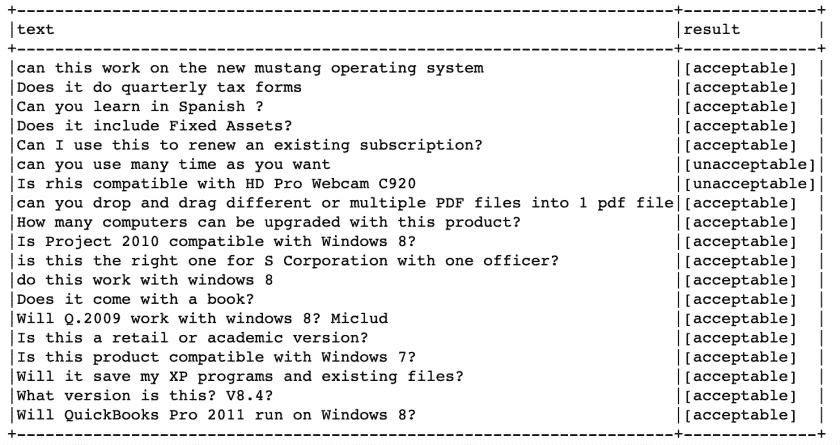
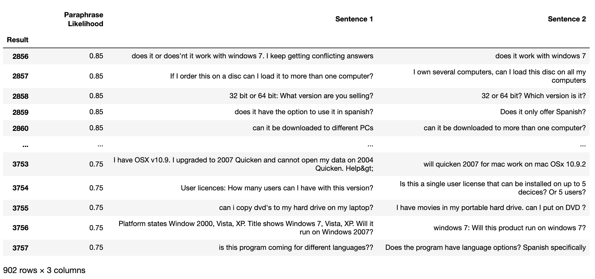
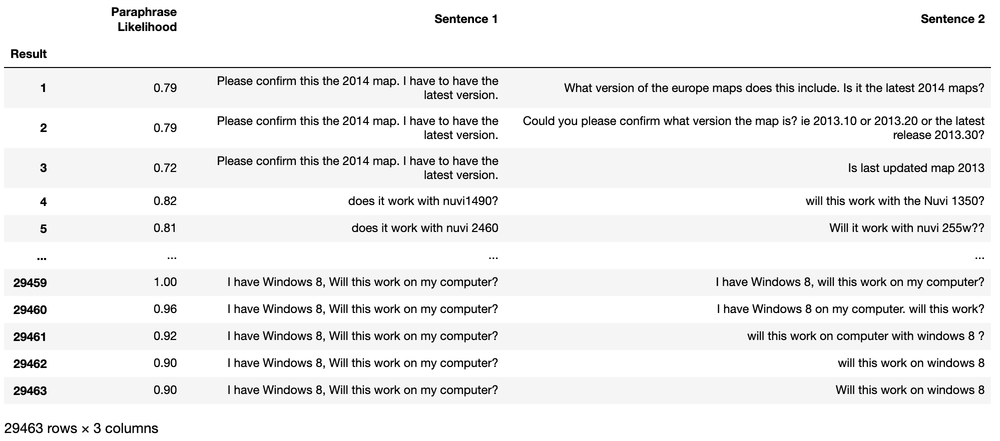

# 用于文本数据预测的转换器模型

> 原文：<https://web.archive.org/web/https://neptune.ai/blog/transformer-models-for-textual-data-prediction>

诸如[谷歌的 BERT](https://web.archive.org/web/20221206154022/https://en.wikipedia.org/wiki/BERT_(language_model)) 和 [Open AI 的 GPT3](https://web.archive.org/web/20221206154022/https://en.wikipedia.org/wiki/GPT-3) 等变形金刚模型继续改变着我们对机器学习(ML)和自然语言处理(NLP)的看法。只要看看 GitHub 最近推出的一款名为 [Copilot](https://web.archive.org/web/20221206154022/https://copilot.github.com/) 的预测编程支持工具就知道了。它接受了数十亿行代码的训练，并声称理解“*你提供的上下文，并合成代码以匹配*”。你的虚拟搭档程序员伙伴！

我们已经在[最近的文章](/web/20221206154022/https://neptune.ai/blog/bert-and-the-transformer-architecture-reshaping-the-ai-landscape)中写过这些模型和底层的变压器架构。我们还查看了[最近对不同 Transformer 模型](/web/20221206154022/https://neptune.ai/blog/unmasking-bert-transformer-model-performance)的研究，以理解为什么 BERT 和 GPT3 的底层架构比其他模型更好地学习上下文。

现在，像 Copilot 一样，我们希望在现实生活中实现这些模型的一些功能。因此，在这篇文章中，我们将看看使用变形金刚预测文本不同特征的实用方法。在此之前，我们需要确定我们可以预测哪些类型的特征，并理解为什么预测文本不同于其他形式的预测。

## 预测还是不预测？


*How does predicting text differ from other forms of prediction? | [Source](https://web.archive.org/web/20221206154022/https://pixabay.com/photos/definition-word-dictionary-text-390785/)*

预测文本数据不同于其他形式的预测。如果您想要预测某项资产(如股票或房屋)的价格，您可以向模型提供所有可用的数据，并预测您认为最能代表该资产的数字。价格是一个数字，虽然它可能是对的，也可能是错的，但它没有文本那么多潜在的“不确定性维度”。

以副驾驶为例。它预测代码片段，所以它可能拼错代码，使用错误的编码语言，使用不正确的变量名，等等。即使它做到了所有这些，代码本身也可能不起作用。

类似地，一个句子可能在语法上是正确的，但是在语义上是没有意义的。[诺姆·乔姆斯基](https://web.archive.org/web/20221206154022/https://en.wikipedia.org/wiki/Colorless_green_ideas_sleep_furiously#:~:text=Colorless%20green%20ideas%20sleep%20furiously%20is%20a%20sentence%20composed%20by,grammatically%20correct%2C%20but%20semantically%20nonsensical.)写了一句著名的句子“*无色的绿色想法疯狂地睡觉*”，以显示机器区分语法和语义的困难。

这就是我们所说的预测文本比价格有更多的“不确定性维度”的意思。与其他形式的数据(如资产价格)相比，文本在更多方面可能是“错误的”。为了控制这种程度的不确定性，我们试图识别我们想要预测的文本数据的特定特征。

这些特性在大多数以业务为中心的 NLP 管道中也应该是有用的。考虑到这一点，我们将在本帖中探讨以下特性:

1.  预测拼写错误:文本出错最简单的方法之一就是简单地拼错句子中的一个或多个单词。这个单词要么拼写正确，要么拼写错误。我们每天都在 Gmail 等应用程序的自动更正功能中看到这种情况，所以我们可以看看如何使用基于 Transformer 的模型轻松实现这样的功能。
2.  预测语法错误:识别句子中的语法错误要稍微困难一些。我们可以使用基于 Transformer 的模型来预测一个句子是否包含语法错误吗？这可能是您在处理数据时使用的东西，以确定它是否需要更改或从您的管道中删除，因为它可能会增加系统中下游错误的可能性。
3.  **预测转述句子**:通常当我们查看文本数据时，我们试图理解某些句子是否相关。思考这个问题的一种方式是，我们是否能够预测一个句子何时会转述另一个句子。这项任务比简单地寻找拼写错误或语法错误有更多的细微差别。原因是它涉及到识别两个句子的上下文，并预测一个句子和另一个句子描述相同的意图是否合理。这在处理大量文本数据时很有用，并且您希望搜索或识别可能相关但不完全相同的文本。

在研究这些特性的同时，我们还将研究一些不同的 NLP 库，它们使用转换器来执行一系列的 NLP 功能。您可以在 NLP 管道中使用这些库，它们也可以帮助您更好地理解如何将 Transformers 用于您的特定任务和用例。

这篇文章中描述的代码可以在相关的 [Github](https://web.archive.org/web/20221206154022/https://github.com/choran/predicting_text) repo 中找到。

## 用转换器预测文本数据

### 数据集

为了预测文本数据，我们希望使用一个表示“真实”查询和对话的数据集。我们所说的“真实”是指它包含了你在 Slack 或电子邮件中输入的所有混乱的东西。也就是说，它应该包含语法错误和拼写错误，使用缩写，以及所有其他我们可以找到的不太完美的方式来构建一个句子。

这类数据的一个重要来源是[亚马逊客户支持 QA 数据集](https://web.archive.org/web/20221206154022/http://jmcauley.ucsd.edu/data/amazon/qa/)。具体来说，我们将使用问题的软件类别，因为我们想看看我们的方法是否可以识别相关领域内的主题。这个数据集很棒，因为:

*   它包含**真实问题**，有我们想要的所有乱七八糟的问题，比如拼写错误、作为陈述的问题、有否定和无否定的问题，以及我们想以不同方式问同样问题的所有其他方式。
*   所有的**问题都有关联的答案，**有些是长答案，有些是简短的是/否答案。
*   **数据集被分成不同的类别**。一些数据集包含各种不同主题的综合问题。这并不复制典型的业务客户数据集，该数据集将与特定的业务或技术领域相关。
*   它**包含了关于如何最好地将其转换成不同格式的代码示例**。作者提供了有用的代码片段来帮助将数据转换成您认为最有用的解析格式。

按照数据集作者概述的步骤，我们最终得到一个熊猫数据框架，如下所示:


**We use a DF here but you can transform your data into whatever data structure you find easiest to work with. | Source: Author**

### 预测拼写错误


*Can we use transformers to better predict when a word is misspelled? | [Source](https://web.archive.org/web/20221206154022/https://pxhere.com/en/photo/1520271)*

作为对我们预测技能的第一个测试，我们将尝试识别数据集中的拼写错误。我们现在在几乎每个应用程序中都经常看到这个特性，以至于我们可能认为这是一个简单的问题。然而，这里的关键区别在于，我们正在执行一项预测任务，而不仅仅是向操作员建议一个潜在的拼写。

例如，如果您有一个管道，在那里您正在做诸如清理新的或传入的数据之类的事情，那么您可能会有一个消耗该数据的下游任务。下游任务可以是将数据用于训练目的的模型，或者将数据用于聚类的模型，或者是问答类型的模型。在这些情况下，重要的是特定领域的数据或特定术语或俚语不会被错误地识别为拼写错误的单词并被更改。这可能会给你的下游任务带来严重的后果。

由于有了预先训练好的模型，Transformers 使许多这类应用程序更容易实现。然而，尽管这些模型令人惊叹，您仍然需要关注您的特定用例。也许你不需要一个预先训练好的模型的所有附加功能，一个简单的拼写检查就可以了。或者，您可能想看看一些最新的 transformer 模型应用程序，看看它们是否为您的用例添加了任何新的和独特的价值。

这种方法的一个很好的例子是神经拼写校正库， [NeuSpell](https://web.archive.org/web/20221206154022/https://arxiv.org/pdf/2010.11085.pdf) 。NeuSpell 在神经网络上接受训练，通过使用相邻单词的上下文而不仅仅是字符扰动来学习拼写纠正。为了了解这种背景，他们使用 ELMo 和 BERT 等模型以及其他神经网络。你可以在这里找到 github 回购[。](https://web.archive.org/web/20221206154022/https://arxiv.org/pdf/2010.11085.pdf)

另一种方法是基于上下文的方法，就像 spaCy 通过他们的[上下文拼写检查](https://web.archive.org/web/20221206154022/https://spacy.io/universe/project/contextualSpellCheck)提供的方法。这使用 BERT 来在识别错误或建议更正时利用单词的上下文。

让我们先来看一下这两种方法的一些例子，看看它们在实际中是怎样的。我们将从我们的测试集中抽取 20 个句子的样本，查看两个模型，看看他们认为什么是拼写错误。

```
for q in original_queries:
    doc = nlp(q)
    spacy_misspell = doc._.performed_spellCheck
    print(f'='*(len(q)))
    print(q)
    print(f'='*(len(q)))
    print(f'-------- spaCy -------- ')
    if spacy_misspell:
        print(f'spaCy> spelling error detected')
        print(doc._.suggestions_spellCheck)
        print(doc._.outcome_spellCheck)
        for i in doc._.score_spellCheck:
            print(i)
            for s in doc._.score_spellCheck[i]:
                print(s)
    else:
        print(f'spaCy> No spelling error detected')
    neuspell_res = checker.correct(q)
    print(f'-------- NeuSpell -------- ')
    print(neuspell_res)
```

在上面的代码中，您可以看到 spaCy 模型使我们能够检查在给定的字符串中是否确实检测到了拼写错误。您还可以查看最有可能的建议更正以及相应的分数。这些都是非常有用的功能，使您能够看到实际上是否有错误，以及模型对潜在的替代替换单词有多大的信心。

例如，查询“*do you need a proceser*”似乎有一个明显的拼写错误。然而，spaCy 模型似乎认为这更像是一个上下文任务，而不是拼写错误:

```
do you need a procceser
=======================
spaCy: spelling error detected
-----------------------
{procceser: 'coffee'}
do you need a coffee
procceser
('?', 0.85842)
('.', 0.04466)
('...', 0.00479)
(';', 0.00453)
('-', 0.00416)
('coffee', 0.00275)
('!', 0.00234)
('phone', 0.00203)
('>', 0.00153)
('room', 0.00138)
```

而 NeuSpell 模型确实识别了正确的拼写错误:

```
-----------------------
NeuSpell:
-----------------------
do you need a processor

```

spaCy 模型还显示了更多与上下文相关的修正，例如:

```
Does this work well for canada?
===============================
spaCy: spelling error detected
-------------------------------
{canada: 'anyone'}
Does this work well for anyone?
canada
('you', 0.58046)
('him', 0.11493)
('me', 0.09218)
('her', 0.06952)
('us', 0.0262)
('them', 0.02586)
('anyone', 0.00408)
('everyone', 0.00391)
('ya', 0.00098)
('now', 0.00094)
```

潜在的更正很有趣，因为它们看起来更像是与上下文相关的变化，而不是拼写错误。如果您将“加拿大”替换为大写的“C”，即“这对加拿大有用吗？”使用空间模型不会导致任何变化。即使使用加拿大的小写拼写，NeuSpell 模型也不会更正原始句子。

您可以浏览数据集，查看更多关于这些模型如何相互比较的示例。即使粗略地看一下，这两种型号似乎都有问题。总的来说:

1.  spaCy 模型似乎专注于上下文:spaCy 模型有很多很好的特性，比如为潜在的替代者提供一个置信度得分。然而，它的建议更多的是基于上下文而不是拼写错误。在几个简单的例子中，如果我们的主要焦点是纠正潜在的拼写错误的话，它会产生一些看起来有问题的建议。这只是一个例子，可能有办法使用其他 spaCy 工具来调整它，或者改变它，使它更适合您的用例。但是现在，预测拼写错误的单词的纠正似乎没有用。
2.  **neu spell 模型不提供置信度得分**:neu spell 模型作为一个预测拼写错误单词纠正的模型，似乎表现得更好。它产生了比 spaCy 模型更合理的建议，所以你可以考虑使用它。它是否比其他标准(即非基于神经网络的)模型更好还有待商榷。此外，它似乎没有为其建议提供置信度得分的事实可能会限制其预测能力。如果能够查看置信度得分并选择是否接受建议，那就太好了。这将使 NLP 管道中的过程更容易自动化，并且确信您不是在“纠正”特定领域的术语，如产品名称。
3.  传统的拼写检查可能更适合你的任务:看起来基于转换器的拼写检查可能不会比[传统类型的方法](https://web.archive.org/web/20221206154022/https://norvig.com/spell-correct.html)提供更多的优势。但是，关注像这样的新应用总是好的，这些应用可能会通过像伯特或 GPT 这样的新 NLP 模型得到改进。

### 预测语法错误


*Do Transformer models like T5 make it easier to predict grammar errors in a sentence? | [Source](https://web.archive.org/web/20221206154022/https://www.photos-public-domain.com/2011/09/01/grammar/)*

虽然我们的拼写模型可能没有取得巨大成功，但希望我们在识别数据集中的语法错误方面运气更好。同样，如果您想在下游任务中使用您的数据，这很有用。

或者你可能想用一个句子去找其他类似的句子。在这种情况下，知道原文是否是一个好的、干净的、结构良好的句子是很有用的。如果它确实包含一些语法错误，那么这可能是你在查看相似性匹配分数时要考虑的事情。

像谷歌的 [T5 文本到文本转换器](https://web.archive.org/web/20221206154022/https://github.com/google-research/text-to-text-transfer-transformer)，这是[在 2020 年](https://web.archive.org/web/20221206154022/https://ai.googleblog.com/2020/02/exploring-transfer-learning-with-t5.html)发布的，是基于转换器的模型的例子，可以执行多种任务，如识别正确或错误的语法。T5 型号的有趣之处在于:

*   它在许多自然语言处理任务上接受训练:该模型在广泛的自然语言处理任务上接受训练，从识别相似性、总结文本到识别语法错误。所有这些任务都使用相同的模型、损失函数和超参数。理论上，这类似于你或我学习语言的方式，即我们学习字母表，我们学习读写和拼写，回答问题，然后我们将所有这些知识结合起来，以便能够完成非常高级的语言任务。现在，我们并不是说这些模型理解语言的方式和我们一样，但它们已经开始在一些 NLP 任务中表现得接近或接近人类。
*   它使用文本进行输入和输出:这个模型的另一个关键点是，你只需通过文本告诉模型你想要它做什么，它提供的结果也总是文本格式的。这与像 BERT 这样的模型非常不同，在 BERT 模型中，输入可能是一个句子，但输出是一个实体，如大规模多维向量。相反，用 T5，你通过文本告诉它，你想让它执行什么任务，提供这个任务的文本，它会用文本告诉你结果。就抽象而言，这是一个巨大的飞跃。想一想 C 或 Java 等编码语言和 Python 的区别。Python 是一个如此高层次的抽象，它使得更多的人能够编程，并开辟了如此多的潜在用例。同样，当人们惊叹于 [GPT-3](https://web.archive.org/web/20221206154022/https://openai.com/blog/gpt-3-apps/) 的强大时，我对它简单的界面印象深刻。真正的天才不在于无数的参数，而在于易用性，这使得人们能够生成文本、回答问题，并对他们所看到的感到惊讶，否则他们将无法测试基于 transformer 的高级模型。

你可以直接通过其 [github](https://web.archive.org/web/20221206154022/https://github.com/google-research/text-to-text-transfer-transformer#installation) 页面或者从 [HuggingFace 库](https://web.archive.org/web/20221206154022/https://huggingface.co/transformers/model_doc/t5.html)使用 T5。或者，也是我喜欢首先使用的方法，您可以尝试找到另一个库，其中包含一个抽象层，这样更容易使用。这样你可以快速测试模型，看看它是否适合你的用例。

如果是这样，那么您可以投入时间部署和测试“原始”模型，这可能使您能够在更加定制的基础上训练和调整它。最近，许多这种“抽象”类型库也允许您执行这些任务，所以您可能不需要做任何进一步的研究。

#### 识别有语法错误的句子

如果你浏览我们的亚马逊数据集，你可以看到语法不正确的句子，例如“*用户下载时有问题吗？*”或者“*这样开餐厅好不好*”。

这是意料之中的，因为这是一个真实的数据集，我们都知道在网上聊天时很容易发生这类错误。正如我们前面提到的，如果您将客户数据用于下游任务，或者只是将清理数据作为最佳实践，那么您将需要识别句子中何时存在语法错误。结合拼写错误，您可以为您的管道创建一种质量分数，您可以在其中为您想到的任何下游任务排列更高质量的数据。

T5 执行这些类型的任务，基于 T5 任务的一个很好的“抽象”库是[约翰斯诺实验室](https://web.archive.org/web/20221206154022/https://nlp.johnsnowlabs.com/analyze_spelling_grammar) Spark NLP 库[。](https://web.archive.org/web/20221206154022/https://nlp.johnsnowlabs.com/analyze_spelling_grammar) [Spark NLP](https://web.archive.org/web/20221206154022/https://towardsdatascience.com/introduction-to-spark-nlp-foundations-and-basic-components-part-i-c83b7629ed59) 是一个 NLP 库，类似于 spaCy 或 NLTK 这样的库，在一个屋檐下提供了一系列的 NLP 功能。John Snow Labs 是一家为医疗保健等行业提供 NLP 服务的公司，它还提供一系列免费的 NLP 实用程序。不用说，这就是我们在这里看它们的原因。

要设置任务，您需要首先确定要使用的模型。约翰斯诺实验室提供其他模型，但现在我们将使用 T5。

```
documentAssembler = DocumentAssembler()
    .setInputCol("text")
    .setOutputCol("document")

t5 = T5Transformer.pretrained(name='t5_base',lang='en')
    .setInputCols('document')
    .setOutputCol("T5")

```

然后你需要告诉它你要执行的任务。

```
t5.setTask('cola sentence:')

pipe_components = [documentAssembler,t5]
pipeline = Pipeline().setStages( pipe_components)

```

现在我们只需要测试数据中的一些例句。

```
sentences = test_dataset_df['question'].sample(n=20).tolist()

sentences = [[x] for x in sentences if len(x) < 90]
df = spark.createDataFrame(sentences).toDF("text")

model = pipeline.fit(df)
annotated_df = model.transform(df)
annotated_df.select(['text','t5.result']).show(truncate=False)

```



*This is the example output from identifying which sentences are grammatically correct | Source: Author*

从上面的例子可以看出，它既识别了一个语法错误，也识别了一个拼写错误。我们可以将它与上面的拼写纠正库结合使用，看看我们需要对哪些句子进行拼写检查。这可能是解决我们之前提到的问题的另一种方法，当时我们没有一个单词拼写错误可能性的置信度得分。一旦我们知道有语法错误，我们就可以通过拼写检查，因为我们知道这个句子有问题。

再说一次，这是我们可以用来检查数据质量的另一个“引以为傲”的东西。你可以点击这里查看约翰斯诺图书馆提供的大量例子和演示。

您可以找到大量使用 T5 和其他 transformer 模型预测文本的其他示例。您还可以使用库管道结构来轻松创建自己的 ML 管道，以便按顺序执行所有这些任务。关于所有可用任务的列表，你可以阅读这篇[介绍性文章](https://web.archive.org/web/20221206154022/https://towardsdatascience.com/hands-on-googles-text-to-text-transfer-transformer-t5-with-spark-nlp-6f7db75cecff)，它列出了所有 T5 任务和解释。

### 预测转述句子


*Can BERT help us predict paraphrased sentences? | [Source](https://web.archive.org/web/20221206154022/https://unsplash.com/photos/7PYqjNzvrc4)*

到目前为止，我们试图预测我们的测试句子是否包含拼写错误的单词或语法错误。现在，假设我们将这些“检查”添加到我们的 NLP 管道中，其输出将是“干净”句子的预测器。这些“干净”的句子可以代表正确形成的客户询问。这一过程的最后一步可能是尝试并预测一个句子是否是数据集中已经存在的句子的意译。

这可能是一个有用的工具，看看你是否需要处理或分组任何新的句子。如果它们已经存在，那么你可能已经有了信息。如果您正在创建一个训练数据集，那么您可能需要相应地对句子进行分组和标记。以这种方式预测转述的句子有两个主要好处:

1.  很快:你可以找到相似的句子，而不是预测转述的句子。这需要将每个句子与其他句子进行比较，找出最相似的句子。如果您有大量数据，这可能会非常慢。
2.  它可以使用预先训练好的模型:因为我们只寻找句子的释义版本，我们可以使用预先训练好的模型。或者，如果我们直接比较句子，我们可能需要对模型进行微调，以理解医学或法律术语之类的东西，如果我们在那个领域的话。当我们使用解释模型时，我们希望主要关注用不同的方式来表达问题。例如，想一个类似“*的句子，deefee 要多少钱？*”。这是一个由一个词组成的句子，这个词没有任何意义，但这并不妨碍我们把它解释为:
    1.  deefee 的价格是多少？
    2.  参加 deefee 需要多少费用？
    3.  deefee 的成本是多少？
    4.  段落免费吗？
    5.  段落免费吗？
    6.  deefee 很贵吗？

**deefee*–我通过一个叫做[的酷网站生成了这个单词，这个单词并不存在](https://web.archive.org/web/20221206154022/https://l.thisworddoesnotexist.com/9btS)，它基于 GPT2 生成了不存在的单词，但它也生成了这些单词的定义。看到模型想出的东西很有趣。例如，它将 deefee 定义为“*一个赌博事件*”。

#### 用句子预测释义

句子 BERT 是一个巨大的模型库，[最初开始使用 BERT 和一个暹罗网络来生成语义上有意义的句子嵌入，然后您可以使用它来进行分类或句子相似性等工作。它现在有一系列](https://web.archive.org/web/20221206154022/https://arxiv.org/abs/1908.10084)[不同的模型可用](https://web.archive.org/web/20221206154022/https://www.sbert.net/docs/pretrained_models.html)，你可以用它来完成许多 NLP 任务，它现在也可以作为 [HuggingFace](https://web.archive.org/web/20221206154022/https://huggingface.co/sentence-transformers) 库的一部分。

我们将使用他们的[转述模型](https://web.archive.org/web/20221206154022/https://www.sbert.net/examples/applications/paraphrase-mining/README.html)来识别亚马逊数据集中的转述句子。注意，你也可以通过 [HuggingFace](https://web.archive.org/web/20221206154022/https://huggingface.co/sentence-transformers/all-MiniLM-L6-v2) 库或者作为[句子转换器](https://web.archive.org/web/20221206154022/https://www.sbert.net/examples/applications/paraphrase-mining/README.html)库本身的一部分来使用这个模型。

我们首先需要下载模型，这很容易，因为它是 HuggingFace 的一部分:

```
from sentence_transformers import SentenceTransformer
model = SentenceTransformer('sentence-transformers/all-MiniLM-L6-v2')
```

然后，我们需要从数据集中获取一个句子样本进行测试:

```
sentences = test_dataset_df['question'].sample(n=10).tolist()
for i, s in enumerate(sentences, 1):
    print(f'{i}: {s}')
```

```
1: Will this work on a 64bit system?
2: If I buy print shop 23 can I access my old files from print shop 22?
3: does this work on a macbook mid 2010 laptop??? (Macintosh HD OS X version 10.9.4)
4: how can i play it on my mac 0s x?
5: upgrade from FMP 6? Will FMP 10 upgrade from FMP 6?
6: Can you send me only the activation code?
7: Can you use this to renew an existing subscription to McAfee Internet Security?
8: What are options for sound editing?
9: Is this useful for walking directions?
10: does the instrumentation include a generous offering from the indian orchestra plus the hammered dulcimer?
```

这里看起来类似的句子不多，我们来看看模型是怎么想的。

```
paraphrases = util.paraphrase_mining(model, sentences, top_k=1)
for paraphrase in paraphrases[0:100]:
    score, i, j = paraphrase
    para_list.append([round(score, 2), sentences[i], sentences[j]])
para_df = pd.DataFrame(para_list, columns=['Paraphrase Likelihood', 'Sentence 1', 'Sentence 2'])
para_df.index = np.arange(1, len(para_df) + 1)
para_df.index.name = 'Result'
para_df
```


*Predicting paraphrasing with Sentence BERT | Source: Author*

我们可以看到，这些例句中的一些是相互转述的可能性很低，42%是我们在这里看到的“*在 2010 年中期的 macbook 笔记本电脑上工作吗？？？* *(Macintosh HD OS X 版本 10.9.4)* 【被转述】*如何在我的 mac 0s x 上播放？*

这一点的美妙之处在于，我们可以很容易地将它应用到大量的例子中。在我们的亚马逊数据集中，我们有超过 7500 个例子。让我们看看我们可以预测哪些可能的释义。处理所有 7，588 个示例需要 14 秒多一点。这个时间可能会有所不同，取决于你在哪里运行你的笔记本电脑，但一般来说，这是很快考虑到它在引擎盖下做什么。

```
%%time
paraphrases = util.paraphrase_mining(model, all_sentences, top_k=1)
```

```
CPU times: user 5min 34s, sys: 27.4 s, total: 6min 2s
Wall time: 13.6 s
```

我们的最佳结果是几乎相同的句子，所以它们并不是真正的相互转述。


 *Predicting paraphrasing with Sentence BERT | Source: Author*

但是，如果我们看看一些较低的分数，我们可以看到它确实捕捉到了一些有趣的语言细微差别。

```
para_df.query('0.75 <= `Paraphrase Likelihood` <= 0.85')
```



 *Predicting paraphrasing with Sentence BERT | Source: Author*

为了更好地观察，让我们看一下随机抽样的结果。

```
for row in sample_prar_df.sample(n=20).itertuples():
    print(row[2])
    print(f'------------------ {row[1]}------------------')
    print(row[3])
    print('='*50)
```

```
Is this version a subscription product that has to be renewed every year?
------------------ 0.82------------------
Is this a subscription for one year?
==================================================
Is it a renewal or not&
------------------ 0.77------------------
Is this a 1 yr renewal. It didn't say anything on the listing. Thanks
==================================================
Is this original installation software or only an update? I do not have iLife on my computer.
------------------ 0.76------------------
Is ilife 9 a stand alone program or an upgrade of previous ilife software?
==================================================
Do you have to use Dragon with a microphone?
------------------ 0.75------------------
Can it work with Dragon Naturally Speaking?
==================================================
Can I transfer from Quicken for PC to quick book for Mac
------------------ 0.76------------------
Is this version of Quicken for Mac ok to buy
==================================================
can i use this on all three of my macs?
------------------ 0.83------------------
Can this be installed into 3 Macs?
==================================================
Will this version allow for 1 user/ 2 computers?
------------------ 0.81------------------
Can I install on two computers for 1 user?
==================================================
My MAC does not have a CD drive - can this be downloaded?
------------------ 0.78------------------
Does this come with a CD? Or is it a download? My new MacBook doesn't have a CD slot.
==================================================
you send me the codes via email?
------------------ 0.76------------------
if i buy this one you will send the code to my e-mail ?
==================================================
can it be put on computer
------------------ 0.75------------------
can i install this on my computer can my sister put it on her computer also
==================================================
Better than Quicken? Is there something better than Quicken for Mac?
------------------ 0.81------------------
Is this version of Quicken for Mac ok to buy
==================================================
is efile included? -- nothing is specifically mentioned other in the comparison of products
------------------ 0.79------------------
Does it include free efile
==================================================
Can I just simply rip DVDs, including those infused with copy protection?
------------------ 0.84------------------
can I rip dvd's, cd's with this download?
==================================================
Can you please tell me if this is compatible with Mac Mountain Lion or Mavericks?
------------------ 0.81------------------
Will this version work with mac Mavericks?
==================================================
Will this work on a windows 8 tablet ?
------------------ 0.83------------------
will this work on Windows 8?
==================================================
what is the license deal? What's the deal here?
------------------ 0.76------------------
Can you be more specific about license specifications? Thanks for info
==================================================
Can I use this software on my macbook and if so how?
------------------ 0.83------------------
Can this software work on a Mac?
==================================================
can you do business cards and is there clipart
------------------ 0.82------------------
Can you make business cards?
==================================================
What are the main improvements of Manga Studio EX 5 to the previous EX version? Is it worth the upgrade?
------------------ 0.75------------------
What is the main difference between Manga Studio 5 and Manga Studio EX5?
==================================================
can I install it on my laptop?
------------------ 0.85------------------
Can I install it on my desktop and laptop? 
```

这里有一些有趣的细微差别，因为人们用混乱而真实的方式表达问题，如“*什么是许可协议？*”。上面我们可以看到这样的措辞:

*   *什么是许可协议？这是怎么回事？*
*   你能更具体地说明一下许可证的规格吗？感谢信息

这些例子被看做是彼此的转述，得分 0.76。这很好，因为句子的结构非常不同。你或我会知道它们是相似的，但很难编写规则来知道这些类型的句子是相似的。

同样，如果我们看这些例子:

*   包含 efile 吗？—产品对比中未特别提及其他内容
*   *是否包含免费文件*

我们认为这些被预测为得分为 0.79 的转述。同样，第一句话比第二句话长得多，包含的信息对于确定这些信息是否与同一主题相关并不真正有用，例如，声明产品中没有提到它是额外的信息，但不会改变问题的性质。查询答案"*是否包含免费 efile？*”很可能是与第一个查询相同的答案。

在上面的例子中，我们预测了数据集中转述句子的最佳例子。换句话说，对于每一句话，该模型将在数据集中找到最佳的释义替代示例。我们可能希望找到不止一个例子，因为在这样的数据集中，很可能有多个潜在的释义例子。我们可以通过改变 top_k 参数来做到这一点。

```
paraphrases = util.paraphrase_mining(model, all_sentences, top_k=5)
para_list = []

for paraphrase in sorted(paraphrases, key=lambda x: x[1], reverse=True):
    score, i, j = paraphrase
    para_list.append([round(score, 2), all_sentences[i], all_sentences[j]])
para_df = pd.DataFrame(para_list, columns=['Paraphrase Likelihood', 'Sentence 1', 'Sentence 2'])
para_df.index = np.arange(1, len(para_df) + 1)
para_df.index.name = 'Result'
para_df
```



 *Predicting paraphrasing with Sentence BERT | Source: Author*

## 结论

在这篇文章中，我们看了一些基于 transformer 的模型被用来预测文本的不同特征的方法。我们研究了三个主要领域，从基于单词到基于语法，再到整个句子，这三个领域的复杂性都在增加。我们关注的主要领域是:

1.  **预测拼写错误**:我们使用了许多库，如 spaCy 和 NeuSpell，并展示了它们如何使用底层的 transformer 模型来尝试和预测拼写错误。最终，与传统算法相比，基于转换器的模型可能不会为纠正拼写错误增加太多价值。但这里的关键是，我们看了一些有用的库，现在更好地理解了这个问题，并可能使用这些库的一些其他功能，因为我们知道他们
2.  预测语法错误:我们接着查看了约翰·斯诺实验室的 NLP 库，它提供了一系列漂亮的特性。我们使用语法错误特征来尝试和预测我们数据集中的一个句子在语法上是否正确。基于 Transformer 的模型似乎更适合这项任务，它似乎可以正确识别句子样本中的语法错误。在实现下一个 NLP 管道时，一定要牢记在心。
3.  具有讽刺意味的是，随着我们任务的语言复杂性的增加，transformer 模型似乎提供了更多的价值。我们使用句子转换器库在亚马逊数据集中查找句子，这些句子是数据集中其他句子的释义。这看起来非常有用，因为模型不知道我们的例子中使用的技术术语、版本和短语。这似乎是一个特性，您可以用它来识别一个新的客户查询实际上是否只是一个更常见的查询的重新表述。

很明显，越来越多的应用程序建立在基于 transformer 的模型之上，这将更容易为您的特定用例找到和使用应用程序。理想情况下，您可以找到一个库来执行您需要的所有功能，但是正如我们在这里看到的，如果您不能在一个地方找到您需要的所有功能，您可以一起使用不同的库。

### 参考

下面是我们在这篇文章中使用的库的列表。您可以在这些库中找到更多的特性，所以一旦您开始使用它们，我鼓励您查看您认为可能对您的用例有用的任何其他特性:

*   spaCy projects:spaCy projects 是一个检查酷炫新车型的好地方。如果你愿意，你可以在这里[上传你自己的模型](https://web.archive.org/web/20221206154022/https://github.com/explosion/spaCy/blob/master/website/UNIVERSE.md)！
*   我们用这个库做了一个不同的拼写检查的例子。
*   约翰·斯诺实验室:为了进行语法检查，我们使用了这个库中的例子。正如我所提到的，这里有这么多很酷的 NLP 特性和模型可以免费获得，你很可能会找到对你的用例有用的东西。
*   [句子变形金刚](https://web.archive.org/web/20221206154022/https://www.sbert.net/examples/applications/paraphrase-mining/README.html):最后，为了释义，我们使用了句子变形金刚库。和约翰·斯诺实验室一样，在他们的网站上有很多基于变压器模型的不同应用的例子。