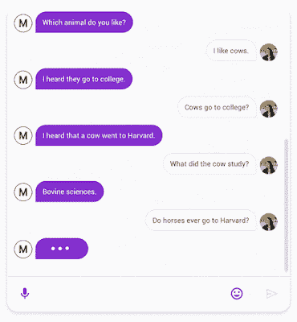
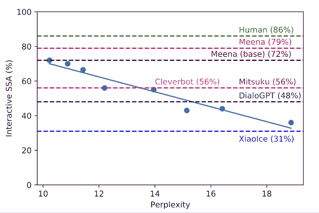

# Transformer NLP 模型(Meena 和 LaMDA):它们是“有感觉的”吗？这对开放域聊天机器人意味着什么？

> 原文：<https://web.archive.org/web/https://neptune.ai/blog/transformer-nlp-models-meena-lamda-chatbots>

首先，这不是一个关于谷歌最新的深度学习[自然语言处理](/web/20220926083102/https://neptune.ai/blog/category/natural-language-processing) (NLP)模型 [LaMDA](https://web.archive.org/web/20220926083102/https://blog.google/technology/ai/lamda/) 是否是《2001:太空漫游》中有感知能力的人工智能(AI)计算机 [Hal-9000](https://web.archive.org/web/20220926083102/https://en.wikipedia.org/wiki/HAL_9000) 的现实版的帖子。这并不是说这是一个毫无意义的问题。恰恰相反，这是一个很可能主导未来人工智能研究的讨论。

然而，现在一个更紧迫的问题是这些主张对 NLP 的现状意味着什么。

*   例如，这些模型与其更早的祖先之间的关键技术差异是什么？
*   这些模型可以用于不同的 NLP 任务吗？
*   如果是，那么训练这些模型需要哪些数据？

由于早期 NLP 模型如 [BERT](/web/20220926083102/https://neptune.ai/blog/unmasking-bert-transformer-model-performance) 取得的快速进展，这些问题现在不再仅仅在机器学习(ML)博客中讨论。取而代之的是，他们现在在非技术性报纸上推动点击，比如《T2》、《经济学家》T3。这意味着更多的人会看到和听到这些模型。因此，理解推动最新一轮发展的技术创新比以往任何时候都更加重要。

## “有感觉的”语言模型的真正影响

*The latest neural network models have raised questions about just how well we can expect bots to work in the near future | [Source](https://web.archive.org/web/20220926083102/https://www.google.com/imgres?imgurl=https%3A%2F%2Fthumbs.dreamstime.com%2Fz%2Fmechanical-man-construction-white-background-53160531.jpg&imgrefurl=https%3A%2F%2Fwww.dreamstime.com%2Fillustration%2Fleonardo-robot.html&tbnid=yDOFeWan7FXGuM&vet=12ahUKEwjJ5Iev_PD4AhXrQEEAHTYIBAQQxiAoA3oECAAQJw..i&docid=_Tl42hwGUJvIfM&w=1389&h=1300&itg=1&q=sentient%20robot&hl=en&ved=2ahUKEwjJ5Iev_PD4AhXrQEEAHTYIBAQQxiAoA3oECAAQJw)*

正如似乎被广泛接受的那样，LaMDA 是没有知觉的，但这个问题被提出的事实表明了在相对较短的时间内， [Transformer 技术、](/web/20220926083102/https://neptune.ai/blog/bert-and-the-transformer-architecture)支持 NLP 最近许多进展的深度学习架构在多大程度上推动了聊天机器人的能力。这意味着讨论不再是 ML 专家的唯一领域，并具有更广泛的影响。

随后，这也意味着预期可能会出现偏差。如果聊天机器人现在“几乎有知觉”，一些不真正熟悉该技术的人可能会认为，问答、摘要、文本生成和语义搜索等 ML 应用程序现在已经得到了全面解决。这种思路可能会让我们超越自我。

为了澄清这场争论，我们需要了解最近的进展，以及它们对这些模型的当前和未来功能的意义。

*   这些最新进展只与学术机构和像谷歌这样的大公司有关吗？
*   或者，通过采用这些最新发展，中小型企业现在能获得哪些切实的好处？

为了解决这些问题，我们将看看导致我们来到这里的一系列事件，围绕这些模型的炒作的当前状态，同时，我们还将讨论这些进步的实际方面。因此，让我们从识别这些模型试图解决的核心问题开始。

## 对话很难！

*The nuances of a back-and-forth dialogue are varied and complex | [Source](https://web.archive.org/web/20220926083102/https://www.google.com/imgres?imgurl=https%3A%2F%2Fpublicdomainvectors.org%2Fphotos%2FInterview.png&imgrefurl=https%3A%2F%2Fpublicdomainvectors.org%2Fen%2Ffree-clipart%2FConversation-symbol%2F50157.html&tbnid=IUzYxpiQVMw01M&vet=12ahUKEwjehOSc_vD4AhVOZ8AKHc_VAcUQMygZegUIARDXAg..i&docid=2Oo4MSZ6SqONAM&w=500&h=383&q=conversation&hl=en&ved=2ahUKEwjehOSc_vD4AhVOZ8AKHc_VAcUQMygZegUIARDXAg)*

我们很少考虑简单对话中包含的许多复杂性。无论是与你几乎不认识的人，亲密的朋友或亲戚，还是客户服务代理，来回对话的细微差别是多样而复杂的。根据不同的情况，你的谈话可以随心所欲地从一个话题转换到另一个话题，使用隐喻、笑话或讽刺，假设某些常识或指定外部的、可证实的事实。简而言之，事情很多！

这就是为什么直到最近，人们还不清楚一个“端到端”的神经网络，如建立在 [Transformer 架构](/web/20220926083102/https://neptune.ai/blog/comprehensive-guide-to-transformers)之上的大型语言模型(LMs ),是否可以被训练来执行这样的任务。

在这些模型中，你传递给他们很多很多的文本数据，然后他们输出更多的文本或者一个大的密集向量(嵌入)。在任一情况下，输出可以表示:

*   对一个问题的回答，
*   输入文本的摘要，
*   或者基于输入提供相似性得分，

举几个日常使用的例子，但是这些实验都没有真正解决创建开放式对话模型的问题。

## 谷歌的 Meena:开放式对话模式的到来

在像“图灵测试”这样的比赛中，参赛者试图说服人类评委，他们实际上不是在和机器人说话，聊天机器人往往是由基于规则的组件和机器学习算法结合而成。这就是为什么谷歌在 2020 年发表的论文“[走向类似人类的开放领域聊天机器人](https://web.archive.org/web/20220926083102/https://arxiv.org/pdf/2001.09977.pdf%5C)”是一个里程碑。

在这篇文章中，作者声称，他们提出的模型 Meena 通过在广泛的 NLP 任务和人类评估测试中实现最先进的性能，回答了开放的研究问题——没有任何硬编码规则的大型端到端模型可以在开放域设置中生成几乎类似人类的聊天响应。

这是一个非常大的主张，从表面上看，它似乎改变了游戏规则。但是，一个非常基本的后续问题可能是——他们是如何做到的？

*An example chat between Meena (left) and a person (right) | Source: [Google blog](https://web.archive.org/web/20220926083102/https://ai.googleblog.com/2020/01/towards-conversational-agent-that-can.html)*

作者基本上创建了一个新的度量标准，人类评估者可以用它来衡量 Meena 听起来是否更像人类，这被称为“敏感性和特异性平均值(SSA)”。这试图测量两件事:

1.  这似乎是显而易见的。回答需要在对话的上下文中有意义。如果你问我，“现在几点了？”我说，“爱尔兰有三个峡湾”，那么这不是一个明智的回答。这似乎是一个随机的事实。

2.  **特异性**:这是对回答与问题相关程度的衡量。例如，当被问到现在几点时，我可以说:“我不知道”。这是一个明智的反应，我可能不知道现在的时间。但不具体。相反，如果我说“我不知道，我的手表正在充电，我找不到我的手机了”这样的话，这既明智又具体，我是在提供与你当前问题相关的具体信息。

### 成为人类需要什么？

Meena 的作者声称,“图灵测试”类型评估的一个问题是它主要寻找合理的答案。为了说明这一点，作者创建了一个名为 GenericBot 的简单机器人，它只有两个响应:

1.  **我不知道**:每当输入是一个问题时，它就用这个来响应
2.  **Ok** :只要输入是一个语句，它就用这个来响应。

有了这些简单的规则，机器人在与人类互动时能够获得很高的合理分数。它可能是世界上最无聊的聊天机器人(不要在聚会上用它)，但它的回答没有一个可以说是不合逻辑或荒谬的。然而，你可能会觉得奇怪，如果这是你在与另一个人交谈时得到的唯一回答。

这突出了米娜论文的一个重要贡献，即，我们认为什么是类似人类的反应？

### Meena 语言模型的机制

我们将研究 Meena 聊天机器人模型的两个特别有趣的技术方面，这两个方面决定了上述问题的答案:

1.  困惑:Meena 使用了一种新的标准，这种标准与人类对对话质量的判断非常一致。
2.  **训练数据** : Meena 是在大量的对话数据上进行训练的，这与之前的模型不同。

*Meena attempts to use perplexity as a way to improve human judgments of dialogues against their Sensibleness and Specificity Average (SSA) score. The dashed lines offer a baseline comparison for different approaches, and the dotted line is the regression line showing the relationship between perplexity (as measured by different Meena model sizes) and SSA scores. | [Source](https://web.archive.org/web/20220926083102/https://ai.googleblog.com/2020/01/towards-conversational-agent-that-can.html)*

#### 困惑:接下来是什么？

以前的对话模型的一个问题是如何适当地训练模型，以便它们产生与人类评估者很好相关的结果。[之前的研究](https://web.archive.org/web/20220926083102/https://arxiv.org/pdf/1603.08023.pdf)显示，当用于评估对话响应生成系统时，BLUE benchmark 等基准与人类判断的相关性很差。

这很重要，因为如果我们无法找到一个自动的指标来评估模型在训练期间的表现，那么世界上所有的数据都不会帮助我们学习好的响应。Meena 通过引入困惑度来解决这个问题。简而言之，困惑度量模型对预测下一个令牌的信心。

请记住，自回归 LMs 通常将之前的令牌作为输入，并尝试预测下一个令牌。这些模型将在可能的下一个令牌响应上生成概率分布。在这种情况下，困惑将预测模型预测正确的下一个单词(或者，在 Meena 的情况下，对话中的下一个单词)的能力。

以前的模型很难将它们的自动指标与人工评估相匹配。米娜展示的是，如果你试图提高困惑分数，也就是说，困惑分数越低越好，那么这与人类对对话的评级密切相关。

#### 对话训练数据

我们注意到以前的模型如 [BERT](https://web.archive.org/web/20220926083102/https://arxiv.org/pdf/1810.04805.pdf) 是基于单词嵌入的。组织 BERT 的训练数据，以便模型可以学习生成表示单词及其相关上下文的嵌入。这一点很重要，因为一旦模型能够逐字解析数据，或者更准确地说，一个单词一个单词地解析数据，我们就可以从网上以任何格式输入大量数据。然后，该模型可以学习预测[屏蔽词](/web/20220926083102/https://neptune.ai/blog/unmasking-bert-transformer-model-performance)，这已被证明会产生非常令人印象深刻的结果。

像 BERT 这样的模型是从单词层次建立起来的，它是基于使用句子而不是单个单词作为输入。在这些情况下，模型的输出不是单词嵌入，而是句子嵌入。句子比单词更加多样和复杂，所以这仍然是[积极研究](https://web.archive.org/web/20220926083102/https://twitter.com/Nils_Reimers/status/1435544743967170565)的一个领域。

所以想象一下试图理解多回合对话的额外复杂性？现在，我们需要理解句子，以及如何与之前的句子联系起来，预测下一个话题或回答或开放式问题，并记住之前发生的事情。我们不能通过给一个模型一些随机的句子来了解这种细微差别。

为了解决这个问题，Meena 的作者从网络和社交媒体上创建了训练数据。数据中的第一条消息被视为根，所有响应都被视为子节点。该树上的每一步或每一条消息都被认为是一个回合。这使得 Meena 在试图预测下一次反应时可以使用之前的回合。

对于 Meena，训练数据由上下文-响应对组成，其中上下文是最后的回合数，最多为 7 次。因此，米娜能够分析前面的话轮，并尝试预测回应。然后，它可以将预测的响应与实际响应进行比较，以学习预测更好的响应，这与 BERT 通过将实际单词与预测单词进行比较来学习的方式非常相似。这就是我们前面提到的困惑分数发挥作用的地方。低困惑意味着模型对结果更有信心，这应该与良好的响应相关。

作者还编辑数据集，并删除任何可能不安全或包含攻击性语言或其他可能限制其作为响应的有用性的因素的消息，例如，如果消息主要由数字组成。然后，被阻止邮件下的子树也被删除。最终的数据集总共是 341GB 的文本。

## Meena 对企业和机器学习团队的效用

### 是否与业务需求同步？

正如我们前面提到的，Meena 的设计是为了避免在对话中说“我不知道”这样的话。“我不知道”不是一个足够“具体”的回答。然而，在大多数商业案例中，这可能正是您希望从您的机器人那里得到的:

*客户:“您好，我登录我的帐户时看到以下错误，我附上了一张截图”*

Bot:“谢谢你的信息，这非常有帮助，我以前没见过这个错误，我已经见过很多错误了，你想看看其他的吗？

客户:“不太好，你能解决这个问题吗，因为它看起来像是一个 bug？”

Bot:“你知道软件 bug 这个术语是从哪里来的吗？这是一个有趣的故事，最初是一只昆虫飞进了世界上最早的计算机之一"

顾客:“我们能不能只关注这个问题？”

这个机器人可能是一个有趣的角色，但当你试图解决你的问题时，这不是你所需要的。如果机器人无法回答客户的查询，您可能希望将该交互升级到人类。你不希望你的机器人对你寻求解决方案的客户变得有趣和有趣。创建开放式机器人的学术目标可能与商业机器人的需求非常不同。如果企业希望部署客户认为是人类的机器人，这将有所不同。

然而，在大多数情况下，企业确实希望客户知道他们何时在与机器人交谈，何时在与人类交谈。如果您希望客户无法区分这两者，那么开放式机器人可能是您想要的。这里要注意的关键是，创建 Meena 的目标可能与您试图用机器人解决的业务问题不一致，因为大多数企业都希望他们的机器人了解他们特定的业务领域。

### ML 团队的有趣发现

虽然 Meena 可能不是可以“开箱即用”来解决特定 NLP 任务的东西，但它确实有许多有趣的技术方面，可能会引起不同 ML 应用程序的兴趣:

1.  困惑与人类评价密切相关，这一点是有用的。例如，如果你正在考虑构建自己的生成式对话机器人，那么**困惑是一个度量标准**，你可以很容易地根据自己的数据训练自己的模型。如果它确实与人类的判断有很好的相关性，那么你可能会避免昂贵的标签数据，而是使用这种自动度量作为你的指导星。

2.  就对话模型的扩展而言，困惑也潜在地打开了闸门。如果你可以使用**未标记的数据，**那么你可以将你的对话模型指向你自己的数据，并希望通过更多的数据来提高它的准确性。这对于以前的对话模型来说是不容易实现的。

3.  创建**数据集的方法**也非常有趣，因为以与您自己的特定领域数据相同的上下文响应格式创建数据集似乎相对容易。唯一的问题是所需的数据量，相比之下，GPT2 是在 40GB 的数据上训练的，这在当时被认为是海量数据。

正如我们前面提到的，对话模型很难，因为人类对话是一个复杂的语言框架，从单词到句子到段落再到对话。米娜是一个突破性的模型，因为它表明这种复杂性是可以解决的，对话模型是可能的。如果这种趋势继续下去，我们预计我们可以在更大和更复杂形式的对话数据上训练模型。

事实上，这正是 LaMDA 的情况，因为它代表了对话模型的下一个进步。它建立在 Meena 的发现之上，并在很短的时间内将开放域聊天机器人提升到了一个新的水平。但是 LaMDA 有什么特别之处，让它抢走了 Meena 的所有注意力？为什么没有人想知道米娜是否是一个有意识的实体？可怜的米娜，让我们来看看为什么 LaMDA 看起来聪明多了。

## 谷歌的 LaMDA:更好的 Meena

*LaMDA broke new ground in trying to generate specific and interesting responses | [Source](https://web.archive.org/web/20220926083102/https://blog.google/technology/ai/lamda/)*

Meena 的一个创新之处是，它不仅要求机器人的反应是明智的，而且还需要具体。这意味着机器人必须“更加努力”来产生有意义的对话。然而，正如最近的研究表明的那样，这可能会刺激机器人“经常产生幻觉，或者对潜在的来源缺乏忠诚”。

从业务角度来看，如果“幻觉”与客户问题有关，这可能会造成严重的问题。这也是开放领域对话中的一个问题，在这种对话中，模型可以开始“编造东西”。这是 LaMDA 设计要解决的问题之一。在 Meena 早期工作的基础上，LaMDA 引入了许多对话模型的新方法，产生了令人印象深刻的结果。即:

1.  兴趣度:LaMDA 在 Meena 已经引入的敏感和具体的评估指标上增加了一个新的评估指标。这个指标试图通过确保 LaMDA 尽量机智和有见地来进一步提高对话质量。

2.  **根植性**:如前所述，机器人可能倾向于与真相保持“灵活”的关系，因此 LaMDA 引入了一个根植性指标，使模型能够在可能的情况下使用外部来源来验证声明。

3.  **预训练+微调** : LaMDA 表明，通过预训练扩展模型确实有助于改善几乎所有指标。然而，仅仅扩大规模并不能改善偏差和接地性等指标。为了改变这些指标，模型需要微调。但有趣的是，当微调与一种叫做“提示”的技术相结合时，有助于改善所有指标，并达到 SOTA 结果。

这些是一些有趣的进步，将会产生一些深远的影响。因此，记住这一点，让我们来看看。

### 一个有趣的晚餐客人

我们都经历过，无论是在朋友的婚礼上，还是在长途飞行中。你抽到了短签，坐在一个不太有趣的陌生人旁边，他的爱好包括错综复杂的税法。虽然对话非常合理和具体，但它就是不有趣。但是，有趣的是什么？

LaMDA 的作者声称，“有趣”是指对话回应可能“引起某人的注意”或“引起他们的好奇心”，或者回应可能被认为“出乎意料、机智或有见地”。不幸的是，准确地知道一个人什么时候风趣或者有趣既困难又主观。为了解决这个问题，作者需要人们手动给 LaMDAs 的回答打分，比如兴趣度。

正如我们将看到的微调，人们还需要以类似的方式标记多回合对话中的响应，以创建可用于提高 LaMDAs 在这些领域的性能的数据集。

出于评估目的，LaMDAs 质量指标由三个单独的指标组成，每个指标的得分为 1 或 0:

1.  **Sensible** :这与 Meena 的要求相同，即响应在逻辑和语义上是一致的，并且与前面的查询相关。

2.  **Specific** :同样，这与特定于 Meena 的指标相同，其中响应也需要与上下文相关。

3.  兴趣度:这是 LaMDA 需求中增加的新指标。

在接地和安全方面也采取了类似的方法。这些分数使作者能够衡量 LaMDA 在潜在主观领域的表现，例如模型在给定对话中的有趣程度。

如上所述，人类评估者还创建了允许作者微调(我们将很快讨论)LaMDA 的数据集。人类评估者并没有为兴趣等事物打分，而是生成了“是”、“否”或“可能”等标签。为了在这些标记的训练数据集中尽可能地减少主观性，作者让 5 个人标记每个回答，然后只在 5 个人中有 3 个人同意的情况下使用这些回答。

除了这些专门为 LaMDA 创建的人类标记的数据集，作者还使用了许多其他 LMs 接受训练的常用数据集。这导致了一个两阶段的培训方法:

1.  预训练:LaMDA 像常规 LM 模型一样，在广泛的对话和非对话文本数据上接受训练。以这种方式，该模型可以在下一阶段的训练之前被用作通用语言模型，下一阶段的训练是微调该模型。预训练数据集的总大小是 1.56T 单词。

2.  **微调**:我们很快会谈到这一点，但训练的第二阶段是在特定数据集上对模型进行微调，如上面提到的质量标签数据集。除了质量之外，还有一个关于偏见、安全和基础的数据集。正是这一微调步骤产生了令人印象深刻的 SOTA 结果，并且很可能是它被认为是在模仿经典的[大脑在大桶](https://web.archive.org/web/20220926083102/https://en.wikipedia.org/wiki/Brain_in_a_vat)场景的原因。

有趣的是，作者添加了一个“兴趣度”指标作为训练步骤。这是基于我们在 Meena 身上看到的趋势，目标是制造一个更像人类的机器人。但是，正如我们之前和 Meena 强调的，这是你想要的商业机器人的目标吗？“有趣”是否等同于一般常识和从经验中学习的能力，以及执行模型没有训练过的任务的能力？

虽然有趣可能不是最重要的要求，但脚踏实地可能是需要的一项关键技能。LaMDA 在训练时也考虑到了这一点。

### 保持双脚着地

随着大型 LMs 的发展，神经网络出现了一个有趣的方面，即它们可以“产生幻觉”。正如我们前面提到的 Meena，当 LM 生成文本作为 NLP 任务的一部分时，它可能倾向于简单地编造东西。这就是所谓的 LM 背景下的幻觉。

如果任务是以类似 GPT 3 的格式生成文本，这不是一个明显的问题。在 LM 完成一个句子或段落的情况下，当它生成新的文本时，观察模型的“创造性”是很有趣的。

然而，在有问答式互动的对话模式中，幻觉是一个严重的问题。如果机器人被问到一个特定的问题，例如，“爱尔兰自行车传奇人物肖恩·凯利赢得了多少件环法自行车赛绿色球衣？”，那么就是可以对外验证的东西。这里创意不重要。当像 LaMDA 这样的模型被训练得有趣而具体时，它可以为模型产生幻觉创造一种“激励”。

如果作者没有增加接地要求，这就是 LaMDA 的倾向。根植性的目标是试图增加 LaMDA 产生基于外部和可验证来源的响应的可能性。这可以被认为类似于信息检索方法。这使得人们能够根据消息来源的可靠性来判断回应的真实性。

LaMDA 可以接触到外部知识来源的事实降低了它产生幻觉的倾向，虽然这种情况的确切原因尚不清楚，但作者假设外部来源使 LaMDA 不必使用参数来记忆信息。在某种程度上，它可以将这项工作“外包”给外部知识库，就像你或我在便笺簿上做笔记或在书中参考信息一样。

作为一个衡量标准，根植性被定义为对外部世界做出断言的回答中可由外部来源验证的百分比，即对外部世界做出断言的所有回答中的份额。

如上所述，像接地性和安全性这样的指标不能通过单独的预训练来改善。在训练的最后阶段，LaMDA 被微调到人类管理的数据集，在所有指标上产生改进的结果。从商业角度来看，微调可能是最令人感兴趣的。如果您可以使用一定数量的信息来轻松地为特定的领域或任务定制模型，那么它在您的特定业务应用程序中可能是有用的。

### 微调你的意识之路

好吧，目前我们知道些什么？我们可以将开放式对话问题作为 LM 问题来处理，就像我们对 BERT 所做的那样，只需输入模型数据，然后让它学习。如果我们在训练集中包括对话类型的数据，那么我们将看到特定于对话的度量的一些改进。因此，训练一个类似于一般 LM 的模型确实改善了一些对话度量，但不是全部。

质量指标确实显示了单独训练前的改善，但是像接地性和安全性这样的指标没有改善。我们不能仅仅扩展 LM 方法来改进这些指标，因此 LaMDA 作者寻找了一种替代方法，即微调。

首先，什么是 LaMDA 环境下的微调？LaMDA 采取两步过程进行微调。这些步骤是:

1.  **生成器**:在微调的第一部分，LaMDA 预训练模型用于生成给定对话上下文的响应。LaMDA 是一个只有解码器的模型，因此需要按顺序一个接一个地向它提供令牌(例如，与 BERT 不同，它是一个基于编码器的模型，并使用掩蔽，因此可以按任何顺序向它提供令牌)。发电机通过以下示例进行培训——

*对话:* *怎么了？*
*反应:不多。*

通过这种方式，它被训练来预测给定上下文的下一个令牌。

2.  **鉴别器**:第二步是一个分类器，它被训练来预测我们前面提到的为质量和安全等任务手动创建的数据集的标签。这些标签使分类器能够预测通过生成器产生的输入响应的正确分数。

*LaMDA uses an innovative approach by separating the generating and selection of responses into two separate tasks | [Source](https://web.archive.org/web/20220926083102/https://ai.googleblog.com/2022/01/lamda-towards-safe-grounded-and-high.html)*

这里要注意的重要一点是，两个步骤(生成器和鉴别器)都是在一个模型上训练的，所以这意味着有一个“有效的组合生成-鉴别过程”。例如，给定一个输入，生成器将产生不止一个而是多个潜在响应。然后，它将这些响应传递给鉴别器，鉴别器作为一个分类器来预测质量和安全分数。基于这些预测，低于给定阈值的安全分数被移除，然后剩余分数按质量排序，最高分数被用作最终响应。

这是一个非常有趣的方法，因为我们从过度炒作的媒体关注中知道，该模型作为一个开放式机器人表现得非常令人印象深刻。它是一系列简单的步骤组合在一起，形成一个潜在的复杂系统。

例如，作者可以训练一个生成器来产生输出并使用它。但是，发电机很可能无法同时产生高质量和高安全性的响应。或者至少需要大量的数据来微调它。通过创建单独的任务并使用相同的模型，作者减少了将模型训练到高水平所需的数据量和资源。

但我们知道模特都很懒，对吧？他们可以通过幻觉和编造高质量的数据来绕过这些过滤器吗？他们当然可以，但这就是我们之前谈到的接地指标发挥作用的地方。

在微调(和正常操作)期间，模型可以访问作者所说的工具集。这个工具集是信息检索系统、计算器和翻译器的组合。为了训练模型以在微调期间验证潜在的声明，使用两种方法创建了一个基础对话:

1.  **静态**:在静态模式下，人工评估者阅读 LaMDA 生成的对话，并决定是否做出需要验证的声明。如果它们确实需要验证，那么评估者通过基于文本的系统以与 LaMDA 完全相同的方式查询工具集，即使用基于文本的查询。

2.  **互动**:在互动模式下，评价者直接与 LaMDA 进行对话，并如上评分。然而，在交互模式期间，评估者有机会直接编辑 LaMDA 响应。他们可以对其进行更改，使其包含来源充足且可验证的声明，并提供这些声明的 URL 或外部引用。

使用这些方法，微调有助于为开放域对话机器人创建一个新的基准。正如我们所指出的，LaMDA 之所以获得如此多的关注，正是因为它对类似对话的人类对话的反应非常好，或者至少比以前的机器人更好。

## LaMDA 对企业和机器学习团队的效用

### 商业的未知空间

我们注意到 Meena 的一些目标可能与一些商业应用程序不同步。例如，Meena 试图避免说“我不知道”这样的话，并且被设计成试图在其响应中提供一些特定的信息。虽然 LaMDA 试图通过“有趣”来建立这一点，但它确实添加了脚踏实地的方法来尝试并确保模型的响应在某些情况下是准确的、有来源的和可验证的。

这确实使它看起来更符合业务要求，例如回答客户的询问，但是，正如作者所指出的，LaMDA 依赖于微调期间的一种形式提示，其中人工评估员与模型交互，试图让它生成某些响应。这对于预处理模型以执行类似业务的任务是至关重要的。然而，在我们能够安全地、可预测地使用诸如在商业环境中使用这些模型的提示等东西之前，在这个领域还需要进行大量的研究。

最近，HuggingFace 发布了一个模型，它使用提示来使模型执行未经训练的任务。您可以测试 HuggingFace 模型，发现很难知道让模型执行特定任务所需的确切提示类型。

### ML 团队的新途径

毫无疑问，与 Meena 的论文类似，LaMDA 的研究在开放领域对话模型方面具有开创性。结果本身表明，这些模型提高了我们对未来模型的期望。但从 ML 的角度来看，人们很容易被最新的“闪亮”的新发展冲昏头脑，而忽略了这些模型的一些关键技术方面。特别是，我认为有两个似乎与 LaMDA 最相关:

使用外部数据库和查询该数据库的标准方法是可以在其他模型中使用的关键方法。这解决了像伯特这样的模型中知识的静态本质的许多潜在问题，伯特仍然认为巴拉克·奥巴马是总统。

像新冠肺炎和其他改变人们搜索信息方式的新趋势，很难更新这些模型。拥有一个可查询的外部数据库意味着您可以更新数据库，并且模型将能够搜索最新的信息，而不必重新训练模型。

LaMDA 是一款两阶段车型。第一阶段是一个一般训练的 LM，就像我们在许多以前的基于 Transformer 的模型中看到的一样。然而，第二阶段，微调阶段，是 LaMDA 区别于这些模型的地方。LaMDA 涉及与人的互动，并通过编辑响应和添加搜索查询和来源来训练。这是一种非常不同的微调形式，与我们以前见过的任何形式都不同，并为未来的模型开辟了许多可能性。

也许将来这些模型会像新员工一样接受培训，他们坐在一个有经验的人旁边，通过观察他们的行动向他们学习。期待看到更多的进步，因为人们开始弄清楚如何有效地执行这种交互式微调模式。

## LaMDA 和 Meena 的关键要点

正如我们前面提到的，当从业务角度评估任何模型时，考虑该模型的目标以及它被训练用于什么任务总是很重要的。这很重要，因为这使您能够理解模型最适合的业务领域或问题。在这篇文章中，我们看了两个模型，即 Meena 和 LaMDA，它们都是对话模型，并强调了它们的一些关键技术创新。

### LaMDA 和 Meena 的实际应用

我们注意到这些模型的某些方面，例如趣味性，可能与某些业务目标不一致，但是是否有其他领域会从这种方法中受益？例如，这些模型可以在以下两个领域产生直接影响:

#### 教育

孩子们受益于更集中的教育。随着班级规模的扩大或教师数量的减少，学生与教师的比例会增加。一个班里的学生越多，某个学生受到的关注就越少。像 [LaMDA 这样的模型，正如论文中所示，当它模仿珠穆朗玛峰时，](https://web.archive.org/web/20220926083102/https://arxiv.org/pdf/2201.08239.pdf)可以提供 1:1 类型的教育对话，以帮助儿童了解科学或他们周围世界的事实。这提供了一种独特的方式来帮助人们以互动的方式发现新知识，而不需要单独的人类导师。

#### 卫生保健

在世界上的许多地区，仍然缺乏精神卫生保健。向急需这些服务的地区提供这些服务可能会很昂贵。像 Woebot 这样的新型医疗保健机器人试图将技术和临床知识结合起来，提供精神卫生保健，这样人们就可以在需要的时候获得它。LaMDA 之类的模型可以让对话看起来更人性化、更具体，从而有助于提高这些服务的质量。看看它们是否能在这个领域得到应用将会很有趣。

### 在实际应用中使用 LaMDA 和 Meena 的挑战——低于预期

然而，目前这些模型可能不适合更传统的与商业相关的 NLP 任务，例如问答、摘要或实体识别。这些任务可能更适合基于规则的方法或经过专门训练的基于 Transformer 的模型，如 HuggingFace 等平台上可用的模型。

这些模型可能不适合这些任务的原因包括:

这些型号与以前的变压器型号不同。HuggingFace、SentenceBERT 或 TensorFlowHub 等资源允许任何人下载一系列模型，并以现成的方式使用它们。这些模型不太可能出现这种情况。访问可能会受到 API 的限制，如 OpenAI 限制对 GPT-3 的访问。

以前的 Transformer 模型被训练来生成单词嵌入或找到问题的答案或总结文档。这些问题有非常具体的业务用例。正如我们所讨论的，米娜和兰达被训练来产生特定而有趣的反应。

你可能不想从你的商业机器人那里得到什么。因此，这些机器人的最终目标可能不像 BERT 这样的模型那样与您的业务用例保持一致。您可能需要投入更多的资源来尝试使这些对话模型“适合”您特定领域的应用程序。

正如我们所提到的，Meena 和 LaMDA 都需要人类手动标记数据并评估响应。LaMDA 还要求人们在微调过程中与它进行交互，以编辑响应并生成搜索查询，从而提高根植性。

虽然作者确实注意到“不到 0.001%的预训练数据”是人工注释的数据，但他们仍然接受“这是一个昂贵、耗时且复杂的过程”。从商业的角度来看，在特定于商业的数据集上训练这样的模型需要具有该领域知识和技能的人。所以这仍然是简单应用这些对话模型的一大障碍。

### 但是微调确实带来了希望

虽然这篇文章的大部分内容以及上述观点似乎表明，在这些模型上投入大量资源可能不值得，但我认为有足够的证据表明，关注该领域的未来进展是值得的。

从商业角度来看，基础技术非常重要，因为它看起来像是一个问答型机器人，可以访问特定领域的知识库。如果训练需求很少，人们与模型互动并编辑响应或用建议提示它的微调方法似乎在未来的应用中可能是有用的。

例如，想象一个机器人，你可以与它进行几十次对话，训练它回答潜在客户可能提出的问题。如果有足够的保障措施来防止偏见和安全问题，以及 LaMDA 作者所称的“不适当响应的长尾”，那么这可能会在不久的将来产生商业成果。

### 参考

1.  Meena Google 博客:Meena 模型的一个很好的概述
2.  Meena 论文:关于 Meena 模型的更多细节
3.  Meena github repo :包含一些 Meena 对 Meena 和人类对 Meena 对话示例的资源
4.  最初的 LaMDA 谷歌博客:LaMDA 的一个很好的介绍
5.  LaMDA Google 博客:这篇博客更详细地介绍了这个模型
6.  LaMDA 论文:虽然这篇论文很长，但它包含了许多有趣的例子和许多有用的附录
7.  在自然语言生成模型中测量归因:这篇论文讨论了 LLM 产生幻觉的趋势

### Cathal Horan

在 Intercom 的 ML 团队工作，在那里他创造了人工智能产品，帮助企业提高支持客户和与客户沟通的能力。他对哲学和技术的交叉感兴趣，尤其着迷于深度学习等技术如何能够创建有朝一日可能理解人类语言的模型。他最近完成了商业分析理学硕士学位。他的主要学位是电气和电子工程，但他也拥有哲学学位和精神分析研究的哲学硕士学位。

* * *

**阅读下一篇**

## 如何构建和管理自然语言处理(NLP)项目

Dhruvil Karani |发布于 2020 年 10 月 12 日

如果说我在 ML 行业工作中学到了什么的话，那就是:**机器学习项目很乱。**

这并不是说人们不想把事情组织起来，只是在项目过程中有很多事情很难组织和管理。

你可以从头开始，但有些事情会阻碍你。

一些典型的原因是:

*   笔记本中的快速数据探索，
*   取自 github 上的研究报告的模型代码，
*   当一切都已设置好时，添加新的数据集，
*   发现了数据质量问题并且需要重新标记数据，
*   团队中的某个人“只是快速地尝试了一些东西”,并且在没有告诉任何人的情况下改变了训练参数(通过 argparse 传递),
*   从高层推动将原型转化为产品“仅此一次”。

多年来，作为一名机器学习工程师，我学到了一堆**东西，它们可以帮助你保持在事物的顶端，并检查你的 NLP 项目**(就像你真的可以检查 ML 项目一样:)。

在这篇文章中，我将分享我在从事各种数据科学项目时学到的关键指针、指南、技巧和诀窍。许多东西在任何 ML 项目中都是有价值的，但有些是 NLP 特有的。

[Continue reading ->](/web/20220926083102/https://neptune.ai/blog/how-to-structure-and-manage-nlp-projects-templates)

* * *