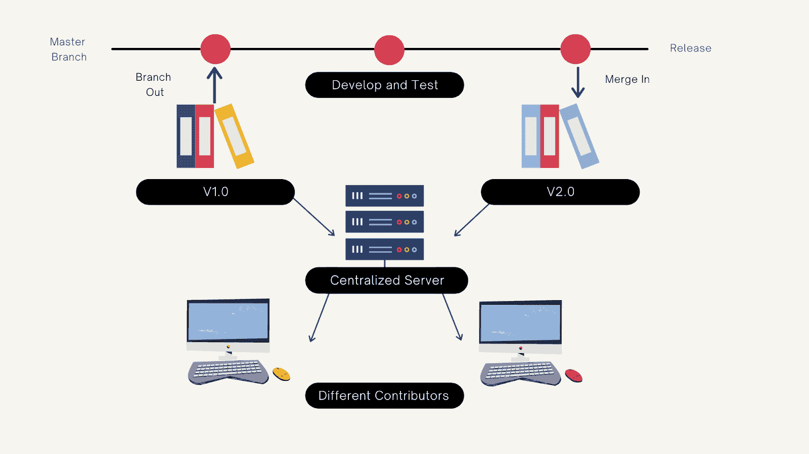
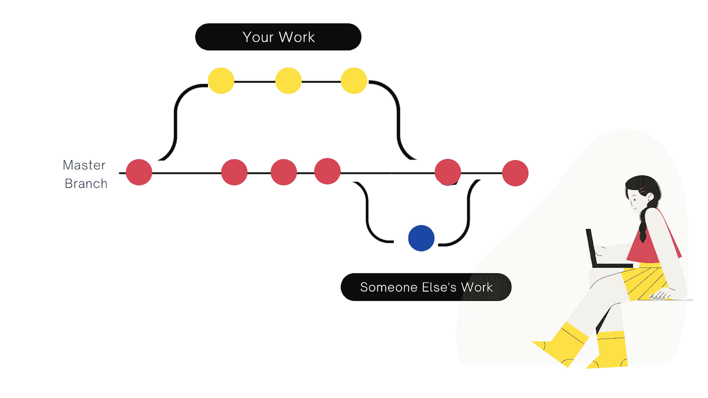

# 机器学习研究者的版本控制指南

> 原文：<https://web.archive.org/web/https://neptune.ai/blog/version-control-guide-for-machine-learning-researchers>

版本控制用于跟踪和管理项目中的变更，包括关键参数、文档、应用程序等等。当多人在同一代码上工作时，版本控制系统(VCS)就派上了用场。没有 VCS，软件项目将会一片混乱。

版本控制也称为**源代码控制、**或**版本控制**。为什么？

## 什么是版本控制？

版本控制是跟踪对代码库所做更改的一种方式。在 ML 中，版本控制系统支持开发人员和数据科学家之间的顺畅协作，并允许您在出现问题时将代码库恢复到任何以前的版本。

VCS 帮助团队在没有太多复杂性的情况下在同一个项目上协作。开发人员和数据科学家可以根据需要查看、管理和合并变更。新的团队成员可以更容易地适应当前的环境。

在机器学习模型上工作，跟踪用于创建模型的训练数据集、超参数、算法选择、架构和管道总是好的。



*Source: Author*

## 版本控制系统的类型

我们将讨论集中式和分布式系统，并详细比较它们。你也可以有一个本地版本控制系统，所有的提交都保存在本地机器上，但是它很容易出错，所以我们不会深入讨论。

### 1.集中式版本控制

在集中式版本控制中，您有一个单一的存储库，其中每个人同时提交和更新代码。当有人更新代码时，团队中的每个人都会知道，并且必须在他们的工作区中更新代码。所做的每一个改变都被传送到一个中央服务器(存储库)。您的更改会直接影响将在生产中使用的主代码。没有批准或合并系统，只是简单的**提交和更新**。


*Source: Author*

*   集中式系统易于理解和管理。
*   你可以接触到大师级的代码，不需要得到最高当局的批准。
*   它可以无缝地处理二进制文件。

使用最多的中央 VCS 系统是 SVN 的 T1 和 T2 的 T3。

### 2.分布式版本控制

在分布式版本控制中，每个开发人员都有自己的存储库和程序副本。当您更新代码时，只有您可以访问它，直到您将它推送到中央存储库或主代码。简单地说，您提交并推动变更，其他团队成员拉动并更新它们。您不必一直依赖中央存储库，您可以将整个代码克隆到您的本地机器上并离线工作。分布式版本控制也有一个中央存储库，但它是权威的。


*Source: Author*

*   更好的绩效和治理，
*   分支和合并比集中式版本控制更容易，
*   你可以离线工作。

最流行的分布式版本控制系统是 [Git](https://web.archive.org/web/20221218082900/https://git-scm.com/) 和 [Mercurial](https://web.archive.org/web/20221218082900/https://www.mercurial-scm.org/) 。

### 集中式和分布式版本控制的差异

| 集中式和分布式 | 分布式版本控制 |
| --- | --- |
| 

初学者容易上手

 | 

对初学者来说复杂的

 |
|  | 

在本地机器上离线工作

 |
| 

这既困难又耗时，并且需要直接与服务器通信。

 | 

更快，因为你不必为每一个命令都与存储库通信。

 |
| 在 CVCS，你不需要把整个历史或者源代码保存到你的本地机器上，所以你节省了大量的空间。 | 

如果项目包含大文件，DVCS 会占用你本地机器更多的时间和空间。

 |
| 如果服务器瘫痪，就没有办法找回代码。 | 如果服务器宕机，你有足够的机器来获取代码，包括你的本地机器。 |

为什么要使用版本控制

## VCS 允许您合并、更改和查看以前对程序所做的所有更改。这是监控程序构建以及开发和生产中的事情的好方法。对于 ML 和 AI 相关的工作，对非二进制文件使用 VCS 很重要，这样数据科学家和 ML 开发人员就可以在一个中心工作，而不会影响其他人的工作。版本控制是机器学习和人工智能领域治理的重要组成部分。

合作

### VCS 让开发人员可以在不同时间、不同地点轻松共享、编辑、查看和合并代码。没有 VCS，事情会变得非常复杂，代码会很快出错。VCS 成为一个公共枢纽或中心，船上的每个人都可以在这里监控项目的进展。

存储版本

### 假设您对程序进行了必要的修改，现在您已经将它合并到生产代码中了。是时候正确地存储那些更改了，**用**正确的版本名**保存文件**(例如- profile-redesign-v102)。如果你添加了又长又复杂的版本名，你将来会迷路的。最好保持简单，采用带有一些语义信息的字母数字格式，以便在需要时可以很容易地跟踪。更新文档在软件世界中非常重要。没有**适当的文档**或自述文件，开发人员就无法跟踪进度。VCS 记录了从第一天开始所做的所有更改，你可以请求任何你想要的版本，并且可以与当前版本进行比较。

审查和备份

### 每次你推送或者合并代码时，你都必须添加**简短的信息**关于做了什么改变。这将有助于每个在程序上工作的人知道这个特定的文件已经被改变了。版本控制系统是**备份你的文件和代码的最好方式**。你可以随时获得完整的**更新代码**，不会有任何问题。

更快的改进

### 当推出一个新版本的机器学习模型时，你开始知道它有一些问题或在特定点上失败了。拥有代码的所有**记录**将帮助您恢复先前的代码，并给你足够的时间来处理问题，同时产品代码保持无 bug。

复杂性

### 使用标准 VCS 时，您只需跟踪代码文件、文档和文件依赖关系。对于机器学习来说，这是一件不同而复杂的事情，你必须跟踪你的数据集、模型和不同的参数。你必须留意哪些数据用于训练，哪些用于测试。大多数时候，ML 项目中使用多种语言和框架工具，因此跟踪依赖关系成为一项关键任务。开发人员需要时间将模型投入生产，直到他们对性能有信心。VCS 帮助开发者在合适的时间推出版本。

管理

### 版本控制是机器学习和人工智能治理的重要组成部分。它帮助公司理解工作流，授予访问权限，执行策略，跟踪和控制所有机器学习工作及其结果。如果管理得当，组织可以收集任何可能影响模型性能的信息。

数据

### 随着时间的推移，数据管道会发生变化。您必须不断训练您的模型，这就是版本控制的范围。您必须跟踪与您的 ML 工作流相关的所有元数据和结果。元数据将帮助您了解数据集中特定值的性质。以正确的格式将所有数据放入模型非常重要，因此元数据必须有正确的版本。

使用 VCS，您可以将数据值连接到特定版本的相应元数据。这有助于开发人员找到数据集和值中的差距。

模型

### 所有的 ML 项目领导者都想提高他们的 ML 模型的准确性。如果事实证明之前的版本更准确，VCS 会让你快速回到那个版本。

连续累计

### 持续集成(CI)是一种将功能分支实现到主代码中的方法，可以自动构建和测试。该流程帮助开发人员定位问题并快速找到解决方案。**快速失败，快速改进—** 这就是 CI 集成帮助您做到的，它提高了您工作流程的质量。

*参见—*[利用机器学习项目改善工作流程的最佳 7 种数据版本控制工具](https://web.archive.org/web/20221218082900/https://neptune.ai/blog/best-7-data-version-control-tools-that-improve-your-workflow-with-machine-learning-projects)

如何做版本控制

## 饭桶

### 最受欢迎的 VCS。世界上大多数开发者都使用 Git。它跟踪对代码文件所做的所有更改，以便您有一个记录。如果当前代码出现问题，您可以很容易地返回到特定的版本。Git 有一个易于管理的协作系统。

Git 的优势:



*Source: Author*

**性能—**这是一个易于维护且可靠的版本控制系统。您可以查看和比较在特定时间内对代码所做的更改，并合并它们。

*   **灵活性**–Git 支持多种开发方法和工作流，旨在处理小型和大型项目。它支持分支和标记操作，以存储对项目所做的每个更改。
*   **广泛接受**–Git 因其可用性和性能标准而被普遍接受。
*   沙箱

### 沙盒是一个团队可以构建、测试和部署程序的环境。在沙盒环境中，代码被分成更小的组或单元。Jupyter Notebook 是 ML 沙盒的最佳工具。有时沙盒环境是测试 IT 解决方案的最佳方式。沙盒在项目**集成、用户演示和测试以及质量保证方面帮助你。**它为机器学习生命周期的每个阶段都提供了功能，而不仅仅是测试阶段。

沙盒环境的优势:

**易于使用的工作流程—**无缝开发、测试和部署版本。您可以只编辑几行代码并测试它们，而无需推送整个文件/项目。

*   **协作**—分享并让每个人了解项目的最新进展至关重要。你可以用很少的权限获得关于程序的反馈和更新。你可以在著名的技术上工作，而不会有任何复杂的架构。
*   **经济高效**–沙盒环境是一种按需付费的服务，因此维护您的工作流程变得很容易，并为您的公司节省了大量资金。
*   数据版本控制

### 数据版本控制(DVC)是一个用于机器学习和数据科学项目的开源工具，这是给你的人工智能项目版本化的最佳方式。它类似于 Git，但是有**选项来跟踪步骤、依赖项、数据文件和更多的**。它帮助您存储大型数据集、模型和文件。

DVC 的好处:

**独立于语言—**ML 流程可以无缝转换为任何语言的可复制管道。

*   **易于安装**–DVC 是一款开源工具，您可以通过简单的命令轻松安装:
*   **数据共享**——你可以在任何云平台上共享你的 ML 数据文件，比如亚马逊网络服务或者谷歌云平台。

```
pip install dvc
```

*   **数据合规性**–根据 Git 拉取请求监控数据修改工作。检查项目完善且不可更改的记录，以了解数据集或模型何时获得批准，以及批准的原因。
*   使用 Neptune 进行版本控制

### Neptune 是为研究和生产团队开发的 MLOps 的元数据存储。它为您提供了一个记录、存储、显示、组织、比较和查询机器学习生命周期中生成的所有元数据的中心。研究人员和工程师使用海王星进行[实验跟踪](/web/20221218082900/https://neptune.ai/experiment-tracking)和模型注册，以控制他们的实验和模型开发。

让我们从初始化 Neptune 开始:

**文件数据版本:**

```
import neptune.new as neptune
run = neptune.init('USER_NAME/PROJECT_NAME',
                   api_token=’ANONYMOUS’)
```

**文件夹数据版本:**

```
from neptunecontrib.versioning.data import log_data_version
FILEPATH = '/path/to/data/my_data.csv'
with neptune.create_experiment():
    log_data_version(FILEPATH)
```

**S3 桶数据版本:** (可以记录版本和具体密钥，类似于文件版本控制)

```
from neptunecontrib.versioning.data import log_data_version
DIRPATH = '/path/to/data/folder'
with neptune.create_experiment():
log_data_version(DIRPATH)
```

**前缀:** (您可以跟踪多个数据源，只需确保在登录前使用前缀)

```
BUCKET = 'my-bucket'
PATH = 'training_dataset.csv'
with neptune.create_experiment():
    log_s3_data_version(BUCKET, PATH)
```

**用子文件夹记录镜像目录快照:** (用 log_image_dir_snapshots 可以记录镜像目录的可视快照；查看[该实验](https://web.archive.org/web/20221218082900/https://ui.neptune.ai/jakub-czakon/examples/e/EX-96/logs)了解详细信息)

```
from neptunecontrib.versioning.data import log_data_version
FILEPATH_TABLE_1 = '/path/to/data/my_table_1.csv'
FILEPATH_TABLE_2 = '/path/to/data/my_table_2.csv'
with neptune.create_experiment():
log_data_version(FILEPATH_TABLE_1, prefix='table_1_')
log_data_version(FILEPATH_TABLE_2, prefix='table_2_')
```

版本控制最佳实践

```
from neptunecontrib.versioning.data import log_image_dir_snapshots
PATH = '/path/to/data/my_image_dir'
with neptune.create_experiment():
log_image_dir_snapshots(PATH)
```

## 使用良好的提交消息

### 一个好的提交消息将帮助其他开发人员和团队成员理解你更新了什么。添加一个简短的信息描述会使事情更容易回顾。

让每一次承诺变得重要

### 确保你的承诺是有目的的，而不仅仅是你工作的备份。添加新功能或修复问题。尽量不要在一次提交中进行多次更改，因为这将很难审查。

在这个过程中，您可能会发现一些 bug，也想修复它们。如果您想一次提交一个文件，下面是针对不同 VCS 的命令:

Git: `git commit filename1 filename2`提交两个命名文件。

*   SVN: `svn commit filename filename2`提交两个文件。它将所有更新的文件提交到目录中。
*   如果您想要保存一个支持多个变更(例如多个特性)的文件，那么您必须在逻辑块中引入它们，并在进行过程中进行提交。每个 VCS 都支持此操作:

Git:将*文件名*存储到一个安全的临时位置，然后运行 git checkout 文件名将*文件名*恢复到其未更改的状态。

*   svn:将*文件名*移动到一个临时位置，然后运行 SVN 更新文件名*T3，将*文件名*恢复到不变的状态。*
*   不要破坏构建或强制提交

### 尝试通过执行完全提交来避免中断构建。您可以为您的提交和新 API 准备测试用例。这有助于其他团队成员在不破坏构建的情况下使用这些文件。假设你正在开发某个 API，它在你的机器上运行得很好，但是在另一台机器上可能会崩溃。另外，如果 VCS 没有推送你的更新或者显示错误信息，最好**不要** **强行提交任何东西**。这可能会打破整个工作流程，把事情搞得一团糟。

审查和分支

### 每当您提交代码并将其推送到中央存储库时，请确保您做了很好的审查。这将帮助您理解提交，并找到提交中的问题或差距。

在许多情况下，分支有助于改进工作流。它有一些缺点，但是如果您使用良好的分支实践，您可以使管理代码、发布、里程碑、问题、新特性等等变得容易。

进行可跟踪的提交

### 出于安全和监控的目的，您需要存储关于提交的信息，比如审阅者评论、关于提交的信息、作者详细信息等等。这将确保如果需要，任何提交都可以被撤销。分析问题后，可以重新应用或更新更改。

结论

## 版本控制系统是监控和跟踪所有代码文件、数据集、依赖项、文档和项目的其他关键资产的变更的最佳方式。

有了 VCS，每个团队成员都在同一个页面上，协作更顺畅，工作流更好，错误更少，开发速度逐渐加快。

额外研究和推荐阅读

### Additional research and recommended reading