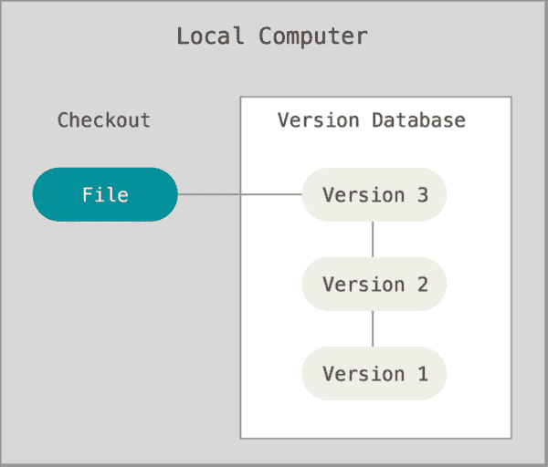
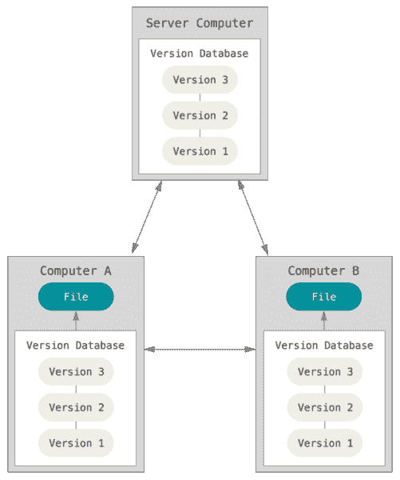

# 机器学习和数据科学的版本控制

> 原文：<https://web.archive.org/web/https://neptune.ai/blog/version-control>

[版本控制](https://web.archive.org/web/20221206003441/https://www.atlassian.com/git/tutorials/what-is-version-control)跟踪和管理相关实体集合中的变更。它记录了一段时间内的更改和修改，因此您可以调用、还原、比较、引用和恢复任何您想要的内容。

版本控制也称为源代码控制或修订控制。每个版本都有一个时间戳，以及对文档、计算机程序、文件等进行修改的人的 ID。

各种应用程序类型都嵌入了版本控制的概念，如 Sharepoint、Word、电子表格、Photoshop 等等。版本控制防止了并发工作中的冲突，并为更好的决策和促进兼容性提供了一个平台。

版本控制系统(VCM)作为独立的软件工具运行，它实现了一种系统化的方法来跟踪、记录和管理对代码库所做的更改。它促进了平滑和连续的变化流。

在本文中，我们将从不同的角度探索版本控制意味着什么。

## 版本控制系统的类型

版本控制系统有三种主要类型:

1.  本地版本控制系统
2.  集中式版本控制系统
3.  分布式版本控制系统

### 本地版本控制系统

这个版本控制系统由您计算机上的本地数据库组成，该数据库将每个文件更改存储为一个补丁(文件之间以唯一格式的差异)。要重新创建文件，需要随时添加各种补丁。

这种系统的一个流行的例子是修订控制系统(RCS ),至今仍分布在许多计算机中。这种系统的一个缺点是变化的本地存储。如果本地磁盘/数据库损坏，所有修补程序都会受到影响。此外，在这个系统中的协作是复杂的，几乎是不可能的。

*Local Version Control System | Source: [Gitlab](https://web.archive.org/web/20221206003441/https://about.gitlab.com/)*

### 集中式版本控制系统

该系统有一个存储不同文件版本的中央单一服务器。该系统由服务器和客户端组成。多个客户端可以同时访问服务器上的文件，将文件的当前版本从服务器下载到本地计算机，反之亦然。

只有一个存储库包含所有的历史。这种方法支持协作，并且很容易跟踪项目中团队成员的角色。每一个更改都传到中央服务器，并立即影响主代码，因为这是一个简单的提交和更新过程，所以主代码将投入生产。

由于所有东西都存储在一个中央服务器上，如果服务器被损坏或破坏，除了人们碰巧在本地机器上拥有的单个快照之外，丢失项目的整个历史的风险很高。集中式版本控制系统的例子有[微软 Team Foundation Server](https://web.archive.org/web/20221206003441/https://azure.microsoft.com/en-us/services/devops/server/) (TFS)、 [Perforce](https://web.archive.org/web/20221206003441/https://www.perforce.com/) 和 [Subversion](https://web.archive.org/web/20221206003441/https://subversion.apache.org/) (SVN)。

*Centralized Version Control Systems | Source: [Gitlab](https://web.archive.org/web/20221206003441/https://about.gitlab.com/)*

### 分布式版本控制系统

在这个系统中，没有中央存储库，而是多个存储库。每个客户端都有自己的服务器，并完全镜像/克隆存储库，包括其整个历史。这个系统使得每个合作者都是整个项目的本地副本，使得本地和离线工作都很容易。

提交变更对于客户端的本地存储库是唯一的，并且需要将其推送到中央存储库(这是权威的)。为了让其他团队成员获得变更，他们必须在有效地进行更新之前提取那些变更。

如果服务器变得不可用、损坏或被破坏，任何客户端的存储库(正确的副本)可以将项目版本的副本分发或发送回服务器或任何其他客户端。分布式版本控制系统的例子有 [Git](https://web.archive.org/web/20221206003441/https://git-scm.com/) 和 [Mercurial](https://web.archive.org/web/20221206003441/https://www.mercurial-scm.org/) 。

*Distributed Version Control Systems | Source: [Gitlab](https://web.archive.org/web/20221206003441/https://about.gitlab.com/)*

## 版本控制系统的好处

*   高效的团队协作和并发性，因为多个人可以同时在一个给定的项目上工作。分支和合并的概念推动了这种合作。
*   对给定项目的所有变更/修改的可追溯性的访问。这种可追溯性支持根本原因分析、取证分析以及针对停机、崩溃或数据丢失的保险。它帮助管理源代码和资产。
*   它促进团队同时工作的有效整合，并减少错误和冲突的可能性。
*   它作为跨数字资产、团队和源代码的单一真实来源(SSOT)。
*   它使客户能够利用多台计算机来处理一个项目。
*   它提高了开发速度，因为在持续集成(CI)的帮助下，改进被更快地合并。它还通过与团队结构更好的沟通来加速产品交付。

## 软件工程与数据科学中的版本控制

软件工程和数据科学没什么不同。有一些适度重叠和相互关联的领域在许多方面是相似的。其中一个相似之处是版本控制的概念。

在软件工程中，版本控制系统(VCS)管理、跟踪和存储源代码、工件(软件开发的副产品)和文档的历史和状态。如今，软件开发人员逐渐地将他们的项目提交给一个版本控制系统，如 [Git](https://web.archive.org/web/20221206003441/https://en.wikipedia.org/wiki/Git) ，通常带有有意义的提交消息。版本化源代码是标准做法。

另一方面，数据科学更多的是一种探索性的工作方式。将数据科学产品化包括将探索性分析的见解转化为可扩展的模型，以推动数据和人工智能驱动的产品以及提供价值的服务的构建和发展。

在将这些产品和服务产品化的过程中，这些工件变得比依赖于数据集、模型、指标和参数的文件更加复杂。你必须了解各种工件的变化，以构建可靠和健壮的数据和人工智能驱动的应用程序。

为了理解数据科学中的版本控制和各自的工件，让我们使用一个激励性的例子——推荐系统来进一步讨论。

推荐系统是信息过滤系统，它试图向最终用户推荐相关的和感兴趣的信息。该建议考虑知识和数据，以充分预测最终用户将分配给项目的偏好或评级。

推荐系统过滤大量的内容，并向用户提供个性化的推荐。当我们浏览网飞、Youtube、Spotify、亚马逊、Linkedin、Pinterest 等网站时，我们一直在使用它们。

网飞有一个强大的推荐系统，占据了 T2 80%的顾客观看的内容。机器学习使用跨领域的数据输入来推动这些建议:

*   用户的人口统计数据，如年龄、性别、位置和注册时选择的喜爱内容
*   用于流式播放电影的设备类型
*   电影的完成率和时间
*   搜索和结果的频率
*   重新看电影
*   电影暂停、倒带或快进
*   信用计算
*   观看节目的性质
*   观看历史和时间戳
*   评级
*   浏览和滚动行为

推荐引擎基于用户偏好使用一些预定义的推荐聚类来过滤标题。机器学习组件频繁更新，并启动各种实验。随着用户不断生成数据，模型的新更新可能每天或每隔几分钟发布一次。

不同的用户倾向于将其他模型的结果视为 A/B 实验或 canary 发布的一部分。这些更新挑战了找出哪个模型做出了特定的预测，或者哪个数据产生了特定的模型。

让我们讨论一个假设的情况，其中网飞推荐引擎向未成年人推荐 18+评级的电影。网飞机器学习工程师将很快开始调查这种推荐模式，因为它带来了一个潜在的问题，可能会对公司品牌产生负面影响，并可能吓跑客户。

首先，探讨这个问题，需要先重现。对于存储在某个数据库中的客户数据，第一个问题是:如果我们再次使用相同的输入，我们会得到相同的结果吗？我们能重现结果吗？如果不能，为什么？

机器学习操作中是否存在不确定性，如预处理、特征选择/提取或工作流的其他部分？或者预测被调查实例的模型有更新吗？

我们需要跟踪和识别所使用的模型版本。我们需要知道我们是否在进行实验，以及客户是否参与了任何可能产生不同模型的特定实验。我们还能接触到那个模型吗？我们是否记录了测试阶段，谁批准了发布？模特被链子拴着吗？这些只是我们可以在模型方面提出的一些问题。

**假设我们找到了做出预测**的模型，这将引出更多的问题，比如用什么数据来训练和测试模型？机器学习库的所有版本是什么？使用了哪些超参数来调整模型？如果要重复培训，我们会得到同样的模型吗？

现在，让我们进一步假设我们已经确定了用于训练的确切数据集；这也会引发一些问题。数据的来源是什么？什么版本的代码带有哪些预处理步骤？数据集是另一个模型的输出吗？谁参与了数据修改？

监控和追溯数据、模型和管道代码的来源和血统至关重要。无论是出于问责、调试还是调查目的，澄清以下问题(不仅仅是这些)都是至关重要的:

*   我们能复制我们正在调查的观察结果吗？
*   我们能识别生产中不同模型的输入吗？
*   我们能跟踪生产中使用的不同模型版本吗？
*   什么数据被用来训练和测试一个给定的模型？
*   我们能重建模型吗？
*   是否应用了模型链？如果是，它们各自的版本是什么，基于哪些数据？
*   数据来源是什么？
*   数据是如何预处理的？
*   用于调整模型的超参数是什么？
*   模型的学习代码是什么？

## 版本控制数据

在我们用不同的策略探索数据版本化之前，让我们讨论一下什么是“数据起源”。数据起源只是简单地跟踪数据的起源和历史上的变化。数据起源也称为数据血统。

这些变化来自机器学习管道中的处理/编辑步骤，如数据获取、合并、清理、转换学习和部署。数据来源不足会产生“可见性债务”(对数据依赖和历史的模糊可见性)。

数据来源还包括跟踪谁进行了数据更改或修改的治理和管理。数据由作为输入的独立变量组成。我们还需要跟踪训练和测试数据中的特性是如何变化的，因此产生了特性起源的概念。

对数据进行版本控制的一些策略如下:

*   **缓存数据集的副本:**在这里，对数据集的每次更改都会存储整个数据集的新副本。这种策略提供了对单个数据版本的轻松访问，但是对大数据的小更改的内存限制将需要额外的存储。通过给定目录中文件的命名约定，这种策略很容易实现。VCS 使用这种策略的一个很好的例子是 [Git](https://web.archive.org/web/20221206003441/https://git-scm.com/) 。
*   **存储数据集之间的差异:**由于上面讨论的内存限制，这种策略只存储版本之间的变化。这些更改或差异存储在修补程序中，因此恢复到特定版本需要将所有修补程序添加到数据集中。VCS 使用这种策略的一些好例子是 [Mercurial](https://web.archive.org/web/20221206003441/https://www.mercurial-scm.org/) 和 [RCS](https://web.archive.org/web/20221206003441/https://www.gnu.org/software/rcs/) 。
*   **存储单个记录上的更改:**这里，不是保持对整个数据集的修改，而是关注单个实例/记录。这种策略是通过让每个记录都有单独的历史文档来跟踪每个记录的变化来实现的。实现方法是为每个记录创建一个单独的文件，该文件组合起来形成一个“每个记录的单独历史”目录，该目录跟踪单个零件的所有更改。几个数据库可以跟踪个人级别(或基于案例)的变更的起源信息。这种方法很容易在结构化数据上实现。利用这种方法的一个很好的例子是[亚马逊 S3 桶](https://web.archive.org/web/20221206003441/https://aws.amazon.com/s3/)。
*   **仅附加数据集中的偏移:**这与现有数据不可变且新数据的变化需要被附加到现有数据的理论一起工作。这里，文件大小(偏移量)用于跟踪变化。这种策略需要用于只附加数据，如事件流或日志文件。这是最简单的数据版本化形式。使用这种技术的系统的一个很好的例子是[阿帕奇卡夫卡](https://web.archive.org/web/20221206003441/https://kafka.apache.org/)。
*   **版本化管道以重新创建衍生数据集:**该策略涉及版本化原始数据集和机器学习管道中的所有过程/转换步骤(数据清理、集成、争论、平滑、编码和归约阶段)。按需重新创建数据比保存数据更有效。

策略的选择取决于数据的大小、结构和更新频率。关于存储数据(存储空间)和重建数据(计算工作量)的成本，在不同的方法之间存在权衡。将可用的元数据与数据一起版本化也是最佳实践。

## 版本化机器学习模型

由于涉及快速实验和迭代的数据科学或机器学习项目的探索性和协作性，跟踪模型历史对于理解和改善这些开发模型的性能至关重要。就像数据一样，模型起源是关于跟踪模型输入、超参数，以及学习具有依赖性、算法选择和架构的代码。这些模型通常是大型二进制数据文件，因为它序列化其参数。

如前所述，机器学习操作是一个寻找最佳模型的迭代过程。在大多数情况下，超参数或数据的微小变化会导致几个模型参数的变化，从而导致不同的模型。

不同的模型不共享结构或参数，因为它们可以通过各种机器学习算法来创建，所以基于它们作为数据的差异来跟踪模型不会完全用于有意义的分析或存储。因此，跟踪这些二进制文件的版本只需要像 [Git](https://web.archive.org/web/20221206003441/https://git-scm.com/) 和 [DVC](https://web.archive.org/web/20221206003441/https://dvc.org/) 这样的存储副本策略就足够了。

## 版本控制机器学习管道

机器学习流水线是一种工作流，具有各种相互依赖的顺序阶段，这些阶段导致机器学习模型。这里，我们希望跟踪不同阶段的学习代码，例如数据预处理、特征提取和工程、模型训练和超参数优化。这种版本控制对于模型起源是至关重要的。

这些管道代码和超参数表现为脚本文件和配置文件，可以像传统源代码一样进行版本控制。跟踪框架和库版本对于确保可再现性和避免依赖关系的浮动版本也是至关重要的。这些库和框架依赖项可以使用包管理器(如 [pip](https://web.archive.org/web/20221206003441/https://pypi.org/project/pip/) 来创建 requirements.txt 文件)进行版本控制。

此外，管道代码和依赖关系也可以打包在虚拟执行环境中，以确保跟踪环境变化。Docker 就是一个很好的例子。

## 版本控制机器学习实验

机器学习中的实验是在不同条件下的各种运行，例如系统地改变变量和参数。它由代码、数据和模型元素组成，这些元素可以被编码成管道代码或元数据。不过，在这里，额外的重点是比较结果和可视化实验结果。一些实验适用于笔记本(如 Jupyter notebook)，而其他时候更精确的跟踪可能会有所帮助，特别是在探索建模选项及其交互时。

* * *

[Neptune](https://web.archive.org/web/20221206003441/https://neptune.ai/) 是一个很好的例子，它在脚本(Python，R 等)中帮助有效的[实验跟踪](/web/20221206003441/https://neptune.ai/experiment-tracking)。)和笔记本(Jupyter notebook，Google Colab，AWS SageMaker)。

* * *

## 机器学习中再现性和可复制性的概念

“再现性”是科学中的一个中心话题，有助于验证研究结果，改进他人的工作，并避免重新发明轮子。它可以被看作是重新创建一个与原始实验差异较小的实验，并且仍然获得相同的定性和定量结果的能力。

根据美国国家科学基金会(NSF)的说法，“再现性是指研究人员使用与原研究人员相同的材料复制先前研究结果的能力”。

这个概念验证结果并确保计算的透明性、一致性、可信度、审计和指导调试。当复制发表在机器学习论文中的结果时，很容易观察到这种概念的低效。根据 Goodman 等人[1]，有三种类型的再现性:

1.  **方法再现性:**这是用相同的数据和工具尽可能精确地实施实验和计算方法，以获得与原始工作相同的结果的能力。
2.  **结果重现性:**在新的独立研究中产生确证结果的能力遵循相同的实验程序。
3.  **推论再现性:**不同研究者在调查一组结果后得出同一组推论的能力。

另一方面，“可复制性”是通过完全相同的实验来复制结果的能力。可复制性要求工作流中没有非确定性。

这两者在数据科学中都很重要，因为再现性有助于在各种环境中找到一致的结果，并提高系统的可信度、透明度和信心。而可复制性可以指导 apt 调查和调试，因为工件可以被重新创建和理解。

版本控制的各个方面极大地促进了可再现性和可复制性。这个概念也增加了每个持续集成或持续交付周期(CI/CD)的价值，因为它有助于平稳的活动平稳地流动。良好的编程和版本管理实践对于机器学习中的再现性和可复制性的文档化是必不可少的。

## 结论

我们已经探索了与数据科学/机器学习中的指南版本化相关的各种概念，涵盖了监控和跟踪数据模型、管道代码和实验中的变化的策略。希望这能帮助你理解版本控制是怎么回事。感谢阅读！

### 参考

1.  古德曼、史蒂文·n、丹尼尔·法内利和约翰·帕·约安尼迪斯。“研究再现性是什么意思？”科学转化医学 8.341 (2016): 341ps12-341ps12
2.  技术债务和可见性债务:斯卡利，大卫，加里霍尔特，丹尼尔戈洛文，尤金达维多夫，托德·菲利普斯，迪特马尔埃布纳，维奈乔德里，迈克尔·杨，江泽龙克雷斯波，丹丹尼森。“[机器学习系统中隐藏的技术债务](https://web.archive.org/web/20221206003441/http://papers.nips.cc/paper/5656-hidden-technical-debt-in-machine-learning-systems.pdf)”。神经信息处理系统进展，第 2503–2511 页。2015.
3.  [https://www . kdnugges . com/2019/09/version-control-data-science-tracking-machine-learning-models-datasets . html](https://web.archive.org/web/20221206003441/https://www.kdnuggets.com/2019/09/version-control-data-science-tracking-machine-learning-models-datasets.html)