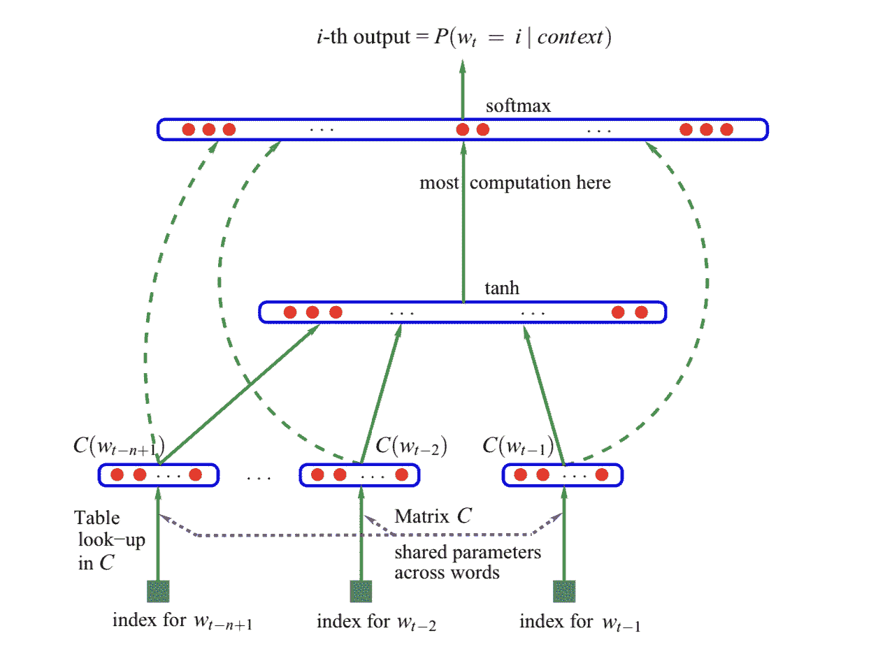
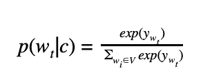

# 单词嵌入终极指南

> 原文：<https://web.archive.org/web/https://neptune.ai/blog/word-embeddings-guide>

[单词嵌入](https://web.archive.org/web/20230213062731/https://www.tensorflow.org/tutorials/text/word_embeddings)是自然语言处理(NLP)中最常用的技术之一。人们常说，如果没有单词嵌入，SOTA 模型的性能和能力就不可能实现。正是因为单词嵌入，像 [RNN](/web/20230213062731/https://neptune.ai/blog/recurrent-neural-network-guide) s，LSTMs，ELMo，[伯特](/web/20230213062731/https://neptune.ai/blog/bert-and-the-transformer-architecture-reshaping-the-ai-landscape)，阿尔伯特，GPT-2 到最近的 GPT-3 这样的语言模型以惊人的速度进化。

这些算法速度快，可以高精度地生成语言序列和其他下游任务，包括**上下文理解、语义**和**句法属性**、**以及**、**词与词之间的线性关系**。****

核心上，这些模型使用嵌入作为从文本或语音序列中提取模式的方法。但是他们是怎么做到的呢？单词嵌入背后的确切机制和数学原理是什么？

在本文中，我们将探索一些早期的神经网络技术，这些技术让我们能够为自然语言处理构建复杂的算法。对于某些主题，会有一个论文的链接和一个附带的 colab 笔记本，这样你就可以通过尝试来理解这些概念。这样做会帮助你学得更快。

我们将涉及的主题:

1.  **[什么是单词嵌入？](#word-embeddings)**
2.  **[神经语言模型](#neural-language-model)**
3.  **[word 2 vec](#word2vec)**
    1.  skip 程序
    2.  连续的单词袋
4.  softmax 功能上的
5.  **[提高近似值](#approximation)**
    1.  基于 Softmax 的方法
        1.  分级 Softmax
    2.  基于抽样的方法
        1.  噪声对比估计
        2.  负采样

## 什么是单词嵌入？

单词嵌入是以数字方式表示单词和整个句子的一种方式。我们知道计算机理解数字语言，所以我们试图将一个句子中的单词编码成数字，这样计算机就可以阅读和处理它。

但是阅读和处理并不是我们希望计算机做的唯一事情。我们还希望计算机在句子中的每个单词之间建立关系，或者在文档中与其他单词建立关系。

我们希望单词嵌入能够捕获段落或之前句子的上下文，同时捕获语义和句法属性以及它们的相似性。

例如，如果我们取一个句子:

“猫躺在地板上，**狗**在吃东西”，

…然后我们可以把这两个主语(猫和狗)在句子中调换一下，使其成为:

“那只**狗**躺在地板上，那只**猫**在吃东西”。

在这两个句子中，保留了语义或意义相关的关系，即猫和狗都是动物。这句话很有道理。

同样，句子也保留了句法关系，即基于规则的关系或语法。

为了实现这种语义和句法关系，我们需要的不仅仅是将句子或文档中的一个单词映射成简单的数字。我们需要这些数字的一个更大的表示，能够表示语义和语法属性。

我们需要向量。不仅如此，还有**可学习的**向量。

在数学意义上，单词嵌入是单词的参数化函数:


其中是参数，W 是句子中的单词。

很多人也将单词嵌入定义为以向量形式的单词的密集表示。

例如，单词猫和狗可以表示为:

*W(cat) = (0.9，0.1，0.3，-0.23 … )*

*W(狗)= (0.76，0.1，-0.38，0.3 … )*

现在，假设来说，如果模型能够保持上下文相似性，那么两个单词在向量空间中将是接近的。

到目前为止，我们已经处理了两个单词(猫和狗)，但如果有更多的单词呢？工作嵌入模型的工作是聚集相似的信息并在它们之间建立关系。

如您所见，单词嵌入将相似的单词聚集在一起。

现在有很多浅层算法可以很好地用于聚类。为什么我们需要神经网络？

最大的误解之一是单词嵌入需要深度神经网络。当我们构建不同的单词嵌入模型时，您会看到，对于所有的嵌入，模型都是浅层神经网络，有些还是线性模型。

我们使用神经网络来创建单词嵌入的原因是:

1.  这有助于在嵌入空间中找到最近的邻居。
2.  它可以用作监督学习任务的输入。
3.  它创建了离散变量的映射，例如从单词到向量，再到连续变量的映射。
4.  它还解决了维数灾难。

## 神经语言模型

单词嵌入是由 Bengio 等人提出的。艾尔。(2001，2003)来解决所谓的**维数灾难**，这是**统计语言建模**中的一个常见问题。

事实证明，本吉奥的方法可以训练一个神经网络，使得每个训练句子都可以向模型提供一些语义上可用的相邻单词，这被称为单词的**分布式表示** **。**神经网络没有建立不同单词之间的关系，但它也保留了语义和句法属性方面的关系**。**



*Source: Bengio et. al. 2003*

这引入了神经网络架构方法，为许多当前方法奠定了基础。

这个神经网络有三个组成部分:

1.  生成单词嵌入的**嵌入层**，参数跨单词共享。
2.  一层或多层的**隐藏层** r，这给嵌入引入了非线性。
3.  一个 **softmax 函数**，产生词汇表中所有单词的概率分布。

让我们来理解一个神经网络语言模型是如何在代码的帮助下工作的。

(这里有[笔记本](https://web.archive.org/web/20230213062731/https://colab.research.google.com/drive/12TQ4CmY6jUnFlQZFnKenmKL3UdTkcatx?usp=sharing)和[原始论文](https://web.archive.org/web/20230213062731/https://www.jmlr.org/papers/volume3/bengio03a/bengio03a.pdf)的链接)

第一步:索引单词。我们从索引单词开始。对于**句子中的每个单词**，我们会给它分配一个数字。

```
word_list = " ".join(raw_sentence).split()
word_list = list(set(word_list))
word2id = {w: i for i, w in enumerate(word_list)}
id2word = {i: w for i, w in enumerate(word_list)}
n_class = len(word2id)
```

第二步:建立模型。

我们将完全按照论文中的描述来构建模型。

```
class NNLM(nn.Module):
   def __init__(self):
       super(NNLM, self).__init__()
       self.embeddings = nn.Embedding(n_class, m) 

       self.hidden1 = nn.Linear(n_step * m, n_hidden, bias=False)
       self.ones = nn.Parameter(torch.ones(n_hidden))

       self.hidden2 = nn.Linear(n_hidden, n_class, bias=False)
       self.hidden3 = nn.Linear(n_step * m, n_class, bias=False) 

       self.bias = nn.Parameter(torch.ones(n_class))

   def forward(self, X):
       X = self.embeddings(X) 
       X = X.view(-1, n_step * m) 
       tanh = torch.tanh(self.d + self.hidden1(X)) 
       output = self.b + self.hidden3(X) + self.hidden2(tanh) 
       return output
```

我们将从初始化一个嵌入层开始。嵌入层是一个查找表。

一旦单词的输入索引通过一个嵌入层被嵌入，它就会通过第一个隐藏层，并添加偏向。这两个函数的输出然后通过一个双曲正切函数。

如果您还记得原始论文中的图表，那么来自嵌入层的输出也被传递到最终的隐藏层，在那里 tanh 的输出被加在一起。

```
output = self.b + self.hidden3(X) + self.hidden2(tanh)
```

现在，在最后一步，我们将计算整个词汇的概率分布。

**第三步:损失和优化函数。**

现在我们已经有了模型的输出，我们需要确保我们通过 softmax 函数传递它以获得概率分布。

我们使用交叉熵损失。

```
criterion = nn.CrossEntropyLoss()
```

交叉熵损失由两个方程组成:对数 softmax 函数和负对数似然损失或 NLLLoss。前者计算 softmax 归一化，而后者计算负对数似然损失。

对于优化，我们使用 Adam 优化器。

第四步:训练。

最后，我们训练模型。

简而言之，单词嵌入可以被定义为单词在低维空间中以向量形式的密集表示。这些嵌入伴随着 l 个**可学习向量，或者参数化函数**。它们使用损失函数在反向传播过程中更新自己，并试图找到单词之间的良好关系，保留语义和突触属性。

*“事实证明，基于神经网络的模型明显优于基于统计的模型”* **米科洛夫等人。艾尔。(2013)** 。

## Word2Vec

Bengio 介绍的方法为 NLP 研究人员提供了新的机会来修改技术和架构本身，以创建一种计算成本更低的方法。**为什么？**

Bengio 等人提出的方法从词汇表中提取单词，并将其输入具有嵌入层、隐藏层和 softmax 函数的前馈神经网络。

这些嵌入有相关联的可学习向量，这些向量通过反向传播来优化自身。本质上，架构的第一层产生单词嵌入，因为它是一个浅层网络。

这种架构的问题在于隐藏层和投影层之间的计算开销很大。原因很复杂:

1.  投影中产生的值是**密集**。
2.  隐藏层为词汇表中的**所有单词计算概率分布。**

为了解决这个问题，研究人员(Mikolov 等人在 2013 年)提出了一个名为**‘word 2 vec’**的模型。

Word2Vec 模型本质上解决了本吉奥的 NLM 问题。

它完全删除了隐藏层，但投影层是所有单词共享的，就像 Bengio 的模型一样。缺点是，如果数据较少，这个没有神经网络的简单模型将无法像神经网络一样精确地表示数据。

另一方面，对于更大的数据集，它可以在嵌入空间中精确地表示数据。与此同时，它还降低了复杂性，并且该模型可以在更大的数据集中进行训练。

Mikolov 等人在 2013 年提出了两个模型:

1.  连续词袋模型
2.  连续跳格模型

### 连续词袋模型

连续词袋(Bag-of-Words)或 CBOW 模型基本上在目标词(wt)之前和之后取' *n'* 个词，并预测后者。 *n* 可以是任何数字。

例如，如果 n=2，句子是“*狗正在公园里玩耍*”，那么输入到模型中的单词将是(【the，dog，is，in，the，park】)，后面是目标单词“**正在玩耍“**”。

该模型通过计算 **log2(V)** 消除了计算词汇表中所有单词的概率分布的复杂性，其中 V 是词汇表的大小。因此，这种模式更快更有效。

让我们借助代码来理解 CBOW 模型是如何工作的。

(这里有[笔记本](https://web.archive.org/web/20230213062731/https://colab.research.google.com/drive/1Jr3hdPt_tC40cf9lvIS2yRnETdxz0PCa?usp=sharing)和[原始论文](https://web.archive.org/web/20230213062731/https://arxiv.org/abs/1310.4546)的链接)

首先，我们不会将单词编码方法改为数字。那将保持不变。

**第一步:定义一个函数，用目标词左右 n 个词创建一个上下文窗口。**

```
def CBOW(raw_text, window_size=2):
   data = []
   for i in range(window_size, len(raw_text) - window_size):
       context = [raw_text[i - window_size], raw_text[i - (window_size - 1)], raw_text[i + (window_size - 1)], raw_text[i + window_size]]
       target = raw_text[i]
       data.append((context, target))

   return data
```

该函数应该有两个参数:数据和窗口大小。窗口大小将定义我们应该从右边和左边获取多少单词。

for 循环:for i in range(window_size，len(raw _ text)–window _ size):从窗口大小开始遍历一个范围，即 2 表示将忽略句子中索引 0 和 1 中的单词，并在句子结束前结束 2 个单词。

在 for 循环中，我们尝试分离上下文和目标单词，并将它们存储在一个列表中。

例如，如果句子是“*狗在吃东西，猫躺在地板上*”，带有窗口 2 的 CBOW 将考虑单词“*”、“狗”、“吃东西”*和*“和”。*本质上使目标词‘是’。

设 i =窗口大小= 2，则:

```
context = [raw_text[2 - 2], raw_text[2 - (2 - 1)], raw_text[i + (2 - 1)], raw_text[i + 2]]

target = raw_text[2]

```

让我们调用该函数并查看输出。

```
data = CBOW(raw_text)
print(data[0])
```

```
Output:
(['The', 'dog', 'eating', 'and'], 'is')
```

第二步:建立模型。

构建 CBOW 类似于我们之前构建的 NNLM，但实际上要简单得多。

在 CBOW 模型中，我们将隐藏层减少到只有一层。所以我们总共有:一个嵌入层，一个穿过 ReLU 层的隐藏层，和一个输出层。

```
class CBOW_Model(torch.nn.Module):
   def __init__(self, vocab_size, embedding_dim):
       super(CBOW_Model, self).__init__()

       self.embeddings = nn.Embedding(vocab_size, embedding_dim)
       self.linear1 = nn.Linear(embedding_dim, 128)
       self.activation_function1 = nn.ReLU()

       self.linear2 = nn.Linear(128, vocab_size)

   def forward(self, inputs):
       embeds = sum(self.embeddings(inputs)).view(1,-1)
       out = self.linear1(embeds)
       out = self.activation_function1(out)
       out = self.linear2(out)
       return out
```

这个模型非常简单。上下文词索引被送入嵌入层，然后通过隐藏层，接着是非线性激活层，即 ReLU，最后我们得到输出。

**第三步:损失和优化函数。**

类似于 NNLM，我们使用同样的技术来计算词汇表中所有单词的概率分布。nn。CrossEntropyLoss()。

对于优化，我们使用随机梯度下降。你也可以使用 Adam 优化器。在 NLP 中，Adam 是首选的优化器，因为它比 SGD 收敛得更快。

```
optimizer = torch.optim.SGD(model.parameters(), lr=0.01)
```

**第四步:训练**

培训与 NNLM 模式相同。

```
for epoch in range(50):
   total_loss = 0

   for context, target in data:

       context_vector = make_context_vector(context, word_to_ix)

       output = model(context_vector)

       target = torch.tensor([word_to_ix[target]])
       total_loss += loss_function(output, target)

   optimizer.zero_grad()
   total_loss.backward()
   optimizer.step()
```

make_context_vector 把单词变成数字。

值得注意的是，这篇论文的作者发现，NNLM 保留了相似词之间的线性关系。比如*【国王】**【王后】*与*【男人】**【女人】*相同，即 NNLM 保留了性别线性。

同样，CBOW 等模型以及我们接下来将讨论的任何神经网络模型都将保持线性关系，即使我们在神经网络中明确定义了非线性。

### 连续跳格模型

连续跳格，或跳格，类似于 CBOW。它不是预测目标单词(wt)，而是通过上下文预测它周围的单词。训练目标是学习擅长预测邻近单词的表示或嵌入。

还需要*“n”*个单词。例如，如果 n=2，句子是“*狗在公园里玩*”，那么输入到模型中的单词将是**在玩**，目标单词将是(狗在公园里)。

让我们借助代码来理解跳格模型是如何工作的。

(这里有[笔记本](https://web.archive.org/web/20230213062731/https://colab.research.google.com/drive/1lLRH5BrSD8SWlnDQGWYGxj0WWBUfwg5l?usp=sharing)和[原始论文](https://web.archive.org/web/20230213062731/https://papers.nips.cc/paper/5021-distributed-representations-of-words-and-phrases-and-their-compositionality.pdf)的链接)

skipgram 模型与 CBOW 模型相同，但有一点不同。区别在于创造语境和目标词。

**步骤 1:设置目标和上下文变量。**

由于 skipgram 只需要一个上下文单词和 n 个目标变量，我们只需要从前面的模型中翻转 CBOW。

```
def skipgram(sentences, window_size=1):
   skip_grams = []
   for i in range(window_size, len(word_sequence) - window_size):
       target = word_sequence[i]
       context = [word_sequence[i - window_size], word_sequence[i + window_size]]
       for w in context:
           skip_grams.append([target, w])

   return skip_grams
```

如你所见，功能几乎相同。

这里你需要明白，当窗口大小为 1 时，我们在目标词前后取一个词。

当我们调用该函数时，输出如下所示:

```
print(skipgram(word_sequence)[0:2])
```

```
Output:
[['my', 'During'], ['my', 'second']]
```

可以看到，目标词是*‘我的’*，两个词是*‘期间’*和*‘第二’*。

本质上，我们试图创建一对单词，使得每对单词都包含一个目标单词。根据上下文窗口，它将包含相邻的单词。

第二步:建立模型。

这个模型非常简单。

```
class skipgramModel(nn.Module):
   def __init__(self):
       super(skipgramModel, self).__init__()
       self.embedding = nn.Embedding(voc_size, embedding_size)
       self.W = nn.Linear(embedding_size, embedding_size, bias=False)
       self.WT = nn.Linear(embedding_size, voc_size, bias=False)

   def forward(self, X):
       embeddings = self.embedding(X)
       hidden_layer = nn.functional.relu(self.W(embeddings))
       output_layer = self.WT(hidden_layer)
       return output_layer
```

损失函数和优化保持不变。

```
criterion = nn.CrossEntropyLoss()
optimizer = optim.Adam(model.parameters(), lr=0.001)
```

一旦我们定义了一切，我们就可以训练模型了。

```
for epoch in range(5000):
        input_batch, target_batch = random_batch()
        input_batch = torch.Tensor(input_batch)
        target_batch = torch.LongTensor(target_batch)

        optimizer.zero_grad()
        output = model(input_batch)

        loss = criterion(output, target_batch)
        if (epoch + 1) % 1000 == 0:
            print('Epoch:', '%04d' % (epoch + 1), 'cost =', '{:.6f}'.format(loss))

        loss.backward()
        optimizer.step()
```

skip-gram 模型增加了计算的复杂性，因为它必须根据相邻单词的数量来预测相邻的单词。距离较远的单词往往与当前单词的相关性稍低。

到目前为止的总结:

1.  **神经网络语言模型** (NNLM)或 Bengio 的模型优于早期的统计模型，如 n-gram 模型。
2.  NNLM 还解决了维数灾难，并通过其分布式表示保留了上下文，语言规则和模式。
3.  NNLM 计算量很大。
4.  Word2Vec 模型通过移除隐藏层和共享权重来解决计算复杂性
5.  Word2Vec 的缺点是它没有神经网络，这使得它很难表示数据，但优点是如果它可以在大量数据上训练，那么因为它比神经网络更有效，所以它可以计算非常精确的高维单词向量。
6.  Word2Vec 有两个型号:CBOW 和 Skipgram。前者比后者快。

## 关于 softmax 函数

到目前为止，您已经看到了 **softmax 函数**如何在预测给定上下文中的单词时发挥重要作用。但是它有一个复杂的问题。

回想一下 softmax 函数的等式:



其中*w[t]是目标单词， *c* 是上下文单词， *y* 是每个目标单词的输出。*

如果查看上面的等式，当预测值的数量较高时，softmax 函数的复杂性就会增加。如果 *i=3，*，那么 softmax 函数将返回三个类别的概率分布。

但是，在自然语言处理中，我们通常要处理成千上万的单词。获得这么多单词的概率分布会使计算变得非常昂贵和缓慢。

请记住，softmax 函数返回精确的概率分布，因此随着参数的增加，它们的速度会变慢。对于每个单词( *w [t]* )，它在分母中对整个词汇表求和。

那么，有什么不同的方法可以使计算既便宜又快速，同时又能确保近似不被破坏呢？

在下一节中，我们将介绍可以减少计算时间的不同方法。我们将尝试对整个词汇表，甚至是一个样本词汇表进行近似计算，而不是获得整个词汇表的精确概率。这降低了复杂性并提高了处理速度。

我们将讨论两种方法:基于 softmax 的方法和基于采样的方法。

## 改进预测功能

在本节中，我们探索了三种可能的方法来改进预测，通过修改 softmax 函数来逼近更好的结果，并用新方法替换 softmax。

### 基于 Softmax 的方法

基于 Softmax 的方法更倾向于修改 softmax 以获得预测单词的更好近似，而不是完全消除它。我们将讨论两种方法:分层 softmax 方法和 CNN 方法。

#### 分级 softmax

分层 softmax 是由 Morin 和 Bengio 在 2005 年引入的，作为完整 softmax 函数的替代，它用分层来代替完整 soft max 函数。它借鉴了二进制**哈夫曼树**的技术，将计算概率的复杂度从整个词汇 *V* 降低到 *log [2] (V)* ，即二进制。

编码一棵霍夫曼树是非常复杂的。我尽量不用代码解释，不过你可以在这里找到[笔记本](https://web.archive.org/web/20230213062731/https://colab.research.google.com/drive/1NGn67rTy27tuN_0mZfpIyN02wsbAS_zu?usp=sharing)试试看。

为了理解 H-softmax，我们需要理解霍夫曼树的工作原理。

霍夫曼树是一棵二叉树，它从词汇表中提取单词；基于它们在文档中的出现频率，它创建了一个树。

以这段文字为例:“*猫在吃东西，狗在叫”*。为了创建霍夫曼树，我们需要从整个词汇表中计算单词的频率。

```
word_to_id = {w:i for i, w in enumerate(set(raw_text))}
id_to_word = {i:w for w, i in word_to_id.items()}
word_frequency = {w:raw_text.count(w) for w,i in word_to_id.items()}
```

```
print(word_frequency)
```

```
Output:

{'and': 1, 'barking': 1, 'cat': 1, 'dog': 1, 'eating': 1, 'is': 2, 'the': 2}
```

下一步是创建一个霍夫曼树。我们的方法是用最不常用的词。在我们的例子中，我们有很多只出现一次的单词，所以我们可以任意选择两个。让我们以“狗”和“和”为例。然后，我们将通过一个父节点连接两个叶节点，并添加频率。

在下一步中，我们将选择另一个最不常用的单词(同样，这个单词只出现一次)，并将它放在总和为 2 的节点旁边。记住不常用的单词在左边，常用的单词在右边。

同样，我们将继续构建单词，直到我们使用了词汇表中的所有单词。

记住，所有出现频率最低的单词都在底部。

```
print(Tree.wordid_code)
```

```
Output:
{0: [0, 1, 1],
 1: [0, 1, 0],
 2: [1, 1, 1, 1],
 3: [1, 1, 1, 0],
 4: [0, 0],
 5: [1, 1, 0],
 6: [1, 0]}
```

一旦创建了树，我们就可以开始培训了。

在霍夫曼树中，我们不再计算输出嵌入 w`。相反，我们尝试使用 sigmoid 函数来计算在每个叶节点向右转或向左转的概率。

*p(右| n,c)=σ(h⊤w′n)*，其中 n 是节点，c 是上下文。

正如您将在下面的代码中发现的，sigmoid 函数用于决定是向右还是向左。同样重要的是要知道所有单词的概率总和应该是 1。这确保了 H-softmax 在词汇表中的所有单词上具有归一化的概率分布。

```
class SkipGramModel(nn.Module):
   def __init__(self, emb_size, emb_dimension):
       super(SkipGramModel, self).__init__()
       self.emb_size = emb_size
       self.emb_dimension = emb_dimension
       self.w_embeddings = nn.Embedding(2*emb_size-1, emb_dimension, sparse=True)
       self.v_embeddings = nn.Embedding(2*emb_size-1, emb_dimension, sparse=True)
       self._init_emb()

   def _init_emb(self):
       initrange = 0.5 / self.emb_dimension
       self.w_embeddings.weight.data.uniform_(-initrange, initrange)
       self.v_embeddings.weight.data.uniform_(-0, 0)

   def forward(self, pos_w, pos_v,neg_w, neg_v):

       emb_w = self.w_embeddings(torch.LongTensor(pos_w))
       neg_emb_w = self.w_embeddings(torch.LongTensor(neg_w))
       emb_v = self.v_embeddings(torch.LongTensor(pos_v))
       neg_emb_v = self.v_embeddings(torch.LongTensor(neg_v))

       score = torch.mul(emb_w, emb_v).squeeze()
       score = torch.sum(score, dim=1)
       score = F.logsigmoid(-1 * score)
       neg_score = torch.mul(neg_emb_w, neg_emb_v).squeeze()
       neg_score = torch.sum(neg_score, dim=1)
       neg_score = F.logsigmoid(neg_score)

       loss = -1 * (torch.sum(score) + torch.sum(neg_score))
       return loss
```

### 基于抽样的方法

基于采样的方法完全消除了 softmax 层。

我们将讨论两种方法:噪声对比估计和负采样。

#### 噪声对比估计

噪声对比估计(NCE)是一种替代 softmax 层并降低计算成本的近似方法。**它通过将预测问题转换成分类问题**来实现。

这一节将包含大量的数学解释。

NCE 采用非标准化多项式函数(即具有多个标签且其输出未通过 softmax 层的函数)，并将其转换为二元逻辑回归。

为了学习分布从一些特定的上下文( *c* )中预测目标词(*w[t]，我们需要创建两个类:**正**和**负**。正类包含来自训练数据分布的样本，而负类包含来自噪声分布 Q 的样本，我们分别将它们标记为 1 和 0。噪声分布是训练集的一个**单字分布**。*

对于给定上下文的每个目标词，我们从分布 *Q* 生成样本噪声作为 *Q(w)，*，使得它比来自数据分布 *P(w | c)的样本更频繁 *k* 倍。*

这两个概率分布可以表示为彼此的和，因为我们有效地从这两个分布中采样单词。因此，


如前所述，NCE 是一个二元分类器，由真标签“1”和假标签“0”组成。直觉上，

当 y=1 时，


当 y=0 时，


我们的目标是开发一个具有参数 *θ* 的模型，使得给定一个上下文 c，其预测概率 *P(w，c)* 近似于原始数据分布 *P [d] (w，c)* 。


通常，噪声分布通过采样来近似。我们通过生成 k 个噪声样本 *{wij}:* 来做到这一点


其中 *Z [θ] (c)* 是 softmax 中的一个规格化术语，您记得这是我们试图消除的。我们消除 *Z [θ] (c)* 的方法是让它成为一个可学习的参数。本质上，我们将 softmax 函数从绝对值(即一次又一次对词汇表中的所有单词求和的值)转换为动态值，该值会不断变化以找到更好的值，这是可以学习的。

但是，事实证明，Mnih 等人(2013)指出 *Z [θ] (c)* 可以固定为 1。即使它又是静态的，但它归一化得相当好，Zoph 等人(2016)发现 *Z [θ] (c)=1* 产生一个低方差的模型。

我们可以用 *exp(s [θ] (w | c))* 代替 *P [θ] (w | c)* ，这样损失函数可以写成:


需要记住的一点是，随着噪声样本数量 k 的增加，NCE 导数越来越接近似然梯度，即归一化模型的 softmax 函数。

总之，NCE 是一种通过将数据分布与噪声分布进行比较来学习数据分布的方式，并且修改学习参数，使得模型 *P [θ]* 几乎等于 *P [d]* 。

#### 负采样

理解 NCE 是很重要的，因为负抽样是相同的修改版本。这也是一个更简化的版本。

首先，我们了解到，随着我们增加噪声样本 k 的数量，NCE 导数接近似然梯度，或归一化模型的 **softmax 函数**。

负采样的工作方式是，用 1 代替噪声，从而消除噪声。直觉上，

当 *y=1* 时，


在负采样中，我们使用 sigmoid 函数，因此我们将上述等式转换为:


我们知道 *P [θ] (w | c)* 被替换为 *exp(s [θ] (w | c))* 。

因此，


这使得等式更短。它必须计算 1 而不是噪声，因此该方程在计算上变得高效。但是我们为什么要简化 NCE 呢？

一个原因是我们关心单词向量的高度表示，所以只要模型产生的单词嵌入保持它们的质量，它就可以简化模型。

如果我们用上面的方程代替最终的 NCE 方程，我们得到:


由于 *log(1)=0* ，

因此，


因为我们处理的是 sigmoid 函数。


我们可以将上面的等式修改为:


(以下是[笔记本](https://web.archive.org/web/20230213062731/https://colab.research.google.com/drive/16lUNXMai2EG7Uq0VXFFE_cu3TSv8vTr5?usp=sharing)和[原始论文](https://web.archive.org/web/20230213062731/https://arxiv.org/pdf/1410.8251.pdf)的链接)

## 最后的想法和结论

我们探索了用于 NLP 或机器翻译的基于神经的建模的发展。我们讨论了单词嵌入，这是一种在词汇表中寻找语义、句法和线性关系的方法。虽然前面提到的一些方法不再使用，但它们奠定了该学科的基础，并使进一步的学习更容易。

我们看到了 Begio 和他的团队如何通过他们的单词嵌入方法引入神经语言模型来找到更好的表示，随后是 Mikolov 和他的团队如何修改 Begio 的方法，并通过删除隐藏层引入了一种计算成本更低的方法。虽然 word2vec 模型是一个简单的模型，但是一旦词汇表变大，它的计算开销就会变大。

引入了不同的方法来纠正复杂性问题，我们在本文后面看到的三个模型通过 **softmax 函数**解决了这个问题。

最后，我们看到了负采样如何超越所有两种方法(分层 softmax 和 NCE ),并使用更有效的近似技术修改了 word2vec 模型，该技术可以捕获更好的表示，如语义、语法，并保留线性表示，同时降低了计算成本。

单词嵌入为 NLP 的研究和开发打开了新的大门。这些模型运行良好，但是它们仍然缺乏概念上的理解。直到 2018 年，彼得斯等人。艾尔。引入了语言模型中的 ELMo:embedding，它通过单词嵌入将寻找**上下文表示**的缺失部分联系起来。

为了更好的理解和清晰，查看每个主题的笔记本。

## 资源