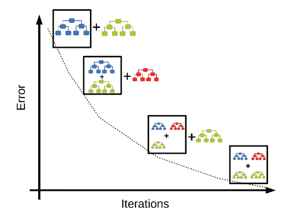
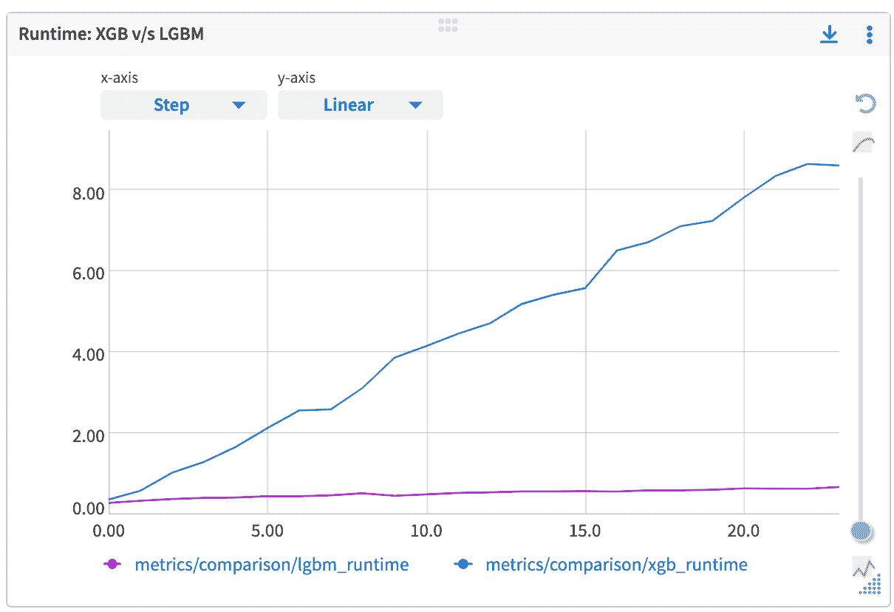
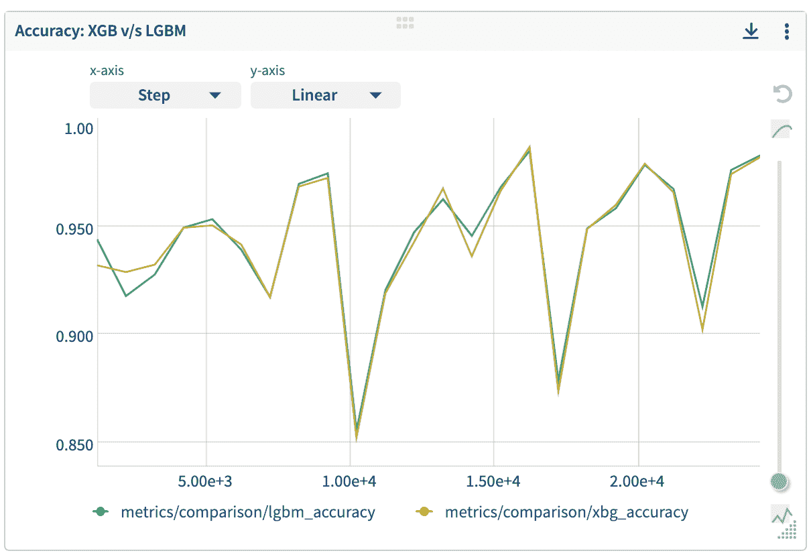

# XGBoost 与 LightGBM:它们有什么不同

> 原文：<https://web.archive.org/web/https://neptune.ai/blog/xgboost-vs-lightgbm>

近年来，由多个社区提供的梯度推进机器及其变体获得了很大的吸引力。这主要是由于与产品和机器学习竞赛中的其他机器学习算法相比，决策树在性能上有所提高。

XGBoost 和 LightGBM 是基于梯度增强机器的两种最流行的算法。虽然我们可能会进行反复试验来检查这两种算法中哪一种算法比另一种算法更有优势，但在选择它们时理解其原因和时间也很重要。

在这篇博客中，我们将回顾 XGBoost 和 LightGBM 之间的基本区别，以便在我们的机器学习实验中提供帮助。但是在我们深入研究算法之前，让我们快速了解一下梯度增强的基本概念，它是 XGBoost 和 LightGBM 的一部分。

## 什么是梯度增强？

梯度推进指的是机器学习中的一种方法，其中弱学习者的集合用于在效率、准确性和可解释性方面提高模型性能。这些学习者被定义为比随机机会有更好的表现。这种模型通常是决策树，它们的输出被组合以获得更好的总体结果。



*Gradient Boosting Algorithm | [Source](https://web.archive.org/web/20230304041933/https://medium.com/swlh/gradient-boosting-trees-for-classification-a-beginners-guide-596b594a14ea)*

假设是筛选出难以准确预测的实例，并开发新的弱学习器来处理它们。

对初始模型进行训练，并对整个数据集进行预测。计算实际值和预测值之间的误差，并对不正确的预测值给予更大的权重。随后，尝试修正先前模型的误差的新模型以及以类似方式创建的几个模型由此被创建。我们通过加权所有模型的平均值得到最终模型。

梯度提升可应用于以下情况:

1.  回归——取弱学习者输出的平均值
2.  分类–找到出现次数最多的类别预测

在企业和数据科学竞赛中广泛使用的一些最受欢迎的 boosting 算法是 XGBoost、LightGBM 和 CatBoost。一些数据科学从业者花费大量时间思考使用哪种算法，并经常以大量尝试告终。

由于 XGBoost 和 LightGBM 越来越受欢迎，我们将从实践的角度和一点点理论来探索这两者，以便更好地理解它们的优缺点。

## LightBGM 和 XGBoost:算法

### XGBoost

[XGBoost](https://web.archive.org/web/20230304041933/https://xgboost.readthedocs.io/en/stable/) (极限梯度提升)是一种专注于计算速度和模型性能的机器学习算法。它是由陈天琦介绍的，目前是 DMLC(分布式机器学习社区)的一个更广泛的工具包的一部分。该算法可用于回归和分类任务，并且设计用于处理大型复杂数据集。

该模型支持以下类型的升压:

*   由学习率控制的梯度增强
*   随机梯度提升，在每个分离级别的行、列或列利用子采样
*   使用 L1(拉索)和 L2(岭)正则化的正则化梯度增强

从系统性能的角度来看，其他一些特性包括:

*   使用一组机器训练一个使用[分布式计算](https://web.archive.org/web/20230304041933/https://docs.neptune.ai/how-to-guides/neptune-api/distributed-computing)的模型
*   在为并行化构建树的过程中，利用 CPU 的所有可用内核
*   处理不适合内存的数据集时的核外计算
*   通过高速缓存优化充分利用硬件

除了上述框架之外:

*   接受多种类型的输入数据
*   适用于树和线性增强器的稀疏输入数据
*   支持使用定制的目标和评估函数

### LightGBM

与 XGBoost 类似， [LightGBM](https://web.archive.org/web/20230304041933/https://lightgbm.readthedocs.io/en/latest/) (由微软开发)是一个分布式高性能框架，使用决策树进行排序、分类和回归任务。

其优点如下:

*   LightGBM 是一种基于直方图的算法，可以对值进行分块(也需要较少的内存)，因此训练速度更快，精度更高
*   也与大型复杂数据集兼容，但在训练过程中速度更快
*   支持并行学习和 GPU 学习

与 XGBoost 中的水平增长相反，LightGBM 执行分叶(垂直)增长，从而减少更多损耗，进而提高精度，同时速度更快。但是这也可能导致对训练数据的过拟合，这可以使用指定分裂将在哪里发生的最大深度参数来处理。因此，XGBoost 能够构建比 LightGBM 更健壮的模型。

## XGBoost 和 LightGBM 之间的结构差异

从我们到目前为止的讨论来看，这两种算法似乎都表现得相当不错。LightGBM 比 **XGBoost** 快得多，但性能几乎相当。我们可能会想，LightGBM 和 XGBoost 到底有什么区别？

在本文的这一部分，我们将讨论这两种算法之间的一些基本差异——叶生长、分类特征处理、缺失值处理以及各自的特征重要性方法。

### 叶子生长

**LightGBM** 具有更快的执行速度，并且能够保持良好的精度水平，这主要是由于利用了两种新技术:

**1。基于梯度的单侧采样(GOSS):**

*   在梯度提升决策树中，数据实例没有 GOSS 利用的原生权重。
*   梯度越大的数据实例对信息增益的贡献越大。
*   为了保持信息的准确性，GOSS 保留具有较大梯度的实例，并对具有较小梯度的实例执行随机采样。
*   我们可以在文章中进一步了解这个概念——[是什么让 LightGBM 快如闪电？](https://web.archive.org/web/20230304041933/https://towardsdatascience.com/what-makes-lightgbm-lightning-fast-a27cf0d9785e)
*   YouTube 频道机器学习大学也在 LightGBM 上发布了一个关于戈斯的[视频](https://web.archive.org/web/20230304041933/https://www.youtube.com/watch?v=NsCdkzi2soE&ab_channel=MachineLearningUniversity)。

**2。独家功能捆绑(EFB):**

*   EFB 是一种减少有效特征数量的接近无损的方法。
*   就像独热编码特征一样，在稀疏空间中，许多特征很少同时取非零值。
*   为了降低维度，提高效率，并保持准确性，EFB 捆绑了这些功能，这种捆绑被称为排他性功能捆绑。
*   [EFB 的这个](https://web.archive.org/web/20230304041933/https://datascience.stackexchange.com/questions/41907/lightgbm-why-exclusive-feature-bundling-efb)帖子和 [LightGBM 的论文](https://web.archive.org/web/20230304041933/https://proceedings.neurips.cc/paper/2017/file/6449f44a102fde848669bdd9eb6b76fa-Paper.pdf)可以参考，以获得更好的见解。

另一方面， **XGBoost** 使用预排序和基于直方图的算法来计算最佳分割，这是在 LightGBM 中用 GOSS 完成的。预分类拆分的工作方式如下:

1.  对于每个节点，枚举所有功能
2.  对于每个特性，按特性值对实例进行排序
3.  使用线性扫描，决定分割以及特征基础信息增益
4.  选择最佳分割解决方案以及所有功能

### 处理分类特征

LightGBM 和 XGBoost 都只接受数字特征。这意味着我们数据中的名义特征需要转换成数字特征。

假设我们想要预测它是“热”、“冷”还是“未知”，即 2、1 或 0。由于它们是分类特征并且没有排序(这意味着 1 大于 0 实际上不是正确的解释)，该算法需要避免比较两个值的大小，而更多地关注于创建相等的规则。

默认情况下，XGBoost 将这些变量视为有序的数值变量，我们不希望这样。相反，如果我们可以为每个分类值创建虚拟值(一键编码)，那么 XGboost 将能够正确地完成它的工作。但是对于更大的数据集，这是一个问题，因为编码需要更长的时间。

另一方面， **LightGBM** 接受一个参数来检查哪一列是分类列，并通过相等拆分来轻松处理这个问题。然而，H2O 库提供了 XGBoost 的实现，它支持分类特性的本地处理。

### 处理缺失值

这两种算法都通过将缺失值分配到每次分割中损失最少的一边来处理缺失值。

## 特征重要性方法

### 增益:

*   数据集中的每个要素在帮助构建精确模型时都具有某种重要性/权重。
*   增益是指特定特征在特定树的上下文中的相对贡献。
*   这也可以通过模型从特征中获得的相关信息的范围来理解，以便做出更好的预测。
*   有 XGBoost 和 LightGBM 两种版本。

### 分割/频率/重量:

*   Weight 的 split GBM 和 Frequency 或 Weight for XGBoost 方法计算特定特征在模型树的所有分割中出现的相对次数。这种方法的一个问题是，当分类特征中有大量类别时，它容易产生偏差。
*   有 XGBoost 和 LightGBM 两种版本。

### 覆盖范围:

*   每个要素的相对观测值数量。
*   仅在 XGBoost 中可用。

## XGBoost 和 LightGBM 之间的其他主要区别

### 处理部件

我们想要使用的算法通常取决于我们用于运行模型的处理单元的类型。虽然 XGBoost 在 GPU 上相对比 LightGBM 慢，但它在 CPU 上实际上更快。LightGBM 要求我们单独构建 GPU 发行版，而要在 GPU 上运行 XGBoost，我们需要在初始化模型时将“gpu_hist”值传递给“tree_method”参数。

当在能够访问 GPU 和强大 CPU 的机构中工作时，我们应该选择 XGBoost，因为它比 LightGBM 更具可伸缩性。但就个人而言，我认为 LightGBM 更有意义，因为节省下来的训练时间可以用于更好的实验和特性工程。我们可以训练我们的最终模型具有模型鲁棒性。

一个框架和维护它的社区一样好。就 [XGBoost](https://web.archive.org/web/20230304041933/https://xgboost.ai/community) 而言，它比 [LightGBM](https://web.archive.org/web/20230304041933/https://github.com/microsoft/LightGBM) 更容易使用，这完全是因为它背后强大的社区和无数有用资源的可用性。由于 LightGBM 仍然有一个较小的社区，当涉及到高级的问题和特性时，导航到解决方案变得有点困难。

### 证明文件

由于 XGBoost 已经存在了很长时间，并且是数据科学从业者最流行的算法之一，因此它非常容易使用，因为网上有大量关于它的文献。这可以是框架文档的形式，也可以是全球各种用户面临的错误/问题。

从高层次上看这两个产品时， [LightGBM 的文档](https://web.archive.org/web/20230304041933/https://lightgbm.readthedocs.io/en/latest/)感觉非常全面。但与此同时， [XGBoost 的文档](https://web.archive.org/web/20230304041933/https://xgboost.readthedocs.io/en/stable/)给人的感觉非常结构化，在我看来，与 LightGBM 经常冗长的文档相比，它更容易阅读和理解，当然，这并不是交易破坏者，因为它们都在不断改进。

## 重要超参数

基于决策树的算法可能很复杂，并且容易过度拟合。根据数据可用性和各种统计指标，我们可以对数据有一个总体的了解，对我们来说，进行正确的超参数调整变得很重要。

由于超参数调优/优化本身是一个广泛的话题，在下面的小节中，我们将致力于全面了解 XGBoost 和 LightGBM 的一些重要超参数。

### XGBoost 参数

以下是最重要的 XGBoost 参数:

1.  ***n_estimators【默认 100】–***集合中的树的数量。较高的值意味着更多的弱学习者对最终输出有贡献，但是增加它会显著减慢训练时间。
2.  ***max_depth【默认 3】–***该参数决定了算法的复杂度。分配的值越小，算法选择大多数模式的能力就越低(欠拟合)。较大的值会使模型过于复杂并挑选出不能很好概括的模式(过度拟合)。
3.  ***min_child_weight【默认 1】–***我们知道，一个极深的树会因为过度拟合而产生很差的性能。min_child_weight 参数旨在通过限制树的深度来进行正则化。因此，此参数的值越高，模型过度拟合训练数据的可能性就越低。
4.  ***learning_rate/ eta【默认 0.3】–***模型的学习速率与模型的精度成反比。降低学习率，虽然训练起来比较慢，但是提高了模型寻找模式并学习它们的能力。如果该值太低，则会增加模型收敛的难度。
5.  ***gamma/ min_split_loss【默认 0】–***这是一个正则化参数，范围可以从 0 到无穷大。该值越高，正则化的强度就越高，过度拟合的可能性就越低(但如果太大，可能会欠拟合)。因此，该参数在所有类型的数据集之间都有所不同。
6.  ***col sample _ bytree[default 1.0]–***该参数指示算法在训练期间用于一棵树的特征/预测因子总数的分数。这意味着每棵树可以使用不同的特征集进行预测，从而减少过度拟合的机会，并且还提高了训练的速度，因为不是所有的特征都在每棵树中使用。该值的范围从 0 到 1。
7.  ***子样本[默认值 1.0]–***与 colsample_bytree 类似，子样本参数指示算法在训练期间用于树的实例总数的分数。这也减少了过度适应的机会，并改善了训练时间。

点击查看更多参数[。](https://web.archive.org/web/20230304041933/https://xgboost.readthedocs.io/en/stable/parameter.html)

### LightGBM 参数

以下是最重要的 LightGBM 参数:

1.  ***max _ depth-***与 XGBoost 类似，该参数指示树木不能生长超过指定的深度。较高的值会增加模型过度拟合的机会。
2.  ***num _ leaves—***这个参数在控制树的复杂度方面非常重要。该值应该小于 2^(max_depth ),因为对于给定数量的叶子，逐叶树比深度树更深。因此，较高的值会导致过度拟合。
3.  ***min _ data _ in _ leaf-***该参数用于控制过拟合。较高的值可以阻止树长得太深，但也会导致算法学习得更少(欠拟合)。根据 LightGBM 的官方文档，作为一种最佳实践，它应该设置为数百或数千。
4.  ***feature _ fraction—***类似于 XGBoost 中的 *colsample_bytree*
5.  ***bagging _ fraction—***类似于 XGBoost 中的*子样本*

点击查看更多参数[。](https://web.archive.org/web/20230304041933/https://lightgbm.readthedocs.io/en/latest/Parameters.html)

## 模型性能和训练时间之间的权衡

当使用机器学习模型时，实验阶段涉及的一个重要方面是训练复杂模型的资源的基线要求。虽然有些人可能可以使用一些很棒的硬件，但人们通常对他们可以使用的东西有所限制。

让我们快速虚拟数据集，样本大小从 1，000 一直到 20，000 个样本。我们将从每个虚拟数据集抽取 20%的测试规模来衡量模型性能。对于每一次具有 1000 个样本的不同样本大小的迭代，我们想要检查与 LightGBM 分类器相比，XGBoost 分类器训练所花费的时间。

```
import neptune.new as neptune

from xgboost import XGBClassifier
from lightgbm import LGBMClassifier

from sklearn.model_selection import train_test_split
from sklearn.metrics import accuracy_score
from sklearn.datasets import make_classification

import time
from tqdm.notebook import tqdm

run = neptune.init(
   project="common/xgboost-integration",
   api_token="ANONYMOUS",
   name="xgb-train",
   tags=["xgb-integration", "train"],
)

min_samples = 1000
max_samples = 20000
step = 1000

for sample_size in tqdm(range(int(min_samples/0.8),
                             int(max_samples/0.8),
                             step)):
  xgb_dummy = XGBClassifier(seed=47)
 lgbm_dummy = LGBMClassifier(random_sate=47)

 run['metrics/comparison/sample_size'].log(sample_size)

 dummy = make_classification(n_samples=sample_size)

 X_train, X_test, y_train, y_test = train_test_split(dummy[0],
                                                     dummy[1],
                                                     test_size=0.2,
                                                     stratify=dummy[1])

 start = time.time()
 xgb_dummy.fit(X_train, y_train)
 end = time.time()

 run['metrics/comparison/xgb_runtime'].log(end-start)

 run['metrics/comparison/xbg_accuracy'].log(
     accuracy_score(y_test, xgb_dummy.predict(X_test)),
     step=sample_size)

 start = time.time()
 lgbm_dummy.fit(X_train, y_train)
 end = time.time()

 run['metrics/comparison/lgbm_runtime'].log(end-start)

 run['metrics/comparison/lgbm_accuracy'].log(
     accuracy_score(y_test, lgbm_dummy.predict(X_test)),
     step=sample_size)

run.stop()

```

我们能够记录每个样本大小的运行时间和准确性指标，Neptune 会自动生成图表以供参考。要运行代码，可以参考这个 [Google Colab 笔记本](https://web.archive.org/web/20230304041933/https://colab.research.google.com/drive/1Rfdb3QH30f5dcRkCI7ESPt4VCJn8rGvg?usp=sharing)。

海王星仪表板是一种简单的方法，可以将我们项目的所有结果结合起来，最终进行比较研究。出于这篇博客的目的，我比较了这两种算法的运行时间以及它们各自的性能。



*Comparing XGBoost runtime against LightGBM’s runtime |* [*Dashboard*](https://web.archive.org/web/20230304041933/https://app.neptune.ai/sumit.saha666/XGBoost-vs-LightGBM/e/XGBLGBM-1/dashboard/XGBoost-v-s-LightGBM-9ca800dc-099c-4f3f-9aee-ff0d7aa46cc7)

从图中我们可以看到 **XGBoost** 的训练时间随着样本量的增加几乎呈线性增加。另一方面， **LightGBM** 所需的训练时间只是其竞争者的一小部分。有意思！

但是各自的模特表演呢？让我们检查在所有这些不同的样本量下，两个模型之间的准确度分数之间的差距。



*Comparing XGoost’s model performance against LightGBM’s model performance |* [*Dashboard*](https://web.archive.org/web/20230304041933/https://app.neptune.ai/sumit.saha666/XGBoost-vs-LightGBM/e/XGBLGBM-1/dashboard/XGBoost-v-s-LightGBM-9ca800dc-099c-4f3f-9aee-ff0d7aa46cc7)

从上面的图表中，我们看到了一个非常令人惊讶的结果。两种模型的准确度分数是一致的。结果表明，LightGBM 不仅速度更快，而且在模型性能方面也没有太大的妥协。那么这是否意味着我们可以抛弃 XGBoost 而使用 LightGBM 呢？

这一切都归结于硬件资源和带宽的可用性来解决问题。虽然 **LightGBM** 与 XGBoost 相比，在一段时间内提供了良好的性能，但是它仍然需要改进的是文档和社区力量。此外，如果硬件可用，因为 **XGBoost** 的伸缩性更好，如前所述，我们可以使用 LightGBM 进行训练，了解所需的参数，并将最终模型训练为 XGBoost 模型。

## 摘要

梯度增强决策树是机器学习算法中最受欢迎的选择之一。基于 GBDTs 的 XGBoost 和 LightGBM 在企业应用和数据科学竞赛中都取得了巨大的成功。

以下是我们比较的要点:

*   在 XGBoost 中，树是沿深度方向生长的，而在 LightGBM 中，树是沿叶方向生长的，这是两个框架的根本区别。
*   XGBoost 有大量的用户支持，这些用户以文档和问题解决方案的形式提供了丰富的文献。而 LightGBM 还没有达到这样的文档级别。
*   这两种算法在模型性能方面表现相似，但 LightGBM 训练只需 XGBoost 所需时间的一小部分。
*   LightGBM 中的快速训练使其成为机器学习实验的首选。
*   XGBoost 需要大量资源来训练大量数据，这使得它成为大多数企业的一个可访问选项，而 LightGBM 是轻量级的，可以在中等硬件上使用。
*   LightGBM 提供了传递被视为类别的特性名称的选项，并通过相等分割来轻松处理这个问题。
*   H2O 的 XGBoost 实现也提供了 XGBoost 原始库还没有提供的上述特性。
*   超参数调整在这两种算法中都非常重要。

这两种算法都在输出模型性能方面设定了黄金标准，完全由用户根据分类特征的性质和数据的大小进行选择。

### 参考

1.  [https://xgboost.readthedocs.io/en/stable/](https://web.archive.org/web/20230304041933/https://xgboost.readthedocs.io/en/stable/)
2.  [https://lightgbm.readthedocs.io/en/latest/](https://web.archive.org/web/20230304041933/https://lightgbm.readthedocs.io/en/latest/)
3.  [https://docs . Neptune . ai/integrations-and-supported-tools/model-training/light GBM](https://web.archive.org/web/20230304041933/https://docs.neptune.ai/integrations-and-supported-tools/model-training/lightgbm)
4.  [https://docs . Neptune . ai/integrations-and-supported-tools/model-training/XG boost](https://web.archive.org/web/20230304041933/https://docs.neptune.ai/integrations-and-supported-tools/model-training/xgboost)
5.  [https://docs . Neptune . ai/you-should-know/what-can-you-log-and-display](https://web.archive.org/web/20230304041933/https://docs.neptune.ai/you-should-know/what-can-you-log-and-display)